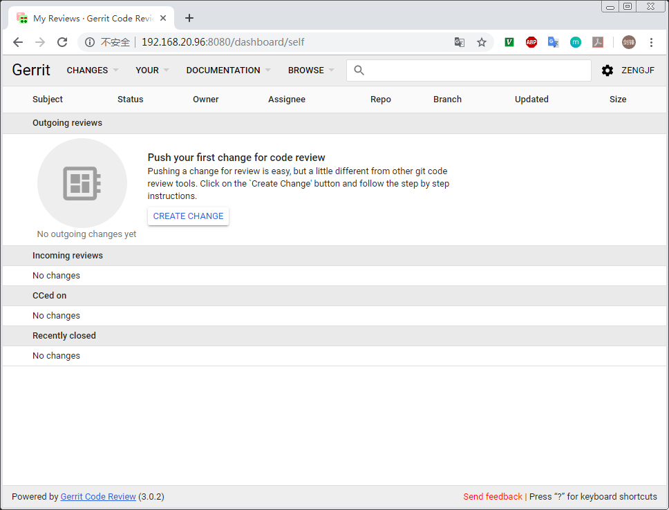
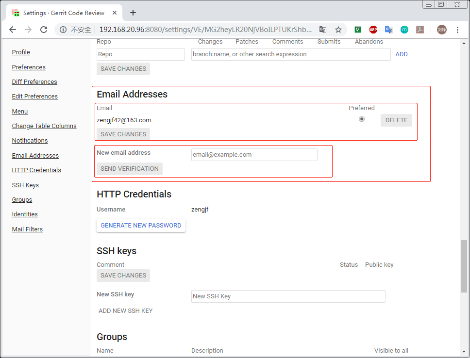
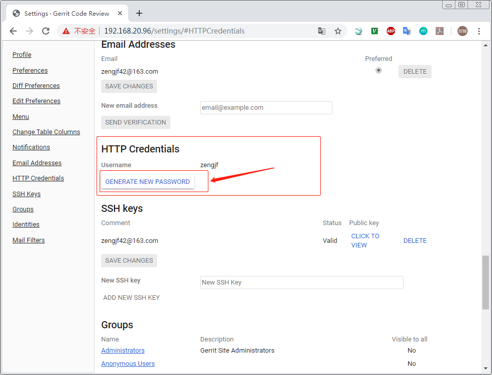
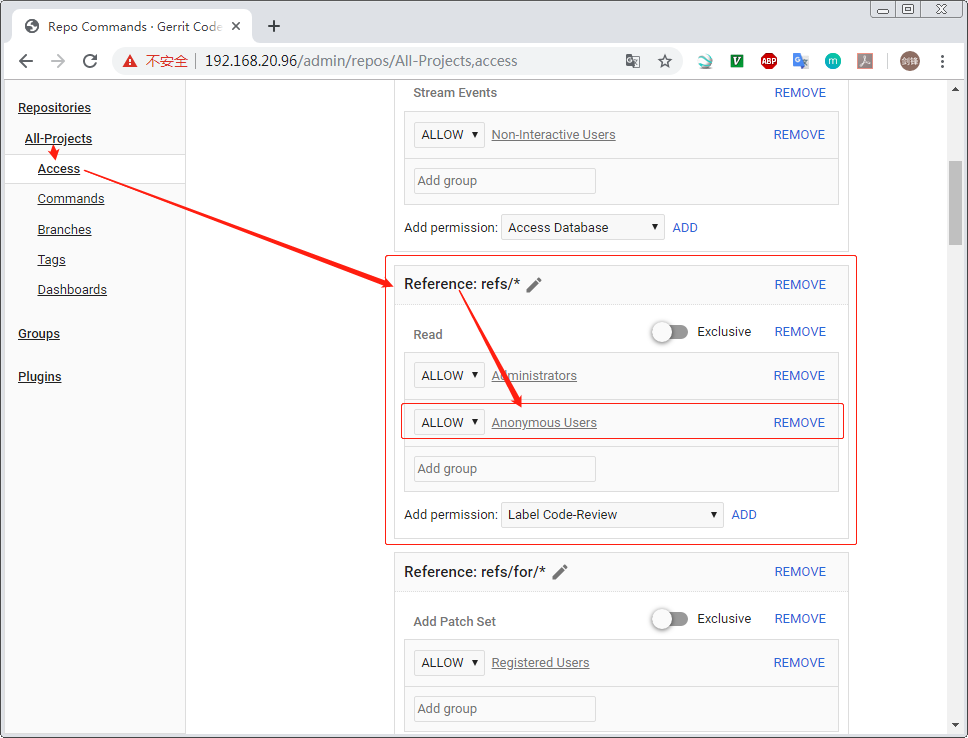
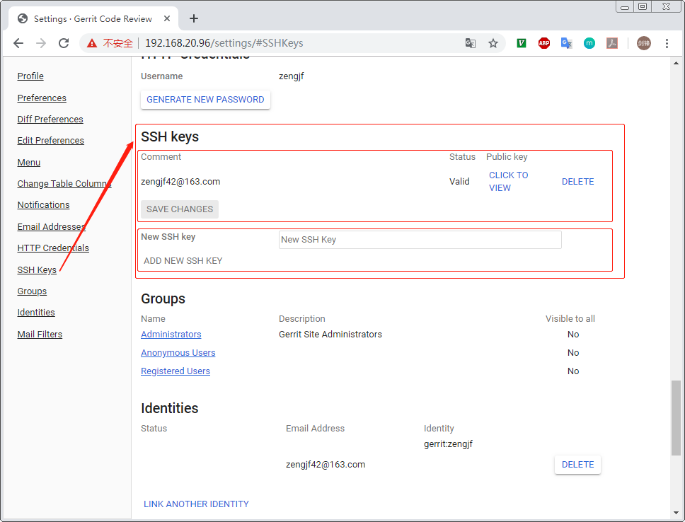
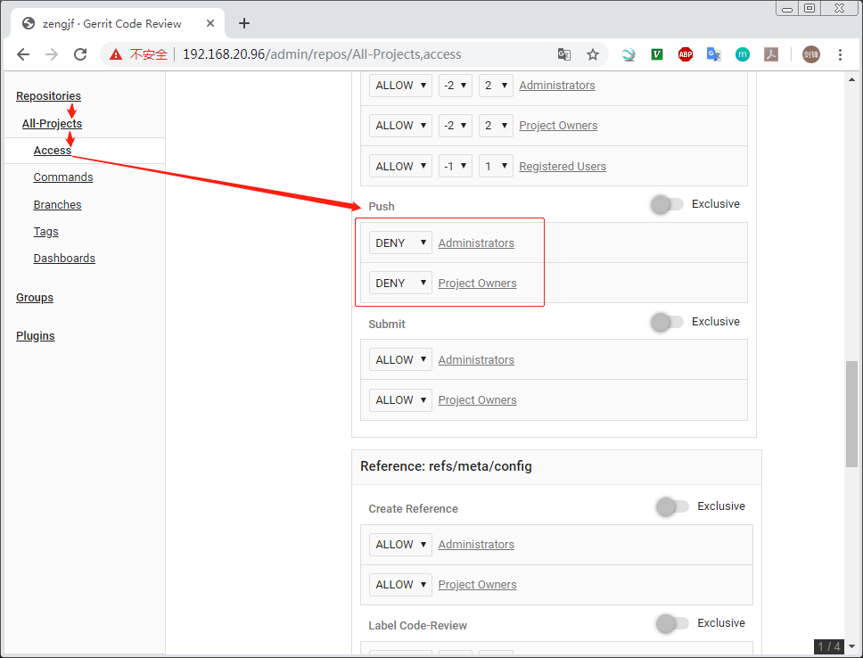
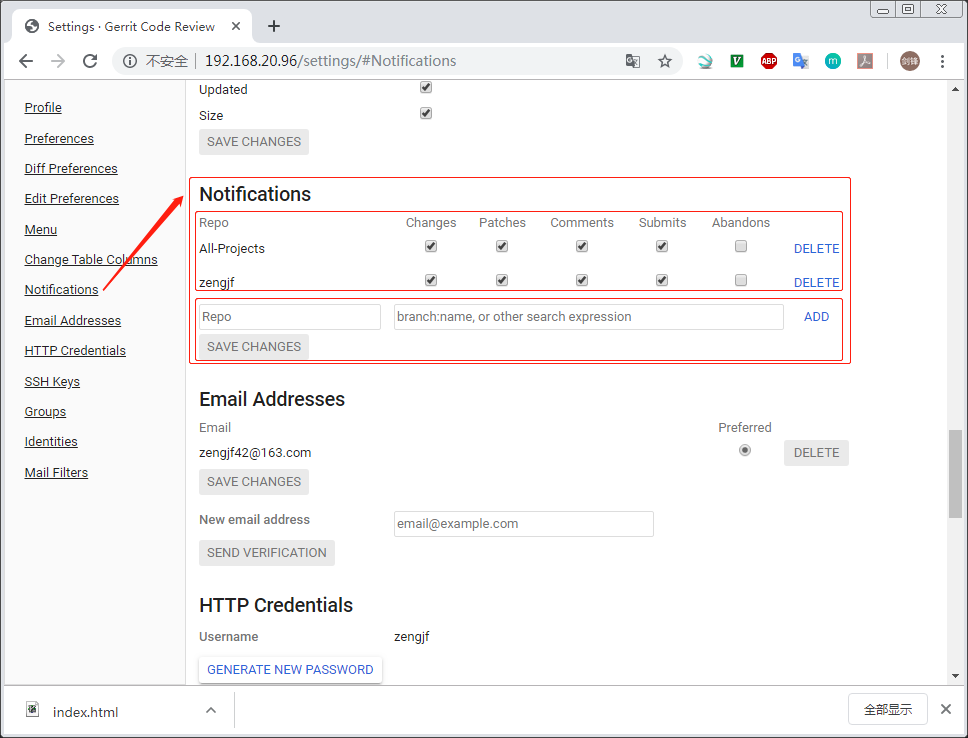
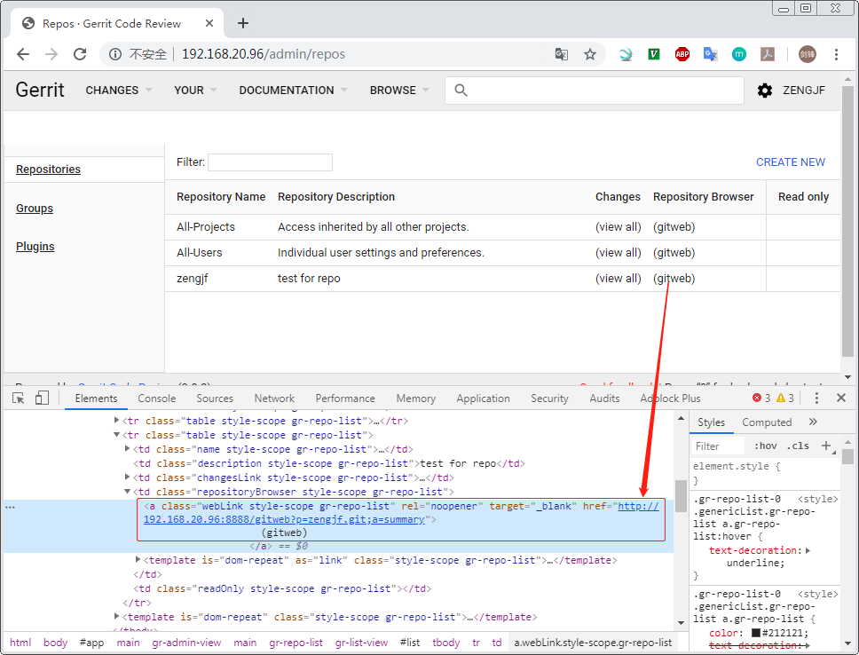
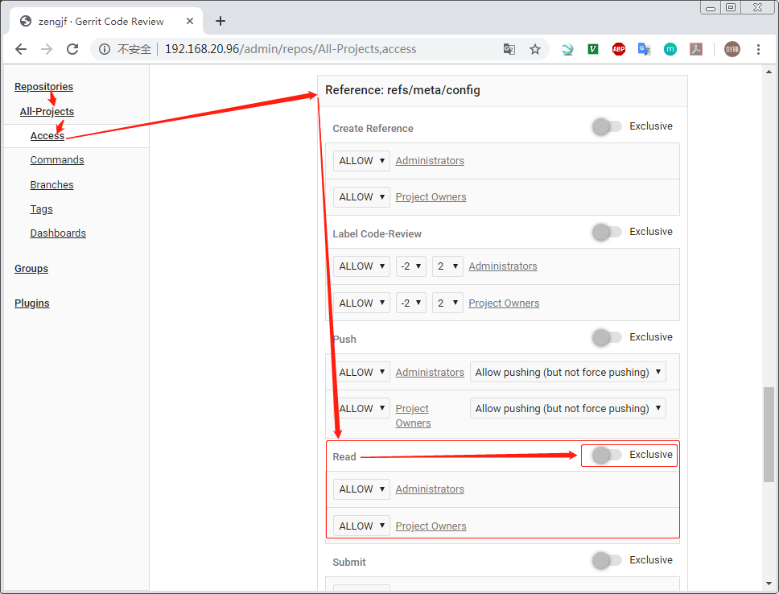
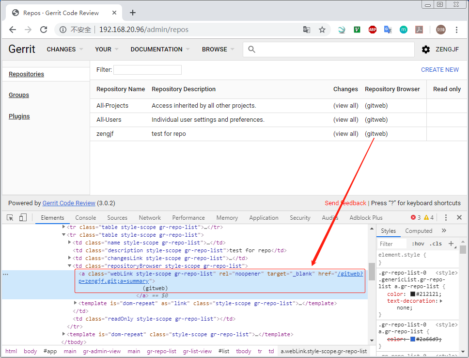

# Gerrit

## 简介

Gerrit是Google为Android系统研发量身定制的一套免费开源的代码审核系统，它在传统的源码管理协作流程中强制性引入代码审核机制，通过人工代码审核和自动化代码验证过程，将不符合要求的代码屏蔽在代码库之外，确保核心代码多人校验、多人互备和自动化构建核验。



**注意：调试的时候用的局域网，浏览器用的是Chrome，如果你的Chrome插件使用了代理（科学上网），请使用无痕窗口访问或者关闭代理访问，建议暂时关闭代理调试，否则无法收到http认证窗口；**


## 参考文档

* [Ubuntu + Gerrit + Apache 搭建代码审核服务器](http://chuquan.me/2017/12/12/ubuntu-gerrit-apache/)
* [gerrit init及邮箱配置](https://blog.csdn.net/zwwjs/article/details/8736314)
* [Gerrit Code Review - Configuration](https://gerrit-review.googlesource.com/Documentation/config-gerrit.html)
* [How to push change to gerrit server via http?](https://stackoverflow.com/questions/14320817/how-to-push-change-to-gerrit-server-via-http)
* [Gerrit authentication: how to disable anonymous user](https://stackoverflow.com/questions/19241341/gerrit-authentication-how-to-disable-anonymous-user)
* [How to disable direct push to Gerrit?](https://stackoverflow.com/questions/15654184/how-to-disable-direct-push-to-gerrit)
* [Issue 7347: Error launching gerrit with Java 1.9](https://bugs.chromium.org/p/gerrit/issues/detail?id=7347)
* [Issue 7843: Gerrit 2.14.5.1 fails to start with Java version above 8](https://bugs.chromium.org/p/gerrit/issues/detail?id=7843)

## Apache

* [0047_HTTP_Auth.md](0047_HTTP_Auth.md)
* `cat /etc/apache2/sites-available/000-default.conf`
  ```
  <VirtualHost *:80>
          # The ServerName directive sets the request scheme, hostname and port that
          # the server uses to identify itself. This is used when creating
          # redirection URLs. In the context of virtual hosts, the ServerName
          # specifies what hostname must appear in the request's Host: header to
          # match this virtual host. For the default virtual host (this file) this
          # value is not decisive as it is used as a last resort host regardless.
          # However, you must set it for any further virtual host explicitly.
          #ServerName www.example.com
          ServerName 192.168.20.96
  
          # ServerAdmin webmaster@localhost
          # DocumentRoot /var/www/html
  
          # Available loglevels: trace8, ..., trace1, debug, info, notice, warn,
          # error, crit, alert, emerg.
          # It is also possible to configure the loglevel for particular
          # modules, e.g.
          #LogLevel info ssl:warn
  
          ErrorLog ${APACHE_LOG_DIR}/error.log
          CustomLog ${APACHE_LOG_DIR}/access.log combined
  
          # For most configuration files from conf-available/, which are
          # enabled or disabled at a global level, it is possible to
          # include a line for only one particular virtual host. For example the
          # following line enables the CGI configuration for this host only
          # after it has been globally disabled with "a2disconf".
          #Include conf-available/serve-cgi-bin.conf
  
          <Location /login/>
                    AuthType Basic
                    AuthName "Gerrit Code Review"
                    AuthUserFile /etc/apache2/htpasswd
                    Require valid-user
          </Location>
  
          ProxyRequests Off
          ProxyVia Off
          ProxyPreserveHost On
  
          <Proxy *>
                    Order deny,allow
                    Allow from all
          </Proxy>
  
          AllowEncodedSlashes On
          ProxyPass / http://192.168.20.96:8080/
  </VirtualHost>
  
  # vim: syntax=apache ts=4 sw=4 sts=4 sr noet
  ```

## git/OpenJDK Version

* `java --version`
  ```Console
  gerrit@raspberrypi:~ $ apt-cache search openjdk-8
  libreoffice - office productivity suite (metapackage)
  openjdk-8-dbg - Java runtime based on OpenJDK (debugging symbols)
  openjdk-8-demo - Java runtime based on OpenJDK (demos and examples)
  openjdk-8-doc - OpenJDK Development Kit (JDK) documentation
  openjdk-8-jdk - OpenJDK Development Kit (JDK)
  openjdk-8-jdk-headless - OpenJDK Development Kit (JDK) (headless)
  openjdk-8-jre - OpenJDK Java runtime, using Hotspot JIT
  openjdk-8-jre-headless - OpenJDK Java runtime, using Hotspot JIT (headless)
  openjdk-8-jre-zero - Alternative JVM for OpenJDK, using Zero/Shark
  openjdk-8-source - OpenJDK Development Kit (JDK) source files
  gerrit@raspberrypi:~ $ sudo update-alternatives --config java
  [sudo] password for gerrit:
  There are 2 choices for the alternative java (providing /usr/bin/java).
  
    Selection    Path                                            Priority   Status
  ------------------------------------------------------------
    0            /usr/lib/jvm/java-11-openjdk-armhf/bin/java      1111      auto mode
    1            /usr/lib/jvm/java-11-openjdk-armhf/bin/java      1111      manual mode
  * 2            /usr/lib/jvm/java-8-openjdk-armhf/jre/bin/java   1081      manual mode
  
  Press <enter> to keep the current choice[*], or type selection number: 2
  ```
* `git --version`
  ```
  git version 2.20.1
  ```

## 添加用户

* `sudo adduser gerrit`
* `sudo usermod -a -G sudo gerrit`
* `sudo su gerrit`

## netstat

* `netstat -anpt`
  ```
  (Not all processes could be identified, non-owned process info
   will not be shown, you would have to be root to see it all.)
  Active Internet connections (servers and established)
  Proto Recv-Q Send-Q Local Address           Foreign Address         State       PID/Program name
  tcp        0      0 0.0.0.0:22              0.0.0.0:*               LISTEN      -
  tcp        0      0 127.0.0.1:6010          0.0.0.0:*               LISTEN      -
  tcp        0      0 0.0.0.0:1883            0.0.0.0:*               LISTEN      -
  tcp        0      0 0.0.0.0:5900            0.0.0.0:*               LISTEN      -
  tcp        0      0 127.0.0.1:39261         127.0.0.1:45262         ESTABLISHED -
  tcp        0    224 192.168.20.96:22        192.168.10.26:10649     ESTABLISHED -
  tcp        0      0 127.0.0.1:45262         127.0.0.1:39261         ESTABLISHED -
  tcp        1      0 192.168.20.96:38754     192.168.20.96:8080      CLOSE_WAIT  -
  tcp        1      0 192.168.20.96:38752     192.168.20.96:8080      CLOSE_WAIT  -
  tcp6       0      0 192.168.20.96:8080      :::*                    LISTEN      6415/GerritCodeRevi
  tcp6       0      0 :::80                   :::*                    LISTEN      -
  tcp6       0      0 :::22                   :::*                    LISTEN      -
  tcp6       0      0 ::1:6010                :::*                    LISTEN      -
  tcp6       0      0 :::1883                 :::*                    LISTEN      -
  tcp6       0      0 :::29418                :::*                    LISTEN      6415/GerritCodeRevi
  tcp6       0      0 :::5900                 :::*                    LISTEN      -
  ```

## gerrit-3.0.2 install

* `sudo apt-get install git git-core gitweb`
* `sudo su gerrit`
* `wget https://gerrit-releases.storage.googleapis.com/gerrit-3.0.2.war`
* `java -jar gerrit-3.0.2.war init -d review_site`
  ```
  Using secure store: com.google.gerrit.server.securestore.DefaultSecureStore
  [2019-10-22 01:19:22,548] [main] INFO  com.google.gerrit.server.config.GerritServerConfigProvider : No /home/gerrit/review_site/etc/gerrit.config; assuming defaults
  
  *** Gerrit Code Review 3.0.2
  ***
  
  Create '/home/gerrit/review_site' [Y/n]?
  
  *** Git Repositories
  ***
  
  Location of Git repositories   [git]:
  
  *** Index
  ***
  
  Type                           [lucene/?]:
  
  *** User Authentication
  ***
  
  Authentication method          [openid/?]: http
  Get username from custom HTTP header [y/N]?
  SSO logout URL                 :
  Enable signed push support     [y/N]?
  
  *** Review Labels
  ***
  
  Install Verified label         [y/N]?
  
  *** Email Delivery
  ***
  
  SMTP server hostname           [localhost]:
  SMTP server port               [(default)]:
  SMTP encryption                [none/?]:
  SMTP username                  :
  
  *** Container Process
  ***
  
  Run as                         [gerrit]:
  Java runtime                   [/usr/lib/jvm/java-8-openjdk-armhf/jre]:
  Copy gerrit-3.0.2.war to review_site/bin/gerrit.war [Y/n]?
  Copying gerrit-3.0.2.war to review_site/bin/gerrit.war
  
  *** SSH Daemon
  ***
  
  Listen on address              [*]:
  Listen on port                 [29418]:
  
  Generating SSH host key ... rsa... ed25519... ecdsa 256... ecdsa 384... ecdsa 521... done
  
  *** HTTP Daemon
  ***
  
  Behind reverse proxy           [y/N]? Use SSL (https://)             [y/N]?
  Listen on address              [*]:
  Listen on port                 [8080]:
  Canonical URL                  [http://raspberrypi:8080/]:
  
  *** Cache
  ***
  
  
  *** Plugins
  ***
  
  Installing plugins.
  Install plugin codemirror-editor version v3.0.2 [y/N]?
  Install plugin commit-message-length-validator version v3.0.2 [y/N]?
  Install plugin delete-project version v3.0.2 [y/N]?
  Install plugin download-commands version v3.0.2 [y/N]?
  Install plugin gitiles version v3.0.2 [y/N]?
  Install plugin hooks version v3.0.2 [y/N]?
  Install plugin plugin-manager version v3.0.2 [y/N]?
  Install plugin replication version v3.0.2 [y/N]?
  Install plugin reviewnotes version v3.0.2 [y/N]?
  Install plugin singleusergroup version v3.0.2 [y/N]?
  Install plugin webhooks version v3.0.2 [y/N]?
  Initializing plugins.
  No plugins found with init steps.
  
  Initialized /home/gerrit/review_site
  Reindexing projects:    100% (2/2) with: reindex --site-path review_site --threads 1 --index projects
  Reindexed 2 documents in projects index in 0.2s (11.8/s)
  Warning: InterruptedException
  java.lang.InterruptedException
          at java.lang.Object.wait(Native Method)
          at java.lang.Thread.join(Thread.java:1260)
          at org.h2.util.MathUtils.getSecureRandom(MathUtils.java:105)
          at org.h2.util.MathUtils.secureRandomBytes(MathUtils.java:307)
          at org.h2.store.FileLock.setUniqueId(FileLock.java:315)
          at org.h2.store.FileLock.lockFile(FileLock.java:345)
          at org.h2.store.FileLock.lock(FileLock.java:136)
          at org.h2.engine.Database.open(Database.java:622)
          at org.h2.engine.Database.openDatabase(Database.java:260)
          at org.h2.engine.Database.<init>(Database.java:254)
          at org.h2.engine.Engine.openSession(Engine.java:57)
          at org.h2.engine.Engine.openSession(Engine.java:164)
          at org.h2.engine.Engine.createSessionAndValidate(Engine.java:142)
          at org.h2.engine.Engine.createSession(Engine.java:125)
          at org.h2.engine.Engine.createSession(Engine.java:27)
          at org.h2.engine.SessionRemote.connectEmbeddedOrServer(SessionRemote.java:331)
          at org.h2.jdbc.JdbcConnection.<init>(JdbcConnection.java:107)
          at org.h2.jdbc.JdbcConnection.<init>(JdbcConnection.java:91)
          at org.h2.Driver.connect(Driver.java:74)
          at com.google.gerrit.server.cache.h2.H2CacheImpl$SqlHandle.<init>(H2CacheImpl.java:634)
          at com.google.gerrit.server.cache.h2.H2CacheImpl$SqlStore.acquire(H2CacheImpl.java:602)
          at com.google.gerrit.server.cache.h2.H2CacheImpl$SqlStore.buildBloomFilter(H2CacheImpl.java:328)
          at com.google.gerrit.server.cache.h2.H2CacheImpl$SqlStore.open(H2CacheImpl.java:300)
          at com.google.gerrit.server.cache.h2.H2CacheImpl.start(H2CacheImpl.java:188)
          at com.google.gerrit.server.logging.LoggingContextAwareRunnable.run(LoggingContextAwareRunnable.java:83)
          at java.util.concurrent.ThreadPoolExecutor.runWorker(ThreadPoolExecutor.java:1149)
          at java.util.concurrent.ThreadPoolExecutor$Worker.run(ThreadPoolExecutor.java:624)
          at java.lang.Thread.run(Thread.java:748)
  Executing /home/gerrit/review_site/bin/gerrit.sh start
  Starting Gerrit Code Review: WARNING: Could not adjust Gerrit's process for the kernel's out-of-memory killer.
           This may be caused by /home/gerrit/review_site/bin/gerrit.sh not being run as root.
           Consider changing the OOM score adjustment manually for Gerrit's PID=18999 with e.g.:
           echo '-1000' | sudo tee /proc/18999/oom_score_adj
  OK
  Waiting for server on raspberrypi:8080 ... OK
  Opening http://raspberrypi:8080/#/admin/projects/ ...MobaXterm X11 proxy: Unsupported authorisation protocol
  FAILED
  Open Gerrit with a JavaScript capable browser:
    http://raspberrypi:8080/#/admin/projects/
  ```
* `cat review_site/etc/gerrit.config`
  ```
  [gerrit]
          basePath = git
          canonicalWebUrl = http://192.168.20.96:8080/
          serverId = 614f98c4-cb18-4c15-b841-4b63ecac6487
  [container]
          javaOptions = "-Dflogger.backend_factory=com.google.common.flogger.backend.log4j.Log4jBackendFactory#getInstance"
          javaOptions = "-Dflogger.logging_context=com.google.gerrit.server.logging.LoggingContext#getInstance"
          user = gerrit
          javaHome = /usr/lib/jvm/java-8-openjdk-armhf/jre
  [index]
          type = LUCENE
  [auth]
          type = HTTP
  [receive]
          enableSignedPush = false
  [sendemail]
          enable = true
          smtpServer = smtp.163.com
          smtpServerPort = 25
          smtpUser = zengjf42@163.com
          smtpPass = zjf199042zjf
          sslVerify = false
          from = Code Review <zengjf42@163.com>
  [sshd]
          listenAddress = *:29418
  [httpd]
          listenUrl = proxy-http://192.168.20.96:8080/
  [cache]
          directory = cache
  [container]
      startupTimeout = 900
  [gitweb]
          cgi = /usr/share/gitweb/gitweb.cgi
  ```
* `./review_site/bin/gerrit.sh restart`
  ```
  Stopping Gerrit Code Review: OK
  Starting Gerrit Code Review: WARNING: Could not adjust Gerrit's process for the kernel's out-of-memory killer.
           This may be caused by /home/gerrit/./review_site/bin/gerrit.sh not being run as root.
           Consider changing the OOM score adjustment manually for Gerrit's PID=6415 with e.g.:
           echo '-1000' | sudo tee /proc/6415/oom_score_adj
  OK
  ```
* 如果存在问题，请查看log：`review_site/logs/`


## Email

* `cat review_site/etc/gerrit.config`
  ```
  [...省略]
  [sendemail]
          enable = true
          smtpServer = smtp.163.com
          smtpServerPort = 25
          smtpUser = zengjf42@163.com
          smtpPass =  <your smtp passwd>
          sslVerify = false
          from = Code Review <zengjf42@163.com>
  [...省略]
  ```
* gerrit Email  
  
* Email Verification  
  


## git clone

* http：默认支持匿名clone、pull，但需要用内部生成的密码进行push
  * git clone http://192.168.20.96/zengjf.git
  * git push http://zengjf@192.168.20.96/zengjf.git master
    * passwd: `eHdKJC8stzhnOYa6FYBJWac/kQ3JkvqKDCGzw2zFzA`
    
  * 禁用匿名（anonymouse）访问：  
    
    * git clone http://zengjf@192.168.20.96/zengjf.git
* SSH key 
  
  * git clone ssh://zengjf@192.168.20.96:29418/zengjf.git
  * git push ssh://zengjf@192.168.20.96:29418/zengjf.git master


## Repo access control

* 一般不修改默认的All-Projects的访问权限，通过这里添加进行覆盖；  
  
* **master分支不允许直接提交**
  * https://www.gerritcodereview.com/intro-project-owner.html#references  
    Access rights in Gerrit are assigned on references (aka refs). Refs in Git exist in different namespaces, e.g. all branches normally exist under refs/heads/ and all tags under refs/tags/. In addition there are a number of special refs and magic refs. Access rights can be assigned on a concrete ref, e.g. refs/heads/master but also on ref patterns and regular expressions for ref names.  
    


## Change-Id

* `git push ssh://zengjf@192.168.20.96:29418/zengjf.git master:refs/for/master`
  ```
  Enumerating objects: 5, done.
  Counting objects: 100% (5/5), done.
  Delta compression using up to 2 threads
  Compressing objects: 100% (2/2), done.
  Writing objects: 100% (3/3), 297 bytes | 148.00 KiB/s, done.
  Total 3 (delta 0), reused 0 (delta 0)
  remote: Processing changes: refs: 1, done
  remote: ERROR: commit 4e6ecd3: missing Change-Id in message footer
  remote:
  remote: Hint: to automatically insert a Change-Id, install the hook:
  remote:   gitdir=$(git rev-parse --git-dir); scp -p -P 29418 zengjf@192.168.20.96:hooks/commit-msg ${gitdir}/hooks/
  remote: and then amend the commit:
  remote:   git commit --amend --no-edit
  remote: Finally, push your changes again
  remote:
  To ssh://192.168.20.96:29418/zengjf.git
   ! [remote rejected] master -> refs/for/master (commit 4e6ecd3: missing Change-Id in message footer)
  error: failed to push some refs to 'ssh://zengjf@192.168.20.96:29418/zengjf.git'
  ```
* `scp -p -P 29418 zengjf@192.168.20.96:hooks/commit-msg .git/hooks/`
  ```
  commit-msg 
  ```
* 重新`commit`
  ```Console
  $ git reset --hard 353c6f2ee1ae3125d6a40fc4a036c1ea63a99279
  HEAD is now at 353c6f2 update
  $ git add .
  $ git commit -m "id"
  [master 2e21773] id
   1 file changed, 1 insertion(+)
  $ git log
  commit 2e217737fa911eb34611a979a16bce93608acd67 (HEAD -> master)
  Author: ZengjfOS <zengjf42@163.com>
  Date:   Tue Oct 22 15:14:10 2019 +0800
  
      id
  
      Change-Id: I47e643f9d3f7a40de4da18b9539ce225e2b9af17
  commit 353c6f2ee1ae3125d6a40fc4a036c1ea63a99279
  Author: ZengjfOS <zengjf42@163.com>
  Date:   Tue Oct 22 15:01:02 2019 +0800
  
      update
  ```
* 重新`push`
  ```
  $ git push ssh://zengjf@192.168.20.96:29418/zengjf.git master:refs/for/master
  Enumerating objects: 5, done.
  Counting objects: 100% (5/5), done.
  Delta compression using up to 2 threads
  Compressing objects: 100% (2/2), done.
  Writing objects: 100% (3/3), 336 bytes | 336.00 KiB/s, done.
  Total 3 (delta 0), reused 0 (delta 0)
  remote: Processing changes: refs: 1, new: 1, done
  remote:
  remote: SUCCESS
  remote:
  remote:   http://192.168.20.96:8080/c/zengjf/+/41 id [NEW]
  remote:
  To ssh://192.168.20.96:29418/zengjf.git
   * [new branch]      master -> refs/for/master
  ```


## Add Watched Changes

* [Gerrit/watched projects](https://www.mediawiki.org/wiki/Gerrit/watched_projects)  
  


## gitweb

* gitweb.url
  * [0048_Gitweb.md](0048_Gitweb.md)
  * `cat review_site/etc/gerrit.config`
    ```
    [gerrit]
            basePath = git
            canonicalWebUrl = http://192.168.20.96:8080/
            serverId = 614f98c4-cb18-4c15-b841-4b63ecac6487
    [container]
            javaOptions = "-Dflogger.backend_factory=com.google.common.flogger.backend.log4j.Log4jBackendFactory#getInstance"
            javaOptions = "-Dflogger.logging_context=com.google.gerrit.server.logging.LoggingContext#getInstance"
            user = gerrit
            javaHome = /usr/lib/jvm/java-8-openjdk-armhf/jre
    [index]
            type = LUCENE
    [auth]
            type = HTTP
    [receive]
            enableSignedPush = false
    [sendemail]
            enable = true
            smtpServer = smtp.163.com
            smtpServerPort = 25
            smtpUser = zengjf42@163.com
            smtpPass = zjf199042zjf
            sslVerify = false
            from = Code Review <zengjf42@163.com>
    [sshd]
            listenAddress = *:29418
    [httpd]
            listenUrl = proxy-http://192.168.20.96:8080/
    [cache]
            directory = cache
    [container]
        startupTimeout = 900
    [gitweb]
            type = gitweb
            url = http://192.168.20.96:8888/gitweb
    ```
    
* gitweb.cgi
  * [[Gerrit] 解決Gerrit 2.5版本以上gitweb "404 no projects found"](http://qnworknote.blogspot.com/2013/08/gerrit-gerrit-25gitweb-404-no-projects.html)
    
  * `cat review_site/etc/gerrit.config`
    ```
    [gerrit]
            basePath = git
            canonicalWebUrl = http://192.168.20.96:8080/
            serverId = 614f98c4-cb18-4c15-b841-4b63ecac6487
    [container]
            javaOptions = "-Dflogger.backend_factory=com.google.common.flogger.backend.log4j.Log4jBackendFactory#getInstance"
            javaOptions = "-Dflogger.logging_context=com.google.gerrit.server.logging.LoggingContext#getInstance"
            user = gerrit
            javaHome = /usr/lib/jvm/java-8-openjdk-armhf/jre
    [index]
            type = LUCENE
    [auth]
            type = HTTP
    [receive]
            enableSignedPush = false
    [sendemail]
            enable = true
            smtpServer = smtp.163.com
            smtpServerPort = 25
            smtpUser = zengjf42@163.com
            smtpPass = zjf199042zjf
            sslVerify = false
            from = Code Review <zengjf42@163.com>
    [sshd]
            listenAddress = *:29418
    [httpd]
            listenUrl = proxy-http://192.168.20.96:8080/
    [cache]
            directory = cache
    [container]
        startupTimeout = 900
    [gitweb]
            type = gitweb
            # url = http://192.168.20.96:8888/gitweb
            cgi = /usr/lib/cgi-bin/gitweb.cgi
    ```
    

## Autorun at Boot time

* `cat review_site/bin/gerrit.sh`
  ```
  [...省略]
  # START_STOP_DAEMON
  #   If set to "0" disables using start-stop-daemon.  This may need to
  #   be set on SuSE systems.
  
  GERRIT_SITE=/home/gerrit/review_site/         # add gerrit install path
  
  if test -f /lib/lsb/init-functions ; then
    . /lib/lsb/init-functions
  fi
  [...省略]
  ```
* ``sudo ln -snf `pwd`/review_site/bin/gerrit.sh /etc/init.d/gerrit``
* `sudo ln -snf /etc/init.d/gerrit /etc/rcS.d/S90gerrit`