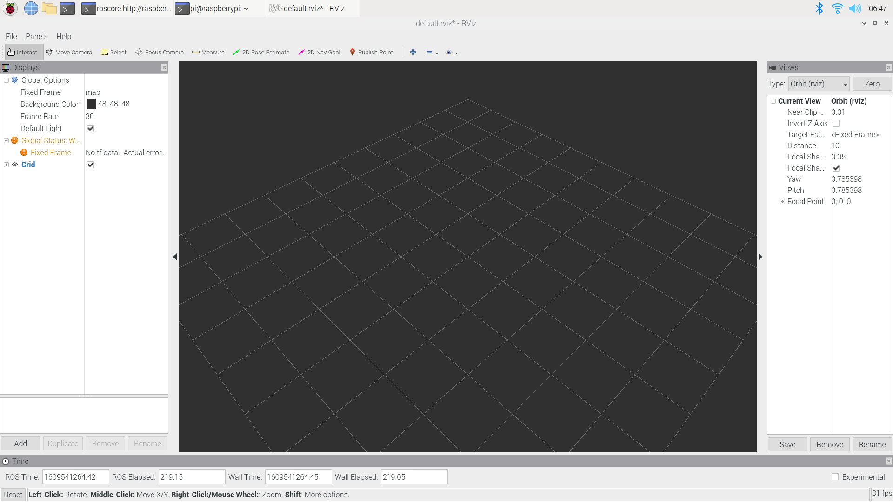

# ROS

ROS catkin和Linux Yocto是一个概念，组织管理ROS功能包

## 参考文档

* [在树莓派3上安装ROS](http://www.52pi.net/archives/918)
* [Installing ROS Kinetic on the Raspberry Pi](http://wiki.ros.org/ROSberryPi/Installing%20ROS%20Kinetic%20on%20the%20Raspberry%20Pi)

## ROS Distribution

* ROS Noetic Ninjemys
* ROS Melodic Morenia
  * 可以考虑这个版本
    * [Installing ROS Melodic on Raspberry Pi 4 and RPLIDAR A1M8](https://www.seeedstudio.com/blog/2019/08/01/installing-ros-melodic-on-raspberry-pi-4-and-rplidar-a1m8/)
* ROS Lunar Loggerhead
* ROS Kinetic Kame
  * 很多资料是这个版本
* ROS Jade Turtle

查看版本信息：`rosdep update`

```
reading in sources list data from /etc/ros/rosdep/sources.list.d
Hit https://raw.githubusercontent.com/ros/rosdistro/master/rosdep/osx-homebrew.yaml
Hit https://raw.githubusercontent.com/ros/rosdistro/master/rosdep/base.yaml
Hit https://raw.githubusercontent.com/ros/rosdistro/master/rosdep/python.yaml
Hit https://raw.githubusercontent.com/ros/rosdistro/master/rosdep/ruby.yaml
Hit https://raw.githubusercontent.com/ros/rosdistro/master/releases/fuerte.yaml
Query rosdistro index https://raw.githubusercontent.com/ros/rosdistro/master/index-v4.yaml
Skip end-of-life distro "ardent"
Skip end-of-life distro "bouncy"
Skip end-of-life distro "crystal"
Add distro "dashing"
Add distro "eloquent"
Add distro "foxy"
Skip end-of-life distro "groovy"
Skip end-of-life distro "hydro"
Skip end-of-life distro "indigo"
Skip end-of-life distro "jade"
Add distro "kinetic"
Skip end-of-life distro "lunar"
Add distro "melodic"
Add distro "noetic"
Add distro "rolling"
updated cache in /home/pi/.ros/rosdep/sources.cache
```

## steps

* `apt-cache search ros-base`
  ```
  libpam-krb5-migrate-heimdal - PAM module for migrating to Heimdal Kerberos
  libpam-krb5-migrate-mit - PAM module for migrating to MIT Kerberos
  libroscpp-core-dev - Development files for Robot OS roscpp-core
  ros-base - Python Robot OS base metapackage
  ros-base-dev - Robot OS base development metapackage
  ros-base-lisp-dev - Lisp Robot OS base development metapackage
  ros-base-python-dev - Python Robot OS base development metapackage
  ```
* `sudo apt-get install ros-base-python-dev`
* `sudo rosdep init`
  ```
  ERROR: cannot download default sources list from:
  https://raw.githubusercontent.com/ros/rosdistro/master/rosdep/sources.list.d/20-default.list
  Website may be down.
  ```
  * sudo vim /etc/hosts
    ```
    151.101.84.133  raw.githubusercontent.com
    ```
* `rosdep update`
  * 多次尝试，经常timeout
* `roscore`
  ```
  ... logging to /home/pi/.ros/log/c538ec6c-ebc2-11e9-bb8b-dca632174792/roslaunch-raspberrypi-10390.log
  Checking log directory for disk usage. This may take awhile.
  Press Ctrl-C to interrupt
  Done checking log file disk usage. Usage is <1GB.
  
  started roslaunch server http://raspberrypi:36077/
  ros_comm version 1.14.3
  
  
  SUMMARY
  ========
  
  PARAMETERS
   * /rosdistro: Debian
   * /rosversion: 1.14.3
  
  NODES
  
  auto-starting new master
  process[master]: started with pid [10426]
  ROS_MASTER_URI=http://raspberrypi:11311/
  
  setting /run_id to c538ec6c-ebc2-11e9-bb8b-dca632174792
  process[rosout-1]: started with pid [10443]
  started core service [/rosout]
  ```

## sample code

* listener.py
  ```python
  #!/usr/bin/env python
  
  import rospy
  from std_msgs.msg import String
  
  def callback(data):
      rospy.loginfo(rospy.get_caller_id() + 'I heard %s', data.data)
  
  def listener():
  
      # In ROS, nodes are uniquely named. If two nodes with the same
      # name are launched, the previous one is kicked off. The
      # anonymous=True flag means that rospy will choose a unique
      # name for our 'listener' node so that multiple listeners can
      # run simultaneously.
      rospy.init_node('listener', anonymous=True)
  
      rospy.Subscriber('chatter', String, callback)
  
      # spin() simply keeps python from exiting until this node is stopped
      rospy.spin()
  
  if __name__ == '__main__':
      listener()
  ```
* talker.py
  ```python
  #!/usr/bin/env python
  
  import rospy
  from std_msgs.msg import String
  
  def talker():
      pub = rospy.Publisher('chatter', String, queue_size=10)
      rospy.init_node('talker', anonymous=True)
      rate = rospy.Rate(10) # 10hz
      while not rospy.is_shutdown():
          hello_str = "hello world %s" % rospy.get_time()
          rospy.loginfo(hello_str)
          pub.publish(hello_str)
          rate.sleep()
  
  if __name__ == '__main__':
      try:
          talker()
      except rospy.ROSInterruptException as e:
          print e
  
  ```
* python2 listener.py
  ```
  [INFO] [1607497765.294491]: /listener_16319_1607497759624I heard hello world 1607497765.29
  [INFO] [1607497765.393387]: /listener_16319_1607497759624I heard hello world 1607497765.39
  [INFO] [1607497765.493325]: /listener_16319_1607497759624I heard hello world 1607497765.49
  [INFO] [1607497765.593424]: /listener_16319_1607497759624I heard hello world 1607497765.59
  [INFO] [1607497765.693473]: /listener_16319_1607497759624I heard hello world 1607497765.69
  [INFO] [1607497765.793681]: /listener_16319_1607497759624I heard hello world 1607497765.79
  [INFO] [1607497765.893435]: /listener_16319_1607497759624I heard hello world 1607497765.89
  ```
* python2 talker.py
  ```
  [INFO] [1607497765.290273]: hello world 1607497765.29
  [INFO] [1607497765.390432]: hello world 1607497765.39
  [INFO] [1607497765.490405]: hello world 1607497765.49
  [INFO] [1607497765.590406]: hello world 1607497765.59
  [INFO] [1607497765.690416]: hello world 1607497765.69
  [INFO] [1607497765.790459]: hello world 1607497765.79
  [INFO] [1607497765.890416]: hello world 1607497765.89
  ```

## ROS catkin

### 包目录架构


### 第一次处理catkin

* python默认需要是python2
* 参考文档：
  * [Raspberry Pi3 安装 ROS桌面完整版攻略](https://blog.csdn.net/abilityjh/article/details/52858496)
  * [Installing ROS Melodic on Raspberry Pi 4 and RPLIDAR A1M8](https://www.seeedstudio.com/blog/2019/08/01/installing-ros-melodic-on-raspberry-pi-4-and-rplidar-a1m8/)
  * [Installing ROS Kinetic on the Raspberry Pi](http://wiki.ros.org/ROSberryPi/Installing%20ROS%20Kinetic%20on%20the%20Raspberry%20Pi)
* sudo sh -c 'echo "deb [arch=$(dpkg --print-architecture)] http://packages.ros.org/ros/ubuntu $(lsb_release -cs) main" > /etc/apt/sources.list.d/ros-latest.list'
* sudo apt-key adv --keyserver hkp://ha.pool.sks-keyservers.net:80 --recv-key C1CF6E31E6BADE8868B172B4F42ED6FBAB17C654
* mkdir ~/ros_catkin_ws
* cd ~/ros_catkin_ws
* rosinstall_generator desktop --rosdistro melodic --deps --wet-only --tar > melodic-desktop-wet.rosinstall
* wstool init -j8 src melodic-desktop-wet.rosinstall
  * 下载断点续传
    * wstool update -j 4 -t src
  * wstool merge melodic-desktop-wet.rosinstall -t src
* rosdep install -y --from-paths src --ignore-src --rosdistro melodic -r --os=debian:buster
* assimp
  * mkdir -p ~/ros_catkin_ws/external_src
  * cd ~/ros_catkin_ws/external_src
  * wget http://sourceforge.net/projects/assimp/files/assimp-3.1/assimp-3.1.1_no_test_models.zip/download -O assimp-3.1.1_no_test_models.zip
  * unzip assimp-3.1.1_no_test_models.zip
  * cd assimp-3.1.1
  * cmake .
  * make
  * sudo make install
* sudo apt-get install libogre-1.9-dev
* rosdep install -y --from-paths src --ignore-src --rosdistro melodic -r --os=debian:$(lsb_release -cs)
* sudo ./src/catkin/bin/catkin_make_isolated --install -DCMAKE_BUILD_TYPE=Release --install-space /opt/ros/melodic -j2
  ```
  ...省略
  ==> make install in '/home/pi/ros_catkin_ws/build_isolated/pluginlib'
  Install the project...
  -- Install configuration: "Release"
  -- Installing: /opt/ros/melodic/_setup_util.py
  -- Installing: /opt/ros/melodic/env.sh
  -- Installing: /opt/ros/melodic/setup.bash
  -- Installing: /opt/ros/melodic/local_setup.bash
  -- Installing: /opt/ros/melodic/setup.sh
  -- Installing: /opt/ros/melodic/local_setup.sh
  -- Installing: /opt/ros/melodic/setup.zsh
  -- Installing: /opt/ros/melodic/local_setup.zsh
  -- Installing: /opt/ros/melodic/.rosinstall
  -- Up-to-date: /opt/ros/melodic/lib/pkgconfig/pluginlib.pc
  -- Up-to-date: /opt/ros/melodic/share/pluginlib/cmake/pluginlibConfig.cmake
  -- Up-to-date: /opt/ros/melodic/share/pluginlib/cmake/pluginlibConfig-version.cmake
  -- Up-to-date: /opt/ros/melodic/share/pluginlib/package.xml
  -- Up-to-date: /opt/ros/melodic/include/pluginlib
  -- Up-to-date: /opt/ros/melodic/include/pluginlib/pluginlib_exceptions.h
  -- Up-to-date: /opt/ros/melodic/include/pluginlib/class_loader_base.h
  -- Up-to-date: /opt/ros/melodic/include/pluginlib/class_loader_imp.hpp
  -- Up-to-date: /opt/ros/melodic/include/pluginlib/class_loader.h
  -- Up-to-date: /opt/ros/melodic/include/pluginlib/class_loader_base.hpp
  -- Up-to-date: /opt/ros/melodic/include/pluginlib/class_list_macros.hpp
  -- Up-to-date: /opt/ros/melodic/include/pluginlib/exceptions.hpp
  -- Up-to-date: /opt/ros/melodic/include/pluginlib/class_desc.h
  -- Up-to-date: /opt/ros/melodic/include/pluginlib/class_loader_imp.h
  -- Up-to-date: /opt/ros/melodic/include/pluginlib/class_desc.hpp
  -- Up-to-date: /opt/ros/melodic/include/pluginlib/class_list_macros.h
  -- Up-to-date: /opt/ros/melodic/include/pluginlib/class_loader.hpp
  -- Up-to-date: /opt/ros/melodic/lib/pluginlib/pluginlib_headers_migration.py
  <== Finished processing package [64 of 186]: 'pluginlib'
  
  ==> Processing catkin package: 'qt_gui_cpp'
  ==> Building with env: '/opt/ros/melodic/env.sh'
  Makefile exists, skipping explicit cmake invocation...
  ==> make cmake_check_build_system in '/home/pi/ros_catkin_ws/build_isolated/qt_gui_cpp'
  ==> make -j2 in '/home/pi/ros_catkin_ws/build_isolated/qt_gui_cpp'
  [ 84%] Built target qt_gui_cpp
  [ 89%] Running SIP generator for qt_gui_cpp_sip Python bindings...
  Traceback (most recent call last):
    File "/opt/ros/melodic/share/python_qt_binding/cmake/sip_configure.py", line 92, in <module>
      sip_dir, sip_flags = get_sip_dir_flags(config)
    File "/opt/ros/melodic/share/python_qt_binding/cmake/sip_configure.py", line 72, in get_sip_dir_flags
      raise FileNotFoundError('The sip directory for PyQt5 could not be located. Please ensure' +
  NameError: global name 'FileNotFoundError' is not defined
  make[2]: *** [src/qt_gui_cpp_sip/CMakeFiles/libqt_gui_cpp_sip.dir/build.make:90: sip/qt_gui_cpp_sip/Makefile] Error 1
  make[1]: *** [CMakeFiles/Makefile2:566: src/qt_gui_cpp_sip/CMakeFiles/libqt_gui_cpp_sip.dir/all] Error 2
  make: *** [Makefile:141: all] Error 2
  <== Failed to process package 'qt_gui_cpp':
    Command '['/opt/ros/melodic/env.sh', 'make', '-j2']' returned non-zero exit status 2.
  
  Reproduce this error by running:
  ==> cd /home/pi/ros_catkin_ws/build_isolated/qt_gui_cpp && /opt/ros/melodic/env.sh make -j2
  
  Command failed, exiting.
  ```
  * [Building catkin workspace,failed to process package 'qt_gui_cpp'](https://answers.ros.org/question/249981/building-catkin-workspacefailed-to-process-package-qt_gui_cpp/)
    * sudo apt-get install sip-dev pyqt5-dev python-sip-dev pyqt5-dev-tools
* 未解决
  ```
  [  0%] Built target _std_msgs_generate_messages_check_deps_ByteMultiArray
  [  0%] Built target _std_msgs_generate_messages_check_deps_Int8MultiArray
  [  3%] Generating Javascript code from std_msgs/Int32MultiArray.msg
  [ 20%] Built target std_msgs_generate_messages_cpp
  Traceback (most recent call last):
    File "/opt/ros/melodic/share/gennodejs/cmake/../../../lib/gennodejs/gen_nodejs.py", line 21, in <module>
      import gennodejs
  ImportError: No module named gennodejs
  make[2]: *** [CMakeFiles/std_msgs_generate_messages_nodejs.dir/build.make:95: /home/pi/ros_catkin_ws/devel_isolated/std_msgs/share/gennodejs/ros/std_msgs/msg/Int32MultiArray.js] Error 1
  make[1]: *** [CMakeFiles/Makefile2:1389: CMakeFiles/std_msgs_generate_messages_nodejs.dir/all] Error 2
  make[1]: *** Waiting for unfinished jobs....
  [ 21%] Generating EusLisp code from std_msgs/Int32MultiArray.msg
  [ 21%] Generating EusLisp code from std_msgs/Float32.msg
  Traceback (most recent call last):
  Traceback (most recent call last):
    File "/opt/ros/melodic/share/geneus/cmake/../../../lib/geneus/gen_eus.py", line 39, in <module>
    File "/opt/ros/melodic/share/geneus/cmake/../../../lib/geneus/gen_eus.py", line 39, in <module>
          import geneus
  import geneus
  ImportErrorImportError: : No module named geneusNo module named geneus
  
  make[2]: *** [CMakeFiles/std_msgs_generate_messages_eus.dir/build.make:96: /home/pi/ros_catkin_ws/devel_isolated/std_msgs/share/roseus/ros/std_msgs/msg/Int32MultiArray.l] Error 1
  make[2]: *** Waiting for unfinished jobs....
  make[2]: *** [CMakeFiles/std_msgs_generate_messages_eus.dir/build.make:101: /home/pi/ros_catkin_ws/devel_isolated/std_msgs/share/roseus/ros/std_msgs/msg/Float32.l] Error 1
  make[1]: *** [CMakeFiles/Makefile2:326: CMakeFiles/std_msgs_generate_messages_eus.dir/all] Error 2
  make: *** [Makefile:141: all] Error 2
  <== Failed to process package 'std_msgs':
    Command '['/opt/ros/melodic/env.sh', 'make', '-j2']' returned non-zero exit status 2.
  
  Reproduce this error by running:
  ==> cd /home/pi/ros_catkin_ws/build_isolated/std_msgs && /opt/ros/melodic/env.sh make -j2
  
  Command failed, exiting.
  ```

### 第二次处理catkin

* [机器人操作系统ROS—树莓派Pi4环境(Raspberry Pi OS + ROS Melodic)](https://blog.yanjingang.com/?p=4139)
  ```
  # 添加 sources.list&公钥
  sudo apt update && sudo apt install curl gnupg2 lsb-release catkin
  sudo sh -c 'echo "deb [arch=$(dpkg --print-architecture)] http://packages.ros.org/ros/ubuntu $(lsb_release -cs) main" > /etc/apt/sources.list.d/ros-latest.list'
  sudo apt-key adv --keyserver hkp://ha.pool.sks-keyservers.net:80 --recv-key C1CF6E31E6BADE8868B172B4F42ED6FBAB17C654
  
  # 安装工具
  sudo apt update
  # sudo apt upgrade
  sudo apt-get install -y python-rosdep python-rosinstall-generator python-wstool python-rosinstall build-essential cmake
  
  # 初始化 rosdep
  sudo vim /etc/hosts
      151.101.84.133  raw.githubusercontent.com
  sudo rosdep init
  rosdep update
  
  # 下载ROS精简版源码到src（包含二十多个核心包，不含可视化工具）
  cd ~/ros_catkin_ws
  #rosinstall_generator ros_comm --rosdistro melodic --deps --wet-only --tar > melodic-ros_comm-wet.rosinstall
  #wstool init src melodic-ros_comm-wet.rosinstall  #如果安装意外中断，执行wstool update -j4 -t src 继续
  
  # 下载ROS桌面版源码到src（包含186个常用包，含rqt、rviz等可视化工具以及OpenCV3，编译过程较为漫长）
  rosinstall_generator desktop rosserial --rosdistro melodic --deps --wet-only --tar > melodic-desktop-wet.rosinstall   #--exclude collada_parser collada_urdf
  wstool init src melodic-desktop-wet.rosinstall  #或通过wstool update -j 4 -t src 继续下载
  
  # 安装所需依赖
  rosdep install -y --from-paths src --ignore-src --rosdistro melodic -r --os=debian:$(lsb_release -cs)
  
  # 编译ROS到/opt/ros/melodic目录
  sudo ./src/catkin/bin/catkin_make_isolated --install -DCMAKE_BUILD_TYPE=Release --install-space /opt/ros/melodic
  
  # 设置环境
  echo "source /opt/ros/melodic/setup.bash" >> ~/.bashrc
  source ~/.bashrc
  
  # 测试ROS turtle
  roscore
  rosnode list
  rosrun turtlesim turtlesim_node
  rosrun turtlesim turtle_teleop_key
  rosrun rqt_graph rqt_graph  # 查看节点关系图
  ```

### 第三次处理catkin

* 参考文档
  * [Installing ROS Melodic on the Raspberry Pi](http://wiki.ros.org/ROSberryPi/Installing%20ROS%20Melodic%20on%20the%20Raspberry%20Pi)
  * 一定要运行里面的`rosdep install -y --from-paths src --ignore-src --rosdistro melodic -r --os=debian:buster`检查依赖包安装问题，否者编译完会出现缺库问题
* 用上面的参考文档进行代码编译
* echo "source /opt/ros/melodic/setup.bash" >> ~/.bashrc
* 测试ROS turtle
  * 单独在一个终端中运行，一般来说，这个服务是一定要保持运行的：
    * roscore
  * rosnode list
  * 这两个合起来用
    * rosrun turtlesim turtlesim_node
    * rosrun turtlesim turtle_teleop_key
  * rosrun rqt_graph rqt_graph  # 查看节点关系图
* 两个终端分别运行
  * roscore  
    
  * rosrun rviz rviz  
    
  * rosnode list
    ```
    /rosout
    /rviz_1609543404720729075
    ```
* 官方教程：http://wiki.ros.org/rviz
  * http://wiki.ros.org/rviz/UserGuide
* 视频教程
  * [中科院软件所-机器人操作系统入门（ROS入门教程）](https://www.bilibili.com/video/BV1mJ411R7Ni?p=1)
    * 代码：https://github.com/DroidAITech/ROS-Academy-for-Beginners
  * [ROS机器人开发2.1教程](https://www.bilibili.com/video/BV1Sb411J77J/?spm_id_from=333.788.videocard.0)
  * [【古月居】古月 · ROS入门21讲](https://www.bilibili.com/video/BV1zt411G7Vn?p=1)
* 常用命令
  * rospack
    * 查找某个pkg的地址：rospack find package_name
    * 列出本地所有的pkg：rospack list
  * roscd
    * 跳转到某个pkg路径下：roscd package_name
  * rosls
    * 列举某个pkg下的文件信息：rosls package_name
  * rosed
    * 编辑pkg中的文件：rosed package_name file_name
  * catkin_create_pkg
    * 创建一个pkg：catkin_create_pkg \<pkg_name\> [deps]
  * rosdep
    * 安装某个pkg所需要的依赖：rosdep install [pkg_name]
* 官方参考分析代码：~/ros_catkin_ws/src/ros_tutorials

## 重德智能示例

* https://github.com/DroidAITech/ROS-Academy-for-Beginners
* 添加需要支持的pkg
  * cd ~/ros_catkin_ws
* mkdir ~/zengjf/ros/src
* cd ~/zengjf/ros/src
  * git clone https://github.com/ros-perception/slam_gmapping.git
  * git clone https://github.com/ros-perception/openslam_gmapping.git
  * git clone https://github.com/ros-controls/ros_control.git -b melodic-devel
  * git clone https://github.com/DroidAITech/ROS-Academy-for-Beginners
* cd ~/zengjf/ros
* rosdep install -y --from-paths src --ignore-src --rosdistro melodic -r --os=debian:$(lsb_release -cs)
  ```
  ERROR: the following packages/stacks could not have their rosdep keys resolved
  to system dependencies:
  robot_sim_demo: No definition of [yocs_cmd_vel_mux] for OS [debian]
  navigation_sim_demo: No definition of [dwa_local_planner] for OS [debian]
  slam_sim_demo: No definition of [hector_mapping] for OS [debian]
  Continuing to install resolvable dependencies...
  #All required rosdeps installed successfully
  ```
* `catkin_make`运行失败了
  ```
  Base path: /home/pi/zengjf/ros
  Source space: /home/pi/zengjf/ros/src
  Build space: /home/pi/zengjf/ros/build
  Devel space: /home/pi/zengjf/ros/devel
  Install space: /home/pi/zengjf/ros/install
  ####
  #### Running command: "cmake /home/pi/zengjf/ros/src -DCATKIN_DEVEL_PREFIX=/home/pi/zengjf/ros/devel -DCMAKE_INSTALL_PREFIX=/home/pi/zengjf/ros/install -G Unix Makefiles" in "/home/pi/zengjf/ros/build"
  ####
  -- Using CATKIN_DEVEL_PREFIX: /home/pi/zengjf/ros/devel
  -- Using CMAKE_PREFIX_PATH: /opt/ros/melodic
  -- This workspace overlays: /opt/ros/melodic
  -- Found PythonInterp: /usr/bin/python2 (found suitable version "2.7.16", minimum required is "2")
  -- Using PYTHON_EXECUTABLE: /usr/bin/python2
  -- Using Debian Python package layout
  -- Using empy: /usr/bin/empy
  -- Using CATKIN_ENABLE_TESTING: ON
  -- Call enable_testing()
  -- Using CATKIN_TEST_RESULTS_DIR: /home/pi/zengjf/ros/build/test_results
  -- Forcing gtest/gmock from source, though one was otherwise available.
  -- Found gtest sources under '/usr/src/googletest': gtests will be built
  -- Found gmock sources under '/usr/src/googletest': gmock will be built
  -- Found PythonInterp: /usr/bin/python2 (found version "2.7.16")
  -- Using Python nosetests: /usr/bin/nosetests-2.7
  -- catkin 0.7.29
  -- BUILD_SHARED_LIBS is on
  -- BUILD_SHARED_LIBS is on
  -- ~~~~~~~~~~~~~~~~~~~~~~~~~~~~~~~~~~~~~~~~~~~~~~~~~
  -- ~~  traversing 29 packages in topological order:
  -- ~~  - openslam_gmapping
  -- ~~  - ros_academy_for_beginners (metapackage)
  -- ~~  - ros_control (metapackage)
  -- ~~  - rqt_controller_manager
  -- ~~  - slam_gmapping (metapackage)
  -- ~~  - controller_manager_msgs
  -- ~~  - hardware_interface
  -- ~~  - combined_robot_hw
  -- ~~  - controller_interface
  -- ~~  - name_demo
  -- ~~  - navigation_sim_demo
  -- ~~  - orbslam2_demo
  -- ~~  - param_demo
  -- ~~  - robot_sim_demo
  -- ~~  - rtabmap_demo
  -- ~~  - service_demo
  -- ~~  - slam_sim_demo
  -- ~~  - topic_demo
  -- ~~  - action_demo
  -- ~~  - controller_manager
  -- ~~  - controller_manager_tests
  -- ~~  - combined_robot_hw_tests
  -- ~~  - msgs_demo
  -- ~~  - gmapping
  -- ~~  - tf_demo
  -- ~~  - tf_follower
  -- ~~  - transmission_interface
  -- ~~  - joint_limits_interface
  -- ~~  - urdf_demo
  -- ~~~~~~~~~~~~~~~~~~~~~~~~~~~~~~~~~~~~~~~~~~~~~~~~~
  -- +++ processing catkin package: 'openslam_gmapping'
  -- ==> add_subdirectory(openslam_gmapping)
  -- +++ processing catkin metapackage: 'ros_academy_for_beginners'
  -- ==> add_subdirectory(ROS-Academy-for-Beginners/ros_academy_for_beginners)
  -- +++ processing catkin metapackage: 'ros_control'
  -- ==> add_subdirectory(ros_control/ros_control)
  -- +++ processing catkin package: 'rqt_controller_manager'
  -- ==> add_subdirectory(ros_control/rqt_controller_manager)
  -- +++ processing catkin metapackage: 'slam_gmapping'
  -- ==> add_subdirectory(slam_gmapping/slam_gmapping)
  -- +++ processing catkin package: 'controller_manager_msgs'
  -- ==> add_subdirectory(ros_control/controller_manager_msgs)
  -- Using these message generators: gencpp;geneus;genlisp;gennodejs;genpy
  -- controller_manager_msgs: 4 messages, 6 services
  -- +++ processing catkin package: 'hardware_interface'
  -- ==> add_subdirectory(ros_control/hardware_interface)
  -- +++ processing catkin package: 'combined_robot_hw'
  -- ==> add_subdirectory(ros_control/combined_robot_hw)
  -- +++ processing catkin package: 'controller_interface'
  -- ==> add_subdirectory(ros_control/controller_interface)
  -- +++ processing catkin package: 'name_demo'
  -- ==> add_subdirectory(ROS-Academy-for-Beginners/name_demo)
  -- +++ processing catkin package: 'navigation_sim_demo'
  -- ==> add_subdirectory(ROS-Academy-for-Beginners/navigation_sim_demo)
  -- Using these message generators: gencpp;geneus;genlisp;gennodejs;genpy
  -- Could NOT find controller_manager (missing: controller_manager_DIR)
  -- Could not find the required component 'controller_manager'. The following CMake error indicates that you either need to install the package with the same name or change your environment so that it can be
   found.
  CMake Error at /opt/ros/melodic/share/catkin/cmake/catkinConfig.cmake:83 (find_package):
    Could not find a package configuration file provided by
    "controller_manager" with any of the following names:
  
      controller_managerConfig.cmake
      controller_manager-config.cmake
  
    Add the installation prefix of "controller_manager" to CMAKE_PREFIX_PATH or
    set "controller_manager_DIR" to a directory containing one of the above
    files.  If "controller_manager" provides a separate development package or
    SDK, be sure it has been installed.
  Call Stack (most recent call first):
    ROS-Academy-for-Beginners/navigation_sim_demo/CMakeLists.txt:3 (find_package)
  
  
  -- Configuring incomplete, errors occurred!
  See also "/home/pi/zengjf/ros/build/CMakeFiles/CMakeOutput.log".
  See also "/home/pi/zengjf/ros/build/CMakeFiles/CMakeError.log".
  Invoking "cmake" failed
  ```
  