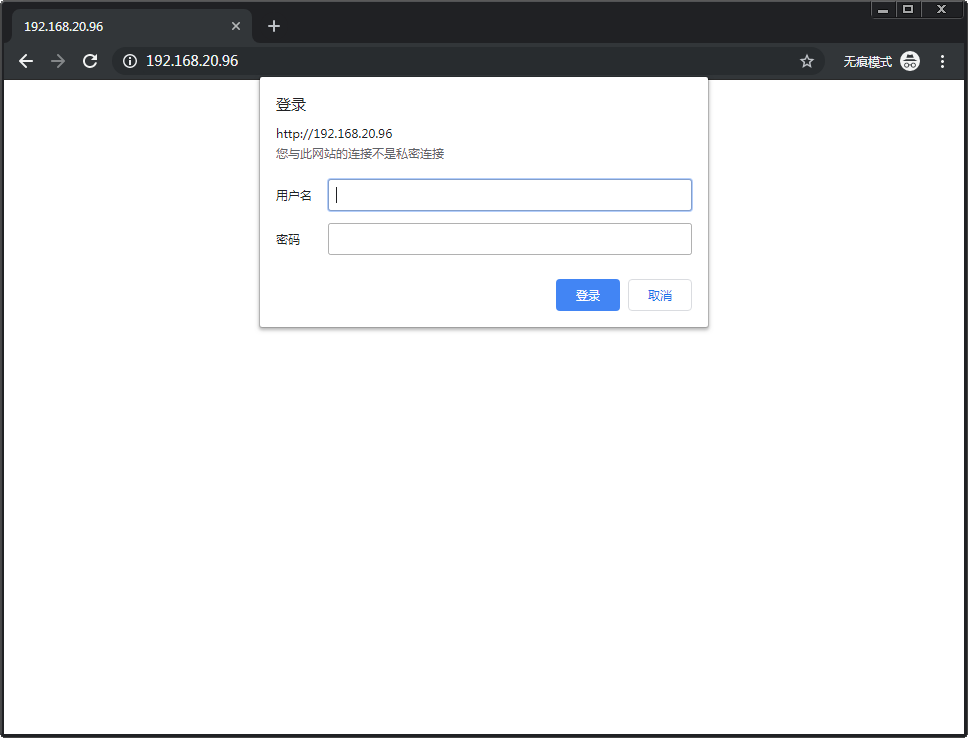

# HTTP Auth

## Install

* `sudo apt-get install apache2 apache2-utils`

## passwd

* `sudo htpasswd -c /etc/apache2/.htpasswd zengjf`
* `sudo htpasswd /etc/apache2/.htpasswd wugn`
* `cat /etc/apache2/.htpasswd`
  ```
  zengjf:$apr1$1EnAuPOa$vvLbImEABwE.oSV0QHFPb/
  wugn:$apr1$2CtsxpVj$dtIrpwyyXq/heE/tQmCjG0
  ```

## apache 

* `sudo service apache2 restart`

## apache config

* `/etc/apache2/sites-available/000-default.conf`
  ```
  <VirtualHost *:80>
          # The ServerName directive sets the request scheme, hostname and port that
          # the server uses to identify itself. This is used when creating
          # redirection URLs. In the context of virtual hosts, the ServerName
          # specifies what hostname must appear in the request's Host: header to
          # match this virtual host. For the default virtual host (this file) this
          # value is not decisive as it is used as a last resort host regardless.
          # However, you must set it for any further virtual host explicitly.
          #ServerName www.example.com
  
          ServerAdmin webmaster@localhost
          DocumentRoot /var/www/html
  
          # Available loglevels: trace8, ..., trace1, debug, info, notice, warn,
          # error, crit, alert, emerg.
          # It is also possible to configure the loglevel for particular
          # modules, e.g.
          #LogLevel info ssl:warn
  
          ErrorLog ${APACHE_LOG_DIR}/error.log
          CustomLog ${APACHE_LOG_DIR}/access.log combined
  
          # For most configuration files from conf-available/, which are
          # enabled or disabled at a global level, it is possible to
          # include a line for only one particular virtual host. For example the
          # following line enables the CGI configuration for this host only
          # after it has been globally disabled with "a2disconf".
          #Include conf-available/serve-cgi-bin.conf
  
          #添加内容
          <Directory "/var/www/html">
                  AllowOverride AuthConfig
                  AuthType Basic
                  AuthName "Restricted Content"
                  AuthUserFile /etc/apache2/.htpasswd
                  Require valid-user
          </Directory>
  </VirtualHost>
  
  # vim: syntax=apache ts=4 sw=4 sts=4 sr noet
  ```


