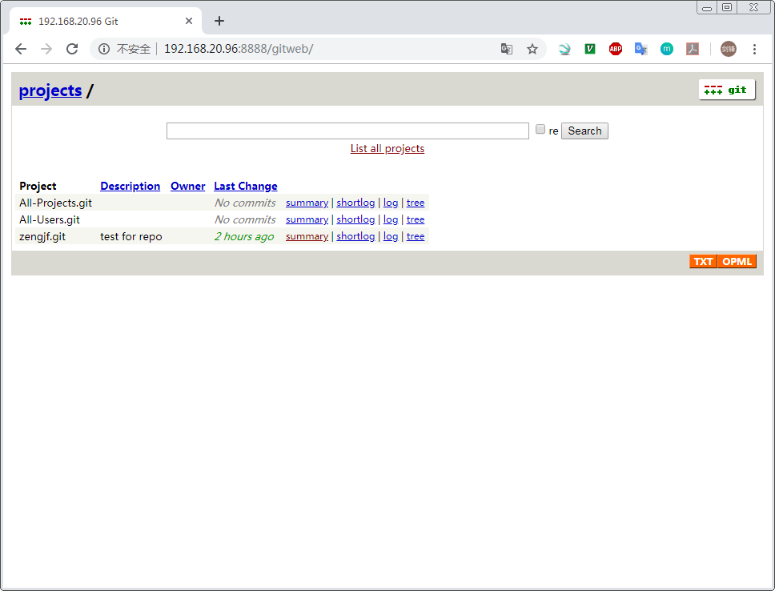

# Gitweb



## 参考文档

* https://www.git-scm.com/docs/gitweb/1.7.8.6#_advanced_web_server_setup

## install

* `sudo apt-get install apache2 apache2-utils`
* `sudo apt-get install git git-core gitweb`

## steps

* `dpkg -L gitweb`
  ```
  /.
  /etc
  /etc/apache2
  /etc/apache2/conf-available
  /etc/apache2/conf-available/gitweb.conf
  /etc/gitweb.conf
  /usr
  /usr/lib
  /usr/lib/cgi-bin
  /usr/share
  /usr/share/doc
  /usr/share/doc/gitweb
  /usr/share/doc/gitweb/NEWS.Debian.gz
  /usr/share/doc/gitweb/README
  /usr/share/doc/gitweb/README.Debian
  /usr/share/doc/gitweb/changelog.Debian.gz
  /usr/share/doc/gitweb/changelog.gz
  /usr/share/doc/gitweb/copyright
  /usr/share/doc/gitweb/examples
  /usr/share/doc/gitweb/examples/index.aux-generation
  /usr/lib/cgi-bin/gitweb.cgi
  ```
* `sudo ln -s /usr/share/gitweb /var/www/gitweb`
* `/etc/apache2/sites-available/000-default.conf`
  ```
  <VirtualHost *:8888>
          # The ServerName directive sets the request scheme, hostname and port that
          # the server uses to identify itself. This is used when creating
          # redirection URLs. In the context of virtual hosts, the ServerName
          # specifies what hostname must appear in the request's Host: header to
          # match this virtual host. For the default virtual host (this file) this
          # value is not decisive as it is used as a last resort host regardless.
          # However, you must set it for any further virtual host explicitly.
          #ServerName www.example.com
          ServerName 192.168.20.96
          Alias /gitweb /var/www/gitweb
  
          # ServerAdmin webmaster@localhost
          # DocumentRoot /var/www/html
  
          # Available loglevels: trace8, ..., trace1, debug, info, notice, warn,
          # error, crit, alert, emerg.
          # It is also possible to configure the loglevel for particular
          # modules, e.g.
          #LogLevel info ssl:warn
  
          ErrorLog ${APACHE_LOG_DIR}/error.log
          CustomLog ${APACHE_LOG_DIR}/access.log combined
  
          # For most configuration files from conf-available/, which are
          # enabled or disabled at a global level, it is possible to
          # include a line for only one particular virtual host. For example the
          # following line enables the CGI configuration for this host only
          # after it has been globally disabled with "a2disconf".
          #Include conf-available/serve-cgi-bin.conf
  
          SetEnv        GITWEB_CONFIG  /etc/gitweb.conf
  
          <Directory /var/www/gitweb>
                  Options Indexes FollowSymlinks ExecCGI
                  DirectoryIndex /cgi-bin/gitweb.cgi
                  AllowOverride None
          </Directory>
  </VirtualHost>
  
  # vim: syntax=apache ts=4 sw=4 sts=4 sr noet
  ```
* `/etc/gitweb.conf`
  ```
  $projectroot = "/home/gerrit/review_site/git/";
  
  # directory to use for temp files
  $git_temp = "/tmp";
  
  # target of the home link on top of all pages
  #$home_link = $my_uri || "/";
  
  # html text to include at home page
  $home_text = "indextext.html";
  
  # file with project list; by default, simply scan the projectroot dir.
  $projects_list = $projectroot;
  
  # stylesheet to use
  # I took off the prefix / of the following path to put these files inside gitweb directory directly
  # $stylesheet = "gitweb.css";
  
  # logo to use
  # $logo = "git-logo.png";
  
  # the favicon
  # $favicon = "git-favicon.png";
  ```