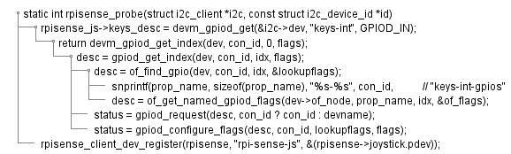

# DTS GPIO Interrupt

##  Hacking code

* `/sys/kernel/debug/gpio`
  ```
  gpiochip0: GPIOs 0-53, parent: platform/fe200000.gpio, pinctrl-bcm2835:
   gpio-23  (                    |keys-int            ) in  lo IRQ
   gpio-42  (                    |led0                ) out lo
  
  gpiochip2: GPIOs 100-101, brcmvirt-gpio, can sleep:
  
  gpiochip1: GPIOs 504-511, parent: platform/soc:firmware:gpio, raspberrypi-exp-gpio, can sleep:
   gpio-504 (BT_ON               )
   gpio-505 (WL_ON               )
   gpio-506 (PWR_LED_OFF         |led1                ) out lo
   gpio-507 (GLOBAL_RESET        )
   gpio-508 (VDD_SD_IO_SEL       |vdd-sd-io           ) out hi
   gpio-509 (CAM_GPIO            )
   gpio-510 (                    )
   gpio-511 (                    )
  ```
* `echo 21 > /sys/class/gpio/export`
* `/sys/kernel/debug/gpio`
  ```
  gpiochip0: GPIOs 0-53, parent: platform/fe200000.gpio, pinctrl-bcm2835:
   gpio-21  (                    |sysfs               ) in  lo
   gpio-23  (                    |keys-int            ) in  lo IRQ
   gpio-42  (                    |led0                ) out lo
  
  gpiochip2: GPIOs 100-101, brcmvirt-gpio, can sleep:
  
  gpiochip1: GPIOs 504-511, parent: platform/soc:firmware:gpio, raspberrypi-exp-gpio, can sleep:
   gpio-504 (BT_ON               )
   gpio-505 (WL_ON               )
   gpio-506 (PWR_LED_OFF         |led1                ) out lo
   gpio-507 (GLOBAL_RESET        )
   gpio-508 (VDD_SD_IO_SEL       |vdd-sd-io           ) out hi
   gpio-509 (CAM_GPIO            )
   gpio-510 (                    )
   gpio-511 (                    )
  ```
* 如上可知`gpio-23`被配置为中断信号，是因为树莓派上挂在了`Sense_HAT`的原因：`arch/arm/boot/dts/overlays/rpi-sense-overlay.dts`
  ```dts
  // rpi-sense HAT
  /dts-v1/;
  /plugin/;
  
  / {
          compatible = "brcm,bcm2835";
  
          fragment@0 {
                  target = <&i2c1>;
                  __overlay__ {
                          #address-cells = <1>;
                          #size-cells = <0>;
                          status = "okay";
  
                          rpi-sense@46 {
                                  compatible = "rpi,rpi-sense";
                                  reg = <0x46>;
                                  keys-int-gpios = <&gpio 23 1>;
                                  status = "okay";
                          };
  
                          [...省略]
                  };
          };
  };
  ```
* `drivers/mfd/rpisense-core.c`
  ```C
  static int rpisense_probe(struct i2c_client *i2c,
                                 const struct i2c_device_id *id)
  {
          [...省略]
  
          rpisense_js = &rpisense->joystick;
          rpisense_js->keys_desc = devm_gpiod_get(&i2c->dev,
                                                  "keys-int", GPIOD_IN);
          if (IS_ERR(rpisense_js->keys_desc)) {
                  dev_warn(&i2c->dev, "Failed to get keys-int descriptor.\n");
                  rpisense_js->keys_desc = gpio_to_desc(23);
                  if (rpisense_js->keys_desc == NULL) {
                          dev_err(&i2c->dev, "GPIO23 fallback failed.\n");
                          return PTR_ERR(rpisense_js->keys_desc);
                  }
          }
          rpisense_client_dev_register(rpisense, "rpi-sense-js",
                                       &(rpisense->joystick.pdev));
          rpisense_client_dev_register(rpisense, "rpi-sense-fb",
                                       &(rpisense->framebuffer.pdev));
  
          return 0;
  }
  ```
  
  ```
  * static int rpisense_probe(struct i2c_client *i2c, const struct i2c_device_id *id)
    * rpisense_js->keys_desc = devm_gpiod_get(&i2c->dev, "keys-int", GPIOD_IN);
      * return devm_gpiod_get_index(dev, con_id, 0, flags);
        * desc = gpiod_get_index(dev, con_id, idx, flags);
          * desc = of_find_gpio(dev, con_id, idx, &lookupflags);
            * snprintf(prop_name, sizeof(prop_name), "%s-%s", con_id,           // "keys-int-gpios"
            * desc = of_get_named_gpiod_flags(dev->of_node, prop_name, idx, &of_flags);
          * status = gpiod_request(desc, con_id ? con_id : devname);
          * status = gpiod_configure_flags(desc, con_id, lookupflags, flags);
    * rpisense_client_dev_register(rpisense, "rpi-sense-js", &(rpisense->joystick.pdev));
    ```
* `drivers/input/joystick/rpisense-js.c`
  ```C
  static int rpisense_js_probe(struct platform_device *pdev)
  {
          int ret;
          int i;
          struct rpisense_js *rpisense_js;
  
          rpisense = rpisense_get_dev();
          rpisense_js = &rpisense->joystick;
  
          INIT_WORK(&rpisense_js->keys_work_s, keys_work_fn);
  
          rpisense_js->keys_dev = input_allocate_device();
          if (!rpisense_js->keys_dev) {
                  dev_err(&pdev->dev, "Could not allocate input device.\n");
                  return -ENOMEM;
          }
  
          rpisense_js->keys_dev->evbit[0] = BIT_MASK(EV_KEY);
          for (i = 0; i < ARRAY_SIZE(keymap); i++) {
                  set_bit(keymap[i],
                          rpisense_js->keys_dev->keybit);
          }
  
          rpisense_js->keys_dev->name = "Raspberry Pi Sense HAT Joystick";
          rpisense_js->keys_dev->phys = "rpi-sense-joy/input0";
          rpisense_js->keys_dev->id.bustype = BUS_I2C;
          rpisense_js->keys_dev->evbit[0] = BIT_MASK(EV_KEY) | BIT_MASK(EV_REP);
          rpisense_js->keys_dev->keycode = keymap;
          rpisense_js->keys_dev->keycodesize = sizeof(unsigned char);
          rpisense_js->keys_dev->keycodemax = ARRAY_SIZE(keymap);
  
          ret = input_register_device(rpisense_js->keys_dev);
          if (ret) {
                  dev_err(&pdev->dev, "Could not register input device.\n");
                  goto err_keys_alloc;
          }
  
          ret = gpiod_direction_input(rpisense_js->keys_desc);
          if (ret) {
                  dev_err(&pdev->dev, "Could not set keys-int direction.\n");
                  goto err_keys_reg;
          }
  
          rpisense_js->keys_irq = gpiod_to_irq(rpisense_js->keys_desc);
          if (rpisense_js->keys_irq < 0) {
                  dev_err(&pdev->dev, "Could not determine keys-int IRQ.\n");
                  ret = rpisense_js->keys_irq;
                  goto err_keys_reg;
          }
  
          ret = devm_request_irq(&pdev->dev, rpisense_js->keys_irq,
                                 keys_irq_handler, IRQF_TRIGGER_RISING,
                                 "keys", &pdev->dev);
          if (ret) {
                  dev_err(&pdev->dev, "IRQ request failed.\n");
                  goto err_keys_reg;
          }
          return 0;
  err_keys_reg:
          input_unregister_device(rpisense_js->keys_dev);
  err_keys_alloc:
          input_free_device(rpisense_js->keys_dev);
          return ret;
  }
  ```