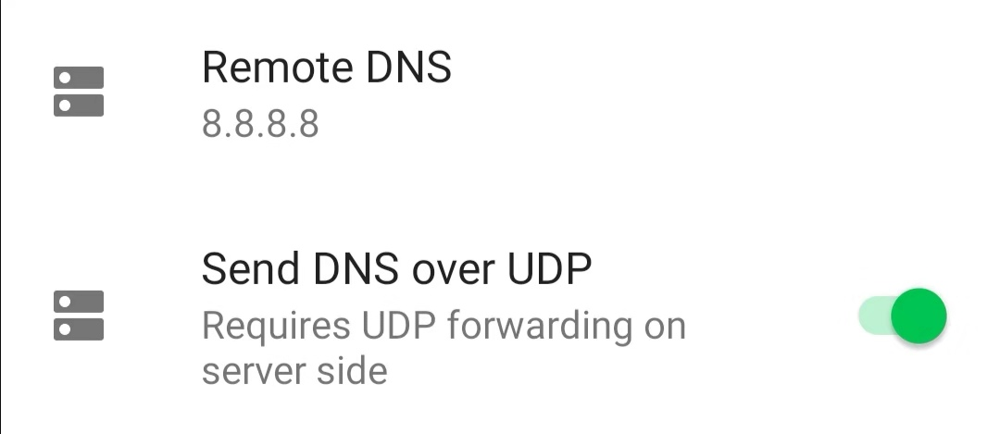
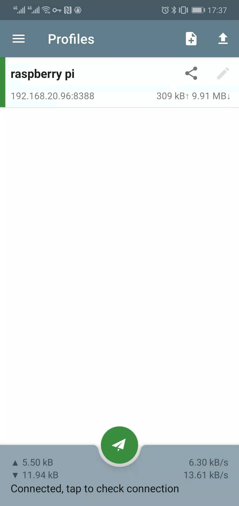

# shadowsocks

## Install

* sudo pip install shadowsocks

## Android apk

https://github.com/shadowsocks/shadowsocks-android/releases

## debug:

* /var/log/shadowsocks.log
* -v, -vv：verbose mode

## run test shadowsock server

* /etc/shadowsocks/config.json
  ```
  {
      "server":"0.0.0.0",
      "server_port":8388,
      "local_address": "127.0.0.1",
      "local_port":1080,
      "password":"zengjf",
      "timeout":300,
      "method":"aes-256-cfb",
      "workers": 1,
      "fast_open": false
  }
  ```
* ssserver -c /etc/shadowsocks/config.json
  ```
  INFO: loading config from /etc/shadowsocks/config.json
  2019-11-01 08:45:57 INFO     loading libcrypto from libcrypto.so.1.1
  Traceback (most recent call last):
    File "/usr/local/bin/ssserver", line 10, in <module>
      sys.exit(main())
    File "/usr/local/lib/python2.7/dist-packages/shadowsocks/server.py", line 34, in main
      config = shell.get_config(False)
    File "/usr/local/lib/python2.7/dist-packages/shadowsocks/shell.py", line 262, in get_config
      check_config(config, is_local)
    File "/usr/local/lib/python2.7/dist-packages/shadowsocks/shell.py", line 124, in check_config
      encrypt.try_cipher(config['password'], config['method'])
    File "/usr/local/lib/python2.7/dist-packages/shadowsocks/encrypt.py", line 44, in try_cipher
      Encryptor(key, method)
    File "/usr/local/lib/python2.7/dist-packages/shadowsocks/encrypt.py", line 83, in __init__
      random_string(self._method_info[1]))
    File "/usr/local/lib/python2.7/dist-packages/shadowsocks/encrypt.py", line 109, in get_cipher
      return m[2](method, key, iv, op)
    File "/usr/local/lib/python2.7/dist-packages/shadowsocks/crypto/openssl.py", line 76, in __init__
      load_openssl()
    File "/usr/local/lib/python2.7/dist-packages/shadowsocks/crypto/openssl.py", line 52, in load_openssl
      libcrypto.EVP_CIPHER_CTX_cleanup.argtypes = (c_void_p,)
    File "/usr/lib/python2.7/ctypes/__init__.py", line 379, in __getattr__
      func = self.__getitem__(name)
    File "/usr/lib/python2.7/ctypes/__init__.py", line 384, in __getitem__
      func = self._FuncPtr((name_or_ordinal, self))
  AttributeError: /usr/lib/arm-linux-gnueabihf/libcrypto.so.1.1: undefined symbol: EVP_CIPHER_CTX_cleanup
  ```
* vim /usr/local/lib/python2.7/dist-packages/shadowsocks/crypto/openssl.py
  ```
  :%s/cleanup/reset/g
  ```
* `ssserver -c /etc/shadowsocks/config.json`
  INFO: loading config from /etc/shadowsocks/config.json
  2019-11-01 09:01:59 INFO     loading libcrypto from libcrypto.so.1.1
  2019-11-01 09:01:59 INFO     starting server at :::8388
* try run
  * ssserver -c /etc/shadowsocks/config.json -d start
  * ssserver -c /etc/shadowsocks/config.json -d stop
* 网络还是无法使用，DNS提示信息：/var/log/shadowsocks.log
  ```
  [...省略]
  2019-11-02 00:28:25 INFO     connecting dns.google:53 from 192.168.31.69:33264
  2019-11-02 00:28:25 INFO     connecting dns.google:53 from 192.168.31.69:33266
  2019-11-02 00:28:25 INFO     connecting dns.google:53 from 192.168.31.69:33270
  2019-11-02 00:28:26 INFO     connecting dns.google:53 from 192.168.31.69:33276
  2019-11-02 00:28:26 INFO     connecting dns.google:53 from 192.168.31.69:33278
  ```
* DNS使用UDP  
    
* 数据访问图  
    
* Ubuntu 16.04 systemd
  * /lib/systemd/system/shadowsocks.service
    ```
    Description=Shadowsocks Server
    After=network.target
    
    [Service]
    ExecStart=/usr/local/bin/ssserver -c /etc/shadowsocks/config.json
    Restart=on-abort
    
    [Install]
    WantedBy=multi-user.target
    ```
  * systemctl enable shadowsocks
    ```
    Created symlink from /etc/systemd/system/multi-user.target.wants/shadowsocks.service to /lib/systemd/system/shadowsocks.service.
    ```
  * netstat -tua
    ```
    Active Internet connections (servers and established)
    Proto Recv-Q Send-Q Local Address           Foreign Address         State
    tcp        0      0 localhost:6010          *:*                     LISTEN
    tcp        0      0 *:8388                  *:*                     LISTEN
    tcp        0      0 *:ssh                   *:*                     LISTEN
    tcp        0    288 192.168.20.96.vultr.:ssh 192.168.20.31:6581     ESTABLISHED
    tcp        0      0 192.168.20.96.vultr.:ssh 192.168.20.31:6582     ESTABLISHED
    tcp6       0      0 localhost:6010          [::]:*                  LISTEN
    tcp6       0      0 [::]:ssh                [::]:*                  LISTEN
    udp        0      0 192.168.20.96.vultr.:ntp *:*
    udp        0      0 localhost:ntp           *:*
    udp        0      0 *:ntp                   *:*
    udp        0      0 *:8388                  *:*
    udp        0      0 *:bootpc                *:*
    udp6       0      0 fe80::5400:2ff:fe65:ntp [::]:*
    udp6       0      0 localhost:ntp           [::]:*
    udp6       0      0 [::]:ntp                [::]:*
    ```
  * systemctl start shadowsocks
  * systemctl stop shadowsocks
  * systemctl status shadowsocks

## run test shadowsock client

* 参考文档：https://cloud.tencent.com/developer/article/1198278
* sslocal -c /etc/shadowsocks/config.json
* try run
  * sslocal -c /etc/shadowsocks/config.json -d start
  * sslocal -c /etc/shadowsocks/config.json -d stop


## Windows

* https://github.com/shadowsocks/shadowsocks-windows/releases/tag/4.1.8.0
* 模式选择：【系统代理】 -> 【PAC模式】

## Chrome

*  https://github.com/FelisCatus/SwitchyOmega/releases