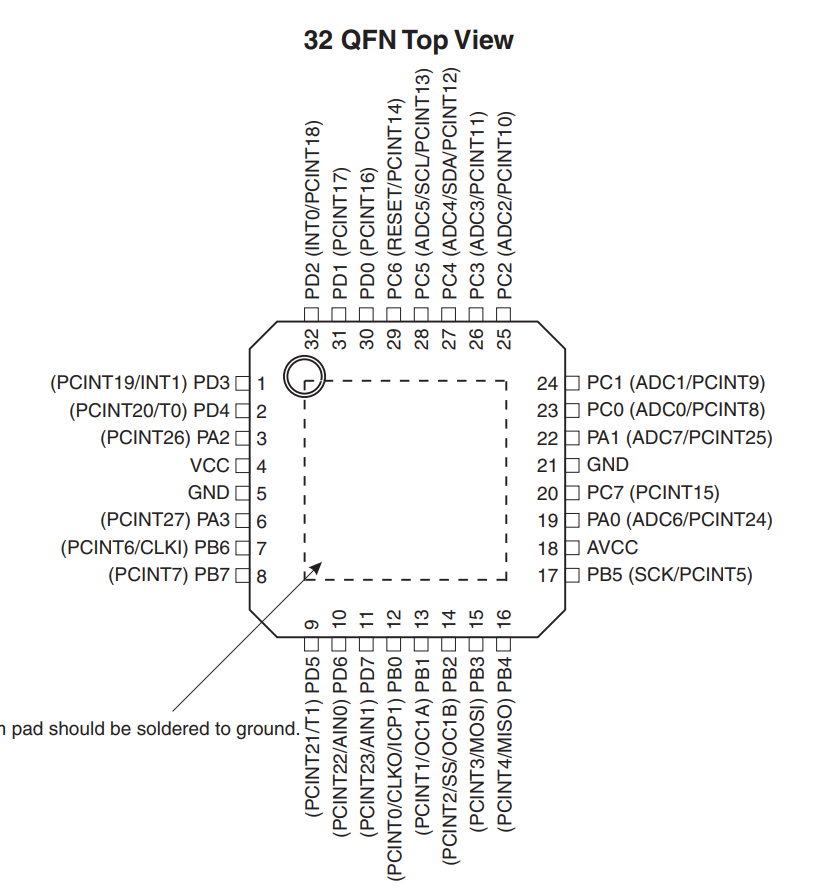
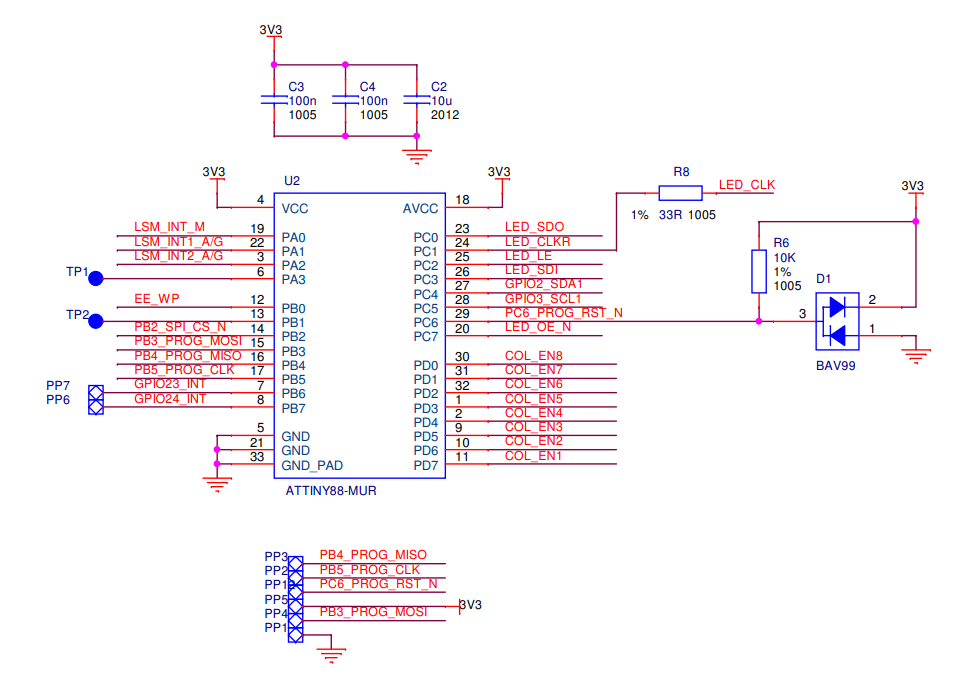

# Sense HAT ATtiny88

分析Sense HAT的ATtiny88 MCU代码

## 参考文档

* [rpi-sense firmware souce code](https://github.com/raspberrypi/rpi-sense)
* [rpi-sense schematic](https://www.raspberrypi.org/documentation/hardware/sense-hat/images/Sense-HAT-V1_0.pdf)
* [AVR MCU Reference Manual](https://www.microchip.com/wwwproducts/en/ATTINY88)
  * http://ww1.microchip.com/downloads/en/DeviceDoc/doc8008.pdf

## ATtiny88 Pins

## Schematic

## MCU I2C汇编解读

* [#include <util/twi.h>](https://www.eit.lth.se/fileadmin/eit/courses/edi021/avr-libc-user-manual/group__util__twi.html#g0ecd2ca38d00279194460e65028a0533)
* [rpi-sense.S汇编解读](https://github.com/ZengjfOS/RaspberryPi/blob/rpi-sense/rpi-sense.S)