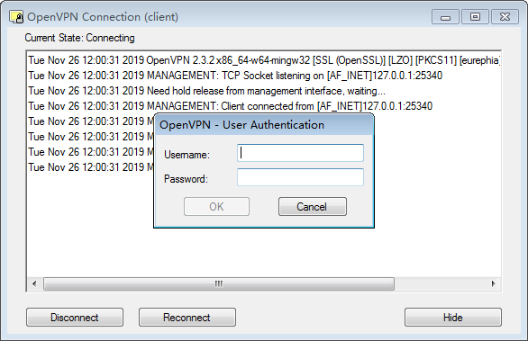

# OpenVPN Multiple Users

## 参考文档

* [OpenVPN 使用账号+密码方式登陆](https://xu3352.github.io/linux/2017/06/08/openvpn-use-username-and-password-authentication)

## client-to-client

* /etc/openvpn/server.conf
  ```
  # Uncomment this directive to allow different
  # clients to be able to "see" each other.
  # By default, clients will only see the server.
  # To force clients to only see the server, you
  # will also need to appropriately firewall the
  # server's TUN/TAP interface.
  ;client-to-client
  ```

## Server配置

* cat /etc/openvpn/checkpsw.sh
  ```shell
  #!/bin/sh
  ###########################################################
  # checkpsw.sh (C) 2004 Mathias Sundman <mathias@openvpn.se>
  #
  # This script will authenticate OpenVPN users against
  # a plain text file. The passfile should simply contain
  # one row per user with the username first followed by
  # one or more space(s) or tab(s) and then the password.
  
  PASSFILE="/etc/openvpn/psw-file"
  LOG_FILE="/etc/openvpn/openvpn-password.log"
  TIME_STAMP=`date "+%Y-%m-%d %T"`
  
  ###########################################################
  
  if [ ! -r "${PASSFILE}" ]; then
    echo "${TIME_STAMP}: Could not open password file \"${PASSFILE}\" for reading." >> ${LOG_FILE}
    exit 1
  fi
  
  CORRECT_PASSWORD=`awk '!/^;/&&!/^#/&&$1=="'${username}'"{print $2;exit}' ${PASSFILE}`
  
  if [ "${CORRECT_PASSWORD}" = "" ]; then 
    echo "${TIME_STAMP}: User does not exist: username=\"${username}\", password=\"${password}\"." >> ${LOG_FILE}
    exit 1
  fi
  
  if [ "${password}" = "${CORRECT_PASSWORD}" ]; then 
    echo "${TIME_STAMP}: Successful authentication: username=\"${username}\"." >> ${LOG_FILE}
    exit 0
  fi
  
  echo "${TIME_STAMP}: Incorrect password: username=\"${username}\", password=\"${password}\"." >> ${LOG_FILE}
  exit 1
  ```
* chmod 755 /etc/openvpn/checkpsw.sh
* cat /etc/openvpn/psw-file
  ```
  zengjf zengjf
  zengsf zengsf
  ```
* 在/etc/openvpn/server.conf末尾添加如下几行信息：
  ```
  [...省略]
  # use username and password login
  auth-user-pass-verify /etc/openvpn/checkpsw.sh via-env
  client-cert-not-required
  username-as-common-name
  script-security 3 execve
  ```
* grep -vE "^#|^;|^$" /etc/openvpn/server.conf
  ```
  port 1194
  proto tcp
  dev tun
  ca ca.crt
  cert zengjf.crt
  key zengjf.key  # This file should be kept secret
  dh dh2048.pem
  server 10.8.0.0 255.255.255.0
  ifconfig-pool-persist ipp.txt
  client-to-client
  keepalive 10 120
  comp-lzo
  persist-key
  persist-tun
  status openvpn-status.log
  verb 3
  auth-user-pass-verify /etc/openvpn/checkpsw.sh via-env
  client-cert-not-required
  username-as-common-name
  script-security 3 execve
  ```
* /etc/init.d/openvpn restart
* netstat -tunlp |grep 1194

## OpenVPN Windows



## OpenVPN Linux Client

* sudo su
* login.conf
  ```
  zengjf
  zengjf
  ```
* grep -vE "^#|^;|^$" client.ovpn
  ```
  client
  dev tun
  proto tcp
  remote 180.76.160.193 1194
  resolv-retry infinite
  nobind
  persist-key
  persist-tun
  ca ca.crt
  auth-user-pass login.conf
  ns-cert-type server
  tls-version-min 1.0
  comp-lzo
  verb 3
  ```
* openvpn --config client.ovpn &