# PADS

## 安装

* License选择  
  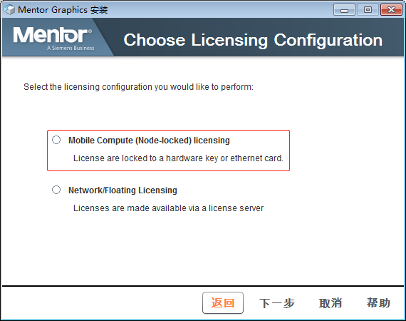  
  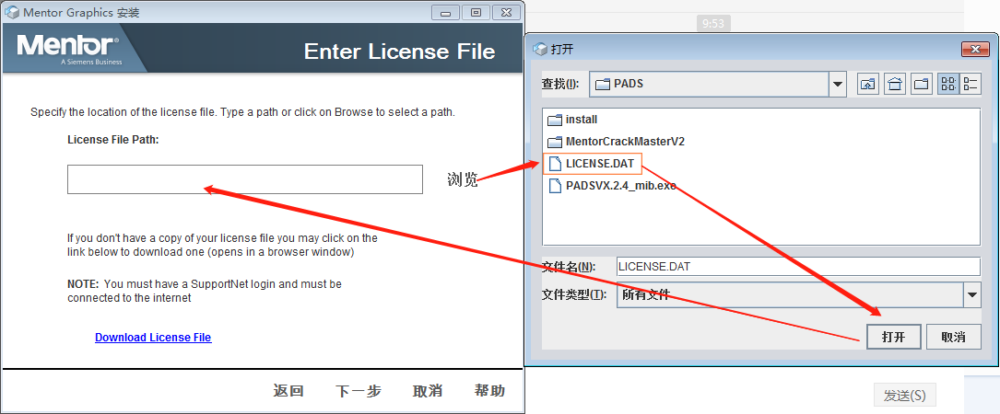
* 选择需要安装的部件  
  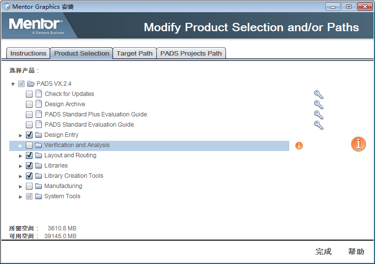

## 基本使用

* 原理图绘制  
  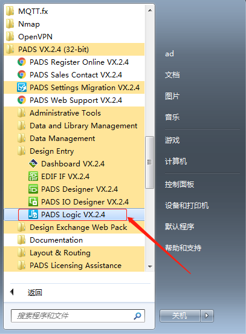  
* PCB绘制  
  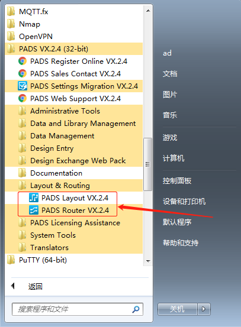  
* PCB封装制作  
  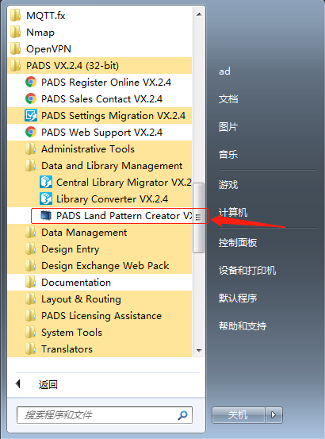  

## 原理图绘制

* 工具栏
  * 选择工具，只有选中了对应的类型，才能在工作区选中对应的器件、线等内容  
    
  * 编辑工具  
    
* 编辑元器件
  * 【文件】 --> 【库】 --> 【新建库】  
    这里主要是创建一个库文件；
  * 【工具】 --> 【元器件编辑器】  
    进入元器件编辑界面，如果要返回原理图编辑界面：【文件】 --> 【退出元件编辑器】  
    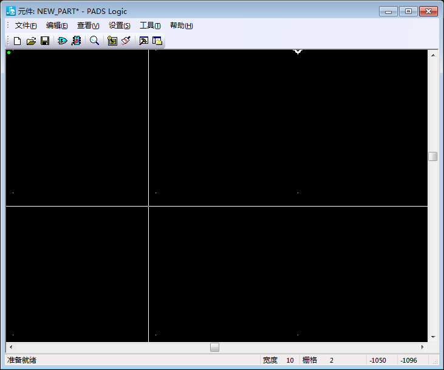
    * 【文件】 --> 【新建】 --> 【元件类型】  
      进入元器件编辑界面，在里面可以编辑元器件，如果要退出元件编辑：【文件】 --> 【返回至元件】  
      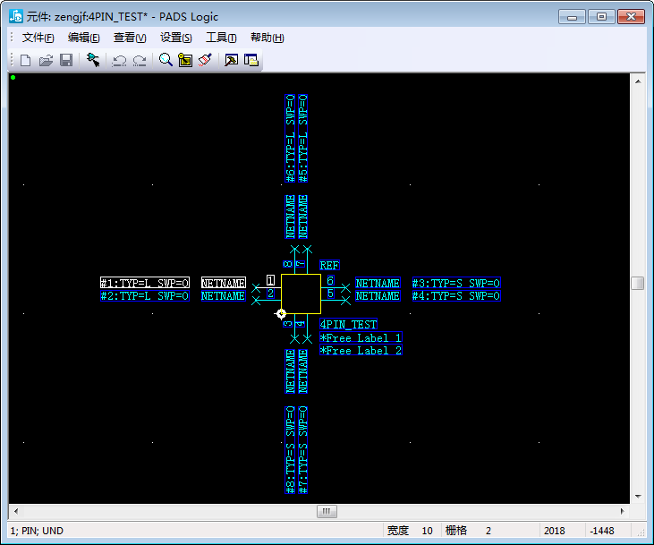
      * PNAME放在这里指示管脚或功能的名字，如A00、D01或VCC。
      * NETNAME放在这里指示当在原理图中显示时的网络名字标记。
      * \#E放在这里指示管脚号码。
      * TYP和SWP放在这里指示管脚类型(Pin Type)和门交换值(Gate Swap Values)。
      * 管脚类型(Pin Types)和门可交换(Gate Swap)的值仅仅显示在CAE封装(CAE Decal)编辑器中，而在原理图中不显示。
      * **\#1/\#2/\#3...：可以认为是原理图引脚编号和封装引脚编号的关系，一般按顺序对应，没处理好，原理图转PCB会出问题；**
  * 放置元器件  
    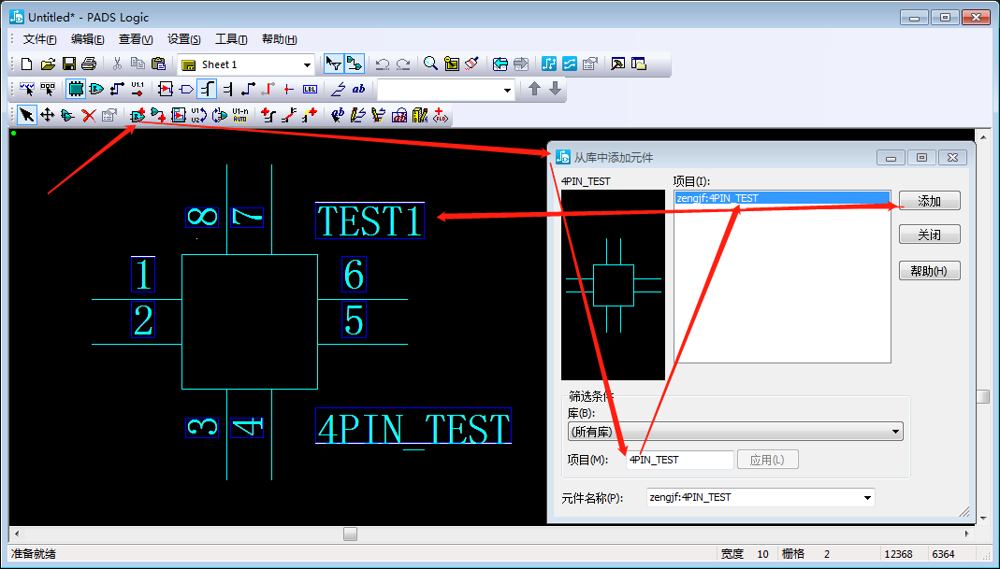
* 将库加入库引用，如果没有加入库管理的库是引用不到的，尤其注意封装库的引用添加  
  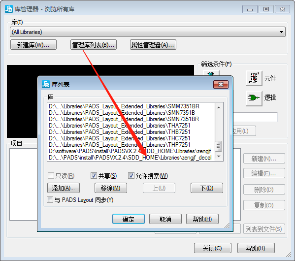

## 原理图转PCB

* 打开layout  
  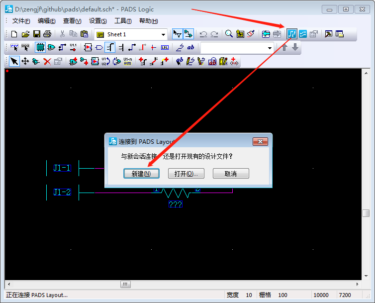
* 发送网络表，同步ECO到PCB  
  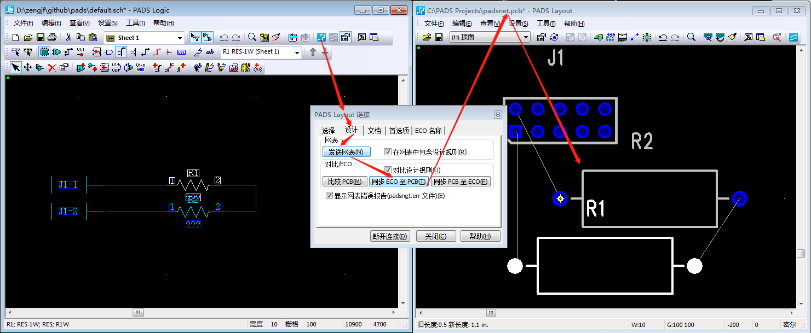
* 最终结果  
  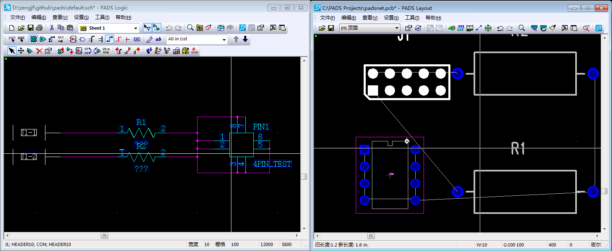

## PCB绘制

* 使用方法参考原理图绘制；
* 封装制作流程和元器件制作类似，连界面都类似；
  * 除了上面基本的封装制作外，还提供了特殊的封装制作方法：**IPC-7351**  
    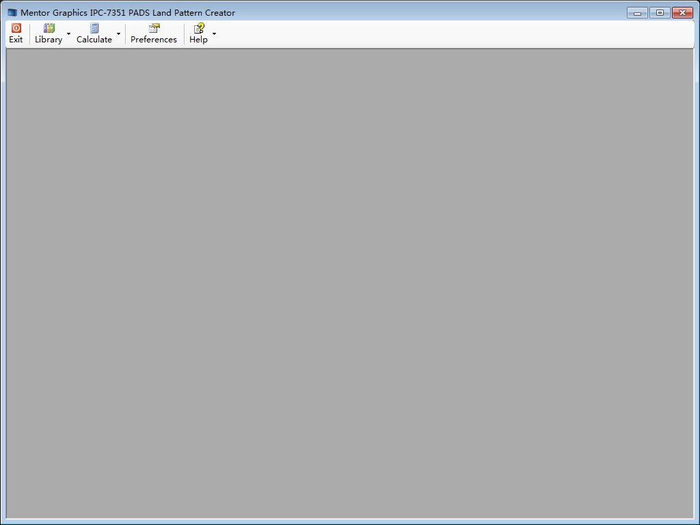
* 布线规则
  * 【设置】 --> 【设计规则】 -->  【层次化】 --> 【默认】 --> 【安全间距】 --> 【线宽】/【安全间距】
* 层颜色：习惯了顶层红色，背面蓝色
  * 【设置】 --> 【显示颜色】
* 其他设置
  * 【工具】 --> 【选项】

