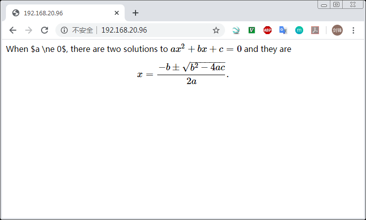
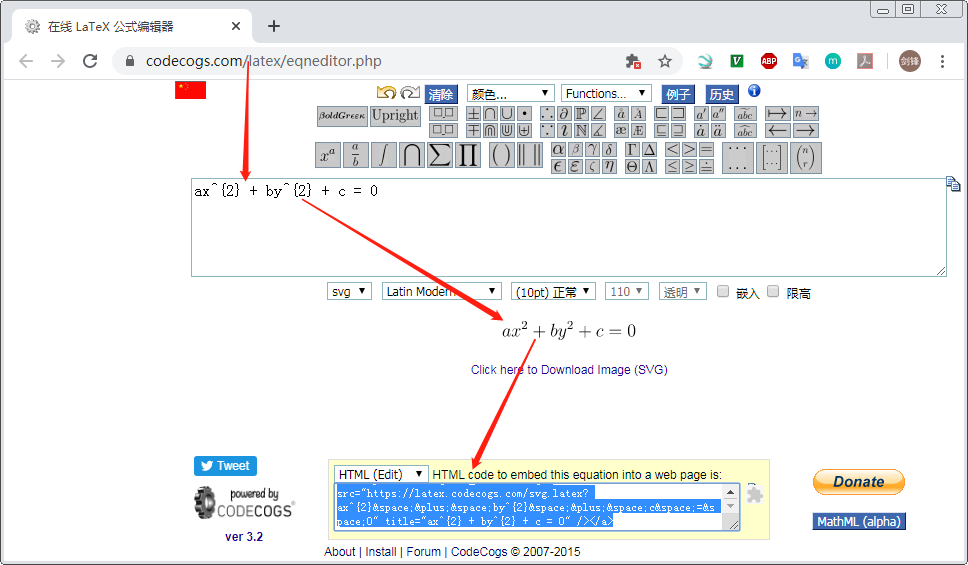

# MathJax

崔博想在GitHub显示公式，只看GFM（Github Flavored Markdown）规范，貌似不支持处理公式，于是觉得直接引用MathJax就可以在GitHub上渲染出效果来了，结果是不行的。

不过发现[CodeCogs里有工具](https://www.codecogs.com/latex/eqneditor.php)可以用来专门做这件事情；

## 参考文档

* https://www.mathjax.org/#demo
* [Embed JavaScript in GitHub README.md](https://stackoverflow.com/questions/21340803/embed-javascript-in-github-readme-md)
* [如何在 GitHub 录入数学公式](https://www.jianshu.com/p/c169599726e1)

## MathJax web page

* /var/www/html/index.html
  ```html
  <html>
    <head>
      <script type="text/javascript" src="http://cdn.mathjax.org/mathjax/latest/MathJax.js?config=TeX-AMS-MML_HTMLorMML">
      </script>
    </head>
    <body>
      When $a \ne 0$, there are two solutions to \(ax^2 + bx + c = 0\) and they are <br />
      $$x = {-b \pm \sqrt{b^2-4ac} \over 2a}.$$
    </body>
  </html>
  ```
* 

## GitHub

* https://www.codecogs.com/latex/eqneditor.php
  
* 