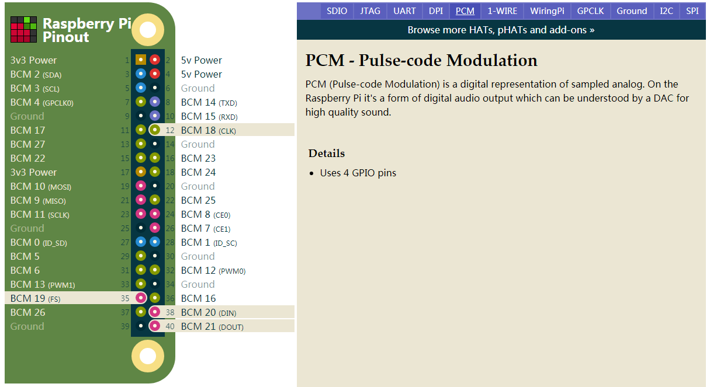

# PCM5122

DAI：Digital Audio Interface。DAI是数字音频接口的统称，PCM是其中的一种。

## 参考文档

* https://www.hifiberry.com/docs
* [CONFIGURING LINUX 4.X OR HIGHER](https://www.hifiberry.com/docs/software/configuring-linux-3-18-x/)
* Datasheet: [PCM512x 2-VRMS DirectPath™ , 112-dB and 106-dB Audio Stereo DACs With 32-Bit, 384-kHz PCM Interface](http://www.ti.com/lit/ds/symlink/pcm5122.pdf)

## PCM Pins

* https://pinout.xyz/pinout/pcm  
  


## hifiberry

https://www.hifiberry.com/products/

## dts overlay

* cd arch/arm/boot/dts/overlays
* find * -iname 'hifiberry*.dts'
  ```
  hifiberry-amp-overlay.dts
  hifiberry-dac-overlay.dts
  hifiberry-digi-overlay.dts
  hifiberry-dacplusadc-overlay.dts
  hifiberry-dacplus-overlay.dts
  hifiberry-digi-pro-overlay.dts
  hifiberry-dacplusadcpro-overlay.dts
  ```
* arch/arm/boot/dts/overlays/hifiberry-dacplus-overlay.dts
  ```dts
  // Definitions for HiFiBerry DAC+
  /dts-v1/;
  /plugin/;
  
  / {
          compatible = "brcm,bcm2835";
  
          fragment@0 {
                  target-path = "/clocks";
                  __overlay__ {
                          dacpro_osc: dacpro_osc {
                                  compatible = "hifiberry,dacpro-clk";
                                  #clock-cells = <0>;
                          };
                  };
          };
  
          fragment@1 {
                  target = <&i2s>;
                  __overlay__ {
                          status = "okay";
                  };
          };
  
          fragment@2 {
                  target = <&i2c1>;
                  __overlay__ {
                          #address-cells = <1>;
                          #size-cells = <0>;
                          status = "okay";
  
                          pcm5122@4d {
                                  #sound-dai-cells = <0>;
                                  compatible = "ti,pcm5122";
                                  reg = <0x4d>;
                                  clocks = <&dacpro_osc>;
                                  AVDD-supply = <&vdd_3v3_reg>;
                                  DVDD-supply = <&vdd_3v3_reg>;
                                  CPVDD-supply = <&vdd_3v3_reg>;
                                  status = "okay";
                          };
                  };
          };
  
          fragment@3 {
                  target = <&sound>;
                  hifiberry_dacplus: __overlay__ {
                          compatible = "hifiberry,hifiberry-dacplus";
                          i2s-controller = <&i2s>;
                          status = "okay";
                  };
          };
  
          __overrides__ {
                  24db_digital_gain =
                          <&hifiberry_dacplus>,"hifiberry,24db_digital_gain?";
                  slave = <&hifiberry_dacplus>,"hifiberry-dacplus,slave?";
          };
  };
  ```
* sound/soc/codecs/
  * sound/soc/codecs/pcm512x-i2c.c
  * sound/soc/codecs/pcm512x.c
* /boot/config.txt
  ```
  dtoverlay=hifiberry-dacplus
  ```
* dmesg
  ```
  [...省略]
  [   38.482491] Bluetooth: BNEP (Ethernet Emulation) ver 1.3
  [   38.482503] Bluetooth: BNEP filters: protocol multicast
  [   38.482525] Bluetooth: BNEP socket layer initialized
  [   43.128046] bridge: filtering via arp/ip/ip6tables is no longer available by default. Update your scripts to load br_netfilter if you need this.
  [   43.135823] Bridge firewalling registered
  [   44.098052] IPv6: ADDRCONF(NETDEV_UP): docker0: link is not ready
  [   77.932173] fuse init (API version 7.27)
  [   89.672945] pcm512x 1-004d: No SCLK, using BCLK: -2
  [   89.676808] pcm512x 1-004d: No SCLK, using BCLK: -2
  [   89.679951] pcm512x 1-004d: No SCLK, using BCLK: -2
  [   89.683422] pcm512x 1-004d: No SCLK, using BCLK: -2
  [   89.741234] pcm512x 1-004d: No SCLK, using BCLK: -2
  [   89.760936] pcm512x 1-004d: No SCLK, using BCLK: -2
  [   89.782787] pcm512x 1-004d: No SCLK, using BCLK: -2
  [ 5642.988416] pcm512x 1-004d: No SCLK, using BCLK: -2
  [ 5834.861250] pcm512x 1-004d: No SCLK, using BCLK: -2
  ```
* sound/soc/codecs/pcm512x.c
  ```C
  static int pcm512x_dai_startup_slave(struct snd_pcm_substream *substream,
                                       struct snd_soc_dai *dai)
  {
          struct snd_soc_component *component = dai->component;
          struct pcm512x_priv *pcm512x = snd_soc_component_get_drvdata(component);
          struct device *dev = dai->dev;
          struct regmap *regmap = pcm512x->regmap;
  
          if (IS_ERR(pcm512x->sclk)) {
                  dev_info(dev, "No SCLK, using BCLK: %ld\n",
                           PTR_ERR(pcm512x->sclk));
  
                  /* Disable reporting of missing SCLK as an error */
                  regmap_update_bits(regmap, PCM512x_ERROR_DETECT,
                                     PCM512x_IDCH, PCM512x_IDCH);
  
                  /* Switch PLL input to BCLK */
                  regmap_update_bits(regmap, PCM512x_PLL_REF,
                                     PCM512x_SREF, PCM512x_SREF_BCK);
          }
  
          return snd_pcm_hw_constraint_list(substream->runtime, 0,
                                            SNDRV_PCM_HW_PARAM_RATE,
                                            &constraints_slave);
  }
  ```

## aplay test

* lsmod | grep i2s
  ```
  snd_soc_bcm2835_i2s    16384  2
  snd_soc_core          188416  3 snd_soc_pcm512x,snd_soc_hifiberry_dacplus,snd_soc_bcm2835_i2s
  snd_pcm                98304  6 snd_soc_pcm512x,snd_pcm_dmaengine,snd_soc_hifiberry_dacplus,snd_soc_bcm2835_i2s,snd_bcm2835,snd_soc_core
  ```
* lsmod | grep pcm512x
  ```
  snd_soc_pcm512x_i2c    16384  1
  snd_soc_pcm512x        32768  1 snd_soc_pcm512x_i2c
  snd_soc_core          188416  3 snd_soc_pcm512x,snd_soc_hifiberry_dacplus,snd_soc_bcm2835_i2s
  snd_pcm                98304  6 snd_soc_pcm512x,snd_pcm_dmaengine,snd_soc_hifiberry_dacplus,snd_soc_bcm2835_i2s,snd_bcm2835,snd_soc_core
  snd                    73728  16 snd_compress,snd_soc_pcm512x,snd_timer,snd_bcm2835,snd_soc_core,snd_pcm
  ```
* [wav_Sound_Generator.md](0068_wav_Sound_Generator.md)
  * aplay -Dhw:1,0 sound.wav

## config

* usr/share/alsa/alsa.conf
* ~/.asoundrc