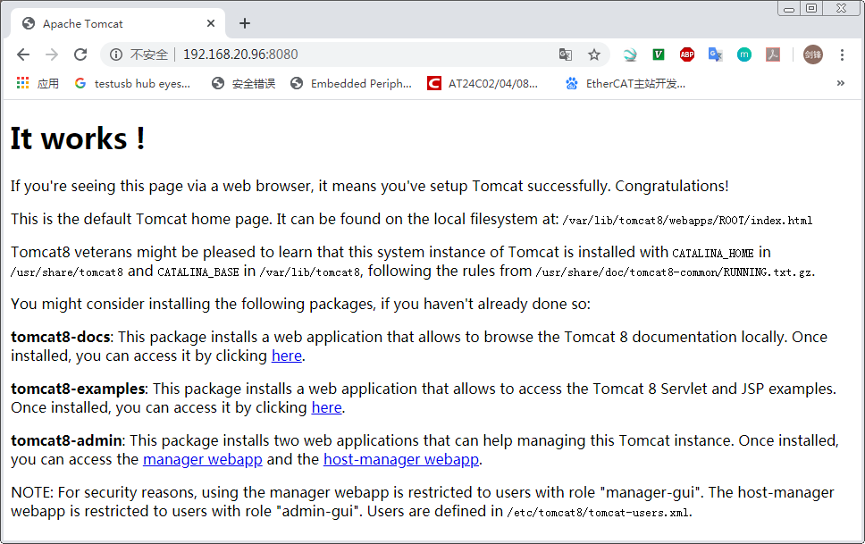
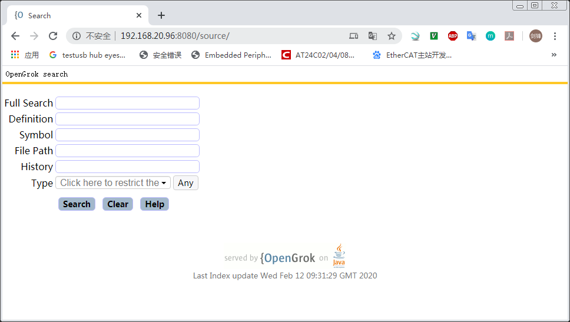
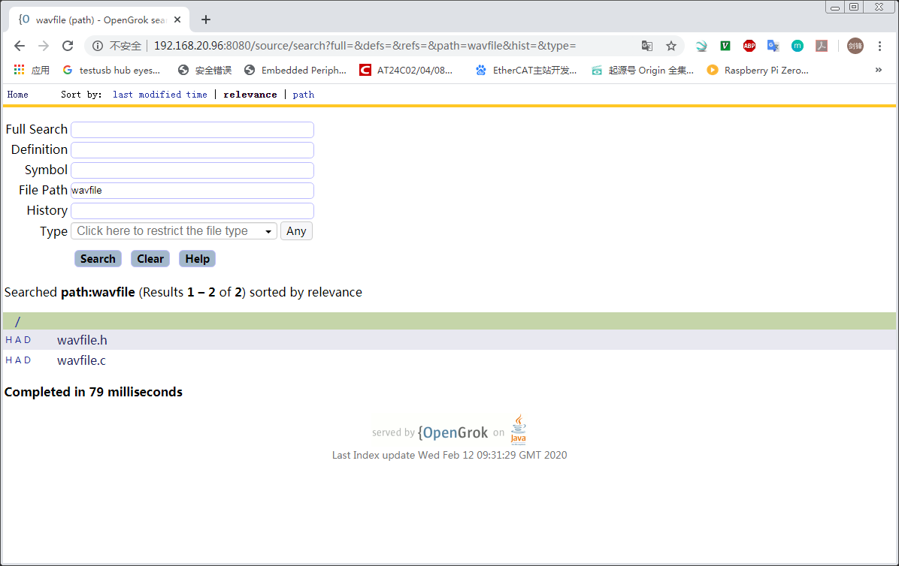
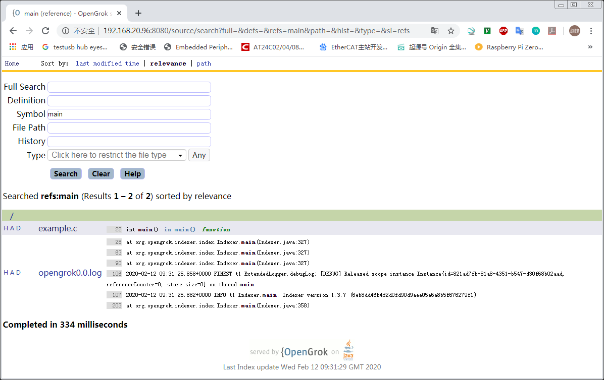
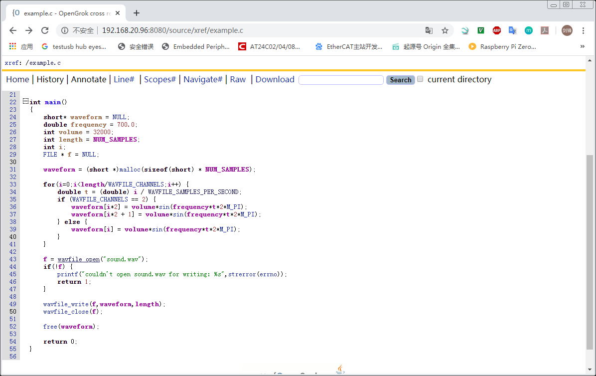

# OpenGrok

在线浏览器跟代码工具OpenGrok

## 参考文档

* [通过opengrok实现android整套代码的快速搜索](https://www.jianshu.com/p/b5665121e136)
* [How to setup OpenGrok](https://github.com/oracle/opengrok/wiki/How-to-setup-OpenGrok)
* [源码阅读环境OpenGrok搭建](https://zhuanlan.zhihu.com/p/45209482)


## JDK info

```
root@raspberrypi:/var/lib/tomcat8# java -version
openjdk version "1.8.0_212"
OpenJDK Runtime Environment (build 1.8.0_212-8u212-b01-1+rpi1-b01)
OpenJDK Client VM (build 25.212-b01, mixed mode)
```

## universal-ctags

* sudo apt-get remove ctags
* sudo apt-get autoremove
* sudo apt-get install autoconf
* sudo apt-get install automake
* git clone https://github.com/universal-ctags/ctags.git
* cd ctags
* ./autogen.sh 
* ./configure
* make
* sudo make install


## Steps

* sudo apt-get install universal-ctags tomcat8
  * 网页配置信息路径：/var/lib/tomcat8
* sudo /etc/init.d/tomcat8 restart  
  * 
* https://github.com/OpenGrok/OpenGrok/releases
  * opengrok-1.3.7.tar.gz
* tar xvf opengrok-1.3.7.tar.gz
* cd /home/pi/zengjf/opengrok-1.3.7/tools
  * python3 -m pip install opengrok-tools.tar.gz
    * opengrok-deploy 
* /home/pi/zengjf/opengrok-1.3.7/lib
  ```
  lib  opengrok.jar  source.war
  ```
* sudo cp /home/pi/zengjf/opengrok-1.3.7/lib/source.war /var/lib/tomcat8/webapps
* sudo mkdir -p /var/opengrok/etc
* sudo cp /home/pi/zengjf/opengrok-1.3.7/doc/logging.properties /var/opengrok/etc/
* 稍等一会，或者重启一下树莓派，在/var/lib/tomcat8目录将看到source目录；
* sudo cat /var/lib/tomcat8/webapps/source/WEB-INF/web.xml
  ```
  <?xml version="1.0" encoding="UTF-8"?>
  <web-app xmlns="http://xmlns.jcp.org/xml/ns/javaee"
           xmlns:xsi="http://www.w3.org/2001/XMLSchema-instance"
           xsi:schemaLocation="http://xmlns.jcp.org/xml/ns/javaee
           http://xmlns.jcp.org/xml/ns/javaee/web-app_3_1.xsd"
           version="3.1">
  
      <display-name>OpenGrok</display-name>
      <description>A wicked fast source browser</description>
      <context-param>
          <description>Full path to the configuration file where OpenGrok can read its configuration</description>
          <param-name>CONFIGURATION</param-name>
          <param-value>/var/opengrok/etc/configuration.xml</param-value>
      </context-param>
      [...省略]
  ```
  * OpenGrok配置路径：/var/opengrok/etc/configuration.xml
* sudo mkdir /var/opengrok/data
* chmod 777 /var/opengrok/data
* sudo touch /var/opengrok/etc/configuration.xml
* sudo chmod 777 /var/opengrok/etc/configuration.xml
* 生成索引：
  ```
  opengrok-indexer \
      -J=-Djava.util.logging.config.file=/var/opengrok/etc/logging.properties \
      -a /home/pi/zengjf/opengrok-1.3.7/lib/opengrok.jar -- \
      -c /usr/bin/ctags \
      -s /home/pi/zengjf/wavfile -d /var/opengrok/data -H -P -S -G \
      -W /var/opengrok/etc/configuration.xml -U http://localhost:8080/source
  ```
  * -s: 要扫描的源代码root目录
  * 生成OpenGrok需要的路径：/var/opengrok/etc/configuration.xml
* 网页访问OpenGrok：http://192.168.20.96:8080/source/  
  
* OpenGrok查找文件  
  
* OpenGrok查找函数  
  
* OpenGrok代码显示  
  
