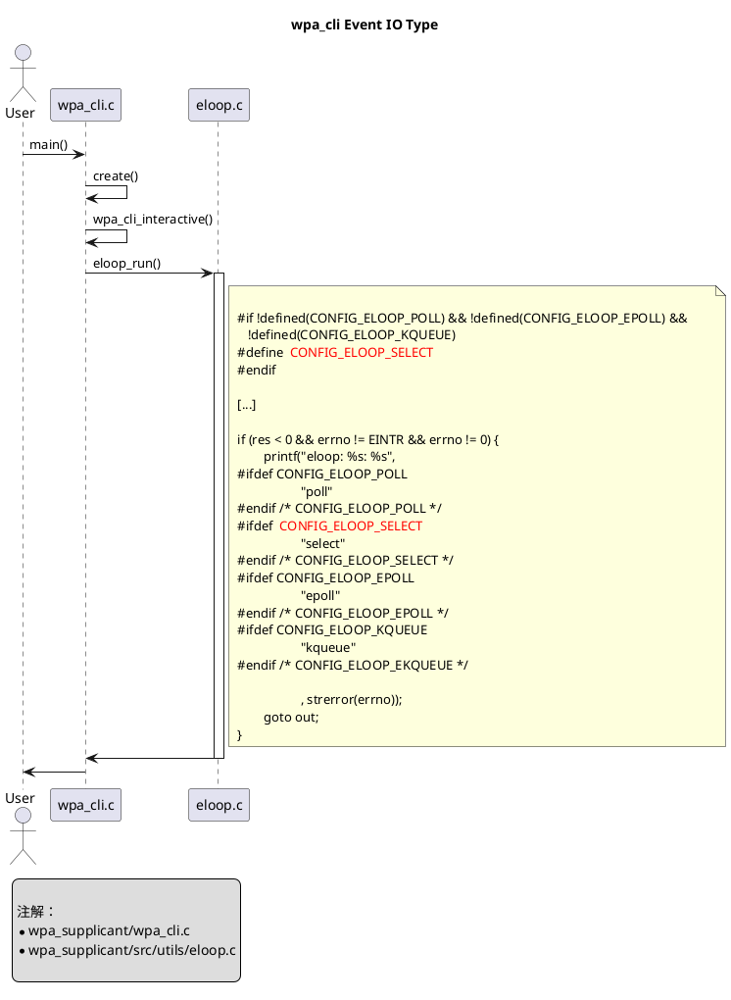
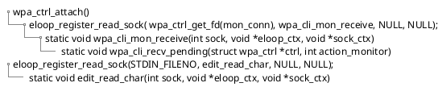
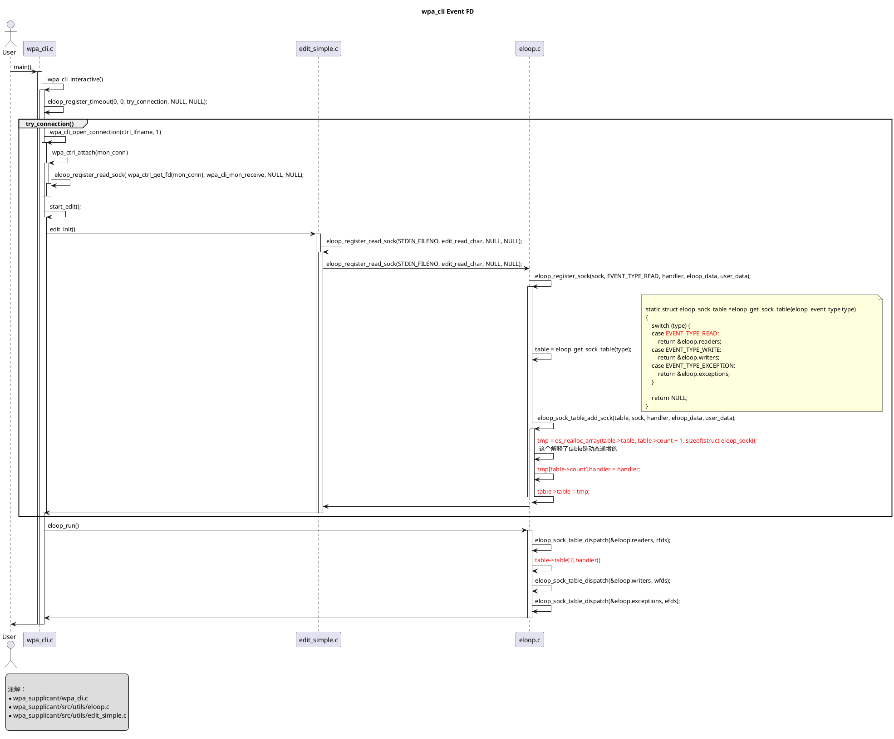
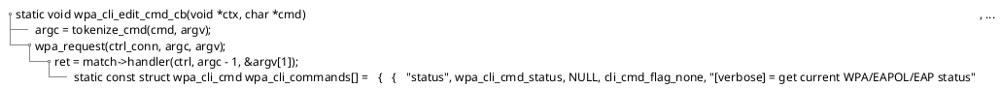

# wpa_cli

分析wpa_cli的工作原理

* [一、参考文档](#一参考文档)
* [二、编译wpa_cli](#二编译wpa_cli)
* [三、wps_cli使用](#三wps_cli使用)
* [四、Event IO Type](#四Event-IO-Type)
* [五、Deal With Read Event](#五Deal-With-Read-Event)
  * [5.1 注册处理函数](#51-注册处理函数)
  * [5.2 注册两个reader处理函数流程](#52-注册两个reader处理函数流程)
* [六、解析wpa_cli_recv_pending](#六解析wpa_cli_recv_pending)
* [七、解析edit_read_char](#七解析edit_read_char)
* [八、wpa_cli_edit_cmd_cb流程](#八wpa_cli_edit_cmd_cb流程)
* [九、解析wpa_cli_open_connection](#九解析wpa_cli_open_connection)
* [十、总结](#十总结)

## 一、参考文档

* [wpa_supplicant-devel.pdf](refers/wpa_supplicant-devel.pdf)
  * https://w1.fi/wpa_supplicant/devel/

## 二、编译wpa_cli

* 目前用的是Android的wpa_supplicant8源代码，测试的结果是，可以编译wpa_cli
* cd wpa_supplicant_8/wpa_supplicant
* cp defconfig .config
* make wpa_cli
  ```
  CC  wpa_cli.c
  CC  ../src/common/wpa_ctrl.c
  CC  ../src/utils/wpa_debug.c
  CC  ../src/utils/common.c
  CC  ../src/common/cli.c
  CC  ../src/utils/os_unix.c
  CC  ../src/utils/eloop.c
  CC  ../src/utils/edit_simple.c
  LD  wpa_cli
  ```
* CONFIG_CTRL_IFACE_NAMED_PIPE is not defined

## 三、wps_cli使用

* [wpa_cli 命令介绍](https://blog.csdn.net/ltm157/article/details/24810685)
* 主要命令
  ```bash
  root@raspberrypi:/home/pi# wpa_cli -i wlan0
  > list_networks
  > add_network
  > set_network 3 ssid "zengjf"
  > set_network 3 psk "zjf199042"
  > select_network 3
  ```
* 完整操作及log
  ```bash
  root@raspberrypi:/home/pi# wpa_cli -i wlan0
  wpa_cli v2.8-devel
  Copyright (c) 2004-2019, Jouni Malinen <j@w1.fi> and contributors
  
  This software may be distributed under the terms of the BSD license.
  See README for more details.
  
  
  
  Interactive mode
  
  <3>CTRL-EVENT-SCAN-STARTED
  <3>CTRL-EVENT-SCAN-RESULTS
  <3>WPS-AP-AVAILABLE
  <3>CTRL-EVENT-NETWORK-NOT-FOUND
  <3>CTRL-EVENT-SCAN-STARTED
  <3>CTRL-EVENT-SCAN-RESULTS
  <3>WPS-AP-AVAILABLE
  <4>Failed to initiate sched scan
  <3>CTRL-EVENT-NETWORK-NOT-FOUND
  <3>CTRL-EVENT-SCAN-STARTED
  <3>CTRL-EVENT-SCAN-RESULTS
  <3>WPS-AP-AVAILABLE
  <4>Failed to initiate sched scan
  <3>CTRL-EVENT-NETWORK-NOT-FOUND
  <3>CTRL-EVENT-SCAN-STARTED
  <3>CTRL-EVENT-SCAN-RESULTS
  <3>WPS-AP-AVAILABLE
  <4>Failed to initiate sched scan
  <3>CTRL-EVENT-NETWORK-NOT-FOUND
  > list_networks
  network id / ssid / bssid / flags
  0       Adan    any
  1       zengjianfeng    any
  2       HUAWEI-FPHZ5J   any
  <3>CTRL-EVENT-SCAN-STARTED
  <3>CTRL-EVENT-SCAN-RESULTS
  <3>WPS-AP-AVAILABLE
  <4>Failed to initiate sched scan
  <3>CTRL-EVENT-NETWORK-NOT-FOUND
  <3>CTRL-EVENT-SCAN-STARTED
  > set
  set          set_cred     set_network
  > set
  set          set_cred     set_network
  <3>CTRL-EVENT-SCAN-RESULTS
  <3>WPS-AP-AVAILABLE
  <4>Failed to initiate sched scan
  <3>CTRL-EVENT-NETWORK-NOT-FOUND
  <3>CTRL-EVENT-SCAN-STARTED
  <3>CTRL-EVENT-SCAN-RESULTS
  <3>WPS-AP-AVAILABLE
  <4>Failed to initiate sched scan
  <3>CTRL-EVENT-NETWORK-NOT-FOUND
  > add_network
  3
  <3>CTRL-EVENT-SCAN-STARTED
  <3>CTRL-EVENT-SCAN-RESULTS
  <3>WPS-AP-AVAILABLE
  <3>CTRL-EVENT-NETWORK-NOT-FOUND
  <3>CTRL-EVENT-SCAN-STARTED
  <3>CTRL-EVENT-SCAN-RESULTS
  <3>WPS-AP-AVAILABLE  "zengj
  <3>CTRL-EVENT-NETWORK-NOT-FOUND
  > set_network 3 ssid "zengjf"
  OK
  <3>CTRL-EVENT-SCAN-STARTED
  <3>CTRL-EVENT-SCAN-RESULTS
  <3>WPS-AP-AVAILABLE
  <4>Failed to initiate sched scan
  <3>CTRL-EVENT-NETWORK-NOT-FOUND
  <3>CTRL-EVENT-SCAN-STARTED
  > set_network 3 psk "zjf199042"
  OK
  <3>CTRL-EVENT-SCAN-RESULTS
  <3>WPS-AP-AVAILABLE
  <4>Failed to initiate sched scan
  <3>CTRL-EVENT-NETWORK-NOT-FOUND
  <3>CTRL-EVENT-SCAN-STARTED
  > select_network 3
  OK
  <3>CTRL-EVENT-SCAN-RESULTS
  <3>WPS-AP-AVAILABLE
  <3>Trying to associate with SSID 'zengjf'
  <3>CTRL-EVENT-ASSOC-REJECT bssid=00:00:00:00:00:00 status_code=16
  <3>CTRL-EVENT-SCAN-STARTED
  <3>CTRL-EVENT-SCAN-RESULTS
  <3>WPS-AP-AVAILABLE
  <3>Trying to associate with SSID 'zengjf'
  <3>Associated with c4:9f:4c:b3:3b:52
  <3>CTRL-EVENT-CONNECTED - Connection to c4:9f:4c:b3:3b:52 completed [id=3 id_str=]
  <3>CTRL-EVENT-SUBNET-STATUS-UPDATE status=0
  <3>CTRL-EVENT-REGDOM-CHANGE init=COUNTRY_IE type=COUNTRY alpha2=CN
  <3>CTRL-EVENT-SCAN-STARTED
  <3>CTRL-EVENT-SCAN-RESULTS
  > quit
  ```


## 四、Event IO Type



## 五、Deal With Read Event

### 5.1 注册处理函数



### 5.2 注册两个reader处理函数流程

* 一个读取标准输入,完成我们键盘输入的命令操作；
* 一个读取wpa_supplicant提供的数据，可以知道当前系统WiFi的状态；



## 六、解析wpa_cli_recv_pending

```C
static void wpa_cli_recv_pending(struct wpa_ctrl *ctrl, int action_monitor)
{
        if (ctrl_conn == NULL) {
                wpa_cli_reconnect();
                return;
        }
        while (wpa_ctrl_pending(ctrl) > 0) {                                      // 查看当前是否还有信息需要读取
                char buf[4096];
                size_t len = sizeof(buf) - 1;
                if (wpa_ctrl_recv(ctrl, buf, &len) == 0) {                        // 读取数据到buf中
                        buf[len] = '\0';
                        if (action_monitor)                                       // 0, 不执行if里面
                                wpa_cli_action_process(buf);
                        else {
                                cli_event(buf);
                                if (wpa_cli_show_event(buf)) {                    // 过滤掉不需要显示的event，并不是什么信息都打印
                                        edit_clear_line();
                                        printf("\r%s\n", buf);                    // 最终我们在命令行中看到的输出信息，类似：<3>CTRL-EVENT-NETWORK-NOT-FOUND
                                        edit_redraw();
                                }

                                if (interactive && check_terminating(buf) > 0)
                                        return;
                        }
                } else {
                        printf("Could not read pending message.\n");
                        break;
                }
        }

        if (wpa_ctrl_pending(ctrl) < 0) {
                printf("Connection to wpa_supplicant lost - trying to "
                       "reconnect\n");
                wpa_cli_reconnect();
        }
}
```

## 七、解析edit_read_char

```C
static void edit_read_char(int sock, void *eloop_ctx, void *sock_ctx)
{
        printf("%s: %s\n", __FILE__, __func__);
        int c;
        unsigned char buf[1];
        int res;

        res = read(sock, buf, 1);
        if (res < 0)
                perror("read");
        if (res <= 0) {                                               // CTRL+D程序退出的时候执行的
                edit_eof_cb(edit_cb_ctx);
                return;
        }
        c = buf[0];

        if (c == '\r' || c == '\n') {
                cmdbuf[cmdbuf_pos] = '\0';
                cmdbuf_pos = 0;
                edit_cmd_cb(edit_cb_ctx, cmdbuf);                     // 按Enter执行
                printf("%s> ", ps2 ? ps2 : "");
                fflush(stdout);
                return;
        }

        if (c == '\b') {
                if (cmdbuf_pos > 0)
                        cmdbuf_pos--;
                return;
        }

        if (c >= 32 && c <= 255) {
                if (cmdbuf_pos < (int) sizeof(cmdbuf) - 1) {
                        cmdbuf[cmdbuf_pos++] = c;
                }
        }
}
```

## 八、wpa_cli_edit_cmd_cb流程



## 九、解析wpa_cli_open_connection

* 这里主要是打开两个socket本地连接，一个用于发送wpa cmd， 一个用于监听wpa信息：
  * ctrl_conn = wpa_ctrl_open2(cfile, client_socket_dir);
  * mon_conn = wpa_ctrl_open2(cfile, client_socket_dir);

```C
static int wpa_cli_open_connection(const char *ifname, int attach)
{
#if defined(CONFIG_CTRL_IFACE_UDP) || defined(CONFIG_CTRL_IFACE_NAMED_PIPE)             // 不执行if内部
        ctrl_conn = wpa_ctrl_open(ifname);
        if (ctrl_conn == NULL)
                return -1;

        if (attach && interactive)
                mon_conn = wpa_ctrl_open(ifname);
        else
                mon_conn = NULL;
#else /* CONFIG_CTRL_IFACE_UDP || CONFIG_CTRL_IFACE_NAMED_PIPE */
        char *cfile = NULL;
        int flen, res;

        if (ifname == NULL)
                return -1;

#ifdef ANDROID                                                                          // 假装不是Android，因为是在树莓派上做的调试
        if (access(ctrl_iface_dir, F_OK) < 0) {
                cfile = os_strdup(ifname);
                if (cfile == NULL)
                        return -1;
        }
#endif /* ANDROID */

        if (client_socket_dir && client_socket_dir[0] &&
            access(client_socket_dir, F_OK) < 0) {
                perror(client_socket_dir);
                os_free(cfile);
                return -1;
        }

        if (cfile == NULL) {
                flen = os_strlen(ctrl_iface_dir) + os_strlen(ifname) + 2;
                cfile = os_malloc(flen);
                if (cfile == NULL)
                        return -1;
                res = os_snprintf(cfile, flen, "%s/%s", ctrl_iface_dir,
                                  ifname);
                if (os_snprintf_error(flen, res)) {
                        os_free(cfile);
                        return -1;
                }
        }

        ctrl_conn = wpa_ctrl_open2(cfile, client_socket_dir);                           // cfile: /var/run/wpa_supplicant/wlan0
        if (ctrl_conn == NULL) {
                os_free(cfile);
                return -1;
        }

        if (attach && interactive)
                mon_conn = wpa_ctrl_open2(cfile, client_socket_dir);                    // mon_conn: monitor connector 
        else
                mon_conn = NULL;
        os_free(cfile);
#endif /* CONFIG_CTRL_IFACE_UDP || CONFIG_CTRL_IFACE_NAMED_PIPE */

        if (mon_conn) {
                if (wpa_ctrl_attach(mon_conn) == 0) {
                        wpa_cli_attached = 1;
                        if (interactive)
                                eloop_register_read_sock(
                                        wpa_ctrl_get_fd(mon_conn),
                                        wpa_cli_mon_receive, NULL, NULL);
                } else {
                        printf("Warning: Failed to attach to "
                               "wpa_supplicant.\n");
                        wpa_cli_close_connection();
                        return -1;
                }
        }

        return 0;
}
```

## 十、总结

* WiFi内部已经支持了各种加密方式，但由于WiFi通讯无线的特殊性，导致需要用户能够将一些加密信息加入连接中，而wpa_supplicant相当于实现了有线网卡的PHY自动握手那些工作；
* wpa_supplicant提供数据在无线链路层的数据传输方式的设置工具；
* wpa_cli是命令行用于连接WiFi的工具，他是和wpa_supplicant进行通信的；
* AP: Access Point
* STA: Station
