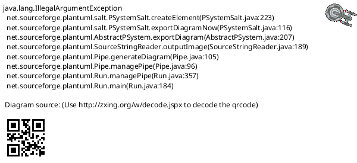
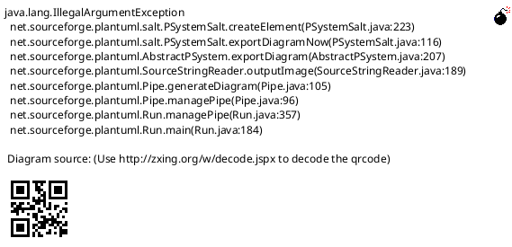
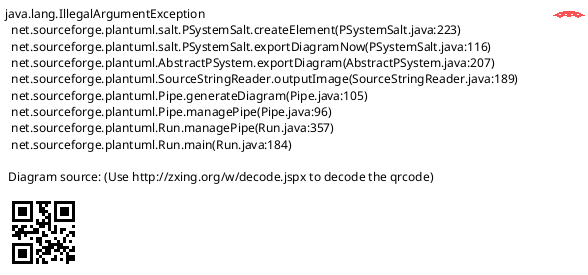

# wpa_supplicant deamon

分析wpa_supplicant后台程序工作原理

* [一、参考文档](#一参考文档)
* [二、下载wpa_supplicant](#二下载wpa_supplicant)
* [三、搭建wpa_supplicant调试环境](#三搭建wpa_supplicant调试环境)
* [四、设置debug level](#四设置debug-level)
* [五、扫描方式](#五扫描方式)
* [六、BSS(Basic Service Set)](#六BSSBasic-Service-Set)
* [七、ctrl_iface](#七ctrl_iface)
  * [7.1 wpa_supplicant_ctrl_iface_receive注册](#71-wpa_supplicant_ctrl_iface_receive注册)
  * [7.2 分析wpa_supplicant_ctrl_iface_receive](#72-分析wpa_supplicant_ctrl_iface_receive)
* [八、SCAN](#八SCAN)
  * [8.1 Makefile](#81-Makefile)
  * [8.2 bgscan](#82-bgscan)
  * [8.3 wifi找不到连接的时候的state](#83-wifi找不到连接的时候的state)
  * [8.4 Scanning interval周期](#84-Scanning-interval周期)
* [九、nl80211 Driver](#九nl80211-Driver)
  * [9.1 cmd设置驱动](#91-cmd设置驱动)
  * [9.2 注册驱动及事件处理函数](#92-注册驱动及事件处理函数)
  * [9.3 SCAN cmd](#93-SCAN-cmd)
  * [9.4 内核nl80211.h](#94-内核nl80211h)
  * [9.5 事件处理(process_global_event)及wpa_cli通信](#95-事件处理process_global_event及wpa_cli通信)
* [十、利用函数MAP文件查找Timeout Handler](#十利用函数MAP文件查找Timeout-Handler)
  * [10.1 修改Makefile生成MAP文件](#101-修改Makefile生成MAP文件)
  * [10.2 MAP文件找Timeout Handler](#102-MAP文件找Timeout-Handler)
* [十一、Event Loop](#十一Event-Loop)
  * [11.1 Event Loop Struct](#111-Event-Loop-Struct)
  * [11.2 Event事件解析](#112-Event事件解析)
  * [11.3 Event loop Select处理流程](#113-Event-loop-Select处理流程)
  * [11.4 注册timeout(超市递增双向链表)](#114-注册timeout超市递增双向链表)
  * [11.5 event loop整体架构](#115-event-loop整体架构)
* [十二、wpas_periodic分析](#十二wpas_periodic分析)
  * [12.1 wpas_periodic注册](#121-wpas_periodic注册)
  * [12.1 wpas_periodic代码](#121-wpas_periodic代码)
* [十三、注册work示例](#十三注册work示例)

## 一、参考文档

* https://w1.fi/wpa_supplicant/
  * https://w1.fi/releases/

## 二、下载wpa_supplicant

* https://w1.fi/releases/
* wpa_supplicant -h
  ```
  wpa_supplicant v2.8-devel
  Copyright (c) 2003-2019, Jouni Malinen <j@w1.fi> and contributors
  
  This software may be distributed under the terms of the BSD license.
  See README for more details.
  
  This product includes software developed by the OpenSSL Project
  for use in the OpenSSL Toolkit (http://www.openssl.org/)
  ```
* wpa_supplicant-2.8.tar.gz

## 三、搭建wpa_supplicant调试环境

* sudo apt-get install dbus libdbus-1-dev libdbus-glib-1-2 libdbus-glib-1-dev libreadline-dev libncurses5-dev
* sudo apt-get install libnl-genl-3-dev
* cd wpa_supplicant-2.8/wpa_supplicant
* make
  ```
  LD  wpa_supplicant
  CC  wpa_cli.c
  CC  ../src/common/wpa_ctrl.c
  CC  ../src/common/cli.c
  CC  ../src/utils/edit_simple.c
  LD  wpa_cli
  CC  wpa_passphrase.c
  LD  wpa_passphrase
  sed systemd/wpa_supplicant.service.in
  sed systemd/wpa_supplicant.service.arg.in
  sed systemd/wpa_supplicant-nl80211.service.arg.in
  sed systemd/wpa_supplicant-wired.service.arg.in
  sed dbus/fi.w1.wpa_supplicant1.service.in
  ```
* whereis wpa_supplicant
  ```
  wpa_supplicant: /sbin/wpa_supplicant /etc/wpa_supplicant /usr/share/man/man8/wpa_supplicant.8.gz
  ```
* sudo systemctl restart networking.service
* ps aux | grep wpa
  ```
  root       419  0.0  0.1  10700  4016 ?        Ss   Mar27   0:00 /sbin/wpa_supplicant -u -s -O /run/wpa_supplicant
  root       559  0.2  0.0  11072  3384 ?        Ss   Mar27   0:10 wpa_supplicant -B -c/etc/wpa_supplicant/wpa_supplicant.conf -iwlan0 -Dnl80211,wext
  root      2462  0.0  0.0   7348   552 pts/2    S+   00:48   0:00 grep wpa
  ```
* kill -9 559
* 运行自己编译的wpa_supplicant
  * ./wpa_supplicant -B -c/etc/wpa_supplicant/wpa_supplicant.conf -iwlan0 -Dnl80211,wext
  * ./wpa_supplicant -c/etc/wpa_supplicant/wpa_supplicant.conf -iwlan0 -Dnl80211,wext
    ```
    Successfully initialized wpa_supplicant
    wlan0: Failed to initiate sched scan
    wlan0: Failed to initiate sched scan
    wlan0: Failed to initiate sched scan
    wlan0: Trying to associate with SSID 'zengjf'
    wlan0: Associated with c4:9f:4c:b3:3b:52
    wlan0: CTRL-EVENT-CONNECTED - Connection to c4:9f:4c:b3:3b:52 completed [id=2 id_str=]
    wlan0: CTRL-EVENT-SUBNET-STATUS-UPDATE status=0
    wlan0: CTRL-EVENT-REGDOM-CHANGE init=COUNTRY_IE type=COUNTRY alpha2=CN
    wlan0: CTRL-EVENT-DISCONNECTED bssid=c4:9f:4c:b3:3b:52 reason=3 locally_generated=1
    wlan0: CTRL-EVENT-REGDOM-CHANGE init=CORE type=WORLD
    wlan0: Trying to associate with SSID 'zengjf'
    wlan0: CTRL-EVENT-ASSOC-REJECT bssid=00:00:00:00:00:00 status_code=16
    wlan0: Trying to associate with SSID 'zengjf'
    wlan0: CTRL-EVENT-ASSOC-REJECT bssid=00:00:00:00:00:00 status_code=16
    wlan0: Trying to associate with SSID 'zengjf'
    wlan0: CTRL-EVENT-ASSOC-REJECT bssid=00:00:00:00:00:00 status_code=16
    wlan0: CTRL-EVENT-SSID-TEMP-DISABLED id=2 ssid="zengjf" auth_failures=1 duration=10 reason=CONN_FAILED
    wlan0: CTRL-EVENT-SSID-REENABLED id=2 ssid="zengjf"
    wlan0: Trying to associate with SSID 'zengjf'
    wlan0: CTRL-EVENT-ASSOC-REJECT bssid=00:00:00:00:00:00 status_code=16
    wlan0: CTRL-EVENT-SSID-TEMP-DISABLED id=2 ssid="zengjf" auth_failures=2 duration=20 reason=CONN_FAILED
    wlan0: CTRL-EVENT-SSID-REENABLED id=2 ssid="zengjf"
    wlan0: Trying to associate with SSID 'zengjf'
    wlan0: Associated with c4:9f:4c:b3:3b:52
    wlan0: CTRL-EVENT-CONNECTED - Connection to c4:9f:4c:b3:3b:52 completed [id=2 id_str=]
    wlan0: CTRL-EVENT-SUBNET-STATUS-UPDATE status=0
    wlan0: CTRL-EVENT-REGDOM-CHANGE init=COUNTRY_IE type=COUNTRY alpha2=CN
    wlan0: CTRL-EVENT-DISCONNECTED bssid=c4:9f:4c:b3:3b:52 reason=3 locally_generated=1
    wlan0: CTRL-EVENT-REGDOM-CHANGE init=CORE type=WORLD
    ```

## 四、设置debug level

* grep DEBUG defconfig
  ```
  #CONFIG_NO_STDOUT_DEBUG=y
  CONFIG_DEBUG_FILE=y
  CONFIG_DEBUG_SYSLOG=y
  #CONFIG_DEBUG_SYSLOG_FACILITY=LOG_DAEMON
  #CONFIG_DEBUG_LINUX_TRACING=y
  ```
  * CONFIG_DEBUG_FILE=y
    * -f: params.wpa_debug_file_path = optarg;
    * 操作方法：
      * ./wpa_supplicant -c/etc/wpa_supplicant/wpa_supplicant.conf -iwlan0 -Dnl80211,wext -f log.txt
      * tail -f log.txt
  * CONFIG_DEBUG_SYSLOG=y
    * -s: log output to syslog instead of stdout
    * 操作方法：
      * ./wpa_supplicant -c/etc/wpa_supplicant/wpa_supplicant.conf -iwlan0 -Dnl80211,wext -s
      * tail -f /var/log/syslog
  * CONFIG_DEBUG_LINUX_TRACING=y
    * -T: record to Linux tracing in addition to logging
    * 操作方法：
      * sudo apt-get -y install trace-cmd kernelshark
      * grep debugfs /proc/mounts
        ```
        debugfs /sys/kernel/debug debugfs rw,relatime 0 0
        ```
      * /sys/kernel/debug/tracing/trace_marker
      * ./wpa_supplicant -c/etc/wpa_supplicant/wpa_supplicant.conf -iwlan0 -Dnl80211,wext -T
      * trace-cmd record -e all -P 6394
        * 看man帮助使用
      * kernelshark  
        
      * 好像这个`trace-cmd`、`kernelshark`是个超级好的东西，不过目前暂时不知道怎么具体使用，后续重点研究
* debug输出代码：src/utils/wpa_debug.c
  ```C
  /**
   * wpa_printf - conditional printf
   * @level: priority level (MSG_*) of the message
   * @fmt: printf format string, followed by optional arguments
   *
   * This function is used to print conditional debugging and error messages. The
   * output may be directed to stdout, stderr, and/or syslog based on
   * configuration.
   *
   * Note: New line '\n' is added to the end of the text when printing to stdout.
   */
  void wpa_printf(int level, const char *fmt, ...)
  {
          va_list ap;
  
          va_start(ap, fmt);
          if (level >= wpa_debug_level) {
  #ifdef CONFIG_ANDROID_LOG
                  __android_log_vprint(wpa_to_android_level(level),
                                       ANDROID_LOG_NAME, fmt, ap);
  #else /* CONFIG_ANDROID_LOG */
  #ifdef CONFIG_DEBUG_SYSLOG
                  if (wpa_debug_syslog) {
                          vsyslog(syslog_priority(level), fmt, ap);
                  } else {
  #endif /* CONFIG_DEBUG_SYSLOG */
                  wpa_debug_print_timestamp();
  #ifdef CONFIG_DEBUG_FILE
                  if (out_file) {
                          vfprintf(out_file, fmt, ap);
                          fprintf(out_file, "\n");
                  } else {
  #endif /* CONFIG_DEBUG_FILE */
                  vprintf(fmt, ap);
                  printf("\n");
  #ifdef CONFIG_DEBUG_FILE
                  }
  #endif /* CONFIG_DEBUG_FILE */
  #ifdef CONFIG_DEBUG_SYSLOG
                  }
  #endif /* CONFIG_DEBUG_SYSLOG */
  #endif /* CONFIG_ANDROID_LOG */
          }
          va_end(ap);
  
  #ifdef CONFIG_DEBUG_LINUX_TRACING
          if (wpa_debug_tracing_file != NULL) {
                  va_start(ap, fmt);
                  fprintf(wpa_debug_tracing_file, WPAS_TRACE_PFX, level);
                  vfprintf(wpa_debug_tracing_file, fmt, ap);
                  fprintf(wpa_debug_tracing_file, "\n");
                  fflush(wpa_debug_tracing_file);
                  va_end(ap);
          }
  #endif /* CONFIG_DEBUG_LINUX_TRACING */
  }
  ```
* wpa_cli设置debug level
  * sudo wpa_cli setting debugging level
  * sudo wpa_cli log_level
* 设置默认debug level
  * wpa_supplicant/main.c --> params.wpa_debug_level = MSG_INFO;
  * 以下这个是参考，会被上面这个设置值修改：
    * src/utils/wpa_debug.c --> int wpa_debug_level = MSG_INFO;

## 五、扫描方式

手机扫描结果的获取有两种方式：被动和主动: 

* AP隔固定时间会发送Beacon帧，Beacon帧中有AP的SSID BSSID等基本信息，手机接收到Beacon帧就认为搜索到该AP创建的网络
* 手机主动发出probe request帧，AP接收到probe request帧后会发送probe response帧，手机接收到response帧后，就认为扫描到该网络。

在手机wlan界面中，点击刷新既采用的第二种方式（当然扫描结果中也会包含部分方式1中扫描到的网络）

## 六、BSS(Basic Service Set)

* 参考文档： 
  * [基本服务集](https://baike.baidu.com/item/%E5%9F%BA%E6%9C%AC%E6%9C%8D%E5%8A%A1%E9%9B%86/10907357?fr=aladdin)
  * [服务集](https://zh.wikipedia.org/wiki/%E6%9C%8D%E5%8A%A1%E9%9B%86_(%E6%97%A0%E7%BA%BF%E5%B1%80%E5%9F%9F%E7%BD%91))
* 简写：服务集标识符（SSID）、独立基本服务集（IBSS）、基本服务集（BSS）、扩展服务集（ESS）、BSSID(MAC)
* 假装认为BSS就是指AP信息；


## 七、ctrl_iface

### 7.1 wpa_supplicant_ctrl_iface_receive注册



### 7.2 分析wpa_supplicant_ctrl_iface_receive

```C
static void wpa_supplicant_ctrl_iface_receive(int sock, void *eloop_ctx,
                                              void *sock_ctx)
{
        struct wpa_supplicant *wpa_s = eloop_ctx;
        struct ctrl_iface_priv *priv = sock_ctx;
        char buf[4096];
        int res;
        struct sockaddr_storage from;
        socklen_t fromlen = sizeof(from);
        char *reply = NULL, *reply_buf = NULL;
        size_t reply_len = 0;
        int new_attached = 0;

        res = recvfrom(sock, buf, sizeof(buf) - 1, 0,
                       (struct sockaddr *) &from, &fromlen);
        if (res < 0) {
                wpa_printf(MSG_ERROR, "recvfrom(ctrl_iface): %s",
                           strerror(errno));
                return;
        }
        buf[res] = '\0';

        if (os_strcmp(buf, "ATTACH") == 0) {
                if (wpa_supplicant_ctrl_iface_attach(&priv->ctrl_dst, &from,
                                                     fromlen, 0))
                        reply_len = 1;
                else {
                        new_attached = 1;
                        reply_len = 2;
                }
        } else if (os_strcmp(buf, "DETACH") == 0) {
                if (wpa_supplicant_ctrl_iface_detach(&priv->ctrl_dst, &from,
                                                     fromlen))
                        reply_len = 1;
                else
                        reply_len = 2;
        } else if (os_strncmp(buf, "LEVEL ", 6) == 0) {
                if (wpa_supplicant_ctrl_iface_level(priv, &from, fromlen,
                                                    buf + 6))
                        reply_len = 1;
                else
                        reply_len = 2;
        } else {
                reply_buf = wpa_supplicant_ctrl_iface_process(wpa_s, buf,
                                                              &reply_len);
                reply = reply_buf;

                /*
                 * There could be some password/key material in the command, so
                 * clear the buffer explicitly now that it is not needed
                 * anymore.
                 */
                os_memset(buf, 0, res);
        }

        if (!reply && reply_len == 1) {
                reply = "FAIL\n";
                reply_len = 5;
        } else if (!reply && reply_len == 2) {
                reply = "OK\n";
                reply_len = 3;
        }

        if (reply) {
                wpas_ctrl_sock_debug("ctrl_sock-sendto", sock, reply,
                                     reply_len);
                if (sendto(sock, reply, reply_len, 0, (struct sockaddr *) &from,
                           fromlen) < 0) {
                        int _errno = errno;
                        wpa_dbg(wpa_s, MSG_DEBUG,
                                "ctrl_iface sendto failed: %d - %s",
                                _errno, strerror(_errno));
                        if (_errno == ENOBUFS || _errno == EAGAIN) {
                                /*
                                 * The socket send buffer could be full. This
                                 * may happen if client programs are not
                                 * receiving their pending messages. Close and
                                 * reopen the socket as a workaround to avoid
                                 * getting stuck being unable to send any new
                                 * responses.
                                 */
                                sock = wpas_ctrl_iface_reinit(wpa_s, priv);
                                if (sock < 0) {
                                        wpa_dbg(wpa_s, MSG_DEBUG, "Failed to reinitialize ctrl_iface socket");
                                }
                        }
                        if (new_attached) {
                                wpa_dbg(wpa_s, MSG_DEBUG, "Failed to send response to ATTACH - detaching");
                                new_attached = 0;
                                wpa_supplicant_ctrl_iface_detach(
                                        &priv->ctrl_dst, &from, fromlen);
                        }
                }
        }
        os_free(reply_buf);

        if (new_attached)
                eapol_sm_notify_ctrl_attached(wpa_s->eapol);
}
```

## 八、SCAN

### 8.1 Makefile

* grep SCAN wpa_supplicant/defconfig
  ```
  #CONFIG_NO_SCAN_PROCESSING=y
  #CONFIG_AUTOSCAN_EXPONENTIAL=y
  #CONFIG_AUTOSCAN_PERIODIC=y
  CONFIG_BGSCAN_SIMPLE=y
  #CONFIG_BGSCAN_LEARN=y
  ```
* wpa_supplicant/Makefile
  ```Makefile
  ifdef CONFIG_BGSCAN_SIMPLE
  CFLAGS += -DCONFIG_BGSCAN_SIMPLE
  OBJS += bgscan_simple.o
  NEED_BGSCAN=y
  endif
  
  ifdef CONFIG_BGSCAN_LEARN
  CFLAGS += -DCONFIG_BGSCAN_LEARN
  OBJS += bgscan_learn.o
  NEED_BGSCAN=y
  endif
  
  ifdef NEED_BGSCAN
  CFLAGS += -DCONFIG_BGSCAN
  OBJS += bgscan.o
  endif
  
  ifdef CONFIG_AUTOSCAN_EXPONENTIAL
  CFLAGS += -DCONFIG_AUTOSCAN_EXPONENTIAL
  OBJS += autoscan_exponential.o
  NEED_AUTOSCAN=y
  endif
  
  ifdef CONFIG_AUTOSCAN_PERIODIC
  CFLAGS += -DCONFIG_AUTOSCAN_PERIODIC
  OBJS += autoscan_periodic.o
  NEED_AUTOSCAN=y
  endif
  
  ifdef NEED_AUTOSCAN
  CFLAGS += -DCONFIG_AUTOSCAN
  OBJS += autoscan.o
  endif
  ```

### 8.2 bgscan

目前发现bgscan是没有用到的


### 8.3 wifi找不到连接的时候的state

* grep "^wlan0: State:" log.txt
  ```
  wlan0: State: DISCONNECTED -> DISCONNECTED
  wlan0: State: DISCONNECTED -> SCANNING
  wlan0: State: SCANNING -> DISCONNECTED
  ```

这里最关键的就是启动了`SCANNING`，导致注册了scan处理定时器，从而会在后台一直scan，但不是用上面的bgscan；

### 8.4 Scanning interval周期

从这里可知默认scan的周期是`5s`，第一次在`WPA_DISCONNECTED`状态下`wpa_supplicant_stop_autoscan()`会设置进入`WPA_SCANNING`状态

`wpas_trigger_scan_cb()`函数是在`5s`定时之后被调用的，也就是说实际处理Scan的函数是它，其会调用libnl函数进行Scan；



`wpa_supplicant_alloc()`初始化的时候就设置为`5s`了

```C
static struct wpa_supplicant *
wpa_supplicant_alloc(struct wpa_supplicant *parent)
{
        struct wpa_supplicant *wpa_s;

        wpa_s = os_zalloc(sizeof(*wpa_s));
        if (wpa_s == NULL)
                return NULL;
        wpa_s->scan_req = INITIAL_SCAN_REQ;
        wpa_s->scan_interval = 5;
        wpa_s->new_connection = 1;
        wpa_s->parent = parent ? parent : wpa_s;
        wpa_s->p2pdev = wpa_s->parent;
        wpa_s->sched_scanning = 0;

        dl_list_init(&wpa_s->bss_tmp_disallowed);
        dl_list_init(&wpa_s->fils_hlp_req);

        return wpa_s;
}
```

## 九、nl80211 Driver

### 9.1 cmd设置驱动

* ./wpa_supplicant -c/etc/wpa_supplicant/wpa_supplicant.conf -iwlan0 -Dnl80211,wext -f log.txt
  * -Dnl80211,wext
    * driver: nl80211,wext
      * 第一个优先匹配规则：nl80211，故使用nl80211驱动控制Wifi

### 9.2 注册驱动及事件处理函数



分析代码的过程中会发现，最后nl80211驱动调用了[`libnl`](https://www.infradead.org/~tgr/libnl/doc/api/index.html#main_intro)库中的方法与内核进行通信；

### 9.3 SCAN cmd

* NL80211_CMD_GET_SCAN: 32
* NL80211_CMD_TRIGGER_SCAN: 33
* NL80211_CMD_NEW_SCAN_RESULTS: 34
* NL80211_CMD_SCAN_ABORTED: 35

### 9.4 内核nl80211.h

* [About nl80211](https://wireless.wiki.kernel.org/en/developers/documentation/nl80211)
* [nl80211.h](https://git.kernel.org/pub/scm/linux/kernel/git/linville/wireless.git/tree/include/uapi/linux/nl80211.h?id=HEAD)

```C
enum nl80211_commands {
    // ...省略
    NL80211_CMD_GET_SCAN,
    NL80211_CMD_TRIGGER_SCAN,
    NL80211_CMD_NEW_SCAN_RESULTS,
    NL80211_CMD_SCAN_ABORTED,
    // ...省略
}
```

### 9.5 事件处理(process_global_event)及wpa_cli通信

开始处理Scan的时候会接收到`cmd -> 33`，内核扫描完成会接收到`cmd -> 34`，这里需要非常注意的一点就是，在最后会重新注册`wpa_supplicant_req_new_scan`进行Scan任务调度，如果扫描到了AP并且连接上了AP，就不会进行扫描了，`wpa_bss_update_scan_res()`是处理获取到的BSS；

```plantuml
@startsalt
* src/drivers/driver_nl80211.c
  * nl_cb_set(global->nl_cb, NL_CB_VALID, NL_CB_CUSTOM, process_global_event, global);
    * process_global_event
      * do_process_drv_event(bss, gnlh->cmd, tb);
        * case NL80211_CMD_TRIGGER_SCAN:
          * wpa_supplicant_event(drv->ctx, EVENT_SCAN_STARTED, NULL);
            * wpa_supplicant/events.c
              * case EVENT_SCAN_STARTED:
                * wpa_dbg(wpa_s, MSG_DEBUG, "Own scan request started a scan in %ld.%06ld seconds", diff.sec, diff.usec);
                * wpa_msg_ctrl(wpa_s, MSG_INFO, WPA_EVENT_SCAN_STARTED);        <-- 将消息发送给wpa_cli
                  * #define WPA_EVENT_SCAN_STARTED "CTRL-EVENT-SCAN-STARTED "
        * case NL80211_CMD_NEW_SCAN_RESULTS:
          * wpa_dbg(drv->ctx, MSG_DEBUG, "nl80211: New scan results available");
          * send_scan_event(drv, 0, tb, external_scan_event);
            * wpa_supplicant_event(drv->ctx, EVENT_SCAN_RESULTS, &event);
              * wpa_dbg(wpa_s, MSG_DEBUG, "Scan completed in %ld.%06ld seconds", diff.sec, diff.usec);
              * wpa_supplicant_event_scan_results(wpa_s, data)
                * _wpa_supplicant_event_scan_results(wpa_s, data, 1, 0);
                  * scan_res = wpa_supplicant_get_scan_results(wpa_s, data ? &data->scan_info : NULL, 1);
                    * wpa_bss_update_scan_res(wpa_s, scan_res->res[i], &scan_res->fetch_time);                  <-- Scan获取到的BSS
                  * wpa_msg_ctrl(wpa_s, MSG_INFO, WPA_EVENT_SCAN_RESULTS);      <-- 将消息发送给wpa_cli
                    * #define WPA_EVENT_SCAN_RESULTS "CTRL-EVENT-SCAN-RESULTS "
                  * radio_work_done(work);                                      <-- work会被释放
                  * wpas_select_network_from_last_scan(wpa_s, 1, own_request);
                    * wpa_dbg(wpa_s, MSG_DEBUG, "No suitable network found");
                    * int timeout_sec = wpa_s->scan_interval;                   <-- 5s
                    * int timeout_usec = 0;
                    * wpa_supplicant_req_sched_scan(wpa_s)
                      * wpa_supplicant_req_new_scan(wpa_s, timeout_sec, timeout_usec);
                    * wpa_msg_ctrl(wpa_s, MSG_INFO, WPA_EVENT_NETWORK_NOT_FOUND);
                      * #define WPA_EVENT_NETWORK_NOT_FOUND "CTRL-EVENT-NETWORK-NOT-FOUND "
              * radio_work_check_next(wpa_s);                                   <-- 继续处理后续任务
  * nl80211_register_eloop_read(&global->nl_event, wpa_driver_nl80211_event_receive, global->nl_cb, 0);
@endsalt
```



## 十、利用函数MAP文件查找Timeout Handler

### 10.1 修改Makefile生成MAP文件

* wpa_supplicant/Makefile
  ```
  wpa_supplicant: $(BCHECK) $(OBJS) $(EXTRA_progs)
          $(Q)$(LDO) $(LDFLAGS) -o wpa_supplicant $(OBJS) $(LIBS) $(EXTRALIBS) -Wl,-Map=output.map
          @$(E) "  LD " $@
  ```

### 10.2 MAP文件找Timeout Handler

* src/utils/eloop.c
  ```C
  void eloop_run(void)
  {
          // ...省略
          if (timeout) {
                  os_get_reltime(&now);
                  if (!os_reltime_before(&now, &timeout->time)) {
                          void *eloop_data = timeout->eloop_data;
                          void *user_data = timeout->user_data;
                          eloop_timeout_handler handler =
                                  timeout->handler;
                          eloop_remove_timeout(timeout);
                          printf("handler 0x%08x timeout.\n", handler);         // 输出处理函数地址
                          handler(eloop_data, user_data);
                  }
  
          }
          // ...省略
  }
  ```
* handler基本是static函数，所以无法直接查找到，通过地址范围来确定处理函数在哪个文件中
* 示例：
  * handler 0x0013d16c timeout.
  * 在编译生成的`output.map`中查找`0x0013d`(后面16c不影响范围，不用完全匹配)
    ```
    .text          0x0013a7e0     0x466c scan.o
                   [...省略]
                   0x0013cd70                scan_only_handler
                   0x0013ce28                wpas_scan_scheduled
                   0x0013ce3c                wpa_scan_clone_params
                   0x0013d0d0                wpa_supplicant_trigger_scan
                   0x0013e4d4                wpa_scan_free_params
                   0x0013e4e0                wpas_start_pno
                   0x0013e8bc                wpas_stop_pno
    ```
  * 可知函数代码在：scan.c
  * 在scan.c中查找：`void *eloop_ctx, void *timeout_ctx`
    * 在找到的函数里分别加入：`printf("%s: %s\n", __FILE__, __func__);`，基本上就可以确定是什么函数了


## 十一、Event Loop

### 11.1 Event Loop Struct

参考文档： [WPA_SUPPLICANT源码分析（1）：EVENT LOOP的实现](https://blog.csdn.net/vapl32/article/details/7346604)


`struct eloop_data`结构体是一个统领全局的数据结构，只有一个实例：`static struct eloop_data eloop;`

### 11.2 Event事件解析

要处理的Event有三大种类型：Socket事件，Timeout事件，Signal事件。其中Socket事件又分为三种类型：

* @EVENT_TYPE_READ: Socket has data available for reading
* @EVENT_TYPE_WRITE: Socket has room for new data to be written
* @EVENT_TYPE_EXCEPTION: An exception has been reported

三大种事件简述：

1. Socket事件：有readers, writers, exceptions三个eloop_sock_table结构体， 每个里面都有动态数组，数组的每一项都是一个具体的eloop_sock. 可以向各个Table里面添加、删除eloop_sock. 事件分发就是遍历sock_table, 依次运行里面的每个Handler.
2. Timeout事件：每个struct eloop_timeout都被放在一个双向链表中，链表头就是eloop_data中的”timeout”项。这些struct eloop_timeout按超时先后排序。
3. Signal事件：每个struct eloop_signal放在动态数组中

### 11.3 Event loop Select处理流程

`int select(int nfds, fd_set *readfds, fd_set *writefds, fd_set *exceptfds, struct timeval *timeout);`

* 找到timeout链表的第一项（因为是按超时先后排序的，所以第一项肯定是最先超时的），计算超时时间距现在还有多久， 并据此设置select的timeout参数。
* 设置readfd, writefds和exceptfds三个fd_set:  方法是遍历各个eloop_sock_table，把每个sock描述符加入相应的fd_set里面。
* 判断是否有超时发生，如果是则调用其Handler， 并从timeout链表移除。然后继续下次循环。需要注意的是这里每次只会处理一个timeout。
* 如果不是超时事件，则应该是readfds, writefds或者exceptfds事件， fd_set里面会被改变，存放发生事件的描述符。因此分别遍历三个sock_table,  如果其描述符在fd_set里面则调用其Handler.

### 11.4 注册timeout(超市递增双向链表)

可以注册timeout，那么就可以删除timeout，删除的时候比较的的是`handler`、`eloop_data`、`user_data`参数指针是否一致。

```C
int eloop_register_timeout(unsigned int secs, unsigned int usecs,
                           eloop_timeout_handler handler,
                           void *eloop_data, void *user_data)
{
        struct eloop_timeout *timeout, *tmp;
        os_time_t now_sec;

        timeout = os_zalloc(sizeof(*timeout));
        if (timeout == NULL)
                return -1;
        if (os_get_reltime(&timeout->time) < 0) {
                os_free(timeout);
                return -1;
        }
        now_sec = timeout->time.sec;
        timeout->time.sec += secs;
        if (timeout->time.sec < now_sec) {
                /*
                 * Integer overflow - assume long enough timeout to be assumed
                 * to be infinite, i.e., the timeout would never happen.
                 */
                wpa_printf(MSG_DEBUG, "ELOOP: Too long timeout (secs=%u) to "
                           "ever happen - ignore it", secs);
                os_free(timeout);
                return 0;
        }
        timeout->time.usec += usecs;
        while (timeout->time.usec >= 1000000) {
                timeout->time.sec++;
                timeout->time.usec -= 1000000;
        }
        timeout->eloop_data = eloop_data;
        timeout->user_data = user_data;
        timeout->handler = handler;
        wpa_trace_add_ref(timeout, eloop, eloop_data);
        wpa_trace_add_ref(timeout, user, user_data);
        wpa_trace_record(timeout);

        /* Maintain timeouts in order of increasing time */
        dl_list_for_each(tmp, &eloop.timeout, struct eloop_timeout, list) {             // 超时递增双向链表
                if (os_reltime_before(&timeout->time, &tmp->time)) {
                        dl_list_add(tmp->list.prev, &timeout->list);
                        return 0;
                }
        }
        dl_list_add_tail(&eloop.timeout, &timeout->list);

        return 0;
}
```

### 11.5 event loop整体架构

整个系统运作均通过Select函数进行处理事件，同时利用Select的timeout来处理timeout链表中注册的定时handler函数，**核心就是理解`Select` + `Timeout`**的策略；


## 十二、wpas_periodic分析

### 12.1 wpas_periodic注册

```plantuml
@startuml
* wpa_supplicant/main.c
  * global = wpa_supplicant_init(&params);
    * eloop_register_timeout(WPA_SUPPLICANT_CLEANUP_INTERVAL, 0, wpas_periodic, global, NULL);
@enduml
```

### 12.1 wpas_periodic代码

参考文档：[Android wpa_supplicant源码分析--bss扫描结果](https://blog.csdn.net/cuijiyue/article/details/51439829)

每隔10秒都会刷新一下struct wpa_supplicant中的BSS列表，删除180s内没有找到的BSS；

```C
#ifndef WPA_SUPPLICANT_CLEANUP_INTERVAL
#define WPA_SUPPLICANT_CLEANUP_INTERVAL 10
#endif /* WPA_SUPPLICANT_CLEANUP_INTERVAL */

/* Periodic cleanup tasks */
static void wpas_periodic(void *eloop_ctx, void *timeout_ctx)
{
        struct wpa_global *global = eloop_ctx;
        struct wpa_supplicant *wpa_s;

        // timeout循环处理注册
        eloop_register_timeout(WPA_SUPPLICANT_CLEANUP_INTERVAL, 0,
                               wpas_periodic, global, NULL);

#ifdef CONFIG_P2P
        if (global->p2p)
                p2p_expire_peers(global->p2p);
#endif /* CONFIG_P2P */

        // 循环两次，分别是：p2p-dev-wlan0、wlan0，bss_expiration_age: 180
        for (wpa_s = global->ifaces; wpa_s; wpa_s = wpa_s->next) {
                wpa_bss_flush_by_age(wpa_s, wpa_s->conf->bss_expiration_age);
#ifdef CONFIG_AP
                ap_periodic(wpa_s);
#endif /* CONFIG_AP */
        }
}
```

## 十三、注册work示例

每一个work也是一个timeout回调函数，伪装成task的timeout处理函数，如下是开始处理一个`scan` work流程

