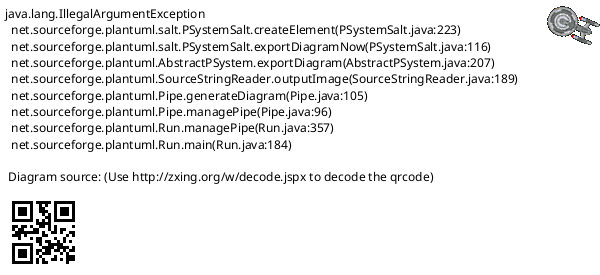

# netlink

libnl基本使用方法

* [一、参考文档](#一参考文档)
* [二、netlink简介](#二netlink简介)
* [三、nlmsghdr](#三nlmsghdr)
* [四、netlink group](#四netlink-group)
* [五、Netlink分层模型及消息格式](#五Netlink分层模型及消息格式)
* [六、Install libnl-3-dev](#六Install-libnl-3-dev)
* [七、编译应用程序](#七编译应用程序)
* [八、Linux Driver](#八Linux-Driver)
  * [8.1 参考分析](#81-参考分析)
  * [8.2 地址协议简写](#82-地址协议简写)
  * [8.3 消息格式](#83-消息格式)
  * [8.4 合成消息示例](#84-合成消息示例)

## 一、参考文档

* [Netlink Library (libnl)](https://www.infradead.org/~tgr/libnl/doc/core.html#_)
* [Understanding And Programming With Netlink Sockets](http://people.redhat.com/nhorman/papers/netlink.pdf)
* https://github.com/ZengjfOS/RaspberryPi/tree/hotplug
* [Linux libnl 编程](https://www.jianshu.com/p/e20da51e7263)

## 二、netlink简介

netlink是基于socket，并且是内核和用户进程都创建各自的socket，这样双方都使用基于socket的收发缓冲队列，这一点最大的好处是内核和用户进程都可以发起向对方发送消息，准确的说用户进程和内核进程(内核在系统中事实上也可以看做一个进程，其进程tgid为0)都可以是消息的发送者。

netlink作为套接字的一种，也遵循socket标准接口，其sockaddr的结构体实现包括：协议族(AF_NETLINK)、进程tgid、组播组

Netlink sockets are connectionless, and operate in much the same way UDP2 sockets do. 

LLCP: Logical Link Control Protocol

## 三、nlmsghdr

Netlink协议通常是基于消息的，消息则通常是由Netlink消息头部（struct nlmsghdr）加上有效载荷组成。虽然有效载荷可以由任何数据组成，但是它通常的格式是一 个固定大小的协议相关头部后面紧跟一系列的属性。


* 总长度（32 位）：消息包括 netlink 消息头部在内的总字节数
* 消息类型（16 位）：消息类型指明了消息的有效载荷的类型。netlink 协议定义了多个标准的消息类型。每个协 议簇都可能定义了额外的消息类型。
* 消息标志（16 位）：消息标志可以用来更改消息类型的行为。
* 序列号（32 位）：序列号的使用是可选的，它可以用来引用前一条消息。比如一条错误消息中可以引用导致错 误的那条请求消息。
* 端口号：端口号指明了这条消息需要发往哪个对等节点。如果没有指定端口号，那么这条消息会被投 递给同一个协议簇中第一个匹配的内核端套接字。


## 四、netlink group

Each socket can subscribe to any number of multicast groups of the netlink protocol it is connected to. The socket will then receive a copy of each message sent to any of the groups. Multicast groups are commonly used to implement event notifications.

这里理解netlink中的group的时候可以直接理解成协议分支，目前最多32种。例如NETLINK_ROUTE是其中一种netlink协议，但是该协议有多个group，可以认为事件分类，作为开发者可能只关心整个协议中的一部分事务(group)，同样，并不是说一个socket client只能订阅、加入一个group，实际上是可以加入32种的任意几个，他是通过32bit(4 byte)来保存的；

如下是个人理解关系:



## 五、Netlink分层模型及消息格式

参考文档：[Netlink分层模型及消息格式](https://onestraw.github.io/linux/netlink-message/)


```c
<----- NLMSG_HDRLEN ----->                      <-------- RTM_PAYOAD(rtm) ---> 
                                                              <RTA_PAYLOAD(r)>
+------------------+- - -+---------------+- - -+--------------+--------+ - -+
| Netlink Header   | Pad | Family Header | Pad | Attributes   | rtattr | Pad|
| struct nlmsghdr  |     | struct rtmsg  |     | stuct rtattr |  data  |    |
+------------------+- - -+---------------+- - -+--------------+--------+ - -+
^                        ^                     ^              ^             ^
nlh                      |                     |              |             |
NLMSG_DATA(nlh)  --------^                     |              |             |
RTM_RTA(rtm)-----------------------------------^              |             |
RTA_DATA(rta)-------------------------------------------------^             |
RTA_NEXT(rta)---------------------------------------------------------------^
```

## 六、Install libnl-3-dev

* sudo apt-get install libnl-3-dev
* 获取头文件以及库名：pkg-config --cflags --libs libnl-3.0 libnl-genl-3.0
  * -I/usr/include/libnl3 -lnl-genl-3 -lnl-3

## 七、编译应用程序

* 参考文档：[Linux libnl 编程](https://www.jianshu.com/p/e20da51e7263)
* 编译：`gcc link-list.c $(pkg-config --cflags --libs libnl-3.0 libnl-genl-3.0)`

```C
/*
 *  List all network interfaces
 */
#include <stdio.h>   //printf, perror
#include <stdlib.h>  //exit
#include <netlink/netlink.h>
#include <netlink/genl/genl.h>

static int print_link(struct nl_msg * msg, void * arg)
{
    // get nlmsghdr from nl_msg
    struct nlmsghdr * h = nlmsg_hdr(msg);
    // Return a pointer to the payload associated with the passed nlmsghdr，These messages contain an ifinfomsg structure followed by a series of rtattr structures.
    struct ifinfomsg * iface = NLMSG_DATA(h);
    // route attrs first pointer
    struct rtattr * attr = IFLA_RTA(iface);
    // route message playload
    int remaining = RTM_PAYLOAD(h);

    for (; RTA_OK(attr, remaining); attr = RTA_NEXT(attr, remaining))
    {
        switch (attr->rta_type)
        {
        case IFLA_IFNAME:
            printf("Interface %d : %s\n", iface->ifi_index, (char *)RTA_DATA(attr));
            break;
        default:
            break;
        }
    }

    return NL_OK;
}

void die(char * s)
{
    perror(s);
    exit(1);
}

int main(void)
{
    struct nl_sock * s = nl_socket_alloc();
    if (s == NULL) {
        die("nl_socket_alloc");
    }

    if (nl_connect(s, NETLINK_ROUTE) < 0) {
        nl_socket_free(s);
        die("nl_connet");
    }

    /**
     * General form of address family dependent message.
     * struct rtgenmsg {
     *     unsigned char       rtgen_family;
     * };
     **/
    struct rtgenmsg rt_hdr = { .rtgen_family = AF_NETLINK, };
    /**
     * Construct and transmit a Netlink message.
     * Parameters:
     *   sk: Netlink socket (required)
     *   type: Netlink message type (required)
     *   flags: Netlink message flags (optional)
     *   buf: Data buffer (optional)
     *   size: Size of data buffer (optional)
     */
    if (nl_send_simple(s, RTM_GETLINK, NLM_F_REQUEST|NLM_F_DUMP, &rt_hdr, sizeof(rt_hdr)) < 0) {
        nl_socket_free(s);
        die("nl_send_simple");
    }

    //Retrieve the kernel's answer.
    nl_socket_modify_cb(s, NL_CB_VALID, NL_CB_CUSTOM, print_link, NULL);
    nl_recvmsgs_default(s);

    nl_socket_free(s);
    return 0;
}
```

## 八、Linux Driver

### 8.1 参考分析

* [内核通信之Netlink源码分析-基础架构](https://www.cnblogs.com/ck1020/p/7118236.html)
* [Netlink 内核实现分析 X](https://www.cnblogs.com/codestack/category/1744619.html)
* [用户空间和内核空间通讯--netlink](https://e-mailky.github.io/2017-02-14-netlink-user-kernel1#%E7%AC%AC%E4%B8%80%E6%AD%A5)

### 8.2 地址协议简写

* AF == Address Family
* PF == Protocol Family

### 8.3 消息格式

```
Message Format:
   <--- nlmsg_total_size(payload)  --->
   <-- nlmsg_msg_size(payload) ->
  +----------+- - -+-------------+- - -+-------- - -
  | nlmsghdr | Pad |   Payload   | Pad | nlmsghdr
  +----------+- - -+-------------+- - -+-------- - -
  nlmsg_data(nlh)---^                   ^
  nlmsg_next(nlh)-----------------------+

Payload Format:
   <---------------------- nlmsg_len(nlh) --------------------->
   <------ hdrlen ------>       <- nlmsg_attrlen(nlh, hdrlen) ->
  +----------------------+- - -+--------------------------------+
  |     Family Header    | Pad |           Attributes           |
  +----------------------+- - -+--------------------------------+
  nlmsg_attrdata(nlh, hdrlen)---^
```

### 8.4 合成消息示例

```C
#define TEST_DATA_LEN    16
#define TEST_DATA        "netlink send test"        /* 仅作为示例，内核NETLINK_ROUTE套接字无法解析 */
 
struct sockaddr_nl nladdr;
struct msghdr msg;
struct nlmsghdr *nlhdr;
struct iovec iov;
 
/* 填充目的地址结构 */
memset(&nladdr, 0, sizeof(nladdr));
nladdr.nl_family = AF_NETLINK;
nladdr.nl_pid = 0;                        /* 地址为内核 */
nladdr.nl_groups = 0;                        /* 单播 */
 
/* 填充netlink消息头 */
nlhdr = (struct nlmsghdr *)malloc(NLMSG_SPACE(TEST_DATA_LEN));
 
nlhdr->nlmsg_len = NLMSG_LENGTH(TEST_DATA_LEN);
nlhdr->nlmsg_flags = NLM_F_REQUEST;
nlhdr->nlmsg_pid = get_pid();                    /* 当前套接字所绑定的ID号（此处为本进程的PID） */
nlhdr->nlmsg_seq = 0;
 
/* 填充netlink消息实际载荷 */
strcpy(NLMSG_DATA(nlhdr), TEST_DATA);
iov.iov_base = (void *)nlhdr;
iov.iov_len = nlhdr->nlmsg_len;
    
/* 填充数据消息结构 */
memset(&msg, 0, sizeof(msg));
msg.msg_name = (void *)&(nladdr);
msg.msg_namelen = sizeof(nladdr);
msg.msg_iov = &iov;
msg.msg_iovlen = 1;
 
/* 发送netlink消息 */
sendmsg (sock, &msg, 0); /* sock 为NETLINK_ROUTE类型套接字 */
```

### 8.5 Netlink驱动示例

https://github.com/ZengjfOS/RaspberryPi/tree/netlink


### 九、当前系统注册的netlink子系统

* grep netlink_kernel_create * -R
  ```
  crypto/crypto_user.c:   crypto_nlsk = netlink_kernel_create(&init_net, NETLINK_CRYPTO, &cfg);
  drivers/power/supply/mediatek/battery/mtk_battery.c:    gm.daemo_nl_sk = netlink_kernel_create(&init_net, NETLINK_FGD, &cfg);
  drivers/staging/gdm724x/netlink_k.c:    sock = netlink_kernel_create(&init_net, unit, &cfg);
  drivers/infiniband/core/netlink.c:      nls = netlink_kernel_create(&init_net, NETLINK_RDMA, &cfg);
  drivers/input/fingerprint/goodix/gf_spi_tee.c:          netlink_kernel_create(&init_net, GF_NETLINK_ROUTE, &cfg);
  drivers/connector/connector.c:  dev->nls = netlink_kernel_create(&init_net, NETLINK_CONNECTOR, &cfg);
  drivers/scsi/scsi_netlink.c:    scsi_nl_sock = netlink_kernel_create(&init_net, NETLINK_SCSITRANSPORT,
  drivers/scsi/scsi_transport_iscsi.c:    nls = netlink_kernel_create(&init_net, NETLINK_ISCSI, &cfg);
  drivers/misc/mediatek/thermal/common/coolers/mtk_ta.c:  daemo_nl_sk = netlink_kernel_create(&init_net, NETLINK_TAD, &cfg);
  drivers/misc/mediatek/usb11/musbfsh_icusb.c:        netlink_kernel_create(&init_net, NETLINK_USERSOCK, &nl_cfg);
  drivers/misc/mediatek/sysenv/mtk_sysenv.c:      netlink_sock = netlink_kernel_create(&init_net, NETLINK_USERSOCK, NULL);
  kernel/audit.c: aunet->nlsk = netlink_kernel_create(net, NETLINK_AUDIT, &cfg);
  lib/kobject_uevent.c:   ue_sk->sk = netlink_kernel_create(net, NETLINK_KOBJECT_UEVENT, &cfg);
  net/core/rtnetlink.c:   sk = netlink_kernel_create(net, NETLINK_ROUTE, &cfg);
  net/core/sock_diag.c:   net->diag_nlsk = netlink_kernel_create(net, NETLINK_SOCK_DIAG, &cfg);
  net/decnet/netfilter/dn_rtmsg.c:        dnrmg = netlink_kernel_create(&init_net, NETLINK_DNRTMSG, &cfg);
  net/netlink/genetlink.c:        net->genl_sock = netlink_kernel_create(net, NETLINK_GENERIC, &cfg);
  net/netfilter/nfnetlink.c:      nfnl = netlink_kernel_create(net, NETLINK_NETFILTER, &cfg);
  net/netfilter/xt_quota2.c:      nflognl = netlink_kernel_create(&init_net, NETLINK_NFLOG, NULL);
  net/ipv4/fib_frontend.c:        sk = netlink_kernel_create(net, NETLINK_FIB_LOOKUP, &cfg);
  net/xfrm/xfrm_user.c:   nlsk = netlink_kernel_create(net, NETLINK_XFRM, &cfg);
  security/selinux/netlink.c:     selnl = netlink_kernel_create(&init_net, NETLINK_SELINUX, &cfg);
  ```