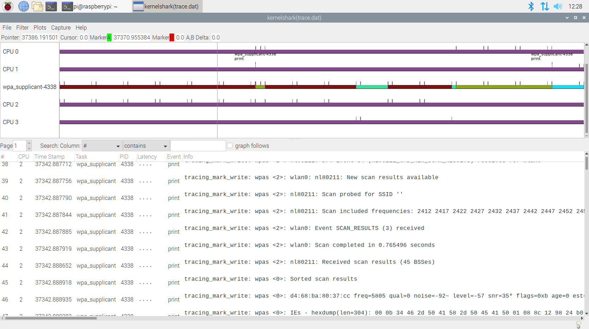

# trace-cmd

理解trace-cmd工作原理

* [一、参考文档](#一参考文档)
* [二、trace_marker](#二trace_marker)
* [三、测试trace_marker](#三测试trace_marker)
* [四、系统支持的监听event](#四系统支持的监听event)
* [五、Kernel Tracers](#五Kernel-Tracers)

## 一、参考文档

* [Event Tracing](https://www.kernel.org/doc/Documentation/trace/events.rst)
* [Event Tracing](https://www.kernel.org/doc/html/v4.18/trace/events.html)
* [Android 使用 ftrace](https://source.android.com/devices/tech/debug/ftrace)
* [Trace-cmd and kernelshark trace viewer](https://wiki.st.com/stm32mpu/wiki/Trace-cmd_and_kernelshark_trace_viewer)

## 二、trace_marker

This is a very useful file for synchronizing user space with events happening in the kernel. Writing strings into this file will be written into the ftrace buffer.

* 采用wpa_supplicant源代码进行分析，其中trace_marker操作位于: src/utils/wpa_debug.c
  * int wpa_debug_open_linux_tracing(void)
  * void wpa_printf(int level, const char *fmt, ...)
* /sys/kernel/debug/tracing/trace_marker

如下是简单的示例使用代码

```C
int trace_fd = open("trace_marker", WR_ONLY);

void trace_write(const char *fmt, ...)
{
        va_list ap;
        char buf[256];
        int n;

        if (trace_fd < 0)
                return;

        va_start(ap, fmt);
        n = vsnprintf(buf, 256, fmt, ap);
        va_end(ap);

        write(trace_fd, buf, n);
}
```

这里需要需要注意的是上面的王`trace_marker`中些内容，其实是相当于调用`printk`，所以后面使用trace-cmd进行event监听的时候是要监听`printk`的。

## 三、测试trace_marker

* ./wpa_supplicant -c/etc/wpa_supplicant/wpa_supplicant.conf -iwlan0 -Dnl80211,wext -T
* 监听事件：
  * 监听所有event：trace-cmd record -e all -P 4338
  * 只见听一个printk事件：trace-cmd record -e printk -P 4338
  * 只见多个事件：trace-cmd record -e printk -e sys_enter -P 4338
* 上面`trace-cmd record`命令会生成`trace.dat`文件
* 使用`kernelshark`查看`trace.dat`



## 四、系统支持的监听event

`cat /sys/kernel/debug/tracing/available_events`

## 五、Kernel Tracers

```
 .config - Linux/arm 4.19.71 Kernel Configuration
 → Kernel hacking → Tracers ────────────────────────────────────────────────────────────────────────────────────
  ┌──────────────────────────────────────────────── Tracers ─────────────────────────────────────────────────┐
  │  Arrow keys navigate the menu.  <Enter> selects submenus ---> (or empty submenus ----).  Highlighted     │
  │  letters are hotkeys.  Pressing <Y> includes, <N> excludes, <M> modularizes features.  Press <Esc><Esc>  │
  │  to exit, <?> for Help, </> for Search.  Legend: [*] built-in  [ ] excluded  <M> module  < > module      │
  │  capable                                                                                                 │
  │ ┌──────────────────────────────────────────────────────────────────────────────────────────────────────┐ │
  │ │                --- Tracers                                                                           │ │
  │ │                -*-   Kernel Function Tracer                                                          │ │
  │ │                [*]     Kernel Function Graph Tracer                                                  │ │
  │ │                [ ]   Enable trace events for preempt and irq disable/enable                          │ │
  │ │                [*]   Interrupts-off Latency Tracer                                                   │ │
  │ │                [*]   Scheduling Latency Tracer                                                       │ │
  │ │                [ ]   Tracer to detect hardware latencies (like SMIs)                                 │ │
  │ │                [ ]   Trace syscalls                                                                  │ │
  │ │                -*-   Create a snapshot trace buffer                                                  │ │
  │ │                -*-     Allow snapshot to swap per CPU                                                │ │
  │ │                      Branch Profiling (No branch profiling)  --->                                    │ │
  │ │                [*]   Trace max stack                                                                 │ │
  │ │                [*]   Support for tracing block IO actions                                            │ │
  │ │                [*]   Enable kprobes-based dynamic events                                             │ │
  │ │                [ ]   Enable uprobes-based dynamic events                                             │ │
  │ │                [*]   enable/disable function tracing dynamically                                     │ │
  │ │                [*]   Kernel function profiler                                                        │ │
  │ │                [ ]   Perform a startup test on ftrace                                                │ │
  │ │                [ ]   Add tracepoint that benchmarks tracepoints                                      │ │
  │ │                < >   Ring buffer benchmark stress tester                                             │ │
  │ │                [ ]   Ring buffer startup self test                                                   │ │
  │ │                < >   Preempt / IRQ disable delay thread to test latency tracers                      │ │
  │ │                [ ]   Show eval mappings for trace events                                             │ │
  │ │                [*]   Trace gpio events                                                               │ │
  │ │                                                                                                      │ │
  │ │                                                                                                      │ │
  │ └──────────────────────────────────────────────────────────────────────────────────────────────────────┘ │
  ├──────────────────────────────────────────────────────────────────────────────────────────────────────────┤
  │                         <Select>    < Exit >    < Help >    < Save >    < Load >                         │
  └──────────────────────────────────────────────────────────────────────────────────────────────────────────┘
```