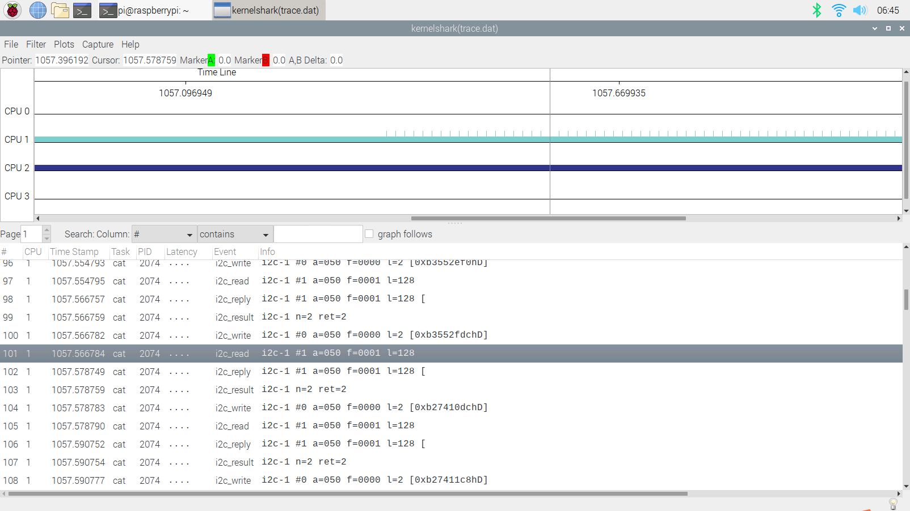

# ftrace I2C

使用ftrace观察I2C，EEPROM是扩展板上的

* [一、config](#一config)
* [二、device](#二device)
* [三、trace record](#三trace-record)
* [四、kernelshark](#四kernelshark)
* [五、数据分析](#五数据分析)

## 一、config

* /boot/config.txt
  * dtoverlay=rpi-at24c128

## 二、device

* /sys/bus/i2c/devices/1-0050
  ```
  1-00500  driver  eeprom  modalias  name  of_node  power  subsystem  uevent
  ```

## 三、trace record

* trace-cmd record -e i2c

## 四、kernelshark



## 五、数据分析

* trace-cmd report
  ```
  [...省略]
  cat-2074  [001]  1058.874441: i2c_write:            i2c-1 #0 a=050 f=0000 l=2 [0xb6f2d664hD]
  cat-2074  [001]  1058.874443: i2c_read:             i2c-1 #1 a=050 f=0001 l=128
  cat-2074  [001]  1058.886414: i2c_reply:            i2c-1 #1 a=050 f=0001 l=128 [0xb6f2d6a0hD]
  cat-2074  [001]  1058.886416: i2c_result:           i2c-1 n=2 ret=2
  cat-2074  [001]  1058.886440: i2c_write:            i2c-1 #0 a=050 f=0000 l=2 [0xb6f2d750hD]
  cat-2074  [001]  1058.886442: i2c_read:             i2c-1 #1 a=050 f=0001 l=128
  cat-2074  [001]  1058.898402: i2c_reply:            i2c-1 #1 a=050 f=0001 l=128 [0xb6f2d78chD]
  cat-2074  [001]  1058.898405: i2c_result:           i2c-1 n=2 ret=2
  ```
* 信息格式：
  * /sys/kernel/debug/tracing/events/i2c/i2c_read/format
    * print fmt: "i2c-%d #%u a=%03x f=%04x l=%u", REC->adapter_nr, REC->msg_nr, REC->addr, REC->flags, REC->len
  * /sys/kernel/debug/tracing/events/i2c/i2c_write/format
    * print fmt: "i2c-%d #%u a=%03x f=%04x l=%u [%*phD]", REC->adapter_nr, REC->msg_nr, REC->addr, REC->flags, REC->len, REC->len, __get_dynamic_array(buf)
  * /sys/kernel/debug/tracing/events/i2c/i2c_reply/format
    * print fmt: "i2c-%d #%u a=%03x f=%04x l=%u [%*phD]", REC->adapter_nr, REC->msg_nr, REC->addr, REC->flags, REC->len, REC->len, __get_dynamic_array(buf)
  * /sys/kernel/debug/tracing/events/i2c/i2c_result/format
    * print fmt: "i2c-%d n=%u ret=%d", REC->adapter_nr, REC->nr_msgs, REC->ret

暂不去具体分析`i2c_write`、`i2c_read`、`i2c_replay`、`i2c_result`，内部是怎么处理的。
  