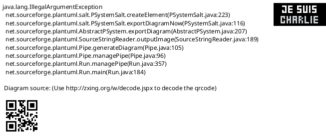

# Wifi Linux Driver

Wifi驱动加载及基本调试

* [一、参考文档](#一参考文档)
* [二、ethtool获取网卡信息](#二ethtool获取网卡信息)
* [三、DTS及Driver](#三DTS及Driver)
* [四、SDIO和SD区别](#四SDIO和SD区别)
* [五、debug](#五debug)
  * [5.1 dmesg log](#51-dmesg-log)
  * [5.2 Trace](#52-Trace)
* [六、模块以module插入的形式](#六模块以module插入的形式)
* [七、cfg80211](#七cfg80211)
  * [7.1 cfg80211驱动注册及Scan调用流程](#71-cfg80211驱动注册及Scan调用流程)
  * [7.2 注册cfg80211操作函数](#72-注册cfg80211操作函数)
  * [7.3 cfg80211操作函数](#73-cfg80211操作函数)
  * [7.4 wiphy](#74-wiphy)


## 一、参考文档

* [Broadcom fullmac WLAN 驱动解析](https://www.cnblogs.com/hellolwl/tag/Driver/)

## 二、ethtool获取网卡信息

* ethtool -i wlan0
  ```
  driver: brcmfmac
  version: 7.45.154
  firmware-version: 01-4fbe0b04
  expansion-rom-version:
  bus-info: mmc1:0001:1
  supports-statistics: no
  supports-test: no
  supports-eeprom-access: no
  supports-register-dump: no
  supports-priv-flags: no
  ```
* brcmfmac
* /sys/bus/mmc/devices/mmc1:0001/mmc1:0001:1

## 三、DTS及Driver

* linux-rpi-4.19.y/arch/arm/boot/dts
  * grep brcmf * -R | grep bcm | grep wifi
    ```
    bcm2835-rpi-zero-w.dts: brcmf: wifi@1 {
    bcm2837-rpi-3-b.dts:    brcmf: wifi@1 {
    bcm2837-rpi-3-b-plus.dts:       brcmf: wifi@1 {
    bcm2838-rpi-4-b.dts:    brcmf: wifi@1 {
    ```
* bcm2838-rpi-4-b.dts
  ```dts
  /* SDHCI is used to control the SDIO for wireless */
  &sdhci {
          #address-cells = <1>;
          #size-cells = <0>;
          pinctrl-names = "default";
          pinctrl-0 = <&emmc_gpio34>;
          status = "okay";
          bus-width = <4>;
          non-removable;
          mmc-pwrseq = <&wifi_pwrseq>;
  
          brcmf: wifi@1 {
                  reg = <1>;
                  compatible = "brcm,bcm4329-fmac";
          };
  };
  ```
* net/wireless/broadcom/brcm80211/brcmfmac/of.c
  ```C
  void brcmf_of_probe(struct device *dev, enum brcmf_bus_type bus_type,
                      struct brcmf_mp_device *settings)
  {
          struct brcmfmac_sdio_pd *sdio = &settings->bus.sdio;
          struct device_node *np = dev->of_node;
          int irq;
          u32 irqf;
          u32 val;
  
          if (!np || bus_type != BRCMF_BUSTYPE_SDIO ||
              !of_device_is_compatible(np, "brcm,bcm4329-fmac"))
                  return;
  
          if (of_property_read_u32(np, "brcm,drive-strength", &val) == 0)
                  sdio->drive_strength = val;
  
          /* make sure there are interrupts defined in the node */
          if (!of_find_property(np, "interrupts", NULL))
                  return;
  
          irq = irq_of_parse_and_map(np, 0);
          if (!irq) {
                  brcmf_err("interrupt could not be mapped\n");
                  return;
          }
          irqf = irqd_get_trigger_type(irq_get_irq_data(irq));
  
          sdio->oob_irq_supported = true;
          sdio->oob_irq_nr = irq;
          sdio->oob_irq_flags = irqf;
  }
  ```
* drivers/net/wireless/broadcom/brcm80211/brcmfmac/bcmsdh.c
  ```plantuml
  @startsalt
  * .probe = brcmf_ops_sdio_probe,
    * err = brcmf_sdiod_probe(sdiodev);
      * sdiodev->bus = brcmf_sdio_probe(sdiodev);
        * brcmf_sdio_probe_attach(bus)
          * sdiodev->settings = brcmf_get_module_param(sdiodev->dev, BRCMF_BUSTYPE_SDIO, bus->ci->chip, bus->ci->chiprev);
            * brcmf_of_probe(dev, bus_type, settings);
  @endsalt
  ```
* `dmesg | grep -E "sdio|fmac"`
  ```
  [   26.051561] brcmfmac: F1 signature read @0x18000000=0x15264345
  [   26.060118] brcmfmac: brcmf_fw_alloc_request: using brcm/brcmfmac43455-sdio for chip BCM4345/6
  [   26.060847] usbcore: registered new interface driver brcmfmac
  [   26.287504] brcmfmac: brcmf_fw_alloc_request: using brcm/brcmfmac43455-sdio for chip BCM4345/6
  [   26.300448] brcmfmac: brcmf_c_preinit_dcmds: Firmware: BCM4345/6 wl0: Feb 27 2018 03:15:32 version 7.45.154 (r684107 CY) FWID 01-4fbe0b04
  [   29.595535] brcmfmac: power management disabled
  ```
* Kernel內建了两个开源驱动: brcmfmac 提供原生硬MAC支持， brcmsmac 提供基于mac80211的软MAC支持。 它们应该会在启动时自行加载。
  * brcmfmac 提供较新的芯片支持，并且支持AP模式，P2P模式，高级加密。
  * brcmsmac 仅提供对于较老芯片的支持，例如BCM4313, BCM43224, BCM43225。
* BRCMFMAC: Broadcom FullMAC WLAN driver

## 四、SDIO和SD区别

SD卡使用的是SD卡协议，而SDIO卡使用的是SDIO协议！协议不一样，初始化/读写方式也不一样！SDIO总线 和 USB总线 类似，SDIO也有两端，其中一端是HOST端，另一端是device端。所有的通信都是由HOST端 发送 命令 开始的，Device端只要能解析命令，就可以相互通信。

## 五、debug

### 5.1 dmesg log

* .config
  * CONFIG_BRCMDBG=y
* drivers/net/wireless/broadcom/brcm80211/brcmfmac/common.c
  ```
  /* Debug level configuration. See debug.h for bits, sysfs modifiable */
  int brcmf_msg_level;
  module_param_named(debug, brcmf_msg_level, int, 0600);
  MODULE_PARM_DESC(debug, "Level of debug output");
  ```
* drivers/net/wireless/broadcom/brcm80211/brcmfmac/debug.h
  ```
  /* message levels */
  #define BRCMF_TRACE_VAL         0x00000002
  #define BRCMF_INFO_VAL          0x00000004
  #define BRCMF_DATA_VAL          0x00000008
  #define BRCMF_CTL_VAL           0x00000010
  #define BRCMF_TIMER_VAL         0x00000020
  #define BRCMF_HDRS_VAL          0x00000040
  #define BRCMF_BYTES_VAL         0x00000080
  #define BRCMF_INTR_VAL          0x00000100
  #define BRCMF_GLOM_VAL          0x00000200
  #define BRCMF_EVENT_VAL         0x00000400
  #define BRCMF_BTA_VAL           0x00000800
  #define BRCMF_FIL_VAL           0x00001000
  #define BRCMF_USB_VAL           0x00002000
  #define BRCMF_SCAN_VAL          0x00004000
  #define BRCMF_CONN_VAL          0x00008000
  #define BRCMF_BCDC_VAL          0x00010000
  #define BRCMF_SDIO_VAL          0x00020000
  #define BRCMF_MSGBUF_VAL        0x00040000
  #define BRCMF_PCIE_VAL          0x00080000
  #define BRCMF_FWCON_VAL         0x00100000
  
  // ...省略
  
  #define BRCMF_DATA_ON()         (brcmf_msg_level & BRCMF_DATA_VAL)
  #define BRCMF_CTL_ON()          (brcmf_msg_level & BRCMF_CTL_VAL)
  #define BRCMF_HDRS_ON()         (brcmf_msg_level & BRCMF_HDRS_VAL)
  #define BRCMF_BYTES_ON()        (brcmf_msg_level & BRCMF_BYTES_VAL)
  #define BRCMF_GLOM_ON()         (brcmf_msg_level & BRCMF_GLOM_VAL)
  #define BRCMF_EVENT_ON()        (brcmf_msg_level & BRCMF_EVENT_VAL)
  #define BRCMF_FIL_ON()          (brcmf_msg_level & BRCMF_FIL_VAL)
  #define BRCMF_FWCON_ON()        (brcmf_msg_level & BRCMF_FWCON_VAL)
  #define BRCMF_SCAN_ON()         (brcmf_msg_level & BRCMF_SCAN_VAL)

  // ...省略

  extern int brcmf_msg_level;
  ```
* /sys/module/brcmfmac/parameters
  * brcmf_msg_level
    * BRCMF_SCAN_VAL
    * echo 0x00004000 > debug
* dmesg -w
  ```
  [10304.778736] brcmfmac: brcmf_cfg80211_scan START ESCAN
  [10304.778756] brcmfmac: brcmf_do_escan Enter
  [10304.778768] brcmfmac: brcmf_run_escan E-SCAN START
  [10304.778782] brcmfmac: brcmf_escan_prep ### List of channelspecs to scan ### 43
  [10304.778795] brcmfmac: brcmf_escan_prep Chan : 1, Channel spec: 1001
  [10304.778806] brcmfmac: brcmf_escan_prep Chan : 2, Channel spec: 1002
  [10304.778817] brcmfmac: brcmf_escan_prep Chan : 3, Channel spec: 1003
  [10304.778827] brcmfmac: brcmf_escan_prep Chan : 4, Channel spec: 1004
  [10304.778837] brcmfmac: brcmf_escan_prep Chan : 5, Channel spec: 1005
  [10304.778847] brcmfmac: brcmf_escan_prep Chan : 6, Channel spec: 1006
  [10304.778857] brcmfmac: brcmf_escan_prep Chan : 7, Channel spec: 1007
  [10304.778867] brcmfmac: brcmf_escan_prep Chan : 8, Channel spec: 1008
  [10304.778877] brcmfmac: brcmf_escan_prep Chan : 9, Channel spec: 1009
  [10304.778887] brcmfmac: brcmf_escan_prep Chan : 10, Channel spec: 100a
  [10304.778898] brcmfmac: brcmf_escan_prep Chan : 11, Channel spec: 100b
  [10304.778907] brcmfmac: brcmf_escan_prep Chan : 12, Channel spec: 100c
  [10304.778917] brcmfmac: brcmf_escan_prep Chan : 13, Channel spec: 100d
  [10304.778927] brcmfmac: brcmf_escan_prep Chan : 14, Channel spec: 100e
  [10304.778937] brcmfmac: brcmf_escan_prep Chan : 34, Channel spec: d022
  [10304.778947] brcmfmac: brcmf_escan_prep Chan : 36, Channel spec: d024
  [10304.778957] brcmfmac: brcmf_escan_prep Chan : 38, Channel spec: d026
  [10304.778967] brcmfmac: brcmf_escan_prep Chan : 40, Channel spec: d028
  [10304.778977] brcmfmac: brcmf_escan_prep Chan : 42, Channel spec: d02a
  [10304.778987] brcmfmac: brcmf_escan_prep Chan : 44, Channel spec: d02c
  [10304.778996] brcmfmac: brcmf_escan_prep Chan : 46, Channel spec: d02e
  [10304.779006] brcmfmac: brcmf_escan_prep Chan : 48, Channel spec: d030
  [10304.779016] brcmfmac: brcmf_escan_prep Chan : 52, Channel spec: d034
  [10304.779026] brcmfmac: brcmf_escan_prep Chan : 56, Channel spec: d038
  [10304.779036] brcmfmac: brcmf_escan_prep Chan : 60, Channel spec: d03c
  [10304.779046] brcmfmac: brcmf_escan_prep Chan : 64, Channel spec: d040
  [10304.779056] brcmfmac: brcmf_escan_prep Chan : 100, Channel spec: d064
  [10304.779066] brcmfmac: brcmf_escan_prep Chan : 104, Channel spec: d068
  [10304.779076] brcmfmac: brcmf_escan_prep Chan : 108, Channel spec: d06c
  [10304.779086] brcmfmac: brcmf_escan_prep Chan : 112, Channel spec: d070
  [10304.779096] brcmfmac: brcmf_escan_prep Chan : 116, Channel spec: d074
  [10304.779106] brcmfmac: brcmf_escan_prep Chan : 120, Channel spec: d078
  [10304.779116] brcmfmac: brcmf_escan_prep Chan : 124, Channel spec: d07c
  [10304.779126] brcmfmac: brcmf_escan_prep Chan : 128, Channel spec: d080
  [10304.779136] brcmfmac: brcmf_escan_prep Chan : 132, Channel spec: d084
  [10304.779146] brcmfmac: brcmf_escan_prep Chan : 136, Channel spec: d088
  [10304.779156] brcmfmac: brcmf_escan_prep Chan : 140, Channel spec: d08c
  [10304.779166] brcmfmac: brcmf_escan_prep Chan : 144, Channel spec: d090
  [10304.779176] brcmfmac: brcmf_escan_prep Chan : 149, Channel spec: d095
  [10304.779185] brcmfmac: brcmf_escan_prep Chan : 153, Channel spec: d099
  [10304.779195] brcmfmac: brcmf_escan_prep Chan : 157, Channel spec: d09d
  [10304.779205] brcmfmac: brcmf_escan_prep Chan : 161, Channel spec: d0a1
  [10304.779215] brcmfmac: brcmf_escan_prep Chan : 165, Channel spec: d0a5
  [10304.779225] brcmfmac: brcmf_escan_prep ### List of SSIDs to scan ### 1
  [10304.779235] brcmfmac: brcmf_escan_prep 0: Broadcast scan
  [10304.805741] brcmfmac: brcmf_cfg80211_escan_handler ESCAN Partial result
  [10304.811759] brcmfmac: brcmf_cfg80211_escan_handler ESCAN Partial result
  [10304.814186] brcmfmac: brcmf_cfg80211_escan_handler ESCAN Partial result
  [10304.816229] brcmfmac: brcmf_cfg80211_escan_handler ESCAN Partial result
  [10304.822027] brcmfmac: brcmf_cfg80211_escan_handler ESCAN Partial result
  [10304.826680] brcmfmac: brcmf_cfg80211_escan_handler ESCAN Partial result
  [10304.834042] brcmfmac: brcmf_cfg80211_escan_handler ESCAN Partial result
  [10304.872938] brcmfmac: brcmf_cfg80211_escan_handler ESCAN Partial result
  [10304.893764] brcmfmac: brcmf_cfg80211_escan_handler ESCAN Partial result
  [10304.896223] brcmfmac: brcmf_cfg80211_escan_handler ESCAN Partial result
  [10304.904950] brcmfmac: brcmf_cfg80211_escan_handler ESCAN Partial result
  [10304.927291] brcmfmac: brcmf_cfg80211_escan_handler ESCAN Partial result
  [10304.982775] brcmfmac: brcmf_cfg80211_escan_handler ESCAN Partial result
  [10304.988280] brcmfmac: brcmf_cfg80211_escan_handler ESCAN Partial result
  [10304.991044] brcmfmac: brcmf_cfg80211_escan_handler ESCAN Partial result
  [10304.998806] brcmfmac: brcmf_cfg80211_escan_handler ESCAN Partial result
  [10305.008746] brcmfmac: brcmf_cfg80211_escan_handler ESCAN Partial result
  [10305.015325] brcmfmac: brcmf_cfg80211_escan_handler ESCAN Partial result
  [10305.024026] brcmfmac: brcmf_cfg80211_escan_handler ESCAN Partial result
  [10305.026718] brcmfmac: brcmf_cfg80211_escan_handler ESCAN Partial result
  [10305.038810] brcmfmac: brcmf_cfg80211_escan_handler ESCAN Partial result
  [10305.041455] brcmfmac: brcmf_cfg80211_escan_handler ESCAN Partial result
  [10305.043879] brcmfmac: brcmf_cfg80211_escan_handler ESCAN Partial result
  [10305.049501] brcmfmac: brcmf_cfg80211_escan_handler ESCAN Partial result
  [10305.116121] brcmfmac: brcmf_cfg80211_escan_handler ESCAN Partial result
  [10305.150645] brcmfmac: brcmf_cfg80211_escan_handler ESCAN Partial result
  [10305.171285] brcmfmac: brcmf_cfg80211_escan_handler ESCAN Partial result
  [10305.199340] brcmfmac: brcmf_cfg80211_escan_handler ESCAN Partial result
  [10305.277681] brcmfmac: brcmf_cfg80211_escan_handler ESCAN Partial result
  [10305.295773] brcmfmac: brcmf_cfg80211_escan_handler ESCAN Partial result
  [10305.298401] brcmfmac: brcmf_cfg80211_escan_handler ESCAN Partial result
  [10305.334580] brcmfmac: brcmf_cfg80211_escan_handler ESCAN Partial result
  [10305.356042] brcmfmac: brcmf_cfg80211_escan_handler ESCAN Partial result
  [10305.357382] brcmfmac: brcmf_cfg80211_escan_handler ESCAN Partial result
  [10305.358762] brcmfmac: brcmf_cfg80211_escan_handler ESCAN Partial result
  [10305.398474] brcmfmac: brcmf_cfg80211_escan_handler ESCAN Partial result
  [10305.417992] brcmfmac: brcmf_cfg80211_escan_handler ESCAN Partial result
  [10305.435327] brcmfmac: brcmf_cfg80211_escan_handler ESCAN Partial result
  [10305.482006] brcmfmac: brcmf_cfg80211_escan_handler ESCAN Partial result
  [10305.482909] brcmfmac: brcmf_cfg80211_escan_handler ESCAN Partial result
  [10305.483585] brcmfmac: brcmf_cfg80211_escan_handler ESCAN Partial result
  [10305.483604] brcmfmac: brcmf_cfg80211_escan_handler ESCAN Partial result
  [10305.484634] brcmfmac: brcmf_cfg80211_escan_handler ESCAN Partial result
  [10305.484651] brcmfmac: brcmf_cfg80211_escan_handler ESCAN Partial result
  [10305.486188] brcmfmac: brcmf_cfg80211_escan_handler ESCAN Partial result
  [10305.490144] brcmfmac: brcmf_cfg80211_escan_handler ESCAN Partial result
  [10305.502078] brcmfmac: brcmf_cfg80211_escan_handler ESCAN Partial result
  [10305.503735] brcmfmac: brcmf_cfg80211_escan_handler ESCAN Partial result
  [10305.503752] brcmfmac: brcmf_cfg80211_escan_handler ESCAN Partial result
  [10305.504787] brcmfmac: brcmf_cfg80211_escan_handler ESCAN Partial result
  [10305.504805] brcmfmac: brcmf_cfg80211_escan_handler ESCAN Partial result
  [10305.505889] brcmfmac: brcmf_cfg80211_escan_handler ESCAN Partial result
  [10305.505905] brcmfmac: brcmf_cfg80211_escan_handler ESCAN Partial result
  [10305.507497] brcmfmac: brcmf_cfg80211_escan_handler ESCAN Partial result
  [10305.507515] brcmfmac: brcmf_cfg80211_escan_handler ESCAN Partial result
  [10305.570447] brcmfmac: brcmf_inform_bss scanned AP count (29)
  [10305.570711] brcmfmac: brcmf_notify_escan_complete Enter
  [10305.570724] brcmfmac: brcmf_notify_escan_complete ESCAN Completed scan: Done
  [10305.574695] brcmfmac: brcmf_cfg80211_sched_scan_start Enter: n_match_sets=4 n_ssids=1
  [10305.574709] brcmfmac: brcmf_pno_store_request reqid=0
  [10305.574721] brcmfmac: brcmf_pno_prep_fwconfig n_reqs=1
  [10305.574733] brcmfmac: brcmf_pno_get_bucket_channels [0] Chan : 1
  [10305.574744] brcmfmac: brcmf_pno_get_bucket_channels [1] Chan : 2
  [10305.574754] brcmfmac: brcmf_pno_get_bucket_channels [2] Chan : 3
  [10305.574765] brcmfmac: brcmf_pno_get_bucket_channels [3] Chan : 4
  [10305.574775] brcmfmac: brcmf_pno_get_bucket_channels [4] Chan : 5
  [10305.574785] brcmfmac: brcmf_pno_get_bucket_channels [5] Chan : 6
  [10305.574795] brcmfmac: brcmf_pno_get_bucket_channels [6] Chan : 7
  [10305.574804] brcmfmac: brcmf_pno_get_bucket_channels [7] Chan : 8
  [10305.574814] brcmfmac: brcmf_pno_get_bucket_channels [8] Chan : 9
  [10305.574823] brcmfmac: brcmf_pno_get_bucket_channels [9] Chan : 10
  [10305.574834] brcmfmac: brcmf_pno_get_bucket_channels [10] Chan : 11
  [10305.574843] brcmfmac: brcmf_pno_get_bucket_channels [11] Chan : 12
  [10305.574853] brcmfmac: brcmf_pno_get_bucket_channels [12] Chan : 13
  [10305.574863] brcmfmac: brcmf_pno_get_bucket_channels [13] Chan : 14
  [10305.574873] brcmfmac: brcmf_pno_get_bucket_channels [14] Chan : 34
  [10305.574882] brcmfmac: brcmf_pno_get_bucket_channels [15] Chan : 36
  [10305.574892] brcmfmac: brcmf_pno_get_bucket_channels [16] Chan : 38
  [10305.574901] brcmfmac: brcmf_pno_get_bucket_channels [17] Chan : 40
  [10305.574911] brcmfmac: brcmf_pno_get_bucket_channels [18] Chan : 42
  [10305.574920] brcmfmac: brcmf_pno_get_bucket_channels [19] Chan : 44
  [10305.574930] brcmfmac: brcmf_pno_get_bucket_channels [20] Chan : 46
  [10305.574939] brcmfmac: brcmf_pno_get_bucket_channels [21] Chan : 48
  [10305.574949] brcmfmac: brcmf_pno_get_bucket_channels [22] Chan : 52
  [10305.574958] brcmfmac: brcmf_pno_get_bucket_channels [23] Chan : 56
  [10305.574968] brcmfmac: brcmf_pno_get_bucket_channels [24] Chan : 60
  [10305.574977] brcmfmac: brcmf_pno_get_bucket_channels [25] Chan : 64
  [10305.574987] brcmfmac: brcmf_pno_get_bucket_channels [26] Chan : 100
  [10305.574996] brcmfmac: brcmf_pno_get_bucket_channels [27] Chan : 104
  [10305.575006] brcmfmac: brcmf_pno_get_bucket_channels [28] Chan : 108
  [10305.575016] brcmfmac: brcmf_pno_get_bucket_channels [29] Chan : 112
  [10305.575025] brcmfmac: brcmf_pno_get_bucket_channels [30] Chan : 116
  [10305.575035] brcmfmac: brcmf_pno_get_bucket_channels [31] Chan : 120
  [10305.575044] brcmfmac: brcmf_pno_get_bucket_channels [32] Chan : 124
  [10305.575054] brcmfmac: brcmf_pno_get_bucket_channels [33] Chan : 128
  [10305.575063] brcmfmac: brcmf_pno_get_bucket_channels [34] Chan : 132
  [10305.575073] brcmfmac: brcmf_pno_get_bucket_channels [35] Chan : 136
  [10305.575082] brcmfmac: brcmf_pno_get_bucket_channels [36] Chan : 140
  [10305.575092] brcmfmac: brcmf_pno_get_bucket_channels [37] Chan : 144
  [10305.575101] brcmfmac: brcmf_pno_get_bucket_channels [38] Chan : 149
  [10305.575111] brcmfmac: brcmf_pno_get_bucket_channels [39] Chan : 153
  [10305.575120] brcmfmac: brcmf_pno_get_bucket_channels [40] Chan : 157
  [10305.575130] brcmfmac: brcmf_pno_get_bucket_channels [41] Chan : 161
  [10305.575139] brcmfmac: brcmf_pno_get_bucket_channels [42] Chan : 165
  [10305.575150] brcmfmac: brcmf_pno_prep_fwconfig: base period=10
  [10305.575162] brcmfmac: brcmf_pno_prep_fwconfig: [0] period 1 max 0 repeat 0 flag 4 idx 42
  [10305.580589] brcmfmac: brcmf_pno_remove_request reqid=0
  ```

### 5.2 Trace

* 参考文档：[kernel trace_event 宏展开注解](http://www.tecyle.com/2018/03/04/kernel-trace_event-%E5%AE%8F%E5%B1%95%E5%BC%80%E6%B3%A8%E8%A7%A3/)
* brcmf_dbg(TRACE, "Enter\n");
  * drivers/net/wireless/broadcom/brcm80211/brcmfmac/debug.h
    ```C
    #define BRCMF_TRACE_VAL         0x00000002
  
    // ...省略
  
    #define brcmf_dbg(level, fmt, ...)                              \
    do {                                                            \
            __brcmf_dbg(BRCMF_##level##_VAL, __func__,              \
                        fmt, ##__VA_ARGS__);                        \
    } while (0)
    ```
  * drivers/net/wireless/broadcom/brcm80211/brcmfmac/common.c
    ```C
    #if defined(CONFIG_BRCM_TRACING) || defined(CONFIG_BRCMDBG)
    void __brcmf_dbg(u32 level, const char *func, const char *fmt, ...)
    {
            struct va_format vaf = {
                    .fmt = fmt,
            };
            va_list args;
    
            va_start(args, fmt);
            vaf.va = &args;
            if (brcmf_msg_level & level)
                    pr_debug("%s %pV", func, &vaf);
            trace_brcmf_dbg(level, func, &vaf);
            va_end(args);
    }
    #endif
    ```
  * drivers/net/wireless/broadcom/brcm80211/brcmfmac/tracepoint.h
    ```C
    TRACE_EVENT(brcmf_dbg,
            TP_PROTO(u32 level, const char *func, struct va_format *vaf),
            TP_ARGS(level, func, vaf),
            TP_STRUCT__entry(
                    __field(u32, level)
                    __string(func, func)
                    __dynamic_array(char, msg, MAX_MSG_LEN)
            ),
            TP_fast_assign(
                    __entry->level = level;
                    __assign_str(func, func);
                    WARN_ON_ONCE(vsnprintf(__get_dynamic_array(msg),
                                           MAX_MSG_LEN, vaf->fmt,
                                           *vaf->va) >= MAX_MSG_LEN);
            ),
            TP_printk("%s: %s", __get_str(func), __get_str(msg))
    );
    ```
* 在ftrace events下没有找到相关内容，故检查对应的配置，发现确实没有加入：
  * .config 
    * \# CONFIG_BRCM_TRACING is not set
* grep CONFIG_BRCM_TRACING .config
  ```
  CONFIG_BRCM_TRACING=y
  ```
* drivers/net/wireless/broadcom/brcm80211/brcmfmac/tracepoint.h
  * #define TRACE_SYSTEM    brcmfmac
* KERNEL=kernel7l && make -j4 modules
* sudo cp drivers/net/wireless/broadcom/brcm80211/brcmfmac/brcmfmac.ko /lib/modules/4.19.71-v7l/kernel/drivers/net/wireless/broadcom/brcm80211/brcmfmac/brcmfmac.ko
* reboot
* /sys/kernel/debug/tracing/events
  * ls brcmfmac -1
    ```
    brcmf_bcdchdr
    brcmf_dbg
    brcmf_err
    brcmf_hexdump
    brcmf_sdpcm_hdr
    enable
    filter
    ```
* trace-cmd record -e brcmfmac
  * kerenlshark  
    
* trace-cmd report


## 六、模块以module插入的形式

* drivers/net/wireless/broadcom/brcm80211/brcmfmac/brcmfmac.ko
* uname -a
  ```
  Linux raspberrypi 4.19.71-v7l #3 SMP Sun Feb 23 03:18:41 GMT 2020 armv7l GNU/Linux
  ```
* modules/4.19.71-v7l/kernel/drivers/net/wireless/broadcom/brcm80211/brcmfmac/brcmfmac.ko
* 模块自动插入参考文档: [USB_Camera_udev](https://github.com/ZengjfOS/RaspberryPi/blob/master/docs/0046_USB_Camera_udev.md)
* lsmod | grep brcmfmac
  ```
  brcmfmac              315392  0
  brcmutil               16384  1 brcmfmac
  cfg80211              610304  1 brcmfmac
  ```
  * 查看模块信息：
    * modinfo cfg80211
    * modinfo brcmfmac
    * modinfo brcmutil


## 七、cfg80211

### 7.1 cfg80211驱动注册及Scan调用流程

可以认为这里主要是做一下cfg80211配置工作，如sys目录下的资源生成，netlink（nl80211）的加载，主要是这些是通用的；



### 7.2 注册cfg80211操作函数

每一张网卡对应一个`struct cfg80211_registered_device` PHY设备，本质还是调用前面的cfg80211的驱动去生成PHY，这里需要理解的是Scan只需要PHY就能独立完成，跟有线网卡的PHY自动握手规则一样；

```plantuml
@startsalt
* drivers/net/wireless/broadcom/brcm80211/brcmfmac/bcmsdh.c
  * .probe = brcmf_ops_sdio_probe,
    * err = brcmf_sdiod_probe(sdiodev);
      * sdiodev->bus = brcmf_sdio_probe(sdiodev);
        * ret = brcmf_fw_get_firmwares(sdiodev->dev, fwreq, brcmf_sdio_firmware_callback);
          * brcmf_sdio_firmware_callback
            * err = brcmf_attach(sdiod->dev, sdiod->settings);
              * ops = brcmf_cfg80211_get_ops(settings);                                   
                * ops = kmemdup(&brcmf_cfg80211_ops, sizeof(brcmf_cfg80211_ops), GFP_KERNEL);
                  * static struct cfg80211_ops brcmf_cfg80211_ops
                    * .scan = brcmf_cfg80211_scan,
                      * err = brcmf_do_escan(vif->ifp, request);                          // 最终处理Scan的调用
              * wiphy = wiphy_new(ops, sizeof(*drvr));                                    // 生成wireless phy
                * wiphy_new_nm(ops, sizeof_priv, NULL);
                  * struct cfg80211_registered_device *rdev;
                  * rdev = kzalloc(alloc_size, GFP_KERNEL);                               // 相当于注册一个Wifi的PHY了
                  * rdev->ops = ops;                                                      // cfg80211(brcmf_cfg80211_ops)操作函数
                  * rdev->wiphy_idx = atomic_inc_return(&wiphy_counter);                  // phy[X]: phy序号
                  * rv = dev_set_name(&rdev->wiphy.dev, PHY_NAME "%d", rdev->wiphy_idx);  // 最终的phy名
              * ret = brcmf_bus_started(drvr, ops);                                       // 这里才是真正开始注册无线网卡的地方
                * ifp = brcmf_add_if(drvr, 0, 0, false, "wlan%d", NULL);                  // 生成wlan[X]设备
                * drvr->config = brcmf_cfg80211_attach(drvr, ops, drvr->settings->p2p_enable);
                  * err = brcmf_setup_wiphy(wiphy, ifp);
                * ret = brcmf_net_attach(ifp, false);
                  * err = register_netdevice(ndev); | err = register_netdev(ndev);

@endsalt
```



### 7.3 cfg80211操作函数

* drivers/net/wireless/broadcom/brcm80211/brcmfmac/cfg80211.c
  ```C
  static struct cfg80211_ops brcmf_cfg80211_ops = {
          .add_virtual_intf = brcmf_cfg80211_add_iface,
          .del_virtual_intf = brcmf_cfg80211_del_iface,
          .change_virtual_intf = brcmf_cfg80211_change_iface,
          .scan = brcmf_cfg80211_scan,
          .set_wiphy_params = brcmf_cfg80211_set_wiphy_params,
          .join_ibss = brcmf_cfg80211_join_ibss,
          .leave_ibss = brcmf_cfg80211_leave_ibss,
          .get_station = brcmf_cfg80211_get_station,
          .dump_station = brcmf_cfg80211_dump_station,
          .set_tx_power = brcmf_cfg80211_set_tx_power,
          .get_tx_power = brcmf_cfg80211_get_tx_power,
          .add_key = brcmf_cfg80211_add_key,
          .del_key = brcmf_cfg80211_del_key,
          .get_key = brcmf_cfg80211_get_key,
          .set_default_key = brcmf_cfg80211_config_default_key,
          .set_default_mgmt_key = brcmf_cfg80211_config_default_mgmt_key,
          .set_power_mgmt = brcmf_cfg80211_set_power_mgmt,
          .connect = brcmf_cfg80211_connect,
          .disconnect = brcmf_cfg80211_disconnect,
          .suspend = brcmf_cfg80211_suspend,
          .resume = brcmf_cfg80211_resume,
          .set_pmksa = brcmf_cfg80211_set_pmksa,
          .del_pmksa = brcmf_cfg80211_del_pmksa,
          .flush_pmksa = brcmf_cfg80211_flush_pmksa,
          .start_ap = brcmf_cfg80211_start_ap,
          .stop_ap = brcmf_cfg80211_stop_ap,
          .change_beacon = brcmf_cfg80211_change_beacon,
          .del_station = brcmf_cfg80211_del_station,
          .change_station = brcmf_cfg80211_change_station,
          .sched_scan_start = brcmf_cfg80211_sched_scan_start,
          .sched_scan_stop = brcmf_cfg80211_sched_scan_stop,
          .mgmt_frame_register = brcmf_cfg80211_mgmt_frame_register,
          .mgmt_tx = brcmf_cfg80211_mgmt_tx,
          .remain_on_channel = brcmf_p2p_remain_on_channel,
          .cancel_remain_on_channel = brcmf_cfg80211_cancel_remain_on_channel,
          .get_channel = brcmf_cfg80211_get_channel,
          .start_p2p_device = brcmf_p2p_start_device,
          .stop_p2p_device = brcmf_p2p_stop_device,
          .crit_proto_start = brcmf_cfg80211_crit_proto_start,
          .crit_proto_stop = brcmf_cfg80211_crit_proto_stop,
          .tdls_oper = brcmf_cfg80211_tdls_oper,
          .update_connect_params = brcmf_cfg80211_update_conn_params,
          .set_pmk = brcmf_cfg80211_set_pmk,
          .del_pmk = brcmf_cfg80211_del_pmk,
  };
  ```
  
### 7.4 wiphy

* `struct wiphy` - wireless hardware description
* wireless phy

