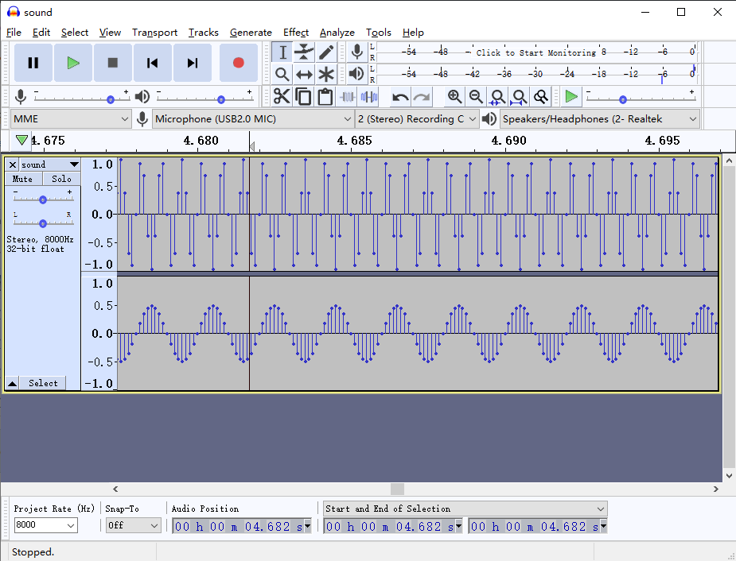

# PCM data format

查看wav左右声道数据存放格式，理解PCM数据流格式

* [一、参考文档](#一参考文档)
* [二、左右声道数据](#二左右声道数据)
* [三、tinyplay](#三tinyplay)

## 一、参考文档

* [0068_wav_Sound_Generator.md](0068_wav_Sound_Generator.md)
* https://github.com/ZengjfOS/RaspberryPi/tree/wavfile

## 二、左右声道数据

分析wavfile源代码可知，左右声道的数据是一个一个顺序排列的（一个左声道、一个右声道），不是两个单独的数组；

```C
for(i = 0; i < length / WAVFILE_CHANNELS; i++) {
        double t = (double) i / WAVFILE_SAMPLES_PER_SECOND;

        // start a frame data
        if (WAVFILE_CHANNELS == 2) {
                // left channel
                waveform[i * 2] =  volume * sin(frequency * t * 2 * M_PI);
                // right channel
                waveform[i * 2 + 1] = volume / 2 * sin((frequency / 3) * t * 2 * M_PI);
        } else {
                // singl channel
                waveform[i] = volume * sin(frequency * t * 2 * M_PI);
        }
        // end a frame data
}
```

audacity看一下数据波形



## 三、tinyplay

tinyplay的提示信息的rate是不准确的，如果你没有设置rate，那么他会提示`48000 hz`的默认值，所以最好将信息都填好

`pcm->buffer_size = config->period_count * config->period_size;`  
每次读写buffer的大小是这么算出来的，`period_size`是DMA buffer大小，period_count表示内核中一个buffer ring中的buffer含有多少个DMA buffer，这里假装buffer ring中不止一个buffer实体，至少两个，保证数据交换；
