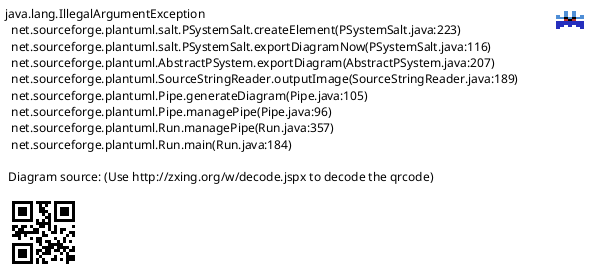
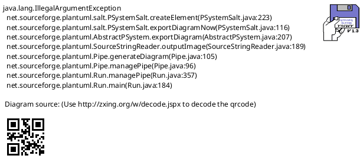
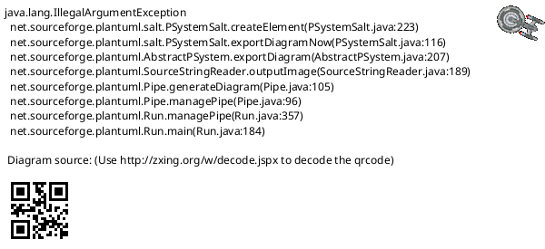
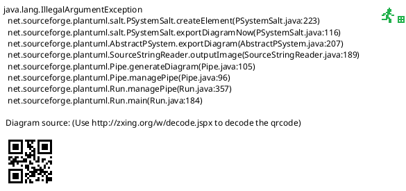

# NFC PN532

NFC PN532调试

* [一、参考文档](#一参考文档)
* [二、访问NFC接口架构](#二访问NFC接口架构)
* [二、DTS配置参考](#二DTS配置参考)
* [三、数据传输格式](#三数据传输格式)
* [四、驱动数据调试点](#四驱动数据调试点)
* [五、Linux NFC系统](#五Linux-NFC系统)
* [六、NFC收发数据同步原理](#六NFC收发数据同步原理)
* [七、nfc设别注册流程](#七nfc设别注册流程)
* [八、Socket创建](#八Socket创建)
* [九、NFC驱动调试](#九NFC驱动调试)
  * [9.1 i2c bus device](#91-i2c-bus-device)
  * [9.2 测试外扩HAT是否正常工作](#92-测试外扩HAT是否正常工作)
  * [9.3 查看系统gpio信息](#93-查看系统gpio信息)
  * [9.4 注册NFC设备](#94-注册NFC设备)
* [十、分析PN533_CMD_IN_LIST_PASSIVE_TARGET流程](#十分析PN533_CMD_IN_LIST_PASSIVE_TARGET流程)
* [十一、neardal/demo](#十一neardal/demo)
* [十二、排除驱动Poll错误](#十二排除驱动Poll错误)
  * [12.1 使用操作](#121-使用操作)
  * [12.2 Poll错误](#122-Poll错误)
  * [12.3 workqueue注册及工作情况](#123-workqueue注册及工作情况)
  * [12.4 驱动修改测试](#124-驱动修改测试)
* [十三、Mifare Classic](#十三Mifare-Classic)
  * [13.1 简述](#131-简述)
  * [13.2 数据格式分析及Poll错误分析](#132-数据格式分析及Poll错误分析)
* [十四、MAD1数据结构](#十四MAD1数据结构)
  * [14.1 sector 0](#141-sector-0)
  * [14.2 MAD1 Sector0数据架构图解](#142-MAD1-Sector0数据架构图解)
  * [14.3 Application identifier](#143-Application-identifier)
  * [14.4 MAD结构](#144-MAD结构)
  * [14.5 CRC calculation](#145-CRC-calculation)
  * [14.6 mifare mad_1 Type 2 Tag](#146-mifare-mad_1-Type-2-Tag)
* [十五、MifareClassicTool](#十五MifareClassicTool)
* [十六、Target](#十六Target)

## 一、参考文档

* [PN532 NFC HAT](http://www.waveshare.net/wiki/PN532_NFC_HAT)
* [Linux NFC subsystem](https://www.kernel.org/doc/html/latest/networking/nfc.html)
* [nfc-example](https://github.com/pcacjr/nfc-example)
* [Near_Field_Communication_with_Linux](https://elinux.org/images/d/d1/Near_Field_Communication_with_Linux.pdf)
* [linux NFC subsystm](http://lishiwen4.github.io/nfc/nfc-subsystem)
* https://git.kernel.org/pub/scm/network/nfc/neard.git
* Linux Kernel Networking - Implementation and Theory.pdf(《精通Linux内核网络》)
  * Chapter 14 Advanced Topics
    * Near Field Communication (NFC)


## 二、访问NFC接口架构

```
+--------------------------------------+
|              USER SPACE              |
+--------------------------------------+
    ^                       ^
    | low-level             | control
    | data exchange         | operations
    |                       |
    |                       v
    |                  +-----------+
    | AF_NFC           |  netlink  |
    | socket           +-----------+
    | raw                   ^
    |                       |
    v                       v
+---------+            +-----------+
| rawsock | <--------> |   core    |
+---------+            +-----------+
                            ^
                            |
                            v
                       +-----------+
                       |  driver   |
                       +-----------+
```

## 二、DTS配置参考

`IRQ`引脚可向主机发出中断请求

`Documentation/devicetree/bindings/net/nfc/pn533-i2c.txt`  
```
* NXP Semiconductors PN532 NFC Controller

Required properties:
- compatible: Should be "nxp,pn532-i2c" or "nxp,pn533-i2c".
- clock-frequency: I²C work frequency.
- reg: address on the bus
- interrupt-parent: phandle for the interrupt gpio controller
- interrupts: GPIO interrupt to which the chip is connected

Optional SoC Specific Properties:
- pinctrl-names: Contains only one value - "default".
- pintctrl-0: Specifies the pin control groups used for this controller.

Example (for ARM-based BeagleBone with PN532 on I2C2):

&i2c2 {

        status = "okay";

        pn532: pn532@24 {

                compatible = "nxp,pn532-i2c";

                reg = <0x24>;
                clock-frequency = <400000>;

                interrupt-parent = <&gpio1>;
                interrupts = <17 IRQ_TYPE_EDGE_FALLING>;

        };
};
```

## 三、数据传输格式


* `drivers/nfc/pn533/pn533.h`

```C
struct pn533_std_frame {
        u8 preamble;
        __be16 start_frame;
        u8 datalen;
        u8 datalen_checksum;
        u8 data[];
} __packed;

struct pn533_ext_frame {        /* Extended Information frame */
        u8 preamble;
        __be16 start_frame;
        __be16 eif_flag;        /* fixed to 0xFFFF */
        __be16 datalen;
        u8 datalen_checksum;
        u8 data[];
} __packed;
```

## 四、驱动数据调试点

`drivers/nfc/pn533/i2c.c`

驱动数据调试点

* https://github.com/commaai/android_kernel_comma_msm8996/blob/master/drivers/nfc/pn533.c#L606
  * https://github.com/commaai/android_kernel_comma_msm8996/blob/master/drivers/nfc/pn533.c#L565
    ```C
    /* The rule: sum(data elements) + checksum = 0 */
    static u8 pn533_std_data_checksum(u8 *data, int datalen)
    {
        u8 sum = 0;
        int i
        for (i = 0; i < datalen; i++)
            sum += data[i]
        return pn533_std_checksum(sum);
    }
    ```

## 五、Linux NFC系统


## 六、NFC收发数据同步原理


## 七、nfc设别注册流程



## 八、Socket创建


## 九、NFC驱动调试

### 9.1 i2c bus device

```
root@raspberrypi:/sys/bus/i2c# i2cdetect -y 1
     0  1  2  3  4  5  6  7  8  9  a  b  c  d  e  f
00:          -- -- -- -- -- -- -- -- -- -- -- -- --
10: -- -- -- -- -- -- -- -- -- -- -- -- -- -- -- --
20: -- -- -- -- 24 -- -- -- -- -- -- -- -- -- -- --
30: -- -- -- -- -- -- -- -- -- -- -- -- -- -- -- --
40: -- -- -- -- -- -- -- -- -- -- -- -- -- -- -- --
50: -- -- -- -- -- -- -- -- -- -- -- -- -- -- -- --
60: -- -- -- -- -- -- -- -- -- -- -- -- -- -- -- --
70: -- -- -- -- -- -- -- --
```

### 9.2 测试外扩HAT是否正常工作

* wget http://www.waveshare.net/w/upload/6/67/Pn532-nfc-hat-code.7z
* sudo  apt-get install p7zip
* 7zr x Pn532-nfc-hat-code.7z
* cd Pn532-nfc-hat-code/raspberrypi/python && python3 example_get_uid.py
  ```
  Found PN532 with firmware version: 1.6
  Waiting for RFID/NFC card...
  ............Found card with UID: ['0xa', '0xc4', '0x32', '0x1d']
  .Found card with UID: ['0xa', '0xc4', '0x32', '0x1d']
  .........Found card with UID: ['0xa', '0xc4', '0x32', '0x1d']
  ................Found card with UID: ['0xa', '0xc4', '0x32', '0x1d']
  .Found card with UID: ['0xa', '0xc4', '0x32', '0x1d']
  .....Found card with UID: ['0xa', '0xc4', '0x32', '0x1d']
  .Found card with UID: ['0xa', '0xc4', '0x32', '0x1d']
  .Found card with UID: ['0xa', '0xc4', '0x32', '0x1d']
  .Found card with UID: ['0xa', '0xc4', '0x32', '0x1d']
  ```
### 9.3 查看系统gpio信息

sudo cat /sys/kernel/debug/gpio

### 9.4 注册NFC设备

* make CROSS_COMPILE=arm-linux-gnueabihf- menuconfig
  ```
   .config - Linux/arm 4.19.71 Kernel Configuration
   [...] upport → NFC subsystem support → Near Field Communication (NFC) devices
    ┌──────────────── Near Field Communication (NFC) devices ─────────────────┐
    │  Arrow keys navigate the menu.  <Enter> selects submenus ---> (or empty │
    │  submenus ----).  Highlighted letters are hotkeys.  Pressing <Y>        │
    │  includes, <N> excludes, <M> modularizes features.  Press <Esc><Esc> to │
    │  exit, <?> for Help, </> for Search.  Legend: [*] built-in  [ ]         │
    │ ┌─────────────────────────────────────────────────────────────────────┐ │
    │ │    < > NFC PN533 device support (USB)                               │ │
    │ │    <M> NFC PN533 device support (I2C)                               │ │
    │ │                                                                     │ │
    │ │                                                                     │ │
    │ │                                                                     │ │
    │ │                                                                     │ │
    │ │                                                                     │ │
    │ │                                                                     │ │
    │ │                                                                     │ │
    │ │                                                                     │ │
    │ │                                                                     │ │
    │ │                                                                     │ │
    │ │                                                                     │ │
    │ └─────────────────────────────────────────────────────────────────────┘ │
    ├─────────────────────────────────────────────────────────────────────────┤
    │        <Select>    < Exit >    < Help >    < Save >    < Load >         │
    └─────────────────────────────────────────────────────────────────────────┘
  ```
* uname -a
  ```
  Linux raspberrypi 4.19.71-v7l #3 SMP Sun Feb 23 03:18:41 GMT 2020 armv7l GNU/Linux
  ```
* make -j4 modules
* 安装模块：
  * sudo make modules_install
    * drivers/nfc/pn533/pn533.ko
    * drivers/nfc/pn533/pn533_i2c.ko
  * sudo cp drivers/nfc/pn533/pn533_i2c.ko /lib/modules/4.19.71-v7l/kernel/drivers/nfc/pn533/pn533_i2c.ko
* sudo su
* cd arch/arm/boot/dts/overlays
  * dtc -O dtb -o rpi-pn532.dtbo [rpi-pn532-overlay.dts](https://github.com/ZengjfOS/RaspberryPi/tree/rpi-pn532-overlay)
    ```dts
    // pn532 nfc
    /dts-v1/;
    /plugin/;
    
    / {
            compatible = "brcm,bcm2835";
            fragment@0 {
                    target = <&gpio>;
                    __overlay__ {
                            pn532_irq_pins: pn532_irq_pins {
                                    brcm,pins = <4>; // interrupt and reset
                                    brcm,function = <0>; // in
                                    brcm,pull = <2>; // pull-up
                            };
                    };
            };
    
    
            fragment@1 {
                    target = <&i2c1>;
                    __overlay__ {
                            #address-cells = <1>;
                            #size-cells = <0>;
                            status = "okay";
    
                            pn532@24 {
                                    compatible = "nxp,pn532-i2c";
    
                                    reg = <0x24>;
                                    clock-frequency = <400000>;
    
                                    pinctrl-names = "default";
                                    pinctrl-0 = <&pn532_irq_pins>;
    
                                    interrupt-parent = <&gpio>;
                                    interrupts = <4 2>;
                                    irq-gpios = <&gpio 4 0>;
    
                                    status = "okay";
                            };
                    };
            };
    };
    ```
  * sudo cp rpi-pn532.dtbo /boot/overlays/
* dmesg
  ```
  [    9.289038] nfc: nfc_init: NFC Core ver 0.1
  [    9.289143] NET: Registered protocol family 39
  [    9.402161] pn533_i2c 1-0024: NFC: NXP PN532 firmware ver 1.6 now attached
  ```
* sudo apt-get install libgstreamer0.10-dev
* sudo apt-get install libnl-genl-3-dev 
* https://github.com/ZengjfOS/RaspberryPi/tree/nfc-example
  * make
  * ./nfcex --help
    ```
    ./nfcex: unrecognized option '--help'
    Usage: ./nfcex  [-v] [-p PROT] (-d|-t|-r|-w STR|-o STREAM|-s)
    Option:                         Description:
    -v, --verbose                   Enable verbosity
    -p, --protocol                  Restrict to PROT protocol
                                    PROT = {mifare}
    -d, --list-devices              List all attached NFC devices
    -t, --list-targets              List all found NFC targets
    -r, --read-tag                  Read tag
    -w, --write-tag                 Write STR to tag
    -o, --other-write-tag           Write byte stream to tag
    -s, --run-test                  Run test
    ```
  * ./nfcex --list-devices
    ```
    NFC device list:
    Index:  Name:   Protocols:
    0       nfc0    0x3e
    ```
  * ./nfcex -v -p mifare -r
* 本来想打开动态log，结果发现wifi不能正常工作，所以还是算了：
  * grep CONFIG_DYNAMIC_DEBUG .config
    * make CROSS_COMPILE=arm-linux-gnueabihf- menuconfig
  * KERNEL=kernel7l
  * make -j4 zImage modules dtbs
  * sudo cp arch/arm/boot/zImage /boot/$KERNEL.img
  * sudo make modules_install
  * sudo sync
* 打开内核DEBUG：
  * drivers/nfc/pn533
    * `pn533.c`、`i2c.c`文件开头加入这一样
      * #define DEBUG           /* Enable initcall_debug */
    * make -j4 modules
      * 拷贝模块
        * sudo cp drivers/nfc/pn533/pn533_i2c.ko /lib/modules/4.19.71-v7l/kernel/drivers/nfc/pn533/pn533_i2c.ko
        * sudo cp drivers/nfc/pn533/pn533*.ko /lib/modules/4.19.71-v7l/kernel/drivers/nfc/pn533
        * sudo cp net/nfc/nfc.ko /lib/modules/4.19.71-v7l/kernel/net/nfc/nfc.ko
    * 驱动注册log
      ```
      [    9.877134] nfc: nfc_init: NFC Core ver 0.1
      [    9.877224] NET: Registered protocol family 39
      [    9.930431] pn533_i2c 1-0024: NFC: pn533_i2c_probe
      [    9.930445] pn533_i2c 1-0024: NFC: IRQ: 59
      [    9.935771] pn533_i2c 1-0024: Sending command 0x2
      [    9.935787] PN533_i2c TX: 00 00 ff 02 fe d4 02 2a 00
      [    9.937439] pn533_i2c 1-0024: NFC: IRQ
      [    9.962524] pn533_i2c 1-0024: pn533_recv_frame: Received ACK frame
      [    9.963195] pn533_i2c 1-0024: NFC: IRQ
      [    9.988287] PN533 RX: 00 00 ff 06 fa d5 03 32 01 06 07 e8 00
      [    9.988655] pn533_i2c 1-0024: NFC: NXP PN532 firmware ver 1.6 now attached
      [    9.988668] pn533_i2c 1-0024: pn533_set_configuration
      [    9.988683] pn533_i2c 1-0024: Sending command 0x32
      [    9.988698] PN533_i2c TX: 00 00 ff 06 fa d4 32 05 02 01 00 f2 00
      [    9.990459] pn533_i2c 1-0024: NFC: IRQ
      [   10.015664] pn533_i2c 1-0024: pn533_recv_frame: Received ACK frame
      [   10.016352] pn533_i2c 1-0024: NFC: IRQ
      [   10.041427] PN533 RX: 00 00 ff 02 fe d5 33 f8 00
      [   10.041518] pn533_i2c 1-0024: pn533_set_configuration
      [   10.041536] pn533_i2c 1-0024: Sending command 0x32
      [   10.041550] PN533_i2c TX: 00 00 ff 06 fa d4 32 02 0b 0b 0c d6 00
      [   10.043298] pn533_i2c 1-0024: NFC: IRQ
      [   10.068372] pn533_i2c 1-0024: pn533_recv_frame: Received ACK frame
      [   10.069065] pn533_i2c 1-0024: NFC: IRQ
      [   10.094137] PN533 RX: 00 00 ff 02 fe d5 33 f8 00
      ```
    * ./nfcex -v -p mifare -r
      ```
      [  319.088356] pn533_i2c 1-0024: Sending command 0x14
      [  319.088372] PN533_i2c TX: 00 00 ff 03 fd d4 14 01 17 00
      [  319.090114] pn533_i2c 1-0024: NFC: IRQ
      [  319.115187] pn533_i2c 1-0024: pn533_recv_frame: Received ACK frame
      [  319.115871] pn533_i2c 1-0024: NFC: IRQ
      [  319.140933] PN533 RX: 00 00 ff 02 fe d5 15 16 00
      [  319.141001] pn533_i2c 1-0024: pn533_set_configuration
      [  319.141016] pn533_i2c 1-0024: Sending command 0x32
      [  319.141029] PN533_i2c TX: 00 00 ff 04 fc d4 32 01 03 f6 00
      [  319.142523] pn533_i2c 1-0024: NFC: IRQ
      [  319.167590] pn533_i2c 1-0024: pn533_recv_frame: Received ACK frame
      [  319.168284] pn533_i2c 1-0024: NFC: IRQ
      [  319.193353] PN533 RX: 00 00 ff 02 fe d5 33 f8 00
      ```
    * [PN532 I2C模式STM32开发](https://blog.csdn.net/imzhujun/article/details/94399288)
      * PN532_RES PN532_ReadPassiveTargetID(uint8_t *card_id, uint8_t *id_len)
      * [PN532 User Manual](http://www.waveshare.net/w/upload/b/bb/Pn532um.pdf) -> (66页)
        * InListPassiveTarget X 0x4A 115 
    * 上面读取不了的情况基本上是由于没有进入读卡模式
    * sudo apt-get install neard
      * /etc/init/init.d/neard
      * sudo systemctl enable neard.service
        * /run/systemd/generator.late/multi-user.target.wants/neard.service
          * /run/systemd/generator.late/neard.service
            * /etc/init.d/neard start
              * DAEMON=/usr/lib/neard/$NAME
                * NAME=neard
              * /usr/lib/neard/neard
      * sudo systemctl start neard.service
    * https://github.com/connectivity/neardal
      * 编译
        * sudo apt-get install libedit-dev
        * configure.ac修改
          ```diff
          diff --git a/configure.ac b/configure.ac
          index c87d70c..711bed7 100644
          --- a/configure.ac
          +++ b/configure.ac
          @@ -69,8 +69,7 @@ PKG_CHECK_MODULES(gio, gio-unix-2.0 >= 2.30,
                  AC_MSG_ERROR(gio-unix-2.0 >= 2.30 is required))

           PKG_CHECK_MODULES([rl], [libedit],
          -       [CPPFLAGS="-DHAVE_LIBEDIT $CPPFLAGS"],
          -       [PKG_CHECK_MODULES([rl], [readline])]
          +       [CPPFLAGS="-DHAVE_LIBEDIT $CPPFLAGS"]
           )

           AC_PATH_TOOL([DOXYGEN], [doxygen])
          ```
        * ncl程序Segmentation fault
          * ncl/ncl.c
            * NCLError ncl_exec(char *cmd)
              * g_shell_parse_argv(g_strstrip(cmd), &argc, &argv, &gerr)
                * g_strstrip(cmd)
                  * [g_strstrip () Segmentation fault 段错误](https://www.iteye.com/blog/socol-629113)
                    * g_strstrip(g_strdup(cmd))
        * ncl正常运行的diff文件
          ```diff
          diff --git a/configure.ac b/configure.ac
          index c87d70c..711bed7 100644
          --- a/configure.ac
          +++ b/configure.ac
          @@ -69,8 +69,7 @@ PKG_CHECK_MODULES(gio, gio-unix-2.0 >= 2.30,
                  AC_MSG_ERROR(gio-unix-2.0 >= 2.30 is required))

           PKG_CHECK_MODULES([rl], [libedit],
          -       [CPPFLAGS="-DHAVE_LIBEDIT $CPPFLAGS"],
          -       [PKG_CHECK_MODULES([rl], [readline])]
          +       [CPPFLAGS="-DHAVE_LIBEDIT $CPPFLAGS"]
           )

           AC_PATH_TOOL([DOXYGEN], [doxygen])
          diff --git a/ncl/ncl.c b/ncl/ncl.c
          index ef42862..2063e88 100644
          --- a/ncl/ncl.c
          +++ b/ncl/ncl.c
          @@ -170,7 +170,7 @@ NCLError ncl_exec(char *cmd)
                  char **argv = NULL;
                  int argc;

          -       if (!g_shell_parse_argv(g_strstrip(cmd), &argc, &argv, &gerr))
          +       if (g_shell_parse_argv(g_strstrip(g_strdup(cmd)), &argc, &argv, &gerr) == FALSE)
                          goto exit;

                  if (!(func = ncl_prv_find_func(argv[0]))) {
          ```
        * make maintainer-clean
    * 经以上操作，还是无法拿到数据

## 十、分析PN533_CMD_IN_LIST_PASSIVE_TARGET流程

nfc-example源代码版本有点了，命令枚举和内核对不上导致的，所以还是要分析neard/neardal工作原理



## 十一、neardal/demo

* sudo ./demo/demo poll
  ```
  
  #####################################
  ##     NFC demo through Neardal    ##
  #####################################
  ---- Waiting for a Tag/Device ... press enter to quit
  
  ^C
  ```
* 内核log
  ```
  [ 3634.632604] pn533_i2c 1-0024: pn533_start_poll: im protocols 0x7e tm protocols 0x7e
  [ 3634.632617] pn533_i2c 1-0024: pn533_send_poll_frame mod len 0
  [ 3634.632625] pn533_i2c 1-0024: Sending command 0x8c
  [ 3634.632632] PN533_i2c TX: 00 00 ff 38 c8 d4 8c 02 01 01 00 00 00 40 01 fe
  [ 3634.632636] PN533_i2c TX: 71 e7 b7 40 5e b7 00 00 00 00 00 00 00 00 ff ff
  [ 3634.632640] PN533_i2c TX: 01 fe 71 e7 b7 40 5e b7 00 00 11 46 66 6d 01 01
  [ 3634.632643] PN533_i2c TX: 11 04 01 96 03 02 00 11 02 02 07 ff 00 a0 00
  [ 3634.638794] pn533_i2c 1-0024: NFC: IRQ
  [ 3634.663794] pn533_i2c 1-0024: pn533_recv_frame: Received ACK frame
  [ 3636.678184] pn533_i2c 1-0024: Listen mode timeout
  [ 3636.698258] pn533_i2c 1-0024: pn533_wq_poll cancel_listen 1 modulation len 2
  [ 3636.699510] pn533_i2c 1-0024: pn533_recv_frame: Error received: -2
  [ 3636.699531] pn533_i2c 1-0024: pn533_send_poll_frame mod len 2
  [ 3636.699547] pn533_i2c 1-0024: Sending command 0x4a
  [ 3636.699563] pn533_i2c 1-0024: __pn533_send_async Queueing command 0x4a
  [ 3636.699584] pn533_i2c 1-0024: pn533_poll_complete
  [ 3636.699598] pn533_i2c 1-0024: NFC: pn533_poll_complete  Poll complete error -2
  [ 3636.699616] PN533_i2c TX: 00 00 ff 04 fc d4 4a 01 00 e1 00
  [ 3636.701120] pn533_i2c 1-0024: NFC: IRQ
  [ 3636.726144] pn533_i2c 1-0024: pn533_recv_frame: Received ACK frame
  [ 3636.738105] pn533_i2c 1-0024: NFC: IRQ
  [ 3636.763122] PN533 RX: 00 00 ff 03 fd d5 4b 00 e0 00
  [ 3636.763164] pn533_i2c 1-0024: pn533_poll_complete
  [ 3636.763195] pn533_i2c 1-0024: pn533_wq_rf
  [ 3636.763212] pn533_i2c 1-0024: Sending command 0x32
  [ 3636.763226] pn533_i2c 1-0024: __pn533_send_async Queueing command 0x32
  [ 3636.763240] PN533_i2c TX: 00 00 ff 04 fc d4 32 01 02 f7 00
  [ 3636.764707] pn533_i2c 1-0024: NFC: IRQ
  [ 3636.789727] pn533_i2c 1-0024: pn533_recv_frame: Received ACK frame
  [ 3636.794892] pn533_i2c 1-0024: NFC: IRQ
  [ 3636.819911] PN533 RX: 00 00 ff 02 fe d5 33 f8 00
  [ 3636.819955] pn533_i2c 1-0024: pn533_rf_complete
  [ 3636.838275] pn533_i2c 1-0024: pn533_wq_poll cancel_listen 0 modulation len 7
  [ 3636.838289] pn533_i2c 1-0024: pn533_send_poll_frame mod len 7
  [ 3636.838301] pn533_i2c 1-0024: pn533_poll_dep
  [ 3636.838323] pn533_i2c 1-0024: Sending command 0x56
  [ 3636.838338] PN533_i2c TX: 00 00 ff 25 db d4 56 01 02 07 00 ff ff 00 03 01
  [ 3636.838348] PN533_i2c TX: fe e7 2f 68 42 9d ed b6 d7 46 66 6d 01 01 11 04
  [ 3636.838357] PN533_i2c TX: 01 96 03 02 00 11 02 02 07 ff 0e 00
  [ 3636.842794] pn533_i2c 1-0024: NFC: IRQ
  [ 3636.867811] pn533_i2c 1-0024: pn533_recv_frame: Received ACK frame
  [ 3637.207006] pn533_i2c 1-0024: NFC: IRQ
  [ 3637.232022] PN533 RX: 00 00 ff 03 fd d5 57 01 d3 00
  [ 3637.232076] pn533_i2c 1-0024: pn533_wq_rf
  [ 3637.232093] pn533_i2c 1-0024: Sending command 0x32
  [ 3637.232108] pn533_i2c 1-0024: __pn533_send_async Queueing command 0x32
  [ 3637.232121] PN533_i2c TX: 00 00 ff 04 fc d4 32 01 02 f7 00
  [ 3637.233568] pn533_i2c 1-0024: NFC: IRQ
  [ 3637.258589] pn533_i2c 1-0024: pn533_recv_frame: Received ACK frame
  [ 3637.263755] pn533_i2c 1-0024: NFC: IRQ
  [ 3637.288768] PN533 RX: 00 00 ff 02 fe d5 33 f8 00
  [ 3637.288808] pn533_i2c 1-0024: pn533_rf_complete
  [ 3637.308240] pn533_i2c 1-0024: pn533_wq_poll cancel_listen 0 modulation len 7
  [ 3637.308255] pn533_i2c 1-0024: pn533_send_poll_frame mod len 7
  [ 3637.308272] pn533_i2c 1-0024: Sending command 0x4a
  [ 3637.308286] PN533_i2c TX: 00 00 ff 09 f7 d4 4a 01 01 00 ff ff 01 03 de 00
  [ 3637.310238] pn533_i2c 1-0024: NFC: IRQ
  [ 3637.335260] pn533_i2c 1-0024: pn533_recv_frame: Received ACK frame
  [ 3637.350945] pn533_i2c 1-0024: NFC: IRQ
  [ 3637.375971] PN533 RX: 00 00 ff 03 fd d5 4b 00 e0 00
  [ 3637.376013] pn533_i2c 1-0024: pn533_poll_complete
  [ 3637.376040] pn533_i2c 1-0024: pn533_wq_rf
  [ 3637.376056] pn533_i2c 1-0024: Sending command 0x32
  [ 3637.376071] pn533_i2c 1-0024: __pn533_send_async Queueing command 0x32
  [ 3637.376085] PN533_i2c TX: 00 00 ff 04 fc d4 32 01 02 f7 00
  [ 3637.377547] pn533_i2c 1-0024: NFC: IRQ
  [ 3637.402571] pn533_i2c 1-0024: pn533_recv_frame: Received ACK frame
  [ 3637.407735] pn533_i2c 1-0024: NFC: IRQ
  [ 3637.432741] PN533 RX: 00 00 ff 02 fe d5 33 f8 00
  [ 3637.432785] pn533_i2c 1-0024: pn533_rf_complete
  [ 3637.448242] pn533_i2c 1-0024: pn533_wq_poll cancel_listen 0 modulation len 7
  [ 3637.448256] pn533_i2c 1-0024: pn533_send_poll_frame mod len 7
  [ 3637.448268] pn533_i2c 1-0024: pn533_poll_dep
  [ 3637.448291] pn533_i2c 1-0024: Sending command 0x56
  [ 3637.448306] PN533_i2c TX: 00 00 ff 25 db d4 56 01 02 07 00 ff ff 00 03 01
  [ 3637.448316] PN533_i2c TX: fe 65 98 c6 a2 dc 64 b6 d7 46 66 6d 01 01 11 04
  [ 3637.448326] PN533_i2c TX: 01 96 03 02 00 11 02 02 07 ff b3 00
  [ 3637.452805] pn533_i2c 1-0024: NFC: IRQ
  [ 3637.477824] pn533_i2c 1-0024: pn533_recv_frame: Received ACK frame
  [ 3637.817011] pn533_i2c 1-0024: NFC: IRQ
  [ 3637.842026] PN533 RX: 00 00 ff 03 fd d5 57 01 d3 00
  [ 3637.842084] pn533_i2c 1-0024: pn533_wq_rf
  [ 3637.842101] pn533_i2c 1-0024: Sending command 0x32
  [ 3637.842115] pn533_i2c 1-0024: __pn533_send_async Queueing command 0x32
  [ 3637.842129] PN533_i2c TX: 00 00 ff 04 fc d4 32 01 02 f7 00
  [ 3637.843572] pn533_i2c 1-0024: NFC: IRQ
  [ 3637.868589] pn533_i2c 1-0024: pn533_recv_frame: Received ACK frame
  [ 3637.873757] pn533_i2c 1-0024: NFC: IRQ
  [ 3637.898774] PN533 RX: 00 00 ff 02 fe d5 33 f8 00
  [ 3637.898816] pn533_i2c 1-0024: pn533_rf_complete
  [ 3637.918259] pn533_i2c 1-0024: pn533_wq_poll cancel_listen 0 modulation len 7
  [ 3637.918273] pn533_i2c 1-0024: pn533_send_poll_frame mod len 7
  [ 3637.918290] pn533_i2c 1-0024: Sending command 0x4a
  [ 3637.918305] PN533_i2c TX: 00 00 ff 09 f7 d4 4a 01 02 00 ff ff 01 03 dd 00
  [ 3637.920237] pn533_i2c 1-0024: NFC: IRQ
  [ 3637.945249] pn533_i2c 1-0024: pn533_recv_frame: Received ACK frame
  [ 3637.960634] pn533_i2c 1-0024: NFC: IRQ
  [ 3637.985647] PN533 RX: 00 00 ff 03 fd d5 4b 00 e0 00
  [ 3637.985689] pn533_i2c 1-0024: pn533_poll_complete
  [ 3637.985720] pn533_i2c 1-0024: pn533_wq_rf
  [ 3637.985736] pn533_i2c 1-0024: Sending command 0x32
  [ 3637.985750] pn533_i2c 1-0024: __pn533_send_async Queueing command 0x32
  [ 3637.985764] PN533_i2c TX: 00 00 ff 04 fc d4 32 01 02 f7 00
  [ 3637.987233] pn533_i2c 1-0024: NFC: IRQ
  [ 3638.012246] pn533_i2c 1-0024: pn533_recv_frame: Received ACK frame
  [ 3638.017419] pn533_i2c 1-0024: NFC: IRQ
  [ 3638.042430] PN533 RX: 00 00 ff 02 fe d5 33 f8 00
  [ 3638.042471] pn533_i2c 1-0024: pn533_rf_complete
  [ 3638.058241] pn533_i2c 1-0024: pn533_wq_poll cancel_listen 0 modulation len 2
  [ 3638.058255] pn533_i2c 1-0024: pn533_send_poll_frame mod len 2
  [ 3638.058267] pn533_i2c 1-0024: pn533_poll_dep
  [ 3638.058288] pn533_i2c 1-0024: Sending command 0x56
  [ 3638.058302] PN533_i2c TX: 00 00 ff 25 db d4 56 01 02 07 00 ff ff 00 03 01
  [ 3638.058312] PN533_i2c TX: fe 67 ec 24 ff 83 16 b6 d7 46 66 6d 01 01 11 04
  [ 3638.058322] PN533_i2c TX: 01 96 03 02 00 11 02 02 07 ff 49 00
  [ 3638.062761] pn533_i2c 1-0024: NFC: IRQ
  [ 3638.087775] pn533_i2c 1-0024: pn533_recv_frame: Received ACK frame
  [ 3638.426969] pn533_i2c 1-0024: NFC: IRQ
  [ 3638.451992] PN533 RX: 00 00 ff 03 fd d5 57 01 d3 00
  [ 3638.452052] pn533_i2c 1-0024: pn533_wq_rf
  [ 3638.452069] pn533_i2c 1-0024: Sending command 0x32
  [ 3638.452083] pn533_i2c 1-0024: __pn533_send_async Queueing command 0x32
  [ 3638.452097] PN533_i2c TX: 00 00 ff 04 fc d4 32 01 02 f7 00
  [ 3638.453599] pn533_i2c 1-0024: NFC: IRQ
  [ 3638.478612] pn533_i2c 1-0024: pn533_recv_frame: Received ACK frame
  [ 3638.483786] pn533_i2c 1-0024: NFC: IRQ
  [ 3638.508802] PN533 RX: 00 00 ff 02 fe d5 33 f8 00
  [ 3638.508844] pn533_i2c 1-0024: pn533_rf_complete
  [ 3638.528243] pn533_i2c 1-0024: pn533_wq_poll cancel_listen 0 modulation len 2
  [ 3638.528258] pn533_i2c 1-0024: pn533_send_poll_frame mod len 2
  [ 3638.528273] pn533_i2c 1-0024: Sending command 0x4a
  [ 3638.528288] PN533_i2c TX: 00 00 ff 04 fc d4 4a 01 04 dd 00
  [ 3638.529748] pn533_i2c 1-0024: NFC: IRQ
  [ 3638.554763] pn533_i2c 1-0024: pn533_recv_frame: Received ACK frame
  [ 3638.566674] pn533_i2c 1-0024: NFC: IRQ
  [ 3638.591688] PN533 RX: 00 00 ff 03 fd d5 4b 00 e0 00
  [ 3638.591735] pn533_i2c 1-0024: pn533_poll_complete
  [ 3638.591766] pn533_i2c 1-0024: pn533_wq_rf
  [ 3638.591781] pn533_i2c 1-0024: Sending command 0x32
  [ 3638.591795] pn533_i2c 1-0024: __pn533_send_async Queueing command 0x32
  [ 3638.591809] PN533_i2c TX: 00 00 ff 04 fc d4 32 01 02 f7 00
  [ 3638.593270] pn533_i2c 1-0024: NFC: IRQ
  [ 3638.618299] pn533_i2c 1-0024: pn533_recv_frame: Received ACK frame
  [ 3638.623459] pn533_i2c 1-0024: NFC: IRQ
  [ 3638.648470] PN533 RX: 00 00 ff 02 fe d5 33 f8 00
  [ 3638.648515] pn533_i2c 1-0024: pn533_rf_complete
  [ 3638.668282] pn533_i2c 1-0024: pn533_wq_poll cancel_listen 0 modulation len 3
  [ 3638.668296] pn533_i2c 1-0024: pn533_send_poll_frame mod len 3
  [ 3638.668308] pn533_i2c 1-0024: pn533_poll_dep
  [ 3638.668344] pn533_i2c 1-0024: Sending command 0x56
  [ 3638.668359] PN533_i2c TX: 00 00 ff 25 db d4 56 01 02 07 00 ff ff 00 03 01
  [ 3638.668369] PN533_i2c TX: fe 9e a5 8e 29 5e 1c b6 d7 46 66 6d 01 01 11 04
  [ 3638.668378] PN533_i2c TX: 01 96 03 02 00 11 02 02 07 ff e4 00
  [ 3638.672803] pn533_i2c 1-0024: NFC: IRQ
  [ 3638.697817] pn533_i2c 1-0024: pn533_recv_frame: Received ACK frame
  [ 3639.037014] pn533_i2c 1-0024: NFC: IRQ
  [ 3639.062034] PN533 RX: 00 00 ff 03 fd d5 57 01 d3 00
  [ 3639.062093] pn533_i2c 1-0024: pn533_wq_rf
  [ 3639.062110] pn533_i2c 1-0024: Sending command 0x32
  [ 3639.062124] pn533_i2c 1-0024: __pn533_send_async Queueing command 0x32
  [ 3639.062138] PN533_i2c TX: 00 00 ff 04 fc d4 32 01 02 f7 00
  [ 3639.063577] pn533_i2c 1-0024: NFC: IRQ
  [ 3639.088598] pn533_i2c 1-0024: pn533_recv_frame: Received ACK frame
  [ 3639.093766] pn533_i2c 1-0024: NFC: IRQ
  [ 3639.118780] PN533 RX: 00 00 ff 02 fe d5 33 f8 00
  [ 3639.118823] pn533_i2c 1-0024: pn533_rf_complete
  [ 3639.138258] pn533_i2c 1-0024: pn533_wq_poll cancel_listen 0 modulation len 3
  [ 3639.138274] pn533_i2c 1-0024: pn533_send_poll_frame mod len 3
  [ 3639.138290] pn533_i2c 1-0024: Sending command 0x4a
  [ 3639.138305] PN533_i2c TX: 00 00 ff 05 fb d4 4a 01 08 00 d9 00
  [ 3639.139891] pn533_i2c 1-0024: NFC: IRQ
  [ 3639.164910] pn533_i2c 1-0024: pn533_recv_frame: Received ACK frame
  [ 3639.165470] pn533_i2c 1-0024: NFC: IRQ
  [ 3639.190486] PN533 RX: 00 00 ff 01 ff 7f 81 00
  [ 3639.190502] pn533_i2c 1-0024: NFC: It it not the response to the last command
  [ 3639.190545] pn533_i2c 1-0024: pn533_poll_complete
  [ 3639.190560] pn533_i2c 1-0024: NFC: pn533_poll_complete  Poll complete error -5
  [ 3639.190573] pn533_i2c 1-0024: NFC: Error -5 when running poll
  [ 3639.190584] pn533_i2c 1-0024: NFC: Polling operation has been stopped
  ```
* **经测试发现，需要将卡贴在板子上测试，貌似信号不强，如果用I2C直接读的方式不需要这样，还存在其他的问题**
  ```
  pi@raspberrypi:demo $ sudo ./demo poll

  #####################################
  ##     NFC demo through Neardal    ##
  #####################################
  ---- Waiting for a Tag/Device ... press enter to quit

  ---- NFC Tag found
  ---- Type:              'Type 2'
  ---- ReadOnly:          FALSE
  ---- NFC Tag lost

  Leaving ...
  ```
* 正常的log
  ```
  [ 1556.021667] nfc: nfc_genl_start_poll: Poll start
  [ 1556.021677] nfc: nfc_start_poll: dev_name nfc0 initiator protocols 0x7e target protocols 0x7e
  [ 1556.021686] pn533_i2c 1-0024: pn533_start_poll: im protocols 0x7e tm protocols 0x7e
  [ 1556.021691] nfc: nfc_get_local_general_bytes: dev_name=nfc0
  [ 1556.021703] pn533_i2c 1-0024: pn533_send_poll_frame mod len 7
  [ 1556.021708] pn533_i2c 1-0024: pn533_poll_dep
  [ 1556.021715] pn533_i2c 1-0024: Sending command 0x56
  [ 1556.021722] PN533_i2c TX: 00 00 ff 25 db d4 56 01 02 07 00 ff ff 00 03 01
  [ 1556.021726] PN533_i2c TX: fe ed 08 18 e2 b5 7d 00 00 46 66 6d 01 01 11 04
  [ 1556.021729] PN533_i2c TX: 01 96 03 02 00 11 02 02 07 ff c4 00
  [ 1556.026146] pn533_i2c 1-0024: NFC: IRQ
  [ 1556.051146] pn533_i2c 1-0024: pn533_recv_frame: Received ACK frame
  [ 1556.390352] pn533_i2c 1-0024: NFC: IRQ
  [ 1556.415374] PN533 RX: 00 00 ff 03 fd d5 57 01 d3 00
  [ 1556.415449] pn533_i2c 1-0024: pn533_wq_rf
  [ 1556.415465] pn533_i2c 1-0024: Sending command 0x32
  [ 1556.415480] pn533_i2c 1-0024: __pn533_send_async Queueing command 0x32
  [ 1556.415508] PN533_i2c TX: 00 00 ff 04 fc d4 32 01 02 f7 00
  [ 1556.416987] pn533_i2c 1-0024: NFC: IRQ
  [ 1556.442009] pn533_i2c 1-0024: pn533_recv_frame: Received ACK frame
  [ 1556.447174] pn533_i2c 1-0024: NFC: IRQ
  [ 1556.472189] PN533 RX: 00 00 ff 02 fe d5 33 f8 00
  [ 1556.472246] pn533_i2c 1-0024: pn533_rf_complete
  [ 1556.490459] pn533_i2c 1-0024: pn533_wq_poll cancel_listen 0 modulation len 7
  [ 1556.490474] pn533_i2c 1-0024: pn533_send_poll_frame mod len 7
  [ 1556.490490] pn533_i2c 1-0024: Sending command 0x4a
  [ 1556.490505] PN533_i2c TX: 00 00 ff 09 f7 d4 4a 01 01 00 ff ff 01 03 de 00
  [ 1556.492416] pn533_i2c 1-0024: NFC: IRQ
  [ 1556.517433] pn533_i2c 1-0024: pn533_recv_frame: Received ACK frame
  [ 1556.533120] pn533_i2c 1-0024: NFC: IRQ
  [ 1556.558134] PN533 RX: 00 00 ff 03 fd d5 4b 00 e0 00
  [ 1556.558197] pn533_i2c 1-0024: pn533_poll_complete
  [ 1556.558224] pn533_i2c 1-0024: pn533_wq_rf
  [ 1556.558239] pn533_i2c 1-0024: Sending command 0x32
  [ 1556.558254] pn533_i2c 1-0024: __pn533_send_async Queueing command 0x32
  [ 1556.558268] PN533_i2c TX: 00 00 ff 04 fc d4 32 01 02 f7 00
  [ 1556.559720] pn533_i2c 1-0024: NFC: IRQ
  [ 1556.584738] pn533_i2c 1-0024: pn533_recv_frame: Received ACK frame
  [ 1556.589906] pn533_i2c 1-0024: NFC: IRQ
  [ 1556.614922] PN533 RX: 00 00 ff 02 fe d5 33 f8 00
  [ 1556.614996] pn533_i2c 1-0024: pn533_rf_complete
  [ 1556.630475] pn533_i2c 1-0024: pn533_wq_poll cancel_listen 0 modulation len 7
  [ 1556.630490] pn533_i2c 1-0024: pn533_send_poll_frame mod len 7
  [ 1556.630502] pn533_i2c 1-0024: pn533_poll_dep
  [ 1556.630523] pn533_i2c 1-0024: Sending command 0x56
  [ 1556.630538] PN533_i2c TX: 00 00 ff 25 db d4 56 01 02 07 00 ff ff 00 03 01
  [ 1556.630548] PN533_i2c TX: fe 11 97 9a d9 7f 1b 60 dc 46 66 6d 01 01 11 04
  [ 1556.630558] PN533_i2c TX: 01 96 03 02 00 11 02 02 07 ff f4 00
  [ 1556.635042] pn533_i2c 1-0024: NFC: IRQ
  [ 1556.660064] pn533_i2c 1-0024: pn533_recv_frame: Received ACK frame
  [ 1556.999253] pn533_i2c 1-0024: NFC: IRQ
  [ 1557.024270] PN533 RX: 00 00 ff 03 fd d5 57 01 d3 00
  [ 1557.024345] pn533_i2c 1-0024: pn533_wq_rf
  [ 1557.024361] pn533_i2c 1-0024: Sending command 0x32
  [ 1557.024376] pn533_i2c 1-0024: __pn533_send_async Queueing command 0x32
  [ 1557.024390] PN533_i2c TX: 00 00 ff 04 fc d4 32 01 02 f7 00
  [ 1557.025883] pn533_i2c 1-0024: NFC: IRQ
  [ 1557.050902] pn533_i2c 1-0024: pn533_recv_frame: Received ACK frame
  [ 1557.056071] pn533_i2c 1-0024: NFC: IRQ
  [ 1557.081087] PN533 RX: 00 00 ff 02 fe d5 33 f8 00
  [ 1557.081146] pn533_i2c 1-0024: pn533_rf_complete
  [ 1557.100477] pn533_i2c 1-0024: pn533_wq_poll cancel_listen 0 modulation len 7
  [ 1557.100491] pn533_i2c 1-0024: pn533_send_poll_frame mod len 7
  [ 1557.100507] pn533_i2c 1-0024: Sending command 0x4a
  [ 1557.100523] PN533_i2c TX: 00 00 ff 09 f7 d4 4a 01 02 00 ff ff 01 03 dd 00
  [ 1557.102482] pn533_i2c 1-0024: NFC: IRQ
  [ 1557.127500] pn533_i2c 1-0024: pn533_recv_frame: Received ACK frame
  [ 1557.142884] pn533_i2c 1-0024: NFC: IRQ
  [ 1557.167905] PN533 RX: 00 00 ff 03 fd d5 4b 00 e0 00
  [ 1557.167965] pn533_i2c 1-0024: pn533_poll_complete
  [ 1557.167992] pn533_i2c 1-0024: pn533_wq_rf
  [ 1557.168007] pn533_i2c 1-0024: Sending command 0x32
  [ 1557.168021] pn533_i2c 1-0024: __pn533_send_async Queueing command 0x32
  [ 1557.168034] PN533_i2c TX: 00 00 ff 04 fc d4 32 01 02 f7 00
  [ 1557.169482] pn533_i2c 1-0024: NFC: IRQ
  [ 1557.194500] pn533_i2c 1-0024: pn533_recv_frame: Received ACK frame
  [ 1557.199667] pn533_i2c 1-0024: NFC: IRQ
  [ 1557.224682] PN533 RX: 00 00 ff 02 fe d5 33 f8 00
  [ 1557.224740] pn533_i2c 1-0024: pn533_rf_complete
  [ 1557.240482] pn533_i2c 1-0024: pn533_wq_poll cancel_listen 0 modulation len 2
  [ 1557.240497] pn533_i2c 1-0024: pn533_send_poll_frame mod len 2
  [ 1557.240509] pn533_i2c 1-0024: pn533_poll_dep
  [ 1557.240530] pn533_i2c 1-0024: Sending command 0x56
  [ 1557.240545] PN533_i2c TX: 00 00 ff 25 db d4 56 01 02 07 00 ff ff 00 03 01
  [ 1557.240555] PN533_i2c TX: fe c8 57 ca ba 42 50 91 ef 46 66 6d 01 01 11 04
  [ 1557.240564] PN533_i2c TX: 01 96 03 02 00 11 02 02 07 ff 30 00
  [ 1557.245007] pn533_i2c 1-0024: NFC: IRQ
  [ 1557.270025] pn533_i2c 1-0024: pn533_recv_frame: Received ACK frame
  [ 1557.609219] pn533_i2c 1-0024: NFC: IRQ
  [ 1557.634243] PN533 RX: 00 00 ff 03 fd d5 57 01 d3 00
  [ 1557.634318] pn533_i2c 1-0024: pn533_wq_rf
  [ 1557.634333] pn533_i2c 1-0024: Sending command 0x32
  [ 1557.634348] pn533_i2c 1-0024: __pn533_send_async Queueing command 0x32
  [ 1557.634362] PN533_i2c TX: 00 00 ff 04 fc d4 32 01 02 f7 00
  [ 1557.635849] pn533_i2c 1-0024: NFC: IRQ
  [ 1557.660867] pn533_i2c 1-0024: pn533_recv_frame: Received ACK frame
  [ 1557.666035] pn533_i2c 1-0024: NFC: IRQ
  [ 1557.691051] PN533 RX: 00 00 ff 02 fe d5 33 f8 00
  [ 1557.691113] pn533_i2c 1-0024: pn533_rf_complete
  [ 1557.710496] pn533_i2c 1-0024: pn533_wq_poll cancel_listen 0 modulation len 2
  [ 1557.710510] pn533_i2c 1-0024: pn533_send_poll_frame mod len 2
  [ 1557.710527] pn533_i2c 1-0024: Sending command 0x4a
  [ 1557.710542] PN533_i2c TX: 00 00 ff 04 fc d4 4a 01 04 dd 00
  [ 1557.712004] pn533_i2c 1-0024: NFC: IRQ
  [ 1557.737028] pn533_i2c 1-0024: pn533_recv_frame: Received ACK frame
  [ 1557.952193] pn533_i2c 1-0024: NFC: IRQ
  [ 1557.977210] PN533 RX: 00 00 ff 03 fd d5 4b 00 e0 00
  [ 1557.977274] pn533_i2c 1-0024: pn533_poll_complete
  [ 1557.977301] pn533_i2c 1-0024: pn533_wq_rf
  [ 1557.977317] pn533_i2c 1-0024: Sending command 0x32
  [ 1557.977332] pn533_i2c 1-0024: __pn533_send_async Queueing command 0x32
  [ 1557.977346] PN533_i2c TX: 00 00 ff 04 fc d4 32 01 02 f7 00
  [ 1557.978794] pn533_i2c 1-0024: NFC: IRQ
  [ 1558.003808] pn533_i2c 1-0024: pn533_recv_frame: Received ACK frame
  [ 1558.008978] pn533_i2c 1-0024: NFC: IRQ
  [ 1558.033993] PN533 RX: 00 00 ff 02 fe d5 33 f8 00
  [ 1558.050504] pn533_i2c 1-0024: pn533_wq_poll cancel_listen 0 modulation len 3
  [ 1558.050519] pn533_i2c 1-0024: pn533_send_poll_frame mod len 3
  [ 1558.050531] pn533_i2c 1-0024: pn533_poll_dep
  [ 1558.050552] pn533_i2c 1-0024: Sending command 0x56
  [ 1558.050568] PN533_i2c TX: 00 00 ff 25 db d4 56 01 02 07 00 ff ff 00 03 01
  [ 1558.050578] PN533_i2c TX: fe b2 28 cf 4f 4a f8 91 ef 46 66 6d 01 01 11 04
  [ 1558.050587] PN533_i2c TX: 01 96 03 02 00 11 02 02 07 ff 2b 00
  [ 1558.055008] pn533_i2c 1-0024: NFC: IRQ
  [ 1558.080026] pn533_i2c 1-0024: pn533_recv_frame: Received ACK frame
  [ 1558.419218] pn533_i2c 1-0024: NFC: IRQ
  [ 1558.444234] PN533 RX: 00 00 ff 03 fd d5 57 01 d3 00
  [ 1558.444307] pn533_i2c 1-0024: pn533_wq_rf
  [ 1558.444323] pn533_i2c 1-0024: Sending command 0x32
  [ 1558.444338] pn533_i2c 1-0024: __pn533_send_async Queueing command 0x32
  [ 1558.444352] PN533_i2c TX: 00 00 ff 04 fc d4 32 01 02 f7 00
  [ 1558.445847] pn533_i2c 1-0024: NFC: IRQ
  [ 1558.470867] pn533_i2c 1-0024: pn533_recv_frame: Received ACK frame
  [ 1558.476033] pn533_i2c 1-0024: NFC: IRQ
  [ 1558.501053] PN533 RX: 00 00 ff 02 fe d5 33 f8 00
  [ 1558.501112] pn533_i2c 1-0024: pn533_rf_complete
  [ 1558.530584] pn533_i2c 1-0024: pn533_wq_poll cancel_listen 0 modulation len 3
  [ 1558.530598] pn533_i2c 1-0024: pn533_send_poll_frame mod len 3
  [ 1558.530615] pn533_i2c 1-0024: Sending command 0x4a
  [ 1558.530631] PN533_i2c TX: 00 00 ff 05 fb d4 4a 01 08 00 d9 00
  [ 1558.532235] pn533_i2c 1-0024: NFC: IRQ
  [ 1558.557253] pn533_i2c 1-0024: pn533_recv_frame: Received ACK frame
  [ 1558.557814] pn533_i2c 1-0024: NFC: IRQ
  [ 1558.582835] PN533 RX: 00 00 ff 01 ff 7f 81 00
  [ 1558.582852] pn533_i2c 1-0024: NFC: It it not the response to the last command
  [ 1558.582910] pn533_i2c 1-0024: pn533_poll_complete
  [ 1558.582924] pn533_i2c 1-0024: NFC: pn533_poll_complete  Poll complete error -5
  [ 1558.582936] pn533_i2c 1-0024: NFC: Error -5 when running poll
  [ 1558.582947] pn533_i2c 1-0024: NFC: Polling operation has been stopped
  ```
* 暂时不去分析为什么了，原因就是又要分析neard，有空再说

## 十二、排除驱动Poll错误

### 12.1 使用操作

* neard编译：
  * ./configure --enable-tools
    * 相关信息查看：configure.ac
  * make
* sudo ./neard -n -d
* 尝试poll
  * neardal
    * sudo ./demo/demo poll
    * sudo ./ncl/ncl
      * get_adapters
        * /org/neard/nfc0
      * get_adapter_properties /org/neard/nfc0
      * set_adp_property /org/neard/nfc0 --powered=1
      * start_poll /org/neard/nfc0
      * /org/neard/nfc0/tag0
  * neard
    * ./nfctool -l
    * ./nfctool -d nfc0 -p

### 12.2 Poll错误



完整log如下

```
[ 1575.581732] pn533_i2c 1-0024: Sending command 0x4a
[ 1575.581747] PN533_i2c TX: 00 00 ff 04 fc d4 4a 01 04 dd 00
[ 1575.583206] pn533_i2c 1-0024: NFC: IRQ
[ 1575.608227] pn533_i2c 1-0024: pn533_recv_frame: Received ACK frame
[ 1575.823391] pn533_i2c 1-0024: NFC: IRQ
[ 1575.848406] PN533 RX: 00 00 ff 03 fd d5 4b 00 e0 00
[ 1575.848459] pn533_i2c 1-0024: pn533_send_async_complete: status = 0, rc : dc769600
[ 1575.848473] pn533_i2c 1-0024: pn533_poll_complete
[ 1575.848499] pn533_i2c 1-0024: pn533_wq_rf
[ 1575.848514] pn533_i2c 1-0024: Sending command 0x32
[ 1575.848529] pn533_i2c 1-0024: __pn533_send_async Queueing command 0x32
[ 1575.848543] PN533_i2c TX: 00 00 ff 04 fc d4 32 01 02 f7 00
[ 1575.849989] pn533_i2c 1-0024: NFC: IRQ
[ 1575.875006] pn533_i2c 1-0024: pn533_recv_frame: Received ACK frame
[ 1575.880175] pn533_i2c 1-0024: NFC: IRQ
[ 1575.905189] PN533 RX: 00 00 ff 02 fe d5 33 f8 00
[ 1575.905238] pn533_i2c 1-0024: pn533_send_async_complete: status = 0, rc : dc769c00
[ 1575.905252] pn533_i2c 1-0024: pn533_rf_complete
[ 1575.921700] pn533_i2c 1-0024: pn533_wq_poll cancel_listen 0 modulation len 3
[ 1575.921715] pn533_i2c 1-0024: pn533_send_poll_frame mod len 3
[ 1575.921726] pn533_i2c 1-0024: pn533_poll_dep
[ 1575.921748] pn533_i2c 1-0024: Sending command 0x56
[ 1575.921762] PN533_i2c TX: 00 00 ff 25 db d4 56 01 02 07 00 ff ff 00 03 01
[ 1575.921772] PN533_i2c TX: fe f0 03 d3 27 41 51 34 da 46 66 6d 01 01 11 04
[ 1575.921781] PN533_i2c TX: 01 96 03 02 00 11 02 02 07 ff 58 00
[ 1575.926212] pn533_i2c 1-0024: NFC: IRQ
[ 1575.951232] pn533_i2c 1-0024: pn533_recv_frame: Received ACK frame
[ 1576.290420] pn533_i2c 1-0024: NFC: IRQ
[ 1576.315440] PN533 RX: 00 00 ff 03 fd d5 57 01 d3 00
[ 1576.315484] pn533_i2c 1-0024: pn533_send_async_complete: status = 0, rc : dc7690c0
[ 1576.315513] pn533_i2c 1-0024: pn533_wq_rf
[ 1576.315529] pn533_i2c 1-0024: Sending command 0x32
[ 1576.315544] pn533_i2c 1-0024: __pn533_send_async Queueing command 0x32
[ 1576.315557] PN533_i2c TX: 00 00 ff 04 fc d4 32 01 02 f7 00
[ 1576.317050] pn533_i2c 1-0024: NFC: IRQ
[ 1576.342066] pn533_i2c 1-0024: pn533_recv_frame: Received ACK frame
[ 1576.347235] pn533_i2c 1-0024: NFC: IRQ
[ 1576.372251] PN533 RX: 00 00 ff 02 fe d5 33 f8 00
[ 1576.372304] pn533_i2c 1-0024: pn533_send_async_complete: status = 0, rc : dc7699c0
[ 1576.372319] pn533_i2c 1-0024: pn533_rf_complete
[ 1576.401676] pn533_i2c 1-0024: pn533_wq_poll cancel_listen 0 modulation len 3
[ 1576.401691] pn533_i2c 1-0024: pn533_send_poll_frame mod len 3
[ 1576.401708] pn533_i2c 1-0024: Sending command 0x4a
[ 1576.401724] PN533_i2c TX: 00 00 ff 05 fb d4 4a 01 08 00 d9 00
[ 1576.403294] pn533_i2c 1-0024: NFC: IRQ
[ 1576.428314] pn533_i2c 1-0024: pn533_recv_frame: Received ACK frame
[ 1576.428873] pn533_i2c 1-0024: NFC: IRQ
[ 1576.453887] PN533 RX: 00 00 ff 01 ff 7f 81 00
[ 1576.453902] pn533_i2c 1-0024: NFC: It it not the response to the last command
[ 1576.453947] pn533_i2c 1-0024: pn533_send_async_complete: status = fffffffb, rc : dc769480
[ 1576.453960] pn533_i2c 1-0024: pn533_poll_complete
[ 1576.453974] pn533_i2c 1-0024: NFC: pn533_poll_complete  Poll complete error -5
[ 1576.453986] pn533_i2c 1-0024: NFC: Error -5 when running poll
[ 1576.453997] pn533_i2c 1-0024: NFC: Polling operation has been stopped
```

### 12.3 workqueue注册及工作情况

由于已经能够扫描到卡了，说明问题不在发送这部分，在分析代码的时候发现`mod`是一个关键部分，所以看了一下其添加流程，发现问题果然出在这里；



### 12.4 驱动修改测试

`drivers/nfc/pn533/pn533.c`
```C
static void pn533_poll_create_mod_list(struct pn533 *dev,
                                       u32 im_protocols, u32 tm_protocols)
{
        pn533_poll_reset_mod_list(dev);

        if ((im_protocols & NFC_PROTO_MIFARE_MASK) ||
            (im_protocols & NFC_PROTO_ISO14443_MASK) ||
            (im_protocols & NFC_PROTO_NFC_DEP_MASK))
                pn533_poll_add_mod(dev, PN533_POLL_MOD_106KBPS_A);

        if (im_protocols & NFC_PROTO_FELICA_MASK ||
            im_protocols & NFC_PROTO_NFC_DEP_MASK) {
                pn533_poll_add_mod(dev, PN533_POLL_MOD_212KBPS_FELICA);
                pn533_poll_add_mod(dev, PN533_POLL_MOD_424KBPS_FELICA);
        }

        if (im_protocols & NFC_PROTO_JEWEL_MASK)
                pn533_poll_add_mod(dev, PN533_POLL_MOD_106KBPS_JEWEL);

/*
        if (im_protocols & NFC_PROTO_ISO14443_B_MASK)
                pn533_poll_add_mod(dev, PN533_POLL_MOD_847KBPS_B);
*/

        if (tm_protocols)
                pn533_poll_add_mod(dev, PN533_LISTEN_MOD);
}
```

设置通信协议的时候，不要用这个协议应该就没问题了，目前通过注释上面这段代码，测试OK。

## 十三、Mifare Classic 

### 13.1 简述

http://www.waveshare.net/w/upload/c/c7/MF1S50YYX_V1.pdf

* 每一行的显示内容是对应的块(block)的内容
* 第0块的前4字节是Mifare Classic卡的UID，第5字节是校验位，是前4字节的异或结果
* 常规的卡的第0块（UID）是无法修改的
* 每4个块属于同一个扇区（sector），共用同一个密码，例如4N~4N+3块属于同一个扇区。
* 第4N+3块是密码块，相应的，如果要读取4N~4N+2块的内容，就必须使用4N+3块所记录的密码
* 容量为1K的卡，一共有64个块
* MIFARE卡存储结构被分成扇区，每个扇区4个或16个块；每个扇区的最后一个块叫控制块，包含MAD数据的叫MAD块，包含NDEF数据的叫NDEF块。

### 13.2 数据格式分析及Poll错误分析

* **python脚本可以打开dubug功能查看数据接收二进制**，python脚本直接操作i2c总线，poll采用内核NFC架构；
* `python3 example_dump_mifare.py`
  ```
  Found PN532 with firmware version: 1.6
  Waiting for RFID/NFC card to read from!
  .Found card with UID: ['0xa', '0xc4', '0x32', '0x1d']
  0 : 0A C4 32 1D E1 08 04 00 62 63 64 65 66 67 68 69
  1 : 00 00 00 00 00 00 00 00 00 00 00 00 00 00 00 00
  2 : 00 00 00 00 00 00 00 00 00 00 00 00 00 00 00 00
  3 : 00 00 00 00 00 00 FF 07 80 69 FF FF FF FF FF FF
  4 : 00 00 00 00 00 00 00 00 00 00 00 00 00 00 00 00
  5 : 00 00 00 00 00 00 00 00 00 00 00 00 00 00 00 00
  6 : 00 00 00 00 00 00 00 00 00 00 00 00 00 00 00 00
  7 : 00 00 00 00 00 00 FF 07 80 69 FF FF FF FF FF FF
  8 : 00 00 00 00 00 00 00 00 00 00 00 00 00 00 00 00
  9 : 00 00 00 00 00 00 00 00 00 00 00 00 00 00 00 00
  10 : 00 00 00 00 00 00 00 00 00 00 00 00 00 00 00 00
  11 : 00 00 00 00 00 00 FF 07 80 69 FF FF FF FF FF FF
  [...省略]
  60 : 00 00 00 00 00 00 00 00 00 00 00 00 00 00 00 00
  61 : 00 00 00 00 00 00 00 00 00 00 00 00 00 00 00 00
  62 : 00 00 00 00 00 00 00 00 00 00 00 00 00 00 00 00
  63 : 00 00 00 00 00 00 FF 07 80 69 FF FF FF FF FF FF
  ```
* python3 example_rw_mifare.py
  ```
  Found PN532 with firmware version: 1.6
  Waiting for RFID/NFC card to write to!
  .Found card with UID: ['0xa', '0xc4', '0x32', '0x1d']
  write block 6 successfully
  ```
  * 写入数据格式：
    ```
    Write frame:  ['0x0', '0x0', '0xff', '0xf', '0xf1', '0xd4', '0x40', '0x1', '0x60', '0x6', '0xff', '0xff', '0xff', '0xff', '0xff', '0xff', '0xa', '0xc4', '0x32', '0x1d', '0x6e', '0x0']
    Read frame: ['0x0', '0x0', '0xff', '0x3', '0xfd', '0xd5', '0x41', '0x0', '0xea', '0x0']
    Write frame:  ['0x0', '0x0', '0xff', '0x15', '0xeb', '0xd4', '0x40', '0x1', '0xa0', '0x6', '0x0', '0x1', '0x2', '0x3', '0x4', '0x5', '0x6', '0x7', '0x8', '0x9', '0xa', '0xb', '0xc', '0xd', '0xe', '0xf', '0xcd', '0x0']
    Read frame: ['0x0', '0x0', '0xff', '0x3', '0xfd', '0xd5', '0x41', '0x0', '0xea', '0x0']
    Write frame:  ['0x0', '0x0', '0xff', '0x5', '0xfb', '0xd4', '0x40', '0x1', '0x30', '0x6', '0xb5', '0x0']
    Read frame: ['0x0', '0x0', '0xff', '0x13', '0xed', '0xd5', '0x41', '0x0', '0x0', '0x1', '0x2', '0x3', '0x4', '0x5', '0x6', '0x7', '0x8', '0x9', '0xa', '0xb', '0xc', '0xd', '0xe', '0xf', '0x72', '0x0']
    ```
    * 写入有效数据
      ```
      Write frame:  ['0x0', '0x0', '0xff', '0xf', '0xf1', '0xd4', '0x40', '0x1', '0x60', '0x6', '0xff', '0xff', '0xff', '0xff', '0xff', '0xff', '0xa', '0xc4', '0x32', '0x1d', '0x6e', '0x0']
      Write frame:  ['0x0', '0x0', '0xff', '0x15', '0xeb', '0xd4', '0x40', '0x1', '0xa0', '0x6', '0x0', '0x1', '0x2', '0x3', '0x4', '0x5', '0x6', '0x7', '0x8', '0x9', '0xa', '0xb', '0xc', '0xd', '0xe', '0xf', '0xcd', '0x0']
      ```
    * 如上通信数据格式操作参考如下：
      ```plantuml
      @startsalt
      * PN532 User Manual
        * 7.3.8 InDataExchange
          * Mifare card
            * The DataOut[] data must be formatted in the following way: 
              * format: <Cmd><Addr><[ Data 0..15 ]> 
                * The Mifare specific command byte Cmd may take one of the possible values: 
                  * 0x60 / 0x61 Authentication A / Authentication B
                  * 0x30 16 bytes reading
                  * 0xA0 16 bytes writing
                  * 0xA2 4 bytes writing
                  * 0xC1 Incrementation
                  * 0xC0 Decrementation
                  * 0xB0 Transfer
                  * 0xC2 Restore 
      @endsalt
      ```
* python3 example_dump_mifare.py
  ```
  Found PN532 with firmware version: 1.6
  Waiting for RFID/NFC card to read from!
  .Found card with UID: ['0xa', '0xc4', '0x32', '0x1d']
  0 : 0A C4 32 1D E1 08 04 00 62 63 64 65 66 67 68 69
  1 : 00 00 00 00 00 00 00 00 00 00 00 00 00 00 00 00
  2 : 00 00 00 00 00 00 00 00 00 00 00 00 00 00 00 00
  3 : 00 00 00 00 00 00 FF 07 80 69 FF FF FF FF FF FF
  4 : 00 00 00 00 00 00 00 00 00 00 00 00 00 00 00 00
  5 : 00 00 00 00 00 00 00 00 00 00 00 00 00 00 00 00
  6 : 00 01 02 03 04 05 06 07 08 09 0A 0B 0C 0D 0E 0F
  7 : 00 00 00 00 00 00 FF 07 80 69 FF FF FF FF FF FF
  8 : 00 00 00 00 00 00 00 00 00 00 00 00 00 00 00 00
  9 : 00 00 00 00 00 00 00 00 00 00 00 00 00 00 00 00
  10 : 00 00 00 00 00 00 00 00 00 00 00 00 00 00 00 00
  11 : 00 00 00 00 00 00 FF 07 80 69 FF FF FF FF FF FF
  [...省略]
  60 : 00 00 00 00 00 00 00 00 00 00 00 00 00 00 00 00
  61 : 00 00 00 00 00 00 00 00 00 00 00 00 00 00 00 00
  62 : 00 00 00 00 00 00 00 00 00 00 00 00 00 00 00 00
  63 : 00 00 00 00 00 00 FF 07 80 69 FF FF FF FF FF FF
  ```
* sudo ./demo/demo poll
  ```
  [...省略]
  [  152.191688] pn533_i2c 1-0024: Sending command 0x4a
  [  152.191702] PN533_i2c TX: 00 00 ff 04 fc d4 4a 01 00 e1 00
  [  152.193193] pn533_i2c 1-0024: NFC: IRQ
  [  152.218206] pn533_i2c 1-0024: pn533_recv_frame: Received ACK frame
  [  152.233603] pn533_i2c 1-0024: NFC: IRQ
  [  152.258626] PN533 RX: 00 00 ff 0c f4 d5 4b 01 01 00 04 08 04 0a c4 32
  [  152.258637] PN533 RX: 1d b1 00
  [  152.258682] pn533_i2c 1-0024: pn533_send_async_complete: status = 0, rc : dbccf6c0
  [  152.258695] pn533_i2c 1-0024: pn533_poll_complete
  [  152.258708] pn533_i2c 1-0024: pn533_target_found: modulation=0
  [  152.258721] pn533_i2c 1-0024: Target found - supported protocols: 0x4
  [  152.258732] nfc: nfc_targets_found: dev_name=nfc0 n_targets=1
  [  152.259106] nfc: rawsock_create: sock=6677706e
  [  152.259139] nfc: rawsock_connect: sock=6677706e sk=7f0cbc73 flags=2
  [  152.259150] nfc: rawsock_connect: addr dev_idx=0 target_idx=1 protocol=2
  [  152.259165] nfc: nfc_activate_target: dev_name=nfc0 target_idx=1 protocol=2
  [  152.259180] pn533_i2c 1-0024: pn533_activate_target: protocol=2
  [  152.259248] nfc: rawsock_sendmsg: sock=6677706e sk=7f0cbc73 len=12
  [  152.260465] nfc: rawsock_tx_work: sk=7f0cbc73 target_idx=1
  [  152.260480] nfc: nfc_data_exchange: dev_name=nfc0 target_idx=1 skb->len=12
  [  152.260493] pn533_i2c 1-0024: pn533_transceive
  [  152.260507] pn533_i2c 1-0024: Sending command 0x40
  [  152.260520] PN533_i2c TX: 00 00 ff 0f f1 d4 40 01 60 00 a0 a1 a2 a3 a4 a5
  [  152.260529] PN533_i2c TX: 0a c4 32 1d 9f 00
  [  152.263032] pn533_i2c 1-0024: NFC: IRQ
  [  152.288101] pn533_i2c 1-0024: pn533_recv_frame: Received ACK frame
  [  152.497228] pn533_i2c 1-0024: NFC: IRQ
  [  152.522249] PN533 RX: 00 00 ff 03 fd d5 41 14 d6 00
  [  152.522297] pn533_i2c 1-0024: pn533_send_async_complete: status = 0, rc : dbccf6c0
  [  152.522310] pn533_i2c 1-0024: pn533_data_exchange_complete
  [  152.522323] pn533_i2c 1-0024: NFC: Exchanging data failed (error 0x14)
  [  152.522339] nfc: rawsock_data_exchange_complete: sk=7f0cbc73 err=-5
  [  152.522351] nfc: rawsock_report_error: sk=7f0cbc73 err=-5
  [  152.522373] nfc: rawsock_write_queue_purge: sk=7f0cbc73
  [  152.522848] nfc: rawsock_release: sock=6677706e sk=7f0cbc73
  [  152.522862] nfc: rawsock_destruct: sk=7f0cbc73
  [  152.522874] nfc: nfc_deactivate_target: dev_name=nfc0 target_idx=1
  [  152.522888] pn533_i2c 1-0024: pn533_deactivate_target
  [...省略]
  ```
  * protocol=2
    * include/uapi/linux/nfc.h
      * #define NFC_PROTO_MIFARE        2
  * error 
    * [  329.422266] pn533_i2c 1-0024: NFC: Exchanging data failed (error 0x14)
      * PN532 User Manual
        * 7.1 Error handling
          * Mifare: Authentication error                0x14 
  * TX
    ```
    [  329.160452] PN533_i2c TX: 00 00 ff 0f f1 d4 40 01 60 00 a0 a1 a2 a3 a4 a5
    [  329.160462] PN533_i2c TX: 0a c4 32 1d 9f 00
    ```
    * 60 00 a0 a1 a2 a3 a4 a5 0a c4 32 1d
      * CMD: 60
      * Addr: 00
      * Data 0..15: a0 a1 a2 a3 a4 a5 0a c4 32 1d
        * KEYA: a0 a1 a2 a3 a4 a5 -> 不正确，默认是: FF FF FF FF FF FF
        * UID: 0a c4 32 1d        -> UID是正确的
  * 由于neard负责处理NFC服务，所以上面的数据应该也是neard进行处理发出的，rawsock也是由其去创建连接的；
    * plugins/mifare.c
      * static uint8_t MAD_public_key[] = {0xa0, 0xa1, 0xa2, 0xa3, 0xa4, 0xa5};
      * static uint8_t MAD_NFC_key[] = {0xd3, 0xf7, 0xd3, 0xf7, 0xd3, 0xf7};
    * diff文件
      ```diff
      diff --git a/plugins/mifare.c b/plugins/mifare.c
      index 3d37652..d5a05e6 100644
      --- a/plugins/mifare.c
      +++ b/plugins/mifare.c
      @@ -96,7 +96,7 @@ int mifare_write(uint32_t adapter_idx, uint32_t target_idx,

       /* Default MAD keys. Key length = 6 bytes */
       #define MAD_KEY_LEN    6
      -static uint8_t MAD_public_key[] = {0xa0, 0xa1, 0xa2, 0xa3, 0xa4, 0xa5};
      +static uint8_t MAD_public_key[] = {0xFF, 0xFF, 0xFF, 0xFF, 0xFF, 0xFF};
       static uint8_t MAD_NFC_key[] = {0xd3, 0xf7, 0xd3, 0xf7, 0xd3, 0xf7};

       #define MAD1_SECTOR            0x00    /* Sector 0 is for MAD1 */
      ```
    * 编译、替换neard
      * make
      * 杀死neard进程
      * sudo cp src/neard /usr/lib/neard/neard
* 修改`python3 example_rw_mifare.py`写入第一块，然后在Poll查看第一个块情况；
* sudo ./demo/demo poll
  ```
  [  268.417168] pn533_i2c 1-0024: Sending command 0x40
  [  268.417180] PN533_i2c TX: 00 00 ff 0f f1 d4 40 01 60 00 ff ff ff ff ff ff
  [  268.417190] PN533_i2c TX: 0a c4 32 1d 74 00
  [  268.419623] pn533_i2c 1-0024: NFC: IRQ
  [  268.444641] pn533_i2c 1-0024: pn533_recv_frame: Received ACK frame
  [  268.449544] pn533_i2c 1-0024: NFC: IRQ
  [  268.474555] PN533 RX: 00 00 ff 03 fd d5 41 00 ea 00
  [  268.474603] pn533_i2c 1-0024: pn533_send_async_complete: status = 0, rc : daeba840
  [  268.474617] pn533_i2c 1-0024: pn533_data_exchange_complete
  [  268.474631] pn533_i2c 1-0024: pn533_build_response
  [  268.474647] nfc: rawsock_data_exchange_complete: sk=7e578d8b err=0
  [  268.474742] nfc: rawsock_recvmsg: sock=d4c7b0fa sk=7e578d8b len=1024 flags=64
  [  268.474816] nfc: rawsock_sendmsg: sock=d4c7b0fa sk=7e578d8b len=2
  [  268.474857] nfc: rawsock_tx_work: sk=7e578d8b target_idx=1
  [  268.474871] nfc: nfc_data_exchange: dev_name=nfc0 target_idx=1 skb->len=2
  [  268.474885] pn533_i2c 1-0024: pn533_transceive
  [  268.474898] pn533_i2c 1-0024: Sending command 0x40
  [  268.474911] PN533_i2c TX: 00 00 ff 05 fb d4 40 01 30 00 bb 00
  [  268.476479] pn533_i2c 1-0024: NFC: IRQ
  [  268.501496] pn533_i2c 1-0024: pn533_recv_frame: Received ACK frame
  [  268.506603] pn533_i2c 1-0024: NFC: IRQ
  [  268.531660] PN533 RX: 00 00 ff 13 ed d5 41 00 0a c4 32 1d e1 08 04 00
  [  268.531670] PN533 RX: 62 63 64 65 66 67 68 69 b4 00
  [  268.531716] pn533_i2c 1-0024: pn533_send_async_complete: status = 0, rc : daebad80
  [  268.531730] pn533_i2c 1-0024: pn533_data_exchange_complete
  [  268.531742] pn533_i2c 1-0024: pn533_build_response
  [  268.531758] nfc: rawsock_data_exchange_complete: sk=7e578d8b err=0
  [  268.531851] nfc: rawsock_recvmsg: sock=d4c7b0fa sk=7e578d8b len=1024 flags=64
  [  268.531928] nfc: rawsock_sendmsg: sock=d4c7b0fa sk=7e578d8b len=2
  [  268.531971] nfc: rawsock_tx_work: sk=7e578d8b target_idx=1
  [  268.531985] nfc: nfc_data_exchange: dev_name=nfc0 target_idx=1 skb->len=2
  [  268.531998] pn533_i2c 1-0024: pn533_transceive
  [  268.532011] pn533_i2c 1-0024: Sending command 0x40
  [  268.532023] PN533_i2c TX: 00 00 ff 05 fb d4 40 01 30 01 ba 00
  [  268.533602] pn533_i2c 1-0024: NFC: IRQ
  [  268.558618] pn533_i2c 1-0024: pn533_recv_frame: Received ACK frame
  [  268.563724] pn533_i2c 1-0024: NFC: IRQ
  [  268.588736] PN533 RX: 00 00 ff 13 ed d5 41 00 00 01 02 03 04 05 06 07
  [  268.588746] PN533 RX: 08 09 0a 0b 0c 0d 0e 0f 72 00
  [  268.588795] pn533_i2c 1-0024: pn533_send_async_complete: status = 0, rc : daebaf00
  [  268.588808] pn533_i2c 1-0024: pn533_data_exchange_complete
  [  268.588822] pn533_i2c 1-0024: pn533_build_response
  [  268.588837] nfc: rawsock_data_exchange_complete: sk=7e578d8b err=0
  [  268.588931] nfc: rawsock_recvmsg: sock=d4c7b0fa sk=7e578d8b len=1024 flags=64
  [  268.589006] nfc: rawsock_sendmsg: sock=d4c7b0fa sk=7e578d8b len=2
  [  268.589047] nfc: rawsock_tx_work: sk=7e578d8b target_idx=1
  [  268.589061] nfc: nfc_data_exchange: dev_name=nfc0 target_idx=1 skb->len=2
  [  268.589075] pn533_i2c 1-0024: pn533_transceive
  [  268.589087] pn533_i2c 1-0024: Sending command 0x40
  [  268.589099] PN533_i2c TX: 00 00 ff 05 fb d4 40 01 30 02 b9 00
  [  268.590658] pn533_i2c 1-0024: NFC: IRQ
  [  268.615672] pn533_i2c 1-0024: pn533_recv_frame: Received ACK frame
  [  268.620773] pn533_i2c 1-0024: NFC: IRQ
  [  268.645784] PN533 RX: 00 00 ff 13 ed d5 41 00 00 00 00 00 00 00 00 00
  [  268.645794] PN533 RX: 00 00 00 00 00 00 00 00 ea 00
  [  268.645845] pn533_i2c 1-0024: pn533_send_async_complete: status = 0, rc : daebacc0
  [  268.645857] pn533_i2c 1-0024: pn533_data_exchange_complete
  [  268.645869] pn533_i2c 1-0024: pn533_build_response
  [  268.645884] nfc: rawsock_data_exchange_complete: sk=7e578d8b err=0
  [  268.645982] nfc: rawsock_recvmsg: sock=d4c7b0fa sk=7e578d8b len=1024 flags=64
  [  271.695426] nfc: rawsock_sendmsg: sock=d4c7b0fa sk=9cd6ed19 len=2
  [  271.695466] nfc: rawsock_tx_work: sk=9cd6ed19 target_idx=0
  [  271.695480] nfc: nfc_data_exchange: dev_name=nfc0 target_idx=0 skb->len=2
  [  271.695493] pn533_i2c 1-0024: pn533_transceive
  [  271.695506] pn533_i2c 1-0024: Sending command 0x40
  [  271.695518] PN533_i2c TX: 00 00 ff 05 fb d4 40 01 30 03 b8 00
  [  271.697072] pn533_i2c 1-0024: NFC: IRQ
  [  271.722084] pn533_i2c 1-0024: pn533_recv_frame: Received ACK frame
  [  271.727180] pn533_i2c 1-0024: NFC: IRQ
  [  271.752190] PN533 RX: 00 00 ff 13 ed d5 41 00 00 00 00 00 00 00 ff 07
  [  271.752200] PN533 RX: 80 69 ff ff ff ff ff ff 01 00
  [  271.752251] pn533_i2c 1-0024: pn533_send_async_complete: status = 0, rc : daeba3c0
  [  271.752264] pn533_i2c 1-0024: pn533_data_exchange_complete
  [  271.752276] pn533_i2c 1-0024: pn533_build_response
  [  271.752290] nfc: rawsock_data_exchange_complete: sk=9cd6ed19 err=0
  [  271.752402] nfc: rawsock_recvmsg: sock=d4c7b0fa sk=9cd6ed19 len=1024 flags=64
  [  271.752963] nfc: rawsock_release: sock=d4c7b0fa sk=9cd6ed19
  [  271.752977] nfc: rawsock_destruct: sk=9cd6ed19
  [  271.752989] nfc: nfc_deactivate_target: dev_name=nfc0 target_idx=0
  [  271.753003] pn533_i2c 1-0024: pn533_deactivate_target
  ```
  * 分析信息
    ```
    [  268.532011] pn533_i2c 1-0024: Sending command 0x40
    [  268.532023] PN533_i2c TX: 00 00 ff 05 fb d4 40 01 30 01 ba 00
    [  268.588736] PN533 RX: 00 00 ff 13 ed d5 41 00 00 01 02 03 04 05 06 07
    [  268.588746] PN533 RX: 08 09 0a 0b 0c 0d 0e 0f 72 00
    ```
    * TX: 00 00 ff 05 fb d4 40 01 30 01 ba 00
      * 40 01 30 01
        * DataOut[]: 30 01
          * CMD: 30 (Read one block)
          * Addr: 01 (MIFARE Block address (00h to FFh))
    * RX: 00 00 ff 13 ed d5 41 00 00 01 02 03 04 05 06 07 08 09 0a 0b 0c 0d 0e 0f 72 00
      * 41 00 00 01 02 03 04 05 06 07 08 09 0a 0b 0c 0d 0e 0f
        * DataIn[]: 00 01 02 03 04 05 06 07 08 09 0a 0b 0c 0d 0e 0f
    * 确认写入的数据被正确读出来了，不过貌似不是正常的target格式；
    * 杀掉默认的neard进程，改用自己下载的neard进程，查看数据处理log
      * sudo ./src/neard -n -d
      * neard log
        ```
        neard[1809]: plugins/mifare.c:mifare_read()
        neard[1809]: src/adapter.c:near_adapter_send() idx 0
        neard[1809]: src/adapter.c:near_adapter_send() req 0x1f80e28 cb 0x20d9c data 0x1f7cb98
        neard[1809]: src/netlink.c:__finish_handler()
        neard[1809]: src/netlink.c:get_targets_finish_handler()
        neard[1809]: src/adapter.c:__near_adapter_get_targets_done() idx 0
        neard[1809]: src/tag.c:type_string() type 0x2
        neard[1809]: src/tag.c:protocol_string() protocol 0x4
        neard[1809]: src/tag.c:type_string() type 0x2
        neard[1809]: src/tag.c:protocol_string() protocol 0x4
        neard[1809]: src/adapter.c:adapter_recv_event() condition 0x1
        neard[1809]: src/adapter.c:execute_recv_cb() data 0x1f7cb98
        neard[1809]: plugins/mifare.c:mifare_read_MAD1() 0x1f7cb98 1
        neard[1809]: plugins/mifare.c:mifare_read_sector()
        neard[1809]: src/adapter.c:near_adapter_send() idx 0
        neard[1809]: src/adapter.c:near_adapter_send() req 0x1f7f8d8 cb 0x20628 data 0x1f7cb98
        neard[1809]: src/adapter.c:adapter_recv_event() condition 0x1
        neard[1809]: src/adapter.c:execute_recv_cb() data 0x1f7cb98
        neard[1809]: src/adapter.c:near_adapter_send() idx 0
        neard[1809]: src/adapter.c:near_adapter_send() req 0x1f80e28 cb 0x20694 data 0x1f7cb98
        neard[1809]: src/adapter.c:adapter_recv_event() condition 0x1
        neard[1809]: src/adapter.c:execute_recv_cb() data 0x1f7cb98
        neard[1809]: src/adapter.c:near_adapter_send() idx 0
        neard[1809]: src/adapter.c:near_adapter_send() req 0x1f7f8d8 cb 0x20694 data 0x1f7cb98
        neard[1809]: src/adapter.c:adapter_recv_event() condition 0x1
        neard[1809]: src/adapter.c:execute_recv_cb() data 0x1f7cb98
        neard[1809]: src/adapter.c:near_adapter_send() idx 0
        neard[1809]: src/adapter.c:near_adapter_send() req 0x1f80e28 cb 0x20694 data 0x1f7cb98
        neard[1809]: src/adapter.c:adapter_recv_event() condition 0x1
        neard[1809]: src/adapter.c:execute_recv_cb() data 0x1f7cb98
        neard[1809]: src/adapter.c:near_adapter_send() idx 0
        neard[1809]: src/adapter.c:near_adapter_send() req 0x1f7f8d8 cb 0x20694 data 0x1f7cb98
        neard[1809]: src/adapter.c:adapter_recv_event() condition 0x1
        neard[1809]: src/adapter.c:execute_recv_cb() data 0x1f7cb98
        neard[1809]: plugins/mifare.c:read_MAD1_complete()
        neard[1809]: plugins/mifare.c:mifare_process_MADs()
        neard[1809]: TAG Global size: [0], not valid NFC tag.
        neard[1809]: plugins/mifare.c:mifare_release() 0x1f7cb98
        neard[1809]: src/adapter.c:tag_read_cb() status -19
        neard[1809]: src/adapter.c:near_adapter_disconnect() idx 0
        neard[1809]: src/adapter.c:near_adapter_disconnect() link 0x1f80b28
        neard[1809]: src/adapter.c:near_adapter_disconnect() tag type 2
        neard[1809]: src/adapter.c:__near_adapter_remove_target() idx 0
        neard[1809]: src/tag.c:__near_tag_remove() path /org/neard/nfc0/tag2
        neard[1809]: src/tag.c:free_tag() tag 0x1f80b28
        neard[1809]: src/adapter.c:near_adapter_disconnect() idx 0
        neard[1809]: src/adapter.c:near_adapter_disconnect() link (nil)
        ```
        * neard[1809]: plugins/mifare.c:mifare_process_MADs()
          * #define NFC_AID_TAG             0xE103
        * 从mifare_process_MADs()函数处理过程来看，这个是应用层的数据存储协议了，和底层通信问题不大了，目前这里是测试的卡里没有正确的数据；
          * 参考：[Data representation on NFC tag when writing with Android](https://stackoverflow.com/questions/20676310/data-representation-on-nfc-tag-when-writing-with-android)
        * neard直接查看接收到数据：
          ```diff
          diff --git a/plugins/mifare.c b/plugins/mifare.c
          index 3d37652..8f80986 100644
          --- a/plugins/mifare.c
          +++ b/plugins/mifare.c
          @@ -96,7 +96,7 @@ int mifare_write(uint32_t adapter_idx, uint32_t target_idx,
  
           /* Default MAD keys. Key length = 6 bytes */
           #define MAD_KEY_LEN    6
          -static uint8_t MAD_public_key[] = {0xa0, 0xa1, 0xa2, 0xa3, 0xa4, 0xa5};
          +static uint8_t MAD_public_key[] = {0xFF, 0xFF, 0xFF, 0xFF, 0xFF, 0xFF};
           static uint8_t MAD_NFC_key[] = {0xd3, 0xf7, 0xd3, 0xf7, 0xd3, 0xf7};
  
           #define MAD1_SECTOR            0x00    /* Sector 0 is for MAD1 */
          @@ -354,6 +354,7 @@ static int mifare_read_sector_cb(uint8_t *resp, int length, void *data)
           {
                  struct mifare_cookie *mf_ck = data;
                  int err = -1;
          +       int i = 0;
  
                  if (length < 0) {
                          err = length;
          @@ -369,6 +370,11 @@ static int mifare_read_sector_cb(uint8_t *resp, int length, void *data)
                  memcpy(mf_ck->rs_pmem + mf_ck->rws_completed * DEFAULT_BLOCK_SIZE,
                                  resp + 1,/* ignore reader byte */
                                  length);
          +       printf("resp:", resp[i]);
          +       for(i = 0; i < length; i++) {
          +               printf(" %02X", resp[i]);
          +       }
          +       printf("\r\n");
  
                  /* Next block */
                  mf_ck->rws_completed = mf_ck->rws_completed + 1;
          ```
          * sudo systemctl disable neard.service
          * sudo ./src/neard -n -d
          * sudo ./demo/demo poll
  * 模块内核拷贝：
    * sudo cp drivers/nfc/pn533/pn533_i2c.ko /lib/modules/4.19.71-v7l/kernel/drivers/nfc/pn533/pn533_i2c.ko
    * sudo cp drivers/nfc/pn533/pn533*.ko /lib/modules/4.19.71-v7l/kernel/drivers/nfc/pn533
    * sudo cp net/nfc/nfc.ko /lib/modules/4.19.71-v7l/kernel/net/nfc/nfc.ko

## 十四、MAD1数据结构

### 14.1 sector 0

* neard源代码中
* struct mifare_cookie
  ```C
  struct mifare_cookie {
          uint32_t adapter_idx;
          uint32_t target_idx;
          uint8_t *nfcid1;
          uint8_t nfcid1_len;
  
          struct near_tag *tag;
          near_tag_io_cb cb;
          near_recv next_far_func;
  
          /* For MAD access */
          struct MAD_1 *mad_1;
          struct MAD_2 *mad_2;
          GSList *g_sect_list;            /* Global sectors list */
  
          /* For read and write functions */
          near_recv rws_next_fct;         /* next function */
          int rws_block_start;            /* first block */
          int rws_block_end;              /* last block */
          int rws_completed;              /* read blocks */
  
  
          /* For read only */
          int rs_length;                  /* read length */
          uint8_t *rs_pmem;               /* Stored read sector */
          int rs_max_length;              /* available size */
          uint8_t *nfc_data;
          size_t nfc_data_length;
  
          /* For write only */
          struct near_ndef_message *ndef; /* message to write */
          size_t ndef_length;             /* message length */
  
          /* For access check */
          int (*acc_check_function)(void *data);  /* acc check fnc */
          uint8_t *acc_bits_mask;                 /* blocks to check */
          uint8_t *acc_rights;                    /* condition */
          int (*acc_denied_fct)(void *data);/* fnc to call on access denial */
          GSList *acc_sect;                 /* sector from g_sect_list to check */
  };
  ```
* struct MAD_1 *mad_1;
  ```C
  struct MAD_1 {
          uint8_t man_info[16];
          uint16_t crc_dir;
          uint16_t aids[MAD_V1_AIDS_LEN];
          /* Trailer */
          uint8_t key_A[MAD_KEY_LEN];
          uint8_t access_cond[3];
          uint8_t GPB;
          uint8_t key_B[MAD_KEY_LEN];
  } __attribute__((packed));
  ```
  * 字节数和mifare卡第0个sector是一样的，里面存储的就是读取的第0个sector数据；
    * plugins/mifare.c
      * mf_ck->mad_1 = g_try_malloc0(STD_SECTOR_SIZE);
        * err = mifare_read_sector(data, (uint8_t *)mf_ck->mad_1, (int) STD_SECTOR_SIZE, MAD1_SECTOR, WITH_TRAILER, read_MAD1_complete);
          * mf_ck->mad_1 -> 当作回调函数数据存储地址
  * 查看`mf_ck->mad_1`完整数据
    ```diff
    diff --git a/plugins/mifare.c b/plugins/mifare.c
    index 3d37652..fb25cc2 100644
    --- a/plugins/mifare.c
    +++ b/plugins/mifare.c
    @@ -96,7 +96,7 @@ int mifare_write(uint32_t adapter_idx, uint32_t target_idx,
  
     /* Default MAD keys. Key length = 6 bytes */
     #define MAD_KEY_LEN    6
    -static uint8_t MAD_public_key[] = {0xa0, 0xa1, 0xa2, 0xa3, 0xa4, 0xa5};
    +static uint8_t MAD_public_key[] = {0xFF, 0xFF, 0xFF, 0xFF, 0xFF, 0xFF};
     static uint8_t MAD_NFC_key[] = {0xd3, 0xf7, 0xd3, 0xf7, 0xd3, 0xf7};
  
     #define MAD1_SECTOR            0x00    /* Sector 0 is for MAD1 */
    @@ -354,6 +354,7 @@ static int mifare_read_sector_cb(uint8_t *resp, int length, void *data)
     {
            struct mifare_cookie *mf_ck = data;
            int err = -1;
    +       int i = 0;
  
            if (length < 0) {
                    err = length;
    @@ -369,6 +370,19 @@ static int mifare_read_sector_cb(uint8_t *resp, int length, void *data)
            memcpy(mf_ck->rs_pmem + mf_ck->rws_completed * DEFAULT_BLOCK_SIZE,
                            resp + 1,/* ignore reader byte */
                            length);
    +       printf("%s resp:\n", __func__);
    +       for(i = 0; i < length; i++) {
    +               printf(" %02X", resp[i]);
    +       }
    +       printf("\n");
    +
    +       printf("%s resp:\n", __func__);
    +       for(i = 0; i < mf_ck->rs_length; i++) {
    +               if ( i % 0x10 == 0) printf(" \r\n");
    +
    +               printf(" %02X", mf_ck->rs_pmem[i]);
    +       }
    +       printf("\n\n");
  
            /* Next block */
            mf_ck->rws_completed = mf_ck->rws_completed + 1;
    ```
  * `sector 0`数据
    ```
     0A C4 32 1D E1 08 04 00 62 63 64 65 66 67 68 69
     00 01 02 03 04 05 06 07 08 09 0A 0B 0C 0D 0E 0F
     00 00 00 00 00 00 00 00 00 00 00 00 00 00 00 00
     00 00 00 00 00 00 FF 07 80 69 FF FF FF FF FF FF
    ```
  * 参考文档：[MIFARE Application Directory (MAD)](https://www.nxp.com/docs/en/application-note/AN10787.pdf)

### 14.2 MAD1 Sector0数据架构图解  


### 14.3 Application identifier


* Function clusters code
  * Function cluster code 00 hex assigns specific administration codes to the corresponding sector:
  * 所有类型参考数据手册
* Application code 
  * Administration codes: 对应Function cluster code 00
  * 所有类型参考数据手册
* [00 04] hex sector contains card holder information in ASCII format.
  * Function cluster code: 00
  * Application code: 04
  * Card holder information: 持卡人信息
  * 解释：用[00 04]表示的sector，表示持卡人信息，使用ASCII码明文表示
* 如下是一个sector数据  
  
  * 整个数据分很多个字符串，字符串以00结尾，字符串的第一个字节：
    * [5:0]：表示字符串长度；
    * [7:6]：表示：
      * 00=surname; 
      * 01=given name; 
      * 10=sex; 
      * 11=any other data;

### 14.4 MAD结构

Key A of sector 0 should be public and set to the following code: `a0 a1 a2 a3 a4 a5`


### 14.5 CRC calculation

* http://www.ip33.com/crc.html
* [Mifare Classic MAD1 CRC8 Generation](https://www.mifare.net/support/forum/topic/mifare-classic-mad1-crc8-generation/)
  * init vector defined in MAD appnote is 0xE3. This didn't work, but bit-swapped value 0xC7 works
* data: `01 01 08 01 08 01 08 00 00 00 00 00 00 04 00 03 10 03 10 02 10 02 10 00 00 00 00 00 00 11 30`  
  

### 14.6 mifare mad_1 Type 2 Tag

* aid比较
  ```plantuml
  @startsalt
  * plugins/mifare.c
    * static int mifare_process_MADs(void *data)
      * for (i = 0 ; i < MAD_V1_AIDS_LEN; i++) {
          * if (mf_ck->mad_1->aids[i] == NFC_AID_TAG)
            * #define NFC_AID_TAG             0xE103
              * E1: NFC Forum
  @endsalt
  ```
* neard diff
  ```diff
  diff --git a/plugins/mifare.c b/plugins/mifare.c
  index 3d37652..29f288b 100644
  --- a/plugins/mifare.c
  +++ b/plugins/mifare.c
  @@ -96,8 +96,8 @@ int mifare_write(uint32_t adapter_idx, uint32_t target_idx,
  
   /* Default MAD keys. Key length = 6 bytes */
   #define MAD_KEY_LEN    6
  -static uint8_t MAD_public_key[] = {0xa0, 0xa1, 0xa2, 0xa3, 0xa4, 0xa5};
  -static uint8_t MAD_NFC_key[] = {0xd3, 0xf7, 0xd3, 0xf7, 0xd3, 0xf7};
  +static uint8_t MAD_public_key[] = {0xFF, 0xFF, 0xFF, 0xFF, 0xFF, 0xFF};
  +static uint8_t MAD_NFC_key[] = {0xFF, 0xFF, 0xFF, 0xFF, 0xFF, 0xFF};
  
   #define MAD1_SECTOR            0x00    /* Sector 0 is for MAD1 */
   #define MAD1_1ST_BLOCK         0x00    /* 1st block of sector 0 */
  @@ -354,6 +354,7 @@ static int mifare_read_sector_cb(uint8_t *resp, int length, void *data)
   {
          struct mifare_cookie *mf_ck = data;
          int err = -1;
  +       int i = 0;
  
          if (length < 0) {
                  err = length;
  @@ -369,6 +370,19 @@ static int mifare_read_sector_cb(uint8_t *resp, int length, void *data)
          memcpy(mf_ck->rs_pmem + mf_ck->rws_completed * DEFAULT_BLOCK_SIZE,
                          resp + 1,/* ignore reader byte */
                          length);
  +       printf("%s resp:\n", __func__);
  +       for(i = 0; i < length; i++) {
  +               printf(" %02X", resp[i]);
  +       }
  +       printf("\n");
  +
  +       printf("%s resp:\n", __func__);
  +       for(i = 0; i < mf_ck->rs_length; i++) {
  +               if ( i % 0x10 == 0) printf(" \r\n");
  +
  +               printf(" %02X", mf_ck->rs_pmem[i]);
  +       }
  +       printf("\n\n");
  
          /* Next block */
          mf_ck->rws_completed = mf_ck->rws_completed + 1;
  ```
* python3 example_rw_mifare.py
  * data = bytes([0x00, 0x00, 0x03, 0xE1, 0x03, 0xE1, 0x00, 0x00, 0x00, 0x00, 0x00, 0x00, 0x00, 0x00, 0x00, 0x00])
* sudo ./neardal/ncl/ncl
  * get_adapters
  * get_tags /org/neard/nfc0
  * get_tag_properties /org/neard/nfc0/tag2
  * write --type URI --uri=http://www.nfc-forum.com  --tag /org/neard/nfc0/tag2
  * get_records /org/neard/nfc0/tag2
  * get_record_properties /org/neard/nfc0/tag2/record0
    ```
     ---- Action         :(null)
     ---- Carrier        :(null)
     ---- Encoding       :(null)
     ---- Language       :(null)
     ---- MIME           :(null)
     ---- Name           :/org/neard/nfc0/tag2/record0
     ---- Representation :(null)
     ---- Size           :0
     ---- Type           :URI
     ---- SSID           :(null)
     ---- Passphrase     :(null)
     ---- Authentication :(null)
     ---- Encryption     :(null)
     ---- URI            :http://www.nfc-forum.com
    ```
* python3 example_dump_mifare.py
  ```
  Found PN532 with firmware version: 1.6
  Waiting for RFID/NFC card to read from!
  .Found card with UID: ['0xa', '0xc4', '0x32', '0x1d']
  0 : 0A C4 32 1D E1 08 04 00 62 63 64 65 66 67 68 69
  1 : 00 00 03 E1 03 E1 00 00 00 00 00 00 00 00 00 00
  2 : 00 00 00 00 00 00 00 00 00 00 00 00 00 00 00 00
  3 : 00 00 00 00 00 00 FF 07 80 69 FF FF FF FF FF FF
  4 : 03 12 D1 01 0E 55 01 6E 66 63 2D 66 6F 72 75 6D
  5 : 2E 63 6F 6D FE 00 00 00 00 00 00 00 00 00 00 00
  6 : 00 01 02 03 04 05 06 07 08 09 0A 0B 0C 0D 0E 0F
  7 : 00 00 00 00 00 00 FF 07 80 69 FF FF FF FF FF FF
  8 : 00 00 00 00 00 00 00 00 00 00 00 00 00 00 00 00
  9 : 00 00 00 00 00 00 00 00 00 00 00 00 00 00 00 00
  10 : 00 00 00 00 00 00 00 00 00 00 00 00 00 00 00 00
  11 : 00 00 00 00 00 00 FF 07 80 69 FF FF FF FF FF FF
  12 : 00 00 00 00 00 00 00 00 00 00 00 00 00 00 00 00
  13 : 00 00 00 00 00 00 00 00 00 00 00 00 00 00 00 00
  14 : 00 00 00 00 00 00 00 00 00 00 00 00 00 00 00 00
  15 : 00 00 00 00 00 00 FF 07 80 69 FF FF FF FF FF FF
  ```
  * 写入的数据
    ```
    4 : 03 12 D1 01 0E 55 01 6E 66 63 2D 66 6F 72 75 6D
    5 : 2E 63 6F 6D FE 00 00 00 00 00 00 00 00 00 00 00
    ```
  * [Defining a NDEF Message](https://stackoverflow.com/questions/35363563/defining-a-ndef-message)
    ```
    * 03: TLV tag = NDEF Message TLV 
    * 12: TLV length = 18 bytes 
    * D1: Record header
      * Bit 7 = MB = 1: first record of NDEF message
      * Bit 6 = ME = 1: last record of NDEF message
      * Bit 5 = CF = 0: last or only record of chain
      * Bit 4 = SR = 1: short record length field
      * Bit 3 = IL = 0: no ID/ID length fields
      * Bit 2..0 = TNF = 0x1: Type field represents an NFC Forum well-known type name
    * 01: Type length = 1 byte
    * 0E: 14 byte
    * 55: Type field = "U" (in US-ASCII) = binary form of type name urn:nfc:wkt:U 
    * 01: url
    * 6E 66 63 2D 66 6F 72 75 6D 2E 63 6F 6D FE 
    ```
    * [Type 2 Tag Operation Specification Technical Specification](http://sweet.ua.pt/andre.zuquete/Aulas/IRFID/11-12/docs/NFC%20Type%202%20Tag%20Operation%20Specification.pdf)

## 十五、MifareClassicTool

* https://github.com/ikarus23/MifareClassicTool

## 十六、Target

初始化为Target失败，暂不处理

```
[  872.681729] pn533_i2c 1-0024: Sending command 0x8c
[  872.681744] PN533_i2c TX: 00 00 ff 38 c8 d4 8c 02 01 01 00 00 00 40 01 fe
[  872.681754] PN533_i2c TX: 1f 97 ef 21 92 af 00 00 00 00 00 00 00 00 ff ff
[  872.681763] PN533_i2c TX: 01 fe 1f 97 ef 21 92 af 00 00 11 46 66 6d 01 01
[  872.681772] PN533_i2c TX: 11 04 01 96 03 02 00 11 02 02 07 ff 00 5a 00
[  872.687731] pn533_wq_poll start poll timer
[  872.687968] pn533_i2c 1-0024: NFC: IRQ
[  872.712994] pn533_i2c 1-0024: pn533_recv_frame: Received ACK frame
[  874.711619] pn533_i2c 1-0024: Listen mode timeout
[  874.731646] pn533_i2c 1-0024: pn533_wq_poll cancel_listen 1 modulation len 2
[  874.732894] pn533_i2c 1-0024: pn533_recv_frame: Error received: -2
[  874.732914] pn533_i2c 1-0024: pn533_send_poll_frame mod len 2
[  874.732930] pn533_i2c 1-0024: Sending command 0x4a
[  874.732945] pn533_i2c 1-0024: __pn533_send_async Queueing command 0x4a
[  874.732965] pn533_i2c 1-0024: pn533_send_async_complete: status = fffffffe, rc : 0
[  874.732977] pn533_i2c 1-0024: pn533_poll_complete
[  874.732990] pn533_i2c 1-0024: NFC: pn533_poll_complete  Poll complete error -2
```