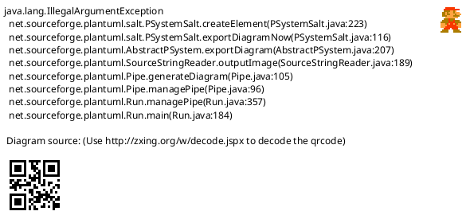
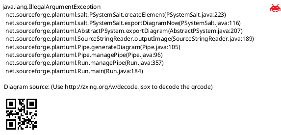

# NFC PN532

NFC PN532调试

* [一、参考文档](#一参考文档)
* [二、访问NFC接口架构](#二访问NFC接口架构)
* [二、DTS配置参考](#二DTS配置参考)
* [三、数据传输格式](#三数据传输格式)
* [四、驱动数据调试点](#四驱动数据调试点)
* [五、Linux NFC系统](#五Linux-NFC系统)
* [六、NFC收发数据同步原理](#六NFC收发数据同步原理)
* [七、nfc设别注册流程](#七nfc设别注册流程)
* [八、Socket创建](#八Socket创建)
* [九、NFC驱动调试](#九NFC驱动调试)
  * [9.1 i2c bus device](#91-i2c-bus-device)
  * [9.2 测试外扩HAT是否正常工作](#92-测试外扩HAT是否正常工作)
  * [9.3 查看系统gpio信息](#93-查看系统gpio信息)
  * [9.4 注册NFC设备](#94-注册NFC设备)

## 一、参考文档

* [Linux NFC subsystem](https://www.kernel.org/doc/html/latest/networking/nfc.html)
* [nfc-example](https://github.com/pcacjr/nfc-example)
* [Near_Field_Communication_with_Linux](https://elinux.org/images/d/d1/Near_Field_Communication_with_Linux.pdf)
* [linux NFC subsystm](http://lishiwen4.github.io/nfc/nfc-subsystem)
* https://git.kernel.org/pub/scm/network/nfc/neard.git
* Linux Kernel Networking - Implementation and Theory.pdf(《精通Linux内核网络》)
  * Chapter 14 Advanced Topics
    * Near Field Communication (NFC)


## 二、访问NFC接口架构

```
+--------------------------------------+
|              USER SPACE              |
+--------------------------------------+
    ^                       ^
    | low-level             | control
    | data exchange         | operations
    |                       |
    |                       v
    |                  +-----------+
    | AF_NFC           |  netlink  |
    | socket           +-----------+
    | raw                   ^
    |                       |
    v                       v
+---------+            +-----------+
| rawsock | <--------> |   core    |
+---------+            +-----------+
                            ^
                            |
                            v
                       +-----------+
                       |  driver   |
                       +-----------+
```

## 二、DTS配置参考

`IRQ`引脚可向主机发出中断请求

`Documentation/devicetree/bindings/net/nfc/pn533-i2c.txt`  
```
* NXP Semiconductors PN532 NFC Controller

Required properties:
- compatible: Should be "nxp,pn532-i2c" or "nxp,pn533-i2c".
- clock-frequency: I²C work frequency.
- reg: address on the bus
- interrupt-parent: phandle for the interrupt gpio controller
- interrupts: GPIO interrupt to which the chip is connected

Optional SoC Specific Properties:
- pinctrl-names: Contains only one value - "default".
- pintctrl-0: Specifies the pin control groups used for this controller.

Example (for ARM-based BeagleBone with PN532 on I2C2):

&i2c2 {

        status = "okay";

        pn532: pn532@24 {

                compatible = "nxp,pn532-i2c";

                reg = <0x24>;
                clock-frequency = <400000>;

                interrupt-parent = <&gpio1>;
                interrupts = <17 IRQ_TYPE_EDGE_FALLING>;

        };
};
```

## 三、数据传输格式


* `drivers/nfc/pn533/pn533.h`

```C
struct pn533_std_frame {
        u8 preamble;
        __be16 start_frame;
        u8 datalen;
        u8 datalen_checksum;
        u8 data[];
} __packed;

struct pn533_ext_frame {        /* Extended Information frame */
        u8 preamble;
        __be16 start_frame;
        __be16 eif_flag;        /* fixed to 0xFFFF */
        __be16 datalen;
        u8 datalen_checksum;
        u8 data[];
} __packed;
```

## 四、驱动数据调试点

`drivers/nfc/pn533/i2c.c`

驱动数据调试点

* https://github.com/commaai/android_kernel_comma_msm8996/blob/master/drivers/nfc/pn533.c#L606
  * https://github.com/commaai/android_kernel_comma_msm8996/blob/master/drivers/nfc/pn533.c#L565
    ```C
    /* The rule: sum(data elements) + checksum = 0 */
    static u8 pn533_std_data_checksum(u8 *data, int datalen)
    {
        u8 sum = 0;
        int i
        for (i = 0; i < datalen; i++)
            sum += data[i]
        return pn533_std_checksum(sum);
    }
    ```

## 五、Linux NFC系统


## 六、NFC收发数据同步原理

```plantuml
@startsalt
* net/nfc/core.c
  * rc = nfc_genl_init();
    * rc = genl_register_family(&nfc_genl_family);
      * static struct genl_family nfc_genl_family __ro_after_init
        * .ops = nfc_genl_ops,
          * static const struct genl_ops nfc_genl_ops[]
            * .doit = nfc_genl_dev_up,
              * dev = nfc_get_device(idx);
              * rc = nfc_dev_up(dev);
                * rc = dev->ops->dev_up(dev);
                  * drivers/nfc/pn533/pn533.c
                    * static struct nfc_ops pn533_nfc_ops
                      * .dev_up = pn533_dev_up,
                        * return pn533_rf_field(nfc_dev, 1);
                          * rc = pn533_set_configuration(dev, PN533_CFGITEM_RF_FIELD, (u8 *)&rf_field, 1);
                            * resp = pn533_send_cmd_sync(dev, PN533_CMD_SAM_CONFIGURATION, skb);
                              * init_completion(&arg.done);
                              * rc = pn533_send_cmd_async(dev, cmd_code, req, pn533_send_sync_complete, &arg);
                                * rc = __pn533_send_async(dev, cmd_code, req, complete_cb, complete_cb_context);
                                  * pn533_build_cmd_frame(dev, cmd_code, req);
                                    * rc = dev->phy_ops->send_frame(dev, req);
                                      * drivers/nfc/pn533/i2c.c
                                        * static struct pn533_phy_ops i2c_phy_ops
                                          * .send_frame = pn533_i2c_send_frame,
                                            * rc = i2c_master_send(client, out->data, out->len);
                                        * r = request_threaded_irq(client->irq, NULL, pn533_i2c_irq_thread_fn, IRQF_TRIGGER_FALLING | IRQF_SHARED | IRQF_ONESHOT, PN533_I2C_DRIVER_NAME, phy);
                                          * static irqreturn_t pn533_i2c_irq_thread_fn()
                                            * pn533_recv_frame(phy->priv, skb, 0);
                                              * dev->cmd->resp = skb;
                                              * queue_work(dev->wq, &dev->cmd_complete_work);
                                                * INIT_WORK(&priv->cmd_complete_work, pn533_wq_cmd_complete);
                                                  * rc = pn533_send_async_complete(dev);
                                                    * rc = cmd->complete_cb(dev, cmd->complete_cb_context, ERR_PTR(status));
                                                      * static int pn533_send_sync_complete(struct pn533 *dev, void *_arg, struct sk_buff *resp)
                                                        * complete(&arg->done);
                              * wait_for_completion(&arg.done);
              * nfc_put_device(dev);
@endsalt
```



## 七、nfc设别注册流程



## 八、Socket创建



## 九、NFC驱动调试

### 9.1 i2c bus device

```
root@raspberrypi:/sys/bus/i2c# i2cdetect -y 1
     0  1  2  3  4  5  6  7  8  9  a  b  c  d  e  f
00:          -- -- -- -- -- -- -- -- -- -- -- -- --
10: -- -- -- -- -- -- -- -- -- -- -- -- -- -- -- --
20: -- -- -- -- 24 -- -- -- -- -- -- -- -- -- -- --
30: -- -- -- -- -- -- -- -- -- -- -- -- -- -- -- --
40: -- -- -- -- -- -- -- -- -- -- -- -- -- -- -- --
50: -- -- -- -- -- -- -- -- -- -- -- -- -- -- -- --
60: -- -- -- -- -- -- -- -- -- -- -- -- -- -- -- --
70: -- -- -- -- -- -- -- --
```

### 9.2 测试外扩HAT是否正常工作

* wget http://www.waveshare.net/w/upload/6/67/Pn532-nfc-hat-code.7z
* sudo  apt-get install p7zip
* 7zr x Pn532-nfc-hat-code.7z
* cd Pn532-nfc-hat-code/raspberrypi/python && python3 example_get_uid.py
  ```
  Found PN532 with firmware version: 1.6
  Waiting for RFID/NFC card...
  ............Found card with UID: ['0xa', '0xc4', '0x32', '0x1d']
  .Found card with UID: ['0xa', '0xc4', '0x32', '0x1d']
  .........Found card with UID: ['0xa', '0xc4', '0x32', '0x1d']
  ................Found card with UID: ['0xa', '0xc4', '0x32', '0x1d']
  .Found card with UID: ['0xa', '0xc4', '0x32', '0x1d']
  .....Found card with UID: ['0xa', '0xc4', '0x32', '0x1d']
  .Found card with UID: ['0xa', '0xc4', '0x32', '0x1d']
  .Found card with UID: ['0xa', '0xc4', '0x32', '0x1d']
  .Found card with UID: ['0xa', '0xc4', '0x32', '0x1d']
  ```
### 9.3 查看系统gpio信息

sudo cat /sys/kernel/debug/gpio

### 9.4 注册NFC设备

* make CROSS_COMPILE=arm-linux-gnueabihf- menuconfig
  ```
   .config - Linux/arm 4.19.71 Kernel Configuration
   [...] upport → NFC subsystem support → Near Field Communication (NFC) devices
    ┌──────────────── Near Field Communication (NFC) devices ─────────────────┐
    │  Arrow keys navigate the menu.  <Enter> selects submenus ---> (or empty │
    │  submenus ----).  Highlighted letters are hotkeys.  Pressing <Y>        │
    │  includes, <N> excludes, <M> modularizes features.  Press <Esc><Esc> to │
    │  exit, <?> for Help, </> for Search.  Legend: [*] built-in  [ ]         │
    │ ┌─────────────────────────────────────────────────────────────────────┐ │
    │ │    < > NFC PN533 device support (USB)                               │ │
    │ │    <M> NFC PN533 device support (I2C)                               │ │
    │ │                                                                     │ │
    │ │                                                                     │ │
    │ │                                                                     │ │
    │ │                                                                     │ │
    │ │                                                                     │ │
    │ │                                                                     │ │
    │ │                                                                     │ │
    │ │                                                                     │ │
    │ │                                                                     │ │
    │ │                                                                     │ │
    │ │                                                                     │ │
    │ └─────────────────────────────────────────────────────────────────────┘ │
    ├─────────────────────────────────────────────────────────────────────────┤
    │        <Select>    < Exit >    < Help >    < Save >    < Load >         │
    └─────────────────────────────────────────────────────────────────────────┘
  ```
* uname -a
  ```
  Linux raspberrypi 4.19.71-v7l #3 SMP Sun Feb 23 03:18:41 GMT 2020 armv7l GNU/Linux
  ```
* make -j4 modules
* 安装模块：
  * sudo make modules_install
    * drivers/nfc/pn533/pn533.ko
    * drivers/nfc/pn533/pn533_i2c.ko
  * sudo cp drivers/nfc/pn533/pn533_i2c.ko /lib/modules/4.19.71-v7l/kernel/drivers/nfc/pn533/pn533_i2c.ko
* sudo su
* cd arch/arm/boot/dts/overlays
  * dtc -O dtb -o rpi-pn532.dtbo rpi-pn532-overlay.dts
    ```dts
    // pn532 nfc
    /dts-v1/;
    /plugin/;
    
    / {
            compatible = "brcm,bcm2835";
            fragment@0 {
                    target = <&gpio>;
                    __overlay__ {
                            pn532_irq_pins: pn532_irq_pins {
                                    brcm,pins = <4>; // interrupt and reset
                                    brcm,function = <0>; // in
                                    brcm,pull = <2>; // pull-up
                            };
                    };
            };
    
    
            fragment@1 {
                    target = <&i2c1>;
                    __overlay__ {
                            #address-cells = <1>;
                            #size-cells = <0>;
                            status = "okay";
    
                            pn532@24 {
                                    compatible = "nxp,pn532-i2c";
    
                                    reg = <0x24>;
                                    clock-frequency = <400000>;
    
                                    pinctrl-names = "default";
                                    pinctrl-0 = <&pn532_irq_pins>;
    
                                    interrupt-parent = <&gpio>;
                                    interrupts = <4 2>;
                                    irq-gpios = <&gpio 4 0>;
    
                                    status = "okay";
                            };
                    };
            };
    };
    ```
  * sudo cp rpi-pn532.dtbo /boot/overlays/
* dmesg
  ```
  [    9.289038] nfc: nfc_init: NFC Core ver 0.1
  [    9.289143] NET: Registered protocol family 39
  [    9.402161] pn533_i2c 1-0024: NFC: NXP PN532 firmware ver 1.6 now attached
  ```
* sudo apt-get install libgstreamer0.10-dev
* sudo apt-get install libnl-genl-3-dev 
* https://github.com/ZengjfOS/RaspberryPi/tree/nfc-example
  * make
  * ./nfcex --help
    ```
    ./nfcex: unrecognized option '--help'
    Usage: ./nfcex  [-v] [-p PROT] (-d|-t|-r|-w STR|-o STREAM|-s)
    Option:                         Description:
    -v, --verbose                   Enable verbosity
    -p, --protocol                  Restrict to PROT protocol
                                    PROT = {mifare}
    -d, --list-devices              List all attached NFC devices
    -t, --list-targets              List all found NFC targets
    -r, --read-tag                  Read tag
    -w, --write-tag                 Write STR to tag
    -o, --other-write-tag           Write byte stream to tag
    -s, --run-test                  Run test
    ```
  * ./nfcex --list-devices
    ```
    NFC device list:
    Index:  Name:   Protocols:
    0       nfc0    0x3e
    ```
  * ./nfcex -v -p mifare -r