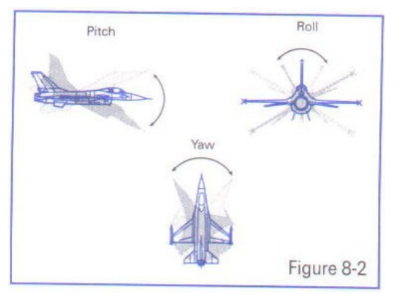
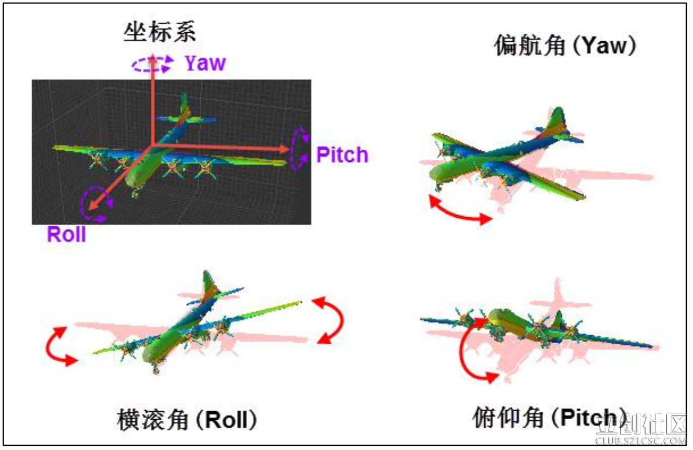
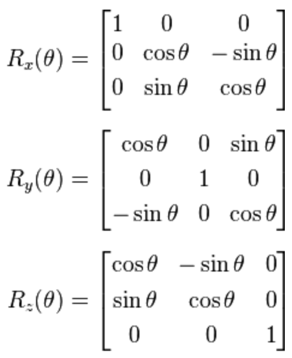
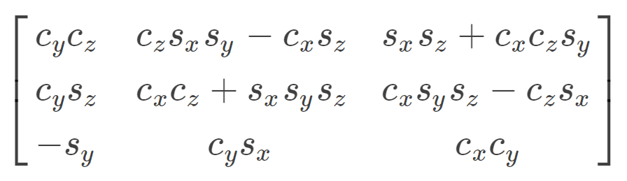
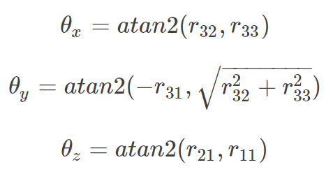

# AHRS

AHRS俗称航姿参考系统，AHRS由加速度计，磁场计，陀螺仪构成，AHRS的真正参考来自于地球的重力场和地球的磁场

* [一、参考文档](#一参考文档)
* [二、基本概念](#二基本概念)
* [三、地理坐标系](#三地理坐标系)
* [三、欧拉角](#三欧拉角)
* [四、欧拉角转成旋转矩阵](#四欧拉角转成旋转矩阵)
* [五、旋转矩阵转欧拉角](#五旋转矩阵转欧拉角)
* [六、四元素](#六四元素)
* [七、ICM20948](#七ICM20948)

## 一、参考文档

* [AHRS姿态解算说明(加速度+陀螺仪+磁力计原理及原始数据分析)](http://www.51hei.com/bbs/dpj-92911-1.html)
* [AHRS（航姿参考系统）和IMU（惯性测量单元）的区别](https://blog.csdn.net/qq_39554681/article/details/89712211)
* [四元数与欧拉角（RPY角）的相互转换](https://www.cnblogs.com/21207-iHome/p/6894128.html)
* [飞行姿态解算（一）](https://zhuanlan.zhihu.com/p/20382236)
* [飞行姿态解算（二）](https://zhuanlan.zhihu.com/p/20391408)
* [飞行姿态解算（三）](https://zhuanlan.zhihu.com/p/20406702)

## 二、基本概念

AHRS俗称航姿参考系统，AHRS由加速度计，磁场计，陀螺仪构成，AHRS的真正参考来自于地球的重力场和地球的磁场。

(IMU）Inertial measurement unit：学名惯性测量单元，大学的理论力学告诉我们，所有的运动都可以分解为一个直线运动和一个旋转运动，故这个惯性测量单元就是测量这两种运动，直线运动通过加速度计可以测量，旋转运动则通过陀螺。

6 DOF: Six degrees of freedom

实际上AHRS比IMU还多一个磁场传感器，而为什么AHRS的级别却低于IMU而需要依赖于重力场和磁场呢？这是由传感器器件架构所决定的。AHRS的传感器通常是成本低廉的mems传感器。这种传感器的陀螺仪和加速度计的噪声相对来说很大，以平面陀螺为例用ADI的陀螺仪进行积分一分钟会漂移2度左右，这种前提下如果没有磁场和重力场来修正三轴陀螺的话。那么基本上3分钟以后物体的实际姿态和测量输出姿态就完全变样了，所以在这种低价陀螺仪和加速度计的架构下必须运用场向量来进行修正。

使用IMU来测量姿态也只能相对于飞行器的初始姿态，或理想姿态来测量和描述。

不同型号的加速度传感器的 0g 的 offset 不同，同一型号的不同芯片的 0g 的 offset 也不同，甚至同一颗芯片中不同轴的 0g 的 offset 也不同，是否需要校正要视具体应用而定。如果应用中只关心加速度的相对变化，而不关心加速度的具体数值，则不需要校正。如果是关心加速度的具体数值，而所选器件的 offset 又比较大，则必须要校正。某些加速度传感器本身有 offset 寄存器（ADXL345），这是只需要把待校准的轴沿水平方向静止放置，测量其 0g 时的输出，并把这个值乘以-1 写入 offset 寄存器即可。如果加速度传感器本身没有 offset 寄存器，则需要用户在自己的处理器中记录这个数值，并在实际的测量结果中减去这个 offset。另外，需要注意的是。数据手册中一般会给出 offset 的典型值，最大值和最小值。这些值都是在一定的供电电压下给出的。而当供电电压改变后，offset 的值也会相应按比例改变。通常为供电电压的一半。

## 三、地理坐标系

在飞机上建立一个坐标系，X轴为机翼的方向，Y轴为机头的方向，Z轴垂直于飞机，这个坐标系是随着飞机姿态改变而变动的，此时就要求飞机的姿态，就等价于求出这个坐标系，那么如何得到这个坐标系？要得到一个新的坐标系，首先要有一个参考坐标系，一般选取Y轴正向为正北，x正向为正东，z轴垂直于地平面了，给他取个名字，就叫地理坐标系吧。

## 三、欧拉角

欧拉角是很直观的，一个物体的旋转，可以分解到三个坐标轴上的旋转。这三个旋转角度就是欧拉角。在惯性系统中一般把这三个角度分别称为俯仰角（Pitch）、横滚角（Roll）和偏航角（Yaw）。上个直观的图，很容易理解。

  


用欧拉角来描述物体的旋转不光需要有角度，还需要有旋转顺序，一般旋转顺序是先yaw后pitch，再roll反应到坐标轴上就是先绕Z轴旋转，再绕X轴旋转，最后绕Y轴旋转。需要注意的是 yaw pitch roll 都是对应的固定的参考系 也就是上面说的地理坐标系而言，每次新的姿态坐标系都是由地理坐标系通过欧拉角旋转得到的。这样我们就用欧拉角表示了物体的姿态。

## 四、欧拉角转成旋转矩阵


```
    | 1 |      |  0   |      |   0   |
x = | 0 |  y = | cos0 |  z = | -sin0 |
    | 0 |      | sin0 |      |  cos0 |

x^2 =                      1;
y^2 = cos0^2 + sin0^2    = 1;
z^2 = (-sin0)^2 + cos0^2 = 1;

如上可知：
  1. 矩阵第一列为X轴信息；
  2. 矩阵第二列为Y轴信息；
  3. 矩阵第三列为Z轴信息；
```

如上可知，三个轴就有三个欧拉矩阵



如果依次绕x轴、y轴、z轴旋转，该变换的旋转矩阵为：

`R=Rz⋅Ry⋅Rx`

记三个轴欧拉角的正弦和余弦函数为sx,cx,sy,cy,sz,cz。使用推导旋转矩阵R：



## 五、旋转矩阵转欧拉角

设旋转矩阵i行j列元素为rij。根据旋转矩阵的表达式，利用三角函数可以推导出欧拉角取值：



## 六、四元素

暂时不花时间去理解，有需要再看

* [如何形象地理解四元数？ - 知乎](https://www.zhihu.com/question/23005815/answer/483589712)
  * https://krasjet.github.io/quaternion/quaternion.pdf
  * https://link.zhihu.com/?target=https%3A//www.bilibili.com/video/av33385105
* [四元数——基本概念](https://zhuanlan.zhihu.com/p/27471300)

## 七、ICM20948

需要注意的是，有些传感器数据是采用二进制补码（Two's complement）的形式存储16bit数据，有些采用无符号16bit存储数据，这两者差异就是要不要软件进行一次offset换算；

```python
#!/usr/bin/python
# -*- coding:utf-8 -*-
import time
import smbus
import math
Gyro  = [0,0,0]
Accel = [0,0,0]
Mag   = [0,0,0]
pitch = 0.0
roll  = 0.0
yaw   = 0.0
pu8data=[0,0,0,0,0,0,0,0]
U8tempX=[0,0,0,0,0,0,0,0,0]
U8tempY=[0,0,0,0,0,0,0,0,0]
U8tempZ=[0,0,0,0,0,0,0,0,0]
GyroOffset=[0,0,0]
Ki = 1.0
Kp = 4.50
q0 = 1.0
q1=q2=q3=0.0
angles=[0.0,0.0,0.0]
true                                 =0x01
false                                =0x00
# define ICM-20948 Device I2C address
I2C_ADD_ICM20948                     = 0x68
I2C_ADD_ICM20948_AK09916             = 0x0C
I2C_ADD_ICM20948_AK09916_READ        = 0x80
I2C_ADD_ICM20948_AK09916_WRITE       = 0x00
# define ICM-20948 Register
# user bank 0 register
REG_ADD_WIA                          = 0x00
REG_VAL_WIA                          = 0xEA
REG_ADD_USER_CTRL                    = 0x03
REG_VAL_BIT_DMP_EN                   = 0x80
REG_VAL_BIT_FIFO_EN                  = 0x40
REG_VAL_BIT_I2C_MST_EN               = 0x20
REG_VAL_BIT_I2C_IF_DIS               = 0x10
REG_VAL_BIT_DMP_RST                  = 0x08
REG_VAL_BIT_DIAMOND_DMP_RST          = 0x04
REG_ADD_PWR_MIGMT_1                  = 0x06
REG_VAL_ALL_RGE_RESET                = 0x80
REG_VAL_RUN_MODE                     = 0x01 # Non low-power mode
REG_ADD_LP_CONFIG                    = 0x05
REG_ADD_PWR_MGMT_1                   = 0x06
REG_ADD_PWR_MGMT_2                   = 0x07
REG_ADD_ACCEL_XOUT_H                 = 0x2D
REG_ADD_ACCEL_XOUT_L                 = 0x2E
REG_ADD_ACCEL_YOUT_H                 = 0x2F
REG_ADD_ACCEL_YOUT_L                 = 0x30
REG_ADD_ACCEL_ZOUT_H                 = 0x31
REG_ADD_ACCEL_ZOUT_L                 = 0x32
REG_ADD_GYRO_XOUT_H                  = 0x33
REG_ADD_GYRO_XOUT_L                  = 0x34
REG_ADD_GYRO_YOUT_H                  = 0x35
REG_ADD_GYRO_YOUT_L                  = 0x36
REG_ADD_GYRO_ZOUT_H                  = 0x37
REG_ADD_GYRO_ZOUT_L                  = 0x38
REG_ADD_EXT_SENS_DATA_00             = 0x3B
REG_ADD_REG_BANK_SEL                 = 0x7F
REG_VAL_REG_BANK_0                   = 0x00
REG_VAL_REG_BANK_1                   = 0x10
REG_VAL_REG_BANK_2                   = 0x20
REG_VAL_REG_BANK_3                   = 0x30

# user bank 1 register
# user bank 2 register
REG_ADD_GYRO_SMPLRT_DIV              = 0x00
REG_ADD_GYRO_CONFIG_1                = 0x01
REG_VAL_BIT_GYRO_DLPCFG_2            = 0x10  # bit[5:3]
REG_VAL_BIT_GYRO_DLPCFG_4            = 0x20  # bit[5:3]
REG_VAL_BIT_GYRO_DLPCFG_6            = 0x30  # bit[5:3]
REG_VAL_BIT_GYRO_FS_250DPS           = 0x00  # bit[2:1]
REG_VAL_BIT_GYRO_FS_500DPS           = 0x02  # bit[2:1]
REG_VAL_BIT_GYRO_FS_1000DPS          = 0x04  # bit[2:1]
REG_VAL_BIT_GYRO_FS_2000DPS          = 0x06  # bit[2:1]
REG_VAL_BIT_GYRO_DLPF                = 0x01  # bit[0]
REG_ADD_ACCEL_SMPLRT_DIV_2           = 0x11
REG_ADD_ACCEL_CONFIG                 = 0x14
REG_VAL_BIT_ACCEL_DLPCFG_2           = 0x10  # bit[5:3]
REG_VAL_BIT_ACCEL_DLPCFG_4           = 0x20  # bit[5:3]
REG_VAL_BIT_ACCEL_DLPCFG_6           = 0x30  # bit[5:3]
REG_VAL_BIT_ACCEL_FS_2g              = 0x00  # bit[2:1]
REG_VAL_BIT_ACCEL_FS_4g              = 0x02  # bit[2:1]
REG_VAL_BIT_ACCEL_FS_8g              = 0x04  # bit[2:1]
REG_VAL_BIT_ACCEL_FS_16g             = 0x06  # bit[2:1]
REG_VAL_BIT_ACCEL_DLPF               = 0x01  # bit[0]

# user bank 3 register
REG_ADD_I2C_SLV0_ADDR                = 0x03
REG_ADD_I2C_SLV0_REG                 = 0x04
REG_ADD_I2C_SLV0_CTRL                = 0x05
REG_VAL_BIT_SLV0_EN                  = 0x80
REG_VAL_BIT_MASK_LEN                 = 0x07
REG_ADD_I2C_SLV0_DO                  = 0x06
REG_ADD_I2C_SLV1_ADDR                = 0x07
REG_ADD_I2C_SLV1_REG                 = 0x08
REG_ADD_I2C_SLV1_CTRL                = 0x09
REG_ADD_I2C_SLV1_DO                  = 0x0A

# define ICM-20948 Register  end

# define ICM-20948 MAG Register
REG_ADD_MAG_WIA1                     = 0x00
REG_VAL_MAG_WIA1                     = 0x48
REG_ADD_MAG_WIA2                     = 0x01
REG_VAL_MAG_WIA2                     = 0x09
REG_ADD_MAG_ST2                      = 0x10
REG_ADD_MAG_DATA                     = 0x11
REG_ADD_MAG_CNTL2                    = 0x31
REG_VAL_MAG_MODE_PD                  = 0x00
REG_VAL_MAG_MODE_SM                  = 0x01
REG_VAL_MAG_MODE_10HZ                = 0x02
REG_VAL_MAG_MODE_20HZ                = 0x04
REG_VAL_MAG_MODE_50HZ                = 0x05
REG_VAL_MAG_MODE_100HZ               = 0x08
REG_VAL_MAG_MODE_ST                  = 0x10
# define ICM-20948 MAG Register  end

MAG_DATA_LEN                         =6

class ICM20948(object):
  def __init__(self,address=I2C_ADD_ICM20948):    # 1101000 = 110 1000 = 0x68
    self._address = address               # 保存I2C地址
    self._bus = smbus.SMBus(1)            # 获取/dev/i2c1 bus总线
    bRet=self.icm20948Check()             #Initialization of the device multiple times after power on will result in a return error
    # while true != bRet:
    #   print("ICM-20948 Error\n" )
    #   time.sleep(0.5)
    # print("ICM-20948 OK\n" )
    time.sleep(0.5)                       #We can skip this detection by delaying it by 500 milliseconds
    # user bank 0 register 
    self._write_byte( REG_ADD_REG_BANK_SEL , REG_VAL_REG_BANK_0)     # REG_ADD_REG_BANK_SEL: 0x7F; REG_VAL_REG_BANK_0: 0x00
    self._write_byte( REG_ADD_PWR_MIGMT_1 , REG_VAL_ALL_RGE_RESET)   # REG_ADD_PWR_MIGMT_1: 0x06; REG_VAL_ALL_RGE_RESET: 0x80; Reset the internal registers and restores the default settings. 
    time.sleep(0.1)
    self._write_byte( REG_ADD_PWR_MIGMT_1 , REG_VAL_RUN_MODE)        # REG_VAL_RUN_MODE: 0x01; Auto selects the best available clock source – PLL if ready, else use the Internal oscillator  
    #user bank 2 register
    self._write_byte( REG_ADD_REG_BANK_SEL , REG_VAL_REG_BANK_2)
    # 1. REG_ADD_GYRO_SMPLRT_DIV: 0x00; 
    #   1. Gyro sample rate divider(分频系数). 1.1 kHz/(1+GYRO_SMPLRT_DIV[7:0]) = 1.1 kHz / 8 = 137.5 Hz
    self._write_byte( REG_ADD_GYRO_SMPLRT_DIV , 0x07)
    # 1. REG_ADD_GYRO_CONFIG_1: 0x01; 
    #   1.1 Gyro low pass filter configuration
    #   1.2 Gyro Full Scale Select: 1000 dps(degree per second)
    #   1.3 Enable gyro DLPFEnable gyro DLPF
    # 2. 低通滤波及量程范围
    self._write_byte( REG_ADD_GYRO_CONFIG_1 , REG_VAL_BIT_GYRO_DLPCFG_6 | REG_VAL_BIT_GYRO_FS_1000DPS | REG_VAL_BIT_GYRO_DLPF)
    # 1. REG_ADD_ACCEL_SMPLRT_DIV_2: 0x11;
    #   1.1 LSB for ACCEL sample rate div. 1.125 kHz/(1+ACCEL_SMPLRT_DIV[11:0]) = 1.125 kHz / 8 = 140.625
    self._write_byte( REG_ADD_ACCEL_SMPLRT_DIV_2 ,  0x07)
    # 1. REG_ADD_ACCEL_CONFIG: 0x14
    #   1. Accelerometer low pass filter configuration;
    #   2. Accelerometer Full Scale Select: 2g
    #   3. Enable accel DLPF
    # 2. 低通滤波及量程范围
    self._write_byte( REG_ADD_ACCEL_CONFIG , REG_VAL_BIT_ACCEL_DLPCFG_6 | REG_VAL_BIT_ACCEL_FS_2g | REG_VAL_BIT_ACCEL_DLPF)
    #user bank 0 register
    self._write_byte( REG_ADD_REG_BANK_SEL , REG_VAL_REG_BANK_0) 
    time.sleep(0.1)
    # 计算平衡点对应的16 bit的寄存器的值，就是X，Y，Z轴的0点对应的16 bit的寄存器值；
    self.icm20948GyroOffset()
    # 检查AK09916磁感芯片是否正常读写
    self.icm20948MagCheck()
    # REG_ADD_MAG_CNTL2: 0x31
    # REG_VAL_MAG_MODE_20HZ: 0x04
    self.icm20948WriteSecondary( I2C_ADD_ICM20948_AK09916|I2C_ADD_ICM20948_AK09916_WRITE,REG_ADD_MAG_CNTL2, REG_VAL_MAG_MODE_20HZ)
  def icm20948_Gyro_Accel_Read(self):
    self._write_byte( REG_ADD_REG_BANK_SEL , REG_VAL_REG_BANK_0)
    '''
    1. 寄存器地址
      REG_ADD_ACCEL_XOUT_H                 = 0x2D
      REG_ADD_ACCEL_XOUT_L                 = 0x2E
      REG_ADD_ACCEL_YOUT_H                 = 0x2F
      REG_ADD_ACCEL_YOUT_L                 = 0x30
      REG_ADD_ACCEL_ZOUT_H                 = 0x31
      REG_ADD_ACCEL_ZOUT_L                 = 0x32
      REG_ADD_GYRO_XOUT_H                  = 0x33
      REG_ADD_GYRO_XOUT_L                  = 0x34
      REG_ADD_GYRO_YOUT_H                  = 0x35
      REG_ADD_GYRO_YOUT_L                  = 0x36
      REG_ADD_GYRO_ZOUT_H                  = 0x37
      REG_ADD_GYRO_ZOUT_L                  = 0x38
    2. 加速度、陀螺仪数据寄存器，这里为什么要读一次呢
    '''
    data =self._read_block(REG_ADD_ACCEL_XOUT_H, 12)
    self._write_byte( REG_ADD_REG_BANK_SEL , REG_VAL_REG_BANK_2)
    Accel[0] = (data[0]<<8)|data[1]                       # ACCEL: X
    Accel[1] = (data[2]<<8)|data[3]                       # ACCEL: Y
    Accel[2] = (data[4]<<8)|data[5]                       # ACCEL: Z
    Gyro[0]  = ((data[6]<<8)|data[7]) - GyroOffset[0]     # GYRO: X; GyroOffset X轴偏置
    Gyro[1]  = ((data[8]<<8)|data[9]) - GyroOffset[1]     # GYRO: Y; GyroOffset Y轴偏置
    Gyro[2]  = ((data[10]<<8)|data[11]) - GyroOffset[2]   # GYRO: Z; GyroOffset Z轴偏置
    if Accel[0]>=32767:             #Solve the problem that Python shift will not overflow
      Accel[0]=Accel[0]-65535
    elif Accel[0]<=-32767:
      Accel[0]=Accel[0]+65535
    if Accel[1]>=32767:
      Accel[1]=Accel[1]-65535
    elif Accel[1]<=-32767:
      Accel[1]=Accel[1]+65535
    if Accel[2]>=32767:
      Accel[2]=Accel[2]-65535
    elif Accel[2]<=-32767:
      Accel[2]=Accel[2]+65535
    if Gyro[0]>=32767:
      Gyro[0]=Gyro[0]-65535
    elif Gyro[0]<=-32767:
      Gyro[0]=Gyro[0]+65535
    if Gyro[1]>=32767:
      Gyro[1]=Gyro[1]-65535
    elif Gyro[1]<=-32767:
      Gyro[1]=Gyro[1]+65535
    if Gyro[2]>=32767:
      Gyro[2]=Gyro[2]-65535
    elif Gyro[2]<=-32767:
      Gyro[2]=Gyro[2]+65535
  def icm20948MagRead(self):
    counter=20
    while(counter>0):
      time.sleep(0.01)
      # REG_ADD_MAG_ST2: 0x10
      #   DRDY: Data Ready
      self.icm20948ReadSecondary( I2C_ADD_ICM20948_AK09916|I2C_ADD_ICM20948_AK09916_READ , REG_ADD_MAG_ST2, 1)
      if ((pu8data[0] & 0x01)!= 0):
        break
      counter-=1
    if counter!=0:
      # 读八次数据，直接除以八求平均
      for i in range(0,8):
        # REG_ADD_MAG_DATA: 0x11
        #   Measurement data of magnetic sensor X-axis/Y-axis/Z-axis
        # MAG_DATA_LEN: 6
        self.icm20948ReadSecondary( I2C_ADD_ICM20948_AK09916|I2C_ADD_ICM20948_AK09916_READ , REG_ADD_MAG_DATA , MAG_DATA_LEN)
        U8tempX[i] = (pu8data[1]<<8)|pu8data[0]
        U8tempY[i] = (pu8data[3]<<8)|pu8data[2]
        U8tempZ[i] = (pu8data[5]<<8)|pu8data[4]
      Mag[0]=(U8tempX[0]+U8tempX[1]+U8tempX[2]+U8tempX[3]+U8tempX[4]+U8tempX[5]+U8tempX[6]+U8tempX[7])/8
      Mag[1]=-(U8tempY[0]+U8tempY[1]+U8tempY[2]+U8tempY[3]+U8tempY[4]+U8tempY[5]+U8tempY[6]+U8tempY[7])/8
      Mag[2]=-(U8tempZ[0]+U8tempZ[1]+U8tempZ[2]+U8tempZ[3]+U8tempZ[4]+U8tempZ[5]+U8tempZ[6]+U8tempZ[7])/8
    if Mag[0]>=32767:            #Solve the problem that Python shift will not overflow
      Mag[0]=Mag[0]-65535
    elif Mag[0]<=-32767:
      Mag[0]=Mag[0]+65535
    if Mag[1]>=32767:
      Mag[1]=Mag[1]-65535
    elif Mag[1]<=-32767:
      Mag[1]=Mag[1]+65535
    if Mag[2]>=32767:
      Mag[2]=Mag[2]-65535
    elif Mag[2]<=-32767:
      Mag[2]=Mag[2]+65535
  def icm20948ReadSecondary(self,u8I2CAddr,u8RegAddr,u8Len):
    u8Temp=0
    self._write_byte( REG_ADD_REG_BANK_SEL,  REG_VAL_REG_BANK_3) #swtich bank3
    # REG_ADD_I2C_SLV0_ADDR: 0x03
    #   Physical address of I2C slave 0
    self._write_byte( REG_ADD_I2C_SLV0_ADDR, u8I2CAddr)
    # REG_ADD_I2C_SLV0_REG: 0x04
    #   I2C slave 0 register address from where to begin data transfer.
    self._write_byte( REG_ADD_I2C_SLV0_REG,  u8RegAddr)
    # REG_VAL_BIT_SLV0_EN: 0x80
    #   Enable reading data from this slave at the sample rate and storing data at the first available EXT_SENS_DATA register, which is always EXT_SENS_DATA_00 for I2C slave 0.
    #   u8Len: Number of bytes to be read from I2C slave 0
    #      2
    self._write_byte( REG_ADD_I2C_SLV0_CTRL, REG_VAL_BIT_SLV0_EN|u8Len)

    self._write_byte( REG_ADD_REG_BANK_SEL, REG_VAL_REG_BANK_0) #swtich bank0
    
    # REG_ADD_USER_CTRL: 0x03
    u8Temp = self._read_byte(REG_ADD_USER_CTRL)
    # REG_VAL_BIT_I2C_MST_EN: Enable the I2C Master I/F module; pins ES_DA and ES_SCL are isolated from pins SDA/SDI and SCL/ SCLK.
    u8Temp |= REG_VAL_BIT_I2C_MST_EN
    self._write_byte( REG_ADD_USER_CTRL, u8Temp)
    time.sleep(0.01)
    # 前面打开，然后传完数据了，就关闭
    u8Temp &= ~REG_VAL_BIT_I2C_MST_EN
    self._write_byte( REG_ADD_USER_CTRL, u8Temp)
    
    for i in range(0,u8Len):
      # REG_ADD_EXT_SENS_DATA_00: 0x3B
      #   01H: WIA2
      pu8data[i]= self._read_byte( REG_ADD_EXT_SENS_DATA_00+i)

    self._write_byte( REG_ADD_REG_BANK_SEL, REG_VAL_REG_BANK_3) #swtich bank3
    
    u8Temp = self._read_byte(REG_ADD_I2C_SLV0_CTRL)
    # REG_VAL_BIT_I2C_MST_EN应该使用REG_VAL_BIT_SLV0_EN
    u8Temp &= ~((REG_VAL_BIT_I2C_MST_EN)&(REG_VAL_BIT_MASK_LEN))
    self._write_byte( REG_ADD_I2C_SLV0_CTRL,  u8Temp)
    
    self._write_byte( REG_ADD_REG_BANK_SEL, REG_VAL_REG_BANK_0) #swtich bank0
  def icm20948WriteSecondary(self,u8I2CAddr,u8RegAddr,u8data):
    u8Temp=0
    self._write_byte( REG_ADD_REG_BANK_SEL,  REG_VAL_REG_BANK_3) #swtich bank3
    self._write_byte( REG_ADD_I2C_SLV1_ADDR, u8I2CAddr)
    self._write_byte( REG_ADD_I2C_SLV1_REG,  u8RegAddr)
    self._write_byte( REG_ADD_I2C_SLV1_DO,   u8data)
    self._write_byte( REG_ADD_I2C_SLV1_CTRL, REG_VAL_BIT_SLV0_EN|1)

    self._write_byte( REG_ADD_REG_BANK_SEL, REG_VAL_REG_BANK_0) #swtich bank0

    u8Temp = self._read_byte(REG_ADD_USER_CTRL)
    u8Temp |= REG_VAL_BIT_I2C_MST_EN
    self._write_byte( REG_ADD_USER_CTRL, u8Temp)
    time.sleep(0.01)
    u8Temp &= ~REG_VAL_BIT_I2C_MST_EN
    self._write_byte( REG_ADD_USER_CTRL, u8Temp)

    self._write_byte( REG_ADD_REG_BANK_SEL, REG_VAL_REG_BANK_3) #swtich bank3

    u8Temp = self._read_byte(REG_ADD_I2C_SLV0_CTRL)
    u8Temp &= ~((REG_VAL_BIT_I2C_MST_EN)&(REG_VAL_BIT_MASK_LEN))
    self._write_byte( REG_ADD_I2C_SLV0_CTRL,  u8Temp)

    self._write_byte( REG_ADD_REG_BANK_SEL, REG_VAL_REG_BANK_0) #swtich bank0
  def icm20948GyroOffset(self):
    s32TempGx = 0
    s32TempGy = 0
    s32TempGz = 0
    for i in range(0,32):
      self.icm20948_Gyro_Accel_Read()
      s32TempGx += Gyro[0]
      s32TempGy += Gyro[1]
      s32TempGz += Gyro[2]
      time.sleep(0.01)
    GyroOffset[0] = s32TempGx >> 5    # Gyro X offset / 32
    GyroOffset[1] = s32TempGy >> 5    # Gyro Y offset / 32
    GyroOffset[2] = s32TempGz >> 5    # Gyro Z offset / 32
  def _read_byte(self,cmd):
    return self._bus.read_byte_data(self._address,cmd)
  def _read_block(self, reg, length=1):
    return self._bus.read_i2c_block_data(self._address, reg, length)
  def _read_u16(self,cmd):
    LSB = self._bus.read_byte_data(self._address,cmd)
    MSB = self._bus.read_byte_data(self._address,cmd+1)
    return (MSB	<< 8) + LSB
  def _write_byte(self,cmd,val):
    self._bus.write_byte_data(self._address,cmd,val)
    time.sleep(0.0001)
  def imuAHRSupdate(self,gx, gy,gz,ax,ay,az,mx,my,mz):    
    norm=0.0
    hx = hy = hz = bx = bz = 0.0
    vx = vy = vz = wx = wy = wz = 0.0
    exInt = eyInt = ezInt = 0.0
    ex=ey=ez=0.0 
    halfT = 0.024
    global q0
    global q1
    global q2
    global q3
    q0q0 = q0 * q0
    q0q1 = q0 * q1
    q0q2 = q0 * q2
    q0q3 = q0 * q3
    q1q1 = q1 * q1
    q1q2 = q1 * q2
    q1q3 = q1 * q3
    q2q2 = q2 * q2   
    q2q3 = q2 * q3
    q3q3 = q3 * q3          

    norm = float(1/math.sqrt(ax * ax + ay * ay + az * az))     
    ax = ax * norm
    ay = ay * norm
    az = az * norm

    norm = float(1/math.sqrt(mx * mx + my * my + mz * mz))      
    mx = mx * norm
    my = my * norm
    mz = mz * norm

    # compute reference direction of flux
    hx = 2 * mx * (0.5 - q2q2 - q3q3) + 2 * my * (q1q2 - q0q3) + 2 * mz * (q1q3 + q0q2)
    hy = 2 * mx * (q1q2 + q0q3) + 2 * my * (0.5 - q1q1 - q3q3) + 2 * mz * (q2q3 - q0q1)
    hz = 2 * mx * (q1q3 - q0q2) + 2 * my * (q2q3 + q0q1) + 2 * mz * (0.5 - q1q1 - q2q2)         
    bx = math.sqrt((hx * hx) + (hy * hy))
    bz = hz     

    # estimated direction of gravity and flux (v and w)
    vx = 2 * (q1q3 - q0q2)
    vy = 2 * (q0q1 + q2q3)
    vz = q0q0 - q1q1 - q2q2 + q3q3
    wx = 2 * bx * (0.5 - q2q2 - q3q3) + 2 * bz * (q1q3 - q0q2)
    wy = 2 * bx * (q1q2 - q0q3) + 2 * bz * (q0q1 + q2q3)
    wz = 2 * bx * (q0q2 + q1q3) + 2 * bz * (0.5 - q1q1 - q2q2)  

    # error is sum of cross product between reference direction of fields and direction measured by sensors
    ex = (ay * vz - az * vy) + (my * wz - mz * wy)
    ey = (az * vx - ax * vz) + (mz * wx - mx * wz)
    ez = (ax * vy - ay * vx) + (mx * wy - my * wx)

    if (ex != 0.0 and ey != 0.0 and ez != 0.0):
      exInt = exInt + ex * Ki * halfT
      eyInt = eyInt + ey * Ki * halfT  
      ezInt = ezInt + ez * Ki * halfT

      gx = gx + Kp * ex + exInt
      gy = gy + Kp * ey + eyInt
      gz = gz + Kp * ez + ezInt

    q0 = q0 + (-q1 * gx - q2 * gy - q3 * gz) * halfT
    q1 = q1 + (q0 * gx + q2 * gz - q3 * gy) * halfT
    q2 = q2 + (q0 * gy - q1 * gz + q3 * gx) * halfT
    q3 = q3 + (q0 * gz + q1 * gy - q2 * gx) * halfT  

    norm = float(1/math.sqrt(q0 * q0 + q1 * q1 + q2 * q2 + q3 * q3))
    q0 = q0 * norm
    q1 = q1 * norm
    q2 = q2 * norm
    q3 = q3 * norm
  def icm20948Check(self):
    bRet=false
    if REG_VAL_WIA == self._read_byte(REG_ADD_WIA):    # REG_ADD_WIA: 0x00; REG_VAL_WIA: 0xEA
      bRet = true
    return bRet
  def icm20948MagCheck(self):
    self.icm20948ReadSecondary( I2C_ADD_ICM20948_AK09916|I2C_ADD_ICM20948_AK09916_READ,REG_ADD_MAG_WIA1, 2)
    if (pu8data[0] == REG_VAL_MAG_WIA1) and ( pu8data[1] == REG_VAL_MAG_WIA2) :
        bRet = true
        return bRet
  def icm20948CalAvgValue(self):
    MotionVal[0]=Gyro[0]/32.8
    MotionVal[1]=Gyro[1]/32.8
    MotionVal[2]=Gyro[2]/32.8
    MotionVal[3]=Accel[0]
    MotionVal[4]=Accel[1]
    MotionVal[5]=Accel[2]
    MotionVal[6]=Mag[0]
    MotionVal[7]=Mag[1]
    MotionVal[8]=Mag[2]
    
if __name__ == '__main__':
  import time
  print("\nSense HAT Test Program ...\n")
  MotionVal=[0.0,0.0,0.0,0.0,0.0,0.0,0.0,0.0,0.0]
  icm20948=ICM20948()
  while True:
    icm20948.icm20948_Gyro_Accel_Read()
    icm20948.icm20948MagRead()
    icm20948.icm20948CalAvgValue()
    time.sleep(0.1)
    icm20948.imuAHRSupdate(MotionVal[0] * 0.0175, MotionVal[1] * 0.0175,MotionVal[2] * 0.0175,
                MotionVal[3],MotionVal[4],MotionVal[5], 
                MotionVal[6], MotionVal[7], MotionVal[8])
    pitch = math.asin(-2 * q1 * q3 + 2 * q0* q2)* 57.3
    roll  = math.atan2(2 * q2 * q3 + 2 * q0 * q1, -2 * q1 * q1 - 2 * q2* q2 + 1)* 57.3
    yaw   = math.atan2(-2 * q1 * q2 - 2 * q0 * q3, 2 * q2 * q2 + 2 * q3 * q3 - 1) * 57.3
    print("\r\n /-------------------------------------------------------------/ \r\n")
    print('\r\n Roll = %.2f , Pitch = %.2f , Yaw = %.2f\r\n'%(roll,pitch,yaw))
    print('\r\nAcceleration:  X = %d , Y = %d , Z = %d\r\n'%(Accel[0],Accel[1],Accel[2]))  
    print('\r\nGyroscope:     X = %d , Y = %d , Z = %d\r\n'%(Gyro[0],Gyro[1],Gyro[2]))
    print('\r\nMagnetic:      X = %d , Y = %d , Z = %d'%((Mag[0]),Mag[1],Mag[2]))
```