# WM8960

分析声卡WM8960

* [一、参考文档](#一参考文档)
* [二、WM8960原理图](#二WM8960原理图)
* [三、WM8960内部架构](#三WM8960内部架构)
* [四、内部时钟系统](#四内部时钟系统)
* [五、dts](#五dts)
  * [5.1 proc获取i2s信息](#51-proc获取i2s信息)
  * [5.2 dtbo](#52-dtbo)
* [六、simple-card](#六simple-card)
  * [6.1 基础概念](#61-基础概念)
  * [6.2 simple-card driver](#62-simple-card-driver)
* [七、安装dts及驱动](#七安装dts及驱动)

## 一、参考文档

* [Linux音频子系统](https://blog.csdn.net/droidphone/category_1118446.html)
* http://www.waveshare.net/wiki/WM8960_Audio_HAT

## 二、WM8960原理图


## 三、WM8960内部架构


## 四、内部时钟系统


## 五、dts

### 5.1 proc获取i2s信息

* cd /proc/device-tree
* find * -iname i2s*
  ```
  aliases/i2s
  __overrides__/i2s
  soc/gpio@7e200000/i2s
  soc/i2s@7e203000
  __symbols__/i2s_pins
  __symbols__/i2s
  ```
* soc/i2s@7e203000
* cat soc/i2s\@7e203000/compatible
  ```
  brcm,bcm2835-i2s
  ```
* arch/arm/boot/dts/bcm283x.dtsi

### 5.2 dtbo

```dts
/dts-v1/;
/plugin/;

/ {
    compatible = "brcm,bcm2708";

    fragment@0 {
        target = <&i2s>;
        __overlay__ {
            status = "okay";
        };
    };
    fragment@1 {
		target-path="/";
		__overlay__ {
                        wm8960_mclk: wm8960_mclk {
                                compatible = "fixed-clock";
                                #clock-cells = <0>;
                                clock-frequency = <12288000>;
                        };

		};
    };
    fragment@2 {
		target = <&i2c1>;
		__overlay__ {
			#address-cells = <1>;
			#size-cells = <0>;
			status = "okay";

			wm8960: wm8960{
				compatible = "wlf,wm8960";
				reg = <0x1a>;
				#sound-dai-cells = <0>;
				AVDD-supply = <&vdd_5v0_reg>;
				DVDD-supply = <&vdd_3v3_reg>;
			};
		};
    };


    fragment@3 {
        target = <&sound>;
        slave_overlay: __overlay__ {
                compatible = "simple-audio-card";
                simple-audio-card,format = "i2s";
                simple-audio-card,name = "wm8960-soundcard"; 
                status = "okay";
                simple-audio-card,widgets =
                        "Microphone", "Mic Jack",
                        "Line", "Line In",
                        "Line", "Line Out",
                        "Speaker", "Speaker",
                        "Headphone", "Headphone Jack";
                simple-audio-card,routing =
                        "Headphone Jack", "HP_L",
                        "Headphone Jack", "HP_R",
                        "Speaker", "SPK_LP",
                        "Speaker", "SPK_LN",
                        "LINPUT1", "Mic Jack",
                        "LINPUT3", "Mic Jack",
                        "RINPUT1", "Mic Jack",
                        "RINPUT2", "Mic Jack";


                simple-audio-card,cpu {
                    sound-dai = <&i2s>;
                };
                dailink0_slave: simple-audio-card,codec {
                    sound-dai = <&wm8960>;
			        clocks = <&wm8960_mclk>;
			        clock-names = "mclk";

                };
        };
    };

    __overrides__ {
        alsaname = <&slave_overlay>,"simple-audio-card,name";
        compatible = <&wm8960>,"compatible";
        master = <0>,"=2!3";
    };
};
```

## 六、simple-card

### 6.1 基础概念

https://github.com/torvalds/linux/blob/master/Documentation/devicetree/bindings/sound/simple-card.txt

* CPU DAI:主控端的 Audio Data Interface，比如 I²S,Spdif,Pdm,Tdm
* CODEC DAI：即 Codec
* DAI_LINK:绑定 Cpu_Dai 和 Codec_Dai 为一个声卡，等同于 Machine Driver。
* DMAENGINE：用于 Cpu 和 I²S/Spdif 等 Dai 之间的 Dma 传输引擎，实际是通过Dma来进行数据的搬运。
* DAPM：动态音频电源管理，用于动态管理 Codec 等的电源管理，根据通路的开启配置开关，以达到保证功能的前提下功耗尽量小。
* JACK:耳机的接口检测，大部分使用 Codec 自身的检测机制，小部分使用 IO 来进行模拟。
* 一个声卡包含 cpu_dai, codec_dai, 以及 dai_link 组成，分别对应 cpu dai 的 dirver，比如 I²S driver, spdif driver；codec driver；dai_link driver，也就 是 machine driver，内核中支持两种方式创建声卡，一种是通用的 simple-card framework，一种是传统的编写自定义的 machine driver 来创建。
* Simple card 即简单通用的 machine driver， 如果 simple-card 框架足够满足需求，建议优先使用 simple card 框架，简单，方便，且易用。
* codec驱动：负责音频解码。这部分代码完全无平台无关，设备原厂提供，我们只需要把它加进内核编译就好了。
* platform驱动：与处理器芯片相关，这部分代码在该芯片商用之前方案产商提供的demo板已完全确定了，也就是说我们只需要使用就可以了。
* machine驱动：machine驱动是耦合platform和codec驱动，同时与上层交互的代码。由于上层是标准的alsa架构，所以下层接口肯定要做了统一，

### 6.2 simple-card driver

```plantuml
@startsalt
* sound/soc/generic/simple-card.c
  * module_platform_driver(asoc_simple_card);
    * static struct platform_driver asoc_simple_card
      * .of_match_table = asoc_simple_of_match,
        * static const struct of_device_id asoc_simple_of_match[]
          * { .compatible = "simple-audio-card", },
      * .probe = asoc_simple_card_probe,
        * asoc_simple_card_parse_of(priv)
        * snd_soc_card_set_drvdata(card, priv);
        * ret = devm_snd_soc_register_card(dev, card);
          * ret = snd_soc_register_card(card);
            * ret = soc_init_dai_link(card, link);
              * ret = snd_soc_init_multicodec(card, link);                              // 初始化codec数据
                * dai_link->num_codecs = 1;
                * dai_link->codecs[0].name = dai_link->codec_name;
                * dai_link->codecs[0].of_node = dai_link->codec_of_node;
                * dai_link->codecs[0].dai_name = dai_link->codec_dai_name;
            * ret = snd_soc_instantiate_card(card);
              * ret = soc_bind_dai_link(card, dai_link);
                * if (soc_is_dai_link_bound(card, dai_link))                          // 如果已经绑定了就不用再绑定
                * rtd = soc_new_pcm_runtime(card, dai_link);
                * cpu_dai_component.name = dai_link->cpu_name;
                * cpu_dai_component.of_node = dai_link->cpu_of_node;                  // 使用of_node进行匹配
                * rtd->cpu_dai = snd_soc_find_dai(&cpu_dai_component);                // 查找能够匹配的of_node匹配上的DAI，不是名字
                  * for_each_component(component) 
                    * list_for_each_entry(component, &component_list, list)
                      * if (!snd_soc_is_matching_component(dlc, component))
                        * if (dlc->of_node && component_of_node != dlc->of_node) return 0;          // of_node进行匹配
                        * if (dlc->name && strcmp(component->name, dlc->name)) return 0;
                * snd_soc_rtdcom_add(rtd, rtd->cpu_dai->component);                                 // esai dai
                * snd_soc_rtdcom_add(rtd, codec_dais[i]->component);                                // codec dai
                * snd_soc_rtdcom_add(rtd, component);                                               // platform
              * ret = soc_probe_link_components(card, rtd, order);                                  // 调用component的probe函数
                * ret = soc_probe_component(card, component);
                  * if (!strcmp(component->name, "snd-soc-dummy")) return 0;
                  * ret = component->driver->probe(component);
                  * ret = component->init(component);
              * ret = soc_probe_link_dais(card, rtd, order);
                * ret = soc_new_pcm(rtd, num);                                        // <--------到这里创建出PCM
                  * ret = snd_pcm_new(rtd->card->snd_card, new_name, num, playback, capture, &pcm);
                    * return _snd_pcm_new(card, id, device, playback_count, capture_count, false, rpcm);
                      * static struct snd_device_ops ops = { .dev_free = snd_pcm_dev_free, .dev_register = snd_pcm_dev_register, .dev_disconnect = snd_pcm_dev_disconnect, };
                        * snd_pcm_dev_register                                                    // 这个回调函数会在声卡的注册阶段创建pcm设备节点/dev/snd/pcmCxxDxxp和/dev/snd/pcmCxxDxxc
                          * err = snd_pcm_add(pcm);                                               // 将pcm加入到全局变量snd_pcm_devices，之后会创建/proc/asound/pcm文件
                          * err = snd_register_device(devtype, pcm->card, pcm->device, &snd_pcm_f_ops[cidx], pcm, &pcm->streams[cidx].dev);
                      * err = snd_pcm_new_stream(pcm, SNDRV_PCM_STREAM_PLAYBACK, playback_count);
                      * err = snd_pcm_new_stream(pcm, SNDRV_PCM_STREAM_CAPTURE, capture_count);
                      * err = snd_device_new(card, SNDRV_DEV_PCM, pcm, internal ? &internal_ops : &ops);
              * ret = snd_card_register(card->snd_card);
@endsalt
```



## 七、安装dts及驱动

* http://www.waveshare.net/wiki/WM8960_Audio_HAT
* git clone https://github.com/waveshare/WM8960-Audio-HAT
* cd WM8960-Audio-HAT
* sudo ./install.sh 
* sudo reboot
* sudo dkms status
* aplay -l
* arecord -l
* sudo arecord -f cd -Dhw:0 | aplay -Dhw:0
  ```
  Recording WAVE 'stdin' : Signed 16 bit Little Endian, Rate 44100 Hz, Stereo
  Playing WAVE 'stdin' : Signed 16 bit Little Endian, Rate 44100 Hz, Stereo
  ^CAborted by signal Interrupt...
  Aborted by signal Interrupt...
  ```
