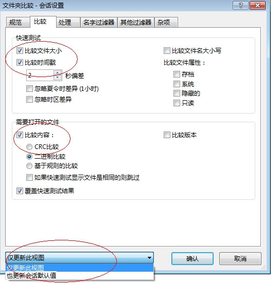
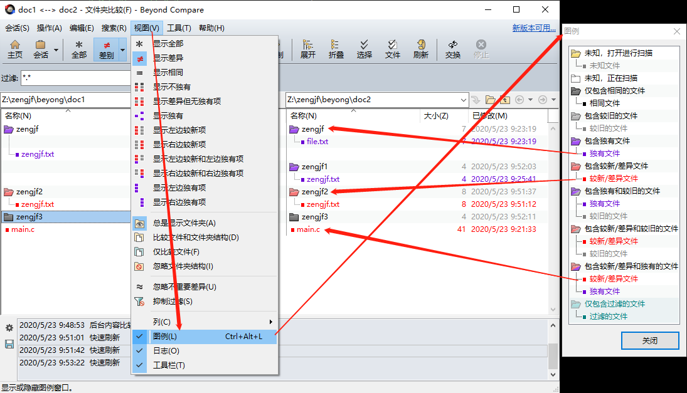
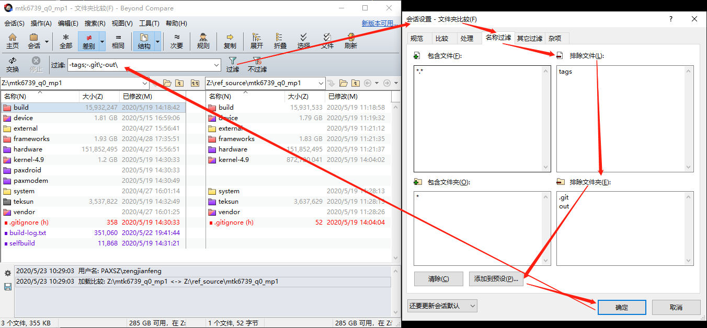
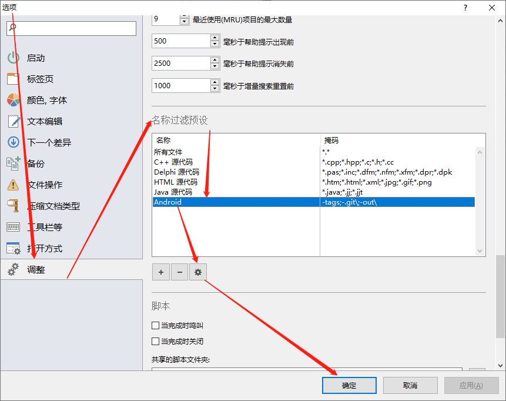
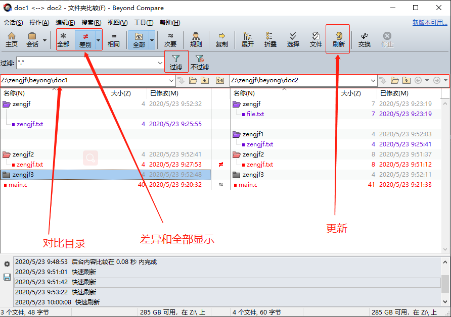
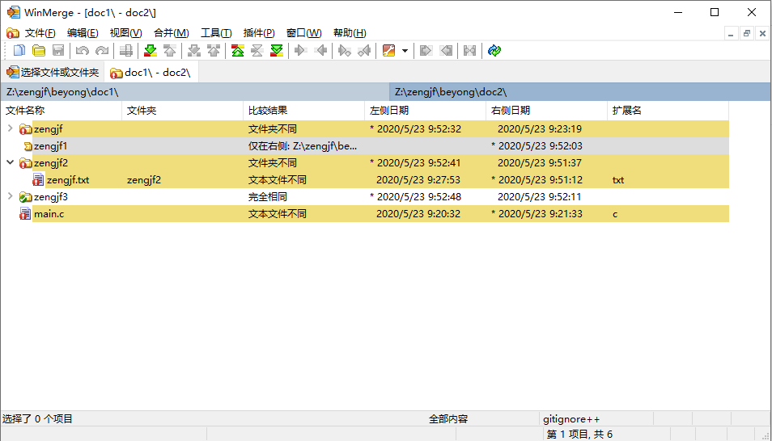

# Source Compare Tools

对比源代码工具`Beyond Compare`、`WinMerge`

* [一、源代码对比工具](#一源代码对比工具)
* [二、Beyond Compare](#二Beyond-Compare)
  * [2.1 禁用时间戳对比](#21-禁用时间戳对比)
  * [2.2 颜色说明](#22-颜色说明)
  * [2.3 过滤文件及文件夹](#23-过滤文件及文件夹)
  * [2.4 主要使用](#24-主要使用)
* [三、WinMerge](#三WinMerge)
  * [3.1 更换默认字体](#31-更换默认字体)
  * [3.2 添加过滤器](#32-添加过滤器)
  * [3.3 主要使用](#33-主要使用)

## 一、源代码对比工具

* [Beyond Compare](https://www.beyondcompare.cc/wenti/ruhe-shiyong.html)
* [WinMerge](https://winmerge.org/)
* [Meld](https://meldmerge.org/)

这里暂时只简单对比一下`Beyond Compare`和`WinMerge`基本使用，`Meld`有需要再补充

## 二、Beyond Compare

### 2.1 禁用时间戳对比

参考：[Beyond Compare对比相同文件仍显示红色怎么办](https://www.beyondcompare.cc/wenti/xianshi-hongse.html)

在使用git进行版本checkout的时候，无法保证时间的先后顺序，所以禁止掉



### 2.2 颜色说明



定制颜色参考：[介绍Beyond Compare颜色修改技巧](https://www.beyondcompare.cc/jiqiao/yanse-xiugai.html)

### 2.3 过滤文件及文件夹



`-tags;-.git\;-out\`

[工具] -> [选项] -> [调整]



### 2.4 主要使用



## 三、WinMerge

### 3.1 更换默认字体

默认字体有点难看，参考：[How to change WinMerge font size?](https://superuser.com/questions/282036/how-to-change-winmerge-font-size)

[View] -> [Select Font]

### 3.2 添加过滤器

参考：[Using Filters](https://manual.winmerge.org/en/Filters.html)

gitignore++.flt

```flt
## This is a directory/file filter for WinMerge
name: gitignore++
desc: Ignore .git and IDE-specific files and directories

## Select if filter is inclusive or exclusive
## Inclusive (loose) filter lets through all items not matching rules
## Exclusive filter lets through only items that match to rule
## include or exclude
def: include

## Filters for filenames begin with f:
## Filters for directories begin with d:
## (Inline comments begin with " ##" and extend to the end of the line)

f: \.iml$
f: \.buildpath$
f: \.classpath$
f: \.project$
f: nbactions\.xml$
f: nb-configuration\.xml$
f: tags

d: \\\.git$
d: \\\.idea$
d: \\\.settings$
d: \\nbproject$
d: \\target$
```

注意：上面文件过滤的 `\.` 表示的是 `.`，也就是文件后缀的 `.`；文件夹过滤的 `\\` 表示的是Windows目录 `\`；

### 3.3 主要使用



感觉使用上显示没有`Beyond Compare`那么明显
