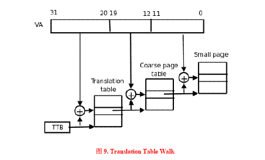
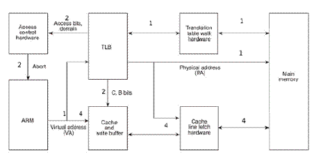
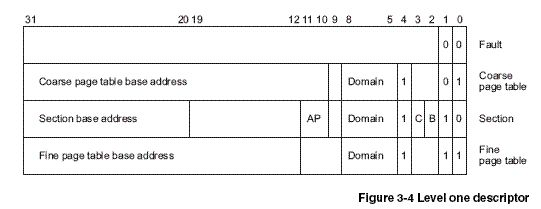
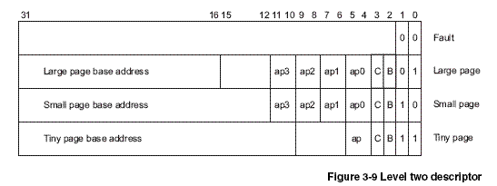
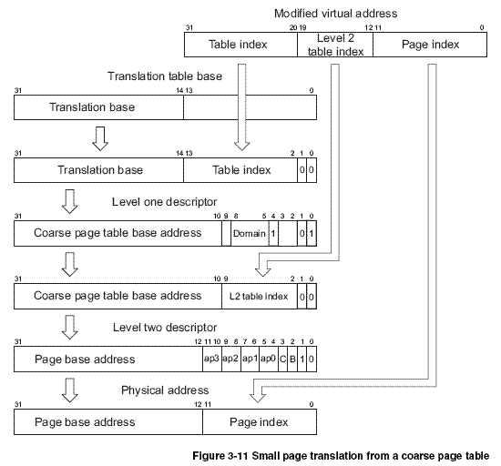

# MMU Cache VA PA

内存管理中的MMC Cache相关知识

## 参考文档

* [TLB的作用及工作原理](https://www.cnblogs.com/alantu2018/p/9000777.html)
* [MMU和cache详解（TLB机制）](https://blog.csdn.net/hit_shaoqi/article/details/75633512)
* [Linux内存管理机制](https://www.jianshu.com/p/68fa58a520ae)
* [Linux下堆栈结构分析](https://blog.lao-yuan.com/2018/05/29/Linux%E4%B8%8B%E5%A0%86%E6%A0%88%E7%BB%93%E6%9E%84%E5%88%86%E6%9E%90.html)

## MMU

MMU：memory management unit，称为内存管理单元，或者是存储器管理单元，MMU是硬件设备，它被保存在主存(main memory)的两级也表控制，并且是由协处理器CP15的寄存器1的M位来决定是enabled还是disabled。MMU的主要作用是负责从CPU内核发出的虚拟地址到物理地址的映射，并提供硬件机制的内存访问权限检查。MMU使得每个用户进程拥有自己的地址空间(对于WINCE5.0，每个进程是32MB;而对于WINCE6.0，每个进程的独占的虚拟空间是2GB)，并通过内存访问权限的检查保护每个进程所用的内存不被其他进程破坏。

## VA和PA

VA：virtual address称为虚拟地址，PA：physical address称为物理地址。CPU通过地址来访问内存中的单元，如果CPU没有MMU，或者有MMU但没有启动，那么CPU内核在取指令或者访问内存时发出的地址(此时必须是物理地址，假如是虚拟地址，那么当前的动作无效)将直接传到CPU芯片的外部地址引脚上，直接被内存芯片(物理内存)接收，这时候的地址就是物理地址。如果CPU启用了MMU(一般是在bootloader中的eboot阶段的进入main()函数的时候启用)，CPU内核发出的地址将被MMU截获，这时候从CPU到MMU的地址称为虚拟地址，而MMU将这个VA翻译成为PA发到CPU芯片的外部地址引脚上，也就是将VA映射到PA中。MMU将VA映射到PA是以页(page)为单位的，对于32位的CPU，通常一页为4k，物理内存中的一个物理页面称页为一个页框(page frame)。虚拟地址空间划分成称为页（page）的单位,而相应的物理地址空间也被进行划分，单位是页框(frame).页和页框的大小必须相同。

## VA到PA的映射过程

首先将CPU内核发送过来的32位VA[31:0]分成三段，前两段VA[31:20]和VA[19:12]作为两次查表的索引，第三段VA[11:0]作为页内的偏移，查表的步骤如下：

* 协处理器CP15的寄存器2(TTB寄存器，translation table base register)中取出保存在其中的第一级页表(translation table)的基地址，这个基地址指的是PA，也就是说页表是直接按照这个地址保存在物理内存中的。
* 以TTB中的内容为基地址，以VA[31:20]为索引值在一级页表中查找出一项(2^12=4096项)，这个页表项(也称为一个描述符，descriptor)保存着第二级页表(coarse page table)的基地址，这同样是物理地址，也就是说第二级页表也是直接按这个地址存储在物理内存中的。
* 以VA[19:12]为索引值在第二级页表中查出一项(2^8=256)，这个表项中就保存着物理页面的基地址，我们知道虚拟内存管理是以页为单位的，一个虚拟内存的页映射到一个物理内存的页框，从这里就可以得到印证，因为查表是以页为单位来查的。
* 有了物理页面的基地址之后，加上VA[11:0]这个偏移量(2^12=4KB)就可以取出相应地址上的数据了。

这个过程称为Translation Table Walk，Walk这个词用得非常形象。从TTB走到一级页表，又走到二级页表，又走到物理页面，一次寻址其实是三次访问物理内存。注意这个“走”的过程完全是硬件做的，每次CPU寻址时MMU就自动完成以上四步，不需要编写指令指示MMU去做，前提是操作系统要维护页表项的正确性，每次分配内存时填写相应的页表项，每次释放内存时清除相应的页表项，在必要的时候分配或释放整个页表。

## CPU访问内存时的硬件操作顺序

### cache

CPU访问内存时的硬件操作顺序，各步骤在图中有对应的标号：

* CPU内核(图中的ARM)发出VA请求读数据，TLB(translation lookaside buffer)接收到该地址，那为什么是TLB先接收到该地址呢？因为TLB是MMU中的一块高速缓存(也是一种cache，是CPU内核和物理内存之间的cache)，它缓存最近查找过的VA对应的页表项，如果TLB里缓存了当前VA的页表项就不必做translation table walk了，否则就去物理内存中读出页表项保存在TLB中，TLB缓存可以减少访问物理内存的次数。
* 页表项中不仅保存着物理页面的基地址，还保存着权限和是否允许cache的标志。MMU首先检查权限位，如果没有访问权限，就引发一个异常给CPU内核。然后检查是否允许cache，如果允许cache就启动cache和CPU内核互操作。
* 如果不允许cache，那直接发出PA从物理内存中读取数据到CPU内核。
* 如果允许cache，则以VA为索引到cache中查找是否缓存了要读取的数据。

### MMU的查表过程

首先从CP15的寄存器TTB找到一级页表的基地址，再把VA[31:20]作为索引值从表中找出一项，这个表项称为一级页描述符(level one descriptor)，一个这样的表项占4个字节，那么一级页表需要保存的物理内存的大小是4*4096=16KB，表项可以是一下四种格式之一：

* 如果描述符的最低位是00，属于fault格式，表示该范围的VA没有映射到PA。
* 如果描述符的最低位是10，属于section格式，这种格式没有二级页表而是直接映射到物理页面，一个色彩体哦你是1M的大页面，描述符中的VA[31:20]就是这个页面的基地址，基地址的VA[19:0]低位全为0，对齐到1M地址边界，描述符中的domain和AP位控制访问权限，C、B两位控制缓存。
* 如果描述符的最低两位是01或11，则分别对应两种不同规格的二级页表。根据地址对齐的规律想一下，这两种页表分别是多大？从一级描述符中取出二级页表的基地址，再把VA的一部分作为索引去查二级描述符(level two descriptor)，如果是coarse page，则VA[19:12](2^8=256)作为查找二级页表表项的索引；如果是fine page，则VA[19:10](2^10=024)。二级描述符可以是下面四种格式之一：

二级描述符最低两位是00是属于fault格式，其它三种情况分别对应三种不同规格的物理页面，分别是large page(64KB)、small page(4KB)和tiny page(1KB)，其中large page和small page有4组AP权限位，每组两个bit，这样可以为每1/4个物理页面分别设置不同的权限，也就是说large page可以为每16KB设置不同的权限，small page可以为每1KB设置不同的权限。

### translation table walk

* VA被划分为三段用于地址映射过程，各段的长度取决于页描述符的格式。
* TTB寄存器中只有[31:14]位有效，低14位全为0，因此一级页表的基地址对齐到16K地址边界，而一级页表的大小也是16K。
* 一级页表的基地址加上VA[31:20]左移两位组成一个物理地址。想一想为什么VA[31:20]要左移两位占据[13:2]的位置，而空出[1:0]两位呢？应该是需要空出最低两位用于表示当前要寻找的一级描述符是coarse page格式，目前不清楚，有待了解。
* 用这个组装的物理地址从物理内存中读取一级页表描述符，这是一个coarse page table格式的描述符。
* 通过domain权限检查后，coarse page table的基地址再加上VA[19:12]左移两位组装成一个物理地址。
* 用这个组装的物理地址从物理内存中读取二级页表描述符，这是一个small page格式的描述符。
* 通过AP权限检查后，small page的基地址再加上VA[11:0]就是最终的物理地址了。
