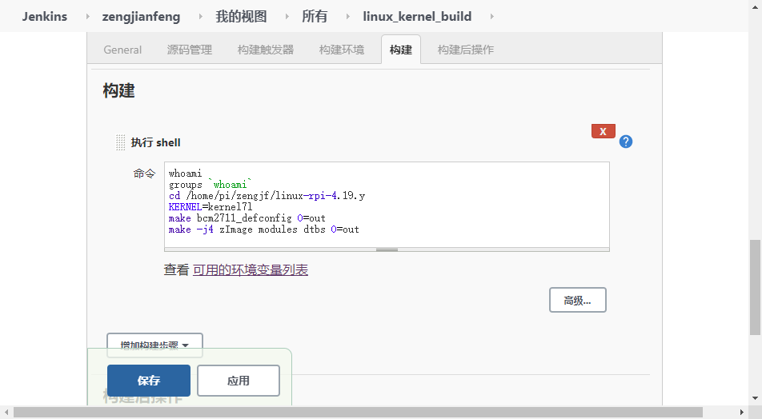
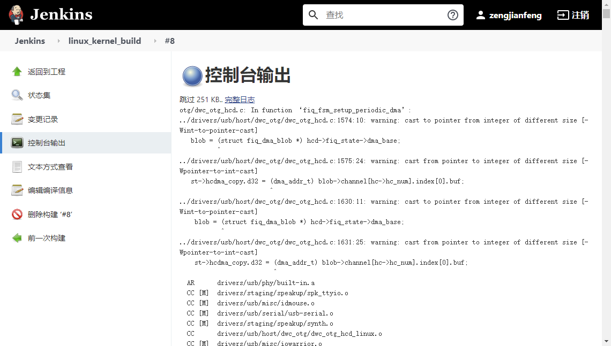

# Jenkins

用Jenkins来定时编译源代码

## 参考文档

* [Installing Jenkins on your Raspberry Pi](https://pimylifeup.com/jenkins-raspberry-pi/)

## Java

`java --version`

```
openjdk 11.0.6 2020-01-14
OpenJDK Runtime Environment (build 11.0.6+10-post-Raspbian-1deb10u1)
OpenJDK Server VM (build 11.0.6+10-post-Raspbian-1deb10u1, mixed mode)
```

## Install

* wget -q -O - https://pkg.jenkins.io/debian/jenkins.io.key | sudo apt-key add -
* sudo sh -c 'echo deb https://pkg.jenkins.io/debian binary/ > /etc/apt/sources.list.d/jenkins.list'
* sudo apt-get update
* sudo apt-get install jenkins
* hostname -I
* sudo cat /var/lib/jenkins/secrets/initialAdminPassword
  * 8dfec453d7f04b2998d02c6ce6791793
* http://192.168.137.2:8080  
  
  * 8dfec453d7f04b2998d02c6ce6791793
  * 登录之后，安装默认推荐的Plugin
  * 设置一个管理员信息
  * 进入系统界面  
    

## 配置Jenkins用户组

* sudo vim /etc/group
  ```
  pi:x:1000:jenkins
  ```
* 让jenkins和pi用户同组，然后给jenkins对linux内核文件夹有读写执行权限
* chmod 775 linux-rpi-4.19.y
* 编译之后查看out目录情况`ls -al`：
  ```
  total 864
  [...省略]
  drwxr-xr-x  70 pi      pi        4096 Jun 14 08:48 net
  drwxr-xr-x  22 jenkins jenkins   4096 Jun 14 10:24 out
  -rw-r--r--   1 pi      pi         800 May 12 01:29 README
  [...省略]
  ```
* 如果直接将out目录指定到jenkins用户的目录也是可以的；

## 构建命令



```shell
whoami
groups `whoami`
cd /home/pi/zengjf/linux-rpi-4.19.y
KERNEL=kernel7l
make bcm2711_defconfig O=out
make -j4 zImage modules dtbs O=out
```


