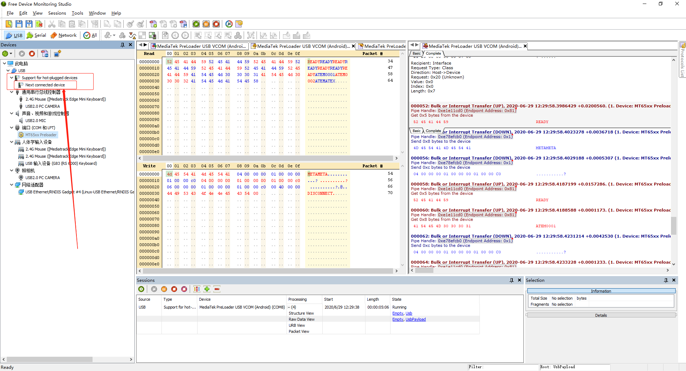

# pyusb MTK PL Mode

分析MTK PL Mode选择

* [编译测试](#编译测试)
* [MTK Preloader USB](#MTK-Preloader-USB)
* [Free USB Analyzer](#Free-USB-Analyzer)
* [meta factroy mode](#meta-factroy-mode)
* [Windows Example](#Windows-Example)

## libusb编译测试

* sudo apt-get install libusb-1.0-0-dev
* sudo apt-get install libudev-dev
* wget https://github.com/libusb/libusb/archive/master.zip
* tar xvf master.zip
* cd libusb-master
* ./autogen.sh
* make
* cd examples/
* ./testlibusb
  ```
  Dev (bus 3, device 1): 1D6B - 0002
  Dev (bus 2, device 1): 1D6B - 0003
  Dev (bus 1, device 3): 2FB8 - 2341
  Dev (bus 1, device 2): 2109 - 3431
  Dev (bus 1, device 1): 1D6B - 0002
  ```

## MTK Preloader USB

* pip3 install libusb
* pip3 install pyusb
* vendor id、product id
  ```python
  import usb.core
  import usb.util
  import time

  while True:
      dev = usb.core.find(find_all=True)

      for cfg in dev:
          # was it found?
          if cfg is None:
              print('Device not found')
          else:
              if cfg.idVendor == 0x1d6b:
                  pass
              elif cfg.idVendor == 0x2109:
                  pass
              else:
                  print("vendor id: " + str(hex(cfg.idVendor)) + ", product id:" + str(hex(cfg.idProduct)))
                  break
  ```
* vendor id: 0xe8d, product id:0x2000
* check device node
  ```python
  import usb.core
  import usb.util
  import time
  import os
  
  deviceInfo = None
  
  while True:
  
      # dev = usb.core.find(idVendor=0x2FB8)
      dev = usb.core.find(find_all=True)
  
      for cfg in dev:
          # was it found?
          if cfg is None:
              print('Device not found')
          else:
              if cfg.idVendor == 0x1d6b:
                  pass
              elif cfg.idVendor == 0x2109:
                  pass
              else:
                  deviceInfo = cfg
                  # print(deviceInfo)
                  print("vendor id: " + hex(cfg.idVendor) + ", product id:" + hex(cfg.idProduct))
  
                  print("------------------------------------------------------")
                  str = os.popen("ls /dev/tty*").read()
                  if str != None:
                      print(str)
  ```
* sudo python3 main.py | tee build.log
* /dev/ttyACM0

## Free USB Analyzer

使用如下功能进行数据捕捉，下载地址：https://freeusbanalyzer.com/  



## meta factroy mode

```python
#!/usr/bin/env python3

import usb.core
import usb.util
import time
import os
import serial
import sys

deviceInfo = None

if __name__ == '__main__':

    while True:

        # dev = usb.core.find(idVendor=0x2FB8)
        dev = usb.core.find(find_all=True)

        for cfg in dev:
            # was it found?
            if cfg is None:
                print('Device not found')
            else:
                if cfg.idVendor == 0xe8d and cfg.idProduct == 0x2000:

                    deviceInfo = cfg
                    print('Device found')
                    print("vendor id: " + hex(cfg.idVendor) + ", product id:" + hex(cfg.idProduct))
                    # time.sleep(0.1)
                    # print(deviceInfo)

                    while not os.path.exists("/dev/ttyACM0"):
                        time.sleep(0.01)

                    if os.path.exists("/dev/ttyACM0"):
                        ser=serial.Serial("/dev/ttyACM0", 921600, timeout=0.5)
                        # ser.open()
                        s = ser.read(5) # READY
                        print(s)
                        if s == b"READY":

                            if (len(sys.argv) == 1 or (len(sys.argv) == 2 and sys.argv[1] == "meta")) :

                                ser.write(b"METAMETA")
                                s = ser.read(5)     # READY
                                print(s)
                                ser.write(b"\x04\x00\x00\x00\x01\x00\x00\x00\x01\x00\x00\xC0")
                                s = ser.read(8)     # ATEM0001
                                print(s)
                                ser.write(b"\x04\x00\x00\x00\x01\x00\x00\x00\x01\x00\x00\xC0")
                                s = ser.read(8)     # ATEM0002
                                print(s)
                                s = ser.write(b"\x06\x00\x00\x00\x01\x00\x00\x00\x01\x00\x00\xC0\x00\x80\x00\x00")
                                s = ser.read(8)     # ATEMATEX
                                print(s)
                                ser.write(b"DISCONNECT\x00")

                            elif (len(sys.argv) == 2 and sys.argv[1] == "fact") :

                                ser.write(b"FACTFACT")
                                s = ser.read(5)     # READY
                                print(s)
                                ser.write(b"\x04\x00\x00\x00\x01\x00\x00\x00\x01\x00\x00\x00")
                                s = ser.read(8)     # TCAFTCAF
                                print(s)

                            else:
                                print("unsupport mode")
                        else:
                            print("Device not READY")

                        ser.close()

        if deviceInfo != None:
            break
```

## Windows Example

* [Python3学习笔记（五）：进行USB开发时遇到报错:“usb.core.NoBackendError No backend available”](https://blog.csdn.net/qq_36272641/article/details/86244596)
* Windows注意安装一下libusb：https://sourceforge.net/projects/libusb/

```Python
import serial
import sys
import serial.tools.list_ports

deviceFlag = False

if __name__ == '__main__':
    while True:

        ports = serial.tools.list_ports.comports()
        for port in ports:
            if port.vid == 0xe8d and port.pid == 0x2000:
                deviceFlag = True
                print("MTK Preloader Port: " + port.device)
                ser=serial.Serial(port.device, 921600, timeout=0.5)
                s = ser.read(5) # READY
                print(s)
                if s == b"READY":

                    if (len(sys.argv) == 1 or (len(sys.argv) == 2 and sys.argv[1] == "meta")) :

                        ser.write(b"METAMETA")
                        s = ser.read(5)     # READY
                        print(s)
                        ser.write(b"\x04\x00\x00\x00\x01\x00\x00\x00\x01\x00\x00\xC0")
                        s = ser.read(8)     # ATEM0001
                        print(s)
                        ser.write(b"\x04\x00\x00\x00\x01\x00\x00\x00\x01\x00\x00\xC0")
                        s = ser.read(8)     # ATEM0002
                        print(s)
                        s = ser.write(b"\x06\x00\x00\x00\x01\x00\x00\x00\x01\x00\x00\xC0\x00\x80\x00\x00")
                        s = ser.read(8)     # ATEMATEX
                        print(s)
                        ser.write(b"DISCONNECT\x00")

                    elif (len(sys.argv) == 2 and sys.argv[1] == "factory") :

                        ser.write(b"FACTFACT")
                        s = ser.read(5)     # READY
                        print(s)
                        ser.write(b"\x04\x00\x00\x00\x01\x00\x00\x00\x01\x00\x00\x00")
                        s = ser.read(8)     # TCAFTCAF
                        print(s)

                    else:
                        print("unsupport mode")
                else:
                    print("Device not READY")

                ser.close()

        if deviceFlag:
            break
```
