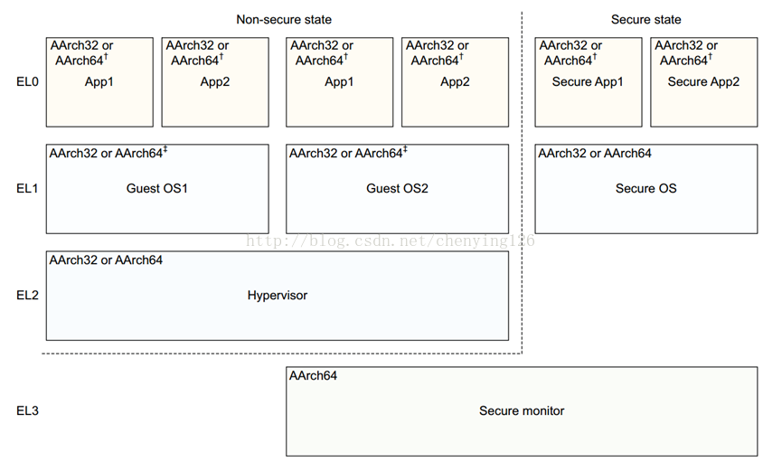
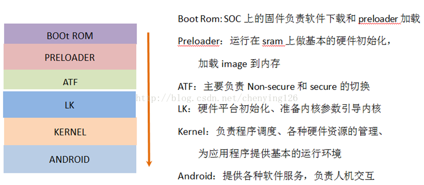
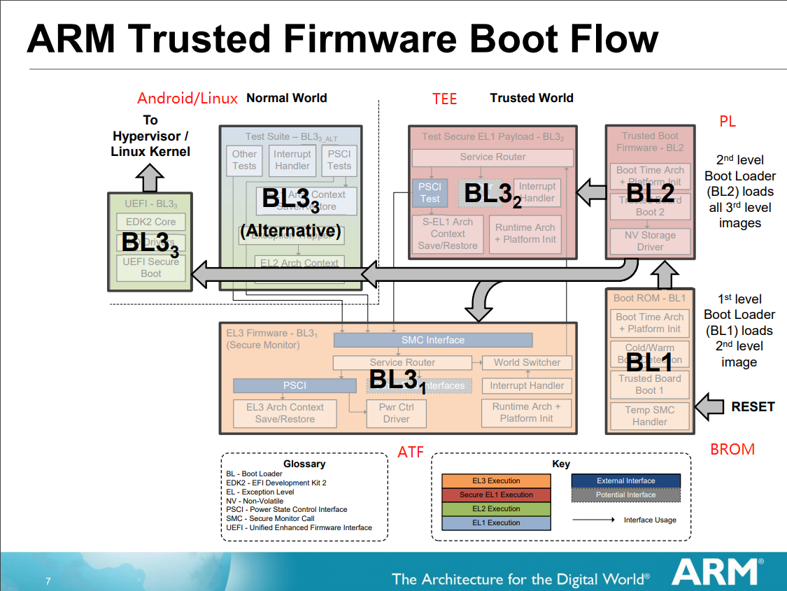

# OP-TEE

理解OP-TEE工作原理

## 参考文档

* [ATF实现原理](https://blog.csdn.net/chenying126/article/details/78638944)
* [Trusted_Firmware_Deep_Dive_v1](https://www.linaro.org/app/resources/Connect%20Events/Trusted_Firmware_Deep_Dive_v1.0_.pdf)
* [0.使用Qemu运行OP-TEE](https://blog.csdn.net/shuaifengyun/article/details/71499619)
* [Get and build the solution](https://optee.readthedocs.io/en/latest/building/gits/build.html#get-and-build-the-solution)
* [OP-TEE博客文档](https://blog.csdn.net/shuaifengyun/category_6909494_2.html)

## 阿里TEE

[物联网可信执行环境-Link TEE（Trusted Execution Environment）为物联网设备提供TEE安全框架和安全应用的全生命周期管理，提供符合Global Platform TEE标准接口的安全、可信执行环境。](https://help.aliyun.com/product/123201.html?spm=a2c4g.11174283.6.540.6a4d605ao1NhKq)

## 基本概念

### 异常等级

如下是异常等级，这里需要区分七种异常，不是同一个概念，异常处理函数里去切异常等级；



### Secure world地址

操作系统（android 和TEE）使用的地址都是虚拟地址，虚拟地址都是需要页表转换之后才能访问到实际的物理地址。转换的过程是由MMU来完成，TTBR是页表基地址。页表中包含多个enrty，每一个entry都是按照一定规则来填写的。每一个entry中包含下一级（页表或则目标page）的物理地址和描述符（table descriptor/Block descriptor/ Page descriptor）。虚拟地址转换为物理地址的过程就是MMU解析页表找到目标物理页的过程。

### ATF是什么

arm体系架构对Secure的支持。Non-secure与Secure之间的切换需要经过EL3（secure monitor），ATF（Arm Trust Firmware）就是运行在EL3上的一个monitor。

### MTK平台Android开机流程

如下是开机启动运行顺序



开机过程中preloader把atf加载到sram中，ATF在sram中的内存布局如下：


### ATF启动流程

从"开机流程"中可以看到，在进入ATF之前系统处于preloader阶段。ATF的运行需要依赖preloader提供的参数。其中有三个重要的参数：

* LK入口地址；
* TEE 入口地址；
* ATF入口地址。

在preloader的main函数中，我们只关注它做的三件事：加载lk、atf、tee等到内存；设置atf参数；跳转到atf。BL2 --> BL31 --> BL32 --> BL33



## OP-TEE Compile

* 参考：https://optee.readthedocs.io/en/latest/building/gits/build.html#get-and-build-the-solution
* Ubuntu 18.04.4 LTS 64-bit(ubuntu-18.04.4-desktop-amd64.iso)
* sudo apt-get install android-tools-adb android-tools-fastboot autoconf automake bc bison build-essential cscope curl device-tree-compiler expect flex ftp-upload gdisk iasl libattr1-dev libc6 libcap-dev libfdt-dev libftdi-dev libglib2.0-dev libhidapi-dev libncurses5-dev libpixman-1-dev libssl-dev libstdc++6 libtool libz1 make mtools netcat python-crypto python-serial python-wand unzip uuid-dev xdg-utils xterm xz-utils zlib1g-dev git 
* export REPO_URL='https://mirrors.tuna.tsinghua.edu.cn/git/git-repo/'
* curl https://storage.googleapis.com/git-repo-downloads/repo > ~/bin/repo
* chmod a+x ~/bin/repo
* echo "PATH=$PATH:~/bin:" >> ~/.bashrc
* repo init -u https://github.com/OP-TEE/manifest.git -m qemu_v8.xml -b 3.8.0
  * [error.ManifestInvalidPathError: <linkfile> invalid ~ bad component: ..](https://www.jianshu.com/p/982af7db3c84)
    * 注释掉".."出错所在行
    * make toolchains之后手动创建：`ln -s ../toolchains/aarch64/bin/aarch64-linux-gnu-gdb build/gdb`
* repo sync -j4 --no-clone-bundle
  * 注意，这里会中断多次，中断了就继续
  * cat auto.sh 
    ```bash
    #!/bin/sh
    repo sync -j4 --no-clone-bundle

    while [ $? -ne 0 ]
    do
    	repo sync -j4 --no-clone-bundle
    done
    ```
* cd build
* make -j2 toolchains
  * 貌似下载会断，所以还是自己手动下一下，注意目录位置`toochains`
  * build/toolchain.mk
    * cd ../toolchains
    * wget https://developer.arm.com/-/media/Files/downloads/gnu-a/8.3-2019.03/binrel/gcc-arm-8.3-2019.03-x86_64-arm-linux-gnueabihf.tar.xz
    * wget https://developer.arm.com/-/media/Files/downloads/gnu-a/8.3-2019.03/binrel/gcc-arm-8.3-2019.03-x86_64-aarch64-linux-gnu.tar.xz
    * mkdir -p aarch32
    * tar xf gcc-arm-8.3-2019.03-x86_64-arm-linux-gnueabihf.tar.xz -C aarch32 --strip-components=1
    * mkdir -p aarch64
    * tar xf gcc-arm-8.3-2019.03-x86_64-aarch64-linux-gnu.tar.xz -C aarch64 --strip-components=1
    * cd ../build
* `make -f qemu_v8.mk all 2>&1 | tee build.log`
  * 貌似在编译buildroot的时候会报错，用root权限：`sudo make -f qemu_v8.mk all 2>&1 | tee build.log`
  * [buildroot交叉编出错You seem to have the current working directory in your LD_LIBRARY_PATH environment](https://blog.csdn.net/Homewm/article/details/86583330)
  * 发现Linux目录是空的，暂时不知道为什么不自动checkout：`cd ../linux && git checkout 9823b258b332b4ac98e05fa23448bbc9e937b24c && cd ../build`
* `sudo make -f qemu_v8.mk run-only`启动之后输入c，会打开两个终端：
  ```
  ln -sf /home/zengjf/zengjf/optee-project/build/../out-br/images/rootfs.cpio.gz /home/zengjf/zengjf/optee-project/build/../out/bin/
  
  * QEMU is now waiting to start the execution
  * Start execution with either a 'c' followed by <enter> in the QEMU console or
  * attach a debugger and continue from there.
  *
  * To run OP-TEE tests, use the xtest command in the 'Normal World' terminal
  * Enter 'xtest -h' for help.
  
  cd /home/zengjf/zengjf/optee-project/build/../out/bin && /home/zengjf/zengjf/optee-project/build/../qemu/aarch64-softmmu/qemu-system-aarch64 \
  	-nographic \
  	-serial tcp:localhost:54320 -serial tcp:localhost:54321 \
  	-smp 2 \
  	-s -S -machine virt,secure=on -cpu cortex-a57 \
  	-d unimp -semihosting-config enable,target=native \
  	-m 1057 \
  	-bios bl1.bin \
  	-initrd rootfs.cpio.gz \
  	-kernel Image -no-acpi \
  	-append 'console=ttyAMA0,38400 keep_bootcon root=/dev/vda2' \
  	-object rng-random,filename=/dev/urandom,id=rng0 -device virtio-rng-pci,rng=rng0,max-bytes=1024,period=1000 -netdev user,id=vmnic -device virtio-net-device,netdev=vmnic
  QEMU 3.0.93 monitor - type 'help' for more information
  (qemu) c
  (qemu) 
  ```
  * 终端1
    ```
    listening on port 54321
    soc_term: accepted fd 4
    soc_term: read fd EOF
    soc_term: accepted fd 4
    soc_term: read fd EOF
    soc_term: accepted fd 4
    soc_term: read fd EOF
    soc_term: accepted fd 4
    soc_term: read fd EOF
    soc_term: accepted fd 4
    soc_term: read fd EOF
    soc_term: accepted fd 4
    D/TC:0 0 get_aslr_seed:1300 Cannot find valid kaslr-seed
    D/TC:0 0 add_phys_mem:581 TEE_SHMEM_START type NSEC_SHM 0x42000000 size 0x00200000
    D/TC:0 0 add_phys_mem:581 TA_RAM_START type TA_RAM 0x0e300000 size 0x00d00000
    D/TC:0 0 add_phys_mem:581 VCORE_UNPG_RW_PA type TEE_RAM_RW 0x0e15d000 size 0x001a3000
    D/TC:0 0 add_phys_mem:581 VCORE_UNPG_RX_PA type TEE_RAM_RX 0x0e100000 size 0x0005d000
    D/TC:0 0 add_phys_mem:581 ROUNDDOWN(0x09040000, CORE_MMU_PGDIR_SIZE) type IO_SEC 0x09000000 size 0x00200000
    D/TC:0 0 verify_special_mem_areas:519 No NSEC DDR memory area defined
    D/TC:0 0 add_va_space:620 type RES_VASPACE size 0x00a00000
    D/TC:0 0 add_va_space:620 type SHM_VASPACE size 0x02000000
    D/TC:0 0 dump_mmap_table:732 type TEE_RAM_RX   va 0x0e100000..0x0e15cfff pa 0x0e100000..0x0e15cfff size 0x0005d000 (smallpg)
    D/TC:0 0 dump_mmap_table:732 type TEE_RAM_RW   va 0x0e15d000..0x0e2fffff pa 0x0e15d000..0x0e2fffff size 0x001a3000 (smallpg)
    D/TC:0 0 dump_mmap_table:732 type TA_RAM       va 0x0e300000..0x0effffff pa 0x0e300000..0x0effffff size 0x00d00000 (smallpg)
    D/TC:0 0 dump_mmap_table:732 type RES_VASPACE  va 0x0f000000..0x0f9fffff pa 0x00000000..0x009fffff size 0x00a00000 (pgdir)
    D/TC:0 0 dump_mmap_table:732 type SHM_VASPACE  va 0x0fa00000..0x119fffff pa 0x00000000..0x01ffffff size 0x02000000 (pgdir)
    D/TC:0 0 dump_mmap_table:732 type IO_SEC       va 0x11a00000..0x11bfffff pa 0x09000000..0x091fffff size 0x00200000 (pgdir)
    D/TC:0 0 dump_mmap_table:732 type NSEC_SHM     va 0x11c00000..0x11dfffff pa 0x42000000..0x421fffff size 0x00200000 (pgdir)
    D/TC:0 0 core_mmu_entry_to_finer_grained:763 xlat tables used 1 / 7
    D/TC:0 0 core_mmu_entry_to_finer_grained:763 xlat tables used 2 / 7
    D/TC:0 0 core_mmu_entry_to_finer_grained:763 xlat tables used 3 / 7
    I/TC: 
    D/TC:0 0 init_canaries:164 #Stack canaries for stack_tmp[0] with top at 0xe191ab8
    D/TC:0 0 init_canaries:164 watch *0xe191abc
    D/TC:0 0 init_canaries:164 #Stack canaries for stack_tmp[1] with top at 0xe1922f8
    D/TC:0 0 init_canaries:164 watch *0xe1922fc
    D/TC:0 0 init_canaries:164 #Stack canaries for stack_tmp[2] with top at 0xe192b38
    D/TC:0 0 init_canaries:164 watch *0xe192b3c
    D/TC:0 0 init_canaries:164 #Stack canaries for stack_tmp[3] with top at 0xe193378
    D/TC:0 0 init_canaries:164 watch *0xe19337c
    D/TC:0 0 init_canaries:165 #Stack canaries for stack_abt[0] with top at 0xe18ad38
    D/TC:0 0 init_canaries:165 watch *0xe18ad3c
    D/TC:0 0 init_canaries:165 #Stack canaries for stack_abt[1] with top at 0xe18b978
    D/TC:0 0 init_canaries:165 watch *0xe18b97c
    D/TC:0 0 init_canaries:165 #Stack canaries for stack_abt[2] with top at 0xe18c5b8
    D/TC:0 0 init_canaries:165 watch *0xe18c5bc
    D/TC:0 0 init_canaries:165 #Stack canaries for stack_abt[3] with top at 0xe18d1f8
    D/TC:0 0 init_canaries:165 watch *0xe18d1fc
    D/TC:0 0 init_canaries:167 #Stack canaries for stack_thread[0] with top at 0xe18f238
    D/TC:0 0 init_canaries:167 watch *0xe18f23c
    D/TC:0 0 init_canaries:167 #Stack canaries for stack_thread[1] with top at 0xe191278
    D/TC:0 0 init_canaries:167 watch *0xe19127c
    D/TC:0 0 select_vector:956 SMCCC_ARCH_WORKAROUND_1 (0x80008000) available
    D/TC:0 0 select_vector:957 SMC Workaround for CVE-2017-5715 used
    I/TC: Non-secure external DT found
    I/TC: Switching console to device: /pl011@9040000
    I/TC: OP-TEE version: 3.8.0 (gcc version 8.3.0 (GNU Toolchain for the A-profile Architecture 8.3-2019.03 (arm-rel-8.36))) #1 2020年 07月 17日 星期五 15:56:31 UTC aarch64
    D/TC:0 0 init_primary_helper:1169 Executing at offset 0 with virtual load address 0xe100000
    D/TC:0 0 check_ta_store:636 TA store: "Secure Storage TA"
    D/TC:0 0 check_ta_store:636 TA store: "REE"
    D/TC:0 0 mobj_mapped_shm_init:450 Shared memory address range: fa00000, 11a00000
    I/TC: Initialized
    D/TC:0 0 init_primary_helper:1182 Primary CPU switching to normal world boot
    D/TC:1   generic_boot_cpu_on_handler:1221 cpu 1: a0 0x0
    D/TC:1   select_vector:956 SMCCC_ARCH_WORKAROUND_1 (0x80008000) available
    D/TC:1   select_vector:957 SMC Workaround for CVE-2017-5715 used
    D/TC:1   init_secondary_helper:1206 Secondary CPU Switching to normal world boot
    D/TC:0   tee_entry_exchange_capabilities:101 Dynamic shared memory is enabled
    D/TC:0 0 core_mmu_entry_to_finer_grained:763 xlat tables used 4 / 7
    D/TC:? 0 tee_ta_init_pseudo_ta_session:280 Lookup pseudo TA 7011a688-ddde-4053-a5a9-7b3c4ddf13b8
    D/TC:? 0 tee_ta_init_pseudo_ta_session:293 Open device.pta
    D/TC:? 0 tee_ta_init_pseudo_ta_session:307 device.pta : 7011a688-ddde-4053-a5a9-7b3c4ddf13b8
    D/TC:? 0 tee_ta_close_session:499 csess 0xe1799e0 id 1
    D/TC:? 0 tee_ta_close_session:518 Destroy session
    ```
    * 该终端中只能看输出信息，不能输入，也就是看log信息的；
  * 终端2
    ```
    soc_term: accepted fd 4
    soc_term: read fd EOF
    soc_term: accepted fd 4
    soc_term: read fd EOF
    soc_term: accepted fd 4
    NOTICE:  Booting Trusted Firmware
    NOTICE:  BL1: v2.0(release):v2.0-507-g34efb683e
    NOTICE:  BL1: Built : 23:58:18, Jul 17 2020
    WARNING: Firmware Image Package header check failed.
    NOTICE:  BL1: Booting BL2
    NOTICE:  BL2: v2.0(release):v2.0-507-g34efb683e
    NOTICE:  BL2: Built : 23:58:19, Jul 17 2020
    WARNING: Firmware Image Package header check failed.
    WARNING: Firmware Image Package header check failed.
    WARNING: Firmware Image Package header check failed.
    WARNING: Firmware Image Package header check failed.
    NOTICE:  BL1: Booting BL31
    NOTICE:  BL31: v2.0(release):v2.0-507-g34efb683e
    NOTICE:  BL31: Built : 23:58:22, Jul 17 2020
    UEFI firmware (version  built at 23:57:59 on Jul 17 2020)

    [=3h

    [...省略]

    EFI stub: Booting Linux Kernel...
    EFI stub: Using DTB from configuration table
    EFI stub: Exiting boot services and installing virtual address map...
    [    0.000000] Booting Linux on physical CPU 0x0000000000 [0x411fd070]
    [    0.000000] Linux version 5.1.0-00022-g9823b258b332 (root@zengjf) (gcc version 8.3.0 (GNU Toolchain for the A-profile Architecture 8.3-2019.03 (arm-rel-8.36))) #1 SMP PREEMPT Sat Jul 18 07:51:52 CST 2020
    [    0.000000] Machine model: linux,dummy-virt
    [    0.000000] printk: debug: skip boot console de-registration.
    [    0.000000] efi: Getting EFI parameters from FDT:
    [    0.000000] efi: EFI v2.70 by EDK II
    [    0.000000] efi:  SMBIOS=0x81610000  SMBIOS 3.0=0x815f0000  MEMATTR=0x80698018  RNG=0x816cd318  MEMRESERVE=0x7e233018 
    [    0.000000] efi: seeding entropy pool
    [    0.000000] cma: Reserved 32 MiB at 0x000000007bc00000
    [    0.000000] NUMA: No NUMA configuration found
    [    0.000000] NUMA: Faking a node at [mem 0x0000000040000000-0x00000000820fffff]
    [    0.000000] NUMA: NODE_DATA [mem 0x81ee1840-0x81ee2fff]
    [    0.000000] Zone ranges:
    [    0.000000]   DMA32    [mem 0x0000000040000000-0x00000000820fffff]
    [    0.000000]   Normal   empty
    [    0.000000] Movable zone start for each node
    [    0.000000] Early memory node ranges
    [    0.000000]   node   0: [mem 0x0000000040000000-0x0000000041ffffff]
    [    0.000000]   node   0: [mem 0x0000000042200000-0x000000007df2ffff]
    [    0.000000]   node   0: [mem 0x000000007df30000-0x000000007e22ffff]
    [    0.000000]   node   0: [mem 0x000000007e230000-0x000000008150ffff]
    [    0.000000]   node   0: [mem 0x0000000081510000-0x000000008159ffff]
    [    0.000000]   node   0: [mem 0x00000000815a0000-0x00000000815bffff]
    [    0.000000]   node   0: [mem 0x00000000815c0000-0x00000000816cffff]
    [    0.000000]   node   0: [mem 0x00000000816d0000-0x00000000820fffff]
    [    0.000000] Zeroed struct page in unavailable ranges: 416 pages
    [    0.000000] Initmem setup node 0 [mem 0x0000000040000000-0x00000000820fffff]
    [    0.000000] psci: probing for conduit method from DT.
    [    0.000000] psci: PSCIv1.1 detected in firmware.
    [    0.000000] psci: Using standard PSCI v0.2 function IDs
    [    0.000000] psci: Trusted OS migration not required
    [    0.000000] psci: SMC Calling Convention v1.1
    [    0.000000] random: get_random_bytes called from start_kernel+0x9c/0x460 with crng_init=0
    [    0.000000] percpu: Embedded 23 pages/cpu s56664 r8192 d29352 u94208
    [    0.000000] Detected PIPT I-cache on CPU0
    [    0.000000] CPU features: detected: ARM erratum 832075
    [    0.000000] CPU features: detected: ARM erratum 834220
    [    0.000000] CPU features: detected: EL2 vector hardening
    [    0.000000] Speculative Store Bypass Disable mitigation not required
    [    0.000000] Built 1 zonelists, mobility grouping on.  Total pages: 265852
    [    0.000000] Policy zone: DMA32
    [    0.000000] Kernel command line: console=ttyAMA0,38400 keep_bootcon root=/dev/vda2 initrd=initrd
    [    0.000000] Memory: 981944K/1080320K available (11068K kernel code, 1710K rwdata, 5576K rodata, 1408K init, 444K bss, 65608K reserved, 32768K cma-reserved)
    [    0.000000] SLUB: HWalign=64, Order=0-3, MinObjects=0, CPUs=2, Nodes=1
    [    0.000000] rcu: Preemptible hierarchical RCU implementation.
    [    0.000000] rcu:     RCU restricting CPUs from NR_CPUS=256 to nr_cpu_ids=2.
    [    0.000000]  Tasks RCU enabled.
    [    0.000000] rcu: RCU calculated value of scheduler-enlistment delay is 25 jiffies.
    [    0.000000] rcu: Adjusting geometry for rcu_fanout_leaf=16, nr_cpu_ids=2
    [    0.000000] NR_IRQS: 64, nr_irqs: 64, preallocated irqs: 0
    [    0.000000] GICv2m: range[mem 0x08020000-0x08020fff], SPI[80:143]
    [    0.000000] arch_timer: cp15 timer(s) running at 62.50MHz (virt).
    [    0.000000] clocksource: arch_sys_counter: mask: 0xffffffffffffff max_cycles: 0x1cd42e208c, max_idle_ns: 881590405314 ns
    [    0.000066] sched_clock: 56 bits at 62MHz, resolution 16ns, wraps every 4398046511096ns
    [    0.002615] Console: colour dummy device 80x25
    [    0.006545] Calibrating delay loop (skipped), value calculated using timer frequency.. 125.00 BogoMIPS (lpj=250000)
    [    0.006695] pid_max: default: 32768 minimum: 301
    [    0.007898] LSM: Security Framework initializing
    [    0.110765] Dentry cache hash table entries: 262144 (order: 9, 2097152 bytes)
    [    0.111949] Inode-cache hash table entries: 131072 (order: 8, 1048576 bytes)
    [    0.112255] Mount-cache hash table entries: 4096 (order: 3, 32768 bytes)
    [    0.112336] Mountpoint-cache hash table entries: 4096 (order: 3, 32768 bytes)
    [    0.122173] *** VALIDATE proc ***
    [    0.126664] *** VALIDATE cgroup1 ***
    [    0.126725] *** VALIDATE cgroup2 ***
    [    0.164461] ASID allocator initialised with 32768 entries
    [    0.174093] rcu: Hierarchical SRCU implementation.
    [    0.187776] Remapping and enabling EFI services.
    [    0.209734] smp: Bringing up secondary CPUs ...
    [    0.250709] Detected PIPT I-cache on CPU1
    [    0.251218] CPU1: Booted secondary processor 0x0000000001 [0x411fd070]
    [    0.253574] smp: Brought up 1 node, 2 CPUs
    [    0.253618] SMP: Total of 2 processors activated.
    [    0.253659] CPU features: detected: 32-bit EL0 Support
    [    0.253758] CPU features: detected: CRC32 instructions
    [    0.258864] CPU: All CPU(s) started at EL1
    [    0.259075] alternatives: patching kernel code
    [    0.276849] devtmpfs: initialized
    [    0.289281] clocksource: jiffies: mask: 0xffffffff max_cycles: 0xffffffff, max_idle_ns: 7645041785100000 ns
    [    0.289529] futex hash table entries: 512 (order: 3, 32768 bytes)
    [    0.294588] pinctrl core: initialized pinctrl subsystem
    [    0.315660] SMBIOS 3.0.0 present.
    [    0.315785] DMI: QEMU QEMU Virtual Machine, BIOS 0.0.0 02/06/2015
    [    0.322199] NET: Registered protocol family 16
    [    0.324300] audit: initializing netlink subsys (disabled)
    [    0.327053] audit: type=2000 audit(0.260:1): state=initialized audit_enabled=0 res=1
    [    0.334609] cpuidle: using governor menu
    [    0.336247] vdso: 2 pages (1 code @ (____ptrval____), 1 data @ (____ptrval____))
    [    0.336338] hw-breakpoint: found 6 breakpoint and 4 watchpoint registers.
    [    0.341599] DMA: preallocated 256 KiB pool for atomic allocations
    [    0.348876] Serial: AMBA PL011 UART driver
    [    0.394560] 9000000.pl011: ttyAMA0 at MMIO 0x9000000 (irq = 38, base_baud = 0) is a PL011 rev1
    [    0.414405] printk: console [ttyAMA0] enabled
    [    0.578184] HugeTLB registered 1.00 GiB page size, pre-allocated 0 pages
    [    0.578692] HugeTLB registered 32.0 MiB page size, pre-allocated 0 pages
    [    0.578838] HugeTLB registered 2.00 MiB page size, pre-allocated 0 pages
    [    0.578987] HugeTLB registered 64.0 KiB page size, pre-allocated 0 pages
    [    0.583371] cryptd: max_cpu_qlen set to 1000
    [    0.591377] ACPI: Interpreter disabled.
    [    0.599124] vgaarb: loaded
    [    0.600483] SCSI subsystem initialized
    [    0.604302] usbcore: registered new interface driver usbfs
    [    0.604712] usbcore: registered new interface driver hub
    [    0.605099] usbcore: registered new device driver usb
    [    0.612325] pps_core: LinuxPPS API ver. 1 registered
    [    0.612482] pps_core: Software ver. 5.3.6 - Copyright 2005-2007 Rodolfo Giometti <giometti@linux.it>
    [    0.613273] PTP clock support registered
    [    0.613924] EDAC MC: Ver: 3.0.0
    [    0.617967] Registered efivars operations
    [    0.629575] Advanced Linux Sound Architecture Driver Initialized.
    [    0.637782] clocksource: Switched to clocksource arch_sys_counter
    [    0.642218] VFS: Disk quotas dquot_6.6.0
    [    0.643474] VFS: Dquot-cache hash table entries: 512 (order 0, 4096 bytes)
    [    0.644020] *** VALIDATE hugetlbfs ***
    [    0.645204] pnp: PnP ACPI: disabled
    [    0.693724] NET: Registered protocol family 2
    [    0.700411] tcp_listen_portaddr_hash hash table entries: 1024 (order: 2, 16384 bytes)
    [    0.702979] TCP established hash table entries: 16384 (order: 5, 131072 bytes)
    [    0.703966] TCP bind hash table entries: 16384 (order: 6, 262144 bytes)
    [    0.704529] TCP: Hash tables configured (established 16384 bind 16384)
    [    0.706468] UDP hash table entries: 1024 (order: 3, 32768 bytes)
    [    0.706800] UDP-Lite hash table entries: 1024 (order: 3, 32768 bytes)
    [    0.708056] NET: Registered protocol family 1
    [    0.715969] RPC: Registered named UNIX socket transport module.
    [    0.716161] RPC: Registered udp transport module.
    [    0.716244] RPC: Registered tcp transport module.
    [    0.716314] RPC: Registered tcp NFSv4.1 backchannel transport module.
    [    0.718869] Unpacking initramfs...
    [    1.012920] Freeing initrd memory: 5428K
    [    1.016192] hw perfevents: enabled with armv8_pmuv3 PMU driver, 1 counters available
    [    1.016761] kvm [1]: HYP mode not available
    [    1.654613] Initialise system trusted keyrings
    [    1.655976] workingset: timestamp_bits=44 max_order=18 bucket_order=0
    [    1.692605] squashfs: version 4.0 (2009/01/31) Phillip Lougher
    [    1.697270] NFS: Registering the id_resolver key type
    [    1.697689] Key type id_resolver registered
    [    1.697831] Key type id_legacy registered
    [    1.698687] nfs4filelayout_init: NFSv4 File Layout Driver Registering...
    [    1.702217] 9p: Installing v9fs 9p2000 file system support
    [    2.185283] Key type asymmetric registered
    [    2.185573] Asymmetric key parser 'x509' registered
    [    2.186381] Block layer SCSI generic (bsg) driver version 0.4 loaded (major 245)
    [    2.186847] io scheduler mq-deadline registered
    [    2.187042] io scheduler kyber registered
    [    2.221603] pl061_gpio 9030000.pl061: PL061 GPIO chip @0x0000000009030000 registered
    [    2.228710] pci-host-generic 4010000000.pcie: host bridge /pcie@10000000 ranges:
    [    2.229401] pci-host-generic 4010000000.pcie:    IO 0x3eff0000..0x3effffff -> 0x00000000
    [    2.230214] pci-host-generic 4010000000.pcie:   MEM 0x10000000..0x3efeffff -> 0x10000000
    [    2.230514] pci-host-generic 4010000000.pcie:   MEM 0x8000000000..0xffffffffff -> 0x8000000000
    [    2.231291] pci-host-generic 4010000000.pcie: ECAM at [mem 0x4010000000-0x401fffffff] for [bus 00-ff]
    [    2.232417] pci-host-generic 4010000000.pcie: PCI host bridge to bus 0000:00
    [    2.232820] pci_bus 0000:00: root bus resource [bus 00-ff]
    [    2.233003] pci_bus 0000:00: root bus resource [io  0x0000-0xffff]
    [    2.233288] pci_bus 0000:00: root bus resource [mem 0x10000000-0x3efeffff]
    [    2.233493] pci_bus 0000:00: root bus resource [mem 0x8000000000-0xffffffffff]
    [    2.244247] pci 0000:00:01.0: BAR 4: assigned [mem 0x8000000000-0x8000003fff 64bit pref]
    [    2.244931] pci 0000:00:01.0: BAR 0: assigned [io  0x1000-0x101f]
    [    2.257509] EINJ: ACPI disabled.
    [    2.297504] virtio-pci 0000:00:01.0: enabling device (0005 -> 0007)
    [    2.324023] Serial: 8250/16550 driver, 4 ports, IRQ sharing enabled
    [    2.333172] SuperH (H)SCI(F) driver initialized
    [    2.335922] msm_serial: driver initialized
    [    2.346298] random: fast init done
    [    2.350431] random: crng init done
    [    2.352994] cacheinfo: Unable to detect cache hierarchy for CPU 0
    [    2.381233] loop: module loaded
    [    2.400201] libphy: Fixed MDIO Bus: probed
    [    2.401427] tun: Universal TUN/TAP device driver, 1.6
    [    2.413181] thunder_xcv, ver 1.0
    [    2.413707] thunder_bgx, ver 1.0
    [    2.414416] nicpf, ver 1.0
    [    2.418242] hclge is initializing
    [    2.419619] hns3: Hisilicon Ethernet Network Driver for Hip08 Family - version
    [    2.419858] hns3: Copyright (c) 2017 Huawei Corporation.
    [    2.420403] e1000e: Intel(R) PRO/1000 Network Driver - 3.2.6-k
    [    2.420690] e1000e: Copyright(c) 1999 - 2015 Intel Corporation.
    [    2.421198] igb: Intel(R) Gigabit Ethernet Network Driver - version 5.6.0-k
    [    2.421461] igb: Copyright (c) 2007-2014 Intel Corporation.
    [    2.422020] igbvf: Intel(R) Gigabit Virtual Function Network Driver - version 2.4.0-k
    [    2.422237] igbvf: Copyright (c) 2009 - 2012 Intel Corporation.
    [    2.423715] sky2: driver version 1.30
    [    2.427569] VFIO - User Level meta-driver version: 0.3
    [    2.433555] ehci_hcd: USB 2.0 'Enhanced' Host Controller (EHCI) Driver
    [    2.433916] ehci-pci: EHCI PCI platform driver
    [    2.435364] ehci-platform: EHCI generic platform driver
    [    2.436191] ehci-orion: EHCI orion driver
    [    2.436948] ehci-exynos: EHCI EXYNOS driver
    [    2.437641] ohci_hcd: USB 1.1 'Open' Host Controller (OHCI) Driver
    [    2.437970] ohci-pci: OHCI PCI platform driver
    [    2.439502] ohci-platform: OHCI generic platform driver
    [    2.440110] ohci-exynos: OHCI EXYNOS driver
    [    2.442056] usbcore: registered new interface driver usb-storage
    [    2.457089] rtc-efi rtc-efi: registered as rtc0
    [    2.459863] i2c /dev entries driver
    [    2.489798] sdhci: Secure Digital Host Controller Interface driver
    [    2.490666] sdhci: Copyright(c) Pierre Ossman
    [    2.495120] Synopsys Designware Multimedia Card Interface Driver
    [    2.500062] sdhci-pltfm: SDHCI platform and OF driver helper
    [    2.506020] ledtrig-cpu: registered to indicate activity on CPUs
    [    2.511955] usbcore: registered new interface driver usbhid
    [    2.512191] usbhid: USB HID core driver
    [    2.524658] optee: probing for conduit method from DT.
    [    2.525805] optee: revision 3.8 (023e3365)
    [    2.533018] optee: dynamic shared memory is enabled
    [    2.547646] optee: initialized driver
    [    2.553613] NET: Registered protocol family 17
    [    2.555142] 9pnet: Installing 9P2000 support
    [    2.555591] Key type dns_resolver registered
    [    2.562624] registered taskstats version 1
    [    2.562891] Loading compiled-in X.509 certificates
    [    2.571324] input: gpio-keys as /devices/platform/gpio-keys/input/input0
    [    2.574679] rtc-efi rtc-efi: setting system clock to 2020-07-18T00:58:45 UTC (1595033925)
    [    2.575963] ALSA device list:
    [    2.576105]   No soundcards found.
    [    2.578614] uart-pl011 9000000.pl011: no DMA platform data
    [    2.819749] Freeing unused kernel memory: 1408K
    [    2.820870] Run /init as init process
    Starting syslogd: OK
    Starting klogd: OK
    Initializing random number generator... done.
    Set permissions on /dev/tee*: OK
    Set permissions on /dev/ion: OK
    Create/set permissions on /data/tee: OK
    Starting tee-supplicant: OK
    Starting network: OK
    Starting network (udhcpc): OK
    
    Welcome to Buildroot, type root or test to login
    buildroot login: 
    ```
    * 输入root登陆buildroot，直接执行`xtest`，可以看到两边有数据通信
      ```
      regression_8001 OK
      regression_8002 OK
      regression_8101 OK
      regression_8102 OK
      regression_8103 OK
      regression_2001 OK
      regression_2002 OK
      regression_2003 OK
      regression_2004 OK
      +-----------------------------------------------------
      24537 subtests of which 0 failed
      96 test cases of which 0 failed
      0 test cases were skipped
      TEE test application done!
      ```
    * 如上可以看到BL1到BL3的log都能看到，也就是可以在这个基础上进行ARM64系统启动运行原理

## 目录结构说明

* Linux: Linux内核代码，在deriver/tee目录下存放的是OP-TEE在REE侧的驱动，任何在Linux用户空间调用CA的接口都会经过OP-TEE的REE侧驱动处理之后再转发到TEE侧。
* optee_benchmark: OP-TEE运行的性能测试工具，只保存CA端的代码，TA部分的代码保存在OP-TEE OS中，作为静态TA集成到OP-TEE OS中；
* optee_client: 包含了CA程序调用的userspace层面的接口库的源代码。其中tee_supplicant目录中的代码会被编译成一个Binary，该binary主要的作用是，当调用CA接口，需要加载TA image时，TEE OS通过该binary从文件系统中来获取TA image，并传递給TEE OS，然后再讲TA image运行到TEE OS中。
* optee_os: 存放OP-TEE OS的源代码和相关文档
* optee_test: opentee的测试程序xtest的源代码，主要用来测试TEE中提供的各种算法逻辑和提供的其他功能
* qemu: qemu源代码
* trusted-firmware-a: 芯片启动加载代码

## Hello World

### 文件系统中的CA和TA

* 运行：optee_example_hello_world
  * TA log
    ```
    D/TC:? 0 tee_ta_init_pseudo_ta_session:280 Lookup pseudo TA 8aaaf200-2450-11e4-abe2-0002a5d5c51b
    D/TC:? 0 load_ldelf:704 ldelf load address 0x40006000
    D/LD:  ldelf:134 Loading TA 8aaaf200-2450-11e4-abe2-0002a5d5c51b
    D/TC:? 0 tee_ta_init_session_with_context:573 Re-open TA 3a2f8978-5dc0-11e8-9c2d-fa7ae01bbebc
    D/TC:? 0 system_open_ta_binary:250 Lookup user TA ELF 8aaaf200-2450-11e4-abe2-0002a5d5c51b (Secure Storage TA)
    D/TC:? 0 system_open_ta_binary:253 res=0xffff0008
    D/TC:? 0 system_open_ta_binary:250 Lookup user TA ELF 8aaaf200-2450-11e4-abe2-0002a5d5c51b (REE)
    D/TC:? 0 system_open_ta_binary:253 res=0x0
    D/LD:  ldelf:169 ELF (8aaaf200-2450-11e4-abe2-0002a5d5c51b) at 0x4005e000
    D/TC:? 0 tee_ta_close_session:499 csess 0xe178320 id 1
    D/TC:? 0 tee_ta_close_session:518 Destroy session
    D/TC:? 0 tee_ta_close_session:499 csess 0xe178b20 id 1
    D/TC:? 0 tee_ta_close_session:518 Destroy session
    D/TC:? 0 destroy_context:298 Destroy TA ctx (0xe178ac0)
    ```
  * CA log
    ```
    Invoking TA to increment 42
    TA incremented value to 43
    ```
* find / -iname *.ta
  ```
  /lib/optee_armtz/873bcd08-c2c3-11e6-a937-d0bf9c45c61c.ta
  /lib/optee_armtz/b689f2a7-8adf-477a-9f99-32e90c0ad0a2.ta
  /lib/optee_armtz/b6c53aba-9669-4668-a7f2-205629d00f86.ta
  /lib/optee_armtz/5b9e0e40-2636-11e1-ad9e-0002a5d5c51b.ta
  /lib/optee_armtz/731e279e-aafb-4575-a771-38caa6f0cca6.ta
  /lib/optee_armtz/e626662e-c0e2-485c-b8c8-09fbce6edf3d.ta
  /lib/optee_armtz/614789f2-39c0-4ebf-b235-92b32ac107ed.ta
  /lib/optee_armtz/d17f73a0-36ef-11e1-984a-0002a5d5c51b.ta
  /lib/optee_armtz/12345678-5b69-11e4-9dbb-101f74f00099.ta
  /lib/optee_armtz/8aaaf200-2450-11e4-abe2-0002a5d5c51b.ta
  /lib/optee_armtz/c3f6e2c0-3548-11e1-b86c-0800200c9a66.ta
  /lib/optee_armtz/f157cda0-550c-11e5-a6fa-0002a5d5c51b.ta
  /lib/optee_armtz/5ce0c432-0ab0-40e5-a056-782ca0e6aba2.ta
  /lib/optee_armtz/a4c04d50-f180-11e8-8eb2-f2801f1b9fd1.ta
  /lib/optee_armtz/b3091a65-9751-4784-abf7-0298a7cc35ba.ta
  /lib/optee_armtz/f4e750bb-1437-4fbf-8785-8d3580c34994.ta
  /lib/optee_armtz/ffd2bded-ab7d-4988-95ee-e4962fff7154.ta
  /lib/optee_armtz/528938ce-fc59-11e8-8eb2-f2801f1b9fd1.ta
  /lib/optee_armtz/5dbac793-f574-4871-8ad3-04331ec17f24.ta
  /lib/optee_armtz/484d4143-2d53-4841-3120-4a6f636b6542.ta
  /lib/optee_armtz/cb3e5ba0-adf1-11e0-998b-0002a5d5c51b.ta
  /lib/optee_armtz/e13010e0-2ae1-11e5-896a-0002a5d5c51b.ta
  /lib/optee_armtz/e6a33ed4-562b-463a-bb7e-ff5e15a493c8.ta
  /lib/optee_armtz/a734eed9-d6a1-4244-aa50-7c99719e7b7b.ta
  ```
  * /lib/optee_armtz/8aaaf200-2450-11e4-abe2-0002a5d5c51b.ta
    * 8aaaf200-2450-11e4-abe2-0002a5d5c51b.ta
* TA log不完整
  * [Optee TA Log how to see?(CFG_TEE_TA_LOG_LEVEL ?= 4)](https://www.gitmemory.com/issue/OP-TEE/optee_os/3180/518586256)
    * You probably want to set CFG_TEE_CORE_LOG_LEVEL, which enables logging for the OP-TEE core kernel.
  * `repo diff`
    ```diff
    project optee_os/

    diff --git a/mk/config.mk b/mk/config.mk
    index 8e638c0..06128a8 100644
    --- a/mk/config.mk
    +++ b/mk/config.mk
    @@ -49,13 +49,13 @@ CFG_TEE_CORE_DEBUG ?= y
     # 2: error + warning
     # 3: error + warning + debug
     # 4: error + warning + debug + flow
    -CFG_TEE_CORE_LOG_LEVEL ?= 1
    +CFG_TEE_CORE_LOG_LEVEL ?= 4

     # TA log level
     # If user-mode library libutils.a is built with CFG_TEE_TA_LOG_LEVEL=0,
     # TA tracing is disabled regardless of the value of CFG_TEE_TA_LOG_LEVEL
     # when the TA is built.
    -CFG_TEE_TA_LOG_LEVEL ?= 1
    +CFG_TEE_TA_LOG_LEVEL ?= 4

     # TA enablement
     # When defined to "y", TA traces are output according to
    ```
  * 运行：optee_example_hello_world
    * TA log
      ```
      D/TC:? 0 tee_ta_init_pseudo_ta_session:280 Lookup pseudo TA 8aaaf200-2450-11e4-abe2-0002a5d5c51b
      D/TC:? 0 load_ldelf:704 ldelf load address 0x40006000
      D/LD:  ldelf:134 Loading TA 8aaaf200-2450-11e4-abe2-0002a5d5c51b
      D/TC:? 0 tee_ta_init_session_with_context:573 Re-open TA 3a2f8978-5dc0-11e8-9c2d-fa7ae01bbebc
      D/TC:? 0 system_open_ta_binary:250 Lookup user TA ELF 8aaaf200-2450-11e4-abe2-0002a5d5c51b (Secure Storage TA)
      D/TC:? 0 system_open_ta_binary:253 res=0xffff0008
      D/TC:? 0 system_open_ta_binary:250 Lookup user TA ELF 8aaaf200-2450-11e4-abe2-0002a5d5c51b (REE)
      D/TC:? 0 system_open_ta_binary:253 res=0x0
      D/LD:  ldelf:169 ELF (8aaaf200-2450-11e4-abe2-0002a5d5c51b) at 0x4001e000
      D/TC:? 0 tee_ta_close_session:499 csess 0xe178320 id 1
      D/TC:? 0 tee_ta_close_session:518 Destroy session
      D/TA:  TA_CreateEntryPoint:39 has been called
      D/TA:  TA_OpenSessionEntryPoint:68 has been called
      I/TA: Hello World!
      D/TA:  inc_value:105 has been called
      I/TA: Got value: 42 from NW
      I/TA: Increase value to: 43
      D/TC:? 0 tee_ta_close_session:499 csess 0xe178b20 id 1
      D/TC:? 0 tee_ta_close_session:518 Destroy session
      I/TA: Goodbye!
      D/TA:  TA_DestroyEntryPoint:50 has been called
      D/TC:? 0 destroy_context:298 Destroy TA ctx (0xe178ac0)
      ```