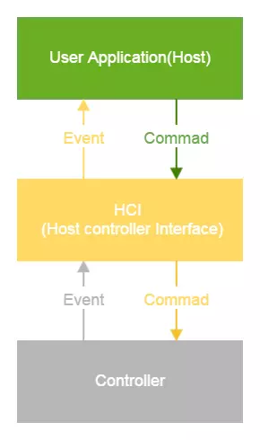
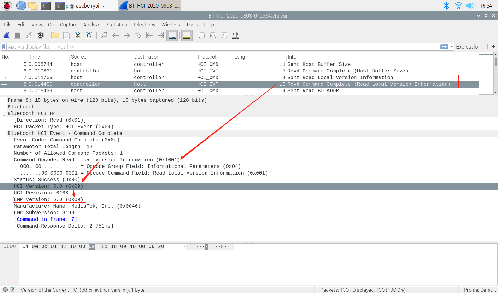
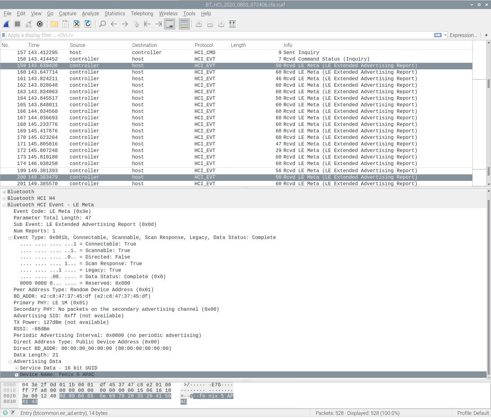
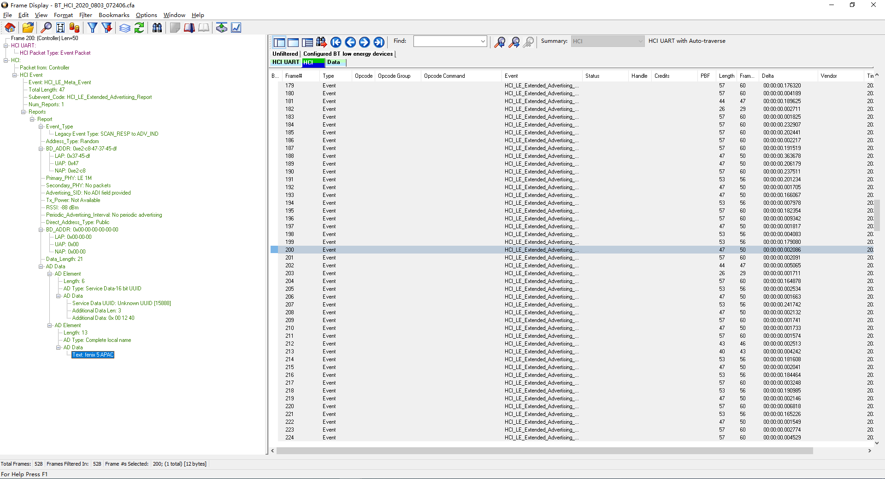

# Wireshark Bluetooth HCI

使用Wireshark分析BT HCI(类比到Wifi nl80211)

## 参考文档

* [MTK android 蓝牙版本查看](https://blog.csdn.net/u012932409/article/details/107066768/)
* [Android Bluetooth HCI log 详解](https://blog.csdn.net/grit_wang/article/details/107635258)

## 基本概念

通过HCI log辅助学习蓝牙协议，就好像学习TCP/IP时，通过wireshark抓包来学习TCP协议

蓝牙核心系统架构抽象为3层：
* User Application(Host)：User Application即应用层，也被称为Host，我们调用Bluetooth API就属于应用层，例如，BluetoothAdapter中提供的接口。
* HCI (Host controller Interface)：上层在调用蓝牙API时，不会直接操作蓝牙底层(Controller)相关接口，而是通过HCI下发对应操作的Command给Controller，然后底层执行命令后返回执行结果，即Controller发送Event给HCI，HCI再通知给应用层，HCI起到了一个中间层的作用。
* Controller：Controller是在最底层，可以理解为我们手机上的蓝牙芯片。

profile config: `packages/apps/Bluetooth/res/values/config.xml`

## HCI file

`/sdcard/debuglogger/connsyslog/bthci/CsLog_2020_0803_072644/BT_HCI_2020_0803_072634.cfa.curf`

## Wireshark Bluetooth HCI

* Version  
  
* Scan  
  

## Frontline Bluetooth HCI tool

* [Frontline BPA® 600 Dual Mode Bluetooth® Protocol Analyzer](http://www.fte.com/support/CPAS-download.aspx?demo=ComProbe%20BPA%20600&iid=21)  
  
