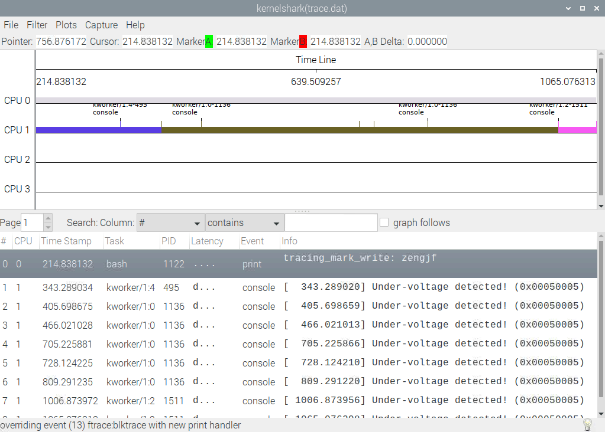

# Capture ftrace event

手动操作一下获取ftrace event并转换到kernelshark显示

## 参考文档

* [0084_wpa_supplicant_daemon.md](0084_wpa_supplicant_daemon.md)
* [0086_trace-cmd.md](0086_trace-cmd.md)

## steps

* apt-get install kernelshark
* cd /sys/kernel/debug/
* cat available_events | grep print
  ```
  printk:console
  ```
* cat events/printk/enable
  ```
  0
  ```
* echo "printk:console" > set_event
* cat set_event
  ```
  printk:console 
  ```
* cat events/printk/enable
  ```
  1
  ```
* echo > set_event_pid
* echo > trace
* echo 1 > tracing_on
* cat trace
  ```
  # tracer: nop
  #
  # entries-in-buffer/entries-written: 0/0   #P:4
  #
  #                              _-----=> irqs-off
  #                             / _----=> need-resched
  #                            | / _---=> hardirq/softirq
  #                            || / _--=> preempt-depth
  #                            ||| /     delay
  #           TASK-PID   CPU#  ||||    TIMESTAMP  FUNCTION
  #              | |       |   ||||       |         |
  ```
* echo zengjf > trace_marker
* cat trace
  ```
  # tracer: nop
  #
  # entries-in-buffer/entries-written: 1/1   #P:4
  #
  #                              _-----=> irqs-off
  #                             / _----=> need-resched
  #                            | / _---=> hardirq/softirq
  #                            || / _--=> preempt-depth
  #                            ||| /     delay
  #           TASK-PID   CPU#  ||||    TIMESTAMP  FUNCTION
  #              | |       |   ||||       |         |
              bash-1122  [000] ....   214.838132: tracing_mark_write: zengjf
  ```
* sudo trace-cmd extract 
  * trace.dat
* kernelshark  
  下图中除了我自己输入的第一条，后面的是别的进程输出  
  

## trace-cmd采集数据原理

* 采集所有CPU输出的Trace
  * /sys/kernel/debug/tracing/per_cpu/
    * cpu[x]
      * trace_pipe_raw
* 将上面的CPU执行时输出的trace通过splice/pip/socket传输，socket接收到数据，然后解析到trace.dat中
  

## KernelShark Build

* wget https://git.kernel.org/pub/scm/utils/trace-cmd/trace-cmd.git/snapshot/trace-cmd-kernelshark-v1.0.tar.gz
* tar xvf trace-cmd-kernelshark-v1.0.tar.gz
* cd trace-cmd-kernelshark-v1.0
* sudo apt-get install build-essential git cmake libjson-c-dev -y
* sudo apt-get install freeglut3-dev libxmu-dev libxi-dev -y
* sudo apt-get install qtbase5-dev -y
* sudo apt-get install -y swig
* `make gui` error
  ```
  make[1]: '/home/pi/zengjf/trace-cmd-kernelshark-v1.0/lib/traceevent/libtraceevent.a' is up to date.
  make[1]: '/home/pi/zengjf/trace-cmd-kernelshark-v1.0/lib/trace-cmd/libtracecmd.a' is up to date.
  make[1]: 'ctracecmd.so' is up to date.
  [ 22%] Built target kshark
  [ 33%] Built target kshark-plot
  [ 44%] Built target missed_events
  [ 55%] Built target sched_events
  [ 62%] Built target dfilter
  [ 66%] Building CXX object examples/CMakeFiles/widgetdemo.dir/widgetdemo.cpp.o
  /home/pi/zengjf/trace-cmd-kernelshark-v1.0/kernel-shark/examples/widgetdemo.cpp:16:10: fatal error: QtWidgets: No such file or directory
   #include <QtWidgets>
            ^~~~~~~~~~~
  compilation terminated.
  make[3]: *** [examples/CMakeFiles/widgetdemo.dir/build.make:63: examples/CMakeFiles/widgetdemo.dir/widgetdemo.cpp.o] Error 1
  make[2]: *** [CMakeFiles/Makefile2:328: examples/CMakeFiles/widgetdemo.dir/all] Error 2
  make[1]: *** [Makefile:130: all] Error 2
  make: *** [Makefile:272: gui] Error 2
  ```
  * kernel-shark/CMakeLists.txt
    * 注释掉：`add_subdirectory(${KS_DIR}/examples)`
* 最终编译出来的显示效果不好，时间轴不能正常显示