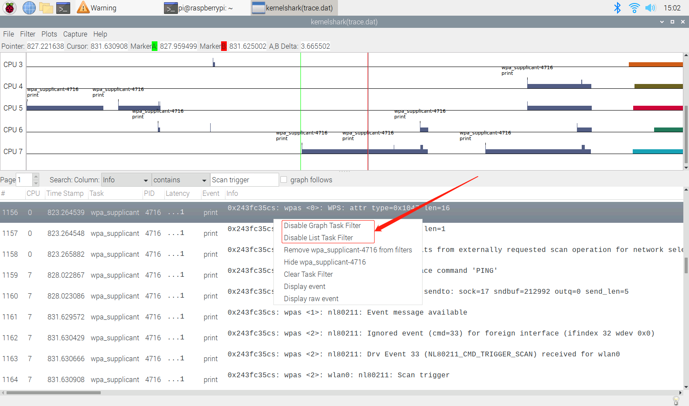

# Android fstrace

Android下如何使用ftrace

## 参考文档

* [0086_trace-cmd.md](0086_trace-cmd.md)
* [0134_Capture_ftrace_event.md](0134_Capture_ftrace_event.md)

## wpa_supplicant log信息

* [MTK基线下的wpa_cli开启](https://juejin.im/post/6844904103886209037)
  * /vendor/etc/wifi/wpa_supplicant.conf
    * ctrl_interface=/data/vendor/wifi/wpa/sockets
      * wpa_cli -i wlan0
        * scan_results
* [[RK3288][Android6.0] WiFi的配置文件wpa_supplicant.conf](https://blog.csdn.net/kris_fei/article/details/73650602)
  * vendor/mediatek/proprietary/hardware/connectivity/wlan/config/Android.mk
    * vendor/mediatek/proprietary/hardware/connectivity/wlan/mtk-wpa_supplicant.conf
      * ctrl_interface=/data/vendor/wifi/wpa/sockets
    * diff
      ```diff
      diff --git a/vendor/mediatek/proprietary/hardware/connectivity/wlan/config/mtk-wpa_supplicant.conf b/vendor/mediatek/proprietary/hardware/connectivity/wlan/config/mtk-wpa_supplicant.conf
      index 6ce4777f012..a258abab8f7 100644
      --- a/vendor/mediatek/proprietary/hardware/connectivity/wlan/config/mtk-wpa_supplicant.conf
      +++ b/vendor/mediatek/proprietary/hardware/connectivity/wlan/config/mtk-wpa_supplicant.conf
      @@ -1,4 +1,4 @@
      -ctrl_interface=wlan0
      +ctrl_interface=/data/vendor/wifi/wpa/sockets
       update_config=1
       manufacturer=MediaTek Inc.
       device_name=Wireless Client
      ```
* 设置debug等级查看信息：
  * adb shell
    * wpa_cli -i wlan0
      * log_level debug
    * logcat | grep wpa
* logcat | grep wpa_supplicant
  ```
  08-06 07:07:22.448  2892  2892 I wpa_supplicant: Processing hidl events on FD 3
  08-06 07:07:22.481  2892  2892 I wpa_supplicant: Successfully initialized wpa_supplicant
  08-06 07:07:22.761  2892  2892 I wpa_supplicant: Copied template conf file from /vendor/etc/wifi/wpa_supplicant.conf to /data/vendor/wifi/wpa/wpa_supplicant.conf
  08-06 07:07:22.798  2892  2892 I wpa_supplicant: rfkill: Cannot open RFKILL control device
  08-06 07:07:22.820  2892  2892 I wpa_supplicant: WPS: Converting display to virtual_display for WPS 2.0 compliance
  08-06 07:07:22.820  2892  2892 I wpa_supplicant: WPS: Converting push_button to virtual_push_button for WPS 2.0 compliance
  08-06 07:07:22.834  2892  2892 E wpa_supplicant: global ctrl interface @android:wpa_wlan0 matches ctrl interface wlan0 - do not open per-interface ctrl interface
  08-06 07:07:22.835  2892  2892 E wpa_supplicant: [WAPI] wapi_init dlopen failed in libwapi.so: dlopen failed: library "libwapi.so" not found
  08-06 07:07:22.836  2892  2892 E wpa_supplicant: wapi_init failed!
  08-06 07:07:23.059  2892  2892 I wpa_supplicant: wpa_driver_nl80211_driver_cmd: wlan0 recv cmd MACADDR
  08-06 07:07:23.103  2892  2892 I wpa_supplicant: wpa_driver_nl80211_driver_cmd: wlan0 recv cmd BTCOEXSCAN-STOP
  08-06 07:07:23.113  2892  2892 I wpa_supplicant: wpa_driver_nl80211_driver_cmd: wlan0 recv cmd RXFILTER-STOP
  08-06 07:07:23.117  2892  2892 I wpa_supplicant: wpa_driver_nl80211_driver_cmd: wlan0 recv cmd RXFILTER-ADD 2
  08-06 07:07:23.130  2892  2892 I wpa_supplicant: wpa_driver_nl80211_driver_cmd: wlan0 recv cmd RXFILTER-START
  08-06 07:07:23.137  2892  2892 I wpa_supplicant: wpa_driver_nl80211_driver_cmd: wlan0 recv cmd RXFILTER-STOP
  08-06 07:07:23.143  2892  2892 I wpa_supplicant: wpa_driver_nl80211_driver_cmd: wlan0 recv cmd RXFILTER-ADD 3
  08-06 07:07:23.147  2892  2892 I wpa_supplicant: wpa_driver_nl80211_driver_cmd: wlan0 recv cmd RXFILTER-START
  08-06 07:07:23.152  2892  2892 I wpa_supplicant: wpa_driver_nl80211_driver_cmd: wlan0 recv cmd SETSUSPENDMODE 0
  08-06 07:07:23.152  2892  2892 I wpa_supplicant: wpa_driver_nl80211_driver_cmd: ret = 0 used = 17 total = 512
  08-06 07:07:23.231  2892  2892 I wpa_supplicant: Copied template conf file from /vendor/etc/wifi/wpa_supplicant.conf to /data/vendor/wifi/wpa/p2p_supplicant.conf
  08-06 07:07:23.259  2892  2892 I wpa_supplicant: rfkill: Cannot open RFKILL control device
  08-06 07:07:23.278  2892  2892 I wpa_supplicant: WPS: Converting display to virtual_display for WPS 2.0 compliance
  08-06 07:07:23.278  2892  2892 I wpa_supplicant: WPS: Converting push_button to virtual_push_button for WPS 2.0 compliance
  08-06 07:07:23.279  2892  2892 E wpa_supplicant: global ctrl interface @android:wpa_wlan0 matches ctrl interface wlan0 - do not open per-interface ctrl interface
  08-06 07:07:23.335  2892  2892 I wpa_supplicant: WPS: Converting display to virtual_display for WPS 2.0 compliance
  08-06 07:07:23.335  2892  2892 I wpa_supplicant: WPS: Converting push_button to virtual_push_button for WPS 2.0 compliance
  08-06 07:08:23.163  2892  2892 I wpa_supplicant: wpa_driver_nl80211_driver_cmd: wlan0 recv cmd SETSUSPENDMODE 0
  08-06 07:08:23.165  2892  2892 I wpa_supplicant: wpa_driver_nl80211_driver_cmd: ret = 0 used = 17 total = 512
  08-06 07:08:24.862  2892  2892 I wpa_supplicant: wpa_driver_nl80211_driver_cmd: wlan0 recv cmd SETSUSPENDMODE 1
  08-06 07:08:24.874  2892  2892 I wpa_supplicant: wpa_driver_nl80211_driver_cmd: ret = 0 used = 17 total = 512
  08-06 07:10:52.510  2892  2892 I wpa_supplicant: wpa_driver_nl80211_driver_cmd: wlan0 recv cmd SETSUSPENDMODE 0
  08-06 07:10:52.527  2892  2892 I wpa_supplicant: wpa_driver_nl80211_driver_cmd: ret = 0 used = 17 total = 512
  08-06 07:11:57.638  2892  2892 I wpa_supplicant: wpa_driver_nl80211_driver_cmd: wlan0 recv cmd SETSUSPENDMODE 1
  08-06 07:11:57.662  2892  2892 I wpa_supplicant: wpa_driver_nl80211_driver_cmd: ret = 0 used = 17 total = 512
  08-06 07:22:57.571  2892  2892 I wpa_supplicant: wpa_driver_nl80211_driver_cmd: wlan0 recv cmd SETSUSPENDMODE 0
  08-06 07:22:57.587  2892  2892 I wpa_supplicant: wpa_driver_nl80211_driver_cmd: ret = 0 used = 17 total = 512
  08-06 07:23:59.667  2892  2892 I wpa_supplicant: wpa_driver_nl80211_driver_cmd: wlan0 recv cmd SETSUSPENDMODE 1
  08-06 07:23:59.682  2892  2892 I wpa_supplicant: wpa_driver_nl80211_driver_cmd: ret = 0 used = 17 total = 512
  08-06 07:29:49.416  2892  2892 I wpa_supplicant: wpa_driver_nl80211_driver_cmd: wlan0 recv cmd SETSUSPENDMODE 0
  08-06 07:29:49.429  2892  2892 I wpa_supplicant: wpa_driver_nl80211_driver_cmd: ret = 0 used = 17 total = 512
  08-06 07:29:57.271   947  1278 I WifiNative: wpa_supplicant died. Cleaning up internal state.
  ```
* wpa_supplicant trace log
  ```diff
  diff --git a/external/wpa_supplicant_8/wpa_supplicant/android.config b/external/wpa_supplicant_8/wpa_supplicant/android.config
  index dfea34d6b16..04362eb81d4 100644
  --- a/external/wpa_supplicant_8/wpa_supplicant/android.config
  +++ b/external/wpa_supplicant_8/wpa_supplicant/android.config
  @@ -390,7 +390,7 @@ CONFIG_IEEE80211R=y
   # to the Linux kernel tracing facility. This helps debug the entire stack by
   # making it easy to record everything happening from the driver up into the
   # same file, e.g., using trace-cmd.
  -#CONFIG_DEBUG_LINUX_TRACING=y
  +CONFIG_DEBUG_LINUX_TRACING=y
  
   # Add support for writing debug log to Android logcat instead of standard
   # output
  diff --git a/external/wpa_supplicant_8/wpa_supplicant/main.c b/external/wpa_supplicant_8/wpa_supplicant/main.c
  index 51a8a0298a9..c54e02d6d7f 100644
  --- a/external/wpa_supplicant_8/wpa_supplicant/main.c
  +++ b/external/wpa_supplicant_8/wpa_supplicant/main.c
  @@ -339,6 +339,7 @@ int main(int argc, char *argv[])
          }
  
          exitcode = 0;
  +       params.wpa_debug_tracing++;
          global = wpa_supplicant_init(&params);
          if (global == NULL) {
                  wpa_printf(MSG_ERROR, "Failed to initialize wpa_supplicant");
  ```

## trace-cmd

* https://github.com/ZengjfOS/RaspberryPi/tree/trace-cmd-AndroidQ
* record
  * trace-cmd record -e printk -o /data/trace.dat
  * trace-cmd record -e printk -P 6764 -o /data/trace.dat
* ps -A | grep wpa_supplicant | awk -F ' *' '{print $2}'
  * trace-cmd record -e printk -P 6741 -o /data/trace.dat
  * trace-cmd record -e printk -P `ps -A | grep wpa_supplicant | awk -F ' *' '{print $2}'` -o /data/trace.dat
* adb pull /data/trace.dat trace.dat
* 注意使用kernelshark中的任务过滤器和图形过滤器来合理显示需要看的界面
  
