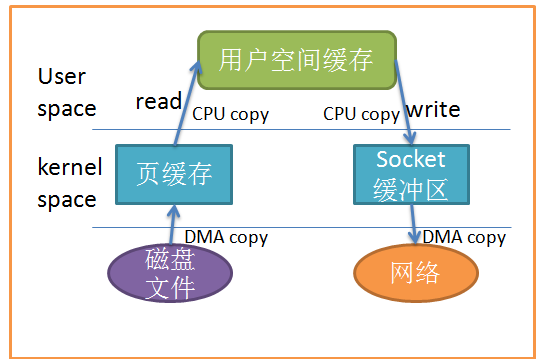
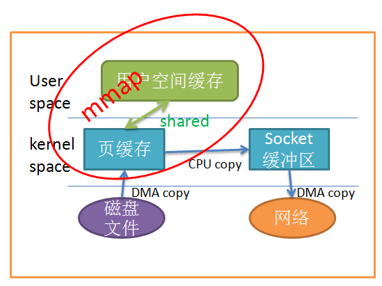
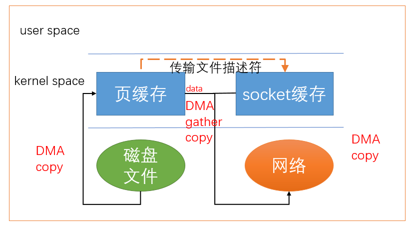

# Linux Splice

理解零拷贝有助于理解Android Binder通信


## 参考文档

* [linux网络编程：splice函数和tee( )函数高效的零拷贝](https://www.cnblogs.com/kex1n/p/7446291.html)
* [Linux 中的零拷贝技术 splice](http://abcdxyzk.github.io/blog/2015/05/07/kernel-mm-splice/)


## 简述

* 零拷贝技术都是减少数据在用户空间和内核空间拷贝技术实现；


## 用户空间拷贝次数

* 两次拷贝  
  
* 一次拷贝  
  
* 零次拷贝  
  


## 示例

```C
#define _GNU_SOURCE
#include <fcntl.h>
#include <stdio.h>
#include <unistd.h>
#include <errno.h>
#include <string.h>
#include <time.h>

int main(int argc, char **argv)
{
	int pipefd[2];
	int result;
	FILE *in_file;
	FILE *out_file;
	char buff[65537];

	if (argc != 3) {
		printf("usage: ./client infile outfile\n");
		exit(0);
	}
	result = pipe(pipefd);

	in_file = fopen(argv[1], "rb");
	out_file = fopen(argv[2], "wb");

	off_t off_in = 0, off_out = 0;
	int len = 1024*1024*30;
	while (len > 0) {
		int size = 65536;
		if (len < size) size = len;
		len -= size;

		result = splice(fileno(in_file), &off_in, pipefd[1], NULL, size, SPLICE_F_MORE | SPLICE_F_MOVE);
		result = splice(pipefd[0], NULL, fileno(out_file), &off_out, size, SPLICE_F_MORE | SPLICE_F_MOVE);
		// printf("%d\n", result);

        // read(fileno(in_file), buff, size);
        // write(fileno(out_file), buff, size);
	}
	close(pipefd[0]);
	close(pipefd[1]);
	fclose(in_file);
	fclose(out_file);

	return 0;
}
```
