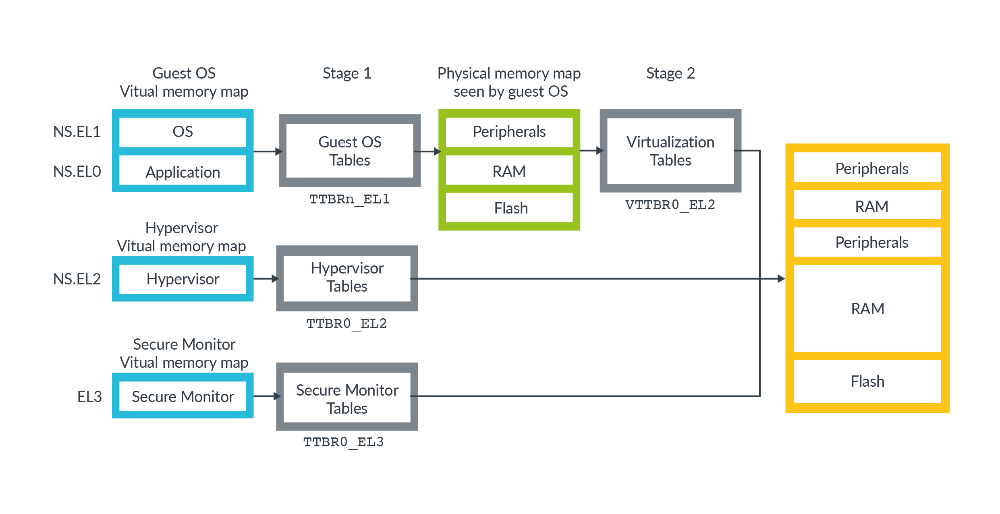
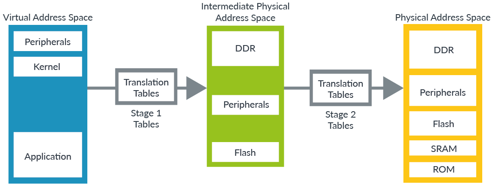

# ARM CPU Refer Docs

CPU方面的一些文档参考

## 参考文档

* [如何编写一个硬件模拟器？ - 知乎用户的回答 - 知乎](https://www.zhihu.com/question/22680746/answer/70081399)
* [南京大学 计算机科学与技术系 计算机系统基础 课程实验 2019](https://nju-projectn.github.io/ics-pa-gitbook/ics2019/2.2.html)
  * https://legacy.gitbook.com/@nju-ics
    * [ICS2019 Programming Assignment](https://legacy.gitbook.com/book/nju-ics/ics2019-programming-assignment/details)
* [How To Write a Computer Emulator](http://fms.komkon.org/EMUL8/HOWTO.html)
* [ARM A系列处理器文档参考](https://developer.arm.com/ip-products/processors/cortex-a)
* [Armv8-A Instruction Set Architecture - Arm Developer](https://developer.arm.com/-/media/Arm%20Developer%20Community/PDF/Learn%20the%20Architecture/Armv8-A%20Instruction%20Set%20Architecture.pdf?revision=818c7869-3849-4e5d-bde2-710e69defb57)

## ARM处理相关参考

如果需要研究ARM处理内部处理流程文档，可以参考下面网址，去找对应的CPU的信息

* https://developer.arm.com/
* https://developer.arm.com/architectures/learn-the-architecture/a-profile
  * learn-the-architecture分类是用于学习ARM体系架构的文档

## SMMU Hypervisor

* System MMU
* https://developer.arm.com/architectures/learn-the-architecture/memory-management  
* https://developer.arm.com/architectures/learn-the-architecture/memory-management/address-spaces-in-armv8-a
  * 
    * 如上图显示有三种虚拟地址转换空间
      * NS.EL0 and NS.EL1 (Non-secure EL0/EL1).
        * 含有两组地址转换表，从而允许hypervisor管理虚拟机可见的物理地址
      * NS.EL2 (Non-secure EL2).
      * EL3.
  * 
    * The Stage 1 tables translate virtual addresses to intermediate physical addresses (IPAs). In Stage 1 the OS thinks that the IPAs are physical address spaces. 
    * The hypervisor controls a second set of translations, which we call Stage 2. This second set of translations translates IPAs to physical addresses.
* https://developer.arm.com/docs/ihi0048/latest

