# Android AVB vbmeta public key

Android AVB启动vbmeta如何确保安全？

## 参考文档

* [Android 启动时验证](https://source.android.google.cn/security/verifiedboot/avb?hl=zh-cn)
* [Android Verified Boot 概述](https://www.xiezeyang.com/2019/10/20/Security/AndroidVerifiedBoot%E6%A6%82%E8%BF%B0/)
* [Android Verified Boot 使能方式](https://www.xiezeyang.com/2019/11/10/Security/AndroidVerifiedBoot%E4%BD%BF%E8%83%BD%E6%96%B9%E5%BC%8F/)
* [Android Verified Boot 2.0](https://blog.csdn.net/Thanksgining/article/details/83025455)
* [[FAQ23162] AVB2.0 Configuration for Android Q](https://online.mediatek.com/FAQ#/SW/FAQ23162)
* [Android verified boot 2.0 vbmeta 数据结构解析](https://www.jianshu.com/p/a2542426bdde)
* [Android Verified Boot 2.0](https://blog.csdn.net/rikeyone/article/details/80606147)

## 简述

vbmeta分区中的VBMeta结构是通过加密签名，在启动阶段其会检查签名验证vbmeta分区是否可信，从而信任boot、system、vendor分区的哈希值，其中boot、dtbo等较小分区直接存储的是的哈希值，以及其他较大分区的是以哈希树的方式存储，vbmeta中只存放哈希树的根哈希。

校验vbmeta可信后，对于boot、dtbo分区，将整个镜像加载到内存中，直接计算其相应的哈希值与vbmeta中的值进行比较，如无法验证通过将无法继续启动。

对于system、vendor这种很大的分区，直接将其加载进内存进行哈希校验，是耗时且很不划算，其采用哈希树的方式进行校验，其验证会在加载数据进内存的过程中持续进行，系统在运行时计算哈希树的根哈希，并于vbmeta中的根哈希进行比较，如果在某个时间点计算出的根哈希值与预期根哈希值不一致，系统便不会使用相应数据，而且Android会出现错误。这个校验是采用dm-verity实现。


AVB中有两个重要key，一个验证vbmeta.img的OEM key，一个验证其他分区(boot/system/vendor)的verity key。当然可以使用OEM key作为verity key。avb2.0使用OEM key来验证vbmeta.img，并使用其中所包含的public key验证其他分区。启动时bootloader将验证两个分区，一个是使用OEM key验证vbmeta.img，一个是使用vbmeta.img所包含的public key验证boot分区，而system/vendor分区由init/fs_mgr来验证(使用vbmeta.img所包含的public key)。

## dm-verity

device-mapper-verity (dm-verity)

* `adb disable-verity`
* `fastboot --disable-verity flash vbmeta vbmeta.img`

## avbtool使用

* `./out/host/linux-x86/bin/avbtool info_image --image out/target/product/${product}/boot.img`
* 私钥校验：
  * `./out/host/linux-x86/bin/avbtool verify_image --image out/target/product/${product}/boot.img --key device/mediatek/vendor/common/boot_prvk.pem`
* 公钥校验：
  * `./out/host/linux-x86/bin/avbtool verify_image --image out/target/product/${product}/boot.img --key device/mediatek/vendor/common/boot_pubk.pem`

## AVB Key

`device/mediatek/common/device.mk`的配置信息

```Makefile
# setup avb2.0 configs.
MAIN_VBMETA_IN_BOOT ?= no

ifeq (-4.9-lc,$(findstring -4.9-lc,$(LINUX_KERNEL_VERSION)))
    BOARD_AVB_ENABLE ?= true
else ifeq (-4.9,$(findstring -4.9,$(LINUX_KERNEL_VERSION)))
    BOARD_AVB_ENABLE ?= true
else ifeq (-4.14,$(findstring -4.14,$(LINUX_KERNEL_VERSION)))
    BOARD_AVB_ENABLE ?= true
else ifeq (-4.4,$(findstring -4.4,$(LINUX_KERNEL_VERSION)))
    BOARD_AVB_ENABLE ?= true
endif

PRODUCT_SYSTEM_VERITY_PARTITION := /dev/block/platform/bootdevice/by-name/system
PRODUCT_VENDOR_VERITY_PARTITION := /dev/block/platform/bootdevice/by-name/vendor

ifneq ($(strip $(BOARD_AVB_ENABLE)), true)
    # if avb2.0 is not enabled
    $(call inherit-product, build/target/product/verity.mk)
else
    #settings for main vbmeta
    BOARD_AVB_ALGORITHM ?= SHA256_RSA2048
    BOARD_AVB_KEY_PATH ?= device/mediatek/common/oem_prvk.pem
    BOARD_AVB_ROLLBACK_INDEX ?= 0

    SET_RECOVERY_AS_CHAIN ?= yes

    ifeq ($(strip $(MAIN_VBMETA_IN_BOOT)),no)
        ifeq ($(strip $(SET_RECOVERY_AS_CHAIN)),yes)
            #settings for recovery, which is configured as chain partition
            BOARD_AVB_RECOVERY_KEY_PATH := device/mediatek/common/recovery_prvk.pem
            BOARD_AVB_RECOVERY_ALGORITHM := SHA256_RSA2048
            BOARD_AVB_RECOVERY_ROLLBACK_INDEX := 0
            # Always assign "1" to BOARD_AVB_RECOVERY_ROLLBACK_INDEX_LOCATION
            # if MTK_OTP_FRAMEWORK_V2 is turned on in LK. In other words,
            # rollback_index_location "1" can only be assigned to
            # recovery partition.
            BOARD_AVB_RECOVERY_ROLLBACK_INDEX_LOCATION := 1
        endif
        BOARD_AVB_BOOT_KEY_PATH := device/mediatek/common/boot_prvk.pem
        BOARD_AVB_BOOT_ALGORITHM := SHA256_RSA2048
        BOARD_AVB_BOOT_ROLLBACK_INDEX := 0
        BOARD_AVB_BOOT_ROLLBACK_INDEX_LOCATION := 3
    endif

    ifeq ($(PRODUCT_USE_DYNAMIC_PARTITIONS), true)
        BOARD_AVB_VBMETA_SYSTEM := system
        BOARD_AVB_VBMETA_SYSTEM_KEY_PATH := device/mediatek/common/system_prvk.pem
        BOARD_AVB_VBMETA_SYSTEM_ALGORITHM := SHA256_RSA2048
        BOARD_AVB_VBMETA_SYSTEM_ROLLBACK_INDEX := 0
        BOARD_AVB_VBMETA_SYSTEM_ROLLBACK_INDEX_LOCATION := 2

        BOARD_AVB_VBMETA_VENDOR := vendor
        BOARD_AVB_VBMETA_VENDOR_KEY_PATH := device/mediatek/common/vendor_prvk.pem
        BOARD_AVB_VBMETA_VENDOR_ALGORITHM := SHA256_RSA2048
        BOARD_AVB_VBMETA_VENDOR_ROLLBACK_INDEX := 0
        BOARD_AVB_VBMETA_VENDOR_ROLLBACK_INDEX_LOCATION := 4
    else
        #settings for system, which is configured as chain partition
        BOARD_AVB_SYSTEM_KEY_PATH := device/mediatek/common/system_prvk.pem
        BOARD_AVB_SYSTEM_ALGORITHM := SHA256_RSA2048
        BOARD_AVB_SYSTEM_ROLLBACK_INDEX := 0
        BOARD_AVB_SYSTEM_ROLLBACK_INDEX_LOCATION := 2
        #settings for vendor, which is configured as chain partition
        BOARD_AVB_VENDOR_KEY_PATH := device/mediatek/common/vendor_prvk.pem
        BOARD_AVB_VENDOR_ALGORITHM := SHA256_RSA2048
        BOARD_AVB_VENDOR_ROLLBACK_INDEX := 0
        BOARD_AVB_VENDOR_ROLLBACK_INDEX_LOCATION := 4
    endif

    BOARD_AVB_SYSTEM_ADD_HASHTREE_FOOTER_ARGS := --hash_algorithm sha256
    BOARD_AVB_VENDOR_ADD_HASHTREE_FOOTER_ARGS := --hash_algorithm sha256
    BOARD_AVB_PRODUCT_ADD_HASHTREE_FOOTER_ARGS := --hash_algorithm sha256
    BOARD_AVB_ODM_ADD_HASHTREE_FOOTER_ARGS := --hash_algorithm sha256
endif
```

`device/mediatek/vendor/common/BoardConfig.mk`中的配置信息

```Makefile
#settings for main vbmeta
BOARD_AVB_ENABLE ?= true

#setting for main vbmeta in boot
MAIN_VBMETA_IN_BOOT ?= no

ifneq ($(strip $(BOARD_AVB_ENABLE)), true)
    # if avb2.0 is not enabled
    #$(call inherit-product, build/target/product/verity.mk)
else

    BOARD_AVB_ALGORITHM ?= SHA256_RSA2048
    BOARD_AVB_KEY_PATH ?= device/mediatek/vendor/common/oem_prvk.pem
    BOARD_AVB_ROLLBACK_INDEX ?= 0

    SET_RECOVERY_AS_CHAIN ?= yes

    ifeq ($(strip $(MAIN_VBMETA_IN_BOOT)),no)
        ifeq ($(strip $(SET_RECOVERY_AS_CHAIN)),yes)
            #settings for recovery, which is configured as chain partition
            BOARD_AVB_RECOVERY_KEY_PATH := device/mediatek/vendor/common/recovery_prvk.pem
            BOARD_AVB_RECOVERY_ALGORITHM := SHA256_RSA2048
            BOARD_AVB_RECOVERY_ROLLBACK_INDEX := 0
            # Always assign "1" to BOARD_AVB_RECOVERY_ROLLBACK_INDEX_LOCATION
            # if MTK_OTP_FRAMEWORK_V2 is turned on in LK. In other words,
            # rollback_index_location "1" can only be assigned to
            # recovery partition.
            BOARD_AVB_RECOVERY_ROLLBACK_INDEX_LOCATION := 1
        endif
        BOARD_AVB_BOOT_KEY_PATH := device/mediatek/vendor/common/boot_prvk.pem
        BOARD_AVB_BOOT_ALGORITHM := SHA256_RSA2048
        BOARD_AVB_BOOT_ROLLBACK_INDEX := 0
        BOARD_AVB_BOOT_ROLLBACK_INDEX_LOCATION := 3
    endif

    ifeq ($(PRODUCT_USE_DYNAMIC_PARTITIONS), true)
        BOARD_AVB_VBMETA_VENDOR := vendor
        BOARD_AVB_VBMETA_VENDOR_KEY_PATH := device/mediatek/vendor/common/vendor_prvk.pem
        BOARD_AVB_VBMETA_VENDOR_ALGORITHM := SHA256_RSA2048
        BOARD_AVB_VBMETA_VENDOR_ROLLBACK_INDEX := 0
        BOARD_AVB_VBMETA_VENDOR_ROLLBACK_INDEX_LOCATION := 4
    else
        BOARD_AVB_VENDOR_KEY_PATH := device/mediatek/vendor/common/vendor_prvk.pem
        BOARD_AVB_VENDOR_ALGORITHM := SHA256_RSA2048
        BOARD_AVB_VENDOR_ROLLBACK_INDEX := 0
        BOARD_AVB_VENDOR_ROLLBACK_INDEX_LOCATION := 4
    endif

    BOARD_AVB_VENDOR_ADD_HASHTREE_FOOTER_ARGS := --hash_algorithm sha256
    BOARD_AVB_ODM_ADD_HASHTREE_FOOTER_ARGS := --hash_algorithm sha256
endif
```

`device/mediatek/vendor/common/BoardConfig.mk`中的配置信息

```Makefile
#settings for main vbmeta
BOARD_AVB_ENABLE ?= true

ifneq ($(strip $(BOARD_AVB_ENABLE)), true)
    # if avb2.0 is not enabled
    #$(call inherit-product, build/target/product/verity.mk)
else
    BOARD_AVB_ALGORITHM ?= SHA256_RSA2048
    BOARD_AVB_KEY_PATH ?= device/mediatek/system/common/oem_prvk.pem
    BOARD_AVB_ROLLBACK_INDEX ?= 0

    ifeq ($(PRODUCT_USE_DYNAMIC_PARTITIONS), true)
        BOARD_AVB_VBMETA_SYSTEM := system
        BOARD_AVB_VBMETA_SYSTEM_KEY_PATH := device/mediatek/system/common/system_prvk.pem
        BOARD_AVB_VBMETA_SYSTEM_ALGORITHM := SHA256_RSA2048
        BOARD_AVB_VBMETA_SYSTEM_ROLLBACK_INDEX := 0
        BOARD_AVB_VBMETA_SYSTEM_ROLLBACK_INDEX_LOCATION := 2
    else
        #settings for system, which is configured as chain partition
        BOARD_AVB_SYSTEM_KEY_PATH := device/mediatek/system/common/system_prvk.pem
        BOARD_AVB_SYSTEM_ALGORITHM := SHA256_RSA2048
        BOARD_AVB_SYSTEM_ROLLBACK_INDEX := 0
        BOARD_AVB_SYSTEM_ROLLBACK_INDEX_LOCATION := 2
    endif

    BOARD_AVB_SYSTEM_ADD_HASHTREE_FOOTER_ARGS := --hash_algorithm sha256
    BOARD_AVB_PRODUCT_ADD_HASHTREE_FOOTER_ARGS := --hash_algorithm sha256
endif
```

查看当前系统的私钥情况：`ls -al device/mediatek/vendor/common/*.pem`

```
-rw-rw-r-- 1 zengjf zengjf 1679 Sep 23 18:55 device/mediatek/vendor/common/boot_prvk.pem
-rw-rw-r-- 1 zengjf zengjf 1675 Sep 23 18:55 device/mediatek/vendor/common/oem_prvk.pem
-rw-rw-r-- 1 zengjf zengjf 1675 Sep 23 18:55 device/mediatek/vendor/common/recovery_prvk.pem
-rw-rw-r-- 1 zengjf zengjf 1679 Sep 23 18:55 device/mediatek/vendor/common/vendor_prvk.pem
```

* 私钥、公钥说明：
  * `vendor/mediatek/proprietary/bootable/bootloader/lk/target/${project}/inc/avbkey.h`
  * `device/mediatek/common/oem_prvk.pem`
    * 在`device/mediatek/common/device.mk`中配置：`BOARD_AVB_KEY_PATH := device/mediatek/common/oem_prvk.pem`

`vbmeta.img`被`oem_prvk.pem`进行私钥签名，在启动阶段`lk`使用`avbkey.h`中的公钥对`vbmeta.img`进行验证，所以`avbkey.h`配置的公钥与`oem_prvk.pem`的私钥必须是一对，且此`key`与`secure boot`校验其他分区的`key`不是同一个，配置文件也不是同一个，但是可以配置成同一组`key`。


## 启动校验公钥流程

```plantuml
@startsalt
* vendor/mediatek/proprietary/bootable/bootloader/lk
  * app/mt_boot/mt_boot.c
    * ret = load_vfy_boot(BOOTIMG_TYPE_BOOT, CFG_BOOTIMG_LOAD_ADDR);
      * platform/common/boot/avb20/load_vfy_boot.c
        * int load_vfy_boot(uint32_t bootimg_type, uint32_t addr)
          * avb_ret = avb_slot_verify(&ops, boot_partitions, "", avb_flag, hashtree_error_mode, &slot_data);
            * platform/common/avb/libavb/avb_slot_verify.c
              * AvbSlotVerifyResult avb_slot_verify(AvbOps* ops, const char* const* requested_partitions, const char* ab_suffix, AvbSlotVerifyFlags flags, AvbHashtreeErrorMode hashtree_error_mode, AvbSlotVerifyData** out_data)
                * ret = load_and_verify_vbmeta(ops, requested_partitions, ab_suffix, allow_verification_error, 0 /* toplevel_vbmeta_flags */, 0 /* rollback_index_location */, "vbmeta", avb_strlen("vbmeta"), NULL /* expected_public_key */, 0 /* expected_public_key_length */, slot_data, &algorithm_type, additional_cmdline_subst);
                  * ret = load_and_verify_vbmeta(ops, requested_partitions, ab_suffix, allow_verification_error, 0 /* toplevel_vbmeta_flags */, 0 /* rollback_index_location */, "boot", avb_strlen("boot"), NULL /* expected_public_key */, 0 /* expected_public_key_length */, slot_data, out_algorithm_type, out_additional_cmdline_subst); 
                    * io_ret = ops->validate_vbmeta_public_key(ops, pk_data, pk_len, pk_metadata, pk_metadata_len, &key_is_trusted);
                      * platform/common/avb/avb_hal/avb_hal.c
                        * AvbOps ops = { ... }
                          * .validate_vbmeta_public_key = avb_hal_verify_public_key,
                            *if (0 == memcmp((void *)g_avb_key, (void *)pubk, pubk_sz))
                              * uint8_t g_avb_key[AVB_PUBK_SZ] = {AVB_PUBK};
                                * vendor/mediatek/proprietary/bootable/bootloader/lk/target/${project}/inc/avbkey.h
@endsalt
```



## AVB公钥比较处理函数

```CPP
AvbIOResult avb_hal_verify_public_key(AvbOps *ops,
                                      const uint8_t *public_key_data,
                                      size_t public_key_length,
                                      const uint8_t *public_key_metadata,
                                      size_t public_key_metadata_length,
                                      bool *out_is_trusted)
{
        AvbRSAPublicKeyHeader *key_hdr;
        uint8_t *pubk;
        uint32_t i = 0;
        uint32_t pubk_sz = 0;
        AvbIOResult ret = AVB_IO_RESULT_OK;

        if (out_is_trusted == NULL || public_key_data == NULL)
                return AVB_IO_RESULT_ERROR_IO;

        key_hdr = (AvbRSAPublicKeyHeader *)public_key_data;
        pubk = (uint8_t *)(public_key_data + sizeof(AvbRSAPublicKeyHeader));
        pubk_sz = avb_htobe32(key_hdr->key_num_bits) / 8;

        *out_is_trusted = FALSE;
        if (pubk_sz != AVB_PUBK_SZ) {
                pal_log_err("invalid pubk size\n");
                goto end;
        }

#ifdef MTK_SECURITY_SW_SUPPORT
        if (sec_set_pubk(pubk, pubk_sz) != STATUS_OK) {
                pal_log_err("[%s] fails to set public key\n", __func__);
                return AVB_IO_RESULT_ERROR_IO;
        }
#endif

        if (0 == memcmp((void *)g_avb_key, (void *)pubk, pubk_sz))
                *out_is_trusted = TRUE;
        else {
#ifdef MTK_SECURITY_YELLOW_STATE_SUPPORT
                *out_is_trusted = TRUE;
                g_vb_custom_key_exist = 1;
#else
                pal_log_err("oem_avb_key =\n");
                for (i = 0; i < AVB_PUBK_SZ; i++) {
                        pal_log_err("0x%x ", g_avb_key[i]);
                        if (((i + 1) % 16) == 0)
                                pal_log_err("\n");
                }
                pal_log_err("vbmeta_avb_key =\n");
                for (i = 0; i < AVB_PUBK_SZ; i++) {
                        pal_log_err("0x%x ", pubk[i]);
                        if (((i + 1) % 16) == 0)
                                pal_log_err("\n");
                }
#endif
        }

end:
        return ret;
}
```

## 确认私钥公钥

* 公钥: `vendor/mediatek/proprietary/bootable/bootloader/lk/target/${project}/inc/avbkey.h`
* 私钥: `device/mediatek/vendor/common/oem_pubk.pem`
* 从私钥提取`der`，然后提取到头文件，最终对比`avbkey.h`，确实是`oem_pubk.pem`
  * 参考: [0115_Openssl_RSA_Hash_Sign.md](0115_Openssl_RSA_Hash_Sign.md)

## vbmeta

`vbmata.img`生成原理

```Makefile
# $(1): the directory to extract public keys to
define extract-avb-chain-public-keys
  $(if $(BOARD_AVB_BOOT_KEY_PATH),\
    $(hide) $(AVBTOOL) extract_public_key --key $(BOARD_AVB_BOOT_KEY_PATH) \
      --output $(1)/boot.avbpubkey)
  $(if $(BOARD_AVB_SYSTEM_KEY_PATH),\
    $(hide) $(AVBTOOL) extract_public_key --key $(BOARD_AVB_SYSTEM_KEY_PATH) \
      --output $(1)/system.avbpubkey)
  $(if $(BOARD_AVB_VENDOR_KEY_PATH),\
    $(hide) $(AVBTOOL) extract_public_key --key $(BOARD_AVB_VENDOR_KEY_PATH) \
      --output $(1)/vendor.avbpubkey)
  $(if $(BOARD_AVB_PRODUCT_KEY_PATH),\
    $(hide) $(AVBTOOL) extract_public_key --key $(BOARD_AVB_PRODUCT_KEY_PATH) \
      --output $(1)/product.avbpubkey)
  $(if $(BOARD_AVB_PRODUCT_SERVICES_KEY_PATH),\
    $(hide) $(AVBTOOL) extract_public_key --key $(BOARD_AVB_PRODUCT_SERVICES_KEY_PATH) \
      --output $(1)/product_services.avbpubkey)
  $(if $(BOARD_AVB_ODM_KEY_PATH),\
    $(hide) $(AVBTOOL) extract_public_key --key $(BOARD_AVB_ODM_KEY_PATH) \
      --output $(1)/odm.avbpubkey)
  $(if $(BOARD_AVB_DTBO_KEY_PATH),\
    $(hide) $(AVBTOOL) extract_public_key --key $(BOARD_AVB_DTBO_KEY_PATH) \
      --output $(1)/dtbo.avbpubkey)
  $(if $(BOARD_AVB_RECOVERY_KEY_PATH),\
    $(hide) $(AVBTOOL) extract_public_key --key $(BOARD_AVB_RECOVERY_KEY_PATH) \
      --output $(1)/recovery.avbpubkey)
  $(if $(BOARD_AVB_VBMETA_SYSTEM_KEY_PATH),\
    $(hide) $(AVBTOOL) extract_public_key --key $(BOARD_AVB_VBMETA_SYSTEM_KEY_PATH) \
        --output $(1)/vbmeta_system.avbpubkey)
  $(if $(BOARD_AVB_VBMETA_VENDOR_KEY_PATH),\
    $(hide) $(AVBTOOL) extract_public_key --key $(BOARD_AVB_VBMETA_VENDOR_KEY_PATH) \
        --output $(1)/vbmeta_vendor.avbpubkey)
endef

define build-vbmetaimage-target
  $(call pretty,"Target vbmeta image: $(INSTALLED_VBMETAIMAGE_TARGET)")
  $(hide) mkdir -p $(AVB_CHAIN_KEY_DIR)
  $(call extract-avb-chain-public-keys, $(AVB_CHAIN_KEY_DIR))
  $(info $(AVBTOOL) make_vbmeta_image \
    $(INTERNAL_AVB_MAKE_VBMETA_IMAGE_ARGS) \
    $(PRIVATE_AVB_VBMETA_SIGNING_ARGS) \
    $(BOARD_AVB_MAKE_VBMETA_IMAGE_ARGS) \
    --output $@)
  $(hide) $(AVBTOOL) make_vbmeta_image \
    $(INTERNAL_AVB_MAKE_VBMETA_IMAGE_ARGS) \
    $(PRIVATE_AVB_VBMETA_SIGNING_ARGS) \
    $(BOARD_AVB_MAKE_VBMETA_IMAGE_ARGS) \
    --output $@
  $(hide) rm -rf $(AVB_CHAIN_KEY_DIR)
endef

INSTALLED_VBMETAIMAGE_TARGET := $(BUILT_VBMETAIMAGE_TARGET)
$(INSTALLED_VBMETAIMAGE_TARGET): PRIVATE_AVB_VBMETA_SIGNING_ARGS := \
    --algorithm $(BOARD_AVB_ALGORITHM) --key $(BOARD_AVB_KEY_PATH)

$(INSTALLED_VBMETAIMAGE_TARGET): \
            $(AVBTOOL) \
            $(INSTALLED_BOOTIMAGE_TARGET) \
            $(INSTALLED_SYSTEMIMAGE_TARGET) \
            $(INSTALLED_VENDORIMAGE_TARGET) \
            $(INSTALLED_PRODUCTIMAGE_TARGET) \
            $(INSTALLED_PRODUCT_SERVICESIMAGE_TARGET) \
            $(INSTALLED_ODMIMAGE_TARGET) \
            $(INSTALLED_DTBOIMAGE_TARGET) \
            $(INSTALLED_RECOVERYIMAGE_TARGET) \
            $(INSTALLED_VBMETA_SYSTEMIMAGE_TARGET) \
            $(INSTALLED_VBMETA_VENDORIMAGE_TARGET) \
            $(BOARD_AVB_VBMETA_SYSTEM_KEY_PATH) \
            $(BOARD_AVB_VBMETA_VENDOR_KEY_PATH) \
            $(BOARD_AVB_KEY_PATH)
        $(build-vbmetaimage-target)
```

`vbmeta.img`生成命令展开

```
out/host/linux-x86/bin/avbtool make_vbmeta_image 
  --chain_partition boot:3:out/target/product/${project}/obj/avb_chain_keys/boot.avbpubkey 
  --include_descriptors_from_image out/target/product/${project}/dtbo.img 
  --chain_partition recovery:1:out/target/product/${project}/obj/avb_chain_keys/recovery.avbpubkey 
  --chain_partition vbmeta_system:2:out/target/product/${project}/obj/avb_chain_keys/vbmeta_system.avbpubkey 
  --chain_partition vbmeta_vendor:4:out/target/product/${project}/obj/avb_chain_keys/vbmeta_vendor.avbpubkey 
  --algorithm SHA256_RSA2048 
  --key device/mediatek/system/common/oem_prvk.pem 
  --padding_size 4096 
  --rollback_index 0 
  --output out/target/product/${project}/vbmeta.img
```

`key_path`: The path to the .pem file used to sign the blob.

在`avbtool make_vbmeta_image`时，必须用`--key`参数来指定生成signature data的RSA private key，AOSP `external/avb/test/data`目录下有各种供测试使用RSA private key，格式为 PEM。avbtool会根据RSA private key提取public key并加上RSA key的header打包进auxiliary data block。这个public key将被用来校验`authentication data block`中的signature data。

修改`external/avb/avbtool`中`make_vbmeta_image`签名函数，查看签名处理流程：

```Python
def raw_sign(signing_helper, signing_helper_with_files,
             algorithm_name, signature_num_bytes, key_path,
             raw_data_to_sign):
  """Computes a raw RSA signature using |signing_helper| or openssl.

  Arguments:
    signing_helper: Program which signs a hash and returns the signature.
    signing_helper_with_files: Same as signing_helper but uses files instead.
    algorithm_name: The algorithm name as per the ALGORITHMS dict.
    signature_num_bytes: Number of bytes used to store the signature.
    key_path: Path to the private key file. Must be PEM format.
    raw_data_to_sign: Data to sign (bytearray or str expected).

  Returns:
    A bytearray containing the signature.

  Raises:
    Exception: If an error occurs.
  """
  print "-------avbtool raw_sign before------"
  print signing_helper
  print signing_helper_with_files
  print algorithm_name
  print signature_num_bytes
  print key_path
  print raw_data_to_sign
  print "-------avbtool raw_sign after------"
  p = None
  if signing_helper_with_files is not None:
    print "signing_helper_with_files true"
    signing_file = tempfile.NamedTemporaryFile()
    signing_file.write(str(raw_data_to_sign))
    signing_file.flush()
    p = subprocess.Popen(
      [signing_helper_with_files, algorithm_name, key_path, signing_file.name])
    retcode = p.wait()
    if retcode != 0:
      raise AvbError('Error signing')
    signing_file.seek(0)
    signature = bytearray(signing_file.read())
  else:
    print "signing_helper_with_files false"
    if signing_helper is not None:
      print "signing_helper true"
      p = subprocess.Popen(
          [signing_helper, algorithm_name, key_path],
          stdin=subprocess.PIPE,
          stdout=subprocess.PIPE,
          stderr=subprocess.PIPE)
    else:
      print "signing_helper false"
      p = subprocess.Popen(
          ['openssl', 'rsautl', '-sign', '-inkey', key_path, '-raw'],
          stdin=subprocess.PIPE,
          stdout=subprocess.PIPE,
          stderr=subprocess.PIPE)
    (pout, perr) = p.communicate(str(raw_data_to_sign))
    retcode = p.wait()
    if retcode != 0:
      raise AvbError('Error signing: {}'.format(perr))
    signature = bytearray(pout)
  if len(signature) != signature_num_bytes:
    raise AvbError('Error signing: Invalid length of signature')
  return signature
```

运行log如下:

```
Target vbmeta image: out/target/product/${project}/vbmeta.img
-------avbtool raw_sign before------
None
None
SHA256_RSA2048
256
device/mediatek/system/common/oem_prvk.pem
010     `He _wX)i&GO
-------avbtool raw_sign after------
signing_helper_with_files false
signing_helper false
```

如上可知，签名处理方法如下：

```Python
p = subprocess.Popen(
    ['openssl', 'rsautl', '-sign', '-inkey', key_path, '-raw'],
    stdin=subprocess.PIPE,
    stdout=subprocess.PIPE,
    stderr=subprocess.PIPE)
```

* [OpenSSL: sign and verify data](https://monkey.work/blog/2018/07/24/openssl-sign-verify/)
  * `-raw` option forces rsautl not to use any padding.
  * openssl rsautl -sign -raw -inkey oem_prvk.pem -in data.bin -out signed.bin
  * openssl rsautl -verify -raw -hexdump -inkey oem_pubk.pem -pubin -in signed.bin -out verified.hex

由上面私钥生成公钥方法：

```Python
def encode_rsa_key(key_path):
  """Encodes a public RSA key in |AvbRSAPublicKeyHeader| format.

  This creates a |AvbRSAPublicKeyHeader| as well as the two large
  numbers (|key_num_bits| bits long) following it.

  Arguments:
    key_path: The path to a key file.

  Returns:
    A bytearray() with the |AvbRSAPublicKeyHeader|.
  """
  key = RSAPublicKey(key_path)
  if key.exponent != 65537:
    raise AvbError('Only RSA keys with exponent 65537 are supported.')
  ret = bytearray()
  # Calculate n0inv = -1/n[0] (mod 2^32)
  b = 2L**32
  n0inv = b - modinv(key.modulus, b)
  # Calculate rr = r^2 (mod N), where r = 2^(# of key bits)
  r = 2L**key.modulus.bit_length()
  rrmodn = r * r % key.modulus
  ret.extend(struct.pack('!II', key.num_bits, n0inv))
  ret.extend(encode_long(key.num_bits, key.modulus))
  ret.extend(encode_long(key.num_bits, rrmodn))
  return ret
```

## signing_helper

如上默认用openssl进行处理，如果想要改成https签名，可以用`--signing_helper`来处理自己写的脚本进行处理，可以认为是代理签名。这里不进行进一步的分析。
