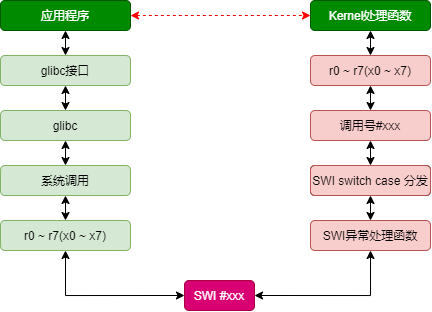

# ARM SWI

SWI指令引起软件中断异常，为操作系统应用程序调用系统接口提供的一种机制

## 参考文档

* [ARM 软中断指令SWI](https://blog.csdn.net/zqixiao_09/article/details/50776191)

## 简要描述

* 软中断是利用硬件中断的概念，用软件方式进行模拟，实现从用户模式切换到特权模式并执行特权程序的机制。
* 硬件中断是由电平的物理特性决定，在电平变化时引发中断操作，而软中断是通过一条具体指令SWI，引发中断操作，也就是说用户程序里可以通过写入SWI指令来切换到特权模式，当CPU执行到SWI指令时会从用户模式切换到管理模式下，执行软件中断处理。由于SWI指令由操作系统提供的API封装起来，并且软件中断处理程序也是操作系统编写者提前写好的，因此用户程序调用API时就是将操作权限交给了操作系统，所以用户程序还是不能随意访问硬件。

## 汇编处理流程

* CPU执行到`swi xxx`执行后，产生软件中断，由异常处理部分知识可知，软中断产生后CPU将强制将PC的值置为异常向量表地址0x08，在异常向量表0x08处安放跳转指令`b HandleSWI`，这样CPU就跳往我们自己定义的HandleSWI处执行；
* 软中断处理中通过`STMFD  SP!, {R0-R12,  LR}`要保存程序执行现场，将R0~R12通用寄存器数据保存在管理模式下SP栈内，LR由硬件自动保存软中断指令下一条指令的地址（后面利用LR的地址取得SWI指令编码），该寄存器值也保存在SP栈内，将来处理完毕之后返回；
* 由SWI指令编码知识可知，SWI指令低24位保存有软中断号，通过`LDR R4, [LR, #-4]`指令，取得SWI指令编码（LR为硬件自动保存`SWI xxx`指令的下一条指令地址，LR – 4就是SWI指令地址），将其保存在R4寄存器中。通过`BIC R4, R4, #0xFF000000`指令将SWI指令高8位清除掉，只保留低24位立即数，取得swi指令编码；
* 根据24位立即数中的软中断号判断用户程序的请求操作。如果24位立即数为1，表示led_on系统调用产生的软中断，则在管理模式下调用对应的亮灯操作do_led_on。如果24位立即数为2，表示led_off系统调用产生的软中断，则调用灭灯操作do_led_on，根据ATPCS调用规则，R0~R3做为参数传递寄存器，在软中断处理中没有使用这4个寄存器，而是使用R4作为操作寄存器的。
* 执行完系统调用操作之后，返回到swi_return（在调用对应系统操作时，通过`LDREQ LR, =swi_return`设置了返回地址），执行返回处理，通过`LDMIA SP!, {R0-R12, PC}^`指令将用户寄存器数据恢复到R0~R12，将进入软中断处理时保存的返回地址LR的值恢复给PC，实现程序返回，同时还恢复了状态寄存器。切换回用户模式下程序中继续执行。

