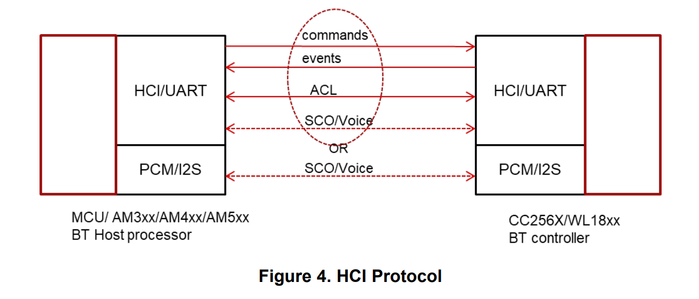

# btmon HCI ACL

理解Bluetooth HCI及BTSnoop是什么

## 参考文档

* [Capturing_Bluetooth_Host_Controller_Interface_HCI_Logs.pdf](refers/Capturing_Bluetooth_Host_Controller_Interface_HCI_Logs.pdf)
* [BT_HCI.curf](refers/BT_HCI.curf)
  * btmgmt -r BT_HCI.curf > BT_HCI.txt
    * [BT_HCI.txt](refers/BT_HCI.txt)

## HCI Protocol

HCI protocol defines how commands, events, and asynchronous and synchronous data packets are exchanged. Asynchronous packets (ACL) are used for data transfer, while synchronous packets (SCO) are used for voice with handset and hands-free profiles.

之前不理解的SCO，这张图里很好的解释了，SCO就是我一般配置的蓝牙模块的，蓝牙语音模块的PCM接口



## BTSnoop Logs in a Linux/Android Environment

Application processors with Linux® or Android™ operating systems, provide HCI logging at the stack level before the HCI packets are transferred to the UART driver.

## bluetoothctl

```
[bluetooth]# pair 4E:B9:A8:0E:31:25
Attempting to pair with 4E:B9:A8:0E:31:25
[CHG] Device 4E:B9:A8:0E:31:25 Connected: yes
[NEW] Primary Service
        /org/bluez/hci0/dev_4E_B9_A8_0E_31_25/service0001
        00001801-0000-1000-8000-00805f9b34fb
        Generic Attribute Profile
[NEW] Characteristic
        /org/bluez/hci0/dev_4E_B9_A8_0E_31_25/service0001/char0002
        00002a05-0000-1000-8000-00805f9b34fb
        Service Changed
[NEW] Primary Service
        /org/bluez/hci0/dev_4E_B9_A8_0E_31_25/service0028
        49535343-fe7d-4ae5-8fa9-9fafd205e455
        Vendor specific
[NEW] Characteristic
        /org/bluez/hci0/dev_4E_B9_A8_0E_31_25/service0028/char0029
        49535343-1e4d-4bd9-ba61-23c647249616
        Vendor specific
[NEW] Characteristic
        /org/bluez/hci0/dev_4E_B9_A8_0E_31_25/service0028/char002b
        49535343-8841-43f4-a8d4-ecbe34729bb3
        Vendor specific
[CHG] Device 4E:B9:A8:0E:31:25 UUIDs: 00001800-0000-1000-8000-00805f9b34fb
[CHG] Device 4E:B9:A8:0E:31:25 UUIDs: 00001801-0000-1000-8000-00805f9b34fb
[CHG] Device 4E:B9:A8:0E:31:25 UUIDs: 49535343-fe7d-4ae5-8fa9-9fafd205e455
[CHG] Device 4E:B9:A8:0E:31:25 ServicesResolved: yes
Request confirmation
[agent] Confirm passkey 826187 (yes/no): yes
Failed to pair: org.bluez.Error.AuthenticationFailed
[CHG] Device 4E:B9:A8:0E:31:25 ServicesResolved: no
[CHG] Device 4E:B9:A8:0E:31:25 Connected: no
[DEL] Characteristic
        /org/bluez/hci0/dev_4E_B9_A8_0E_31_25/service0001/char0002
        00002a05-0000-1000-8000-00805f9b34fb
        Service Changed
[DEL] Primary Service
        /org/bluez/hci0/dev_4E_B9_A8_0E_31_25/service0001
        00001801-0000-1000-8000-00805f9b34fb
        Generic Attribute Profile
[DEL] Characteristic
        /org/bluez/hci0/dev_4E_B9_A8_0E_31_25/service0028/char0029
        49535343-1e4d-4bd9-ba61-23c647249616
        Vendor specific
[DEL] Characteristic
        /org/bluez/hci0/dev_4E_B9_A8_0E_31_25/service0028/char002b
        49535343-8841-43f4-a8d4-ecbe34729bb3
        Vendor specific
[DEL] Primary Service
        /org/bluez/hci0/dev_4E_B9_A8_0E_31_25/service0028
        49535343-fe7d-4ae5-8fa9-9fafd205e455
        Vendor specific
[DEL] Device 4E:B9:A8:0E:31:25 M50_CDEF
```

## master

```
< HCI Command: LE Set Scan Enable (0x08|0x000c) plen 2                     #6888 [hci0] 22761.424283           // scan off
        Scanning: Disabled (0x00)
        Filter duplicates: Disabled (0x00)
> HCI Event: Command Complete (0x0e) plen 4                                #6889 [hci0] 22761.425330
      LE Set Scan Enable (0x08|0x000c) ncmd 1
        Status: Success (0x00)
@ MGMT Event: Discovering (0x0013) plen 2                               {0x0003} [hci0] 22761.425415
        Address type: 0x06
          LE Public
          LE Random
        Discovery: Disabled (0x00)
@ MGMT Event: Discovering (0x0013) plen 2                               {0x0002} [hci0] 22761.425415
        Address type: 0x06
          LE Public
          LE Random
        Discovery: Disabled (0x00)
@ MGMT Event: Discovering (0x0013) plen 2                               {0x0001} [hci0] 22761.425415
        Address type: 0x06
          LE Public
          LE Random
        Discovery: Disabled (0x00)
@ MGMT Command: Pair Device (0x0019) plen 8                             {0x0001} [hci0] 22774.959657        // pair 4E:B9:A8:0E:31:25
        LE Address: 4E:B9:A8:0E:31:25 (Resolvable)
        Capability: DisplayYesNo (0x01)
< HCI Command: LE Remove Device From White List (0x08|0x0012) plen 7       #6890 [hci0] 22774.959820
        Address type: Random (0x01)
        Address: 78:46:09:12:2A:EB (Resolvable)
> HCI Event: Command Complete (0x0e) plen 4                                #6891 [hci0] 22774.960182
      LE Remove Device From White List (0x08|0x0012) ncmd 1
        Status: Success (0x00)
< HCI Command: LE Add Device To White List (0x08|0x0011) plen 7            #6892 [hci0] 22774.960247        // 设置LE过滤器
        Address type: Random (0x01)
        Address: 4E:B9:A8:0E:31:25 (Resolvable)
> HCI Event: Command Complete (0x0e) plen 4                                #6893 [hci0] 22774.960711
      LE Add Device To White List (0x08|0x0011) ncmd 1
        Status: Success (0x00)
< HCI Command: LE Set Scan Parameters (0x08|0x000b) plen 7                 #6894 [hci0] 22774.960775        // 设置LE扫描参数
        Type: Passive (0x00)
        Interval: 60.000 msec (0x0060)
        Window: 30.000 msec (0x0030)
        Own address type: Public (0x00)
        Filter policy: Ignore not in white list (0x01)
> HCI Event: Command Complete (0x0e) plen 4                                #6895 [hci0] 22774.961100
      LE Set Scan Parameters (0x08|0x000b) ncmd 1
        Status: Success (0x00)
< HCI Command: LE Set Scan Enable (0x08|0x000c) plen 2                     #6896 [hci0] 22774.961155        // 开始扫描
        Scanning: Enabled (0x01)
        Filter duplicates: Enabled (0x01)
> HCI Event: Command Complete (0x0e) plen 4                                #6897 [hci0] 22774.961675
      LE Set Scan Enable (0x08|0x000c) ncmd 1
        Status: Success (0x00)
> HCI Event: LE Meta Event (0x3e) plen 43                                  #6898 [hci0] 22775.142408        // 扫描倒指定设备
      LE Advertising Report (0x02)
        Num reports: 1
        Event type: Connectable undirected - ADV_IND (0x00)
        Address type: Random (0x01)
        Address: 4E:B9:A8:0E:31:25 (Resolvable)
        Data length: 31
        Flags: 0x02
          LE General Discoverable Mode
        Name (complete): M50_CDEF
        128-bit Service UUIDs (complete): 1 entry
          Vendor specific (49535343-fe7d-4ae5-8fa9-9fafd205e455)
        RSSI: -64 dBm (0xc0)
< HCI Command: LE Set Scan Enable (0x08|0x000c) plen 2                     #6899 [hci0] 22775.142481        // 停止扫描
        Scanning: Disabled (0x00)
        Filter duplicates: Disabled (0x00)
> HCI Event: Command Complete (0x0e) plen 4                                #6900 [hci0] 22775.144472
      LE Set Scan Enable (0x08|0x000c) ncmd 1
        Status: Success (0x00)
< HCI Command: LE Create Connection (0x08|0x000d) plen 25                  #6901 [hci0] 22775.144522        // 创建连接，这里面有类似心跳包的参数
        Scan interval: 60.000 msec (0x0060)
        Scan window: 60.000 msec (0x0060)
        Filter policy: White list is not used (0x00)
        Peer address type: Random (0x01)
        Peer address: 4E:B9:A8:0E:31:25 (Resolvable)
        Own address type: Public (0x00)
        Min connection interval: 30.00 msec (0x0018)
        Max connection interval: 50.00 msec (0x0028)
        Connection latency: 0 (0x0000)
        Supervision timeout: 420 msec (0x002a)
        Min connection length: 0.000 msec (0x0000)
        Max connection length: 0.000 msec (0x0000)
> HCI Event: Command Status (0x0f) plen 4                                  #6902 [hci0] 22775.145057        // 控制器表示OK
      LE Create Connection (0x08|0x000d) ncmd 1
        Status: Success (0x00)
> HCI Event: LE Meta Event (0x3e) plen 19                                  #6903 [hci0] 22777.183404        // 收到Slave端发过来的SDP信息
      LE Connection Complete (0x01)
        Status: Success (0x00)
        Handle: 64
        Role: Master (0x00)
        Peer address type: Random (0x01)
        Peer address: 4E:B9:A8:0E:31:25 (Resolvable)
        Connection interval: 48.75 msec (0x0027)
        Connection latency: 0 (0x0000)
        Supervision timeout: 420 msec (0x002a)
        Master clock accuracy: 0x00
@ MGMT Event: Device Connected (0x000b) plen 44                         {0x0003} [hci0] 22777.183470        // 收到第1次状态
        LE Address: 4E:B9:A8:0E:31:25 (Resolvable)
        Flags: 0x00000000
        Data length: 31
        Flags: 0x02
          LE General Discoverable Mode
        Name (complete): M50_CDEF
        128-bit Service UUIDs (complete): 1 entry
          Vendor specific (49535343-fe7d-4ae5-8fa9-9fafd205e455)
@ MGMT Event: Device Connected (0x000b) plen 44                         {0x0002} [hci0] 22777.183470        // 收到第2次状态
        LE Address: 4E:B9:A8:0E:31:25 (Resolvable)
        Flags: 0x00000000
        Data length: 31
        Flags: 0x02
          LE General Discoverable Mode
        Name (complete): M50_CDEF
        128-bit Service UUIDs (complete): 1 entry
          Vendor specific (49535343-fe7d-4ae5-8fa9-9fafd205e455)
@ MGMT Event: Device Connected (0x000b) plen 44                         {0x0001} [hci0] 22777.183470        // 收到第3次状态
        LE Address: 4E:B9:A8:0E:31:25 (Resolvable)
        Flags: 0x00000000
        Data length: 31
        Flags: 0x02
          LE General Discoverable Mode
        Name (complete): M50_CDEF
        128-bit Service UUIDs (complete): 1 entry
          Vendor specific (49535343-fe7d-4ae5-8fa9-9fafd205e455)
< HCI Command: LE Read Remote Used Features (0x08|0x0016) plen 2           #6904 [hci0] 22777.183672        // 读取Slave特性
        Handle: 64
> HCI Event: Command Status (0x0f) plen 4                                  #6905 [hci0] 22777.184822
      LE Read Remote Used Features (0x08|0x0016) ncmd 1
        Status: Success (0x00)
> HCI Event: Command Complete (0x0e) plen 14                               #6906 [hci0] 22777.184833        // 命令发送成功
      LE Read Remote Used Features (0x08|0x0016) ncmd 1
        Status: Success (0x00)
        00 00 00 00 00 00 00 00 00 00                    ..........
> HCI Event: LE Meta Event (0x3e) plen 12                                  #6907 [hci0] 22777.235452        // 来自Slave特性
      LE Read Remote Used Features (0x04)
        Status: Success (0x00)
        Handle: 64
        Features: 0x3d 0x00 0x00 0x00 0x00 0x00 0x00 0x00
          LE Encryption
          Extended Reject Indication
          Slave-initiated Features Exchange
          LE Ping
          LE Data Packet Length Extension
< ACL Data TX: Handle 64 flags 0x00 dlen 11                                #6908 [hci0] 22777.235604        // 发送给Salve信息
      SMP: Pairing Request (0x01) len 6
        IO capability: DisplayYesNo (0x01)
        OOB data: Authentication data not present (0x00)
        Authentication requirement: Bonding, MITM, SC, No Keypresses (0x0d)
        Max encryption key size: 16
        Initiator key distribution: EncKey Sign (0x05)
        Responder key distribution: EncKey IdKey Sign (0x07)
= bluetoothd: No cache for 4E:B9:A8:0E:31:25                                            22777.249417
< ACL Data TX: Handle 64 flags 0x00 dlen 7                                 #6909 [hci0] 22777.249602        // 发送MTU请求
      ATT: Exchange MTU Request (0x02) len 2
        Client RX MTU: 517
> HCI Event: LE Meta Event (0x3e) plen 11                                  #6910 [hci0] 22777.333030
      LE Data Length Change (0x07)
        Handle: 64
        Max TX octets: 251
        Max TX time: 2120
        Max RX octets: 251
        Max RX time: 2120
> HCI Event: Number of Completed Packets (0x13) plen 5                     #6911 [hci0] 22777.382123
        Num handles: 1
        Handle: 64
        Count: 2
> ACL Data RX: Handle 64 flags 0x02 dlen 7                                 #6912 [hci0] 22777.430237        // MTU反馈数据
      ATT: Exchange MTU Response (0x03) len 2
        Server RX MTU: 517
< ACL Data TX: Handle 64 flags 0x00 dlen 11                                #6913 [hci0] 22777.430399        // 读取Primary Service服务信息
      ATT: Read By Group Type Request (0x10) len 6
        Handle range: 0x0001-0xffff
        Attribute group type: Primary Service (0x2800)
> ACL Data RX: Handle 64 flags 0x02 dlen 18                                #6914 [hci0] 22777.625367        // Slave提供的Primary Service信息
      ATT: Read By Group Type Response (0x11) len 13
        Attribute data length: 6
        Attribute group list: 2 entries
        Handle range: 0x0001-0x0003
        UUID: Generic Attribute Profile (0x1801)
        Handle range: 0x0014-0x001a
        UUID: Generic Access Profile (0x1800)
< ACL Data TX: Handle 64 flags 0x00 dlen 11                                #6915 [hci0] 22777.625533        // 读取Primary Service服务信息
      ATT: Read By Group Type Request (0x10) len 6
        Handle range: 0x001b-0xffff
        Attribute group type: Primary Service (0x2800)
> HCI Event: Number of Completed Packets (0x13) plen 5                     #6916 [hci0] 22777.674215
        Num handles: 1
        Handle: 64
        Count: 2
> ACL Data RX: Handle 64 flags 0x02 dlen 26                                #6917 [hci0] 22777.723381        // Slave提供的Primary Service信息
      ATT: Read By Group Type Response (0x11) len 21
        Attribute data length: 20
        Attribute group list: 1 entry
        Handle range: 0x0028-0xffff
        UUID: Vendor specific (49535343-fe7d-4ae5-8fa9-9fafd205e455)
< ACL Data TX: Handle 64 flags 0x00 dlen 11                                #6918 [hci0] 22777.723660        // 读取Primary Service服务信息
      ATT: Read By Group Type Request (0x10) len 6
        Handle range: 0x0001-0xffff
        Attribute group type: Secondary Service (0x2801)
> ACL Data RX: Handle 64 flags 0x02 dlen 9                                 #6919 [hci0] 22777.820272        // 到末尾了
      ATT: Error Response (0x01) len 4
        Read By Group Type Request (0x10)
        Handle: 0x0001
        Error: Unsupported Group Type (0x10)
< ACL Data TX: Handle 64 flags 0x00 dlen 11                                #6920 [hci0] 22777.820422        // 获取Type请求
      ATT: Read By Type Request (0x08) len 6
        Handle range: 0x0001-0xffff
        Attribute type: Include (0x2802)
> HCI Event: Number of Completed Packets (0x13) plen 5                     #6921 [hci0] 22777.869214
        Num handles: 1
        Handle: 64
        Count: 2
> ACL Data RX: Handle 64 flags 0x02 dlen 9                                 #6922 [hci0] 22777.917772        // 没有属性
      ATT: Error Response (0x01) len 4
        Read By Type Request (0x08)
        Handle: 0x0001
        Error: Attribute Not Found (0x0a)
< ACL Data TX: Handle 64 flags 0x00 dlen 11                                #6923 [hci0] 22777.917926        // 获取Type请求
      ATT: Read By Type Request (0x08) len 6
        Handle range: 0x0001-0xffff
        Attribute type: Characteristic (0x2803)
> ACL Data RX: Handle 64 flags 0x02 dlen 34                                #6924 [hci0] 22778.064695        // 返回属性
      ATT: Read By Type Response (0x09) len 29
        Attribute data length: 7
        Attribute data list: 4 entries
        Handle: 0x0002
        Value: 200300052a
        Handle: 0x0015
        Value: 021600002a
        Handle: 0x0017
        Value: 021800012a
        Handle: 0x0019
        Value: 021a00a62a
< ACL Data TX: Handle 64 flags 0x00 dlen 11                                #6925 [hci0] 22778.064987        // 获取Type请求
      ATT: Read By Type Request (0x08) len 6
        Handle range: 0x001a-0xffff
        Attribute type: Characteristic (0x2803)
> HCI Event: Number of Completed Packets (0x13) plen 5                     #6926 [hci0] 22778.112989
        Num handles: 1
        Handle: 64
        Count: 2
> ACL Data RX: Handle 64 flags 0x02 dlen 48                                #6927 [hci0] 22778.162245        // 返回属性
      ATT: Read By Type Response (0x09) len 43
        Attribute data length: 21
        Attribute data list: 2 entries
        Handle: 0x0029
        Value: 102a0016962447c62361bad94b4d1e43535349
        Handle: 0x002b
        Value: 082c00b39b7234beecd4a8f443418843535349
< ACL Data TX: Handle 64 flags 0x00 dlen 11                                #6928 [hci0] 22778.162525        // 获取Type请求
      ATT: Read By Type Request (0x08) len 6
        Handle range: 0x002c-0xffff
        Attribute type: Characteristic (0x2803)
> ACL Data RX: Handle 64 flags 0x02 dlen 9                                 #6929 [hci0] 22778.259055        // 返回属性
      ATT: Error Response (0x01) len 4
        Read By Type Request (0x08)
        Handle: 0x002c
        Error: Attribute Not Found (0x0a)
< ACL Data TX: Handle 64 flags 0x00 dlen 9                                 #6930 [hci0] 22778.259455        // 获取信息
      ATT: Find Information Request (0x04) len 4
        Handle range: 0x002d-0xffff
> HCI Event: Number of Completed Packets (0x13) plen 5                     #6931 [hci0] 22778.356736
        Num handles: 1
        Handle: 64
        Count: 2
> ACL Data RX: Handle 64 flags 0x02 dlen 9                                 #6932 [hci0] 22778.405312        // 返回未找到信息
      ATT: Error Response (0x01) len 4
        Find Information Request (0x04)
        Handle: 0x002d
        Error: Attribute Not Found (0x0a)
< ACL Data TX: Handle 64 flags 0x00 dlen 7                                 #6933 [hci0] 22778.410951        // 读取0x0016
      ATT: Read Request (0x0a) len 2
        Handle: 0x0016
> ACL Data RX: Handle 64 flags 0x02 dlen 13                                #6934 [hci0] 22778.502848        // 返回值
      ATT: Read Response (0x0b) len 8
        Value: 4d35305f43444546
< ACL Data TX: Handle 64 flags 0x00 dlen 7                                 #6935 [hci0] 22778.503179        // 读取0x0018
      ATT: Read Request (0x0a) len 2
        Handle: 0x0018
> HCI Event: Number of Completed Packets (0x13) plen 5                     #6936 [hci0] 22778.600476
        Num handles: 1
        Handle: 64
        Count: 2
> ACL Data RX: Handle 64 flags 0x02 dlen 7                                 #6937 [hci0] 22778.649044        // 返回值
      ATT: Read Response (0x0b) len 2
        Value: 0000
> ACL Data RX: Handle 64 flags 0x02 dlen 11                                #6938 [hci0] 22781.720424        // 配对响应信息
      SMP: Pairing Response (0x02) len 6
        IO capability: KeyboardDisplay (0x04)
        OOB data: Authentication data not present (0x00)
        Authentication requirement: Bonding, MITM, SC, No Keypresses, CT2 (0x2d)
        Max encryption key size: 16
        Initiator key distribution: EncKey Sign (0x05)
        Responder key distribution: EncKey IdKey Sign (0x07)
< ACL Data TX: Handle 64 flags 0x00 dlen 69                                #6939 [hci0] 22781.729385        // 发送配对公钥
      SMP: Pairing Public Key (0x0c) len 64
        X: 92c50ce79c2f4840ecc56d0855b8712d2946bfcf24e82df2741a7d47411bb23e
        Y: e3b45a32df61020b7cb43b0299ac8263e7ae41b5e35deee91bc4e2474dac50e9
> ACL Data RX: Handle 64 flags 0x02 dlen 69                                #6940 [hci0] 22781.818683        // 接收配对公钥
      SMP: Pairing Public Key (0x0c) len 64
        X: 55640222680ba11021a80586f0fa25905e40aee1f94a91e27115aeb3b86091ab
        Y: c976eb1fd1be1a9fd21b17454f84c64ded0263796cff7065b5bde8f002bd010d
> ACL Data RX: Handle 64 flags 0x02 dlen 21                                #6941 [hci0] 22781.866789        // Slave确认开始配对
      SMP: Pairing Confirm (0x03) len 16
        Confim value: c52df73799379d5ae65fc219cd258a89
< ACL Data TX: Handle 64 flags 0x00 dlen 21                                #6942 [hci0] 22781.866847        // 发送配对随机数
      SMP: Pairing Random (0x04) len 16
        Random value: d698c7970146cd1104a850092b5245f7
> HCI Event: Number of Completed Packets (0x13) plen 5                     #6943 [hci0] 22781.915678
        Num handles: 1
        Handle: 64
        Count: 2
> ACL Data RX: Handle 64 flags 0x02 dlen 21                                #6944 [hci0] 22781.964298        // 接收配对随机数
      SMP: Pairing Random (0x04) len 16
        Random value: dbfa3aa4dca08921050972fcff550257
@ MGMT Event: User Confirmation Request (0x000f) plen 12                {0x0003} [hci0] 22781.964397        // Master端yes确认配对
        LE Address: 4E:B9:A8:0E:31:25 (Resolvable)
        Confirm hint: 0x00
        Value: 0x000c9b4b
@ MGMT Event: User Confirmation Request (0x000f) plen 12                {0x0002} [hci0] 22781.964397
        LE Address: 4E:B9:A8:0E:31:25 (Resolvable)
        Confirm hint: 0x00
        Value: 0x000c9b4b
@ MGMT Event: User Confirmation Request (0x000f) plen 12                {0x0001} [hci0] 22781.964397
        LE Address: 4E:B9:A8:0E:31:25 (Resolvable)
        Confirm hint: 0x00
        Value: 0x000c9b4b
@ MGMT Command: User Confirmation Reply (0x001c) plen 7                 {0x0001} [hci0] 22788.824815
        LE Address: 4E:B9:A8:0E:31:25 (Resolvable)
< ACL Data TX: Handle 64 flags 0x00 dlen 21                                #6945 [hci0] 22788.824889        // 发送配对DHKey Check
      SMP: Pairing DHKey Check (0x0d) len 16
        E: ce432db97a2f16812790773da4ccf438
@ MGMT Event: Command Complete (0x0001) plen 10                         {0x0001} [hci0] 22788.824964        // Slave端yes确认配对
      User Confirmation Reply (0x001c) plen 7
        Status: Success (0x00)
        LE Address: 4E:B9:A8:0E:31:25 (Resolvable)
> ACL Data RX: Handle 64 flags 0x02 dlen 6                                 #6946 [hci0] 22788.886829        // Slave端DHKey check失败
      SMP: Pairing Failed (0x05) len 1
        Reason: DHKey check failed (0x0b)
@ MGMT Event: Authentication Failed (0x0011) plen 8                     {0x0003} [hci0] 22788.886869        // 认证失败
        LE Address: 4E:B9:A8:0E:31:25 (Resolvable)
        Status: Authentication Failed (0x05)
@ MGMT Event: Authentication Failed (0x0011) plen 8                     {0x0002} [hci0] 22788.886869
        LE Address: 4E:B9:A8:0E:31:25 (Resolvable)
        Status: Authentication Failed (0x05)
@ MGMT Event: Command Complete (0x0001) plen 10                         {0x0001} [hci0] 22788.886901
      Pair Device (0x0019) plen 7
        Status: Authentication Failed (0x05)
        LE Address: 4E:B9:A8:0E:31:25 (Resolvable)
< HCI Command: Disconnect (0x01|0x0006) plen 3                             #6947 [hci0] 22788.886958        // 断开连接
        Handle: 64
        Reason: Authentication Failure (0x05)
> HCI Event: Command Status (0x0f) plen 4                                  #6948 [hci0] 22788.887506
      Disconnect (0x01|0x0006) ncmd 1
        Status: Success (0x00)
> HCI Event: Number of Completed Packets (0x13) plen 5                     #6949 [hci0] 22788.936197
        Num handles: 1
        Handle: 64
        Count: 1
> HCI Event: Disconnect Complete (0x05) plen 4                             #6950 [hci0] 22788.936296        // 断开连接成功
        Status: Success (0x00)
        Handle: 64
        Reason: Connection Terminated By Local Host (0x16)
@ MGMT Event: Device Disconnected (0x000c) plen 8                       {0x0003} [hci0] 22788.936333
        LE Address: 4E:B9:A8:0E:31:25 (Resolvable)
        Reason: Connection terminated by local host (0x02)
@ MGMT Event: Device Disconnected (0x000c) plen 8                       {0x0002} [hci0] 22788.936333
        LE Address: 4E:B9:A8:0E:31:25 (Resolvable)
        Reason: Connection terminated by local host (0x02)
@ MGMT Event: Device Disconnected (0x000c) plen 8                       {0x0001} [hci0] 22788.936333
        LE Address: 4E:B9:A8:0E:31:25 (Resolvable)
        Reason: Connection terminated by local host (0x02)
```

## Slave

```
< HCI Command: LE Set Extended Adverti.. (0x08|0x0036) plen 25  #413 429.128432                 // 设置LE PHY
        Handle: 0x00
        Properties: 0x0013
          Connectable
          Scannable
          Use legacy advertising PDUs: ADV_IND
        Min advertising interval: 1000.000 msec (0x0640)
        Max advertising interval: 1031.250 msec (0x0672)
        Channel map: 37, 38, 39 (0x07)
        Own address type: Random (0x01)
        Peer address type: Public (0x00)
        Peer address: 00:00:00:00:00:00 (OUI 00-00-00)
        Filter policy: Allow Scan Request from Any, Allow Connect Request from Any (0x00)
        TX power: -7 dbm (0xfffffff9)
        Primary PHY: LE 1M (0x01)
        Secondary max skip: 0x00
        Secondary PHY: LE 1M (0x01)
        SID: 0x01
        Scan request notifications: Disabled (0x00)
> HCI Event: Command Complete (0x0e) plen 5                     #414 429.131094
      LE Set Extended Advertising Parameters (0x08|0x0036) ncmd 1
        Status: Success (0x00)
        TX power (selected): -10 dbm (0xfffffff6)
< HCI Command: LE Set Advertising Set R.. (0x08|0x0035) plen 7  #415 429.132240                 // 设置随机MAC
        Advertising handle: 0x00
        Advertising random address: 4E:B9:A8:0E:31:25 (OUI 4E-B9-A8)
> HCI Event: Command Complete (0x0e) plen 4                     #416 429.134501
      LE Set Advertising Set Random Address (0x08|0x0035) ncmd 1
        Status: Success (0x00)
< HCI Command: LE Set Extended Adverti.. (0x08|0x0037) plen 35  #417 429.135229                 // 设置Name，Services，Master在制定扫描设备的时候，Slave会把这部分数据发给Master
        Handle: 0x00
        Operation: Complete extended advertising data (0x03)
        Fragment preference: Minimize fragmentation (0x01)
        Data length: 0x1f
        Flags: 0x02
          LE General Discoverable Mode
        Name (complete): M50_CDEF
        128-bit Service UUIDs (complete): 1 entry
          Vendor specific (49535343-fe7d-4ae5-8fa9-9fafd205e455)
> HCI Event: Command Complete (0x0e) plen 4                     #418 429.137734
      LE Set Extended Advertising Data (0x08|0x0037) ncmd 1
        Status: Success (0x00)
< HCI Command: LE Set Extended Scan Res.. (0x08|0x0038) plen 4  #419 429.138520                 // 设置被扫描response参数
        Handle: 0x00
        Operation: Complete scan response data (0x03)
        Fragment preference: Minimize fragmentation (0x01)
        Data length: 0x00
> HCI Event: Command Complete (0x0e) plen 4                     #420 429.140511
      LE Set Extended Scan Response Data (0x08|0x0038) ncmd 1
        Status: Success (0x00)
< HCI Command: LE Set Extended Advertis.. (0x08|0x0039) plen 6  #421 429.141860                 // 启动广播
        Extended advertising: Enabled (0x01)
        Number of sets: 1 (0x01)
        Entry 0
          Handle: 0x00
          Duration: 0 ms (0x00)
          Max ext adv events: 0
> HCI Event: Command Complete (0x0e) plen 4                     #422 429.144196
      LE Set Extended Advertising Enable (0x08|0x0039) ncmd 1
        Status: Success (0x00)
> HCI Event: LE Meta Event (0x3e) plen 31                       #423 451.590861                 // 收到连接事件
      LE Enhanced Connection Complete (0x0a)
        Status: Success (0x00)
        Handle: 512
        Role: Slave (0x01)
        Peer address type: Resolved Public (0x02)
        Peer address: DC:A6:32:B2:F8:FF (OUI DC-A6-32)
        Local resolvable private address: 00:00:00:00:00:00 (Non-Resolvable)
        Peer resolvable private address: DC:A6:32:B2:F8:FF (Static)
        Connection interval: 48.75 msec (0x0027)
        Connection latency: 0 (0x0000)
        Supervision timeout: 420 msec (0x002a)
        Master clock accuracy: 0x01
> HCI Event: LE Meta Event (0x3e) plen 6                        #424 451.594197                 // 因为有连接进入，停止广播
      LE Advertising Set Terminated (0x12)
        Status: Success (0x00)
        Handle: 0
        Connection handle: 512
        Number of completed extended advertising events: 23
< HCI Command: LE Read Remote Used Feat.. (0x08|0x0016) plen 2  #425 451.598293                 // 读取Master特性
        Handle: 512
> HCI Event: Command Status (0x0f) plen 4                       #426 451.606531
      LE Read Remote Used Features (0x08|0x0016) ncmd 1
        Status: Success (0x00)
< HCI Command: LE Set Extended Advertis.. (0x08|0x0039) plen 6  #427 451.608516                 // 开始广播
        Extended advertising: Enabled (0x01)
        Number of sets: 1 (0x01)
        Entry 0
          Handle: 0x00
          Duration: 0 ms (0x00)
          Max ext adv events: 0
> HCI Event: LE Meta Event (0x3e) plen 12                       #428 451.613590                 // 获取Master特性
      LE Read Remote Used Features (0x04)
        Status: Success (0x00)
        Handle: 512
        Features: 0x3d 0x00 0x00 0x00 0x00 0x00 0x00 0x00
          LE Encryption
          Extended Reject Indication
          Slave-initiated Features Exchange
          LE Ping
          LE Data Packet Length Extension
> HCI Event: Command Complete (0x0e) plen 4                     #429 451.617390
      LE Set Extended Advertising Enable (0x08|0x0039) ncmd 1
        Status: Success (0x00)
< HCI Command: Read Remote Version Info.. (0x01|0x001d) plen 2  #430 451.619116                 // 获取Master版本信息
        Handle: 512
> HCI Event: Command Status (0x0f) plen 4                       #431 451.623869
      Read Remote Version Information (0x01|0x001d) ncmd 1
        Status: Success (0x00)
> HCI Event: LE Meta Event (0x3e) plen 11                       #432 451.691763
      LE Data Length Change (0x07)
        Handle: 512
        Max TX octets: 251
        Max TX time: 2120
        Max RX octets: 251
        Max RX time: 2120
> HCI Event: Read Remote Version Complete (0x0c) plen 8         #433 451.739064                 // Master反馈的蓝牙版本信息
        Status: Success (0x00)
        Handle: 512
        LMP version: Bluetooth 5.0 (0x09) - Subversion 24857 (0x6119)
        Manufacturer: Cypress Semiconductor Corporation (305)
< HCI Command: LE Set Extended Advertis.. (0x08|0x0039) plen 6  #434 451.782414                 // 禁用Advertising
        Extended advertising: Disabled (0x00)
        Number of sets: 1 (0x01)
        Entry 0
          Handle: 0x00
          Duration: 0 ms (0x00)
          Max ext adv events: 0
> ACL Data RX: Handle 512 flags 0x02 dlen 11                    #435 451.791442                 // 收到配对信息
      SMP: Pairing Request (0x01) len 6
        IO capability: DisplayYesNo (0x01)
        OOB data: Authentication data not present (0x00)
        Authentication requirement: Bonding, MITM, SC, No Keypresses (0x0d)
        Max encryption key size: 16
        Initiator key distribution: EncKey Sign (0x05)
        Responder key distribution: EncKey IdKey Sign (0x07)
> ACL Data RX: Handle 512 flags 0x02 dlen 7                     #436 451.798718                 // 收到MTU
      ATT: Exchange MTU Request (0x02) len 2
        Client RX MTU: 517
< ACL Data TX: Handle 512 flags 0x00 dlen 7                     #437 451.800968                 // 发送MTU
      ATT: Exchange MTU Response (0x03) len 2
        Server RX MTU: 517
> HCI Event: Command Complete (0x0e) plen 4                     #438 451.801695
      LE Set Extended Advertising Enable (0x08|0x0039) ncmd 1
        Status: Success (0x00)
< HCI Command: LE Remove Advertising Set (0x08|0x003c) plen 1   #439 451.802463
        Handle: 0
> HCI Event: Command Complete (0x0e) plen 4                     #440 451.806248
      LE Remove Advertising Set (0x08|0x003c) ncmd 1
        Status: Success (0x00)
> HCI Event: Number of Completed Packets (0x13) plen 5          #441 451.934320
        Num handles: 1
        Handle: 512
        Count: 1
> ACL Data RX: Handle 512 flags 0x02 dlen 11                    #442 451.977203                 // 接收到请求
      ATT: Read By Group Type Request (0x10) len 6
        Handle range: 0x0001-0xffff
        Attribute group type: Primary Service (0x2800)
< ACL Data TX: Handle 512 flags 0x00 dlen 18                    #443 451.978603                 // 反馈请求
      ATT: Read By Group Type Response (0x11) len 13
        Attribute data length: 6
        Attribute group list: 2 entries
        Handle range: 0x0001-0x0003
        UUID: Generic Attribute Profile (0x1801)
        Handle range: 0x0014-0x001a
        UUID: Generic Access Profile (0x1800)
> HCI Event: Number of Completed Packets (0x13) plen 5          #444 452.079157
        Num handles: 1
        Handle: 512
        Count: 1
> ACL Data RX: Handle 512 flags 0x02 dlen 11                    #445 452.082099                 // 接收到请求
      ATT: Read By Group Type Request (0x10) len 6
        Handle range: 0x001b-0xffff
        Attribute group type: Primary Service (0x2800)
< ACL Data TX: Handle 512 flags 0x00 dlen 26                    #446 452.083553                 // 反馈请求
      ATT: Read By Group Type Response (0x11) len 21
        Attribute data length: 20
        Attribute group list: 1 entry
        Handle range: 0x0028-0xffff
        UUID: Vendor specific (49535343-fe7d-4ae5-8fa9-9fafd205e455)
> HCI Event: Number of Completed Packets (0x13) plen 5          #447 452.175452
        Num handles: 1
        Handle: 512
        Count: 1
> ACL Data RX: Handle 512 flags 0x02 dlen 11                    #448 452.177505                 // 第二组服务
      ATT: Read By Group Type Request (0x10) len 6
        Handle range: 0x0001-0xffff
        Attribute group type: Secondary Service (0x2801)
< ACL Data TX: Handle 512 flags 0x00 dlen 9                     #449 452.178672                 // 没内容
      ATT: Error Response (0x01) len 4
        Read By Group Type Request (0x10)
        Handle: 0x0001
        Error: Unsupported Group Type (0x10)
> HCI Event: Number of Completed Packets (0x13) plen 5          #450 452.274581
        Num handles: 1
        Handle: 512
        Count: 1
> ACL Data RX: Handle 512 flags 0x02 dlen 11                    #451 452.276564
      ATT: Read By Type Request (0x08) len 6
        Handle range: 0x0001-0xffff
        Attribute type: Include (0x2802)
< ACL Data TX: Handle 512 flags 0x00 dlen 9                     #452 452.278464
      ATT: Error Response (0x01) len 4
        Read By Type Request (0x08)
        Handle: 0x0001
        Error: Attribute Not Found (0x0a)
> HCI Event: Number of Completed Packets (0x13) plen 5          #453 452.419744
        Num handles: 1
        Handle: 512
        Count: 1
> ACL Data RX: Handle 512 flags 0x02 dlen 11                    #454 452.421571
      ATT: Read By Type Request (0x08) len 6
        Handle range: 0x0001-0xffff
        Attribute type: Characteristic (0x2803)
< ACL Data TX: Handle 512 flags 0x00 dlen 34                    #455 452.423134
      ATT: Read By Type Response (0x09) len 29
        Attribute data length: 7
        Attribute data list: 4 entries
        Handle: 0x0002
        Value: 200300052a
        Handle: 0x0015
        Value: 021600002a
        Handle: 0x0017
        Value: 021800012a
        Handle: 0x0019
        Value: 021a00a62a
> HCI Event: Number of Completed Packets (0x13) plen 5          #456 452.517442
        Num handles: 1
        Handle: 512
        Count: 1
> ACL Data RX: Handle 512 flags 0x02 dlen 11                    #457 452.519349
      ATT: Read By Type Request (0x08) len 6
        Handle range: 0x001a-0xffff
        Attribute type: Characteristic (0x2803)
< ACL Data TX: Handle 512 flags 0x00 dlen 48                    #458 452.520566
      ATT: Read By Type Response (0x09) len 43
        Attribute data length: 21
        Attribute data list: 2 entries
        Handle: 0x0029
        Value: 102a0016962447c62361bad94b4d1e43535349
        Handle: 0x002b
        Value: 082c00b39b7234beecd4a8f443418843535349
> HCI Event: Number of Completed Packets (0x13) plen 5          #459 452.614069
        Num handles: 1
        Handle: 512
        Count: 1
> ACL Data RX: Handle 512 flags 0x02 dlen 11                    #460 452.615787
      ATT: Read By Type Request (0x08) len 6
        Handle range: 0x002c-0xffff
        Attribute type: Characteristic (0x2803)
< ACL Data TX: Handle 512 flags 0x00 dlen 9                     #461 452.617287
      ATT: Error Response (0x01) len 4
        Read By Type Request (0x08)
        Handle: 0x002c
        Error: Attribute Not Found (0x0a)
> HCI Event: Number of Completed Packets (0x13) plen 5          #462 452.760423
        Num handles: 1
        Handle: 512
        Count: 1
> ACL Data RX: Handle 512 flags 0x02 dlen 9                     #463 452.761656
      ATT: Find Information Request (0x04) len 4
        Handle range: 0x002d-0xffff
< ACL Data TX: Handle 512 flags 0x00 dlen 9                     #464 452.762339
      ATT: Error Response (0x01) len 4
        Find Information Request (0x04)
        Handle: 0x002d
        Error: Attribute Not Found (0x0a)
> HCI Event: Number of Completed Packets (0x13) plen 5          #465 452.857762
        Num handles: 1
        Handle: 512
        Count: 1
> ACL Data RX: Handle 512 flags 0x02 dlen 7                     #466 452.859730
      ATT: Read Request (0x0a) len 2
        Handle: 0x0016
< ACL Data TX: Handle 512 flags 0x00 dlen 13                    #467 452.860542
      ATT: Read Response (0x0b) len 8
        Value: 4d35305f43444546
> HCI Event: Number of Completed Packets (0x13) plen 5          #468 453.004430
        Num handles: 1
        Handle: 512
        Count: 1
> ACL Data RX: Handle 512 flags 0x02 dlen 7                     #469 453.005528
      ATT: Read Request (0x0a) len 2
        Handle: 0x0018
< ACL Data TX: Handle 512 flags 0x00 dlen 7                     #470 453.006227
      ATT: Read Response (0x0b) len 2
        Value: 0000
> HCI Event: Number of Completed Packets (0x13) plen 5          #471 453.150046
        Num handles: 1
        Handle: 512
        Count: 1
< ACL Data TX: Handle 512 flags 0x00 dlen 11                    #472 456.069956
      SMP: Pairing Response (0x02) len 6
        IO capability: KeyboardDisplay (0x04)
        OOB data: Authentication data not present (0x00)
        Authentication requirement: Bonding, MITM, SC, No Keypresses, CT2 (0x2d)
        Max encryption key size: 16
        Initiator key distribution: EncKey Sign (0x05)
        Responder key distribution: EncKey IdKey Sign (0x07)
< HCI Command: LE Rand (0x08|0x0018) plen 0                     #473 456.071758                 // 第一个随机数
> HCI Event: Command Complete (0x0e) plen 12                    #474 456.076499
      LE Rand (0x08|0x0018) ncmd 1
        Status: Success (0x00)
        Random number: 0xefc431cc2286e660
< HCI Command: LE Rand (0x08|0x0018) plen 0                     #475 456.078276                 // 第二个随机数
> HCI Event: Command Complete (0x0e) plen 12                    #476 456.082202
      LE Rand (0x08|0x0018) ncmd 1
        Status: Success (0x00)
        Random number: 0x94b7f06c22958110
< HCI Command: LE Rand (0x08|0x0018) plen 0                     #477 456.083558                 // 第三个随机数
> HCI Event: Command Complete (0x0e) plen 12                    #478 456.087250
      LE Rand (0x08|0x0018) ncmd 1
        Status: Success (0x00)
        Random number: 0x8be40ca1498fb2fc
< HCI Command: LE Rand (0x08|0x0018) plen 0                     #479 456.088009                 // 第四个随机数
> HCI Event: Command Complete (0x0e) plen 12                    #480 456.091582
      LE Rand (0x08|0x0018) ncmd 1
        Status: Success (0x00)
        Random number: 0x3500859d4ceb1e14
> HCI Event: Number of Completed Packets (0x13) plen 5          #481 456.172563
        Num handles: 1
        Handle: 512
        Count: 1
> ACL Data RX: Handle 512 flags 0x02 dlen 69                    #482 456.173930                 // 接收公钥
      SMP: Pairing Public Key (0x0c) len 64
        X: 92c50ce79c2f4840ecc56d0855b8712d2946bfcf24e82df2741a7d47411bb23e
        Y: e3b45a32df61020b7cb43b0299ac8263e7ae41b5e35deee91bc4e2474dac50e9
< ACL Data TX: Handle 512 flags 0x00 dlen 69                    #483 456.178594                 // 发送公钥
      SMP: Pairing Public Key (0x0c) len 64
        X: 55640222680ba11021a80586f0fa25905e40aee1f94a91e27115aeb3b86091ab
        Y: c976eb1fd1be1a9fd21b17454f84c64ded0263796cff7065b5bde8f002bd010d
< HCI Command: LE Rand (0x08|0x0018) plen 0                     #484 456.179568                 // 第五个随机数
> HCI Event: Command Complete (0x0e) plen 12                    #485 456.181887
      LE Rand (0x08|0x0018) ncmd 1
        Status: Success (0x00)
        Random number: 0x2189a0dca43afadb
< HCI Command: LE Rand (0x08|0x0018) plen 0                     #486 456.182765                 // 第六个随机数
> HCI Event: Command Complete (0x0e) plen 12                    #487 456.184418
      LE Rand (0x08|0x0018) ncmd 1
        Status: Success (0x00)
        Random number: 0x570255fffc720905
< ACL Data TX: Handle 512 flags 0x00 dlen 21                    #488 456.185643
      SMP: Pairing Confirm (0x03) len 16
        Confim value: c52df73799379d5ae65fc219cd258a89
> HCI Event: Number of Completed Packets (0x13) plen 5          #489 456.270301
        Num handles: 1
        Handle: 512
        Count: 1
> HCI Event: Number of Completed Packets (0x13) plen 5          #490 456.318947
        Num handles: 1
        Handle: 512
        Count: 1
> ACL Data RX: Handle 512 flags 0x02 dlen 21                    #491 456.320200
      SMP: Pairing Random (0x04) len 16
        Random value: d698c7970146cd1104a850092b5245f7
< ACL Data TX: Handle 512 flags 0x00 dlen 21                    #492 456.321221
      SMP: Pairing Random (0x04) len 16
        Random value: dbfa3aa4dca08921050972fcff550257
> HCI Event: Number of Completed Packets (0x13) plen 5          #493 456.415777
        Num handles: 1
        Handle: 512
        Count: 1
> ACL Data RX: Handle 512 flags 0x02 dlen 21                    #494 463.243986
      SMP: Pairing DHKey Check (0x0d) len 16
        E: ce432db97a2f16812790773da4ccf438
< ACL Data TX: Handle 512 flags 0x00 dlen 6                     #495 463.247089                 // Slave校验DHKey出错
      SMP: Pairing Failed (0x05) len 1
        Reason: DHKey check failed (0x0b)
> HCI Event: Number of Completed Packets (0x13) plen 5          #496 463.339506
        Num handles: 1
        Handle: 512
        Count: 1
> HCI Event: Disconnect Complete (0x05) plen 4                  #497 463.387965
        Status: Success (0x00)
        Handle: 512
        Reason: Authentication Failure (0x05)
< HCI Command: Delete Stored Link Key (0x03|0x0012) plen 7      #498 463.394098
        Address: DC:A6:32:B2:F8:FF (OUI DC-A6-32)
        Delete all: 0x00
> HCI Event: Command Complete (0x0e) plen 6                     #499 463.397412
      Delete Stored Link Key (0x03|0x0012) ncmd 1
        Status: Success (0x00)
        Num keys: 0
```