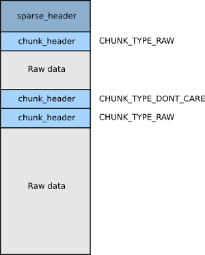

# Fastboot flash Sparse Image

分析fastboot命令flash文件原理，理解sparse image原理

## lk写入Debug输出调试log

执行`fastboot flash lk lk-verified.img`时，LK输出log如下：

```
[25183] [fastboot: command buf]-[getvar:partition-type:lk]-[len=24]
[25184] [fastboot]-[download_base:0x48b00000]-[download_size:0x85e0]
[25185] [Cmd process]-[buf:getvar:partition-type:lk]-[lenBuf:partition-type:lk]
[SEC_USBDL] 0x22, NSC
[25186] [fastboot: command buf]-[getvar:max-download-size]-[len=24]
[25187] [fastboot]-[download_base:0x48b00000]-[download_size:0x85e0]
[25188] [Cmd process]-[buf:getvar:max-download-size]-[lenBuf:max-download-size]
[SEC_USBDL] 0x22, NSC
[25190] [fastboot: command buf]-[download:000d7d5e]-[len=17]
[25191] [fastboot]-[download_base:0x48b00000]-[download_size:0x85e0]
[25192] [Cmd process]-[buf:download:000d7d5e]-[lenBuf:000d7d5e]
[SEC_USBDL] 0x22, NSC
[25212] [fastboot: command buf]-[flash:lk]-[len=8]
[25213] [fastboot]-[download_base:0x48b00000]-[download_size:0xd7d5e]
[25214] [Cmd process]-[buf:flash:lk]-[lenBuf:lk]
[SEC_USBDL] 0x22, NSC
[25215] [PROFILE] mmc read 24 blks in 0 ms: 8KB/s
[25216] singlebootloader bootloader xxxxxxxxxxxxxxxxxxxxxxxxxxx
[25217] [PROFILE] mmc read 24 blks in 0 ms: 8KB/s
[25218] [SEC_POLICY] sboot_state = 0x0
[25218] [SEC_POLICY] lock_state = 0x3
paddr=0x48b00000, saddr=0x48bd7c42, psize=0xd7c42, ssize=0x100, pk_index=0
[25240] [func]cmd_flash_mmc_standard: VerifyImage lk ret = 0
[25241] partid 0, addr 0x15200000, size 0xd7d5e
[25261] [PROFILE] mmc write 1726 blks in 19 ms: 45421KB/s
[25262] [PROFILE] mmc read 1 blks in 0 ms: 8KB/s
[25263] [PROFILE] mmc write 1 blks in 1 ms: 500KB/s
```

如上log可知，`fastboot flash`命令，本质上是执行了LK中的fastboot command：

* [25183] [fastboot: command buf]-[getvar:partition-type:lk]-[len=24]
* [25186] [fastboot: command buf]-[getvar:max-download-size]-[len=24]
* [25190] [fastboot: command buf]-[download:000d7d5e]-[len=17]
* [25212] [fastboot: command buf]-[flash:lk]-[len=8]

### getvar

* 所有的命令都是这么运行的，包括`download`、`flash`命令，调用流程类似；
* Buffer基地址：0x48B00000
* Buffer最大：0x08000000(128MB)

如下是执行时输出的log信息

```
[25183] [fastboot: command buf]-[getvar:partition-type:lk]-[len=24]
[25184] [fastboot]-[download_base:0x48b00000]-[download_size:0x85e0]
[25185] [Cmd process]-[buf:getvar:partition-type:lk]-[lenBuf:partition-type:lk]
[SEC_USBDL] 0x22, NSC
[25186] [fastboot: command buf]-[getvar:max-download-size]-[len=24]
[25187] [fastboot]-[download_base:0x48b00000]-[download_size:0x85e0]
[25188] [Cmd process]-[buf:getvar:max-download-size]-[lenBuf:max-download-size]
[SEC_USBDL] 0x22, NSC
```

如下是函数注册及执行关系

```
* void mt_boot_init(const struct app_descriptor *app)
  * sz = target_get_max_flash_size();
  * fastboot_init(target_get_scratch_address(), sz);
    * target_get_scratch_address()
      * void *target_get_scratch_address(void)
        * return ((void *)SCRATCH_ADDR);
          * SCRATCH_ADDR     := 0x48B00000
    * int fastboot_init(void *base, unsigned size)
      * download_max = SCRATCH_SIZE;
        * SCRATCH_SIZE     := 0x08000000 # 128MB
      * snprintf(dl_max_str, sizeof(dl_max_str), "0x%X", download_max);
      * fastboot_publish("max-download-size", dl_max_str);                           --> 主要是通过该函数将数据方如varlist链表中，得后续进行数据查询或者修改
        * void fastboot_publish(const char *name, const char *value)
          * var = malloc(sizeof(*var));
          * var->value = value;
          * var->next = varlist;
          * varlist = var;
        * dl_max_str
          * SCRATCH_SIZE     := 0x08000000 # 128MB
      * udc_register_gadget(&fastboot_gadget)
        * static struct udc_gadget fastboot_gadget
          * .notify     = fastboot_notify,
            * event_signal(&usb_online, 0);
      * thr = thread_create("fastboot", fastboot_handler, 0, DEFAULT_PRIORITY, DEFAULT_STACK_SIZE);
        * static int fastboot_handler(void *arg)
          * for (;;)
            * event_wait(&usb_online);
            * fastboot_command_loop();
              * dprintf(ALWAYS,"fastboot: processing commands\n");
                * r = udc_request_queue(out, req);
                * dprintf(ALWAYS,"[fastboot: command buf]-[%s]-[len=%d]\n", buffer, r);
                * dprintf(ALWAYS,"[fastboot]-[download_base:0x%x]-[download_size:0x%x]\n",(unsigned int)download_base,(unsigned int)download_size);
                * for (cmd = cmdlist; cmd; cmd = cmd->next)
                  * memcmp(buffer, cmd->prefix, cmd->prefix_len)
                    * 不等于0的忽略，不是当前命令，continue
                  * dprintf(ALWAYS,"[Cmd process]-[buf:%s]-[lenBuf:%s]\n", buffer,  buffer + cmd->prefix_len);
                  * cmd->handle((const char*) buffer + cmd->prefix_len, (void*) download_base, download_size);              --> 执行注册的处理函数
  * udc_start();
```

### download

主要是理解`download_base`、`download_size`两个字段是干什么的，前者是下载的时候存储USB传下来的数据，后者是这次传了多少byte数据，为下次执行flash命令做准备；

如下是执行时输出的log信息

```
[25190] [fastboot: command buf]-[download:000d7d5e]-[len=17]
[25191] [fastboot]-[download_base:0x48b00000]-[download_size:0x85e0]
[25192] [Cmd process]-[buf:download:000d7d5e]-[lenBuf:000d7d5e]
[SEC_USBDL] 0x22, NSC
```

如下是函数注册及执行关系

```
* void mt_boot_init(const struct app_descriptor *app)
  * sz = target_get_max_flash_size();
  * fastboot_init(target_get_scratch_address(), sz);
    * fastboot_register("download:", cmd_download, TRUE, FALSE);
      * void cmd_download(const char *arg, void *data, unsigned sz)
        * cmd_download_standard(arg, data, sz);
          * r = usb_read(download_base, len);                                       ----> 将USB通信的数据搬到内部DRAM的Buffer中
          * download_size = len;                                                    ----> 记录当前次的下载的字节数
    * udc_register_gadget(&fastboot_gadget)
      * static struct udc_gadget fastboot_gadget
        * .notify     = fastboot_notify,
          * event_signal(&usb_online, 0);
    * thr = thread_create("fastboot", fastboot_handler, 0, DEFAULT_PRIORITY, DEFAULT_STACK_SIZE);
      * static int fastboot_handler(void *arg)
        * for (;;)
          * event_wait(&usb_online);
          * fastboot_command_loop();
            * dprintf(ALWAYS,"fastboot: processing commands\n");
              * r = udc_request_queue(out, req);
              * dprintf(ALWAYS,"[fastboot: command buf]-[%s]-[len=%d]\n", buffer, r);
              * dprintf(ALWAYS,"[fastboot]-[download_base:0x%x]-[download_size:0x%x]\n",(unsigned int)download_base,(unsigned int)download_size);
              * for (cmd = cmdlist; cmd; cmd = cmd->next)
                * memcmp(buffer, cmd->prefix, cmd->prefix_len)
                  * 不等于0的忽略，不是当前命令，continue
                * dprintf(ALWAYS,"[Cmd process]-[buf:%s]-[lenBuf:%s]\n", buffer,  buffer + cmd->prefix_len);
                * cmd->handle((const char*) buffer + cmd->prefix_len, (void*) download_base, download_size);              --> 执行注册的处理函数
  * udc_start();
```

如下是`download`执行的时候处理下载这部分的代码

```CPP
int usb_read(void *_buf, unsigned len)
{
        int r;
        unsigned xfer;
        unsigned char *buf = _buf;
        int count = 0;

        if (fastboot_state == STATE_ERROR)
                goto oops;

        while (len > 0) {
                xfer = (len > MAX_USBFS_BULK_SIZE) ? MAX_USBFS_BULK_SIZE : len;
                req->buf = buf;
                req->length = xfer;
                req->complete = req_complete;
                r = udc_request_queue(out, req);                              --> 这里不进入深入分析，如果接收到了数据，会回调`req_complete`从而释放txn_done锁
                if (r < 0) {
                        dprintf(INFO, "usb_read() queue failed\n");
                        goto oops;
                }
                event_wait(&txn_done);

                if (txn_status < 0) {
                        dprintf(INFO, "usb_read() transaction failed\n");
                        goto oops;
                }

                count += req->length;
                buf += req->length;
                len -= req->length;

                /* short transfer? */
                if (req->length != xfer) break;
        }

        return count;

oops:
        fastboot_state = STATE_ERROR;
        return -1;
}
```

### flash

* 将上面`download`执行USB传入的数据写入对应的eMMC的分区中去；
* 如果要写入的是大于Buffer大小的数据，fastboot会自动分批写入，每次分批写入都不会大于前面所说的128M；
* 目前Android 大分区采用`Sparse image`镜像格式，再写入分区的时候进行合成`raw image`，主要是因为`Sparse image`格式节省空间；

```
* void mt_boot_init(const struct app_descriptor *app)
  * sz = target_get_max_flash_size();
  * fastboot_init(target_get_scratch_address(), sz);
    * fastboot_register("flash:", cmd_flash_mmc, TRUE, TRUE);
      * void fastboot_register(const char *prefix, void (*handle)(const char *arg, void *data, unsigned sz), unsigned allowed_when_security_on, unsigned forbidden_when_lock_on)
        * cmd = malloc(sizeof(*cmd));
        * cmd->handle = handle;
      * cmd_flash_mmc
        * void cmd_flash_mmc(const char *arg, void *data, unsigned sz)              // data -> SCRATCH_ADDR     := 0x48B00000
          * flash_storage(arg, data, sz);                                           // data -> SCRATCH_ADDR     := 0x48B00000
            * else if (strcmp(arg, "singlebootloader") != 0 && strcmp(arg, "bootloader") != 0)              // 根本不存在这样的镜像
              * result = cmd_flash_mmc_standard(arg, data, sz);
                * if (sparse_header->magic != SPARSE_HEADER_MAGIC)
                  * result = cmd_flash_mmc_img(arg, data, sz);                      // 直接写入，这里主要就是写入eMMC了，不进一步分析了
                * else
                  * result = cmd_flash_mmc_sparse_img(arg, data, sz);               // sparse image的镜像，需要单独处理      
                    * if(fill_buf == NULL)
                      * fill_buf = special_heap_alloc(FILL_BUF_LEN);
                        * void* buf = (void*)(u32)mblock_reserve_ext(&g_boot_arg->mblock_info, length, 0x10000, 0x80000000, 0, "fastboot_heap");
                          * 这里输出了很多数据，貌似第0个block的原因
                    * #if (defined(MTK_UFS_SUPPORT) || defined(MTK_NEW_COMBO_EMMC_SUPPORT))
                      * size_wrote = emmc_write(part_id, ptn + ((uint64_t)total_blocks*sparse_header->blk_sz), fill_buf, (u64)todo * sparse_header->blk_sz);
    * udc_register_gadget(&fastboot_gadget)
      * static struct udc_gadget fastboot_gadget
        * .notify     = fastboot_notify,
          * event_signal(&usb_online, 0);
    * thr = thread_create("fastboot", fastboot_handler, 0, DEFAULT_PRIORITY, DEFAULT_STACK_SIZE);
      * static int fastboot_handler(void *arg)
        * for (;;)
          * event_wait(&usb_online);
          * fastboot_command_loop();
            * dprintf(ALWAYS,"fastboot: processing commands\n");
              * r = udc_request_queue(out, req);
              * dprintf(ALWAYS,"[fastboot: command buf]-[%s]-[len=%d]\n", buffer, r);
              * dprintf(ALWAYS,"[fastboot]-[download_base:0x%x]-[download_size:0x%x]\n",(unsigned int)download_base,(unsigned int)download_size);
              * for (cmd = cmdlist; cmd; cmd = cmd->next)
                * memcmp(buffer, cmd->prefix, cmd->prefix_len)
                  * 不等于0的忽略，continue
                * dprintf(ALWAYS,"[Cmd process]-[buf:%s]-[lenBuf:%s]\n", buffer,  buffer + cmd->prefix_len);
                * cmd->handle((const char*) buffer + cmd->prefix_len, (void*) download_base, download_size);              --> 执行注册的处理函数
  * udc_start();
```

## super分区写入

* 参考文档：
  * [sparse image](https://blog.csdn.net/wonxxx/article/details/52517739)
  * [Android sparse image format](https://2net.co.uk/tutorial/android-sparse-image-format)
* sparse image: 
  * 一个sparse image文件由一个`sparse_header`和许多的`chunk`构成，每个chunk含一个`chunk_header`来描述当前`chunk`，chuck可以没有实体，只有`chunk_header`；
  * chunk arch  
    
    ```CPP
    #define SPARSE_HEADER_MAGIC     0xed26ff3a

    #define CHUNK_TYPE_RAW          0xCAC1
    #define CHUNK_TYPE_FILL         0xCAC2
    #define CHUNK_TYPE_DONT_CARE    0xCAC3
    #define CHUNK_TYPE_CRC          0xCAC4
    
    typedef struct chunk_header {
      uint16_t      chunk_type;     /* 0xCAC1 -> raw; 0xCAC2 -> fill; 0xCAC3 -> don't care */
      uint16_t      reserved1;
      uint32_t      chunk_sz;       /* in blocks in output image */
      uint32_t      total_sz;       /* in bytes of chunk input file including chunk header and data */
    } chunk_header_t;
    ```
    * `chunk_header`中的`chunk_sz`在fastboot烧录的时候并不像上面写的这层意思，而是根据`chunk_type`的不同，意义不一样：
      * CHUNK_TYPE_RAW: `chunk_sz`表示chunk内部block多少；
      * CHUNK_TYPE_FILL: 同上；
      * CHUNK_TYPE_DONT_CARE: `chunk_sz`表示当前标签所在整个镜像的block位置，其一般接`CHUNK_TYPE_RAW`，是标定，在fastboot分批烧录中，其是都是以其开始，也是以其结束；
      * CHUNK_TYPE_CRC: 一般忽略；
    * 代码参考：`bool cmd_flash_mmc_sparse_img(const char* arg, void* data, unsigned sz)`
* Android system.img镜像文件一般为sparse ext4 image格式，这里的super分区也是；
* 第0个`block`写入的时候输出信息比较多，暂时不深入分析，跟平台有关系；

### fastboot PC写入log

执行`fastboot flash super super.img`，分包处理了，得益于采用的是`Sparse image`镜像格式。

```
Sending sparse 'super' 1/13 (131068 KB)            OKAY [  8.402s]
Writing 'super'                                    OKAY [  2.900s]
Sending sparse 'super' 2/13 (129576 KB)            OKAY [  7.908s]
Writing 'super'                                    OKAY [  3.752s]
Sending sparse 'super' 3/13 (120468 KB)            OKAY [  7.434s]
Writing 'super'                                    OKAY [  2.709s]
Sending sparse 'super' 4/13 (115440 KB)            OKAY [  7.316s]
Writing 'super'                                    OKAY [  2.495s]
Sending sparse 'super' 5/13 (131068 KB)            OKAY [  7.854s]
Writing 'super'                                    OKAY [  2.820s]
Sending sparse 'super' 6/13 (131071 KB)            OKAY [  7.727s]
Writing 'super'                                    OKAY [  6.000s]
Sending sparse 'super' 7/13 (131068 KB)            OKAY [ 11.177s]
Writing 'super'                                    OKAY [  2.899s]
Sending sparse 'super' 8/13 (122848 KB)            OKAY [ 17.996s]
Writing 'super'                                    OKAY [  2.694s]
Sending sparse 'super' 9/13 (131068 KB)            OKAY [ 14.149s]
Writing 'super'                                    OKAY [  2.868s]
Sending sparse 'super' 10/13 (125213 KB)           OKAY [ 12.106s]
Writing 'super'                                    OKAY [  3.062s]
Sending sparse 'super' 11/13 (116632 KB)           OKAY [ 10.345s]
Writing 'super'                                    OKAY [  2.594s]
Sending sparse 'super' 12/13 (122080 KB)           OKAY [ 12.017s]
Writing 'super'                                    OKAY [  2.706s]
Sending sparse 'super' 13/13 (92644 KB)            OKAY [  9.217s]
Writing 'super'                                    OKAY [  2.060s]
Finished. Total time: 175.190s
```

### super写入debug输出log片段

```
[422947] [fastboot: command buf]-[download:07fff078]-[len=17]                         --> 连续的download
[422948] [fastboot]-[download_base:0x48b00000]-[download_size:0x70bc098]
[422948] [Cmd process]-[buf:download:07fff078]-[lenBuf:07fff078]
[SEC_USBDL] 0x22, NSC
[430803] [fastboot: command buf]-[flash:super]-[len=11]                               --> 开始写入
[430803] [fastboot]-[download_base:0x48b00000]-[download_size:0x7fff078]
[430804] [Cmd process]-[buf:flash:super]-[lenBuf:super]
[SEC_USBDL] 0x22, NSC
[430806] [PROFILE] mmc read 24 blks in 1 ms: 12000KB/s
[430806] singlebootloader bootloader xxxxxxxxxxxxxxxxxxxxxxxxxxx
[430807] [SEC_POLICY] reached the end, use default policy
[430808] [PROFILE] mmc read 24 blks in 0 ms: 8KB/s
[430809] [SEC_POLICY] sboot_state = 0x0
[430809] [SEC_POLICY] lock_state = 0x3
[430810] partition(super) index is 34, ptn is 0x19000000
[430811] Image size span 0x7b8e8000, partition size 0x7b8e8000
[430811] === Sparse Image Header ===                                                  --> 识别为Sparse Image文件
[430812] magic: 0xed26ff3a
[430812] major_version: 0x1
[430813] minor_version: 0x0
[430813] file_hdr_sz: 28
[430813] chunk_hdr_sz: 12
[430814] blk_sz: 4096
[430814] total_blks: 506088
[430814] total_chunks: 7
[430815] !!Blank: start: 0x0  offset: 0x1e900                                         --> CHUNK_TYPE_DONT_CARE标签，从中获取offset作为start
[430815] Raw: start block addr: 0x1e900                                                           -->CHUNK_TYPE_RAW
[431231] [PROFILE] mmc write 38824 blks in 415 ms: 46775KB/s
[431231] cmd_flash_mmc_sparse_img 699: CHUNK_TYPE_FILL=0x65830001 size=4096 chunk_data_sz=20480   --> CHUNK_TYPE_FILL 相关的信息
[431236] [PROFILE] mmc write 40 blks in 2 ms: 10000KB/s
[431236] Raw: start block addr: 0x1fbfa                                                           -->CHUNK_TYPE_RAW
[431504] [PROFILE] mmc write 24624 blks in 267 ms: 46112KB/s
[431505] cmd_flash_mmc_sparse_img 699: CHUNK_TYPE_FILL=0xffffffff size=4096 chunk_data_sz=8192    --> CHUNK_TYPE_FILL 相关的信息
[431509] [PROFILE] mmc write 16 blks in 1 ms: 8000KB/s
[431509] Raw: start block addr: 0x20802                                                           -->CHUNK_TYPE_RAW
[433621] [PROFILE] mmc write 198688 blks in 2111 ms: 47060KB/s
[433622] !!Blank: start: 0x26906  offset: 0x54fe2                                     --> CHUNK_TYPE_DONT_CARE标签，结尾start是下次的开始，这里offset暂时不知道干什么用的
[433623] Wrote 506088 blocks, expected to write 506088 blocks
```

### super写入debug输出完整log

```
[378108] [fastboot: command buf]-[getvar:has-slot:super]-[len=21]
[378109] [fastboot]-[download_base:0x48b00000]-[download_size:0x2000000]
[378110] [Cmd process]-[buf:getvar:has-slot:super]-[lenBuf:has-slot:super]
[SEC_USBDL] 0x22, NSC
[379941] [fastboot: command buf]-[getvar:max-download-size]-[len=24]
[379942] [fastboot]-[download_base:0x48b00000]-[download_size:0x2000000]
[379943] [Cmd process]-[buf:getvar:max-download-size]-[lenBuf:max-download-size]
[SEC_USBDL] 0x22, NSC
[379987] [fastboot: command buf]-[getvar:is-logical:super]-[len=23]
[379988] [fastboot]-[download_base:0x48b00000]-[download_size:0x2000000]
[379989] [Cmd process]-[buf:getvar:is-logical:super]-[lenBuf:is-logical:super]
[SEC_USBDL] 0x22, NSC
[380007] [fastboot: command buf]-[download:07fff120]-[len=17]
[380008] [fastboot]-[download_base:0x48b00000]-[download_size:0x2000000]
[380009] [Cmd process]-[buf:download:07fff120]-[lenBuf:07fff120]
[SEC_USBDL] 0x22, NSC
[388412] [fastboot: command buf]-[flash:super]-[len=11]
[388413] [fastboot]-[download_base:0x48b00000]-[download_size:0x7fff120]
[388414] [Cmd process]-[buf:flash:super]-[lenBuf:super]
[SEC_USBDL] 0x22, NSC
[388415] [PROFILE] mmc read 24 blks in 0 ms: 8KB/s
[388416] singlebootloader bootloader xxxxxxxxxxxxxxxxxxxxxxxxxxx
[388416] [SEC_POLICY] reached the end, use default policy
[388417] [PROFILE] mmc read 24 blks in 0 ms: 8KB/s
[388418] [SEC_POLICY] sboot_state = 0x0
[388419] [SEC_POLICY] lock_state = 0x3
[388419] partition(super) index is 34, ptn is 0x19000000
[388420] Image size span 0x7b8e8000, partition size 0x7b8e8000
[388421] === Sparse Image Header ===
[388421] magic: 0xed26ff3a
[388421] major_version: 0x1
[388422] minor_version: 0x0
[388422] file_hdr_sz: 28
[388422] chunk_hdr_sz: 12
[388423] blk_sz: 4096
[388423] total_blks: 506088
[388423] total_chunks: 19
[388424] cmd_flash_mmc_sparse_img 699: CHUNK_TYPE_FILL=0x0 size=4096 chunk_data_sz=4096
[388425] mblock[0].start: 0x40000000, sz: 0x7c80000, limit: 0x80000000, max_addr: 0x0, target: -1, reserved_addr: 0x47880000,reserved_size: 0x400000
[388427] mblock_reserve dbg[0]: 1, 1, 1, 1
[388427] skip this mblock start=47d80000 sz=0 limit=80000000 end=47d80000
[388428] skip this mblock start=47fc0000 sz=40000 limit=80000000 end=48000000
[388429] mblock[3].start: 0x48400000, sz: 0x700000, limit: 0x80000000, max_addr: 0x47c80000, target: 0, reserved_addr: 0x48700000,reserved_size: 0x400000
[388431] mblock_reserve dbg[3]: 1, 1, 1, 1
[388432] mblock[4].start: 0x50b00000, sz: 0x17500000, limit: 0x80000000, max_addr: 0x48b00000, target: 3, reserved_addr: 0x67c00000,reserved_size: 0x400000
[388433] mblock_reserve dbg[4]: 1, 1, 1, 1
[388434] mblock[5].start: 0x68170000, sz: 0x3e90000, limit: 0x80000000, max_addr: 0x68000000, target: 4, reserved_addr: 0x6bc00000,reserved_size: 0x400000
[388436] mblock_reserve dbg[5]: 1, 1, 1, 1
[388436] mblock[6].start: 0x7d600000, sz: 0x9a0000, limit: 0x80000000, max_addr: 0x6c000000, target: 5, reserved_addr: 0x7dba0000,reserved_size: 0x400000
[388438] mblock_reserve dbg[6]: 1, 1, 1, 1
[388439] skip this mblock start=7ff70000 sz=f000 limit=80000000 end=7ff7f000
[388440] mblock_reserve: 7dba0000 - 7dfa0000 from mblock 6
[388441] mblock_reserve [0].start: 0x40000000, sz: 0x7c80000
[388441] mblock_reserve [1].start: 0x47d80000, sz: 0x0
[388442] mblock_reserve [2].start: 0x47fc0000, sz: 0x40000
[388443] mblock_reserve [3].start: 0x48400000, sz: 0x700000
[388444] mblock_reserve [4].start: 0x50b00000, sz: 0x17500000
[388444] mblock_reserve [5].start: 0x68170000, sz: 0x3e90000
[388445] mblock_reserve [6].start: 0x7d600000, sz: 0x5a0000
[388446] mblock_reserve [7].start: 0x7ff70000, sz: 0xf000
[388447] mblock_reserve-R[0].start: 0x7ffff000, sz: 0x1000 map:0 name:dramc-rk0
[388447] mblock_reserve-R[1].start: 0x7ffbf000, sz: 0x40000 map:1 name:log_store
[388448] mblock_reserve-R[2].start: 0x47d80000, sz: 0x40000 map:0 name:atf-reserved
[388450] mblock_reserve-R[3].start: 0x7ff7f000, sz: 0x40000 map:0 name:atf-log-reserved
[388451] mblock_reserve-R[4].start: 0x7fe70000, sz: 0x100000 map:0 name:SSPM-reserved
[388452] mblock_reserve-R[5].start: 0x47dc0000, sz: 0x200000 map:1 name:pl-bootarg
[388453] mblock_reserve-R[6].start: 0x47c80000, sz: 0x10000 map:0 name:ram_console
[388454] mblock_reserve-R[7].start: 0x47c90000, sz: 0xe0000 map:0 name:pstore
[388455] mblock_reserve-R[8].start: 0x47d70000, sz: 0x10000 map:0 name:minirdump
[388456] mblock_reserve-R[9].start: 0x48000000, sz: 0x400000 map:0 name:lk_addr_mb
[388457] mblock_reserve-R[10].start: 0x48b00000, sz: 0x8000000 map:0 name:scratch_addr_mb
[388458] mblock_reserve-R[11].start: 0x7f030000, sz: 0xe40000 map:0 name:framebuffer
[388459] mblock_reserve-R[12].start: 0x7e030000, sz: 0x1000000 map:0 name:logo_db_addr_pa
[388460] mblock_reserve-R[13].start: 0x7dfb0000, sz: 0x80000 map:0 name:atf-ramdump-memory
[388461] mblock_reserve-R[14].start: 0x7dfa0000, sz: 0x10000 map:1 name:ccci_tag_mem
[388462] mblock_reserve-R[15].start: 0x6c000000, sz: 0x10000000 map:1 name:ccci
[388463] mblock_reserve-R[16].start: 0x68000000, sz: 0x170000 map:1 name:md_smem_ncache
[388464] mblock_reserve-R[17].start: 0x7c000000, sz: 0x1600000 map:0 name:ccci
[388465] mblock_reserve-R[18].start: 0x7dba0000, sz: 0x400000 map:0 name:fastboot_heap
[388470] [PROFILE] mmc write 8 blks in 1 ms: 4000KB/s
[388470] Raw: start block addr: 0x1
[388478] [PROFILE] mmc write 528 blks in 7 ms: 37714KB/s
[388479] !!Blank: start: 0x43  offset: 0xbd
[388479] Raw: start block addr: 0x100
[388482] [PROFILE] mmc write 144 blks in 2 ms: 36000KB/s
[388483] cmd_flash_mmc_sparse_img 699: CHUNK_TYPE_FILL=0xffffffff size=4096 chunk_data_sz=8192
[388486] [PROFILE] mmc write 16 blks in 0 ms: 8KB/s
[388487] Raw: start block addr: 0x114
[389217] [PROFILE] mmc write 68656 blks in 730 ms: 47024KB/s
[389217] cmd_flash_mmc_sparse_img 699: CHUNK_TYPE_FILL=0x4 size=4096 chunk_data_sz=4096
[389221] [PROFILE] mmc write 8 blks in 1 ms: 4000KB/s
[389221] Raw: start block addr: 0x229b
[389226] [PROFILE] mmc write 256 blks in 4 ms: 32000KB/s
[389227] cmd_flash_mmc_sparse_img 699: CHUNK_TYPE_FILL=0xffffffff size=4096 chunk_data_sz=4096
[389230] [PROFILE] mmc write 8 blks in 1 ms: 4000KB/s
[389231] Raw: start block addr: 0x22bc
[389269] [PROFILE] mmc write 3416 blks in 38 ms: 44947KB/s
[389270] cmd_flash_mmc_sparse_img 699: CHUNK_TYPE_FILL=0xffffffff size=4096 chunk_data_sz=4096
[389274] [PROFILE] mmc write 8 blks in 2 ms: 2000KB/s
[389274] Raw: start block addr: 0x2468
[389286] [PROFILE] mmc write 864 blks in 11 ms: 39272KB/s
[389287] cmd_flash_mmc_sparse_img 699: CHUNK_TYPE_FILL=0xffffffff size=4096 chunk_data_sz=4096
[389291] [PROFILE] mmc write 8 blks in 1 ms: 4000KB/s
[389291] Raw: start block addr: 0x24d5
[389420] [PROFILE] mmc write 12024 blks in 128 ms: 46968KB/s
[389421] cmd_flash_mmc_sparse_img 699: CHUNK_TYPE_FILL=0xfffefffe size=4096 chunk_data_sz=8192
[389425] [PROFILE] mmc write 16 blks in 1 ms: 8000KB/s
[389426] Raw: start block addr: 0x2ab6
[389452] [PROFILE] mmc write 2232 blks in 25 ms: 44640KB/s
[389453] cmd_flash_mmc_sparse_img 699: CHUNK_TYPE_FILL=0xfffefffe size=4096 chunk_data_sz=4096
[389457] [PROFILE] mmc write 8 blks in 1 ms: 4000KB/s
[389457] Raw: start block addr: 0x2bce
[391310] [PROFILE] mmc write 174016 blks in 1852 ms: 46980KB/s
[391311] !!Blank: start: 0x80c6  offset: 0x73822
[391311] Wrote 506088 blocks, expected to write 506088 blocks
[391317] [fastboot: command buf]-[download:07e8a0c8]-[len=17]
[391318] [fastboot]-[download_base:0x48b00000]-[download_size:0x7fff120]
[391319] [Cmd process]-[buf:download:07e8a0c8]-[lenBuf:07e8a0c8]
[SEC_USBDL] 0x22, NSC
[399226] [fastboot: command buf]-[flash:super]-[len=11]
[399227] [fastboot]-[download_base:0x48b00000]-[download_size:0x7e8a0c8]
[399228] [Cmd process]-[buf:flash:super]-[lenBuf:super]
[SEC_USBDL] 0x22, NSC
[399229] [PROFILE] mmc read 24 blks in 0 ms: 8KB/s
[399230] singlebootloader bootloader xxxxxxxxxxxxxxxxxxxxxxxxxxx
[399230] [SEC_POLICY] reached the end, use default policy
[399231] [PROFILE] mmc read 24 blks in 0 ms: 8KB/s
[399232] [SEC_POLICY] sboot_state = 0x0
[399233] [SEC_POLICY] lock_state = 0x3
[399233] partition(super) index is 34, ptn is 0x19000000
[399234] Image size span 0x7b8e8000, partition size 0x7b8e8000
[399235] === Sparse Image Header ===
[399235] magic: 0xed26ff3a
[399235] major_version: 0x1
[399236] minor_version: 0x0
[399236] file_hdr_sz: 28
[399237] chunk_hdr_sz: 12
[399237] blk_sz: 4096
[399237] total_blks: 506088
[399237] total_chunks: 305
[399238] !!Blank: start: 0x0  offset: 0x80c6
[399238] Raw: start block addr: 0x80c6
[399245] [PROFILE] mmc write 480 blks in 6 ms: 40000KB/s
[399246] cmd_flash_mmc_sparse_img 699: CHUNK_TYPE_FILL=0x0 size=4096 chunk_data_sz=65536
[399251] [PROFILE] mmc write 128 blks in 2 ms: 32000KB/s
[399252] cmd_flash_mmc_sparse_img 699: CHUNK_TYPE_FILL=0xffffffff size=4096 chunk_data_sz=8192
[399255] [PROFILE] mmc write 16 blks in 0 ms: 8KB/s
[399256] Raw: start block addr: 0x8114
[400085] [PROFILE] mmc write 78144 blks in 829 ms: 47131KB/s
[400086] cmd_flash_mmc_sparse_img 699: CHUNK_TYPE_FILL=0x10001 size=4096 chunk_data_sz=4096
[400089] [PROFILE] mmc write 8 blks in 0 ms: 8KB/s
[400090] Raw: start block addr: 0xa73d
[401368] [PROFILE] mmc write 119912 blks in 1277 ms: 46950KB/s
[401369] cmd_flash_mmc_sparse_img 699: CHUNK_TYPE_FILL=0xffffffff size=4096 chunk_data_sz=16384
[401373] [PROFILE] mmc write 32 blks in 1 ms: 16000KB/s
[401373] Raw: start block addr: 0xe1ce
[401378] [PROFILE] mmc write 192 blks in 4 ms: 24000KB/s
[401378] cmd_flash_mmc_sparse_img 699: CHUNK_TYPE_FILL=0xffffffff size=4096 chunk_data_sz=16384
[401382] [PROFILE] mmc write 32 blks in 1 ms: 16000KB/s
[401383] Raw: start block addr: 0xe1ea
[401387] [PROFILE] mmc write 192 blks in 4 ms: 24000KB/s
[401387] cmd_flash_mmc_sparse_img 699: CHUNK_TYPE_FILL=0xffffffff size=4096 chunk_data_sz=16384
[401391] [PROFILE] mmc write 32 blks in 1 ms: 16000KB/s
[401392] Raw: start block addr: 0xe206
[401395] [PROFILE] mmc write 192 blks in 3 ms: 32000KB/s
[401396] cmd_flash_mmc_sparse_img 699: CHUNK_TYPE_FILL=0xffffffff size=4096 chunk_data_sz=16384
[401400] [PROFILE] mmc write 32 blks in 1 ms: 16000KB/s
[401401] Raw: start block addr: 0xe222
[401404] [PROFILE] mmc write 192 blks in 3 ms: 32000KB/s
[401405] cmd_flash_mmc_sparse_img 699: CHUNK_TYPE_FILL=0xffffffff size=4096 chunk_data_sz=16384
[401408] [PROFILE] mmc write 32 blks in 1 ms: 16000KB/s
[401409] Raw: start block addr: 0xe23e
[401413] [PROFILE] mmc write 192 blks in 3 ms: 32000KB/s
[401414] cmd_flash_mmc_sparse_img 699: CHUNK_TYPE_FILL=0xffffffff size=4096 chunk_data_sz=16384
[401418] [PROFILE] mmc write 32 blks in 1 ms: 16000KB/s
[401418] Raw: start block addr: 0xe25a
[401422] [PROFILE] mmc write 192 blks in 3 ms: 32000KB/s
[401423] cmd_flash_mmc_sparse_img 699: CHUNK_TYPE_FILL=0xffffffff size=4096 chunk_data_sz=16384
[401427] [PROFILE] mmc write 32 blks in 1 ms: 16000KB/s
[401427] Raw: start block addr: 0xe276
[401431] [PROFILE] mmc write 192 blks in 3 ms: 32000KB/s
[401432] cmd_flash_mmc_sparse_img 699: CHUNK_TYPE_FILL=0xffffffff size=4096 chunk_data_sz=16384
[401435] [PROFILE] mmc write 32 blks in 0 ms: 8KB/s
[401436] Raw: start block addr: 0xe292
[401439] [PROFILE] mmc write 192 blks in 2 ms: 48000KB/s
[401440] cmd_flash_mmc_sparse_img 699: CHUNK_TYPE_FILL=0xffffffff size=4096 chunk_data_sz=16384
[401444] [PROFILE] mmc write 32 blks in 1 ms: 16000KB/s
[401444] Raw: start block addr: 0xe2ae
[401449] [PROFILE] mmc write 192 blks in 4 ms: 24000KB/s
[401449] cmd_flash_mmc_sparse_img 699: CHUNK_TYPE_FILL=0xffffffff size=4096 chunk_data_sz=16384
[401453] [PROFILE] mmc write 32 blks in 1 ms: 16000KB/s
[401454] Raw: start block addr: 0xe2ca
[401457] [PROFILE] mmc write 192 blks in 3 ms: 32000KB/s
[401458] cmd_flash_mmc_sparse_img 699: CHUNK_TYPE_FILL=0xffffffff size=4096 chunk_data_sz=16384
[401462] [PROFILE] mmc write 32 blks in 1 ms: 16000KB/s
[401463] Raw: start block addr: 0xe2e6
[401466] [PROFILE] mmc write 192 blks in 3 ms: 32000KB/s
[401467] cmd_flash_mmc_sparse_img 699: CHUNK_TYPE_FILL=0xffffffff size=4096 chunk_data_sz=16384
[401471] [PROFILE] mmc write 32 blks in 1 ms: 16000KB/s
[401471] Raw: start block addr: 0xe302
[401475] [PROFILE] mmc write 192 blks in 3 ms: 32000KB/s
[401475] cmd_flash_mmc_sparse_img 699: CHUNK_TYPE_FILL=0xffffffff size=4096 chunk_data_sz=12288
[401479] [PROFILE] mmc write 24 blks in 1 ms: 12000KB/s
[401480] Raw: start block addr: 0xe31d
[401484] [PROFILE] mmc write 200 blks in 4 ms: 25000KB/s
[401485] cmd_flash_mmc_sparse_img 699: CHUNK_TYPE_FILL=0xffffffff size=4096 chunk_data_sz=12288
[401489] [PROFILE] mmc write 24 blks in 1 ms: 12000KB/s
[401490] Raw: start block addr: 0xe339
[401494] [PROFILE] mmc write 200 blks in 4 ms: 25000KB/s
[401494] cmd_flash_mmc_sparse_img 699: CHUNK_TYPE_FILL=0xffffffff size=4096 chunk_data_sz=12288
[401498] [PROFILE] mmc write 24 blks in 1 ms: 12000KB/s
[401499] Raw: start block addr: 0xe355
[401503] [PROFILE] mmc write 200 blks in 4 ms: 25000KB/s
[401503] cmd_flash_mmc_sparse_img 699: CHUNK_TYPE_FILL=0xffffffff size=4096 chunk_data_sz=12288
[401507] [PROFILE] mmc write 24 blks in 1 ms: 12000KB/s
[401508] Raw: start block addr: 0xe371
[401511] [PROFILE] mmc write 192 blks in 3 ms: 32000KB/s
[401512] cmd_flash_mmc_sparse_img 699: CHUNK_TYPE_FILL=0xffffffff size=4096 chunk_data_sz=16384
[401516] [PROFILE] mmc write 32 blks in 1 ms: 16000KB/s
[401517] Raw: start block addr: 0xe38d
[401521] [PROFILE] mmc write 192 blks in 4 ms: 24000KB/s
[401522] cmd_flash_mmc_sparse_img 699: CHUNK_TYPE_FILL=0xffffffff size=4096 chunk_data_sz=16384
[401526] [PROFILE] mmc write 32 blks in 2 ms: 8000KB/s
[401526] Raw: start block addr: 0xe3a9
[401530] [PROFILE] mmc write 192 blks in 3 ms: 32000KB/s
[401531] cmd_flash_mmc_sparse_img 699: CHUNK_TYPE_FILL=0xffffffff size=4096 chunk_data_sz=16384
[401535] [PROFILE] mmc write 32 blks in 1 ms: 16000KB/s
[401536] Raw: start block addr: 0xe3c5
[401539] [PROFILE] mmc write 192 blks in 3 ms: 32000KB/s
[401540] cmd_flash_mmc_sparse_img 699: CHUNK_TYPE_FILL=0xffffffff size=4096 chunk_data_sz=16384
[401544] [PROFILE] mmc write 32 blks in 1 ms: 16000KB/s
[401545] Raw: start block addr: 0xe3e1
[401548] [PROFILE] mmc write 192 blks in 3 ms: 32000KB/s
[401549] cmd_flash_mmc_sparse_img 699: CHUNK_TYPE_FILL=0xffffffff size=4096 chunk_data_sz=16384
[401553] [PROFILE] mmc write 32 blks in 1 ms: 16000KB/s
[401553] Raw: start block addr: 0xe3fd
[401558] [PROFILE] mmc write 192 blks in 4 ms: 24000KB/s
[401558] cmd_flash_mmc_sparse_img 699: CHUNK_TYPE_FILL=0xffffffff size=4096 chunk_data_sz=16384
[401562] [PROFILE] mmc write 32 blks in 1 ms: 16000KB/s
[401563] Raw: start block addr: 0xe419
[401567] [PROFILE] mmc write 192 blks in 3 ms: 32000KB/s
[401567] cmd_flash_mmc_sparse_img 699: CHUNK_TYPE_FILL=0xffffffff size=4096 chunk_data_sz=16384
[401571] [PROFILE] mmc write 32 blks in 1 ms: 16000KB/s
[401572] Raw: start block addr: 0xe435
[401576] [PROFILE] mmc write 192 blks in 3 ms: 32000KB/s
[401577] cmd_flash_mmc_sparse_img 699: CHUNK_TYPE_FILL=0xffffffff size=4096 chunk_data_sz=16384
[401581] [PROFILE] mmc write 32 blks in 2 ms: 8000KB/s
[401581] Raw: start block addr: 0xe451
[401585] [PROFILE] mmc write 192 blks in 3 ms: 32000KB/s
[401585] cmd_flash_mmc_sparse_img 699: CHUNK_TYPE_FILL=0xffffffff size=4096 chunk_data_sz=16384
[401589] [PROFILE] mmc write 32 blks in 1 ms: 16000KB/s
[401590] Raw: start block addr: 0xe46d
[401594] [PROFILE] mmc write 192 blks in 3 ms: 32000KB/s
[401595] cmd_flash_mmc_sparse_img 699: CHUNK_TYPE_FILL=0xffffffff size=4096 chunk_data_sz=16384
[401599] [PROFILE] mmc write 32 blks in 1 ms: 16000KB/s
[401600] Raw: start block addr: 0xe489
[401603] [PROFILE] mmc write 192 blks in 3 ms: 32000KB/s
[401604] cmd_flash_mmc_sparse_img 699: CHUNK_TYPE_FILL=0xffffffff size=4096 chunk_data_sz=16384
[401608] [PROFILE] mmc write 32 blks in 1 ms: 16000KB/s
[401609] Raw: start block addr: 0xe4a5
[401613] [PROFILE] mmc write 192 blks in 4 ms: 24000KB/s
[401613] cmd_flash_mmc_sparse_img 699: CHUNK_TYPE_FILL=0xffffffff size=4096 chunk_data_sz=16384
[401617] [PROFILE] mmc write 32 blks in 1 ms: 16000KB/s
[401618] Raw: start block addr: 0xe4c1
[401621] [PROFILE] mmc write 192 blks in 2 ms: 48000KB/s
[401622] cmd_flash_mmc_sparse_img 699: CHUNK_TYPE_FILL=0xffffffff size=4096 chunk_data_sz=16384
[401626] [PROFILE] mmc write 32 blks in 1 ms: 16000KB/s
[401627] Raw: start block addr: 0xe4dd
[401631] [PROFILE] mmc write 192 blks in 4 ms: 24000KB/s
[401632] cmd_flash_mmc_sparse_img 699: CHUNK_TYPE_FILL=0xffffffff size=4096 chunk_data_sz=16384
[401636] [PROFILE] mmc write 32 blks in 1 ms: 16000KB/s
[401637] Raw: start block addr: 0xe4f9
[401640] [PROFILE] mmc write 192 blks in 3 ms: 32000KB/s
[401641] cmd_flash_mmc_sparse_img 699: CHUNK_TYPE_FILL=0xffffffff size=4096 chunk_data_sz=16384
[401645] [PROFILE] mmc write 32 blks in 1 ms: 16000KB/s
[401646] Raw: start block addr: 0xe515
[401649] [PROFILE] mmc write 192 blks in 3 ms: 32000KB/s
[401650] cmd_flash_mmc_sparse_img 699: CHUNK_TYPE_FILL=0xffffffff size=4096 chunk_data_sz=16384
[401654] [PROFILE] mmc write 32 blks in 1 ms: 16000KB/s
[401655] Raw: start block addr: 0xe531
[401658] [PROFILE] mmc write 192 blks in 3 ms: 32000KB/s
[401659] cmd_flash_mmc_sparse_img 699: CHUNK_TYPE_FILL=0xffffffff size=4096 chunk_data_sz=16384
[401663] [PROFILE] mmc write 32 blks in 1 ms: 16000KB/s
[401664] Raw: start block addr: 0xe54d
[401668] [PROFILE] mmc write 192 blks in 4 ms: 24000KB/s
[401669] cmd_flash_mmc_sparse_img 699: CHUNK_TYPE_FILL=0xffffffff size=4096 chunk_data_sz=16384
[401673] [PROFILE] mmc write 32 blks in 1 ms: 16000KB/s
[401673] Raw: start block addr: 0xe569
[401677] [PROFILE] mmc write 192 blks in 3 ms: 32000KB/s
[401678] cmd_flash_mmc_sparse_img 699: CHUNK_TYPE_FILL=0xffffffff size=4096 chunk_data_sz=12288
[401682] [PROFILE] mmc write 24 blks in 1 ms: 12000KB/s
[401682] Raw: start block addr: 0xe584
[401686] [PROFILE] mmc write 200 blks in 3 ms: 33333KB/s
[401687] cmd_flash_mmc_sparse_img 699: CHUNK_TYPE_FILL=0xffffffff size=4096 chunk_data_sz=12288
[401691] [PROFILE] mmc write 24 blks in 1 ms: 12000KB/s
[401691] Raw: start block addr: 0xe5a0
[401695] [PROFILE] mmc write 200 blks in 3 ms: 33333KB/s
[401696] cmd_flash_mmc_sparse_img 699: CHUNK_TYPE_FILL=0xffffffff size=4096 chunk_data_sz=12288
[401699] [PROFILE] mmc write 24 blks in 0 ms: 8KB/s
[401700] Raw: start block addr: 0xe5bc
[401705] [PROFILE] mmc write 200 blks in 4 ms: 25000KB/s
[401705] cmd_flash_mmc_sparse_img 699: CHUNK_TYPE_FILL=0xffffffff size=4096 chunk_data_sz=12288
[401709] [PROFILE] mmc write 24 blks in 1 ms: 12000KB/s
[401710] Raw: start block addr: 0xe5d8
[401714] [PROFILE] mmc write 200 blks in 4 ms: 25000KB/s
[401714] cmd_flash_mmc_sparse_img 699: CHUNK_TYPE_FILL=0xffffffff size=4096 chunk_data_sz=12288
[401718] [PROFILE] mmc write 24 blks in 1 ms: 12000KB/s
[401719] Raw: start block addr: 0xe5f4
[401723] [PROFILE] mmc write 200 blks in 4 ms: 25000KB/s
[401724] cmd_flash_mmc_sparse_img 699: CHUNK_TYPE_FILL=0xffffffff size=4096 chunk_data_sz=12288
[401727] [PROFILE] mmc write 24 blks in 0 ms: 8KB/s
[401728] Raw: start block addr: 0xe610
[401732] [PROFILE] mmc write 200 blks in 3 ms: 33333KB/s
[401732] cmd_flash_mmc_sparse_img 699: CHUNK_TYPE_FILL=0xffffffff size=4096 chunk_data_sz=12288
[401736] [PROFILE] mmc write 24 blks in 1 ms: 12000KB/s
[401737] Raw: start block addr: 0xe62c
[401741] [PROFILE] mmc write 200 blks in 4 ms: 25000KB/s
[401742] cmd_flash_mmc_sparse_img 699: CHUNK_TYPE_FILL=0xffffffff size=4096 chunk_data_sz=12288
[401746] [PROFILE] mmc write 24 blks in 1 ms: 12000KB/s
[401747] Raw: start block addr: 0xe648
[401754] [PROFILE] mmc write 200 blks in 7 ms: 14285KB/s
[401755] cmd_flash_mmc_sparse_img 699: CHUNK_TYPE_FILL=0xffffffff size=4096 chunk_data_sz=12288
[401759] [PROFILE] mmc write 24 blks in 1 ms: 12000KB/s
[401759] Raw: start block addr: 0xe664
[401763] [PROFILE] mmc write 192 blks in 3 ms: 32000KB/s
[401764] cmd_flash_mmc_sparse_img 699: CHUNK_TYPE_FILL=0xffffffff size=4096 chunk_data_sz=16384
[401767] [PROFILE] mmc write 32 blks in 0 ms: 8KB/s
[401768] Raw: start block addr: 0xe680
[401771] [PROFILE] mmc write 192 blks in 3 ms: 32000KB/s
[401772] cmd_flash_mmc_sparse_img 699: CHUNK_TYPE_FILL=0xffffffff size=4096 chunk_data_sz=16384
[401775] [PROFILE] mmc write 32 blks in 0 ms: 8KB/s
[401776] Raw: start block addr: 0xe69c
[401780] [PROFILE] mmc write 192 blks in 3 ms: 32000KB/s
[401781] cmd_flash_mmc_sparse_img 699: CHUNK_TYPE_FILL=0xffffffff size=4096 chunk_data_sz=16384
[401785] [PROFILE] mmc write 32 blks in 1 ms: 16000KB/s
[401785] Raw: start block addr: 0xe6b8
[401787] [PROFILE] mmc write 48 blks in 1 ms: 24000KB/s
[401788] cmd_flash_mmc_sparse_img 699: CHUNK_TYPE_FILL=0xffffffff size=4096 chunk_data_sz=16384
[401791] [PROFILE] mmc write 32 blks in 1 ms: 16000KB/s
[401792] Raw: start block addr: 0xe6c2
[401796] [PROFILE] mmc write 192 blks in 3 ms: 32000KB/s
[401796] cmd_flash_mmc_sparse_img 699: CHUNK_TYPE_FILL=0xffffffff size=4096 chunk_data_sz=16384
[401800] [PROFILE] mmc write 32 blks in 1 ms: 16000KB/s
[401801] Raw: start block addr: 0xe6de
[401807] [PROFILE] mmc write 320 blks in 6 ms: 26666KB/s
[401807] cmd_flash_mmc_sparse_img 699: CHUNK_TYPE_FILL=0xffffffff size=4096 chunk_data_sz=16384
[401811] [PROFILE] mmc write 32 blks in 1 ms: 16000KB/s
[401812] Raw: start block addr: 0xe70a
[401815] [PROFILE] mmc write 192 blks in 3 ms: 32000KB/s
[401816] cmd_flash_mmc_sparse_img 699: CHUNK_TYPE_FILL=0xffffffff size=4096 chunk_data_sz=16384
[401820] [PROFILE] mmc write 32 blks in 1 ms: 16000KB/s
[401821] Raw: start block addr: 0xe726
[401824] [PROFILE] mmc write 192 blks in 3 ms: 32000KB/s
[401825] cmd_flash_mmc_sparse_img 699: CHUNK_TYPE_FILL=0xffffffff size=4096 chunk_data_sz=16384
[401829] [PROFILE] mmc write 32 blks in 1 ms: 16000KB/s
[401829] Raw: start block addr: 0xe742
[401833] [PROFILE] mmc write 232 blks in 3 ms: 38666KB/s
[401834] cmd_flash_mmc_sparse_img 699: CHUNK_TYPE_FILL=0xffffffff size=4096 chunk_data_sz=16384
[401838] [PROFILE] mmc write 32 blks in 1 ms: 16000KB/s
[401839] Raw: start block addr: 0xe763
[401843] [PROFILE] mmc write 192 blks in 4 ms: 24000KB/s
[401844] cmd_flash_mmc_sparse_img 699: CHUNK_TYPE_FILL=0xffffffff size=4096 chunk_data_sz=16384
[401848] [PROFILE] mmc write 32 blks in 1 ms: 16000KB/s
[401849] Raw: start block addr: 0xe77f
[401850] [PROFILE] mmc write 48 blks in 1 ms: 24000KB/s
[401851] cmd_flash_mmc_sparse_img 699: CHUNK_TYPE_FILL=0xffffffff size=4096 chunk_data_sz=16384
[401855] [PROFILE] mmc write 32 blks in 1 ms: 16000KB/s
[401856] Raw: start block addr: 0xe789
[401857] [PROFILE] mmc write 8 blks in 1 ms: 4000KB/s
[401857] cmd_flash_mmc_sparse_img 699: CHUNK_TYPE_FILL=0xffffffff size=4096 chunk_data_sz=16384
[401861] [PROFILE] mmc write 32 blks in 1 ms: 16000KB/s
[401862] Raw: start block addr: 0xe78e
[401863] [PROFILE] mmc write 8 blks in 1 ms: 4000KB/s
[401864] cmd_flash_mmc_sparse_img 699: CHUNK_TYPE_FILL=0xffffffff size=4096 chunk_data_sz=16384
[401868] [PROFILE] mmc write 32 blks in 2 ms: 8000KB/s
[401868] Raw: start block addr: 0xe793
[401869] [PROFILE] mmc write 8 blks in 0 ms: 8KB/s
[401870] cmd_flash_mmc_sparse_img 699: CHUNK_TYPE_FILL=0xffffffff size=4096 chunk_data_sz=16384
[401873] [PROFILE] mmc write 32 blks in 0 ms: 8KB/s
[401874] Raw: start block addr: 0xe798
[401875] [PROFILE] mmc write 16 blks in 1 ms: 8000KB/s
[401876] cmd_flash_mmc_sparse_img 699: CHUNK_TYPE_FILL=0xffffffff size=4096 chunk_data_sz=12288
[401879] [PROFILE] mmc write 24 blks in 0 ms: 8KB/s
[401880] Raw: start block addr: 0xe79d
[401881] [PROFILE] mmc write 16 blks in 0 ms: 8KB/s
[401882] cmd_flash_mmc_sparse_img 699: CHUNK_TYPE_FILL=0xffffffff size=4096 chunk_data_sz=12288
[401886] [PROFILE] mmc write 24 blks in 1 ms: 12000KB/s
[401886] Raw: start block addr: 0xe7a2
[401887] [PROFILE] mmc write 16 blks in 0 ms: 8KB/s
[401888] cmd_flash_mmc_sparse_img 699: CHUNK_TYPE_FILL=0xffffffff size=4096 chunk_data_sz=12288
[401892] [PROFILE] mmc write 24 blks in 1 ms: 12000KB/s
[401892] Raw: start block addr: 0xe7a7
[401894] [PROFILE] mmc write 16 blks in 1 ms: 8000KB/s
[401894] cmd_flash_mmc_sparse_img 699: CHUNK_TYPE_FILL=0xffffffff size=4096 chunk_data_sz=12288
[401898] [PROFILE] mmc write 24 blks in 1 ms: 12000KB/s
[401899] Raw: start block addr: 0xe7ac
[401900] [PROFILE] mmc write 16 blks in 1 ms: 8000KB/s
[401901] cmd_flash_mmc_sparse_img 699: CHUNK_TYPE_FILL=0xffffffff size=4096 chunk_data_sz=12288
[401904] [PROFILE] mmc write 24 blks in 1 ms: 12000KB/s
[401905] Raw: start block addr: 0xe7b1
[401906] [PROFILE] mmc write 16 blks in 0 ms: 8KB/s
[401907] cmd_flash_mmc_sparse_img 699: CHUNK_TYPE_FILL=0xffffffff size=4096 chunk_data_sz=12288
[401911] [PROFILE] mmc write 24 blks in 1 ms: 12000KB/s
[401911] Raw: start block addr: 0xe7b6
[401912] [PROFILE] mmc write 16 blks in 0 ms: 8KB/s
[401913] cmd_flash_mmc_sparse_img 699: CHUNK_TYPE_FILL=0xffffffff size=4096 chunk_data_sz=12288
[401917] [PROFILE] mmc write 24 blks in 1 ms: 12000KB/s
[401917] Raw: start block addr: 0xe7bb
[401919] [PROFILE] mmc write 16 blks in 1 ms: 8000KB/s
[401919] cmd_flash_mmc_sparse_img 699: CHUNK_TYPE_FILL=0xffffffff size=4096 chunk_data_sz=12288
[401923] [PROFILE] mmc write 24 blks in 1 ms: 12000KB/s
[401924] Raw: start block addr: 0xe7c0
[401925] [PROFILE] mmc write 16 blks in 1 ms: 8000KB/s
[401925] cmd_flash_mmc_sparse_img 699: CHUNK_TYPE_FILL=0xffffffff size=4096 chunk_data_sz=12288
[401929] [PROFILE] mmc write 24 blks in 1 ms: 12000KB/s
[401930] Raw: start block addr: 0xe7c5
[401931] [PROFILE] mmc write 16 blks in 1 ms: 8000KB/s
[401932] cmd_flash_mmc_sparse_img 699: CHUNK_TYPE_FILL=0xffffffff size=4096 chunk_data_sz=12288
[401936] [PROFILE] mmc write 24 blks in 1 ms: 12000KB/s
[401936] Raw: start block addr: 0xe7ca
[401937] [PROFILE] mmc write 16 blks in 0 ms: 8KB/s
[401938] cmd_flash_mmc_sparse_img 699: CHUNK_TYPE_FILL=0xffffffff size=4096 chunk_data_sz=12288
[401942] [PROFILE] mmc write 24 blks in 1 ms: 12000KB/s
[401942] Raw: start block addr: 0xe7cf
[401944] [PROFILE] mmc write 16 blks in 1 ms: 8000KB/s
[401944] cmd_flash_mmc_sparse_img 699: CHUNK_TYPE_FILL=0xffffffff size=4096 chunk_data_sz=12288
[401948] [PROFILE] mmc write 24 blks in 1 ms: 12000KB/s
[401949] Raw: start block addr: 0xe7d4
[401950] [PROFILE] mmc write 16 blks in 1 ms: 8000KB/s
[401950] cmd_flash_mmc_sparse_img 699: CHUNK_TYPE_FILL=0xffffffff size=4096 chunk_data_sz=12288
[401954] [PROFILE] mmc write 24 blks in 1 ms: 12000KB/s
[401955] Raw: start block addr: 0xe7d9
[401956] [PROFILE] mmc write 16 blks in 1 ms: 8000KB/s
[401957] cmd_flash_mmc_sparse_img 699: CHUNK_TYPE_FILL=0xffffffff size=4096 chunk_data_sz=12288
[401961] [PROFILE] mmc write 24 blks in 1 ms: 12000KB/s
[401961] Raw: start block addr: 0xe7de
[401962] [PROFILE] mmc write 16 blks in 0 ms: 8KB/s
[401963] cmd_flash_mmc_sparse_img 699: CHUNK_TYPE_FILL=0xffffffff size=4096 chunk_data_sz=16384
[401966] [PROFILE] mmc write 32 blks in 0 ms: 8KB/s
[401967] Raw: start block addr: 0xe7e4
[401968] [PROFILE] mmc write 8 blks in 0 ms: 8KB/s
[401969] cmd_flash_mmc_sparse_img 699: CHUNK_TYPE_FILL=0xffffffff size=4096 chunk_data_sz=16384
[401973] [PROFILE] mmc write 32 blks in 1 ms: 16000KB/s
[401973] Raw: start block addr: 0xe7e9
[401974] [PROFILE] mmc write 8 blks in 0 ms: 8KB/s
[401975] cmd_flash_mmc_sparse_img 699: CHUNK_TYPE_FILL=0xffffffff size=4096 chunk_data_sz=16384
[401979] [PROFILE] mmc write 32 blks in 1 ms: 16000KB/s
[401980] Raw: start block addr: 0xe7ee
[401980] [PROFILE] mmc write 8 blks in 0 ms: 8KB/s
[401981] cmd_flash_mmc_sparse_img 699: CHUNK_TYPE_FILL=0xffffffff size=4096 chunk_data_sz=16384
[401985] [PROFILE] mmc write 32 blks in 1 ms: 16000KB/s
[401986] Raw: start block addr: 0xe7f3
[401987] [PROFILE] mmc write 8 blks in 1 ms: 4000KB/s
[401987] cmd_flash_mmc_sparse_img 699: CHUNK_TYPE_FILL=0xffffffff size=4096 chunk_data_sz=16384
[401991] [PROFILE] mmc write 32 blks in 1 ms: 16000KB/s
[401992] Raw: start block addr: 0xe7f8
[401993] [PROFILE] mmc write 8 blks in 1 ms: 4000KB/s
[401993] cmd_flash_mmc_sparse_img 699: CHUNK_TYPE_FILL=0xffffffff size=4096 chunk_data_sz=16384
[401997] [PROFILE] mmc write 32 blks in 1 ms: 16000KB/s
[401998] Raw: start block addr: 0xe7fd
[401999] [PROFILE] mmc write 8 blks in 1 ms: 4000KB/s
[401999] cmd_flash_mmc_sparse_img 699: CHUNK_TYPE_FILL=0xffffffff size=4096 chunk_data_sz=16384
[402003] [PROFILE] mmc write 32 blks in 1 ms: 16000KB/s
[402004] Raw: start block addr: 0xe802
[402005] [PROFILE] mmc write 8 blks in 1 ms: 4000KB/s
[402005] cmd_flash_mmc_sparse_img 699: CHUNK_TYPE_FILL=0xffffffff size=4096 chunk_data_sz=16384
[402009] [PROFILE] mmc write 32 blks in 1 ms: 16000KB/s
[402010] Raw: start block addr: 0xe807
[402011] [PROFILE] mmc write 8 blks in 0 ms: 8KB/s
[402012] cmd_flash_mmc_sparse_img 699: CHUNK_TYPE_FILL=0xffffffff size=4096 chunk_data_sz=16384
[402015] [PROFILE] mmc write 32 blks in 0 ms: 8KB/s
[402016] Raw: start block addr: 0xe80c
[402017] [PROFILE] mmc write 8 blks in 1 ms: 4000KB/s
[402017] cmd_flash_mmc_sparse_img 699: CHUNK_TYPE_FILL=0xffffffff size=4096 chunk_data_sz=16384
[402022] [PROFILE] mmc write 32 blks in 2 ms: 8000KB/s
[402022] Raw: start block addr: 0xe811
[402023] [PROFILE] mmc write 8 blks in 0 ms: 8KB/s
[402024] cmd_flash_mmc_sparse_img 699: CHUNK_TYPE_FILL=0xffffffff size=4096 chunk_data_sz=16384
[402028] [PROFILE] mmc write 32 blks in 1 ms: 16000KB/s
[402028] Raw: start block addr: 0xe816
[402029] [PROFILE] mmc write 16 blks in 0 ms: 8KB/s
[402030] cmd_flash_mmc_sparse_img 699: CHUNK_TYPE_FILL=0xffffffff size=4096 chunk_data_sz=12288
[402034] [PROFILE] mmc write 24 blks in 1 ms: 12000KB/s
[402034] Raw: start block addr: 0xe81b
[402036] [PROFILE] mmc write 16 blks in 1 ms: 8000KB/s
[402036] cmd_flash_mmc_sparse_img 699: CHUNK_TYPE_FILL=0xffffffff size=4096 chunk_data_sz=12288
[402040] [PROFILE] mmc write 24 blks in 1 ms: 12000KB/s
[402041] Raw: start block addr: 0xe820
[402042] [PROFILE] mmc write 16 blks in 1 ms: 8000KB/s
[402043] cmd_flash_mmc_sparse_img 699: CHUNK_TYPE_FILL=0xffffffff size=4096 chunk_data_sz=12288
[402046] [PROFILE] mmc write 24 blks in 1 ms: 12000KB/s
[402047] Raw: start block addr: 0xe825
[402048] [PROFILE] mmc write 16 blks in 0 ms: 8KB/s
[402049] cmd_flash_mmc_sparse_img 699: CHUNK_TYPE_FILL=0xffffffff size=4096 chunk_data_sz=12288
[402053] [PROFILE] mmc write 24 blks in 1 ms: 12000KB/s
[402053] Raw: start block addr: 0xe82a
[402054] [PROFILE] mmc write 16 blks in 0 ms: 8KB/s
[402055] cmd_flash_mmc_sparse_img 699: CHUNK_TYPE_FILL=0xffffffff size=4096 chunk_data_sz=12288
[402059] [PROFILE] mmc write 24 blks in 1 ms: 12000KB/s
[402059] Raw: start block addr: 0xe82f
[402061] [PROFILE] mmc write 16 blks in 1 ms: 8000KB/s
[402061] cmd_flash_mmc_sparse_img 699: CHUNK_TYPE_FILL=0xffffffff size=4096 chunk_data_sz=12288
[402065] [PROFILE] mmc write 24 blks in 1 ms: 12000KB/s
[402066] Raw: start block addr: 0xe834
[402067] [PROFILE] mmc write 16 blks in 1 ms: 8000KB/s
[402068] cmd_flash_mmc_sparse_img 699: CHUNK_TYPE_FILL=0xffffffff size=4096 chunk_data_sz=12288
[402071] [PROFILE] mmc write 24 blks in 1 ms: 12000KB/s
[402072] Raw: start block addr: 0xe839
[402073] [PROFILE] mmc write 16 blks in 1 ms: 8000KB/s
[402074] cmd_flash_mmc_sparse_img 699: CHUNK_TYPE_FILL=0xffffffff size=4096 chunk_data_sz=12288
[402078] [PROFILE] mmc write 24 blks in 1 ms: 12000KB/s
[402078] Raw: start block addr: 0xe83e
[402079] [PROFILE] mmc write 16 blks in 0 ms: 8KB/s
[402080] cmd_flash_mmc_sparse_img 699: CHUNK_TYPE_FILL=0xffffffff size=4096 chunk_data_sz=12288
[402084] [PROFILE] mmc write 24 blks in 1 ms: 12000KB/s
[402084] Raw: start block addr: 0xe843
[402086] [PROFILE] mmc write 16 blks in 1 ms: 8000KB/s
[402086] cmd_flash_mmc_sparse_img 699: CHUNK_TYPE_FILL=0xffffffff size=4096 chunk_data_sz=12288
[402090] [PROFILE] mmc write 24 blks in 1 ms: 12000KB/s
[402091] Raw: start block addr: 0xe848
[402092] [PROFILE] mmc write 16 blks in 1 ms: 8000KB/s
[402093] cmd_flash_mmc_sparse_img 699: CHUNK_TYPE_FILL=0xffffffff size=4096 chunk_data_sz=12288
[402096] [PROFILE] mmc write 24 blks in 1 ms: 12000KB/s
[402097] Raw: start block addr: 0xe84d
[402098] [PROFILE] mmc write 16 blks in 1 ms: 8000KB/s
[402099] cmd_flash_mmc_sparse_img 699: CHUNK_TYPE_FILL=0xffffffff size=4096 chunk_data_sz=12288
[402103] [PROFILE] mmc write 24 blks in 1 ms: 12000KB/s
[402103] Raw: start block addr: 0xe852
[402104] [PROFILE] mmc write 16 blks in 0 ms: 8KB/s
[402105] cmd_flash_mmc_sparse_img 699: CHUNK_TYPE_FILL=0xffffffff size=4096 chunk_data_sz=12288
[402109] [PROFILE] mmc write 24 blks in 1 ms: 12000KB/s
[402110] Raw: start block addr: 0xe857
[402111] [PROFILE] mmc write 16 blks in 1 ms: 8000KB/s
[402111] cmd_flash_mmc_sparse_img 699: CHUNK_TYPE_FILL=0xffffffff size=4096 chunk_data_sz=12288
[402115] [PROFILE] mmc write 24 blks in 1 ms: 12000KB/s
[402116] Raw: start block addr: 0xe85c
[402117] [PROFILE] mmc write 16 blks in 1 ms: 8000KB/s
[402118] cmd_flash_mmc_sparse_img 699: CHUNK_TYPE_FILL=0xffffffff size=4096 chunk_data_sz=12288
[402121] [PROFILE] mmc write 24 blks in 0 ms: 8KB/s
[402122] Raw: start block addr: 0xe861
[402123] [PROFILE] mmc write 16 blks in 0 ms: 8KB/s
[402124] cmd_flash_mmc_sparse_img 699: CHUNK_TYPE_FILL=0xffffffff size=4096 chunk_data_sz=16384
[402128] [PROFILE] mmc write 32 blks in 1 ms: 16000KB/s
[402129] Raw: start block addr: 0xe867
[402130] [PROFILE] mmc write 8 blks in 1 ms: 4000KB/s
[402130] cmd_flash_mmc_sparse_img 699: CHUNK_TYPE_FILL=0xffffffff size=4096 chunk_data_sz=16384
[402134] [PROFILE] mmc write 32 blks in 1 ms: 16000KB/s
[402134] Raw: start block addr: 0xe86c
[402135] [PROFILE] mmc write 8 blks in 0 ms: 8KB/s
[402136] cmd_flash_mmc_sparse_img 699: CHUNK_TYPE_FILL=0xffffffff size=4096 chunk_data_sz=16384
[402140] [PROFILE] mmc write 32 blks in 1 ms: 16000KB/s
[402141] Raw: start block addr: 0xe871
[402142] [PROFILE] mmc write 8 blks in 1 ms: 4000KB/s
[402143] cmd_flash_mmc_sparse_img 699: CHUNK_TYPE_FILL=0xffffffff size=4096 chunk_data_sz=16384
[402146] [PROFILE] mmc write 32 blks in 1 ms: 16000KB/s
[402147] Raw: start block addr: 0xe876
[402148] [PROFILE] mmc write 8 blks in 0 ms: 8KB/s
[402149] cmd_flash_mmc_sparse_img 699: CHUNK_TYPE_FILL=0xffffffff size=4096 chunk_data_sz=16384
[402153] [PROFILE] mmc write 32 blks in 2 ms: 8000KB/s
[402153] Raw: start block addr: 0xe87b
[402154] [PROFILE] mmc write 8 blks in 0 ms: 8KB/s
[402155] cmd_flash_mmc_sparse_img 699: CHUNK_TYPE_FILL=0xffffffff size=4096 chunk_data_sz=16384
[402158] [PROFILE] mmc write 32 blks in 0 ms: 8KB/s
[402159] Raw: start block addr: 0xe880
[402160] [PROFILE] mmc write 8 blks in 1 ms: 4000KB/s
[402161] cmd_flash_mmc_sparse_img 699: CHUNK_TYPE_FILL=0xffffffff size=4096 chunk_data_sz=16384
[402165] [PROFILE] mmc write 32 blks in 2 ms: 8000KB/s
[402165] Raw: start block addr: 0xe885
[402166] [PROFILE] mmc write 8 blks in 0 ms: 8KB/s
[402167] cmd_flash_mmc_sparse_img 699: CHUNK_TYPE_FILL=0xffffffff size=4096 chunk_data_sz=16384
[402171] [PROFILE] mmc write 32 blks in 1 ms: 16000KB/s
[402171] Raw: start block addr: 0xe88a
[402442] [PROFILE] mmc write 25560 blks in 270 ms: 47333KB/s
[402443] cmd_flash_mmc_sparse_img 699: CHUNK_TYPE_FILL=0xffffffff size=4096 chunk_data_sz=4096
[402448] [PROFILE] mmc write 8 blks in 2 ms: 2000KB/s
[402448] Raw: start block addr: 0xf506
[402449] [PROFILE] mmc write 8 blks in 0 ms: 8KB/s
[402450] cmd_flash_mmc_sparse_img 699: CHUNK_TYPE_FILL=0xffffffff size=4096 chunk_data_sz=4096
[402453] [PROFILE] mmc write 8 blks in 0 ms: 8KB/s
[402454] Raw: start block addr: 0xf508
[402456] [PROFILE] mmc write 104 blks in 2 ms: 26000KB/s
[402457] cmd_flash_mmc_sparse_img 699: CHUNK_TYPE_FILL=0xffffffff size=4096 chunk_data_sz=4096
[402460] [PROFILE] mmc write 8 blks in 0 ms: 8KB/s
[402461] Raw: start block addr: 0xf516
[402464] [PROFILE] mmc write 192 blks in 3 ms: 32000KB/s
[402464] cmd_flash_mmc_sparse_img 699: CHUNK_TYPE_FILL=0xffffffff size=4096 chunk_data_sz=4096
[402468] [PROFILE] mmc write 8 blks in 1 ms: 4000KB/s
[402469] Raw: start block addr: 0xf52f
[402472] [PROFILE] mmc write 104 blks in 2 ms: 26000KB/s
[402473] cmd_flash_mmc_sparse_img 699: CHUNK_TYPE_FILL=0xffffffff size=4096 chunk_data_sz=4096
[402476] [PROFILE] mmc write 8 blks in 0 ms: 8KB/s
[402477] Raw: start block addr: 0xf53d
[402480] [PROFILE] mmc write 192 blks in 3 ms: 32000KB/s
[402480] cmd_flash_mmc_sparse_img 699: CHUNK_TYPE_FILL=0xffffffff size=4096 chunk_data_sz=4096
[402485] [PROFILE] mmc write 8 blks in 2 ms: 2000KB/s
[402485] Raw: start block addr: 0xf556
[402488] [PROFILE] mmc write 104 blks in 2 ms: 26000KB/s
[402489] cmd_flash_mmc_sparse_img 699: CHUNK_TYPE_FILL=0xffffffff size=4096 chunk_data_sz=4096
[402492] [PROFILE] mmc write 8 blks in 0 ms: 8KB/s
[402493] Raw: start block addr: 0xf564
[402495] [PROFILE] mmc write 64 blks in 2 ms: 16000KB/s
[402496] cmd_flash_mmc_sparse_img 699: CHUNK_TYPE_FILL=0xffffffff size=4096 chunk_data_sz=4096
[402499] [PROFILE] mmc write 8 blks in 0 ms: 8KB/s
[402500] Raw: start block addr: 0xf56d
[402501] [PROFILE] mmc write 32 blks in 1 ms: 16000KB/s
[402502] cmd_flash_mmc_sparse_img 699: CHUNK_TYPE_FILL=0xffffffff size=4096 chunk_data_sz=4096
[402506] [PROFILE] mmc write 8 blks in 1 ms: 4000KB/s
[402506] Raw: start block addr: 0xf572
[402508] [PROFILE] mmc write 104 blks in 1 ms: 52000KB/s
[402509] cmd_flash_mmc_sparse_img 699: CHUNK_TYPE_FILL=0xffffffff size=4096 chunk_data_sz=4096
[402512] [PROFILE] mmc write 8 blks in 0 ms: 8KB/s
[402513] Raw: start block addr: 0xf580
[402516] [PROFILE] mmc write 80 blks in 2 ms: 20000KB/s
[402517] cmd_flash_mmc_sparse_img 699: CHUNK_TYPE_FILL=0xffffffff size=4096 chunk_data_sz=4096
[402520] [PROFILE] mmc write 8 blks in 1 ms: 4000KB/s
[402521] Raw: start block addr: 0xf58b
[402523] [PROFILE] mmc write 104 blks in 2 ms: 26000KB/s
[402524] cmd_flash_mmc_sparse_img 699: CHUNK_TYPE_FILL=0xffffffff size=4096 chunk_data_sz=4096
[402532] [PROFILE] mmc write 8 blks in 5 ms: 800KB/s
[402533] Raw: start block addr: 0xf599
[402538] [PROFILE] mmc write 192 blks in 4 ms: 24000KB/s
[402539] cmd_flash_mmc_sparse_img 699: CHUNK_TYPE_FILL=0xffffffff size=4096 chunk_data_sz=4096
[402542] [PROFILE] mmc write 8 blks in 0 ms: 8KB/s
[402543] Raw: start block addr: 0xf5b2
[402545] [PROFILE] mmc write 104 blks in 1 ms: 52000KB/s
[402546] cmd_flash_mmc_sparse_img 699: CHUNK_TYPE_FILL=0xffffffff size=4096 chunk_data_sz=4096
[402549] [PROFILE] mmc write 8 blks in 0 ms: 8KB/s
[402550] Raw: start block addr: 0xf5c0
[402551] [PROFILE] mmc write 8 blks in 1 ms: 4000KB/s
[402551] cmd_flash_mmc_sparse_img 699: CHUNK_TYPE_FILL=0xffffffff size=4096 chunk_data_sz=4096
[402555] [PROFILE] mmc write 8 blks in 1 ms: 4000KB/s
[402555] Raw: start block addr: 0xf5c2
[402558] [PROFILE] mmc write 176 blks in 2 ms: 44000KB/s
[402559] cmd_flash_mmc_sparse_img 699: CHUNK_TYPE_FILL=0xffffffff size=4096 chunk_data_sz=4096
[402562] [PROFILE] mmc write 8 blks in 1 ms: 4000KB/s
[402563] Raw: start block addr: 0xf5d9
[402565] [PROFILE] mmc write 192 blks in 2 ms: 48000KB/s
[402565] cmd_flash_mmc_sparse_img 699: CHUNK_TYPE_FILL=0xffffffff size=4096 chunk_data_sz=4096
[402569] [PROFILE] mmc write 8 blks in 1 ms: 4000KB/s
[402569] Raw: start block addr: 0xf5f2
[402572] [PROFILE] mmc write 104 blks in 2 ms: 26000KB/s
[402572] cmd_flash_mmc_sparse_img 699: CHUNK_TYPE_FILL=0xffffffff size=4096 chunk_data_sz=4096
[402576] [PROFILE] mmc write 8 blks in 1 ms: 4000KB/s
[402576] Raw: start block addr: 0xf600
[402579] [PROFILE] mmc write 104 blks in 2 ms: 26000KB/s
[402580] cmd_flash_mmc_sparse_img 699: CHUNK_TYPE_FILL=0xffffffff size=4096 chunk_data_sz=4096
[402583] [PROFILE] mmc write 8 blks in 0 ms: 8KB/s
[402584] Raw: start block addr: 0xf60e
[402586] [PROFILE] mmc write 80 blks in 2 ms: 20000KB/s
[402587] cmd_flash_mmc_sparse_img 699: CHUNK_TYPE_FILL=0xffffffff size=4096 chunk_data_sz=4096
[402590] [PROFILE] mmc write 8 blks in 0 ms: 8KB/s
[402591] Raw: start block addr: 0xf619
[402594] [PROFILE] mmc write 104 blks in 3 ms: 17333KB/s
[402595] cmd_flash_mmc_sparse_img 699: CHUNK_TYPE_FILL=0xffffffff size=4096 chunk_data_sz=4096
[402598] [PROFILE] mmc write 8 blks in 1 ms: 4000KB/s
[402599] Raw: start block addr: 0xf627
[402602] [PROFILE] mmc write 192 blks in 3 ms: 32000KB/s
[402603] cmd_flash_mmc_sparse_img 699: CHUNK_TYPE_FILL=0xffffffff size=4096 chunk_data_sz=4096
[402606] [PROFILE] mmc write 8 blks in 0 ms: 8KB/s
[402607] Raw: start block addr: 0xf640
[402609] [PROFILE] mmc write 104 blks in 2 ms: 26000KB/s
[402610] cmd_flash_mmc_sparse_img 699: CHUNK_TYPE_FILL=0xffffffff size=4096 chunk_data_sz=4096
[402613] [PROFILE] mmc write 8 blks in 0 ms: 8KB/s
[402614] Raw: start block addr: 0xf64e
[402616] [PROFILE] mmc write 104 blks in 2 ms: 26000KB/s
[402617] cmd_flash_mmc_sparse_img 699: CHUNK_TYPE_FILL=0xffffffff size=4096 chunk_data_sz=4096
[402620] [PROFILE] mmc write 8 blks in 0 ms: 8KB/s
[402621] Raw: start block addr: 0xf65c
[402623] [PROFILE] mmc write 80 blks in 2 ms: 20000KB/s
[402624] cmd_flash_mmc_sparse_img 699: CHUNK_TYPE_FILL=0xffffffff size=4096 chunk_data_sz=4096
[402627] [PROFILE] mmc write 8 blks in 0 ms: 8KB/s
[402628] Raw: start block addr: 0xf667
[402630] [PROFILE] mmc write 104 blks in 2 ms: 26000KB/s
[402631] cmd_flash_mmc_sparse_img 699: CHUNK_TYPE_FILL=0xffffffff size=4096 chunk_data_sz=4096
[402634] [PROFILE] mmc write 8 blks in 0 ms: 8KB/s
[402635] Raw: start block addr: 0xf675
[402638] [PROFILE] mmc write 120 blks in 3 ms: 20000KB/s
[402638] cmd_flash_mmc_sparse_img 699: CHUNK_TYPE_FILL=0xffffffff size=4096 chunk_data_sz=4096
[402642] [PROFILE] mmc write 8 blks in 1 ms: 4000KB/s
[402642] Raw: start block addr: 0xf685
[402644] [PROFILE] mmc write 64 blks in 1 ms: 32000KB/s
[402644] cmd_flash_mmc_sparse_img 699: CHUNK_TYPE_FILL=0xffffffff size=4096 chunk_data_sz=4096
[402648] [PROFILE] mmc write 8 blks in 1 ms: 4000KB/s
[402648] Raw: start block addr: 0xf68e
[402652] [PROFILE] mmc write 104 blks in 3 ms: 17333KB/s
[402652] cmd_flash_mmc_sparse_img 699: CHUNK_TYPE_FILL=0xffffffff size=4096 chunk_data_sz=4096
[402656] [PROFILE] mmc write 8 blks in 1 ms: 4000KB/s
[402656] Raw: start block addr: 0xf69c
[402659] [PROFILE] mmc write 80 blks in 2 ms: 20000KB/s
[402659] cmd_flash_mmc_sparse_img 699: CHUNK_TYPE_FILL=0xffffffff size=4096 chunk_data_sz=4096
[402662] [PROFILE] mmc write 8 blks in 0 ms: 8KB/s
[402663] Raw: start block addr: 0xf6a7
[402666] [PROFILE] mmc write 104 blks in 2 ms: 26000KB/s
[402666] cmd_flash_mmc_sparse_img 699: CHUNK_TYPE_FILL=0xffffffff size=4096 chunk_data_sz=4096
[402670] [PROFILE] mmc write 8 blks in 1 ms: 4000KB/s
[402670] Raw: start block addr: 0xf6b5
[402674] [PROFILE] mmc write 192 blks in 3 ms: 32000KB/s
[402675] cmd_flash_mmc_sparse_img 699: CHUNK_TYPE_FILL=0xffffffff size=4096 chunk_data_sz=4096
[402678] [PROFILE] mmc write 8 blks in 0 ms: 8KB/s
[402679] Raw: start block addr: 0xf6ce
[402681] [PROFILE] mmc write 104 blks in 2 ms: 26000KB/s
[402682] cmd_flash_mmc_sparse_img 699: CHUNK_TYPE_FILL=0xffffffff size=4096 chunk_data_sz=4096
[402685] [PROFILE] mmc write 8 blks in 0 ms: 8KB/s
[402686] Raw: start block addr: 0xf6dc
[402690] [PROFILE] mmc write 192 blks in 3 ms: 32000KB/s
[402690] cmd_flash_mmc_sparse_img 699: CHUNK_TYPE_FILL=0xffffffff size=4096 chunk_data_sz=4096
[402694] [PROFILE] mmc write 8 blks in 1 ms: 4000KB/s
[402694] Raw: start block addr: 0xf6f5
[402697] [PROFILE] mmc write 104 blks in 2 ms: 26000KB/s
[402698] cmd_flash_mmc_sparse_img 699: CHUNK_TYPE_FILL=0xffffffff size=4096 chunk_data_sz=4096
[402701] [PROFILE] mmc write 8 blks in 0 ms: 8KB/s
[402702] Raw: start block addr: 0xf703
[402704] [PROFILE] mmc write 104 blks in 2 ms: 26000KB/s
[402704] cmd_flash_mmc_sparse_img 699: CHUNK_TYPE_FILL=0xffffffff size=4096 chunk_data_sz=4096
[402708] [PROFILE] mmc write 8 blks in 1 ms: 4000KB/s
[402709] Raw: start block addr: 0xf711
[402711] [PROFILE] mmc write 80 blks in 2 ms: 20000KB/s
[402712] cmd_flash_mmc_sparse_img 699: CHUNK_TYPE_FILL=0xffffffff size=4096 chunk_data_sz=4096
[402715] [PROFILE] mmc write 8 blks in 0 ms: 8KB/s
[402716] Raw: start block addr: 0xf71c
[402718] [PROFILE] mmc write 104 blks in 2 ms: 26000KB/s
[402719] cmd_flash_mmc_sparse_img 699: CHUNK_TYPE_FILL=0xffffffff size=4096 chunk_data_sz=4096
[402723] [PROFILE] mmc write 8 blks in 1 ms: 4000KB/s
[402723] Raw: start block addr: 0xf72a
[402726] [PROFILE] mmc write 176 blks in 2 ms: 44000KB/s
[402727] cmd_flash_mmc_sparse_img 699: CHUNK_TYPE_FILL=0xffffffff size=4096 chunk_data_sz=4096
[402730] [PROFILE] mmc write 8 blks in 0 ms: 8KB/s
[402731] Raw: start block addr: 0xf741
[402734] [PROFILE] mmc write 104 blks in 3 ms: 17333KB/s
[402735] cmd_flash_mmc_sparse_img 699: CHUNK_TYPE_FILL=0xffffffff size=4096 chunk_data_sz=4096
[402738] [PROFILE] mmc write 8 blks in 1 ms: 4000KB/s
[402739] Raw: start block addr: 0xf74f
[402745] [PROFILE] mmc write 336 blks in 6 ms: 28000KB/s
[402745] cmd_flash_mmc_sparse_img 699: CHUNK_TYPE_FILL=0xffffffff size=4096 chunk_data_sz=4096
[402749] [PROFILE] mmc write 8 blks in 1 ms: 4000KB/s
[402749] Raw: start block addr: 0xf77a
[402752] [PROFILE] mmc write 104 blks in 2 ms: 26000KB/s
[402753] cmd_flash_mmc_sparse_img 699: CHUNK_TYPE_FILL=0xffffffff size=4096 chunk_data_sz=4096
[402756] [PROFILE] mmc write 8 blks in 0 ms: 8KB/s
[402757] Raw: start block addr: 0xf788
[402761] [PROFILE] mmc write 208 blks in 4 ms: 26000KB/s
[402761] cmd_flash_mmc_sparse_img 699: CHUNK_TYPE_FILL=0xffffffff size=4096 chunk_data_sz=4096
[402765] [PROFILE] mmc write 8 blks in 1 ms: 4000KB/s
[402765] Raw: start block addr: 0xf7a3
[402971] [PROFILE] mmc write 19232 blks in 205 ms: 46907KB/s
[402972] cmd_flash_mmc_sparse_img 699: CHUNK_TYPE_FILL=0x0 size=4096 chunk_data_sz=8192
[402976] [PROFILE] mmc write 16 blks in 2 ms: 4000KB/s
[402977] !!Blank: start: 0x10109  offset: 0x6b7df
[402978] Wrote 506088 blocks, expected to write 506088 blocks
[402981] [fastboot: command buf]-[download:075a5228]-[len=17]
[402982] [fastboot]-[download_base:0x48b00000]-[download_size:0x7e8a0c8]
[402982] [Cmd process]-[buf:download:075a5228]-[lenBuf:075a5228]
[SEC_USBDL] 0x22, NSC
[410416] [fastboot: command buf]-[flash:super]-[len=11]
[410417] [fastboot]-[download_base:0x48b00000]-[download_size:0x75a5228]
[410418] [Cmd process]-[buf:flash:super]-[lenBuf:super]
[SEC_USBDL] 0x22, NSC
[410419] [PROFILE] mmc read 24 blks in 0 ms: 8KB/s
[410420] singlebootloader bootloader xxxxxxxxxxxxxxxxxxxxxxxxxxx
[410420] [SEC_POLICY] reached the end, use default policy
[410421] [PROFILE] mmc read 24 blks in 0 ms: 8KB/s
[410422] [SEC_POLICY] sboot_state = 0x0
[410423] [SEC_POLICY] lock_state = 0x3
[410423] partition(super) index is 34, ptn is 0x19000000
[410424] Image size span 0x7b8e8000, partition size 0x7b8e8000
[410425] === Sparse Image Header ===
[410425] magic: 0xed26ff3a
[410425] major_version: 0x1
[410426] minor_version: 0x0
[410426] file_hdr_sz: 28
[410426] chunk_hdr_sz: 12
[410427] blk_sz: 4096
[410427] total_blks: 506088
[410427] total_chunks: 38
[410428] !!Blank: start: 0x0  offset: 0x10109
[410428] Raw: start block addr: 0x10109
[410465] [PROFILE] mmc write 3264 blks in 36 ms: 45333KB/s
[410465] cmd_flash_mmc_sparse_img 699: CHUNK_TYPE_FILL=0x0 size=4096 chunk_data_sz=819200
[410487] [PROFILE] mmc write 1600 blks in 19 ms: 42105KB/s
[410488] Raw: start block addr: 0x10369
[410579] [PROFILE] mmc write 8416 blks in 91 ms: 46241KB/s
[410579] cmd_flash_mmc_sparse_img 699: CHUNK_TYPE_FILL=0x0 size=4096 chunk_data_sz=118784
[410587] [PROFILE] mmc write 232 blks in 5 ms: 23200KB/s
[410587] Raw: start block addr: 0x107a2
[410588] [PROFILE] mmc write 8 blks in 0 ms: 8KB/s
[410589] !!Blank: start: 0x107a3  offset: 0x5d
[410590] Raw: start block addr: 0x10800
[410597] [PROFILE] mmc write 504 blks in 7 ms: 36000KB/s
[410598] cmd_flash_mmc_sparse_img 699: CHUNK_TYPE_FILL=0xffffffff size=4096 chunk_data_sz=8192
[410602] [PROFILE] mmc write 16 blks in 1 ms: 8000KB/s
[410602] Raw: start block addr: 0x10841
[411624] [PROFILE] mmc write 96400 blks in 1021 ms: 47208KB/s
[411625] cmd_flash_mmc_sparse_img 699: CHUNK_TYPE_FILL=0xfffefffe size=4096 chunk_data_sz=4096
[411628] [PROFILE] mmc write 8 blks in 0 ms: 8KB/s
[411629] Raw: start block addr: 0x13754
[411633] [PROFILE] mmc write 192 blks in 3 ms: 32000KB/s
[411633] cmd_flash_mmc_sparse_img 699: CHUNK_TYPE_FILL=0xfffefffe size=4096 chunk_data_sz=4096
[411637] [PROFILE] mmc write 8 blks in 1 ms: 4000KB/s
[411637] Raw: start block addr: 0x1376d
[411639] [PROFILE] mmc write 56 blks in 1 ms: 28000KB/s
[411640] cmd_flash_mmc_sparse_img 699: CHUNK_TYPE_FILL=0xfffefffe size=4096 chunk_data_sz=4096
[411643] [PROFILE] mmc write 8 blks in 0 ms: 8KB/s
[411644] Raw: start block addr: 0x13775
[411646] [PROFILE] mmc write 64 blks in 2 ms: 16000KB/s
[411646] cmd_flash_mmc_sparse_img 699: CHUNK_TYPE_FILL=0xfffefffe size=4096 chunk_data_sz=4096
[411650] [PROFILE] mmc write 8 blks in 1 ms: 4000KB/s
[411650] Raw: start block addr: 0x1377e
[411652] [PROFILE] mmc write 64 blks in 1 ms: 32000KB/s
[411653] cmd_flash_mmc_sparse_img 699: CHUNK_TYPE_FILL=0xfffefffe size=4096 chunk_data_sz=4096
[411656] [PROFILE] mmc write 8 blks in 0 ms: 8KB/s
[411657] Raw: start block addr: 0x13787
[412211] [PROFILE] mmc write 52168 blks in 553 ms: 47168KB/s
[412211] cmd_flash_mmc_sparse_img 699: CHUNK_TYPE_FILL=0x10001 size=4096 chunk_data_sz=4096
[412215] [PROFILE] mmc write 8 blks in 1 ms: 4000KB/s
[412216] Raw: start block addr: 0x15101
[412273] [PROFILE] mmc write 5344 blks in 57 ms: 46877KB/s
[412274] cmd_flash_mmc_sparse_img 699: CHUNK_TYPE_FILL=0x10001 size=4096 chunk_data_sz=8192
[412278] [PROFILE] mmc write 16 blks in 1 ms: 8000KB/s
[412279] Raw: start block addr: 0x1539f
[412466] [PROFILE] mmc write 17136 blks in 186 ms: 46064KB/s
[412467] cmd_flash_mmc_sparse_img 699: CHUNK_TYPE_FILL=0x10001 size=4096 chunk_data_sz=4096
[412471] [PROFILE] mmc write 8 blks in 1 ms: 4000KB/s
[412471] Raw: start block addr: 0x15bfe
[412506] [PROFILE] mmc write 3088 blks in 34 ms: 45411KB/s
[412507] cmd_flash_mmc_sparse_img 699: CHUNK_TYPE_FILL=0x1912b0 size=4096 chunk_data_sz=4096
[412510] [PROFILE] mmc write 8 blks in 1 ms: 4000KB/s
[412511] Raw: start block addr: 0x15d81
[412695] [PROFILE] mmc write 17480 blks in 184 ms: 47500KB/s
[412696] cmd_flash_mmc_sparse_img 699: CHUNK_TYPE_FILL=0x10001 size=4096 chunk_data_sz=4096
[412699] [PROFILE] mmc write 8 blks in 0 ms: 8KB/s
[412700] Raw: start block addr: 0x1660b
[412733] [PROFILE] mmc write 2856 blks in 32 ms: 44625KB/s
[412733] cmd_flash_mmc_sparse_img 699: CHUNK_TYPE_FILL=0x16ea80 size=4096 chunk_data_sz=4096
[412737] [PROFILE] mmc write 8 blks in 1 ms: 4000KB/s
[412737] Raw: start block addr: 0x16771
[412785] [PROFILE] mmc write 4048 blks in 47 ms: 43063KB/s
[412785] cmd_flash_mmc_sparse_img 699: CHUNK_TYPE_FILL=0x10001 size=4096 chunk_data_sz=4096
[412789] [PROFILE] mmc write 8 blks in 1 ms: 4000KB/s
[412790] Raw: start block addr: 0x1696c
[412869] [PROFILE] mmc write 7400 blks in 79 ms: 46835KB/s
[412869] cmd_flash_mmc_sparse_img 699: CHUNK_TYPE_FILL=0x10001 size=4096 chunk_data_sz=8192
[412874] [PROFILE] mmc write 16 blks in 2 ms: 4000KB/s
[412874] Raw: start block addr: 0x16d0b
[413118] [PROFILE] mmc write 22448 blks in 243 ms: 46189KB/s
[413119] cmd_flash_mmc_sparse_img 699: CHUNK_TYPE_FILL=0x10001 size=4096 chunk_data_sz=4096
[413123] [PROFILE] mmc write 8 blks in 1 ms: 4000KB/s
[413123] !!Blank: start: 0x17802  offset: 0x640e6
[413124] Wrote 506088 blocks, expected to write 506088 blocks
[413127] [fastboot: command buf]-[download:070bc098]-[len=17]
[413128] [fastboot]-[download_base:0x48b00000]-[download_size:0x75a5228]
[413129] [Cmd process]-[buf:download:070bc098]-[lenBuf:070bc098]
[SEC_USBDL] 0x22, NSC
[420446] [fastboot: command buf]-[flash:super]-[len=11]
[420446] [fastboot]-[download_base:0x48b00000]-[download_size:0x70bc098]
[420447] [Cmd process]-[buf:flash:super]-[lenBuf:super]
[SEC_USBDL] 0x22, NSC
[420449] [PROFILE] mmc read 24 blks in 1 ms: 12000KB/s
[420449] singlebootloader bootloader xxxxxxxxxxxxxxxxxxxxxxxxxxx
[420450] [SEC_POLICY] reached the end, use default policy
[420451] [PROFILE] mmc read 24 blks in 0 ms: 8KB/s
[420452] [SEC_POLICY] sboot_state = 0x0
[420452] [SEC_POLICY] lock_state = 0x3
[420453] partition(super) index is 34, ptn is 0x19000000
[420454] Image size span 0x7b8e8000, partition size 0x7b8e8000
[420454] === Sparse Image Header ===
[420455] magic: 0xed26ff3a
[420455] major_version: 0x1
[420456] minor_version: 0x0
[420456] file_hdr_sz: 28
[420456] chunk_hdr_sz: 12
[420457] blk_sz: 4096
[420457] total_blks: 506088
[420457] total_chunks: 9
[420458] !!Blank: start: 0x0  offset: 0x17802
[420458] Raw: start block addr: 0x17802
[420767] [PROFILE] mmc write 29328 blks in 308 ms: 47610KB/s
[420768] cmd_flash_mmc_sparse_img 699: CHUNK_TYPE_FILL=0x10001 size=4096 chunk_data_sz=4096
[420771] [PROFILE] mmc write 8 blks in 0 ms: 8KB/s
[420772] Raw: start block addr: 0x18655
[420811] [PROFILE] mmc write 3432 blks in 39 ms: 44000KB/s
[420812] cmd_flash_mmc_sparse_img 699: CHUNK_TYPE_FILL=0x0 size=4096 chunk_data_sz=249856
[420822] [PROFILE] mmc write 488 blks in 7 ms: 34857KB/s
[420823] cmd_flash_mmc_sparse_img 699: CHUNK_TYPE_FILL=0xffffffff size=4096 chunk_data_sz=8192
[420827] [PROFILE] mmc write 16 blks in 1 ms: 8000KB/s
[420827] Raw: start block addr: 0x18841
[422935] [PROFILE] mmc write 198120 blks in 2107 ms: 47014KB/s
[422935] cmd_flash_mmc_sparse_img 699: CHUNK_TYPE_FILL=0xffffffff size=4096 chunk_data_sz=8192
[422939] [PROFILE] mmc write 16 blks in 1 ms: 8000KB/s
[422940] !!Blank: start: 0x1e900  offset: 0x5cfe8
[422940] Wrote 506088 blocks, expected to write 506088 blocks
[422947] [fastboot: command buf]-[download:07fff078]-[len=17]
[422948] [fastboot]-[download_base:0x48b00000]-[download_size:0x70bc098]
[422948] [Cmd process]-[buf:download:07fff078]-[lenBuf:07fff078]
[SEC_USBDL] 0x22, NSC
[430803] [fastboot: command buf]-[flash:super]-[len=11]
[430803] [fastboot]-[download_base:0x48b00000]-[download_size:0x7fff078]
[430804] [Cmd process]-[buf:flash:super]-[lenBuf:super]
[SEC_USBDL] 0x22, NSC
[430806] [PROFILE] mmc read 24 blks in 1 ms: 12000KB/s
[430806] singlebootloader bootloader xxxxxxxxxxxxxxxxxxxxxxxxxxx
[430807] [SEC_POLICY] reached the end, use default policy
[430808] [PROFILE] mmc read 24 blks in 0 ms: 8KB/s
[430809] [SEC_POLICY] sboot_state = 0x0
[430809] [SEC_POLICY] lock_state = 0x3
[430810] partition(super) index is 34, ptn is 0x19000000
[430811] Image size span 0x7b8e8000, partition size 0x7b8e8000
[430811] === Sparse Image Header ===
[430812] magic: 0xed26ff3a
[430812] major_version: 0x1
[430813] minor_version: 0x0
[430813] file_hdr_sz: 28
[430813] chunk_hdr_sz: 12
[430814] blk_sz: 4096
[430814] total_blks: 506088
[430814] total_chunks: 7
[430815] !!Blank: start: 0x0  offset: 0x1e900
[430815] Raw: start block addr: 0x1e900
[431231] [PROFILE] mmc write 38824 blks in 415 ms: 46775KB/s
[431231] cmd_flash_mmc_sparse_img 699: CHUNK_TYPE_FILL=0x65830001 size=4096 chunk_data_sz=20480
[431236] [PROFILE] mmc write 40 blks in 2 ms: 10000KB/s
[431236] Raw: start block addr: 0x1fbfa
[431504] [PROFILE] mmc write 24624 blks in 267 ms: 46112KB/s
[431505] cmd_flash_mmc_sparse_img 699: CHUNK_TYPE_FILL=0xffffffff size=4096 chunk_data_sz=8192
[431509] [PROFILE] mmc write 16 blks in 1 ms: 8000KB/s
[431509] Raw: start block addr: 0x20802
[433621] [PROFILE] mmc write 198688 blks in 2111 ms: 47060KB/s
[433622] !!Blank: start: 0x26906  offset: 0x54fe2
[433623] Wrote 506088 blocks, expected to write 506088 blocks
[433636] [fastboot: command buf]-[download:07fffdac]-[len=17]
[433637] [fastboot]-[download_base:0x48b00000]-[download_size:0x7fff078]
[433637] [Cmd process]-[buf:download:07fffdac]-[lenBuf:07fffdac]
[SEC_USBDL] 0x22, NSC
[441357] [fastboot: command buf]-[flash:super]-[len=11]
[441357] [fastboot]-[download_base:0x48b00000]-[download_size:0x7fffdac]
[441358] [Cmd process]-[buf:flash:super]-[lenBuf:super]
[SEC_USBDL] 0x22, NSC
[441360] [PROFILE] mmc read 24 blks in 1 ms: 12000KB/s
[441360] singlebootloader bootloader xxxxxxxxxxxxxxxxxxxxxxxxxxx
[441361] [SEC_POLICY] reached the end, use default policy
[441362] [PROFILE] mmc read 24 blks in 0 ms: 8KB/s
[441363] [SEC_POLICY] sboot_state = 0x0
[441363] [SEC_POLICY] lock_state = 0x3
[441364] partition(super) index is 34, ptn is 0x19000000
[441364] Image size span 0x7b8e8000, partition size 0x7b8e8000
[441365] === Sparse Image Header ===
[441366] magic: 0xed26ff3a
[441366] major_version: 0x1
[441366] minor_version: 0x0
[441367] file_hdr_sz: 28
[441367] chunk_hdr_sz: 12
[441367] blk_sz: 4096
[441368] total_blks: 506088
[441368] total_chunks: 1126
[441368] !!Blank: start: 0x0  offset: 0x26906
[441369] Raw: start block addr: 0x26906
[442047] [PROFILE] mmc write 63456 blks in 677 ms: 46865KB/s
[442047] cmd_flash_mmc_sparse_img 699: CHUNK_TYPE_FILL=0x0 size=4096 chunk_data_sz=249856
[442057] [PROFILE] mmc write 488 blks in 7 ms: 34857KB/s
[442058] cmd_flash_mmc_sparse_img 699: CHUNK_TYPE_FILL=0xffffffff size=4096 chunk_data_sz=8192
[442062] [PROFILE] mmc write 16 blks in 1 ms: 8000KB/s
[442063] Raw: start block addr: 0x28841
[443024] [PROFILE] mmc write 90704 blks in 961 ms: 47192KB/s
[443025] cmd_flash_mmc_sparse_img 699: CHUNK_TYPE_FILL=0xffffffff size=4096 chunk_data_sz=4096
[443028] [PROFILE] mmc write 8 blks in 0 ms: 8KB/s
[443029] Raw: start block addr: 0x2b48c
[443032] [PROFILE] mmc write 104 blks in 2 ms: 26000KB/s
[443033] cmd_flash_mmc_sparse_img 699: CHUNK_TYPE_FILL=0xffffffff size=4096 chunk_data_sz=4096
[443036] [PROFILE] mmc write 8 blks in 0 ms: 8KB/s
[443037] Raw: start block addr: 0x2b49a
[443041] [PROFILE] mmc write 248 blks in 4 ms: 31000KB/s
[443042] cmd_flash_mmc_sparse_img 699: CHUNK_TYPE_FILL=0xffffffff size=4096 chunk_data_sz=4096
[443045] [PROFILE] mmc write 8 blks in 1 ms: 4000KB/s
[443046] Raw: start block addr: 0x2b4ba
[443054] [PROFILE] mmc write 416 blks in 8 ms: 26000KB/s
[443054] cmd_flash_mmc_sparse_img 699: CHUNK_TYPE_FILL=0xffffffff size=4096 chunk_data_sz=4096
[443058] [PROFILE] mmc write 8 blks in 1 ms: 4000KB/s
[443059] Raw: start block addr: 0x2b4ef
[443064] [PROFILE] mmc write 248 blks in 5 ms: 24800KB/s
[443065] cmd_flash_mmc_sparse_img 699: CHUNK_TYPE_FILL=0xffffffff size=4096 chunk_data_sz=4096
[443068] [PROFILE] mmc write 8 blks in 0 ms: 8KB/s
[443069] Raw: start block addr: 0x2b50f
[443080] [PROFILE] mmc write 416 blks in 11 ms: 18909KB/s
[443081] cmd_flash_mmc_sparse_img 699: CHUNK_TYPE_FILL=0xffffffff size=4096 chunk_data_sz=4096
[443084] [PROFILE] mmc write 8 blks in 1 ms: 4000KB/s
[443084] Raw: start block addr: 0x2b544
[443088] [PROFILE] mmc write 248 blks in 3 ms: 41333KB/s
[443088] cmd_flash_mmc_sparse_img 699: CHUNK_TYPE_FILL=0xffffffff size=4096 chunk_data_sz=4096
[443092] [PROFILE] mmc write 8 blks in 1 ms: 4000KB/s
[443092] Raw: start block addr: 0x2b564
[443098] [PROFILE] mmc write 416 blks in 5 ms: 41600KB/s
[443099] cmd_flash_mmc_sparse_img 699: CHUNK_TYPE_FILL=0xffffffff size=4096 chunk_data_sz=4096
[443102] [PROFILE] mmc write 8 blks in 0 ms: 8KB/s
[443103] Raw: start block addr: 0x2b599
[443108] [PROFILE] mmc write 248 blks in 5 ms: 24800KB/s
[443109] cmd_flash_mmc_sparse_img 699: CHUNK_TYPE_FILL=0xffffffff size=4096 chunk_data_sz=4096
[443112] [PROFILE] mmc write 8 blks in 0 ms: 8KB/s
[443113] Raw: start block addr: 0x2b5b9
[443118] [PROFILE] mmc write 416 blks in 5 ms: 41600KB/s
[443119] cmd_flash_mmc_sparse_img 699: CHUNK_TYPE_FILL=0xffffffff size=4096 chunk_data_sz=4096
[443123] [PROFILE] mmc write 8 blks in 1 ms: 4000KB/s
[443124] Raw: start block addr: 0x2b5ee
[443134] [PROFILE] mmc write 672 blks in 10 ms: 33600KB/s
[443135] cmd_flash_mmc_sparse_img 699: CHUNK_TYPE_FILL=0xffffffff size=4096 chunk_data_sz=4096
[443138] [PROFILE] mmc write 8 blks in 0 ms: 8KB/s
[443139] Raw: start block addr: 0x2b643
[443146] [PROFILE] mmc write 512 blks in 7 ms: 36571KB/s
[443147] cmd_flash_mmc_sparse_img 699: CHUNK_TYPE_FILL=0xffffffff size=4096 chunk_data_sz=4096
[443150] [PROFILE] mmc write 8 blks in 0 ms: 8KB/s
[443151] Raw: start block addr: 0x2b684
[443155] [PROFILE] mmc write 224 blks in 4 ms: 28000KB/s
[443156] cmd_flash_mmc_sparse_img 699: CHUNK_TYPE_FILL=0xffffffff size=4096 chunk_data_sz=4096
[443159] [PROFILE] mmc write 8 blks in 0 ms: 8KB/s
[443160] Raw: start block addr: 0x2b6a1
[443167] [PROFILE] mmc write 456 blks in 7 ms: 32571KB/s
[443167] cmd_flash_mmc_sparse_img 699: CHUNK_TYPE_FILL=0xffffffff size=4096 chunk_data_sz=4096
[443172] [PROFILE] mmc write 8 blks in 2 ms: 2000KB/s
[443172] Raw: start block addr: 0x2b6db
[443174] [PROFILE] mmc write 64 blks in 1 ms: 32000KB/s
[443175] cmd_flash_mmc_sparse_img 699: CHUNK_TYPE_FILL=0xffffffff size=4096 chunk_data_sz=4096
[443178] [PROFILE] mmc write 8 blks in 0 ms: 8KB/s
[443179] Raw: start block addr: 0x2b6e4
[443180] [PROFILE] mmc write 8 blks in 1 ms: 4000KB/s
[443180] cmd_flash_mmc_sparse_img 699: CHUNK_TYPE_FILL=0xffffffff size=4096 chunk_data_sz=4096
[443184] [PROFILE] mmc write 8 blks in 1 ms: 4000KB/s
[443184] Raw: start block addr: 0x2b6e6
[443191] [PROFILE] mmc write 336 blks in 6 ms: 28000KB/s
[443191] cmd_flash_mmc_sparse_img 699: CHUNK_TYPE_FILL=0xffffffff size=4096 chunk_data_sz=4096
[443195] [PROFILE] mmc write 8 blks in 1 ms: 4000KB/s
[443195] Raw: start block addr: 0x2b711
[443201] [PROFILE] mmc write 352 blks in 5 ms: 35200KB/s
[443201] cmd_flash_mmc_sparse_img 699: CHUNK_TYPE_FILL=0xffffffff size=4096 chunk_data_sz=4096
[443205] [PROFILE] mmc write 8 blks in 1 ms: 4000KB/s
[443205] Raw: start block addr: 0x2b73e
[443207] [PROFILE] mmc write 24 blks in 1 ms: 12000KB/s
[443207] cmd_flash_mmc_sparse_img 699: CHUNK_TYPE_FILL=0xffffffff size=4096 chunk_data_sz=4096
[443211] [PROFILE] mmc write 8 blks in 1 ms: 4000KB/s
[443211] Raw: start block addr: 0x2b742
[443212] [PROFILE] mmc write 8 blks in 0 ms: 8KB/s
[443213] cmd_flash_mmc_sparse_img 699: CHUNK_TYPE_FILL=0xffffffff size=4096 chunk_data_sz=4096
[443216] [PROFILE] mmc write 8 blks in 0 ms: 8KB/s
[443217] Raw: start block addr: 0x2b744
[443223] [PROFILE] mmc write 368 blks in 5 ms: 36800KB/s
[443224] cmd_flash_mmc_sparse_img 699: CHUNK_TYPE_FILL=0xffffffff size=4096 chunk_data_sz=4096
[443227] [PROFILE] mmc write 8 blks in 0 ms: 8KB/s
[443228] Raw: start block addr: 0x2b773
[443236] [PROFILE] mmc write 416 blks in 8 ms: 26000KB/s
[443236] cmd_flash_mmc_sparse_img 699: CHUNK_TYPE_FILL=0xffffffff size=4096 chunk_data_sz=4096
[443240] [PROFILE] mmc write 8 blks in 1 ms: 4000KB/s
[443240] Raw: start block addr: 0x2b7a8
[443241] [PROFILE] mmc write 8 blks in 0 ms: 8KB/s
[443242] cmd_flash_mmc_sparse_img 699: CHUNK_TYPE_FILL=0xffffffff size=4096 chunk_data_sz=4096
[443245] [PROFILE] mmc write 8 blks in 0 ms: 8KB/s
[443246] Raw: start block addr: 0x2b7aa
[443252] [PROFILE] mmc write 352 blks in 6 ms: 29333KB/s
[443252] cmd_flash_mmc_sparse_img 699: CHUNK_TYPE_FILL=0xffffffff size=4096 chunk_data_sz=4096
[443256] [PROFILE] mmc write 8 blks in 1 ms: 4000KB/s
[443256] Raw: start block addr: 0x2b7d7
[443263] [PROFILE] mmc write 336 blks in 6 ms: 28000KB/s
[443264] cmd_flash_mmc_sparse_img 699: CHUNK_TYPE_FILL=0xffffffff size=4096 chunk_data_sz=4096
[443267] [PROFILE] mmc write 8 blks in 0 ms: 8KB/s
[443268] Raw: start block addr: 0x2b802
[443274] [PROFILE] mmc write 352 blks in 6 ms: 29333KB/s
[443275] cmd_flash_mmc_sparse_img 699: CHUNK_TYPE_FILL=0xffffffff size=4096 chunk_data_sz=4096
[443278] [PROFILE] mmc write 8 blks in 0 ms: 8KB/s
[443279] Raw: start block addr: 0x2b82f
[443285] [PROFILE] mmc write 352 blks in 6 ms: 29333KB/s
[443286] cmd_flash_mmc_sparse_img 699: CHUNK_TYPE_FILL=0xffffffff size=4096 chunk_data_sz=4096
[443289] [PROFILE] mmc write 8 blks in 0 ms: 8KB/s
[443290] Raw: start block addr: 0x2b85c
[443294] [PROFILE] mmc write 216 blks in 4 ms: 27000KB/s
[443295] cmd_flash_mmc_sparse_img 699: CHUNK_TYPE_FILL=0xffffffff size=4096 chunk_data_sz=4096
[443298] [PROFILE] mmc write 8 blks in 1 ms: 4000KB/s
[443299] Raw: start block addr: 0x2b878
[443299] [PROFILE] mmc write 8 blks in 0 ms: 8KB/s
[443300] cmd_flash_mmc_sparse_img 699: CHUNK_TYPE_FILL=0xffffffff size=4096 chunk_data_sz=4096
[443303] [PROFILE] mmc write 8 blks in 0 ms: 8KB/s
[443304] Raw: start block addr: 0x2b87a
[443305] [PROFILE] mmc write 8 blks in 0 ms: 8KB/s
[443306] cmd_flash_mmc_sparse_img 699: CHUNK_TYPE_FILL=0xffffffff size=4096 chunk_data_sz=4096
[443309] [PROFILE] mmc write 8 blks in 0 ms: 8KB/s
[443310] Raw: start block addr: 0x2b87c
[443311] [PROFILE] mmc write 8 blks in 1 ms: 4000KB/s
[443311] cmd_flash_mmc_sparse_img 699: CHUNK_TYPE_FILL=0xffffffff size=4096 chunk_data_sz=4096
[443315] [PROFILE] mmc write 8 blks in 1 ms: 4000KB/s
[443315] Raw: start block addr: 0x2b87e
[443318] [PROFILE] mmc write 80 blks in 2 ms: 20000KB/s
[443318] cmd_flash_mmc_sparse_img 699: CHUNK_TYPE_FILL=0xffffffff size=4096 chunk_data_sz=4096
[443322] [PROFILE] mmc write 8 blks in 1 ms: 4000KB/s
[443322] Raw: start block addr: 0x2b889
[443323] [PROFILE] mmc write 8 blks in 0 ms: 8KB/s
[443324] cmd_flash_mmc_sparse_img 699: CHUNK_TYPE_FILL=0xffffffff size=4096 chunk_data_sz=4096
[443327] [PROFILE] mmc write 8 blks in 0 ms: 8KB/s
[443328] Raw: start block addr: 0x2b88b
[443329] [PROFILE] mmc write 8 blks in 0 ms: 8KB/s
[443330] cmd_flash_mmc_sparse_img 699: CHUNK_TYPE_FILL=0xffffffff size=4096 chunk_data_sz=4096
[443333] [PROFILE] mmc write 8 blks in 0 ms: 8KB/s
[443334] Raw: start block addr: 0x2b88d
[443335] [PROFILE] mmc write 8 blks in 1 ms: 4000KB/s
[443335] cmd_flash_mmc_sparse_img 699: CHUNK_TYPE_FILL=0xffffffff size=4096 chunk_data_sz=4096
[443339] [PROFILE] mmc write 8 blks in 1 ms: 4000KB/s
[443339] Raw: start block addr: 0x2b88f
[443340] [PROFILE] mmc write 8 blks in 0 ms: 8KB/s
[443341] cmd_flash_mmc_sparse_img 699: CHUNK_TYPE_FILL=0xffffffff size=4096 chunk_data_sz=4096
[443344] [PROFILE] mmc write 8 blks in 0 ms: 8KB/s
[443345] Raw: start block addr: 0x2b891
[443346] [PROFILE] mmc write 8 blks in 1 ms: 4000KB/s
[443346] cmd_flash_mmc_sparse_img 699: CHUNK_TYPE_FILL=0xffffffff size=4096 chunk_data_sz=4096
[443350] [PROFILE] mmc write 8 blks in 1 ms: 4000KB/s
[443350] Raw: start block addr: 0x2b893
[443351] [PROFILE] mmc write 8 blks in 0 ms: 8KB/s
[443352] cmd_flash_mmc_sparse_img 699: CHUNK_TYPE_FILL=0xffffffff size=4096 chunk_data_sz=4096
[443355] [PROFILE] mmc write 8 blks in 0 ms: 8KB/s
[443356] Raw: start block addr: 0x2b895
[443357] [PROFILE] mmc write 8 blks in 1 ms: 4000KB/s
[443358] cmd_flash_mmc_sparse_img 699: CHUNK_TYPE_FILL=0xffffffff size=4096 chunk_data_sz=4096
[443361] [PROFILE] mmc write 8 blks in 1 ms: 4000KB/s
[443362] Raw: start block addr: 0x2b897
[443363] [PROFILE] mmc write 8 blks in 1 ms: 4000KB/s
[443363] cmd_flash_mmc_sparse_img 699: CHUNK_TYPE_FILL=0xffffffff size=4096 chunk_data_sz=4096
[443366] [PROFILE] mmc write 8 blks in 0 ms: 8KB/s
[443367] Raw: start block addr: 0x2b899
[443368] [PROFILE] mmc write 8 blks in 0 ms: 8KB/s
[443369] cmd_flash_mmc_sparse_img 699: CHUNK_TYPE_FILL=0xffffffff size=4096 chunk_data_sz=4096
[443372] [PROFILE] mmc write 8 blks in 0 ms: 8KB/s
[443373] Raw: start block addr: 0x2b89b
[443374] [PROFILE] mmc write 8 blks in 1 ms: 4000KB/s
[443374] cmd_flash_mmc_sparse_img 699: CHUNK_TYPE_FILL=0xffffffff size=4096 chunk_data_sz=4096
[443378] [PROFILE] mmc write 8 blks in 1 ms: 4000KB/s
[443378] Raw: start block addr: 0x2b89d
[443379] [PROFILE] mmc write 8 blks in 0 ms: 8KB/s
[443380] cmd_flash_mmc_sparse_img 699: CHUNK_TYPE_FILL=0xffffffff size=4096 chunk_data_sz=4096
[443383] [PROFILE] mmc write 8 blks in 0 ms: 8KB/s
[443384] Raw: start block addr: 0x2b89f
[443385] [PROFILE] mmc write 8 blks in 1 ms: 4000KB/s
[443386] cmd_flash_mmc_sparse_img 699: CHUNK_TYPE_FILL=0xffffffff size=4096 chunk_data_sz=4096
[443389] [PROFILE] mmc write 8 blks in 1 ms: 4000KB/s
[443390] Raw: start block addr: 0x2b8a1
[443390] [PROFILE] mmc write 8 blks in 0 ms: 8KB/s
[443391] cmd_flash_mmc_sparse_img 699: CHUNK_TYPE_FILL=0xffffffff size=4096 chunk_data_sz=4096
[443394] [PROFILE] mmc write 8 blks in 0 ms: 8KB/s
[443395] Raw: start block addr: 0x2b8a3
[443396] [PROFILE] mmc write 8 blks in 0 ms: 8KB/s
[443397] cmd_flash_mmc_sparse_img 699: CHUNK_TYPE_FILL=0xffffffff size=4096 chunk_data_sz=4096
[443400] [PROFILE] mmc write 8 blks in 0 ms: 8KB/s
[443401] Raw: start block addr: 0x2b8a5
[443402] [PROFILE] mmc write 8 blks in 1 ms: 4000KB/s
[443402] cmd_flash_mmc_sparse_img 699: CHUNK_TYPE_FILL=0xffffffff size=4096 chunk_data_sz=4096
[443406] [PROFILE] mmc write 8 blks in 1 ms: 4000KB/s
[443406] Raw: start block addr: 0x2b8a7
[443407] [PROFILE] mmc write 8 blks in 0 ms: 8KB/s
[443408] cmd_flash_mmc_sparse_img 699: CHUNK_TYPE_FILL=0xffffffff size=4096 chunk_data_sz=4096
[443411] [PROFILE] mmc write 8 blks in 0 ms: 8KB/s
[443412] Raw: start block addr: 0x2b8a9
[443413] [PROFILE] mmc write 8 blks in 1 ms: 4000KB/s
[443414] cmd_flash_mmc_sparse_img 699: CHUNK_TYPE_FILL=0xffffffff size=4096 chunk_data_sz=4096
[443424] [PROFILE] mmc write 8 blks in 0 ms: 8KB/s
[443425] cmd_flash_mmc_sparse_img 699: CHUNK_TYPE_FILL=0xffffffff size=4096 chunk_data_sz=4096
[443428] [PROFILE] mmc write 8 blks in 0 ms: 8KB/s
[443429] Raw: start block addr: 0x2b8b6
[443430] [PROFILE] mmc write 8 blks in 0 ms: 8KB/s
[443431] cmd_flash_mmc_sparse_img 699: CHUNK_TYPE_FILL=0xffffffff size=4096 chunk_data_sz=4096
[443434] [PROFILE] mmc write 8 blks in 0 ms: 8KB/s
[443435] Raw: start block addr: 0x2b8b8
[443436] [PROFILE] mmc write 8 blks in 1 ms: 4000KB/s
[443436] cmd_flash_mmc_sparse_img 699: CHUNK_TYPE_FILL=0xffffffff size=4096 chunk_data_sz=4096
[443440] [PROFILE] mmc write 8 blks in 1 ms: 4000KB/s
[443440] Raw: start block addr: 0x2b8ba
[443441] [PROFILE] mmc write 8 blks in 0 ms: 8KB/s
[443442] cmd_flash_mmc_sparse_img 699: CHUNK_TYPE_FILL=0xffffffff size=4096 chunk_data_sz=4096
[443445] [PROFILE] mmc write 8 blks in 0 ms: 8KB/s
[443446] Raw: start block addr: 0x2b8bc
[443447] [PROFILE] mmc write 8 blks in 1 ms: 4000KB/s
[443447] cmd_flash_mmc_sparse_img 699: CHUNK_TYPE_FILL=0xffffffff size=4096 chunk_data_sz=4096
[443451] [PROFILE] mmc write 8 blks in 1 ms: 4000KB/s
[443451] Raw: start block addr: 0x2b8be
[443452] [PROFILE] mmc write 8 blks in 0 ms: 8KB/s
[443453] cmd_flash_mmc_sparse_img 699: CHUNK_TYPE_FILL=0xffffffff size=4096 chunk_data_sz=4096
[443456] [PROFILE] mmc write 8 blks in 0 ms: 8KB/s
[443457] Raw: start block addr: 0x2b8c0
[443458] [PROFILE] mmc write 8 blks in 1 ms: 4000KB/s
[443458] cmd_flash_mmc_sparse_img 699: CHUNK_TYPE_FILL=0xffffffff size=4096 chunk_data_sz=4096
[443462] [PROFILE] mmc write 8 blks in 1 ms: 4000KB/s
[443463] Raw: start block addr: 0x2b8c2
[443463] [PROFILE] mmc write 8 blks in 0 ms: 8KB/s
[443464] cmd_flash_mmc_sparse_img 699: CHUNK_TYPE_FILL=0xffffffff size=4096 chunk_data_sz=4096
[443467] [PROFILE] mmc write 8 blks in 0 ms: 8KB/s
[443468] Raw: start block addr: 0x2b8c4
[443469] [PROFILE] mmc write 8 blks in 0 ms: 8KB/s
[443470] cmd_flash_mmc_sparse_img 699: CHUNK_TYPE_FILL=0xffffffff size=4096 chunk_data_sz=4096
[443473] [PROFILE] mmc write 8 blks in 1 ms: 4000KB/s
[443474] Raw: start block addr: 0x2b8c6
[443475] [PROFILE] mmc write 8 blks in 1 ms: 4000KB/s
[443475] cmd_flash_mmc_sparse_img 699: CHUNK_TYPE_FILL=0xffffffff size=4096 chunk_data_sz=4096
[443479] [PROFILE] mmc write 8 blks in 1 ms: 4000KB/s
[443479] Raw: start block addr: 0x2b8c8
[443480] [PROFILE] mmc write 8 blks in 0 ms: 8KB/s
[443481] cmd_flash_mmc_sparse_img 699: CHUNK_TYPE_FILL=0xffffffff size=4096 chunk_data_sz=4096
[443484] [PROFILE] mmc write 8 blks in 0 ms: 8KB/s
[443485] Raw: start block addr: 0x2b8ca
[443486] [PROFILE] mmc write 8 blks in 1 ms: 4000KB/s
[443486] cmd_flash_mmc_sparse_img 699: CHUNK_TYPE_FILL=0xffffffff size=4096 chunk_data_sz=4096
[443490] [PROFILE] mmc write 8 blks in 1 ms: 4000KB/s
[443490] Raw: start block addr: 0x2b8cc
[443491] [PROFILE] mmc write 8 blks in 0 ms: 8KB/s
[443492] cmd_flash_mmc_sparse_img 699: CHUNK_TYPE_FILL=0xffffffff size=4096 chunk_data_sz=4096
[443495] [PROFILE] mmc write 8 blks in 0 ms: 8KB/s
[443496] Raw: start block addr: 0x2b8ce
[443497] [PROFILE] mmc write 8 blks in 1 ms: 4000KB/s
[443498] cmd_flash_mmc_sparse_img 699: CHUNK_TYPE_FILL=0xffffffff size=4096 chunk_data_sz=4096
[443501] [PROFILE] mmc write 8 blks in 0 ms: 8KB/s
[443502] Raw: start block addr: 0x2b8d0
[443503] [PROFILE] mmc write 8 blks in 1 ms: 4000KB/s
[443503] cmd_flash_mmc_sparse_img 699: CHUNK_TYPE_FILL=0xffffffff size=4096 chunk_data_sz=4096
[443507] [PROFILE] mmc write 8 blks in 1 ms: 4000KB/s
[443507] Raw: start block addr: 0x2b8d2
[443508] [PROFILE] mmc write 8 blks in 0 ms: 8KB/s
[443509] cmd_flash_mmc_sparse_img 699: CHUNK_TYPE_FILL=0xffffffff size=4096 chunk_data_sz=4096
[443512] [PROFILE] mmc write 8 blks in 0 ms: 8KB/s
[443513] Raw: start block addr: 0x2b8d4
[4435
     [443518] [PROFILE] mmc write 8 blks in 1 ms: 4000KB/s
[443518] Raw: start block addr: 0x2b8d6
[443519] [PROFILE] mmc write 8 blks in 0 ms: 8KB/s
[443520] cmd_flash_mmc_sparse_img 699: CHUNK_TYPE_FILL=0xffffffff size=4096 chunk_data_sz=4096
[443523] [PROFILE] mmc write 8 blks in 0 ms: 8KB/s
[443524] Raw: start block addr: 0x2b8d8
[443527] [PROFILE] mmc write 80 blks in 3 ms: 13333KB/s
[443528] cmd_flash_mmc_sparse_img 699: CHUNK_TYPE_FILL=0xffffffff size=4096 chunk_data_sz=4096
[443531] [PROFILE] mmc write 8 blks in 1 ms: 4000KB/s
[443532] Raw: start block addr: 0x2b8e3
[443539] [PROFILE] mmc write 416 blks in 7 ms: 29714KB/s
[443540] cmd_flash_mmc_sparse_img 699: CHUNK_TYPE_FILL=0xffffffff size=4096 chunk_data_sz=4096
[443543] [PROFILE] mmc write 8 blks in 1 ms: 4000KB/s
[443544] Raw: start block addr: 0x2b918
[443544] [PROFILE] mmc write 8 blks in 0 ms: 8KB/s
[443545] cmd_flash_mmc_sparse_img 699: CHUNK_TYPE_FILL=0xffffffff size=4096 chunk_data_sz=4096
[443548] [PROFILE] mmc write 8 blks in 0 ms: 8KB/s
[443549] Raw: start block addr: 0x2b91a
[443555] [PROFILE] mmc write 416 blks in 5 ms: 41600KB/s
[443556] cmd_flash_mmc_sparse_img 699: CHUNK_TYPE_FILL=0xffffffff size=4096 chunk_data_sz=4096
[443560] [PROFILE] mmc write 8 blks in 1 ms: 4000KB/s
[443561] Raw: start block addr: 0x2b94f
[443568] [PROFILE] mmc write 432 blks in 6 ms: 36000KB/s
[443569] cmd_flash_mmc_sparse_img 699: CHUNK_TYPE_FILL=0xffffffff size=4096 chunk_data_sz=4096
[443572] [PROFILE] mmc write 8 blks in 0 ms: 8KB/s
[443573] Raw: start block addr: 0x2b986
[443578] [PROFILE] mmc write 264 blks in 4 ms: 33000KB/s
[443579] cmd_flash_mmc_sparse_img 699: CHUNK_TYPE_FILL=0xffffffff size=4096 chunk_data_sz=4096
[443582] [PROFILE] mmc write 8 blks in 0 ms: 8KB/s
[443583] Raw: start block addr: 0x2b9a8
[443584] [PROFILE] mmc write 8 blks in 1 ms: 4000KB/s
[443584] cmd_flash_mmc_sparse_img 699: CHUNK_TYPE_FILL=0xffffffff size=4096 chunk_data_sz=4096
[443588] [PROFILE] mmc write 8 blks in 1 ms: 4000KB/s
[443588] Raw: start block addr: 0x2b9aa
[443589] [PROFILE] mmc write 8 blks in 0 ms: 8KB/s
[443590] cmd_flash_mmc_sparse_img 699: CHUNK_TYPE_FILL=0xffffffff size=4096 chunk_data_sz=4096
[443593] [PROFILE] mmc write 8 blks in 0 ms: 8KB/s
[443594] Raw: start block addr: 0x2b9ac
[443595] [PROFILE] mmc write 8 blks in 1 ms: 4000KB/s
[443595] cmd_flash_mmc_sparse_img 699: CHUNK_TYPE_FILL=0xffffffff size=4096 chunk_data_sz=4096
[443599] [PROFILE] mmc write 8 blks in 1 ms: 4000KB/s
[443599] Raw: start block addr: 0x2b9ae
[443601] [PROFILE] mmc write 80 blks in 1 ms: 40000KB/s
[443602] cmd_flash_mmc_sparse_img 699: CHUNK_TYPE_FILL=0xffffffff size=4096 chunk_data_sz=4096
[443605] [PROFILE] mmc write 8 blks in 0 ms: 8KB/s
[443606] Raw: start block addr: 0x2b9b9
[443607] [PROFILE] mmc write 8 blks in 1 ms: 4000KB/s
[443608] cmd_flash_mmc_sparse_img 699: CHUNK_TYPE_FILL=0xffffffff size=4096 chunk_data_sz=4096
[443611] [PROFILE] mmc write 8 blks in 1 ms: 4000KB/s
[443612] Raw: start block addr: 0x2b9bb
[443613] [PROFILE] mmc write 8 blks in 1 ms: 4000KB/s
[443613] cmd_flash_mmc_sparse_img 699: CHUNK_TYPE_FILL=0xffffffff size=4096 chunk_data_sz=4096
[443617] [PROFILE] mmc write 8 blks in 1 ms: 4000KB/s
[443617] Raw: start block addr: 0x2b9bd
[443618] [PROFILE] mmc write 8 blks in 0 ms: 8KB/s
[443619] cmd_flash_mmc_sparse_img 699: CHUNK_TYPE_FILL=0xffffffff size=4096 chunk_data_sz=4096
[443622] [PROFILE] mmc write 8 blks in 0 ms: 8KB/s
[443623] Raw: start block addr: 0x2b9bf
[443624] [PROFILE] mmc write 8 blks in 1 ms: 4000KB/s
[443624] cmd_flash_mmc_sparse_img 699: CHUNK_TYPE_FILL=0xffffffff size=4096 chunk_data_sz=4096
[443628] [PROFILE] mmc write 8 blks in 1 ms: 4000KB/s
[443628] Raw: start block addr: 0x2b9c1
[443629] [PROFILE] mmc write 8 blks in 0 ms: 8KB/s
[443630] cmd_flash_mmc_sparse_img 699: CHUNK_TYPE_FILL=0xffffffff size=4096 chunk_data_sz=4096
[443633] [PROFILE] mmc write 8 blks in 0 ms: 8KB/s
[443634] Raw: start block addr: 0x2b9c3
[443635] [PROFILE] mmc write 8 blks in 1 ms: 4000KB/s
[443636] cmd_flash_mmc_sparse_img 699: CHUNK_TYPE_FILL=0xffffffff size=4096 chunk_data_sz=4096
[443639] [PROFILE] mmc write 8 blks in 1 ms: 4000KB/s
[443639] Raw: start block addr: 0x2b9c5
[443640] [PROFILE] mmc write 8 blks in 0 ms: 8KB/s
[443641] cmd_flash_mmc_sparse_img 699: CHUNK_TYPE_FILL=0xffffffff size=4096 chunk_data_sz=4096
[443644] [PROFILE] mmc write 8 blks in 0 ms: 8KB/s
[443645] Raw: start block addr: 0x2b9c7
[443646] [PROFILE] mmc write 8 blks in 0 ms: 8KB/s
[443647] cmd_flash_mmc_sparse_img 699: CHUNK_TYPE_FILL=0xffffffff size=4096 chunk_data_sz=4096
[443650] [PROFILE] mmc write 8 blks in 0 ms: 8KB/s
[443651] Raw: start block addr: 0x2b9c9
[443652] [PROFILE] mmc write 8 blks in 1 ms: 4000KB/s
[443652] cmd_flash_mmc_sparse_img 699: CHUNK_TYPE_FILL=0xffffffff size=4096 chunk_data_sz=4096
[443656] [PROFILE] mmc write 8 blks in 1 ms: 4000KB/s
[443656] Raw: start block addr: 0x2b9cb
[443657] [PROFILE] mmc write 8 blks in 0 ms: 8KB/s
[443658] cmd_flash_mmc_sparse_img 699: CHUNK_TYPE_FILL=0xffffffff size=4096 chunk_data_sz=4096
[443661] [PROFILE] mmc write 8 blks in 0 ms: 8KB/s
[443662] Raw: start block addr: 0x2b9cd
[443663] [PROFILE] mmc write 8 blks in 1 ms: 4000KB/s
[443663] cmd_flash_mmc_sparse_img 699: CHUNK_TYPE_FILL=0xffffffff size=4096 chunk_data_sz=4096
[443667] [PROFILE] mmc write 8 blks in 1 ms: 4000KB/s
[443667] Raw: start block addr: 0x2b9cf
[443668] [PROFILE] mmc write 8 blks in 0 ms: 8KB/s
[443669] cmd_flash_mmc_sparse_img 699: CHUNK_TYPE_FILL=0xffffffff size=4096 chunk_data_sz=4096
[443672] [PROFILE] mmc write 8 blks in 0 ms: 8KB/s
[443673] Raw: start block addr: 0x2b9d1
[443674] [PROFILE] mmc write 8 blks in 1 ms: 4000KB/s
[443675] cmd_flash_mmc_sparse_img 699: CHUNK_TYPE_FILL=0xffffffff size=4096 chunk_data_sz=4096
[443678] [PROFILE] mmc write 8 blks in 0 ms: 8KB/s
[443679] Raw: start block addr: 0x2b9d3
[443680] [PROFILE] mmc write 8 blks in 1 ms: 4000KB/s
[443680] cmd_flash_mmc_sparse_img 699: CHUNK_TYPE_FILL=0xffffffff size=4096 chunk_data_sz=4096
[443684] [PROFILE] mmc write 8 blks in 1 ms: 4000KB/s
[443684] Raw: start block addr: 0x2b9d5
[443685] [PROFILE] mmc write 8 blks in 0 ms: 8KB/s
[443686] cmd_flash_mmc_sparse_img 699: CHUNK_TYPE_FILL=0xffffffff size=4096 chunk_data_sz=4096
[443689] [PROFILE] mmc write 8 blks in 0 ms: 8KB/s
[443690] Raw: start block addr: 0x2b9d7
[443691] [PROFILE] mmc write 8 blks in 1 ms: 4000KB/s
[443691] cmd_flash_mmc_sparse_img 699: CHUNK_TYPE_FILL=0xffffffff size=4096 chunk_data_sz=4096
[443695] [PROFILE] mmc write 8 blks in 1 ms: 4000KB/s
[443695] Raw: start block addr: 0x2b9d9
[443696] [PROFILE] mmc write 8 blks in 0 ms: 8KB/s
[443697] cmd_flash_mmc_sparse_img 699: CHUNK_TYPE_FILL=0xffffffff size=4096 chunk_data_sz=4096
[443700] [PROFILE] mmc write 8 blks in 0 ms: 8KB/s
[443701] Raw: start block addr: 0x2b9db
[443703] [PROFILE] mmc write 64 blks in 2 ms: 16000KB/s
[443704] cmd_flash_mmc_sparse_img 699: CHUNK_TYPE_FILL=0xffffffff size=4096 chunk_data_sz=4096
[443707] [PROFILE] mmc write 8 blks in 0 ms: 8KB/s
[443708] Raw: start block addr: 0x2b9e4
[443709] [PROFILE] mmc write 8 blks in 1 ms: 4000KB/s
[443709] cmd_flash_mmc_sparse_img 699: CHUNK_TYPE_FILL=0xffffffff size=4096 chunk_data_sz=4096
[443713] [PROFILE] mmc write 8 blks in 1 ms: 4000KB/s
[443713] Raw: start block addr: 0x2b9e6
[443714] [PROFILE] mmc write 8 blks in 0 ms: 8KB/s
[443715] cmd_flash_mmc_sparse_img 699: CHUNK_TYPE_FILL=0xffffffff size=4096 chunk_data_sz=4096
[443718] [PROFILE] mmc write 8 blks in 0 ms: 8KB/s
[443719] Raw: start block addr: 0x2b9e8
[443720] [PROFILE] mmc write 8 blks in 0 ms: 8KB/s
[443721] cmd_flash_mmc_sparse_img 699: CHUNK_TYPE_FILL=0xffffffff size=4096 chunk_data_sz=4096
[443724] [PROFILE] mmc write 8 blks in 1 ms: 4000KB/s
[443725] Raw: start block addr: 0x2b9ea
[443726] [PROFILE] mmc write 8 blks in 1 ms: 4000KB/s
[443726] cmd_flash_mmc_sparse_img 699: CHUNK_TYPE_FILL=0xffffffff size=4096 chunk_data_sz=4096
[443730] [PROFILE] mmc write 8 blks in 1 ms: 4000KB/s
[443730] Raw: start block addr: 0x2b9ec
[443731] [PROFILE] mmc write 8 blks in 0 ms: 8KB/s
[443732] cmd_flash_mmc_sparse_img 699: CHUNK_TYPE_FILL=0xffffffff size=4096 chunk_data_sz=4096
[443735] [PROFILE] mmc write 8 blks in 0 ms: 8KB/s
[443736] Raw: start block addr: 0x2b9ee
[443737] [PROFILE] mmc write 8 blks in 1 ms: 4000KB/s
[443737] cmd_flash_mmc_sparse_img 699: CHUNK_TYPE_FILL=0xffffffff size=4096 chunk_data_sz=4096
[443741] [PROFILE] mmc write 8 blks in 1 ms: 4000KB/s
[443741] Raw: start block addr: 0x2b9f0
[443742] [PROFILE] mmc write 8 blks in 0 ms: 8KB/s
[443743] cmd_flash_mmc_sparse_img 699: CHUNK_TYPE_FILL=0xffffffff size=4096 chunk_data_sz=4096
[443746] [PROFILE] mmc write 8 blks in 0 ms: 8KB/s
[443747] Raw: start block addr: 0x2b9f2
[443748] [PROFILE] mmc write 8 blks in 0 ms: 8KB/s
[443749] cmd_flash_mmc_sparse_img 699: CHUNK_TYPE_FILL=0xffffffff size=4096 chunk_data_sz=4096
[443752] [PROFILE] mmc write 8 blks in 0 ms: 8KB/s
[443753] Raw: start block addr: 0x2b9f4
[443753] [PROFILE] mmc write 8 blks in 0 ms: 8KB/s
[443754] cmd_flash_mmc_sparse_img 699: CHUNK_TYPE_FILL=0xffffffff size=4096 chunk_data_sz=4096
[443757] [PROFILE] mmc write 8 blks in 0 ms: 8KB/s
[443758] Raw: start block addr: 0x2b9f6
[443759] [PROFILE] mmc write 8 blks in 0 ms: 8KB/s
[443760] cmd_flash_mmc_sparse_img 699: CHUNK_TYPE_FILL=0xffffffff size=4096 chunk_data_sz=4096
[443763] [PROFILE] mmc write 8 blks in 0 ms: 8KB/s
[443764] Raw: start block addr: 0x2b9f8
[443765] [PROFILE] mmc write 8 blks in 1 ms: 4000KB/s
[443765] cmd_flash_mmc_sparse_img 699: CHUNK_TYPE_FILL=0xffffffff size=4096 chunk_data_sz=4096
[443769] [PROFILE] mmc write 8 blks in 1 ms: 4000KB/s
[443769] Raw: start block addr: 0x2b9fa
[443770] [PROFILE] mmc write 8 blks in 0 ms: 8KB/s
[443771] cmd_flash_mmc_sparse_img 699: CHUNK_TYPE_FILL=0xffffffff size=4096 chunk_data_sz=4096
[443774] [PROFILE] mmc write 8 blks in 0 ms: 8KB/s
[443775] Raw: start block addr: 0x2b9fc
[443776] [PROFILE] mmc write 8 blks in 1 ms: 4000KB/s
[443776] cmd_flash_mmc_sparse_img 699: CHUNK_TYPE_FILL=0xffffffff size=4096 chunk_data_sz=4096
[443780] [PROFILE] mmc write 8 blks in 1 ms: 4000KB/s
[443780] Raw: start block addr: 0x2b9fe
[443781] [PROFILE] mmc write 8 blks in 0 ms: 8KB/s
[443782] cmd_flash_mmc_sparse_img 699: CHUNK_TYPE_FILL=0xffffffff size=4096 chunk_data_sz=4096
[443785] [PROFILE] mmc write 8 blks in 0 ms: 8KB/s
[443786] Raw: start block addr: 0x2ba00
[443787] [PROFILE] mmc write 8 blks in 1 ms: 4000KB/s
[443788] cmd_flash_mmc_sparse_img 699: CHUNK_TYPE_FILL=0xffffffff size=4096 chunk_data_sz=4096
[443791] [PROFILE] mmc write 8 blks in 1 ms: 4000KB/s
[443792] Raw: start block addr: 0x2ba02
[443793] [PROFILE] mmc write 8 blks in 1 ms: 4000KB/s
[443793] cmd_flash_mmc_sparse_img 699: CHUNK_TYPE_FILL=0xffffffff size=4096 chunk_data_sz=4096
[443797] [PROFILE] mmc write 8 blks in 1 ms: 4000KB/s
[443797] Raw: start block addr: 0x2ba04
[443798] [PROFILE] mmc write 8 blks in 0 ms: 8KB/s
[443799] cmd_flash_mmc_sparse_img 699: CHUNK_TYPE_FILL=0xffffffff size=4096 chunk_data_sz=4096
[443802] [PROFILE] mmc write 8 blks in 0 ms: 8KB/s
[443803] Raw: start block addr: 0x2ba06
[443804] [PROFILE] mmc write 8 blks in 1 ms: 4000KB/s
[443804] cmd_flash_mmc_sparse_img 699: CHUNK_TYPE_FILL=0xffffffff size=4096 chunk_data_sz=4096
[443808] [PROFILE] mmc write 8 blks in 1 ms: 4000KB/s
[443808] Raw: start block addr: 0x2ba08
[443810] [PROFILE] mmc write 64 blks in 1 ms: 32000KB/s
[443811] cmd_flash_mmc_sparse_img 699: CHUNK_TYPE_FILL=0xffffffff size
                                                                      [443814] [PROFILE] mmc write 8 blks in 0 ms: 8KB/s
[443815] Raw: start block addr: 0x2ba11
[443816] [PROFILE] mmc write 8 blks in 1 ms: 4000KB/s
[443817] cmd_flash_mmc_sparse_img 699: CHUNK_TYPE_FILL=0xffffffff size=4096 chunk_data_sz=4096
[443820] [PROFILE] mmc write 8 blks in 1 ms: 4000KB/s
[443821] Raw: start block addr: 0x2ba13
[443821] [PROFILE] mmc write 8 blks in 0 ms: 8KB/s
[443822] cmd_flash_mmc_sparse_img 699: CHUNK_TYPE_FILL=0xffffffff size=4096 chunk_data_sz=4096
[443825] [PROFILE] mmc write 8 blks in 0 ms: 8KB/s
[443826] Raw: start block addr: 0x2ba15
[443827] [PROFILE] mmc write 8 blks in 0 ms: 8KB/s
[443828] cmd_flash_mmc_sparse_img 699: CHUNK_TYPE_FILL=0xffffffff size=4096 chunk_data_sz=4096
[443831] [PROFILE] mmc write 8 blks in 0 ms: 8KB/s
[443832] Raw: start block addr: 0x2ba17
[443833] [PROFILE] mmc write 8 blks in 1 ms: 4000KB/s
[443833] cmd_flash_mmc_sparse_img 699: CHUNK_TYPE_FILL=0xffffffff size=4096 chunk_data_sz=4096
[443837] [PROFILE] mmc write 8 blks in 1 ms: 4000KB/s
[443837] Raw: start block addr: 0x2ba19
[443838] [PROFILE] mmc write 8 blks in 0 ms: 8KB/s
[443839] cmd_flash_mmc_sparse_img 699: CHUNK_TYPE_FILL=0xffffffff size=4096 chunk_data_sz=4096
[443842] [PROFILE] mmc write 8 blks in 0 ms: 8KB/s
[443843] Raw: start block addr: 0x2ba1b
[443844] [PROFILE] mmc write 8 blks in 1 ms: 4000KB/s
[443844] cmd_flash_mmc_sparse_img 699: CHUNK_TYPE_FILL=0xffffffff size=4096 chunk_data_sz=4096
[443848] [PROFILE] mmc write 8 blks in 1 ms: 4000KB/s
[443848] Raw: start block addr: 0x2ba1d
[443849] [PROFILE] mmc write 8 blks in 0 ms: 8KB/s
[443850] cmd_flash_mmc_sparse_img 699: CHUNK_TYPE_FILL=0xffffffff size=4096 chunk_data_sz=4096
[443853] [PROFILE] mmc write 8 blks in 0 ms: 8KB/s
[443854] Raw: start block addr: 0x2ba1f
[443855] [PROFILE] mmc write 8 blks in 0 ms: 8KB/s
[443856] cmd_flash_mmc_sparse_img 699: CHUNK_TYPE_FILL=0xffffffff size=4096 chunk_data_sz=4096
[443859] [PROFILE] mmc write 8 blks in 0 ms: 8KB/s
[443860] Raw: start block addr: 0x2ba21
[443861] [PROFILE] mmc write 8 blks in 1 ms: 4000KB/s
[443861] cmd_flash_mmc_sparse_img 699: CHUNK_TYPE_FILL=0xffffffff size=4096 chunk_data_sz=4096
[443865] [PROFILE] mmc write 8 blks in 1 ms: 4000KB/s
[443865] Raw: start block addr: 0x2ba23
[443866] [PROFILE] mmc write 8 blks in 0 ms: 8KB/s
[443867] cmd_flash_mmc_sparse_img 699: CHUNK_TYPE_FILL=0xffffffff size=4096 chunk_data_sz=4096
[443870] [PROFILE] mmc write 8 blks in 0 ms: 8KB/s
[443871] Raw: start block addr: 0x2ba25
[443872] [PROFILE] mmc write 8 blks in 1 ms: 4000KB/s
[443872] cmd_flash_mmc_sparse_img 699: CHUNK_TYPE_FILL=0xffffffff size=4096 chunk_data_sz=4096
[443876] [PROFILE] mmc write 8 blks in 1 ms: 4000KB/s
[443876] Raw: start block addr: 0x2ba27
[443877] [PROFILE] mmc write 8 blks in 0 ms: 8KB/s
[443878] cmd_flash_mmc_sparse_img 699: CHUNK_TYPE_FILL=0xffffffff size=4096 chunk_data_sz=4096
[443881] [PROFILE] mmc write 8 blks in 0 ms: 8KB/s
[443882] Raw: start block addr: 0x2ba29
[443883] [PROFILE] mmc write 8 blks in 1 ms: 4000KB/s
[443884] cmd_flash_mmc_sparse_img 699: CHUNK_TYPE_FILL=0xffffffff size=4096 chunk_data_sz=4096
[443887] [PROFILE] mmc write 8 blks in 0 ms: 8KB/s
[443888] Raw: start block addr: 0x2ba2b
[443889] [PROFILE] mmc write 8 blks in 1 ms: 4000KB/s
[443889] cmd_flash_mmc_sparse_img 699: CHUNK_TYPE_FILL=0xffffffff size=4096 chunk_data_sz=4096
[443892] [PROFILE] mmc write 8 blks in 0 ms: 8KB/s
[443893] Raw: start block addr: 0x2ba2d
[443894] [PROFILE] mmc write 8 blks in 0 ms: 8KB/s
[443895] cmd_flash_mmc_sparse_img 699: CHUNK_TYPE_FILL=0xffffffff size=4096 chunk_data_sz=4096
[443898] [PROFILE] mmc write 8 blks in 0 ms: 8KB/s
[443899] Raw: start block addr: 0x2ba2f
[443900] [PROFILE] mmc write 8 blks in 1 ms: 4000KB/s
[443900] cmd_flash_mmc_sparse_img 699: CHUNK_TYPE_FILL=0xffffffff size=4096 chunk_data_sz=4096
[443904]E_FILL=0xffffffff size=4096 chunk_data_sz=4096
[443927] [PROFILE] mmc write 8 blks in 0 ms: 8KB/s
[443928] Raw: start block addr: 0x2ba40
[443929] [PROFILE] mmc write 8 blks in 1 ms: 4000KB/s
[443929] cmd_flash_mmc_sparse_img 699: CHUNK_TYPE_FILL=0xffffffff size=4096 chunk_data_sz=4096
[443933] [PROFILE] mmc write 8 blks in 1 ms: 4000KB/s
[443933] Raw: start block addr: 0x2ba42
[443934] [PROFILE] mmc write 8 blks in 0 ms: 8KB/s
[443935] cmd_flash_mmc_sparse_img 699: CHUNK_TYPE_FILL=0xffffffff size=4096 chunk_data_sz=4096
[443938] [PROFILE] mmc write 8 blks in 0 ms: 8KB/s
[443939] Raw: start block addr: 0x2ba44
[443940] [PROFILE] mmc write 8 blks in 1 ms: 4000KB/s
[443940] cmd_flash_mmc_sparse_img 699: CHUNK_TYPE_FILL=0xffffffff size=4096 chunk_data_sz=4096
[443944] [PROFILE] mmc write 8 blks in 1 ms: 4000KB/s
[443945] Raw: start block addr: 0x2ba46
[443946] [PROFILE] mmc write 8 blks in 1 ms: 4000KB/s
[443946] cmd_flash_mmc_sparse_img 699: CHUNK_TYPE_FILL=0xffffffff size=4096 chunk_data_sz=4096
[443949] [PROFILE] mmc write 8 blks in 0 ms: 8KB/s
[443950] Raw: start block addr: 0x2ba48
[443951] [PROFILE] mmc write 8 blks in 0 ms: 8KB/s
[443952] cmd_flash_mmc_sparse_img 699: CHUNK_TYPE_FILL=0xffffffff size=4096 chunk_data_sz=4096
[443955] [PROFILE] mmc write 8 blks in 0 ms: 8KB/s
[443956] Raw: start block addr: 0x2ba4a
[443957] [PROFILE] mmc write 8 blks in 1 ms: 4000KB/s
[443957] cmd_flash_mmc_sparse_img 699: CHUNK_TYPE_FILL=0xffffffff size=4096 chunk_data_sz=4096
[443961] [PROFILE] mmc write 8 blks in 1 ms: 4000KB/s
[443961] Raw: start block addr: 0x2ba4c
[443962] [PROFILE] mmc write 8 blks in 0 ms: 8KB/s
[443963] cmd_flash_mmc_sparse_img 699: CHUNK_TYPE_FILL=0xffffffff size=4096 chunk_data_sz=4096
[443966] [PROFILE] mmc write 8 blks in 0 ms: 8KB/s
[443967] Raw: start block addr: 0x2ba4e
[443968] [PROFILE] mmc write 8 blks in 1 ms: 4000KB/s
[443968] cmd_flash_mmc_sparse_img 699: CHUNK_TYPE_FILL=0xffffffff size=4096 chunk_data_sz=4096
[443972] [PROFILE] mmc write 8 blks in 1 ms: 4000KB/s
[443972] Raw: start block addr: 0x2ba50
[443973] [PROFILE] mmc write 8 blks in 0 ms: 8KB/s
[443974] cmd_flash_mmc_sparse_img 699: CHUNK_TYPE_FILL=0xffffffff size=4096 chunk_data_sz=4096
[443977] [PROFILE] mmc write 8 blks in 0 ms: 8KB/s
[443978] Raw: start block addr: 0x2ba52
[443979] [PROFILE] mmc write 8 blks in 1 ms: 4000KB/s
[443980] cmd_flash_mmc_sparse_img 699: CHUNK_TYPE_FILL=0xffffffff size=4096 chunk_data_sz=4096
[443983] [PROFILE] mmc write 8 blks in 0 ms: 8KB/s
[443984] Raw: start block addr: 0x2ba54
[443984] [PROFILE] mmc write 8 blks in 0 ms: 8KB/s
[443985] cmd_flash_mmc_sparse_img 699: CHUNK_TYPE_FILL=0xffffffff size=4096 chunk_data_sz=4096
[443988] [PROFILE] mmc write 8 blks in 0 ms: 8KB/s
[443989] Raw: start block addr: 0x2ba56
[443990] [PROFILE] mmc write 8 blks in 0 ms: 8KB/s
[443991] cmd_flash_mmc_sparse_img 699: CHUNK_TYPE_FILL=0xffffffff size=4096 chunk_data_sz=4096
[443994] [PROFILE] mmc write 8 blks in 0 ms: 8KB/s
[443995] Raw: start block addr: 0x2ba58
[443996] [PROFILE] mmc write 8 blks in 1 ms: 4000KB/s
[443996] cmd_flash_mmc_sparse_img 699: CHUNK_TYPE_FILL=0xffffffff size=4096 chunk_data_sz=4096
[444000] [PROFILE] mmc write 8 blks in 1 ms: 4000KB/s
[444000] Raw: start block addr: 0x2ba5a
[444001] [PROFILE] mmc write 8 blks in 0 ms: 8KB/s
[444002] cmd_flash_mmc_sparse_img 699: CHUNK_TYPE_FILL=0xffffffff size=4096 chunk_data_sz=4096
[444005] [PROFILE] mmc write 8 blks in 0 ms: 8KB/s
[444006] Raw: start block addr: 0x2ba5c
[444007] [PROFILE] mmc write 8 blks in 1 ms: 4000KB/s
[444007] cmd_flash_mmc_sparse_img 699: CHUNK_TYPE_FILL=0xffffffff size=4096 chunk_data_sz=4096
[444011] [PROFILE] mmc write 8 blks in 1 ms: 4000KB/s
[444011] Raw: start block addr: 0x2ba5e
[444012] [PROFILE] mmc write 8 blks in 0 ms: 8KB/s
[444013] cmd_flash_mmc_sparse_img 699: CHUNK_TYPE_FILL
                                                      [444018] [PROFILE] mmc write 8 blks in 1 ms: 4000KB/s
[444018] cmd_flash_mmc_sparse_img 699: CHUNK_TYPE_FILL=0xffffffff size=4096 chunk_data_sz=4096
[444022] [PROFILE] mmc write 8 blks in 1 ms: 4000KB/s
[444023] Raw: start block addr: 0x2ba62
[444024] [PROFILE] mmc write 64 blks in 1 ms: 32000KB/s
[444024] cmd_flash_mmc_sparse_img 699: CHUNK_TYPE_FILL=0xffffffff size=4096 chunk_data_sz=4096
[444028] [PROFILE] mmc write 8 blks in 1 ms: 4000KB/s
[444029] Raw: start block addr: 0x2ba6b
[444029] [PROFILE] mmc write 8 blks in 0 ms: 8KB/s
[444030] cmd_flash_mmc_sparse_img 699: CHUNK_TYPE_FILL=0xffffffff size=4096 chunk_data_sz=4096
[444033] [PROFILE] mmc write 8 blks in 0 ms: 8KB/s
[444034] Raw: start block addr: 0x2ba6d
[444035] [PROFILE] mmc write 8 blks in 1 ms: 4000KB/s
[444036] cmd_flash_mmc_sparse_img 699: CHUNK_TYPE_FILL=0xffffffff size=4096 chunk_data_sz=4096
[444039] [PROFILE] mmc write 8 blks in 0 ms: 8KB/s
[444040] Raw: start block addr: 0x2ba6f
[444041] [PROFILE] mmc write 8 blks in 1 ms: 4000KB/s
[444041] cmd_flash_mmc_sparse_img 699: CHUNK_TYPE_FILL=0xffffffff size=4096 chunk_data_sz=4096
[444045] [PROFILE] mmc write 8 blks in 1 ms: 4000KB/s
[444045] Raw: start block addr: 0x2ba71
[444046] [PROFILE] mmc write 8 blks in 0 ms: 8KB/s
[444047] cmd_flash_mmc_sparse_img 699: CHUNK_TYPE_FILL=0xffffffff size=4096 chunk_data_sz=4096
[444050] [PROFILE] mmc write 8 blks in 0 ms: 8KB/s
[444051] Raw: start block addr: 0x2ba73
[444052] [PROFILE] mmc write 8 blks in 1 ms: 4000KB/s
[444052] cmd_flash_mmc_sparse_img 699: CHUNK_TYPE_FILL=0xffffffff size=4096 chunk_data_sz=4096
[444056] [PROFILE] mmc write 8 blks in 1 ms: 4000KB/s
[444056] Raw: start block addr: 0x2ba75
[444057] [PROFILE] mmc write 8 blks in 0 ms: 8KB/s
[444058] cmd_flash_mmc_sparse_img 699: CHUNK_TYPE_FILL=0xffffffff size=4096 chunk_data_sz=4096
[444061] [PROFILE] mmc write 8 blks in 0 ms: 8KB/s
[444062] Raw: start block addr: 0x2ba77
[444063] [PROFILE] mmc write 8 blks in 0 ms: 8KB/s
[444064] cmd_flash_mmc_sparse_img 699: CHUNK_TYPE_FILL=0xffffffff size=4096 chunk_data_sz=4096
[444067] [PROFILE] mmc write 8 blks in 0 ms: 8KB/s
[444068] Raw: start block addr: 0x2ba79
[444069] [PROFILE] mmc write 8 blks in 1 ms: 4000KB/s
[444069] cmd_flash_mmc_sparse_img 699: CHUNK_TYPE_FILL=0xffffffff size=4096 chunk_data_sz=4096
[444073] [PROFILE] mmc write 8 blks in 1 ms: 4000KB/s
[444073] Raw: start block addr: 0x2ba7b
[444074] [PROFILE] mmc write 8 blks in 0 ms: 8KB/s
[444075] cmd_flash_mmc_sparse_img 699: CHUNK_TYPE_FILL=0xffffffff size=4096 chunk_data_sz=4096
[444078] [PROFILE] mmc write 8 blks in 0 ms: 8KB/s
[444079] Raw: start block addr: 0x2ba7d
[444080] [PROFILE] mmc write 8 blks in 1 ms: 4000KB/s
[444080] cmd_flash_mmc_sparse_img 699: CHUNK_TYPE_FILL=0xffffffff size=4096 chunk_data_sz=4096
[444084] [PROFILE] mmc write 8 blks in 1 ms: 4000KB/s
[444084] Raw: start block addr: 0x2ba7f
[444085] [PROFILE] mmc write 8 blks in 0 ms: 8KB/s
[444086] cmd_flash_mmc_sparse_img 699: CHUNK_TYPE_FILL=0xffffffff size=4096 chunk_data_sz=4096
[444089] [PROFILE] mmc write 8 blks in 0 ms: 8KB/s
[444090] Raw: start block addr: 0x2ba81
[444091] [PROFILE] mmc write 8 blks in 0 ms: 8KB/s
[444092] cmd_flash_mmc_sparse_img 699: CHUNK_TYPE_FILL=0xffffffff size=4096 chunk_data_sz=4096
[444095] [PROFILE] mmc write 8 blks in 0 ms: 8KB/s
[444096] Raw: start block addr: 0x2ba83
[444097] [PROFILE] mmc write 8 blks in 1 ms: 4000KB/s
[444097] cmd_flash_mmc_sparse_img 699: CHUNK_TYPE_FILL=0xffffffff size=4096 chunk_data_sz=4096
[444101] [PROFILE] mmc write 8 blks in 1 ms: 4000KB/s
[444101] Raw: start block addr: 0x2ba85
[444102] [PROFILE] mmc write 8 blks in 0 ms: 8KB/s
[444103] cmd_flash_mmc_sparse_img 699: CHUNK_TYPE_FILL=0xffffffff size=4096 chunk_data_sz=4096
[444106] [PROFILE] mmc write 8 blks in 0 ms: 8KB/s
[444107] Raw: start block addr: 0x2ba87
[444108] [PROFILE] mmc write 8 blks in 1 ms: 4000KB/s
[444108] cmd_flash_mmc_sparse_img 699: CHUNK_TYPE_FILL=0xffffffff size=4096 chunk_data_sz=4096
[444112] [PROFILE] mmc write 8 blks in 1 ms: 4000KB/s
[444112] Raw: start block addr: 0x2ba89
[444113] [PROFILE] mmc write 8 blks in 0 ms: 8KB/s
[444114] cmd_flash_mmc_sparse_img 699: CHUNK_TYPE_FILL=0xffffffff size=4096 chunk_data_sz=4096
[444117] [PROFILE] mmc write 8 blks in 0 ms: 8KB/s
[444118] Raw: start block addr: 0x2ba8b
[444119] [PROFILE] mmc write 8 blks in 0 ms: 8KB/s
[444120] cmd_flash_mmc_sparse_img 699: CHUNK_TYPE_FILL=0xffffffff size=4096 chunk_data_sz=4096
[444123] [PROFILE] mmc write 8 blks in 0 ms: 8KB/s
[444124] Raw: start block addr: 0x2ba8d
[444126] [PROFILE] mmc write 64 blks in 2 ms: 16000KB/s
[444127] cmd_flash_mmc_sparse_img 699: CHUNK_TYPE_FILL=0xffffffff size=4096 chunk_data_sz=4096
[444130] [PROFILE] mmc write 8 blks in 1 ms: 4000KB/s
[444131] Raw: start block addr: 0x2ba96
[444132] [PROFILE] mmc write 8 blks in 1 ms: 4000KB/s
[444132] cmd_flash_mmc_sparse_img 699: CHUNK_TYPE_FILL=0xffffffff size=4096 chunk_data_sz=4096
[444136] [PROFILE] mmc write 8 blks in 1 ms: 4000KB/s
[444136] Raw: start block addr: 0x2ba98
[444137] [PROFILE] mmc write 8 blks in 0 ms: 8KB/s
[444138] cmd_flash_mmc_sparse_img 699: CHUNK_TYPE_FILL=0xffffffff size=4096 chunk_data_sz=4096
[444141] [PROFILE] mmc write 8 blks in 0 ms: 8KB/s
[444142] Raw: start block addr: 0x2ba9a
[444143] [PROFILE] mmc write 8 blks in 1 ms: 4000KB/s
[444143] cmd_flash_mmc_sparse_img 699: CHUNK_TYPE_FILL=0xffffffff size=4096 chunk_data_sz=4096
[444147] [PROFILE] mmc write 8 blks in 1 ms: 4000KB/s
[444147] Raw: start block addr: 0x2ba9c
[444148] [PROFILE] mmc write 8 blks in 0 ms: 8KB/s
[444149] cmd_flash_mmc_sparse_img 699: CHUNK_TYPE_FILL=0xffffffff size=4096 chunk_data_sz=4096
[444152] [PROFILE] mmc write 8 blks in 0 ms: 8KB/s
[444153] Raw: start block addr: 0x2ba9e
[444154] [PROFILE] mmc write 8 blks in 1 ms: 4000KB/s
[444155] cmd_flash_mmc_sparse_img 699: CHUNK_TYPE_FILL=0xffffffff size=4096 chunk_data_sz=4096
[444158] [PROFILE] mmc write 8 blks in 0 ms: 8KB/s
[444159] Raw: start block addr: 0x2baa0
[444159] [PROFILE] mmc write 8 blks in 0 ms: 8KB/s
[444160] cmd_flash_mmc_sparse_img 699: CHUNK_TYPE_FILL=0xffffffff size=4096 chunk_data_sz=4096
[444163] [PROFILE] mmc write 8 blks in 0 ms: 8KB/s
[444164] Raw: start block addr: 0x2baa2
[444165] [PROFILE] mmc write 8 blks in 0 ms: 8KB/s
[444166] cmd_flash_mmc_sparse_img 699: CHUNK_TYPE_FILL=0xffffffff size=4096 chunk_data_sz=4096
[444169] [PROFILE] mmc write 8 blks in 0 ms: 8KB/s
[444170] Raw: start block addr: 0x2baa4
[444171] [PROFILE] mmc write 8 blks in 1 ms: 4000KB/s
[444171] cmd_flash_mmc_sparse_img 699: CHUNK_TYPE_FILL=0xffffffff size=4096 chunk_data_sz=4096
[444175] [PROFILE] mmc write 8 blks in 1 ms: 4000KB/s
[444175] Raw: start block addr: 0x2baa6
[444176] [PROFILE] mmc write 8 blks in 0 ms: 8KB/s
[444177] cmd_flash_mmc_sparse_img 699: CHUNK_TYPE_FILL=0xffffffff size=4096 chunk_data_sz=4096
[444180] [PROFILE] mmc write 8 blks in 0 ms: 8KB/s
[444181] Raw: start block addr: 0x2baa8
[444182] [PROFILE] mmc write 8 blks in 1 ms: 4000KB/s
[444182] cmd_flash_mmc_sparse_img 699: CHUNK_TYPE_FILL=0xffffffff size=4096 chunk_data_sz=4096
[444186] [PROFILE] mmc write 8 blks in 1 ms: 4000KB/s
[444186] Raw: start block addr: 0x2baaa
[444187] [PROFILE] mmc write 8 blks in 0 ms: 8KB/s
[444188] cmd_flash_mmc_sparse_img 699: CHUNK_TYPE_FILL=0xffffffff size=4096 chunk_data_sz=4096
[444191] [PROFILE] mmc write 8 blks in 0 ms: 8KB/s
[444192] Raw: start block addr: 0x2baac
[444193] [PROFILE] mmc write 8 blks in 1 ms: 4000KB/s
[444194] cmd_flash_mmc_sparse_img 699: CHUNK_TYPE_FILL=0xffffffff size=4096 chunk_data_sz=4096
[444197] [PROFILE] mmc write 8 blks in 1 ms: 4000KB/s
[444198] Raw: start block addr: 0x2baae
[444199] [PROFILE] mmc write 8 blks in 1 ms: 4000KB/s
[444199] cmd_flash_mmc_sparse_img 699: CHUNK_TYPE_FILL=0xffffffff size=4096 chunk_data_sz=4096
[444203] [PROFILE] mmc write 8 blks in 1 ms: 4000KB/s
[444203] Raw: start block addr: 0x2bab0
[444204] [PROFILE] mmc write 8 blks in 0 ms: 8KB/s
[444205] cmd_flash_mmc_sparse_img 699: CHUNK_TYPE_FILL=0xffffffff size=4096 chunk_data_sz=4096
[444208] [PROFILE] mmc write 8 blks in 0 ms: 8KB/s
[444209] Raw: start block addr: 0x2bab2
[444210] [PROFILE] mmc write 8 blks in 1 ms: 4000KB/s
[444210] cmd_flash_mmc_sparse_img 699: CHUNK_TYPE_FILL=0xffffffff size=4096 chunk_data_sz=4096
[444214] [PROFILE] mmc write 8 blks in 1 ms: 4000KB/s
[444214] Raw: start block addr: 0x2bab4
[444215] [PROFILE] mmc write 8 blks in 0 ms: 8KB/s
[444216] cmd_flash_mmc_sparse_img 699: CHUNK_TYPE_FILL=0xffffffff size=4096 chunk_data_sz=4096
[444219] [PROFILE] mmc write 8 blks in 0 ms: 8KB/s
[444220] Raw: start block addr: 0x2bab6
[444221] [PROFILE] mmc write 8 blks in 1 ms: 4000KB/s
[444222] cmd_flash_mmc_sparse_img 699: CHUNK_TYPE_FILL=0xffffffff size=4096 chunk_data_sz=4096
[444225] [PROFILE] mmc write 8 blks in 1 ms: 4000KB/s
[444226] Raw: start block addr: 0x2bab8
[444227] [PROFILE] mmc write 8 blks in 1 ms: 4000KB/s
[444227] cmd_flash_mmc_sparse_img 699: CHUNK_TYPE_FILL=0xffffffff size=4096 chunk_data_sz=4096
[444231] [PROFILE] mmc write 8 blks in 1 ms: 4000KB/s
[444231] Raw: start block addr: 0x2baba
[444233] [PROFILE] mmc write 64 blks in 1 ms: 32000KB/s
[444234] cmd_flash_mmc_sparse_img 699: CHUNK_TYPE_FILL=0xffffffff size=4096 chunk_data_sz=4096
[444237] [PROFILE] mmc write 8 blks in 0 ms: 8KB/s
[444238] Raw: start block addr: 0x2bac3
[444239] [PROFILE] mmc write 8 blks in 1 ms: 4000KB/s
[444240] cmd_flash_mmc_sparse_img 699: CHUNK_TYPE_FILL=0xffffffff size=4096 chunk_data_sz=4096
[444243] [PROFILE] mmc write 8 blks in 1 ms: 4000KB/s
[444244] Raw: start block addr: 0x2bac5
[444244] [PROFILE] mmc write 8 blks in 0 ms: 8KB/s
[444245] cmd_flash_mmc_sparse_img 699: CHUNK_TYPE_FILL=0xffffffff size=4096 chunk_data_sz=4096
[444248] [PROFILE] mmc write 8 blks in 0 ms: 8KB/s
[444249] Raw: start block addr: 0x2bac7
[444250] [PROFILE] mmc write 8 blks in 0 ms: 8KB/s
[444251] cmd_flash_mmc_sparse_img 699: CHUNK_TYPE_FILL=0xffffffff size=4096 chunk_data_sz=4096
[444254] [PROFILE] mmc write 8 blks in 0 ms: 8KB/s
[444255] Raw: start block addr: 0x2bac9
[444256] [PROFILE] mmc write 8 blks in 1 ms: 4000KB/s
[444256] cmd_flash_mmc_sparse_img 699: CHUNK_TYPE_FILL=0xffffffff size=4096 chunk_data_sz=4096
[444260] [PROFILE] mmc write 8 blks in 1 ms: 4000KB/s
[444260] Raw: start block addr: 0x2bacb
[444261] [PROFILE] mmc write 8 blks in 0 ms: 8KB/s
[444262] cmd_flash_mmc_sparse_img 699: CHUNK_TYPE_FILL=0xffffffff size=4096 chunk_data_sz=4096
[444265] [PROFILE] mmc write 8 blks in 0 ms: 8KB/s
[444266] Raw: start block addr: 0x2bacd
[444267] [PROFILE] mmc write 8 blks in 1 ms: 4000KB/s
[444267] cmd_flash_mmc_sparse_img 699: CHUNK_TYPE_FILL=0xffffffff size=4096 chunk_data_sz=4096
[444271] [PROFILE] mmc write 8 blks in 1 ms: 4000KB/s
[444271] Raw: start block addr: 0x2bacf
[444272] [PROFILE] mmc write 8 blks in 0 ms: 8KB/s
[444273] cmd_flash_mmc_sparse_img 699: CHUNK_TYPE_FILL=0xffffffff size=4096 chunk_data_sz=4096
[444276] [PROFILE] mmc write 8 blks in 0 ms: 8KB/s
[444277] Raw: start block addr: 0x2bad1
[444278] [PROFILE] mmc write 8 blks in 0 ms: 8KB/s
[444279] cmd_flash_mmc_sparse_img 699: CHUNK_TYPE_FILL=0xffffffff size=4096 chunk_data_sz=4096
[444282] [PROFILE] mmc write 8 blks in 0 ms: 8KB/s
[444283] Raw: start block addr: 0x2bad3
[444284] [PROFILE] mmc write 8 blks in 1 ms: 4000KB/s
[444284] cmd_flash_mmc_sparse_img 699: CHUNK_TYPE_FILL=0xffffffff size=4096 chunk_data_sz=4096
[444287] [PROFILE] mmc write 8 blks in 0 ms: 8KB/s
[444288] Raw: start block addr: 0x2bad5
[444289] [PROFILE] mmc write 8 blks in 0 ms: 8KB/s
[444290] cmd_flash_mmc_sparse_img 699: CHUNK_TYPE_FILL=0xffffffff size=4096 chunk_data_sz=4096
[444293] [PROFILE] mmc write 8 blks in 0 ms: 8KB/s
[444294] Raw: start block addr: 0x2bad7
[444295] [PROFILE] mmc write 8 blks in 1 ms: 4000KB/s
[444295] cmd_flash_mmc_sparse_img 699: CHUNK_TYPE_FILL=0xffffffff size=4096 chunk_data_sz=4096
[444299] [PROFILE] mmc write 8 blks in 1 ms: 4000KB/s
[444299] Raw: start block addr: 0x2bad9
[444300] [PROFILE] mmc write 8 blks in 0 ms: 8KB/s
[444301] cmd_flash_mmc_sparse_img 699: CHUNK_TYPE_FILL=0xffffffff size=4096 chunk_data_sz=4096
[444304] [PROFILE] mmc write 8 blks in 0 ms: 8KB/s
[444305] Raw: start block addr: 0x2badb
[444306] [PROFILE] mmc write 8 blks in 0 ms: 8KB/s
[444307] cmd_flash_mmc_sparse_img 699: CHUNK_TYPE_FILL=0xffffffff size=4096 chunk_data_sz=4096
[444310] [PROFILE] mmc write 8 blks in 1 ms: 4000KB/s
[444311] Raw: start block addr: 0x2badd
[444311] [PROFILE] mmc write 8 blks in 0 ms: 8KB/s
[444312] cmd_flash_mmc_sparse_img 699: CHUNK_TYPE_FILL=0xffffffff size=4096 chunk_data_sz=4096
[444315] [PROFILE] mmc write 8 blks in 0 ms: 8KB/s
[444316] Raw: start block addr: 0x2badf
[444317] [PROFILE] mmc write 8 blks in 0 ms: 8KB/s
[444318] cmd_flash_mmc_sparse_img 699: CHUNK_TYPE_FILL=0xffffffff size=4096 chunk_data_sz=4096
[444321] [PROFILE] mmc write 8 blks in 0 ms: 8KB/s
[444322] Raw: start block addr: 0x2bae1
[444323] [PROFILE] mmc write 8 blks in 1 ms: 4000KB/s
[444323] cmd_flash_mmc_sparse_img 699: CHUNK_TYPE_FILL=0xffffffff size=4096 chunk_data_sz=4096
[444327] [PROFILE] mmc write 8 blks in 1 ms: 4000KB/s
[444327] Raw: start block addr: 0x2bae3
[444328] [PROFILE] mmc write 8 blks in 0 ms: 8KB/s
[444329] cmd_flash_mmc_sparse_img 699: CHUNK_TYPE_FILL=0xffffffff size=4096 chunk_data_sz=4096
[444332] [PROFILE] mmc write 8 blks in 0 ms: 8KB/s
[444333] Raw: start block addr: 0x2bae5
[444334] [PROFILE] mmc write 8 blks in 1 ms: 4000KB/s
[444334] cmd_flash_mmc_sparse_img 699: CHUNK_TYPE_FILL=0xffffffff size=4096 chunk_data_sz=4096
[444338] [PROFILE] mmc write 8 blks in 1 ms: 4000KB/s
[444338] Raw: start block addr: 0x2bae7
[444340] [PROFILE] mmc write 64 blks in 1 ms: 32000KB/s
[444341] cmd_flash_mmc_sparse_img 699: CHUNK_TYPE_FILL=0xffffffff size=4096 chunk_data_sz=4096
[444344] [PROFILE] mmc write 8 blks in 0 ms: 8KB/s
[444345] Raw: start block addr: 0x2baf0
[444346] [PROFILE] mmc write 8 blks in 1 ms: 4000KB/s
[444347] cmd_flash_mmc_sparse_img 699: CHUNK_TYPE_FILL=0xffffffff size=4096 chunk_data_sz=4096
[444350] [PROFILE] mmc write 8 blks in 1 ms: 4000KB/s
[444351] Raw: start block addr: 0x2baf2
[444352] [PROFILE] mmc write 8 blks in 1 ms: 4000KB/s
[444352] cmd_flash_mmc_sparse_img 699: CHUNK_TYPE_FILL=0xffffffff size=4096 chunk_data_sz=4096
[444356] [PROFILE] mmc write 8 blks in 1 ms: 4000KB/s
[444356] Raw: start block addr: 0x2baf4
[444357] [PROFILE] mmc write 8 blks in 0 ms: 8KB/s
[444358] cmd_flash_mmc_sparse_img 699: CHUNK_TYPE_FILL=0xffffffff size=4096 chunk_data_sz=4096
[444361] [PROFILE] mmc write 8 blks in 0 ms: 8KB/s
[444362] Raw: start block addr: 0x2baf6
[444363] [PROFILE] mmc write 8 blks in 1 ms: 4000KB/s
[444363] cmd_flash_mmc_sparse_img 699: CHUNK_TYPE_FILL=0xffffffff size=4096 chunk_data_sz=4096
[444367] [PROFILE] mmc write 8 blks in 1 ms: 4000KB/s
[444367] Raw: start block addr: 0x2baf8
[444368] [PROFILE] mmc write 8 blks in 0 ms: 8KB/s
[444369] cmd_flash_mmc_sparse_img 699: CHUNK_TYPE_FILL=0xffffffff size=4096 chunk_data_sz=4096
[444372] [PROFILE] mmc write 8 blks in 0 ms: 8KB/s
[444373] Raw: start block addr: 0x2bafa
[444374] [PROFILE] mmc write 8 blks in 1 ms: 4000KB/s
[444375] cmd_flash_mmc_sparse_img 699: CHUNK_TYPE_FILL=0xffffffff size=4096 chunk_data_sz=4096
[444378] [PROFILE] mmc write 8 blks in 1 ms: 4000KB/s
[444378] Raw: start block addr: 0x2bafc
[444379] [PROFILE] mmc write 8 blks in 0 ms: 8KB/s
[444380] cmd_flash_mmc_sparse_img 699: CHUNK_TYPE_FILL=0xffffffff size=4096 chunk_data_sz=4096
[444383] [PROFILE] mmc write 8 blks in 0 ms: 8KB/s
[444384] Raw: start block addr: 0x2bafe
[444385] [PROFILE] mmc write 8 blks in 0 ms: 8KB/s
[444386] cmd_flash_mmc_sparse_img 699: CHUNK_TYPE_FILL=0xffffffff size=4096 chunk_data_sz=4096
[444389] [PROFILE] mmc write 8 blks in 0 ms: 8KB/s
[444390] Raw: start block addr: 0x2bb00
[444390] [PROFILE] mmc write 8 blks in 0 ms: 8KB/s
[444391] cmd_flash_mmc_sparse_img 699: CHUNK_TYPE_FILL=0xffffffff size=4096 chunk_data_sz=4096
[444394] [PROFILE] mmc write 8 blks in 0 ms: 8KB/s
[444395] Raw: start block addr: 0x2bb02
[444396] [PROFILE] mmc write 8 blks in 0 ms: 8KB/s
[444397] cmd_flash_mmc_sparse_img 699: CHUNK_TYPE_FILL=0xffffffff size=4096 chunk_data_sz=4096
[444400] [PROFILE] mmc write 8 blks in 0 ms: 8KB/s
[444401] Raw: start block addr: 0x2bb04
[444402] [PROFILE] mmc write 8 blks in 1 ms: 4000KB/s
[444402] cmd_flash_mmc_sparse_img 699: CHUNK_TYPE_FILL=0xffffffff size=4096 chunk_data_sz=4096
[444406] [PROFILE] mmc write 8 blks in 1 ms: 4000KB/s
[444406] Raw: start block addr: 0x2bb06
[444407] [PROFILE] mmc write 8 blks in 0 ms: 8KB/s
[444408] cmd_flash_mmc_sparse_img 699: CHUNK_TYPE_FILL=0xffffffff size=4096 chunk_data_sz=4096
[444411] [PROFILE] mmc write 8 blks in 0 ms: 8KB/s
[444412] Raw: start block addr: 0x2bb08
[444413] [PROFILE] mmc write 8 blks in 1 ms: 4000KB/s
[444413] cmd_flash_mmc_sparse_img 699: CHUNK_TYPE_FILL=0xffffffff size=4096 chunk_data_sz=4096
[444417] [PROFILE] mmc write 8 blks in 1 ms: 4000KB/s
[444418] Raw: start block addr: 0x2bb0a
[444418] [PROFILE] mmc write 8 blks in 0 ms: 8KB/s
[444419] cmd_flash_mmc_sparse_img 699: CHUNK_TYPE_FILL=0xffffffff size=4096 chunk_data_sz=4096
[444422] [PROFILE] mmc write 8 blks in 0 ms: 8KB/s
[444423] Raw: start block addr: 0x2bb0c
[444424] [PROFILE] mmc write 8 blks in 0 ms: 8KB/s
[444425] cmd_flash_mmc_sparse_img 699: CHUNK_TYPE_FILL=0xffffffff size=4096 chunk_data_sz=4096
[444428] [PROFILE] mmc write 8 blks in 0 ms: 8KB/s
[444429] Raw: start block addr: 0x2bb0e
[444430] [PROFILE] mmc write 8 blks in 1 ms: 4000KB/s
[444430] cmd_flash_mmc_sparse_img 699: CHUNK_TYPE_FILL=0xffffffff size=4096 chunk_data_sz=4096
[444434] [PROFILE] mmc write 8 blks in 1 ms: 4000KB/s
[444434] Raw: start block addr: 0x2bb10
[444435] [PROFILE] mmc write 8 blks in 0 ms: 8KB/s
[444436] cmd_flash_mmc_sparse_img 699: CHUNK_TYPE_FILL=0xffffffff size=4096 chunk_data_sz=4096
[444439] [PROFILE] mmc write 8 blks in 0 ms: 8KB/s
[444440] Raw: start block addr: 0x2bb12
[444441] [PROFILE] mmc write 8 blks in 1 ms: 4000KB/s
[444442] cmd_flash_mmc_sparse_img 699: CHUNK_TYPE_FILL=0xffffffff size=4096 chunk_data_sz=4096
[444445] [PROFILE] mmc write 8 blks in 1 ms: 4000KB/s
[444445] Raw: start block addr: 0x2bb14
[444447] [PROFILE] mmc write 64 blks in 1 ms: 32000KB/s
[444447] cmd_flash_mmc_sparse_img 699: CHUNK_TYPE_FILL=0xffffffff size=4096 chunk_data_sz=4096
[444451] [PROFILE] mmc write 8 blks in 1 ms: 4000KB/s
[444451] Raw: start block addr: 0x2bb1d
[444452] [PROFILE] mmc write 8 blks in 0 ms: 8KB/s
[444453] cmd_flash_mmc_sparse_img 699: CHUNK_TYPE_FILL=0xffffffff size=4096 chunk_data_sz=4096
[444456] [PROFILE] mmc write 8 blks in 0 ms: 8KB/s
[444457] Raw: start block addr: 0x2bb1f
[444458] [PROFILE] mmc write 8 blks in 0 ms: 8KB/s
[444459] cmd_flash_mmc_sparse_img 699: CHUNK_TYPE_FILL=0xffffffff size=4096 chunk_data_sz=4096
[444462] [PROFILE] mmc write 8 blks in 0 ms: 8KB/s
[444463] Raw: start block addr: 0x2bb21
[444464] [PROFILE] mmc write 8 blks in 1 ms: 4000KB/s
[444464] cmd_flash_mmc_sparse_img 699: CHUNK_TYPE_FILL=0xffffffff size=4096 chunk_data_sz=4096
[444468] [PROFILE] mmc write 8 blks in 1 ms: 4000KB/s
[444468] Raw: start block addr: 0x2bb23
[444469] [PROFILE] mmc write 8 blks in 0 ms: 8KB/s
[444470] cmd_flash_mmc_sparse_img 699: CHUNK_TYPE_FILL=0xffffffff size=4096 chunk_data_sz=4096
[444473] [PROFILE] mmc write 8 blks in 0 ms: 8KB/s
[444474] Raw: start block addr: 0x2bb25
[444475] [PROFILE] mmc write 8 blks in 1 ms: 4000KB/s
[444475] cmd_flash_mmc_sparse_img 699: CHUNK_TYPE_FILL=0xffffffff size=4096 chunk_data_sz=4096
[444479] [PROFILE] mmc write 8 blks in 1 ms: 4000KB/s
[444479] Raw: start block addr: 0x2bb27
[444480] [PROFILE] mmc write 8 blks in 0 ms: 8KB/s
[444481] cmd_flash_mmc_sparse_img 699: CHUNK_TYPE_FILL=0xffffffff size=4096 chunk_data_sz=4096
[444484] [PROFILE] mmc write 8 blks in 0 ms: 8KB/s
[444485] Raw: start block addr: 0x2bb29
[444486] [PROFILE] mmc write 8 blks in 0 ms: 8KB/s
[444487] cmd_flash_mmc_sparse_img 699: CHUNK_TYPE_FILL=0xffffffff size=4096 chunk_data_sz=4096
[444490] [PROFILE] mmc write 8 blks in 0 ms: 8KB/s
[444491] Raw: start block addr: 0x2bb2b
[444492] [PROFILE] mmc write 8 blks in 1 ms: 4000KB/s
[444492] cmd_flash_mmc_sparse_img 699: CHUNK_TYPE_FILL=0xffffffff size=4096 chunk_data_sz=4096
[444495] [PROFILE] mmc write 8 blks in 0 ms: 8KB/s
[444496] Raw: start block addr: 0x2bb2d
[444497] [PROFILE] mmc write 8 blks in 0 ms: 8KB/s
[444498] cmd_flash_mmc_sparse_img 699: CHUNK_TYPE_FILL=0xffffffff size=4096 chunk_data_sz=4096
[444501] [PROFILE] mmc write 8 blks in 0 ms: 8KB/s
[444502] Raw: start block addr: 0x2bb2f
[444503] [PROFILE] mmc write 8 blks in 1 ms: 4000KB/s
[444503] cmd_flash_mmc_sparse_img 699: CHUNK_TYPE_FILL=0xffffffff size=4096 chunk_data_sz=4096
[444507] [PROFILE] mmc write 8 blks in 1 ms: 4000KB/s
[444507] Raw: start block addr: 0x2bb31
[444508] [PROFILE] mmc write 8 blks in 0 ms: 8KB/s
[444509] cmd_flash_mmc_sparse_img 699: CHUNK_TYPE_FILL=0xffffffff size=4096 chunk_data_sz=4096
[444512] [PROFILE] mmc write 8 blks in 0 ms: 8KB/s
[444513] Raw: start block addr: 0x2bb33
[444514] [PROFILE] mmc write 8 blks in 1 ms: 4000KB/s
[444514] cmd_flash_mmc_sparse_img 699: CHUNK_TYPE_FILL=0xffffffff size=4096 chunk_data_sz=4096
[444518] [PROFILE] mmc write 8 blks in 1 ms: 4000KB/s
[444518] Raw: start block addr: 0x2bb35
[444519] [PROFILE] mmc write 8 blks in 0 ms: 8KB/s
[444520] cmd_flash_mmc_sparse_img 699: CHUNK_TYPE_FILL=0xffffffff size=4096 chunk_data_sz=4096
[444523] [PROFILE] mmc write 8 blks in 0 ms: 8KB/s
[444524] Raw: start block addr: 0x2bb37
[444525] [PROFILE] mmc write 8 blks in 0 ms: 8KB/s
[444526] cmd_flash_mmc_sparse_img 699: CHUNK_TYPE_FILL=0xffffffff size=4096 chunk_data_sz=4096
[444529] [PROFILE] mmc write 8 blks in 0 ms: 8KB/s
[444530] Raw: start block addr: 0x2bb39
[444531] [PROFILE] mmc write 8 blks in 1 ms: 4000KB/s
[444531] cmd_flash_mmc_sparse_img 699: CHUNK_TYPE_FILL=0xffffffff size=4096 chunk_data_sz=4096
[444535] [PROFILE] mmc write 8 blks in 1 ms: 4000KB/s
[444535] Raw: start block addr: 0x2bb3b
[444536] [PROFILE] mmc write 8 blks in 0 ms: 8KB/s
[444537] cmd_flash_mmc_sparse_img 699: CHUNK_TYPE_FILL=0xffffffff size=4096 chunk_data_sz=4096
[444540] [PROFILE] mmc write 8 blks in 0 ms: 8KB/s
[444541] Raw: start block addr: 0x2bb3d
[444542] [PROFILE] mmc write 8 blks in 1 ms: 4000KB/s
[444542] cmd_flash_mmc_sparse_img 699: CHUNK_TYPE_FILL=0xffffffff size=4096 chunk_data_sz=4096
[444546] [PROFILE] mmc write 8 blks in 1 ms: 4000KB/s
[444546] Raw: start block addr: 0x2bb3f
[444549] [PROFILE] mmc write 64 blks in 2 ms: 16000KB/s
[444549] cmd_flash_mmc_sparse_img 699: CHUNK_TYPE_FILL=0xffffffff size=4096 chunk_data_sz=4096
[444553] [PROFILE] mmc write 8 blks in 1 ms: 4000KB/s
[444553] Raw: start block addr: 0x2bb48
[444554] [PROFILE] mmc write 8 blks in 0 ms: 8KB/s
[444555] cmd_flash_mmc_sparse_img 699: CHUNK_TYPE_FILL=0xffffffff size=4096 chunk_data_sz=4096
[444558] [PROFILE] mmc write 8 blks in 0 ms: 8KB/s
[444559] Raw: start block addr: 0x2bb4a
[444560] [PROF
              [444564] [PROFILE] mmc write 8 blks in 1 ms: 4000KB/s
[444565] Raw: start block addr: 0x2bb4c
[444565] [PROFILE] mmc write 8 blks in 0 ms: 8KB/s
[444566] cmd_flash_mmc_sparse_img 699: CHUNK_TYPE_FILL=0xffffffff size=4096 chunk_data_sz=4096
[444569] [PROFILE] mmc write 8 blks in 0 ms: 8KB/s
[444570] Raw: start block addr: 0x2bb4e
[444571] [PROFILE] mmc write 8 blks in 0 ms: 8KB/s
[444572] cmd_flash_mmc_sparse_img 699: CHUNK_TYPE_FILL=0xffffffff size=4096 chunk_data_sz=4096
[444575] [PROFILE] mmc write 8 blks in 0 ms: 8KB/s
[444576] Raw: start block addr: 0x2bb50
[444577] [PROFILE] mmc write 8 blks in 1 ms: 4000KB/s
[444577] cmd_flash_mmc_sparse_img 699: CHUNK_TYPE_FILL=0xffffffff size=4096 chunk_data_sz=4096
[444581] [PROFILE] mmc write 8 blks in 1 ms: 4000KB/s
[444581] Raw: start block addr: 0x2bb52
[444582] [PROFILE] mmc write 8 blks in 0 ms: 8KB/s
[444583] cmd_flash_mmc_sparse_img 699: CHUNK_TYPE_FILL=0xffffffff size=4096 chunk_data_sz=4096
[444586] [PROFILE] mmc write 8 blks in 0 ms: 8KB/s
[444587] Raw: start block addr: 0x2bb54
[444588] [PROFILE] mmc write 8 blks in 1 ms: 4000KB/s
[444588] cmd_flash_mmc_sparse_img 699: CHUNK_TYPE_FILL=0xffffffff size=4096 chunk_data_sz=4096
[444592] [PROFILE] mmc write 8 blks in 1 ms: 4000KB/s
[444592] Raw: start block addr: 0x2bb56
[444593] [PROFILE] mmc write 8 blks in 0 ms: 8KB/s
[444594] cmd_flash_mmc_sparse_img 699: CHUNK_TYPE_FILL=0xffffffff size=4096 chunk_data_sz=4096
[444597] [PROFILE] mmc write 8 blks in 0 ms: 8KB/s
[444598] Raw: start block addr: 0x2bb58
[444599] [PROFILE] mmc write 8 blks in 1 ms: 4000KB/s
[444600] cmd_flash_mmc_sparse_img 699: CHUNK_TYPE_FILL=0xffffffff size=4096 chunk_data_sz=4096
[444603] [PROFILE] mmc write 8 blks in 1 ms: 4000KB/s
[444604] Raw: start block addr: 0x2bb5a
[444605] [PROFILE] mmc write 8 blks in 1 ms: 4000KB/s
[444605] cmd_flash_mmc_sparse_img 699: CHUNK_TYPE_FILL=0xffffffff size=4096 chunk_data_sz=4096
[444609] [PROFILE] mmc write 8 blks in 1 ms: 4000KB/s
[444609] Raw: start block addr: 0x2bb5c
[444610] [PROFILE] mmc write 8 blks in 0 ms: 8KB/s
[444611] cmd_flash_mmc_sparse_img 699: CHUNK_TYPE_FILL=0xffffffff size=4096 chunk_data_sz=4096
[444614] [PROFILE] mmc write 8 blks in 0 ms: 8KB/s
[444615] Raw: start block addr: 0x2bb5e
[444616] [PROFILE] mmc write 8 blks in 1 ms: 4000KB/s
[444617] cmd_flash_mmc_sparse_img 699: CHUNK_TYPE_FILL=0xffffffff size=4096 chunk_data_sz=4096
[444620] [PROFILE] mmc write 8 blks in 1 ms: 4000KB/s
[444621] Raw: start block addr: 0x2bb60
[444621] [PROFILE] mmc write 8 blks in 0 ms: 8KB/s
[444622] cmd_flash_mmc_sparse_img 699: CHUNK_TYPE_FILL=0xffffffff size=4096 chunk_data_sz=4096
[444625] [PROFILE] mmc write 8 blks in 0 ms: 8KB/s
[444626] Raw: start block addr: 0x2bb62
[444627] [PROFILE] mmc write 8 blks in 0 ms: 8KB/s
[444628] cmd_flash_mmc_sparse_img 699: CHUNK_TYPE_FILL=0xffffffff size=4096 chunk_data_sz=4096
[444631] [PROFILE] mmc write 8 blks in 0 ms: 8KB/s
[444632] Raw: start block addr: 0x2bb64
[444633] [PROFILE] mmc write 8 blks in 1 ms: 4000KB/s
[444633] cmd_flash_mmc_sparse_img 699: CHUNK_TYPE_FILL=0xffffffff size=4096 chunk_data_sz=4096
[444637] [PROFILE] mmc write 8 blks in 1 ms: 4000KB/s
[444637] Raw: start block addr: 0x2bb66
[444638] [PROFILE] mmc write 8 blks in 0 ms: 8KB/s
[444639] cmd_flash_mmc_sparse_img 699: CHUNK_TYPE_FILL=0xffffffff size=4096 chunk_data_sz=4096
[444642] [PROFILE] mmc write 8 blks in 0 ms: 8KB/s
[444643] Raw: start block addr: 0x2bb68
[444644] [PROFILE] mmc write 8 blks in 1 ms: 4000KB/s
[444644] cmd_flash_mmc_sparse_img 699: CHUNK_TYPE_FILL=0xffffffff size=4096 chunk_data_sz=4096
[444648] [PROFILE] mmc write 8 blks in 1 ms: 4000KB/s
[444649] Raw: start block addr: 0x2bb6a
[444649] [PROFILE] mmc write 8 blks in 0 ms: 8KB/s
[444650] cmd_flash_mmc_sparse_img 699: CHUNK_TYPE_FILL=0xffffffff size=4096 chunk_data_sz=4096
[444653] [PROFILE] mmc write 8 blks in 0 ms: 8KB/s
[444654] Raw: start block addr: 0x2bb6c
[444656] [PROFILE] mmc write 64 blks in 1 ms: 32000KB/s
[444657] cmd_flash_mmc_sparse_img 699: CHUNK_TYPE_FILL=0xffffffff size=4096 chunk_data_sz=4096
[444660] [PROFILE] mmc write 8 blks in 0 ms: 8KB/s
[444661] Raw: start block addr: 0x2bb75
[444662] [PROFILE] mmc write 8 blks in 1 ms: 4000KB/s
[444662] cmd_flash_mmc_sparse_img 699: CHUNK_TYPE_FILL=0xffffffff size=4096 chunk_data_sz=4096
[444666] [PROFILE] mmc write 8 blks in 1 ms: 4000KB/s
[444666] Raw: start block addr: 0x2bb77
[444667] [PROFILE] mmc write 8 blks in 0 ms: 8KB/s
[444668] cmd_flash_mmc_sparse_img 699: CHUNK_TYPE_FILL=0xffffffff size=4096 chunk_data_sz=4096
[444671] [PROFILE] mmc write 8 blks in 0 ms: 8KB/s
[444672] Raw: start block addr: 0x2bb79
[444673] [PROFILE] mmc write 8 blks in 1 ms: 4000KB/s
[444673] cmd_flash_mmc_sparse_img 699: CHUNK_TYPE_FILL=0xffffffff size=4096 chunk_data_sz=4096
[444677] [PROFILE] mmc write 8 blks in 1 ms: 4000KB/s
[444678] Raw: start block addr: 0x2bb7b
[444678] [PROFILE] mmc write 8 blks in 0 ms: 8KB/s
[444679] cmd_flash_mmc_sparse_img 699: CHUNK_TYPE_FILL=0xffffffff size=4096 chunk_data_sz=4096
[444682] [PROFILE] mmc write 8 blks in 0 ms: 8KB/s
[444683] Raw: start block addr: 0x2bb7d
[444684] [PROFILE] mmc write 8 blks in 0 ms: 8KB/s
[444685] cmd_flash_mmc_sparse_img 699: CHUNK_TYPE_FILL=0xffffffff size=4096 chunk_data_sz=4096
[444688] [PROFILE] mmc write 8 blks in 0 ms: 8KB/s
[444689] Raw: start block addr: 0x2bb7f
[444690] [PROFILE] mmc write 8 blks in 1 ms: 4000KB/s
[444690] cmd_flash_mmc_sparse_img 699: CHUNK_TYPE_FILL=0xffffffff size=4096 chunk_data_sz=4096
[444694] [PROFILE] mmc write 8 blks in 1 ms: 4000KB/s
[444694] Raw: start block addr: 0x2bb81
[444695] [PROFILE] mmc write 8 blks in 0 ms: 8KB/s
[444696] cmd_flash_mmc_sparse_img 699: CHUNK_TYPE_FILL=0xffffffff size=4096 chunk_data_sz=4096
[444699] [PROFILE] mmc write 8 blks in 0 ms: 8KB/s
[444700] Raw: start block addr: 0x2bb83
[444701] [PROFILE] mmc write 8 blks in 1 ms: 4000KB/s
[444701] cmd_flash_mmc_sparse_img 699: CHUNK_TYPE_FILL=0xffffffff size=4096 chunk_data_sz=4096
[444705] [PROFILE] mmc write 8 blks in 1 ms: 4000KB/s
[444706] Raw: start block addr: 0x2bb85
[444706] [PROFILE] mmc write 8 blks in 0 ms: 8KB/s
[444707] cmd_flash_mmc_sparse_img 699: CHUNK_TYPE_FILL=0xffffffff size=4096 chunk_data_sz=4096
[444710] [PROFILE] mmc write 8 blks in 0 ms: 8KB/s
[444711] Raw: start block addr: 0x2bb87
[444712] [PROFILE] mmc write 8 blks in 0 ms: 8KB/s
[444713] cmd_flash_mmc_sparse_img 699: CHUNK_TYPE_FILL=0xffffffff size=4096 chunk_data_sz=4096
[444716] [PROFILE] mmc write 8 blks in 0 ms: 8KB/s
[444717] Raw: start block addr: 0x2bb89
[444718] [PROFILE] mmc write 8 blks in 1 ms: 4000KB/s
[444718] cmd_flash_mmc_sparse_img 699: CHUNK_TYPE_FILL=0xffffffff size=4096 chunk_data_sz=4096
[444722] [PROFILE] mmc write 8 blks in 1 ms: 4000KB/s
[444722] Raw: start block addr: 0x2bb8b
[444723] [PROFILE] mmc write 8 blks in 0 ms: 8KB/s
[444724] cmd_flash_mmc_sparse_img 699: CHUNK_TYPE_FILL=0xffffffff size=4096 chunk_data_sz=4096
[444727] [PROFILE] mmc write 8 blks in 0 ms: 8KB/s
[444728] Raw: start block addr: 0x2bb8d
[444729] [PROFILE] mmc write 8 blks in 1 ms: 4000KB/s
[444729] cmd_flash_mmc_sparse_img 699: CHUNK_TYPE_FILL=0xffffffff size=4096 chunk_data_sz=4096
[444733] [PROFILE] mmc write 8 blks in 1 ms: 4000KB/s
[444733] Raw: start block addr: 0x2bb8f
[444734] [PROFILE] mmc write 8 blks in 0 ms: 8KB/s
[444735] cmd_flash_mmc_sparse_img 699: CHUNK_TYPE_FILL=0xffffffff size=4096 chunk_data_sz=4096
[444738] [PROFILE] mmc write 8 blks in 0 ms: 8KB/s
[444739] Raw: start block addr: 0x2bb91
[444740] [PROFILE] mmc write 8 blks in 1 ms: 4000KB/s
[444740] cmd_flash_mmc_sparse_img 699: CHUNK_TYPE_FILL=0xffffffff size=4096 chunk_data_sz=4096
[44474a_sz=4096
[444755] [PROFILE] mmc write 8 blks in 1 ms: 4000KB/s
[444756] Raw: start block addr: 0x2bb97
[444757] [PROFILE] mmc write 8 blks in 1 ms: 4000KB/s
[444757] cmd_flash_mmc_sparse_img 699: CHUNK_TYPE_FILL=0xffffffff size=4096 chunk_data_sz=4096
[444760] [PROFILE] mmc write 8 blks in 0 ms: 8KB/s
[444761] Raw: start block addr: 0x2bb99
[444763] [PROFILE] mmc write 64 blks in 1 ms: 32000KB/s
[444764] cmd_flash_mmc_sparse_img 699: CHUNK_TYPE_FILL=0xffffffff size=4096 chunk_data_sz=4096
[444767] [PROFILE] mmc write 8 blks in 0 ms: 8KB/s
[444768] Raw: start block addr: 0x2bba2
[444769] [PROFILE] mmc write 8 blks in 1 ms: 4000KB/s
[444769] cmd_flash_mmc_sparse_img 699: CHUNK_TYPE_FILL=0xffffffff size=4096 chunk_data_sz=4096
[444773] [PROFILE] mmc write 8 blks in 1 ms: 4000KB/s
[444773] Raw: start block addr: 0x2bba4
[444774] [PROFILE] mmc write 8 blks in 0 ms: 8KB/s
[444775] cmd_flash_mmc_sparse_img 699: CHUNK_TYPE_FILL=0xffffffff size=4096 chunk_data_sz=4096
[444778] [PROFILE] mmc write 8 blks in 0 ms: 8KB/s
[444779] Raw: start block addr: 0x2bba6
[444780] [PROFILE] mmc write 8 blks in 1 ms: 4000KB/s
[444781] cmd_flash_mmc_sparse_img 699: CHUNK_TYPE_FILL=0xffffffff size=4096 chunk_data_sz=4096
[444784] [PROFILE] mmc write 8 blks in 0 ms: 8KB/s
[444785] Raw: start block addr: 0x2bba8
[444785] [PROFILE] mmc write 8 blks in 0 ms: 8KB/s
[444786] cmd_flash_mmc_sparse_img 699: CHUNK_TYPE_FILL=0xffffffff size=4096 chunk_data_sz=4096
[444789] [PROFILE] mmc write 8 blks in 0 ms: 8KB/s
[444790] Raw: start block addr: 0x2bbaa
[444791] [PROFILE] mmc write 8 blks in 0 ms: 8KB/s
[444792] cmd_flash_mmc_sparse_img 699: CHUNK_TYPE_FILL=0xffffffff size=4096 chunk_data_sz=4096
[444795] [PROFILE] mmc write 8 blks in 0 ms: 8KB/s
[444796] Raw: start block addr: 0x2bbac
[444797] [PROFILE] mmc write 8 blks in 1 ms: 4000KB/s
[444797] cmd_flash_mmc_sparse_img 699: CHUNK_TYPE_FILL=0xffffffff size=4096 chunk_data_sz=4096
[444801] [PROFILE] mmc write 8 blks in 1 ms: 4000KB/s
[444801] Raw: start block addr: 0x2bbae
[444802] [PROFILE] mmc write 8 blks in 0 ms: 8KB/s
[444803] cmd_flash_mmc_sparse_img 699: CHUNK_TYPE_FILL=0xffffffff size=4096 chunk_data_sz=4096
[444806] [PROFILE] mmc write 8 blks in 0 ms: 8KB/s
[444807] Raw: start block addr: 0x2bbb0
[444808] [PROFILE] mmc write 8 blks in 1 ms: 4000KB/s
[444808] cmd_flash_mmc_sparse_img 699: CHUNK_TYPE_FILL=0xffffffff size=4096 chunk_data_sz=4096
[444812] [PROFILE] mmc write 8 blks in 1 ms: 4000KB/s
[444812] Raw: start block addr: 0x2bbb2
[444813] [PROFILE] mmc write 8 blks in 0 ms: 8KB/s
[444814] cmd_flash_mmc_sparse_img 699: CHUNK_TYPE_FILL=0xffffffff size=4096 chunk_data_sz=4096
[444817] [PROFILE] mmc write 8 blks in 0 ms: 8KB/s
[444818] Raw: start block addr: 0x2bbb4
[444819] [PROFILE] mmc write 8 blks in 1 ms: 4000KB/s
[444819] cmd_flash_mmc_sparse_img 699: CHUNK_TYPE_FILL=0xffffffff size=4096 chunk_data_sz=4096
[444823] [PROFILE] mmc write 8 blks in 1 ms: 4000KB/s
[444824] Raw: start block addr: 0x2bbb6
[444825] [PROFILE] mmc write 8 blks in 1 ms: 4000KB/s
[444825] cmd_flash_mmc_sparse_img 699: CHUNK_TYPE_FILL=0xffffffff size=4096 chunk_data_sz=4096
[444829] [PROFILE] mmc write 8 blks in 1 ms: 4000KB/s
[444829] Raw: start block addr: 0x2bbb8
[444830] [PROFILE] mmc write 8 blks in 0 ms: 8KB/s
[444831] cmd_flash_mmc_sparse_img 699: CHUNK_TYPE_FILL=0xffffffff size=4096 chunk_data_sz=4096
[444834] [PROFILE] mmc write 8 blks in 0 ms: 8KB/s
[444835] Raw: start block addr: 0x2bbba
[444836] [PROFILE] mmc write 8 blks in 0 ms: 8KB/s
[444837] cmd_flash_mmc_sparse_img 699: CHUNK_TYPE_FILL=0xffffffff size=4096 chunk_data_sz=4096
[444840] [PROFILE] mmc write 8 blks in 0 ms: 8KB/s
[444841] Raw: start block addr: 0x2bbbc
[444842] [PROFILE] mmc write 8 blks in 1 ms: 4000KB/s
[444842] cmd_flash_mmc_sparse_img 699: CHUNK_TYPE_FILL=0xffffffff size=4096 chunk_data_sz=4096
[444846] [PROFILE] mmc write 8 blks in 1 ms: 4000KB/s
[444847] Raw: start block addr: 0x2bbbe
[444848] [PROFILE] mmc write 8 blks in 1 ms: 4000KB/s
[444848] cmd_flash_mmc_sparse_img 699: CHUNK_TYPE_FILL=0xffffffff size=4096 chunk_data_sz=4096
[444852] [PROFILE] mmc write 8 blks in 1 ms: 4000KB/s
[444852] Raw: start block addr: 0x2bbc0
[444854] [PROFILE] mmc write 8 blks in 1 ms: 4000KB/s
[444854] cmd_flash_mmc_sparse_img 699: CHUNK_TYPE_FILL=0xffffffff size=4096 chunk_data_sz=4096
[444861] [PROFILE] mmc write 8 blks in 4 ms: 1000KB/s
[444862] Raw: start block addr: 0x2bbc2
[444863] [PROFILE] mmc write 8 blks in 1 ms: 4000KB/s
[444863] cmd_flash_mmc_sparse_img 699: CHUNK_TYPE_FILL=0xffffffff size=4096 chunk_data_sz=4096
[444867] [PROFILE] mmc write 8 blks in 1 ms: 4000KB/s
[444868] Raw: start block addr: 0x2bbc4
[444869] [PROFILE] mmc write 8 blks in 1 ms: 4000KB/s
[444869] cmd_flash_mmc_sparse_img 699: CHUNK_TYPE_FILL=0xffffffff size=4096 chunk_data_sz=4096
[444873] [PROFILE] mmc write 8 blks in 1 ms: 4000KB/s
[444873] Raw: start block addr: 0x2bbc6
[444875] [PROFILE] mmc write 64 blks in 1 ms: 32000KB/s
[444875] cmd_flash_mmc_sparse_img 699: CHUNK_TYPE_FILL=0xffffffff size=4096 chunk_data_sz=4096
[444879] [PROFILE] mmc write 8 blks in 1 ms: 4000KB/s
[444880] Raw: start block addr: 0x2bbcf
[444881] [PROFILE] mmc write 8 blks in 1 ms: 4000KB/s
[444881] cmd_flash_mmc_sparse_img 699: CHUNK_TYPE_FILL=0xffffffff size=4096 chunk_data_sz=4096
[444885] [PROFILE] mmc write 8 blks in 1 ms: 4000KB/s
[444885] Raw: start block addr: 0x2bbd1
[444886] [PROFILE] mmc write 8 blks in 0 ms: 8KB/s
[444887] cmd_flash_mmc_sparse_img 699: CHUNK_TYPE_FILL=0xffffffff size=4096 chunk_data_sz=4096
[444890] [PROFILE] mmc write 8 blks in 0 ms: 8KB/s
[444891] Raw: start block addr: 0x2bbd3
[444892] [PROFILE] mmc write 8 blks in 0 ms: 8KB/s
[444893] cmd_flash_mmc_sparse_img 699: CHUNK_TYPE_FILL=0xffffffff size=4096 chunk_data_sz=4096
[444896] [PROFILE] mmc write 8 blks in 0 ms: 8KB/s
[444897] Raw: start block addr: 0x2bbd5
[444898] [PROFILE] mmc write 8 blks in 1 ms: 4000KB/s
[444898] cmd_flash_mmc_sparse_img 699: CHUNK_TYPE_FILL=0xffffffff size=4096 chunk_data_sz=4096
[444902] [PROFILE] mmc write 8 blks in 1 ms: 4000KB/s
[444903] Raw: start block addr: 0x2bbd7
[444903] [PROFILE] mmc write 8 blks in 0 ms: 8KB/s
[444904] cmd_flash_mmc_sparse_img 699: CHUNK_TYPE_FILL=0xffffffff size=4096 chunk_data_sz=4096
[444907] [PROFILE] mmc write 8 blks in 0 ms: 8KB/s
[444908] Raw: start block addr: 0x2bbd9
[444909] [PROFILE] mmc write 8 blks in 1 ms: 4000KB/s
[444910] cmd_flash_mmc_sparse_img 699: CHUNK_TYPE_FILL=0xffffffff size=4096 chunk_data_sz=4096
[444913] [PROFILE] mmc write 8 blks in 0 ms: 8KB/s
[444914] Raw: start block addr: 0x2bbdb
[444914] [PROFILE] mmc write 8 blks in 0 ms: 8KB/s
[444915] cmd_flash_mmc_sparse_img 699: CHUNK_TYPE_FILL=0xffffffff size=4096 chunk_data_sz=4096
[444918] [PROFILE] mmc write 8 blks in 0 ms: 8KB/s
[444919] Raw: start block addr: 0x2bbdd
[444920] [PROFILE] mmc write 8 blks in 0 ms: 8KB/s
[444921] cmd_flash_mmc_sparse_img 699: CHUNK_TYPE_FILL=0xffffffff size=4096 chunk_data_sz=4096
[444924] [PROFILE] mmc write 8 blks in 0 ms: 8KB/s
[444925] Raw: start block addr: 0x2bbdf
[444925] [PROFILE] mmc write 8 blks in 0 ms: 8KB/s
[444926] cmd_flash_mmc_sparse_img 699: CHUNK_TYPE_FILL=0xffffffff size=4096 chunk_data_sz=4096
[444929] [PROFILE] mmc write 8 blks in 0 ms: 8KB/s
[444930] Raw: start block addr: 0x2bbe1
[444931] [PROFILE] mmc write 8 blks in 0 ms: 8KB/s
[444932] cmd_flash_mmc_sparse_img 699: CHUNK_TYPE_FILL=0xffffffff size=4096 chunk_data_sz=4096
[444935] [PROFILE] mmc write 8 blks in 0 ms: 8KB/s
[444936] Raw: start block addr: 0x2bbe3
[444937] [PROFILE] mmc write 8 blks in 1 ms: 4000KB/s
[444937] cmd_flash_mmc_sparse_img 699: CHUNK_TYPE_FILL=0xffffffff size=4096 chunk
                                                                                 [444942] [PROFILE] mmc write 8 blks in 0 ms: 8KB/s
[444943] cmd_flash_mmc_sparse_img 699: CHUNK_TYPE_FILL=0xffffffff size=4096 chunk_data_sz=4096
[444946] [PROFILE] mmc write 8 blks in 0 ms: 8KB/s
[444947] Raw: start block addr: 0x2bbe7
[444948] [PROFILE] mmc write 8 blks in 1 ms: 4000KB/s
[444948] cmd_flash_mmc_sparse_img 699: CHUNK_TYPE_FILL=0xffffffff size=4096 chunk_data_sz=4096
[444952] [PROFILE] mmc write 8 blks in 1 ms: 4000KB/s
[444952] Raw: start block addr: 0x2bbe9
[444953] [PROFILE] mmc write 8 blks in 0 ms: 8KB/s
[444954] cmd_flash_mmc_sparse_img 699: CHUNK_TYPE_FILL=0xffffffff size=4096 chunk_data_sz=4096
[444957] [PROFILE] mmc write 8 blks in 0 ms: 8KB/s
[444958] Raw: start block addr: 0x2bbeb
[444959] [PROFILE] mmc write 8 blks in 1 ms: 4000KB/s
[444959] cmd_flash_mmc_sparse_img 699: CHUNK_TYPE_FILL=0xffffffff size=4096 chunk_data_sz=4096
[444963] [PROFILE] mmc write 8 blks in 1 ms: 4000KB/s
[444963] Raw: start block addr: 0x2bbed
[444964] [PROFILE] mmc write 8 blks in 0 ms: 8KB/s
[444965] cmd_flash_mmc_sparse_img 699: CHUNK_TYPE_FILL=0xffffffff size=4096 chunk_data_sz=4096
[444968] [PROFILE] mmc write 8 blks in 0 ms: 8KB/s
[444969] Raw: start block addr: 0x2bbef
[444970] [PROFILE] mmc write 8 blks in 0 ms: 8KB/s
[444971] cmd_flash_mmc_sparse_img 699: CHUNK_TYPE_FILL=0xffffffff size=4096 chunk_data_sz=4096
[444974] [PROFILE] mmc write 8 blks in 1 ms: 4000KB/s
[444975] Raw: start block addr: 0x2bbf1
[444977] [PROFILE] mmc write 64 blks in 2 ms: 16000KB/s
[444978] cmd_flash_mmc_sparse_img 699: CHUNK_TYPE_FILL=0xffffffff size=4096 chunk_data_sz=4096
[444981] [PROFILE] mmc write 8 blks in 1 ms: 4000KB/s
[444982] Raw: start block addr: 0x2bbfa
[444983] [PROFILE] mmc write 8 blks in 1 ms: 4000KB/s
[444983] cmd_flash_mmc_sparse_img 699: CHUNK_TYPE_FILL=0xffffffff size=4096 chunk_data_sz=4096
[444987] [PROFILE] mmc write 8 blks in 1 ms: 4000KB/s
[444987] Raw: start block addr: 0x2bbfc
[444988] [PROFILE] mmc write 8 blks in 0 ms: 8KB/s
[444989] cmd_flash_mmc_sparse_img 699: CHUNK_TYPE_FILL=0xffffffff size=4096 chunk_data_sz=4096
[444992] [PROFILE] mmc write 8 blks in 0 ms: 8KB/s
[444993] Raw: start block addr: 0x2bbfe
[444994] [PROFILE] mmc write 8 blks in 1 ms: 4000KB/s
[444994] cmd_flash_mmc_sparse_img 699: CHUNK_TYPE_FILL=0xffffffff size=4096 chunk_data_sz=4096
[444998] [PROFILE] mmc write 8 blks in 1 ms: 4000KB/s
[444998] Raw: start block addr: 0x2bc00
[444999] [PROFILE] mmc write 8 blks in 0 ms: 8KB/s
[445000] cmd_flash_mmc_sparse_img 699: CHUNK_TYPE_FILL=0xffffffff size=4096 chunk_data_sz=4096
[445003] [PROFILE] mmc write 8 blks in 0 ms: 8KB/s
[445004] Raw: start block addr: 0x2bc02
[445005] [PROFILE] mmc write 8 blks in 0 ms: 8KB/s
[445006] cmd_flash_mmc_sparse_img 699: CHUNK_TYPE_FILL=0xffffffff size=4096 chunk_data_sz=4096
[445009] [PROFILE] mmc write 8 blks in 0 ms: 8KB/s
[445010] Raw: start block addr: 0x2bc04
[445011] [PROFILE] mmc write 8 blks in 1 ms: 4000KB/s
[445011] cmd_flash_mmc_sparse_img 699: CHUNK_TYPE_FILL=0xffffffff size=4096 chunk_data_sz=4096
[445015] [PROFILE] mmc write 8 blks in 1 ms: 4000KB/s
[445015] Raw: start block addr: 0x2bc06
[445016] [PROFILE] mmc write 8 blks in 0 ms: 8KB/s
[445017] cmd_flash_mmc_sparse_img 699: CHUNK_TYPE_FILL=0xffffffff size=4096 chunk_data_sz=4096
[445020] [PROFILE] mmc write 8 blks in 0 ms: 8KB/s
[445021] Raw: start block addr: 0x2bc08
[445022] [PROFILE] mmc write 8 blks in 1 ms: 4000KB/s
[445022] cmd_flash_mmc_sparse_img 699: CHUNK_TYPE_FILL=0xffffffff size=4096 chunk_data_sz=4096
[445026] [PROFILE] mmc write 8 blks in 1 ms: 4000KB/s
[445026] Raw: start block addr: 0x2bc0a
[445027] [PROFILE] mmc write 8 blks in 0 ms: 8KB/s
[445028] cmd_flash_mmc_sparse_img 699: CHUNK_TYPE_FILL=0xffffffff size=4096 chunk_data_sz=4096
[445031] [PROFILE] mmc write 8 blks in 0 ms: 8KB/s
[445032] Raw: start block addr: 0x2bc0c
[445033] [PROFILE] mmc write 8 blks in 1 ms: 4000KB/s
[445034] cmd_flash_mmc_sparse_img 699: CHUNK_TYPE_FILL=0xffffffff size=4096 chunk_data_sz=4096
[445037] [PROFILE] mmc write 8 blks in 1 ms: 4000KB/s
[445038] Raw: start block addr: 0x2bc0e
[445039] [PROFILE] mmc write 8 blks in 1 ms: 4000KB/s
[445039] cmd_flash_mmc_sparse_img 699: CHUNK_TYPE_FILL=0xffffffff size=4096 chunk_data_sz=4096
[445043] [PROFILE] mmc write 8 blks in 1 ms: 4000KB/s
[445043] Raw: start block addr: 0x2bc10
[445044] [PROFILE] mmc write 8 blks in 0 ms: 8KB/s
[445045] cmd_flash_mmc_sparse_img 699: CHUNK_TYPE_FILL=0xffffffff size=4096 chunk_data_sz=4096
[445048] [PROFILE] mmc write 8 blks in 0 ms: 8KB/s
[445049] Raw: start block addr: 0x2bc12
[445050] [PROFILE] mmc write 8 blks in 1 ms: 4000KB/s
[445050] cmd_flash_mmc_sparse_img 699: CHUNK_TYPE_FILL=0xffffffff size=4096 chunk_data_sz=4096
[445054] [PROFILE] mmc write 8 blks in 1 ms: 4000KB/s
[445054] Raw: start block addr: 0x2bc14
[445055] [PROFILE] mmc write 8 blks in 0 ms: 8KB/s
[445056] cmd_flash_mmc_sparse_img 699: CHUNK_TYPE_FILL=0xffffffff size=4096 chunk_data_sz=4096
[445059] [PROFILE] mmc write 8 blks in 0 ms: 8KB/s
[445060] Raw: start block addr: 0x2bc16
[445061] [PROFILE] mmc write 8 blks in 1 ms: 4000KB/s
[445062] cmd_flash_mmc_sparse_img 699: CHUNK_TYPE_FILL=0xffffffff size=4096 chunk_data_sz=4096
[445065] [PROFILE] mmc write 8 blks in 1 ms: 4000KB/s
[445066] Raw: start block addr: 0x2bc18
[445067] [PROFILE] mmc write 8 blks in 1 ms: 4000KB/s
[445067] cmd_flash_mmc_sparse_img 699: CHUNK_TYPE_FILL=0xffffffff size=4096 chunk_data_sz=4096
[445071] [PROFILE] mmc write 8 blks in 1 ms: 4000KB/s
[445071] Raw: start block addr: 0x2bc1a
[445072] [PROFILE] mmc write 8 blks in 0 ms: 8KB/s
[445073] cmd_flash_mmc_sparse_img 699: CHUNK_TYPE_FILL=0xffffffff size=4096 chunk_data_sz=4096
[445076] [PROFILE] mmc write 8 blks in 0 ms: 8KB/s
[445077] Raw: start block addr: 0x2bc1c
[445078] [PROFILE] mmc write 8 blks in 1 ms: 4000KB/s
[445078] cmd_flash_mmc_sparse_img 699: CHUNK_TYPE_FILL=0xffffffff size=4096 chunk_data_sz=4096
[445082] [PROFILE] mmc write 8 blks in 1 ms: 4000KB/s
[445082] Raw: start block addr: 0x2bc1e
[445084] [PROFILE] mmc write 64 blks in 1 ms: 32000KB/s
[445085] cmd_flash_mmc_sparse_img 699: CHUNK_TYPE_FILL=0xffffffff size=4096 chunk_data_sz=4096
[445088] [PROFILE] mmc write 8 blks in 0 ms: 8KB/s
[445089] Raw: start block addr: 0x2bc27
[445090] [PROFILE] mmc write 8 blks in 0 ms: 8KB/s
[445091] cmd_flash_mmc_sparse_img 699: CHUNK_TYPE_FILL=0xffffffff size=4096 chunk_data_sz=4096
[445094] [PROFILE] mmc write 8 blks in 0 ms: 8KB/s
[445095] Raw: start block addr: 0x2bc29
[445096] [PROFILE] mmc write 8 blks in 1 ms: 4000KB/s
[445096] cmd_flash_mmc_sparse_img 699: CHUNK_TYPE_FILL=0xffffffff size=4096 chunk_data_sz=4096
[445100] [PROFILE] mmc write 8 blks in 1 ms: 4000KB/s
[445100] Raw: start block addr: 0x2bc2b
[445101] [PROFILE] mmc write 8 blks in 0 ms: 8KB/s
[445102] cmd_flash_mmc_sparse_img 699: CHUNK_TYPE_FILL=0xffffffff size=4096 chunk_data_sz=4096
[445105] [PROFILE] mmc write 8 blks in 0 ms: 8KB/s
[445106] Raw: start block addr: 0x2bc2d
[445107] [PROFILE] mmc write 8 blks in 1 ms: 4000KB/s
[445107] cmd_flash_mmc_sparse_img 699: CHUNK_TYPE_FILL=0xffffffff size=4096 chunk_data_sz=4096
[445111] [PROFILE] mmc write 8 blks in 1 ms: 4000KB/s
[445111] Raw: start block addr: 0x2bc2f
[445112] [PROFILE] mmc write 8 blks in 0 ms: 8KB/s
[445113] cmd_flash_mmc_sparse_img 699: CHUNK_TYPE_FILL=0xffffffff size=4096 chunk_data_sz=4096
[445116] [PROFILE] mmc write 8 blks in 0 ms: 8KB/s
[445117] Raw: start block addr: 0x2bc31
[445118] [PROFILE] mmc write 8 blks in 1 ms: 4000KB/s
[445119] cmd_flash_mmc_sparse_img 699: CHUNK_TYPE_FILL=0xffffffff size=4096 chunk_data_sz=4096
[445122] [PROFILE] mmc write 8 blks in 1 ms: 4000KB/s
[445123] Raw: start block addr:2bc33
[445123] [PROFILE] mmc write 8 blks in 0 ms: 8KB/s
[445124] cmd_flash_mmc_sparse_img 699: CHUNK_TYPE_FILL=0xffffffff size=4096 chunk_data_sz=4096
[445127] [PROFILE] mmc write 8 blks in 0 ms: 8KB/s
[445128] Raw: start block addr: 0x2bc35
[445129] [PROFILE] mmc write 8 blks in 0 ms: 8KB/s
[445130] cmd_flash_mmc_sparse_img 699: CHUNK_TYPE_FILL=0xffffffff size=4096 chunk_data_sz=4096
[445133] [PROFILE] mmc write 8 blks in 0 ms: 8KB/s
[445134] Raw: start block addr: 0x2bc37
[445135] [PROFILE] mmc write 8 blks in 1 ms: 4000KB/s
[445135] cmd_flash_mmc_sparse_img 699: CHUNK_TYPE_FILL=0xffffffff size=4096 chunk_data_sz=4096
[445138] [PROFILE] mmc write 8 blks in 0 ms: 8KB/s
[445139] Raw: start block addr: 0x2bc39
[445140] [PROFILE] mmc write 8 blks in 0 ms: 8KB/s
[445141] cmd_flash_mmc_sparse_img 699: CHUNK_TYPE_FILL=0xffffffff size=4096 chunk_data_sz=4096
[445144] [PROFILE] mmc write 8 blks in 0 ms: 8KB/s
[445145] Raw: start block addr: 0x2bc3b
[445146] [PROFILE] mmc write 8 blks in 1 ms: 4000KB/s
[445146] cmd_flash_mmc_sparse_img 699: CHUNK_TYPE_FILL=0xffffffff size=4096 chunk_data_sz=4096
[445150] [PROFILE] mmc write 8 blks in 1 ms: 4000KB/s
[445150] Raw: start block addr: 0x2bc3d
[445151] [PROFILE] mmc write 8 blks in 0 ms: 8KB/s
[445152] cmd_flash_mmc_sparse_img 699: CHUNK_TYPE_FILL=0xffffffff size=4096 chunk_data_sz=4096
[445155] [PROFILE] mmc write 8 blks in 0 ms: 8KB/s
[445156] Raw: start block addr: 0x2bc3f
[445157] [PROFILE] mmc write 8 blks in 1 ms: 4000KB/s
[445158] cmd_flash_mmc_sparse_img 699: CHUNK_TYPE_FILL=0xffffffff size=4096 chunk_data_sz=4096
[445161] [PROFILE] mmc write 8 blks in 1 ms: 4000KB/s
[445162] Raw: start block addr: 0x2bc41
[445162] [PROFILE] mmc write 8 blks in 0 ms: 8KB/s
[445163] cmd_flash_mmc_sparse_img 699: CHUNK_TYPE_FILL=0xffffffff size=4096 chunk_data_sz=4096
[445166] [PROFILE] mmc write 8 blks in 0 ms: 8KB/s
[445167] Raw: start block addr: 0x2bc43
[445168] [PROFILE] mmc write 8 blks in 0 ms: 8KB/s
[445169] cmd_flash_mmc_sparse_img 699: CHUNK_TYPE_FILL=0xffffffff size=4096 chunk_data_sz=4096
[445172] [PROFILE] mmc write 8 blks in 0 ms: 8KB/s
[445173] Raw: start block addr: 0x2bc45
[445174] [PROFILE] mmc write 8 blks in 1 ms: 4000KB/s
[445174] cmd_flash_mmc_sparse_img 699: CHUNK_TYPE_FILL=0xffffffff size=4096 chunk_data_sz=4096
[445178] [PROFILE] mmc write 8 blks in 1 ms: 4000KB/s
[445178] Raw: start block addr: 0x2bc47
[445179] [PROFILE] mmc write 8 blks in 0 ms: 8KB/s
[445180] cmd_flash_mmc_sparse_img 699: CHUNK_TYPE_FILL=0xffffffff size=4096 chunk_data_sz=4096
[445183] [PROFILE] mmc write 8 blks in 0 ms: 8KB/s
[445184] Raw: start block addr: 0x2bc49
[445185] [PROFILE] mmc write 8 blks in 1 ms: 4000KB/s
[445185] cmd_flash_mmc_sparse_img 699: CHUNK_TYPE_FILL=0xffffffff size=4096 chunk_data_sz=4096
[445189] [PROFILE] mmc write 8 blks in 1 ms: 4000KB/s
[445190] Raw: start block addr: 0x2bc4b
[445191] [PROFILE] mmc write 64 blks in 1 ms: 32000KB/s
[445192] cmd_flash_mmc_sparse_img 699: CHUNK_TYPE_FILL=0xffffffff size=4096 chunk_data_sz=4096
[445195] [PROFILE] mmc write 8 blks in 0 ms: 8KB/s
[445196] Raw: start block addr: 0x2bc54
[445197] [PROFILE] mmc write 8 blks in 0 ms: 8KB/s
[445198] cmd_flash_mmc_sparse_img 699: CHUNK_TYPE_FILL=0xffffffff size=4096 chunk_data_sz=4096
[445201] [PROFILE] mmc write 8 blks in 0 ms: 8KB/s
[445202] Raw: start block addr: 0x2bc56
[445203] [PROFILE] mmc write 8 blks in 1 ms: 4000KB/s
[445203] cmd_flash_mmc_sparse_img 699: CHUNK_TYPE_FILL=0xffffffff size=4096 chunk_data_sz=4096
[445207] [PROFILE] mmc write 8 blks in 1 ms: 4000KB/s
[445207] Raw: start block addr: 0x2bc58
[445208] [PROFILE] mmc write 8 blks in 0 ms: 8KB/s
[445209] cmd_flash_mmc_sparse_img 699: CHUNK_TYPE_FILL=0xffffffff size=4096 chunk_data_sz=4096
[445212] [PROFILE] mmc write 8 blks in 0 ms: 8KB/s
[445213] Raw: start block addr: 0x2bc5a
[4e 8 blks in 0 ms: 8KB/s
[445240] Raw: start block addr: 0x2bc87
[445246] [PROFILE] mmc write 432 blks in 6 ms: 36000KB/s
[445246] cmd_flash_mmc_sparse_img 699: CHUNK_TYPE_FILL=0xffffffff size=4096 chunk_data_sz=4096
[445251] [PROFILE] mmc write 8 blks in 2 ms: 2000KB/s
[445251] Raw: start block addr: 0x2bcbe
[445254] [PROFILE] mmc write 72 blks in 2 ms: 18000KB/s
[445254] cmd_flash_mmc_sparse_img 699: CHUNK_TYPE_FILL=0xffffffff size=4096 chunk_data_sz=4096
[445258] [PROFILE] mmc write 8 blks in 1 ms: 4000KB/s
[445258] Raw: start block addr: 0x2bcc8
[445259] [PROFILE] mmc write 8 blks in 0 ms: 8KB/s
[445260] cmd_flash_mmc_sparse_img 699: CHUNK_TYPE_FILL=0xffffffff size=4096 chunk_data_sz=4096
[445263] [PROFILE] mmc write 8 blks in 0 ms: 8KB/s
[445264] Raw: start block addr: 0x2bcca
[445265] [PROFILE] mmc write 8 blks in 1 ms: 4000KB/s
[445266] cmd_flash_mmc_sparse_img 699: CHUNK_TYPE_FILL=0xffffffff size=4096 chunk_data_sz=4096
[445269] [PROFILE] mmc write 8 blks in 1 ms: 4000KB/s
[445270] Raw: start block addr: 0x2bccc
[445270] [PROFILE] mmc write 8 blks in 0 ms: 8KB/s
[445271] cmd_flash_mmc_sparse_img 699: CHUNK_TYPE_FILL=0xffffffff size=4096 chunk_data_sz=4096
[445274] [PROFILE] mmc write 8 blks in 0 ms: 8KB/s
[445275] Raw: start block addr: 0x2bcce
[445276] [PROFILE] mmc write 8 blks in 0 ms: 8KB/s
[445277] cmd_flash_mmc_sparse_img 699: CHUNK_TYPE_FILL=0xffffffff size=4096 chunk_data_sz=4096
[445280] [PROFILE] mmc write 8 blks in 0 ms: 8KB/s
[445281] Raw: start block addr: 0x2bcd0
[445282] [PROFILE] mmc write 8 blks in 1 ms: 4000KB/s
[445282] cmd_flash_mmc_sparse_img 699: CHUNK_TYPE_FILL=0xffffffff size=4096 chunk_data_sz=4096
[445286] [PROFILE] mmc write 8 blks in 1 ms: 4000KB/s
[445286] Raw: start block addr: 0x2bcd2
[445287] [PROFILE] mmc write 8 blks in 0 ms: 8KB/s
[445288] cmd_flash_mmc_sparse_img 699: CHUNK_TYPE_FILL=0xffffffff size=4096 chunk_data_sz=4096
[445291] [PROFILE] mmc write 8 blks in 0 ms: 8KB/s
[445292] Raw: start block addr: 0x2bcd4
[445293] [PROFILE] mmc write 8 blks in 1 ms: 4000KB/s
[445293] cmd_flash_mmc_sparse_img 699: CHUNK_TYPE_FILL=0xffffffff size=4096 chunk_data_sz=4096
[445297] [PROFILE] mmc write 8 blks in 1 ms: 4000KB/s
[445297] Raw: start block addr: 0x2bcd6
[445298] [PROFILE] mmc write 8 blks in 0 ms: 8KB/s
[445299] cmd_flash_mmc_sparse_img 699: CHUNK_TYPE_FILL=0xffffffff size=4096 chunk_data_sz=4096
[445302] [PROFILE] mmc write 8 blks in 0 ms: 8KB/s
[445303] Raw: start block addr: 0x2bcd8
[445304] [PROFILE] mmc write 8 blks in 1 ms: 4000KB/s
[445305] cmd_flash_mmc_sparse_img 699: CHUNK_TYPE_FILL=0xffffffff size=4096 chunk_data_sz=4096
[445308] [PROFILE] mmc write 8 blks in 1 ms: 4000KB/s
[445309] Raw: start block addr: 0x2bcda
[445310] [PROFILE] mmc write 8 blks in 1 ms: 4000KB/s
[445310] cmd_flash_mmc_sparse_img 699: CHUNK_TYPE_FILL=0xffffffff size=4096 chunk_data_sz=4096
[445314] [PROFILE] mmc write 8 blks in 1 ms: 4000KB/s
[445314] Raw: start block addr: 0x2bcdc
[445315] [PROFILE] mmc write 8 blks in 0 ms: 8KB/s
[445316] cmd_flash_mmc_sparse_img 699: CHUNK_TYPE_FILL=0xffffffff size=4096 chunk_data_sz=4096
[445319] [PROFILE] mmc write 8 blks in 0 ms: 8KB/s
[445320] Raw: start block addr: 0x2bcde
[445321] [PROFILE] mmc write 8 blks in 1 ms: 4000KB/s
[445321] cmd_flash_mmc_sparse_img 699: CHUNK_TYPE_FILL=0xffffffff size=4096 chunk_data_sz=4096
[445325] [PROFILE] mmc write 8 blks in 1 ms: 4000KB/s
[445325] Raw: start block addr: 0x2bce0
[445326] [PROFILE] mmc write 8 blks in 0 ms: 8KB/s
[445327] cmd_flash_mmc_sparse_img 699: CHUNK_TYPE_FILL=0xffffffff size=4096 chunk_data_sz=4096
[445330] [PROFILE] mmc write 8 blks in 0 ms: 8KB/s
[445331] Raw: start block addr: 0x2bce2
[445333] [PROFILE] mmc write 64 blks in 2 ms: 16000KB/s
[445334] cmd_flash_mmc_sparse_img 699: CHUNK_TYPE_FILL=0xffffffff size=4096 chunk_data_sz=4096
[445337] [PROFILEfffffff size=4096 chunk_data_sz=4096
[445343] [PROFILE] mmc write 8 blks in 1 ms: 4000KB/s
[445343] Raw: start block addr: 0x2bced
[445344] [PROFILE] mmc write 8 blks in 0 ms: 8KB/s
[445345] cmd_flash_mmc_sparse_img 699: CHUNK_TYPE_FILL=0xffffffff size=4096 chunk_data_sz=4096
[445348] [PROFILE] mmc write 8 blks in 0 ms: 8KB/s
[445349] Raw: start block addr: 0x2bcef
[445350] [PROFILE] mmc write 8 blks in 1 ms: 4000KB/s
[445350] cmd_flash_mmc_sparse_img 699: CHUNK_TYPE_FILL=0xffffffff size=4096 chunk_data_sz=4096
[445354] [PROFILE] mmc write 8 blks in 1 ms: 4000KB/s
[445354] Raw: start block addr: 0x2bcf1
[445355] [PROFILE] mmc write 8 blks in 0 ms: 8KB/s
[445356] cmd_flash_mmc_sparse_img 699: CHUNK_TYPE_FILL=0xffffffff size=4096 chunk_data_sz=4096
[445359] [PROFILE] mmc write 8 blks in 0 ms: 8KB/s
[445360] Raw: start block addr: 0x2bcf3
[445361] [PROFILE] mmc write 8 blks in 0 ms: 8KB/s
[445362] cmd_flash_mmc_sparse_img 699: CHUNK_TYPE_FILL=0xffffffff size=4096 chunk_data_sz=4096
[445365] [PROFILE] mmc write 8 blks in 0 ms: 8KB/s
[445366] Raw: start block addr: 0x2bcf5
[445367] [PROFILE] mmc write 8 blks in 1 ms: 4000KB/s
[445367] cmd_flash_mmc_sparse_img 699: CHUNK_TYPE_FILL=0xffffffff size=4096 chunk_data_sz=4096
[445371] [PROFILE] mmc write 8 blks in 1 ms: 4000KB/s
[445371] Raw: start block addr: 0x2bcf7
[445372] [PROFILE] mmc write 8 blks in 0 ms: 8KB/s
[445373] cmd_flash_mmc_sparse_img 699: CHUNK_TYPE_FILL=0xffffffff size=4096 chunk_data_sz=4096
[445376] [PROFILE] mmc write 8 blks in 0 ms: 8KB/s
[445377] Raw: start block addr: 0x2bcf9
[445378] [PROFILE] mmc write 8 blks in 1 ms: 4000KB/s
[445378] cmd_flash_mmc_sparse_img 699: CHUNK_TYPE_FILL=0xffffffff size=4096 chunk_data_sz=4096
[445382] [PROFILE] mmc write 8 blks in 1 ms: 4000KB/s
[445383] Raw: start block addr: 0x2bcfb
[445383] [PROFILE] mmc write 8 blks in 0 ms: 8KB/s
[445384] cmd_flash_mmc_sparse_img 699: CHUNK_TYPE_FILL=0xffffffff size=4096 chunk_data_sz=4096
[445387] [PROFILE] mmc write 8 blks in 0 ms: 8KB/s
[445388] Raw: start block addr: 0x2bcfd
[445389] [PROFILE] mmc write 8 blks in 1 ms: 4000KB/s
[445390] cmd_flash_mmc_sparse_img 699: CHUNK_TYPE_FILL=0xffffffff size=4096 chunk_data_sz=4096
[445393] [PROFILE] mmc write 8 blks in 0 ms: 8KB/s
[445394] Raw: start block addr: 0x2bcff
[445395] [PROFILE] mmc write 8 blks in 1 ms: 4000KB/s
[445395] cmd_flash_mmc_sparse_img 699: CHUNK_TYPE_FILL=0xffffffff size=4096 chunk_data_sz=4096
[445399] [PROFILE] mmc write 8 blks in 1 ms: 4000KB/s
[445399] Raw: start block addr: 0x2bd01
[445400] [PROFILE] mmc write 8 blks in 0 ms: 8KB/s
[445401] cmd_flash_mmc_sparse_img 699: CHUNK_TYPE_FILL=0xffffffff size=4096 chunk_data_sz=4096
[445404] [PROFILE] mmc write 8 blks in 0 ms: 8KB/s
[445405] Raw: start block addr: 0x2bd03
[445406] [PROFILE] mmc write 8 blks in 1 ms: 4000KB/s
[445406] cmd_flash_mmc_sparse_img 699: CHUNK_TYPE_FILL=0xffffffff size=4096 chunk_data_sz=4096
[445410] [PROFILE] mmc write 8 blks in 1 ms: 4000KB/s
[445410] Raw: start block addr: 0x2bd05
[445411] [PROFILE] mmc write 8 blks in 0 ms: 8KB/s
[445412] cmd_flash_mmc_sparse_img 699: CHUNK_TYPE_FILL=0xffffffff size=4096 chunk_data_sz=4096
[445415] [PROFILE] mmc write 8 blks in 0 ms: 8KB/s
[445416] Raw: start block addr: 0x2bd07
[445417] [PROFILE] mmc write 8 blks in 1 ms: 4000KB/s
[445418] cmd_flash_mmc_sparse_img 699: CHUNK_TYPE_FILL=0xffffffff size=4096 chunk_data_sz=4096
[445421] [PROFILE] mmc write 8 blks in 1 ms: 4000KB/s
[445422] Raw: start block addr: 0x2bd09
[445423] [PROFILE] mmc write 8 blks in 1 ms: 4000KB/s
[445423] cmd_flash_mmc_sparse_img 699: CHUNK_TYPE_FILL=0xffffffff size=4096 chunk_data_sz=4096
[445427] [PROFILE] mmc write 8 blks in 1 ms: 4000KB/s
[445427] Raw: start block addr: 0x2bd0b
[445428] [PROFILE] mmc write 8 blks in 0 ms: 8KB/s
[445429] cmd_flash_mmc_sparse_img 699: CHUNK_TYPE_FILL=0xf chunk_data_sz=4096
[445483] [PROFILE] mmc write 8 blks in 1 ms: 4000KB/s
[445483] Raw: start block addr: 0x2bd26
[445484] [PROFILE] mmc write 8 blks in 0 ms: 8KB/s
[445485] cmd_flash_mmc_sparse_img 699: CHUNK_TYPE_FILL=0xffffffff size=4096 chunk_data_sz=4096
[445488] [PROFILE] mmc write 8 blks in 0 ms: 8KB/s
[445489] Raw: start block addr: 0x2bd28
[445490] [PROFILE] mmc write 8 blks in 1 ms: 4000KB/s
[445490] cmd_flash_mmc_sparse_img 699: CHUNK_TYPE_FILL=0xffffffff size=4096 chunk_data_sz=4096
[445494] [PROFILE] mmc write 8 blks in 1 ms: 4000KB/s
[445495] Raw: start block addr: 0x2bd2a
[445500] [PROFILE] mmc write 224 blks in 5 ms: 22400KB/s
[445500] cmd_flash_mmc_sparse_img 699: CHUNK_TYPE_FILL=0xffffffff size=4096 chunk_data_sz=4096
[445504] [PROFILE] mmc write 8 blks in 1 ms: 4000KB/s
[445504] Raw: start block addr: 0x2bd47
[445510] [PROFILE] mmc write 384 blks in 5 ms: 38400KB/s
[445510] cmd_flash_mmc_sparse_img 699: CHUNK_TYPE_FILL=0xffffffff size=4096 chunk_data_sz=4096
[445515] [PROFILE] mmc write 8 blks in 2 ms: 2000KB/s
[445515] Raw: start block addr: 0x2bd78
[445523] [PROFILE] mmc write 400 blks in 6 ms: 33333KB/s
[445523] cmd_flash_mmc_sparse_img 699: CHUNK_TYPE_FILL=0xffffffff size=4096 chunk_data_sz=4096
[445527] [PROFILE] mmc write 8 blks in 1 ms: 4000KB/s
[445527] Raw: start block addr: 0x2bdab
[445528] [PROFILE] mmc write 8 blks in 0 ms: 8KB/s
[445529] cmd_flash_mmc_sparse_img 699: CHUNK_TYPE_FILL=0xffffffff size=4096 chunk_data_sz=4096
[445532] [PROFILE] mmc write 8 blks in 0 ms: 8KB/s
[445533] Raw: start block addr: 0x2bdad
[445538] [PROFILE] mmc write 416 blks in 5 ms: 41600KB/s
[445539] cmd_flash_mmc_sparse_img 699: CHUNK_TYPE_FILL=0xffffffff size=4096 chunk_data_sz=4096
[445543] [PROFILE] mmc write 8 blks in 1 ms: 4000KB/s
[445544] Raw: start block addr: 0x2bde2
[445548] [PROFILE] mmc write 168 blks in 3 ms: 28000KB/s
[445549] cmd_flash_mmc_sparse_img 699: CHUNK_TYPE_FILL=0xffffffff size=4096 chunk_data_sz=4096
[445552] [PROFILE] mmc write 8 blks in 0 ms: 8KB/s
[445553] Raw: start block addr: 0x2bdf8
[445553] [PROFILE] mmc write 8 blks in 0 ms: 8KB/s
[445554] cmd_flash_mmc_sparse_img 699: CHUNK_TYPE_FILL=0xffffffff size=4096 chunk_data_sz=4096
[445557] [PROFILE] mmc write 8 blks in 0 ms: 8KB/s
[445558] Raw: start block addr: 0x2bdfa
[445559] [PROFILE] mmc write 8 blks in 0 ms: 8KB/s
[445560] cmd_flash_mmc_sparse_img 699: CHUNK_TYPE_FILL=0xffffffff size=4096 chunk_data_sz=4096
[445563] [PROFILE] mmc write 8 blks in 0 ms: 8KB/s
[445564] Raw: start block addr: 0x2bdfc
[445564] [PROFILE] mmc write 8 blks in 0 ms: 8KB/s
[445565] cmd_flash_mmc_sparse_img 699: CHUNK_TYPE_FILL=0xffffffff size=4096 chunk_data_sz=4096
[445568] [PROFILE] mmc write 8 blks in 0 ms: 8KB/s
[445569] Raw: start block addr: 0x2bdfe
[445570] [PROFILE] mmc write 8 blks in 0 ms: 8KB/s
[445571] cmd_flash_mmc_sparse_img 699: CHUNK_TYPE_FILL=0xffffffff size=4096 chunk_data_sz=4096
[445574] [PROFILE] mmc write 8 blks in 0 ms: 8KB/s
[445575] Raw: start block addr: 0x2be00
[445575] [PROFILE] mmc write 8 blks in 0 ms: 8KB/s
[445576] cmd_flash_mmc_sparse_img 699: CHUNK_TYPE_FILL=0xffffffff size=4096 chunk_data_sz=4096
[445579] [PROFILE] mmc write 8 blks in 0 ms: 8KB/s
[445580] Raw: start block addr: 0x2be02
[445581] [PROFILE] mmc write 8 blks in 0 ms: 8KB/s
[445582] cmd_flash_mmc_sparse_img 699: CHUNK_TYPE_FILL=0xffffffff size=4096 chunk_data_sz=4096
[445585] [PROFILE] mmc write 8 blks in 0 ms: 8KB/s
[445586] Raw: start block addr: 0x2be04
[445586] [PROFILE] mmc write 8 blks in 0 ms: 8KB/s
[445587] cmd_flash_mmc_sparse_img 699: CHUNK_TYPE_FILL=0xffffffff size=4096 chunk_data_sz=4096
[445590] [PROFILE] mmc write 8 blks in 0 ms: 8KB/s
[445591] Raw: start block addr: 0x2be06
[445592] [PROFILE] mmc write 8 blks in 0 ms: 8KB/s
[445593] cmd_flash_mmc_sparse_img 699: CHUNK_TYPE_FILL=0xffffffff size=4096 chunk_data_sz=4096
[445596] [PROFILE] mmc write 8 blks in 0 ms: 8KB/s
[445597] Raw: start block addr: 0x2be08
[445598] [PROFILE] mmc write 8 blks in 1 ms: 4000KB/s
[445598] cmd_flash_mmc_sparse_img 699: CHUNK_TYPE_FILL=0xffffffff size=4096 chunk_data_sz=4096
[445602] [PROFILE] mmc write 8 blks in 1 ms: 4000KB/s
[445602] Raw: start block addr: 0x2be0a
[445603] [PROFILE] mmc write 64 blks in 0 ms: 8KB/s
[445604] cmd_flash_mmc_sparse_img 699: CHUNK_TYPE_FILL=0xffffffff size=4096 chunk_data_sz=4096
[445607] [PROFILE] mmc write 8 blks in 0 ms: 8KB/s
[445608] Raw: start block addr: 0x2be13
[445609] [PROFILE] mmc write 8 blks in 0 ms: 8KB/s
[445610] cmd_flash_mmc_sparse_img 699: CHUNK_TYPE_FILL=0xffffffff size=4096 chunk_data_sz=4096
[445613] [PROFILE] mmc write 8 blks in 1 ms: 4000KB/s
[445614] Raw: start block addr: 0x2be15
[445615] [PROFILE] mmc write 8 blks in 1 ms: 4000KB/s
[445615] cmd_flash_mmc_sparse_img 699: CHUNK_TYPE_FILL=0xffffffff size=4096 chunk_data_sz=4096
[445619] [PROFILE] mmc write 8 blks in 1 ms: 4000KB/s
[445619] Raw: start block addr: 0x2be17
[445620] [PROFILE] mmc write 8 blks in 0 ms: 8KB/s
[445621] cmd_flash_mmc_sparse_img 699: CHUNK_TYPE_FILL=0xffffffff size=4096 chunk_data_sz=4096
[445624] [PROFILE] mmc write 8 blks in 0 ms: 8KB/s
[445625] Raw: start block addr: 0x2be19
[445626] [PROFILE] mmc write 8 blks in 1 ms: 4000KB/s
[445626] cmd_flash_mmc_sparse_img 699: CHUNK_TYPE_FILL=0xffffffff size=4096 chunk_data_sz=4096
[445630] [PROFILE] mmc write 8 blks in 1 ms: 4000KB/s
[445630] Raw: start block addr: 0x2be1b
[445631] [PROFILE] mmc write 8 blks in 0 ms: 8KB/s
[445632] cmd_flash_mmc_sparse_img 699: CHUNK_TYPE_FILL=0xffffffff size=4096 chunk_data_sz=4096
[445635] [PROFILE] mmc write 8 blks in 0 ms: 8KB/s
[445636] Raw: start block addr: 0x2be1d
[445637] [PROFILE] mmc write 8 blks in 1 ms: 4000KB/s
[445637] cmd_flash_mmc_sparse_img 699: CHUNK_TYPE_FILL=0xffffffff size=4096 chunk_data_sz=4096
[445641] [PROFILE] mmc write 8 blks in 1 ms: 4000KB/s
[445641] Raw: start block addr: 0x2be1f
[445642] [PROFILE] mmc write 8 blks in 0 ms: 8KB/s
[445643] cmd_flash_mmc_sparse_img 699: CHUNK_TYPE_FILL=0xffffffff size=4096 chunk_data_sz=4096
[445646] [PROFILE] mmc write 8 blks in 0 ms: 8KB/s
[445647] Raw: start block addr: 0x2be21
[445648] [PROFILE] mmc write 8 blks in 1 ms: 4000KB/s
[445648] cmd_flash_mmc_sparse_img 699: CHUNK_TYPE_FILL=0xffffffff size=4096 chunk_data_sz=4096
[445652] [PROFILE] mmc write 8 blks in 1 ms: 4000KB/s
[445653] Raw: start block addr: 0x2be23
[445653] [PROFILE] mmc write 8 blks in 0 ms: 8KB/s
[445654] cmd_flash_mmc_sparse_img 699: CHUNK_TYPE_FILL=0xffffffff size=4096 chunk_data_sz=4096
[445657] [PROFILE] mmc write 8 blks in 0 ms: 8KB/s
[445658] Raw: start block addr: 0x2be25
[445659] [PROFILE] mmc write 8 blks in 1 ms: 4000KB/s
[445660] cmd_flash_mmc_sparse_img 699: CHUNK_TYPE_FILL=0xffffffff size=4096 chunk_data_sz=4096
[445663] [PROFILE] mmc write 8 blks in 1 ms: 4000KB/s
[445664] Raw: start block addr: 0x2be27
[445664] [PROFILE] mmc write 8 blks in 0 ms: 8KB/s
[445665] cmd_flash_mmc_sparse_img 699: CHUNK_TYPE_FILL=0xffffffff size=4096 chunk_data_sz=4096
[445668] [PROFILE] mmc write 8 blks in 0 ms: 8KB/s
[445669] Raw: start block addr: 0x2be29
[445670] [PROFILE] mmc write 8 blks in 1 ms: 4000KB/s
[445671] cmd_flash_mmc_sparse_img 699: CHUNK_TYPE_FILL=0xffffffff size=4096 chunk_data_sz=4096
[445674] [PROFILE] mmc write 8 blks in 1 ms: 4000KB/s
[445675] Raw: start block addr: 0x2be2b
[445675] [PROFILE] mmc write 8 blks in 0 ms: 8KB/s
[445676] cmd_flash_mmc_sparse_img 699: CHUNK_TYPE_FILL=0xffffffff size=4096 chunk_data_sz=4096
[445679] [PROFILE] mmc write 8 blks in 0 ms: 8KB/s
[445680] Raw: start block addr: 0x2be2d
[445681] [PROFILE] mmc write 8 blks in 0 ms: 8KB/s
[445682] cmd_flash_mmc_sparse_img 699: CHUNK_TYPE_FILL=0xffffffff size=409] Raw: start block addr: 0x2be31
[445692] [PROFILE] mmc write 8 blks in 0 ms: 8KB/s
[445693] cmd_flash_mmc_sparse_img 699: CHUNK_TYPE_FILL=0xffffffff size=4096 chunk_data_sz=4096
[445696] [PROFILE] mmc write 8 blks in 0 ms: 8KB/s
[445697] Raw: start block addr: 0x2be33
[445698] [PROFILE] mmc write 8 blks in 1 ms: 4000KB/s
[445698] cmd_flash_mmc_sparse_img 699: CHUNK_TYPE_FILL=0xffffffff size=4096 chunk_data_sz=4096
[445702] [PROFILE] mmc write 8 blks in 1 ms: 4000KB/s
[445702] Raw: start block addr: 0x2be35
[445705] [PROFILE] mmc write 80 blks in 2 ms: 20000KB/s
[445706] cmd_flash_mmc_sparse_img 699: CHUNK_TYPE_FILL=0xffffffff size=4096 chunk_data_sz=4096
[445709] [PROFILE] mmc write 8 blks in 1 ms: 4000KB/s
[445710] Raw: start block addr: 0x2be40
[445710] [PROFILE] mmc write 8 blks in 0 ms: 8KB/s
[445711] cmd_flash_mmc_sparse_img 699: CHUNK_TYPE_FILL=0xffffffff size=4096 chunk_data_sz=4096
[445714] [PROFILE] mmc write 8 blks in 0 ms: 8KB/s
[445715] Raw: start block addr: 0x2be42
[445716] [PROFILE] mmc write 8 blks in 0 ms: 8KB/s
[445717] cmd_flash_mmc_sparse_img 699: CHUNK_TYPE_FILL=0xffffffff size=4096 chunk_data_sz=4096
[445720] [PROFILE] mmc write 8 blks in 0 ms: 8KB/s
[445721] Raw: start block addr: 0x2be44
[445722] [PROFILE] mmc write 8 blks in 1 ms: 4000KB/s
[445722] cmd_flash_mmc_sparse_img 699: CHUNK_TYPE_FILL=0xffffffff size=4096 chunk_data_sz=4096
[445726] [PROFILE] mmc write 8 blks in 1 ms: 4000KB/s
[445726] Raw: start block addr: 0x2be46
[445727] [PROFILE] mmc write 8 blks in 0 ms: 8KB/s
[445728] cmd_flash_mmc_sparse_img 699: CHUNK_TYPE_FILL=0xffffffff size=4096 chunk_data_sz=4096
[445731] [PROFILE] mmc write 8 blks in 0 ms: 8KB/s
[445732] Raw: start block addr: 0x2be48
[445733] [PROFILE] mmc write 8 blks in 1 ms: 4000KB/s
[445733] cmd_flash_mmc_sparse_img 699: CHUNK_TYPE_FILL=0xffffffff size=4096 chunk_data_sz=4096
[445737] [PROFILE] mmc write 8 blks in 1 ms: 4000KB/s
[445737] Raw: start block addr: 0x2be4a
[445738] [PROFILE] mmc write 8 blks in 0 ms: 8KB/s
[445739] cmd_flash_mmc_sparse_img 699: CHUNK_TYPE_FILL=0xffffffff size=4096 chunk_data_sz=4096
[445742] [PROFILE] mmc write 8 blks in 0 ms: 8KB/s
[445743] Raw: start block addr: 0x2be4c
[445744] [PROFILE] mmc write 8 blks in 1 ms: 4000KB/s
[445744] cmd_flash_mmc_sparse_img 699: CHUNK_TYPE_FILL=0xffffffff size=4096 chunk_data_sz=4096
[445748] [PROFILE] mmc write 8 blks in 1 ms: 4000KB/s
[445748] Raw: start block addr: 0x2be4e
[445749] [PROFILE] mmc write 8 blks in 0 ms: 8KB/s
[445750] cmd_flash_mmc_sparse_img 699: CHUNK_TYPE_FILL=0xffffffff size=4096 chunk_data_sz=4096
[445753] [PROFILE] mmc write 8 blks in 0 ms: 8KB/s
[445754] Raw: start block addr: 0x2be50
[445755] [PROFILE] mmc write 8 blks in 1 ms: 4000KB/s
[445755] cmd_flash_mmc_sparse_img 699: CHUNK_TYPE_FILL=0xffffffff size=4096 chunk_data_sz=4096
[445759] [PROFILE] mmc write 8 blks in 1 ms: 4000KB/s
[445759] Raw: start block addr: 0x2be52
[445760] [PROFILE] mmc write 8 blks in 0 ms: 8KB/s
[445761] cmd_flash_mmc_sparse_img 699: CHUNK_TYPE_FILL=0xffffffff size=4096 chunk_data_sz=4096
[445764] [PROFILE] mmc write 8 blks in 0 ms: 8KB/s
[445765] Raw: start block addr: 0x2be54
[445766] [PROFILE] mmc write 8 blks in 1 ms: 4000KB/s
[445766] cmd_flash_mmc_sparse_img 699: CHUNK_TYPE_FILL=0xffffffff size=4096 chunk_data_sz=4096
[445770] [PROFILE] mmc write 8 blks in 1 ms: 4000KB/s
[445770] Raw: start block addr: 0x2be56
[445771] [PROFILE] mmc write 8 blks in 0 ms: 8KB/s
[445772] cmd_flash_mmc_sparse_img 699: CHUNK_TYPE_FILL=0xffffffff size=4096 chunk_data_sz=4096
[445775] [PROFILE] mmc write 8 blks in 0 ms: 8KB/s
[445776] Raw: start block addr: 0x2be58
[445777] [PROFILE] mmc write 8 blks in 1 ms: 4000KB/s
[445778] cmd_flash_mmc_sparse_img 699: CHUNK_TYPE_FILL=0xffffffff size=4096 chunk_data_sz=4096
[445781] [PROFILE] mmc write 8 blks in 1 ms: 4000KB/s
[4457
     [445786] [PROFILE] mmc write 8 blks in 0 ms: 8KB/s
[445787] Raw: start block addr: 0x2be5c
[445791] [PROFILE] mmc write 144 blks in 3 ms: 24000KB/s
[445791] cmd_flash_mmc_sparse_img 699: CHUNK_TYPE_FILL=0xffffffff size=4096 chunk_data_sz=4096
[445795] [PROFILE] mmc write 8 blks in 1 ms: 4000KB/s
[445795] Raw: start block addr: 0x2be6f
[445801] [PROFILE] mmc write 416 blks in 5 ms: 41600KB/s
[445802] cmd_flash_mmc_sparse_img 699: CHUNK_TYPE_FILL=0xffffffff size=4096 chunk_data_sz=4096
[445806] [PROFILE] mmc write 8 blks in 1 ms: 4000KB/s
[445807] Raw: start block addr: 0x2bea4
[445808] [PROFILE] mmc write 8 blks in 0 ms: 8KB/s
[445809] cmd_flash_mmc_sparse_img 699: CHUNK_TYPE_FILL=0xffffffff size=4096 chunk_data_sz=4096
[445812] [PROFILE] mmc write 8 blks in 1 ms: 4000KB/s
[445813] Raw: start block addr: 0x2bea6
[445817] [PROFILE] mmc write 232 blks in 4 ms: 29000KB/s
[445818] cmd_flash_mmc_sparse_img 699: CHUNK_TYPE_FILL=0xffffffff size=4096 chunk_data_sz=4096
[445821] [PROFILE] mmc write 8 blks in 1 ms: 4000KB/s
[445821] Raw: start block addr: 0x2bec4
[445822] [PROFILE] mmc write 8 blks in 0 ms: 8KB/s
[445823] cmd_flash_mmc_sparse_img 699: CHUNK_TYPE_FILL=0xffffffff size=4096 chunk_data_sz=4096
[445826] [PROFILE] mmc write 8 blks in 0 ms: 8KB/s
[445827] Raw: start block addr: 0x2bec6
[445828] [PROFILE] mmc write 8 blks in 1 ms: 4000KB/s
[445829] cmd_flash_mmc_sparse_img 699: CHUNK_TYPE_FILL=0xffffffff size=4096 chunk_data_sz=4096
[445832] [PROFILE] mmc write 8 blks in 1 ms: 4000KB/s
[445833] Raw: start block addr: 0x2bec8
[445833] [PROFILE] mmc write 8 blks in 0 ms: 8KB/s
[445834] cmd_flash_mmc_sparse_img 699: CHUNK_TYPE_FILL=0xffffffff size=4096 chunk_data_sz=4096
[445837] [PROFILE] mmc write 8 blks in 0 ms: 8KB/s
[445838] Raw: start block addr: 0x2beca
[445839] [PROFILE] mmc write 8 blks in 0 ms: 8KB/s
[445840] cmd_flash_mmc_sparse_img 699: CHUNK_TYPE_FILL=0xffffffff size=4096 chunk_data_sz=4096
[445843] [PROFILE] mmc write 8 blks in 0 ms: 8KB/s
[445844] Raw: start block addr: 0x2becc
[445844] [PROFILE] mmc write 8 blks in 0 ms: 8KB/s
[445845] cmd_flash_mmc_sparse_img 699: CHUNK_TYPE_FILL=0xffffffff size=4096 chunk_data_sz=4096
[445848] [PROFILE] mmc write 8 blks in 0 ms: 8KB/s
[445849] Raw: start block addr: 0x2bece
[445851] [PROFILE] mmc write 64 blks in 1 ms: 32000KB/s
[445852] cmd_flash_mmc_sparse_img 699: CHUNK_TYPE_FILL=0xffffffff size=4096 chunk_data_sz=4096
[445855] [PROFILE] mmc write 8 blks in 0 ms: 8KB/s
[445856] Raw: start block addr: 0x2bed7
[445857] [PROFILE] mmc write 8 blks in 0 ms: 8KB/s
[445858] cmd_flash_mmc_sparse_img 699: CHUNK_TYPE_FILL=0xffffffff size=4096 chunk_data_sz=4096
[445861] [PROFILE] mmc write 8 blks in 0 ms: 8KB/s
[445862] Raw: start block addr: 0x2bed9
[445863] [PROFILE] mmc write 8 blks in 1 ms: 4000KB/s
[445863] cmd_flash_mmc_sparse_img 699: CHUNK_TYPE_FILL=0xffffffff size=4096 chunk_data_sz=4096
[445867] [PROFILE] mmc write 8 blks in 1 ms: 4000KB/s
[445867] Raw: start block addr: 0x2bedb
[445868] [PROFILE] mmc write 8 blks in 0 ms: 8KB/s
[445869] cmd_flash_mmc_sparse_img 699: CHUNK_TYPE_FILL=0xffffffff size=4096 chunk_data_sz=4096
[445872] [PROFILE] mmc write 8 blks in 0 ms: 8KB/s
[445873] Raw: start block addr: 0x2bedd
[445874] [PROFILE] mmc write 8 blks in 1 ms: 4000KB/s
[445874] cmd_flash_mmc_sparse_img 699: CHUNK_TYPE_FILL=0xffffffff size=4096 chunk_data_sz=4096
[445878] [PROFILE] mmc write 8 blks in 1 ms: 4000KB/s
[445878] Raw: start block addr: 0x2bedf
[445879] [PROFILE] mmc write 8 blks in 0 ms: 8KB/s
[445880] cmd_flash_mmc_sparse_img 699: CHUNK_TYPE_FILL=0xffffffff size=4096 chunk_data_sz=4096
[445883] [PROFILE] mmc write 8 blks in 0 ms: 8KB/s
[445884] Raw: start block addr: 0x2bee1
[445885] [PROFILE] mmc write 8 blks in 1 ms: 4000KB/s
[445886] cmd_flash_mmc_sparse_img 699: CHUNK_TYPE_FILL=0xffffffff size=4096 chunk_data_s
                                                                                        [445894] [PROFILE] mmc write 8 blks in 0 ms: 8KB/s
[445895] Raw: start block addr: 0x2bee5
[445896] [PROFILE] mmc write 8 blks in 0 ms: 8KB/s
[445897] cmd_flash_mmc_sparse_img 699: CHUNK_TYPE_FILL=0xffffffff size=4096 chunk_data_sz=4096
[445900] [PROFILE] mmc write 8 blks in 0 ms: 8KB/s
[445901] Raw: start block addr: 0x2bee7
[445901] [PROFILE] mmc write 8 blks in 0 ms: 8KB/s
[445902] cmd_flash_mmc_sparse_img 699: CHUNK_TYPE_FILL=0xffffffff size=4096 chunk_data_sz=4096
[445905] [PROFILE] mmc write 8 blks in 0 ms: 8KB/s
[445906] Raw: start block addr: 0x2bee9
[445907] [PROFILE] mmc write 8 blks in 0 ms: 8KB/s
[445908] cmd_flash_mmc_sparse_img 699: CHUNK_TYPE_FILL=0xffffffff size=4096 chunk_data_sz=4096
[445911] [PROFILE] mmc write 8 blks in 0 ms: 8KB/s
[445912] Raw: start block addr: 0x2beeb
[445913] [PROFILE] mmc write 8 blks in 1 ms: 4000KB/s
[445913] cmd_flash_mmc_sparse_img 699: CHUNK_TYPE_FILL=0xffffffff size=4096 chunk_data_sz=4096
[445916] [PROFILE] mmc write 8 blks in 0 ms: 8KB/s
[445917] Raw: start block addr: 0x2beed
[445918] [PROFILE] mmc write 8 blks in 0 ms: 8KB/s
[445919] cmd_flash_mmc_sparse_img 699: CHUNK_TYPE_FILL=0xffffffff size=4096 chunk_data_sz=4096
[445922] [PROFILE] mmc write 8 blks in 0 ms: 8KB/s
[445923] Raw: start block addr: 0x2beef
[445924] [PROFILE] mmc write 8 blks in 1 ms: 4000KB/s
[445924] cmd_flash_mmc_sparse_img 699: CHUNK_TYPE_FILL=0xffffffff size=4096 chunk_data_sz=4096
[445927] [PROFILE] mmc write 8 blks in 0 ms: 8KB/s
[445928] Raw: start block addr: 0x2bef1
[445929] [PROFILE] mmc write 8 blks in 0 ms: 8KB/s
[445930] cmd_flash_mmc_sparse_img 699: CHUNK_TYPE_FILL=0xffffffff size=4096 chunk_data_sz=4096
[445933] [PROFILE] mmc write 8 blks in 0 ms: 8KB/s
[445934] Raw: start block addr: 0x2bef3
[445935] [PROFILE] mmc write 8 blks in 1 ms: 4000KB/s
[445935] cmd_flash_mmc_sparse_img 699: CHUNK_TYPE_FILL=0xffffffff size=4096 chunk_data_sz=4096
[445939] [PROFILE] mmc write 8 blks in 1 ms: 4000KB/s
[445939] Raw: start block addr: 0x2bef5
[445940] [PROFILE] mmc write 8 blks in 0 ms: 8KB/s
[445941] cmd_flash_mmc_sparse_img 699: CHUNK_TYPE_FILL=0xffffffff size=4096 chunk_data_sz=4096
[445944] [PROFILE] mmc write 8 blks in 0 ms: 8KB/s
[445945] Raw: start block addr: 0x2bef7
[445946] [PROFILE] mmc write 8 blks in 1 ms: 4000KB/s
[445946] cmd_flash_mmc_sparse_img 699: CHUNK_TYPE_FILL=0xffffffff size=4096 chunk_data_sz=4096
[445950] [PROFILE] mmc write 8 blks in 1 ms: 4000KB/s
[445950] Raw: start block addr: 0x2bef9
[445951] [PROFILE] mmc write 8 blks in 0 ms: 8KB/s
[445952] cmd_flash_mmc_sparse_img 699: CHUNK_TYPE_FILL=0xffffffff size=4096 chunk_data_sz=4096
[445955] [PROFILE] mmc write 8 blks in 0 ms: 8KB/s
[445956] Raw: start block addr: 0x2befb
[445958] [PROFILE] mmc write 64 blks in 2 ms: 16000KB/s
[445959] cmd_flash_mmc_sparse_img 699: CHUNK_TYPE_FILL=0xffffffff size=4096 chunk_data_sz=4096
[445962] [PROFILE] mmc write 8 blks in 1 ms: 4000KB/s
[445962] Raw: start block addr: 0x2bf04
[445963] [PROFILE] mmc write 8 blks in 0 ms: 8KB/s
[445964] cmd_flash_mmc_sparse_img 699: CHUNK_TYPE_FILL=0xffffffff size=4096 chunk_data_sz=4096
[445967] [PROFILE] mmc write 8 blks in 0 ms: 8KB/s
[445968] Raw: start block addr: 0x2bf06
[445969] [PROFILE] mmc write 8 blks in 1 ms: 4000KB/s
[445970] cmd_flash_mmc_sparse_img 699: CHUNK_TYPE_FILL=0xffffffff size=4096 chunk_data_sz=4096
[445973] [PROFILE] mmc write 8 blks in 1 ms: 4000KB/s
[445974] Raw: start block addr: 0x2bf08
[445974] [PROFILE] mmc write 8 blks in 0 ms: 8KB/s
[445975] cmd_flash_mmc_sparse_img 699: CHUNK_TYPE_FILL=0xffffffff size=4096 chunk_data_sz=4096
[445978] [PROFILE] mmc write 8 blks in 0 ms: 8KB/s
[445979] Raw: start block addr: 0x2bf0a
[445980] [PROFILE] mmc write 8 blks in 0 ms: 8KB/s
[445981] cmd_flash_mmc_sparse_img 699: CHUNK_TYPE_FILL=0xffffffff size=4096 chunk_data_sz=4096
[445984] [PROFI
               [446033] [PROFILE] mmc write 8 blks in 0 ms: 8KB/s
[446034] Raw: start block addr: 0x2bf1e
[446035] [PROFILE] mmc write 8 blks in 0 ms: 8KB/s
[446036] cmd_flash_mmc_sparse_img 699: CHUNK_TYPE_FILL=0xffffffff size=4096 chunk_data_sz=4096
[446039] [PROFILE] mmc write 8 blks in 0 ms: 8KB/s
[446040] Raw: start block addr: 0x2bf20
[446041] [PROFILE] mmc write 8 blks in 1 ms: 4000KB/s
[446041] cmd_flash_mmc_sparse_img 699: CHUNK_TYPE_FILL=0xffffffff size=4096 chunk_data_sz=4096
[446045] [PROFILE] mmc write 8 blks in 1 ms: 4000KB/s
[446045] Raw: start block addr: 0x2bf22
[446046] [PROFILE] mmc write 8 blks in 0 ms: 8KB/s
[446047] cmd_flash_mmc_sparse_img 699: CHUNK_TYPE_FILL=0xffffffff size=4096 chunk_data_sz=4096
[446050] [PROFILE] mmc write 8 blks in 0 ms: 8KB/s
[446051] Raw: start block addr: 0x2bf24
[446052] [PROFILE] mmc write 8 blks in 1 ms: 4000KB/s
[446052] cmd_flash_mmc_sparse_img 699: CHUNK_TYPE_FILL=0xffffffff size=4096 chunk_data_sz=4096
[446056] [PROFILE] mmc write 8 blks in 1 ms: 4000KB/s
[446056] Raw: start block addr: 0x2bf26
[446059] [PROFILE] mmc write 80 blks in 2 ms: 20000KB/s
[446060] cmd_flash_mmc_sparse_img 699: CHUNK_TYPE_FILL=0xffffffff size=4096 chunk_data_sz=4096
[446063] [PROFILE] mmc write 8 blks in 1 ms: 4000KB/s
[446064] Raw: start block addr: 0x2bf31
[446072] [PROFILE] mmc write 336 blks in 8 ms: 21000KB/s
[446073] cmd_flash_mmc_sparse_img 699: CHUNK_TYPE_FILL=0xffffffff size=4096 chunk_data_sz=4096
[446076] [PROFILE] mmc write 8 blks in 0 ms: 8KB/s
[446077] Raw: start block addr: 0x2bf5c
[446078] [PROFILE] mmc write 8 blks in 0 ms: 8KB/s
[446079] cmd_flash_mmc_sparse_img 699: CHUNK_TYPE_FILL=0xffffffff size=4096 chunk_data_sz=4096
[446082] [PROFILE] mmc write 8 blks in 0 ms: 8KB/s
[446083] Raw: start block addr: 0x2bf5e
[446089] [PROFILE] mmc write 336 blks in 6 ms: 28000KB/s
[446090] cmd_flash_mmc_sparse_img 699: CHUNK_TYPE_FILL=0xffffffff size=4096 chunk_data_sz=4096
[446093] [PROFILE] mmc write 8 blks in 1 ms: 4000KB/s
[446093] Raw: start block addr: 0x2bf89
[446095] [PROFILE] mmc write 24 blks in 1 ms: 12000KB/s
[446095] cmd_flash_mmc_sparse_img 699: CHUNK_TYPE_FILL=0xffffffff size=4096 chunk_data_sz=4096
[446099] [PROFILE] mmc write 8 blks in 1 ms: 4000KB/s
[446099] Raw: start block addr: 0x2bf8d
[446100] [PROFILE] mmc write 8 blks in 0 ms: 8KB/s
[446101] cmd_flash_mmc_sparse_img 699: CHUNK_TYPE_FILL=0xffffffff size=4096 chunk_data_sz=4096
[446104] [PROFILE] mmc write 8 blks in 0 ms: 8KB/s
[446105] Raw: start block addr: 0x2bf8f
[446106] [PROFILE] mmc write 8 blks in 1 ms: 4000KB/s
[446107] cmd_flash_mmc_sparse_img 699: CHUNK_TYPE_FILL=0xffffffff size=4096 chunk_data_sz=4096
[446110] [PROFILE] mmc write 8 blks in 1 ms: 4000KB/s
[446110] Raw: start block addr: 0x2bf91
[446111] [PROFILE] mmc write 8 blks in 0 ms: 8KB/s
[446112] cmd_flash_mmc_sparse_img 699: CHUNK_TYPE_FILL=0xffffffff size=4096 chunk_data_sz=4096
[446115] [PROFILE] mmc write 8 blks in 0 ms: 8KB/s
[446116] Raw: start block addr: 0x2bf93
[446117] [PROFILE] mmc write 8 blks in 0 ms: 8KB/s
[446118] cmd_flash_mmc_sparse_img 699: CHUNK_TYPE_FILL=0xffffffff size=4096 chunk_data_sz=4096
[446121] [PROFILE] mmc write 8 blks in 1 ms: 4000KB/s
[446122] Raw: start block addr: 0x2bf95
[446123] [PROFILE] mmc write 8 blks in 1 ms: 4000KB/s
[446123] cmd_flash_mmc_sparse_img 699: CHUNK_TYPE_FILL=0xffffffff size=4096 chunk_data_sz=4096
[446127] [PROFILE] mmc write 8 blks in 1 ms: 4000KB/s
[446127] Raw: start block addr: 0x2bf97
[446128] [PROFILE] mmc write 8 blks in 0 ms: 8KB/s
[446129] cmd_flash_mmc_sparse_img 699: CHUNK_TYPE_FILL=0xffffffff size=4096 chunk_data_sz=4096
[446132] [PROFILE] mmc write 8 blks in 0 ms: 8KB/s
[446133] Raw: start block addr: 0x2bf99
[446134] [PROFILE] mmc write 8 blks in 1 ms: 4000KB/s
[446134] cmd_flash_mmc_sparse_img 699: CHUNK_TYPE_FILL=0xffffffff size=4096 chunk_dmmc_sparse_img 699: CHUNK_TYPE_FILL=0xffffffff size=4096 chunk_data_sz=4096
[446165] [PROFILE] mmc write 8 blks in 0 ms: 8KB/s
[446166] Raw: start block addr: 0x2bfa5
[446167] [PROFILE] mmc write 8 blks in 1 ms: 4000KB/s
[446168] cmd_flash_mmc_sparse_img 699: CHUNK_TYPE_FILL=0xffffffff size=4096 chunk_data_sz=4096
[446171] [PROFILE] mmc write 8 blks in 0 ms: 8KB/s
[446172] Raw: start block addr: 0x2bfa7
[446172] [PROFILE] mmc write 8 blks in 0 ms: 8KB/s
[446173] cmd_flash_mmc_sparse_img 699: CHUNK_TYPE_FILL=0xffffffff size=4096 chunk_data_sz=4096
[446176] [PROFILE] mmc write 8 blks in 0 ms: 8KB/s
[446177] Raw: start block addr: 0x2bfa9
[446178] [PROFILE] mmc write 8 blks in 0 ms: 8KB/s
[446179] cmd_flash_mmc_sparse_img 699: CHUNK_TYPE_FILL=0xffffffff size=4096 chunk_data_sz=4096
[446182] [PROFILE] mmc write 8 blks in 1 ms: 4000KB/s
[446183] Raw: start block addr: 0x2bfab
[446183] [PROFILE] mmc write 8 blks in 0 ms: 8KB/s
[446184] cmd_flash_mmc_sparse_img 699: CHUNK_TYPE_FILL=0xffffffff size=4096 chunk_data_sz=4096
[446187] [PROFILE] mmc write 8 blks in 0 ms: 8KB/s
[446188] Raw: start block addr: 0x2bfad
[446191] [PROFILE] mmc write 64 blks in 2 ms: 16000KB/s
[446191] cmd_flash_mmc_sparse_img 699: CHUNK_TYPE_FILL=0xffffffff size=4096 chunk_data_sz=4096
[446195] [PROFILE] mmc write 8 blks in 1 ms: 4000KB/s
[446195] Raw: start block addr: 0x2bfb6
[446196] [PROFILE] mmc write 8 blks in 0 ms: 8KB/s
[446197] cmd_flash_mmc_sparse_img 699: CHUNK_TYPE_FILL=0xffffffff size=4096 chunk_data_sz=4096
[446200] [PROFILE] mmc write 8 blks in 0 ms: 8KB/s
[446201] Raw: start block addr: 0x2bfb8
[446202] [PROFILE] mmc write 8 blks in 1 ms: 4000KB/s
[446202] cmd_flash_mmc_sparse_img 699: CHUNK_TYPE_FILL=0xffffffff size=4096 chunk_data_sz=4096
[446206] [PROFILE] mmc write 8 blks in 1 ms: 4000KB/s
[446206] Raw: start block addr: 0x2bfba
[446207] [PROFILE] mmc write 8 blks in 0 ms: 8KB/s
[446208] cmd_flash_mmc_sparse_img 699: CHUNK_TYPE_FILL=0xffffffff size=4096 chunk_data_sz=4096
[446211] [PROFILE] mmc write 8 blks in 0 ms: 8KB/s
[446212] Raw: start block addr: 0x2bfbc
[446213] [PROFILE] mmc write 8 blks in 1 ms: 4000KB/s
[446213] cmd_flash_mmc_sparse_img 699: CHUNK_TYPE_FILL=0xffffffff size=4096 chunk_data_sz=4096
[446217] [PROFILE] mmc write 8 blks in 1 ms: 4000KB/s
[446217] Raw: start block addr: 0x2bfbe
[446218] [PROFILE] mmc write 8 blks in 0 ms: 8KB/s
[446219] cmd_flash_mmc_sparse_img 699: CHUNK_TYPE_FILL=0xffffffff size=4096 chunk_data_sz=4096
[446222] [PROFILE] mmc write 8 blks in 0 ms: 8KB/s
[446223] Raw: start block addr: 0x2bfc0
[446224] [PROFILE] mmc write 8 blks in 1 ms: 4000KB/s
[446225] cmd_flash_mmc_sparse_img 699: CHUNK_TYPE_FILL=0xffffffff size=4096 chunk_data_sz=4096
[446228] [PROFILE] mmc write 8 blks in 1 ms: 4000KB/s
[446229] Raw: start block addr: 0x2bfc2
[446230] [PROFILE] mmc write 8 blks in 1 ms: 4000KB/s
[446230] cmd_flash_mmc_sparse_img 699: CHUNK_TYPE_FILL=0xffffffff size=4096 chunk_data_sz=4096
[446233] [PROFILE] mmc write 8 blks in 0 ms: 8KB/s
[446234] Raw: start block addr: 0x2bfc4
[446235] [PROFILE] mmc write 8 blks in 0 ms: 8KB/s
[446236] cmd_flash_mmc_sparse_img 699: CHUNK_TYPE_FILL=0xffffffff size=4096 chunk_data_sz=4096
[446239] [PROFILE] mmc write 8 blks in 0 ms: 8KB/s
[446240] Raw: start block addr: 0x2bfc6
[446241] [PROFILE] mmc write 8 blks in 1 ms: 4000KB/s
[446241] cmd_flash_mmc_sparse_img 699: CHUNK_TYPE_FILL=0xffffffff size=4096 chunk_data_sz=4096
[446245] [PROFILE] mmc write 8 blks in 1 ms: 4000KB/s
[446245] Raw: start block addr: 0x2bfc8
[446246] [PROFILE] mmc write 8 blks in 0 ms: 8KB/s
[446247] cmd_flash_mmc_sparse_img 699: CHUNK_TYPE_FILL=0xffffffff size=4096 chunk_data_sz=4096
[446250] [PROFILE] mmc write 8 blks in 0 ms: 8KB/s
[446251] Raw: start block addr: 0x2bfca
[446252] [PROFILE] mmc write 8 blks in 1 ms: 4000KB/s
[446252] cmd_flash_mmc_344] [PROFILE] mmc write 8 blks in 0 ms: 8KB/s
[446345] Raw: start block addr: 0x2c016
[446351] [PROFILE] mmc write 416 blks in 5 ms: 41600KB/s
[446352] cmd_flash_mmc_sparse_img 699: CHUNK_TYPE_FILL=0xffffffff size=4096 chunk_data_sz=4096
[446356] [PROFILE] mmc write 8 blks in 1 ms: 4000KB/s
[446357] Raw: start block addr: 0x2c04b
[446358] [PROFILE] mmc write 8 blks in 1 ms: 4000KB/s
[446359] cmd_flash_mmc_sparse_img 699: CHUNK_TYPE_FILL=0xffffffff size=4096 chunk_data_sz=4096
[446362] [PROFILE] mmc write 8 blks in 1 ms: 4000KB/s
[446362] Raw: start block addr: 0x2c04d
[446382] [PROFILE] mmc write 1608 blks in 19 ms: 42315KB/s
[446382] cmd_flash_mmc_sparse_img 699: CHUNK_TYPE_FILL=0xffffffff size=4096 chunk_data_sz=4096
[446386] [PROFILE] mmc write 8 blks in 1 ms: 4000KB/s
[446387] Raw: start block addr: 0x2c117
[446392] [PROFILE] mmc write 312 blks in 5 ms: 31200KB/s
[446393] cmd_flash_mmc_sparse_img 699: CHUNK_TYPE_FILL=0xffffffff size=4096 chunk_data_sz=4096
[446397] [PROFILE] mmc write 8 blks in 1 ms: 4000KB/s
[446397] Raw: start block addr: 0x2c13f
[446400] [PROFILE] mmc write 96 blks in 2 ms: 24000KB/s
[446400] cmd_flash_mmc_sparse_img 699: CHUNK_TYPE_FILL=0xffffffff size=4096 chunk_data_sz=4096
[446404] [PROFILE] mmc write 8 blks in 1 ms: 4000KB/s
[446404] Raw: start block addr: 0x2c14c
[446405] [PROFILE] mmc write 8 blks in 0 ms: 8KB/s
[446406] cmd_flash_mmc_sparse_img 699: CHUNK_TYPE_FILL=0xffffffff size=4096 chunk_data_sz=4096
[446409] [PROFILE] mmc write 8 blks in 0 ms: 8KB/s
[446410] Raw: start block addr: 0x2c14e
[446411] [PROFILE] mmc write 8 blks in 1 ms: 4000KB/s
[446412] cmd_flash_mmc_sparse_img 699: CHUNK_TYPE_FILL=0xffffffff size=4096 chunk_data_sz=4096
[446415] [PROFILE] mmc write 8 blks in 1 ms: 4000KB/s
[446415] Raw: start block addr: 0x2c150
[446819] [PROFILE] mmc write 37256 blks in 403 ms: 46223KB/s
[446819] cmd_flash_mmc_sparse_img 699: CHUNK_TYPE_FILL=0x1190119 size=4096 chunk_data_sz=4096
[446824] [PROFILE] mmc write 8 blks in 2 ms: 2000KB/s
[446824] Raw: start block addr: 0x2d382
[447349] [PROFILE] mmc write 49016 blks in 524 ms: 46770KB/s
[447349] !!Blank: start: 0x2eb71  offset: 0x4cd77
[447350] Wrote 506088 blocks, expected to write 506088 blocks
[447363] [fastboot: command buf]-[download:07fff1c8]-[len=17]
[447364] [fastboot]-[download_base:0x48b00000]-[download_size:0x7fffdac]
[447365] [Cmd process]-[buf:download:07fff1c8]-[lenBuf:07fff1c8]
[SEC_USBDL] 0x22, NSC
[458542] [fastboot: command buf]-[flash:super]-[len=11]
[458543] [fastboot]-[download_base:0x48b00000]-[download_size:0x7fff1c8]
[458544] [Cmd process]-[buf:flash:super]-[lenBuf:super]
[SEC_USBDL] 0x22, NSC
[458545] [PROFILE] mmc read 24 blks in 0 ms: 8KB/s
[458546] singlebootloader bootloader xxxxxxxxxxxxxxxxxxxxxxxxxxx
[458546] [SEC_POLICY] reached the end, use default policy
[458547] [PROFILE] mmc read 24 blks in 0 ms: 8KB/s
[458548] [SEC_POLICY] sboot_state = 0x0
[458549] [SEC_POLICY] lock_state = 0x3
[458549] partition(super) index is 34, ptn is 0x19000000
[458550] Image size span 0x7b8e8000, partition size 0x7b8e8000
[458550] === Sparse Image Header ===
[458551] magic: 0xed26ff3a
[458551] major_version: 0x1
[458552] minor_version: 0x0
[458552] file_hdr_sz: 28
[458552] chunk_hdr_sz: 12
[458553] blk_sz: 4096
[458553] total_blks: 506088
[458553] total_chunks: 31
[458554] !!Blank: start: 0x0  offset: 0x2eb71
[458554] Raw: start block addr: 0x2eb71
[459173] [PROFILE] mmc write 58488 blks in 618 ms: 47320KB/s
[459173] cmd_flash_mmc_sparse_img 699: CHUNK_TYPE_FILL=0xffffffff size=4096 chunk_data_sz=8192
[459177] [PROFILE] mmc write 16 blks in 1 ms: 8000KB/s
[459178] Raw: start block addr: 0x30802
[459652] [PROFILE] mmc write 44480 blks in 474 ms: 46919KB/s
[459653] cmd_flash_mmc_sparse_img 699: CHUNK_TYPE_FILL=0x137b50 size=4096 chunk_data_sz=8192
[459657] [PROFILE] mmc write 16 blks in 1 ms: 8000KB/s
[459658] Raw: start block addr: 0x31dbc
[459782] [PROFILE] mmc write 11456 blks in 123 ms: 46569KB/s
[459783] cmd_flash_mmc_sparse_img 699: CHUNK_TYPE_FILL=0x10001 size=4096 chunk_data_sz=4096
[459786] [PROFILE] mmc write 8 blks in 0 ms: 8KB/s
[459787] Raw: start block addr: 0x32355
[459934] [PROFILE] mmc write 13856 blks in 147 ms: 47129KB/s
[459935] cmd_flash_mmc_sparse_img 699: CHUNK_TYPE_FILL=0x128a90 size=4096 chunk_data_sz=4096
[459939] [PROFILE] mmc write 8 blks in 1 ms: 4000KB/s
[459939] Raw: start block addr: 0x32a1a
[459959] [PROFILE] mmc write 1752 blks in 19 ms: 46105KB/s
[459960] cmd_flash_mmc_sparse_img 699: CHUNK_TYPE_FILL=0x10001 size=4096 chunk_data_sz=4096
[459964] [PROFILE] mmc write 8 blks in 1 ms: 4000KB/s
[459965] Raw: start block addr: 0x32af6
[460270] [PROFILE] mmc write 28264 blks in 305 ms: 46334KB/s
[460271] cmd_flash_mmc_sparse_img 699: CHUNK_TYPE_FILL=0x10001 size=4096 chunk_data_sz=20480
[460275] [PROFILE] mmc write 40 blks in 1 ms: 20000KB/s
[460276] Raw: start block addr: 0x338c8
[460391] [PROFILE] mmc write 10936 blks in 115 ms: 47547KB/s
[460391] cmd_flash_mmc_sparse_img 699: CHUNK_TYPE_FILL=0x57f890 size=4096 chunk_data_sz=16384
[460396] [PROFILE] mmc write 32 blks in 2 ms: 8000KB/s
[460397] Raw: start block addr: 0x33e23
[460612] [PROFILE] mmc write 20240 blks in 215 ms: 47069KB/s
[460613] cmd_flash_mmc_sparse_img 699: CHUNK_TYPE_FILL=0x1aba00 size=4096 chunk_data_sz=4096
[460616] [PROFILE] mmc write 8 blks in 0 ms: 8KB/s
[460617] Raw: start block addr: 0x34806
[460717] [PROFILE] mmc write 9288 blks in 100 ms: 46440KB/s
[460718] cmd_flash_mmc_sparse_img 699: CHUNK_TYPE_FILL=0x8d008d size=4096 chunk_data_sz=8192
[460722] [PROFILE] mmc write 16 blks in 2 ms: 4000KB/s
[460723] Raw: start block addr: 0x34c91
[460733] [PROFILE] mmc write 752 blks in 10 ms: 37600KB/s
[460734] cmd_flash_mmc_sparse_img 699: CHUNK_TYPE_FILL=0x10001 size=4096 chunk_data_sz=8192
[460737] [PROFILE] mmc write 16 blks in 0 ms: 8KB/s
[460738] Raw: start block addr: 0x34cf1
[460780] [PROFILE] mmc write 3552 blks in 42 ms: 42285KB/s
[460781] cmd_flash_mmc_sparse_img 699: CHUNK_TYPE_FILL=0xfffe304c size=4096 chunk_data_sz=24576
[460785] [PROFILE] mmc write 48 blks in 1 ms: 24000KB/s
[460785] Raw: start block addr: 0x34eb3
[460786] [PROFILE] mmc write 8 blks in 0 ms: 8KB/s
[460787] cmd_flash_mmc_sparse_img 699: CHUNK_TYPE_FILL=0xfffe304c size=4096 chunk_data_sz=77824
[460796] [PROFILE] mmc write 152 blks in 6 ms: 12666KB/s
[460797] Raw: start block addr: 0x34ec7
[460798] [PROFILE] mmc write 136 blks in 1 ms: 68000KB/s
[460799] cmd_flash_mmc_sparse_img 699: CHUNK_TYPE_FILL=0xfffe3061 size=4096 chunk_data_sz=20480
[460803] [PROFILE] mmc write 40 blks in 1 ms: 20000KB/s
[460803] Raw: start block addr: 0x34edd
[460854] [PROFILE] mmc write 4688 blks in 50 ms: 46880KB/s
[460855] cmd_flash_mmc_sparse_img 699: CHUNK_TYPE_FILL=0x450fc0 size=4096 chunk_data_sz=12288
[460859] [PROFILE] mmc write 24 blks in 1 ms: 12000KB/s
[460859] Raw: start block addr: 0x3512a
[461439] [PROFILE] mmc write 54240 blks in 579 ms: 46839KB/s
[461440] !!Blank: start: 0x36ba6  offset: 0x44d42
[461440] Wrote 506088 blocks, expected to write 506088 blocks
[461444] [fastboot: command buf]-[download:077f8108]-[len=17]
[461445] [fastboot]-[download_base:0x48b00000]-[download_size:0x7fff1c8]
[461446] [Cmd process]-[buf:download:077f8108]-[lenBuf:077f8108]
[SEC_USBDL] 0x22, NSC
[479443] [fastboot: command buf]-[flash:super]-[len=11]
[479443] [fastboot]-[download_base:0x48b00000]-[download_size:0x77f8108]
[479444] [Cmd process]-[buf:flash:super]-[lenBuf:super]
[SEC_USBDL] 0x22, NSC
[479446] [PROFILE] mmc read 24 blks in 1 ms: 12000KB/s
[479446] singlebootloader bootloader xxxxxxxxxxxxxxxxxxxxxxxxxxx
[479447] [SEC_POLICY] reached the end, use default policy
[479448] [PROFILE] mmc read 24 blks in 0 ms: 8KB/s
[479449] [SEC_POLICY] sboot_state = 0x0
[479449] [SEC_POLICY] lock_state = 0x3
[479450] partition(super) index is 34, ptn is 0x19000000
[479451] Image size span 0x7b8e8000, partition size 0x7b8e8000
[479451] === Sparse Image Header ===
[479452] magic: 0xed26ff3a
[479452] major_version: 0x1
[479453] minor_version: 0x0
[479453] file_hdr_sz: 28
[479453] chunk_hdr_sz: 12
[479454] blk_sz: 4096
[479454] total_blks: 506088
[479454] total_chunks: 17
[479455] !!Blank: start: 0x0  offset: 0x36ba6
[479455] Raw: start block addr: 0x36ba6
[479979] [PROFILE] mmc write 48912 blks in 523 ms: 46760KB/s
[479979] cmd_flash_mmc_sparse_img 699: CHUNK_TYPE_FILL=0x10001 size=4096 chunk_data_sz=4096
[479984] [PROFILE] mmc write 8 blks in 2 ms: 2000KB/s
[479984] Raw: start block addr: 0x38389
[480065] [PROFILE] mmc write 7560 blks in 80 ms: 47250KB/s
[480066] cmd_flash_mmc_sparse_img 699: CHUNK_TYPE_FILL=0x8d008d size=4096 chunk_data_sz=8192
[480070] [PROFILE] mmc write 16 blks in 1 ms: 8000KB/s
[480070] Raw: start block addr: 0x3873c
[480084] [PROFILE] mmc write 1184 blks in 13 ms: 45538KB/s
[480085] cmd_flash_mmc_sparse_img 699: CHUNK_TYPE_FILL=0x10001 size=4096 chunk_data_sz=4096
[480089] [PROFILE] mmc write 8 blks in 1 ms: 4000KB/s
[480090] Raw: start block addr: 0x387d1
[480097] [PROFILE] mmc write 392 blks in 6 ms: 32666KB/s
[480098] cmd_flash_mmc_sparse_img 699: CHUNK_TYPE_FILL=0x0 size=4096 chunk_data_sz=249856
[480107] [PROFILE] mmc write 488 blks in 6 ms: 40666KB/s
[480108] cmd_flash_mmc_sparse_img 699: CHUNK_TYPE_FILL=0xffffffff size=4096 chunk_data_sz=8192
[480112] [PROFILE] mmc write 16 blks in 1 ms: 8000KB/s
[480113] Raw: start block addr: 0x38841
[481066] [PROFILE] mmc write 89200 blks in 952 ms: 46848KB/s
[481067] cmd_flash_mmc_sparse_img 699: CHUNK_TYPE_FILL=0x10001 size=4096 chunk_data_sz=28672
[481071] [PROFILE] mmc write 56 blks in 1 ms: 28000KB/s
[481072] Raw: start block addr: 0x3b3d6
[481855] [PROFILE] mmc write 73680 blks in 782 ms: 47109KB/s
[481856] cmd_flash_mmc_sparse_img 699: CHUNK_TYPE_FILL=0x10001 size=4096 chunk_data_sz=4096
[481860] [PROFILE] mmc write 8 blks in 1 ms: 4000KB/s
[481860] Raw: start block addr: 0x3d7d1
[482130] [PROFILE] mmc write 24768 blks in 269 ms: 46037KB/s
[482131] cmd_flash_mmc_sparse_img 699: CHUNK_TYPE_FILL=0x10001 size=4096 chunk_data_sz=4096
[482134] [PROFILE] mmc write 8 blks in 0 ms: 8KB/s
[482135] !!Blank: start: 0x3e3ea  offset: 0x3d4fe
[482136] Wrote 506088 blocks, expected to write 506088 blocks
[482139] [fastboot: command buf]-[download:07fff120]-[len=17]
[482139] [fastboot]-[download_base:0x48b00000]-[download_size:0x77f8108]
[482140] [Cmd process]-[buf:download:07fff120]-[lenBuf:07fff120]
[SEC_USBDL] 0x22, NSC
[496291] [fastboot: command buf]-[flash:super]-[len=11]
[496292] [fastboot]-[download_base:0x48b00000]-[download_size:0x7fff120]
[496292] [Cmd process]-[buf:flash:super]-[lenBuf:super]
[SEC_USBDL] 0x22, NSC
[496294] [PROFILE] mmc read 24 blks in 1 ms: 12000KB/s
[496294] singlebootloader bootloader xxxxxxxxxxxxxxxxxxxxxxxxxxx
[496295] [SEC_POLICY] reached the end, use default policy
[496296] [PROFILE] mmc read 24 blks in 0 ms: 8KB/s
[496297] [SEC_POLICY] sboot_state = 0x0
[496297] [SEC_POLICY] lock_state = 0x3
[496298] partition(super) index is 34, ptn is 0x19000000
[496299] Image size span 0x7b8e8000, partition size 0x7b8e8000
[496299] === Sparse Image Header ===
[496300] magic: 0xed26ff3a
[496300] major_version: 0x1
[496301] minor_version: 0x0
[496301] file_hdr_sz: 28
[496301] chunk_hdr_sz: 12
[496302] blk_sz: 4096
[496302] total_blks: 506088
[496302] total_chunks: 19
[496303] !!Blank: start: 0x0  offset: 0x3e3ea
[496303] Raw: start block addr: 0x3e3ea
[496729] [PROFILE] mmc write 40360 blks in 425 ms: 47482KB/s
[496730] cmd_flash_mmc_sparse_img 699: CHUNK_TYPE_FILL=0x10001 size=4096 chunk_data_sz=16384
[496734] [PROFILE] mmc write 32 blks in 1 ms: 16000KB/s
[496735] Raw: start block addr: 0x3f7a3
[497095] [PROFILE] mmc write 33512 blks in 359 ms: 46674KB/s
[497095] cmd_flash_mmc_sparse_img 699: CHUNK_TYPE_FILL=0xffffffff size=4096 chunk_data_sz=8192
[497099] [PROFILE] mmc write 16 blks in 1 ms: 8000KB/s
[497100] Raw: start block addr: 0x40802
[497383] [PROFILE] mmc write 26568 blks in 283 ms: 46939KB/s
[497383] cmd_flash_mmc_sparse_img 699: CHUNK_TYPE_FILL=0x8d008d size=4096 chunk_data_sz=8192
[497387] [PROFILE] mmc write 16 blks in 1 ms: 8000KB/s
[497388] Raw: start block addr: 0x414fd
[497405] [PROFILE] mmc write 928 blks in 17 ms: 27294KB/s
[497405] cmd_flash_mmc_sparse_img 699: CHUNK_TYPE_FILL=0x10001 size=4096 chunk_data_sz=12288
[497409] [PROFILE] mmc write 24 blks in 1 ms: 12000KB/s
[497410] Raw: start block addr: 0x41574
[497448] [PROFILE] mmc write 3704 blks in 38 ms: 48736KB/s
[497449] cmd_flash_mmc_sparse_img 699: CHUNK_TYPE_FILL=0xfffe304c size=4096 chunk_data_sz=24576
[497454] [PROFILE] mmc write 48 blks in 2 ms: 12000KB/s
[497454] Raw: start block addr: 0x41749
[497455] [PROFILE] mmc write 8 blks in 0 ms: 8KB/s
[497456] cmd_flash_mmc_sparse_img 699: CHUNK_TYPE_FILL=0xfffe304c size=4096 chunk_data_sz=77824
[497462] [PROFILE] mmc write 152 blks in 3 ms: 25333KB/s
[497462] Raw: start block addr: 0x4175d
[497465] [PROFILE] mmc write 136 blks in 2 ms: 34000KB/s
[497466] cmd_flash_mmc_sparse_img 699: CHUNK_TYPE_FILL=0xfffe3061 size=4096 chunk_data_sz=24576
[497471] [PROFILE] mmc write 48 blks in 2 ms: 12000KB/s
[497471] Raw: start block addr: 0x41774
[497605] [PROFILE] mmc write 12440 blks in 133 ms: 46766KB/s
[497605] cmd_flash_mmc_sparse_img 699: CHUNK_TYPE_FILL=0x10001 size=4096 chunk_data_sz=4096
[497609] [PROFILE] mmc write 8 blks in 1 ms: 4000KB/s
[497610] Raw: start block addr: 0x41d88
[499157] [PROFILE] mmc write 144480 blks in 1547 ms: 46696KB/s
[499158] !!Blank: start: 0x46414  offset: 0x354d4
[499158] Wrote 506088 blocks, expected to write 506088 blocks
[499162] [fastboot: command buf]-[download:07a47600]-[len=17]
[499163] [fastboot]-[download_base:0x48b00000]-[download_size:0x7fff120]
[499164] [Cmd process]-[buf:download:07a47600]-[lenBuf:07a47600]
[SEC_USBDL] 0x22, NSC
[511269] [fastboot: command buf]-[flash:super]-[len=11]
[511270] [fastboot]-[download_base:0x48b00000]-[download_size:0x7a47600]
[511271] [Cmd process]-[buf:flash:super]-[lenBuf:super]
[SEC_USBDL] 0x22, NSC
[511272] [PROFILE] mmc read 24 blks in 0 ms: 8KB/s
[511273] singlebootloader bootloader xxxxxxxxxxxxxxxxxxxxxxxxxxx
[511273] [SEC_POLICY] reached the end, use default policy
[511274] [PROFILE] mmc read 24 blks in 0 ms: 8KB/s
[511275] [SEC_POLICY] sboot_state = 0x0
[511276] [SEC_POLICY] lock_state = 0x3
[511276] partition(super) index is 34, ptn is 0x19000000
[511277] Image size span 0x7b8e8000, partition size 0x7b8e8000
[511277] === Sparse Image Header ===
[511278] magic: 0xed26ff3a
[511278] major_version: 0x1
[511279] minor_version: 0x0
[511279] file_hdr_sz: 28
[511279] chunk_hdr_sz: 12
[511280] blk_sz: 4096
[511280] total_blks: 506088
[511280] total_chunks: 108
[511281] !!Blank: start: 0x0  offset: 0x46414
[511281] Raw: start block addr: 0x46414
[511353] [PROFILE] mmc write 6816 blks in 71 ms: 48000KB/s
[511354] cmd_flash_mmc_sparse_img 699: CHUNK_TYPE_FILL=0x8d008d size=4096 chunk_data_sz=8192
[511359] [PROFILE] mmc write 16 blks in 2 ms: 4000KB/s
[511359] Raw: start block addr: 0x4676a
[511379] [PROFILE] mmc write 1464 blks in 19 ms: 38526KB/s
[511380] cmd_flash_mmc_sparse_img 699: CHUNK_TYPE_FILL=0x10001 size=4096 chunk_data_sz=4096
[511384] [PROFILE] mmc write 8 blks in 1 ms: 4000KB/s
[511384] Raw: start block addr: 0x46822
[512076] [PROFILE] mmc write 65280 blks in 691 ms: 47235KB/s
[512077] cmd_flash_mmc_sparse_img 699: CHUNK_TYPE_FILL=0x0 size=4096 chunk_data_sz=249856
[512086] [PROFILE] mmc write 488 blks in 6 ms: 40666KB/s
[512087] Raw: start block addr: 0x4883f
[512092] [PROFILE] mmc write 224 blks in 4 ms: 28000KB/s
[512092] cmd_flash_mmc_sparse_img 699: CHUNK_TYPE_FILL=0x0 size=4096 chunk_data_sz=28672
[512096] [PROFILE] mmc write 56 blks in 1 ms: 28000KB/s
[512097] Raw: start block addr: 0x48862
[512796] [PROFILE] mmc write 65720 blks in 698 ms: 47077KB/s
[512797] cmd_flash_mmc_sparse_img 699: CHUNK_TYPE_FILL=0x19011901 size=4096 chunk_data_sz=4096
[512800] [PROFILE] mmc write 8 blks in 0 ms: 8KB/s
[512801] Raw: start block addr: 0x4a87a
[512850] [PROFILE] mmc write 4024 blks in 49 ms: 41061KB/s
[512851] cmd_flash_mmc_sparse_img 699: CHUNK_TYPE_FILL=0xffffffff size=4096 chunk_data_sz=4096
[512854] [PROFILE] mmc write 8 blks in 0 ms: 8KB/s
[512855] Raw: start block addr: 0x4aa72
[512856] [PROFILE] mmc write 8 blks in 1 ms: 4000KB/s
[512856] cmd_flash_mmc_sparse_img 699: CHUNK_TYPE_FILL=0xffffffff size=4096 chunk_data_sz=4096
[512860] [PROFILE] mmc write 8 blks in 1 ms: 4000KB/s
[512860] Raw: start block addr: 0x4aa74
[512861] [PROFILE] mmc write 8 blks in 0 ms: 8KB/s
[512862] cmd_flash_mmc_sparse_img 699: CHUNK_TYPE_FILL=0xffffffff size=4096 chunk_data_sz=4096
[512865] [PROFILE] mmc write 8 blks in 0 ms: 8KB/s
[512866] Raw: start block addr: 0x4aa76
[512867] [PROFILE] mmc write 8 blks in 1 ms: 4000KB/s
[512868] cmd_flash_mmc_sparse_img 699: CHUNK_TYPE_FILL=0xffffffff size=4096 chunk_data_sz=4096
[512871] [PROFILE] mmc write 8 blks in 1 ms: 4000KB/s
[512871] Raw: start block addr: 0x4aa78
[512872] [PROFILE] mmc write 8 blks in 0 ms: 8KB/s
[512873] cmd_flash_mmc_sparse_img 699: CHUNK_TYPE_FILL=0xffffffff size=4096 chunk_data_sz=4096
[512876] [PROFILE] mmc write 8 blks in 0 ms: 8KB/s
[512877] Raw: start block addr: 0x4aa7a
[512878] [PROFILE] mmc write 8 blks in 1 ms: 4000KB/s
[512879] cmd_flash_mmc_sparse_img 699: CHUNK_TYPE_FILL=0xffffffff size=4096 chunk_data_sz=4096
[512882] [PROFILE] mmc write 8 blks in 1 ms: 4000KB/s
[512883] Raw: start block addr: 0x4aa7c
[512883] [PROFILE] mmc write 8 blks in 0 ms: 8KB/s
[512884] cmd_flash_mmc_sparse_img 699: CHUNK_TYPE_FILL=0xffffffff size=4096 chunk_data_sz=4096
[512887] [PROFILE] mmc write 8 blks in 0 ms: 8KB/s
[512888] Raw: start block addr: 0x4aa7e
[512891] [PROFILE] mmc write 128 blks in 2 ms: 32000KB/s
[512891] cmd_flash_mmc_sparse_img 699: CHUNK_TYPE_FILL=0xffffffff size=4096 chunk_data_sz=4096
[512895] [PROFILE] mmc write 8 blks in 1 ms: 4000KB/s
[512895] Raw: start block addr: 0x4aa8f
[512896] [PROFILE] mmc write 8 blks in 0 ms: 8KB/s
[512897] cmd_flash_mmc_sparse_img 699: CHUNK_TYPE_FILL=0xffffffff size=4096 chunk_data_sz=4096
[512900] [PROFILE] mmc write 8 blks in 0 ms: 8KB/s
[512901] Raw: start block addr: 0x4aa91
[512902] [PROFILE] mmc write 8 blks in 1 ms: 4000KB/s
[512902] cmd_flash_mmc_sparse_img 699: CHUNK_TYPE_FILL=0xffffffff size=4096 chunk_data_sz=4096
[512906] [PROFILE] mmc write 8 blks in 1 ms: 4000KB/s
[512906] Raw: start block addr: 0x4aa93
[512907] [PROFILE] mmc write 8 blks in 0 ms: 8KB/s
[512908] cmd_flash_mmc_sparse_img 699: CHUNK_TYPE_FILL=0xffffffff size=4096 chunk_data_sz=4096
[512911] [PROFILE] mmc write 8 blks in 0 ms: 8KB/s
[512912] Raw: start block addr: 0x4aa95
[512913] [PROFILE] mmc write 8 blks in 1 ms: 4000KB/s
[512913] cmd_flash_mmc_sparse_img 699: CHUNK_TYPE_FILL=0xffffffff size=4096 chunk_data_sz=4096
[512917] [PROFILE] mmc write 8 blks in 1 ms: 4000KB/s
[512918] Raw: start block addr: 0x4aa97
[512918] [PROFILE] mmc write 8 blks in 0 ms: 8KB/s
[512919] cmd_flash_mmc_sparse_img 699: CHUNK_TYPE_FILL=0xffffffff size=4096 chunk_data_sz=4096
[512922] [PROFILE] mmc write 8 blks in 0 ms: 8KB/s
[512923] Raw: start block addr: 0x4aa99
[512924] [PROFILE] mmc write 8 blks in 1 ms: 4000KB/s
[512925] cmd_flash_mmc_sparse_img 699: CHUNK_TYPE_FILL=0xffffffff size=4096 chunk_data_sz=4096
[512928] [PROFILE] mmc write 8 blks in 1 ms: 4000KB/s
[512929] Raw: start block addr: 0x4aa9b
[512930] [PROFILE] mmc write 8 blks in 1 ms: 4000KB/s
[512930] cmd_flash_mmc_sparse_img 699: CHUNK_TYPE_FILL=0xffffffff size=4096 chunk_data_sz=4096
[512933] [PROFILE] mmc write 8 blks in 0 ms: 8KB/s
[512934] Raw: start block addr: 0x4aa9d
[512935] [PROFILE] mmc write 8 blks in 0 ms: 8KB/s
[512936] cmd_flash_mmc_sparse_img 699: CHUNK_TYPE_FILL=0xffffffff size=4096 chunk_data_sz=4096
[512939] [PROFILE] mmc write 8 blks in 0 ms: 8KB/s
[512940] Raw: start block addr: 0x4aa9f
[512941] [PROFILE] mmc write 8 blks in 1 ms: 4000KB/s
[512941] cmd_flash_mmc_sparse_img 699: CHUNK_TYPE_FILL=0xffffffff size=4096 chunk_data_sz=4096
[512945] [PROFILE] mmc write 8 blks in 1 ms: 4000KB/s
[512945] Raw: start block addr: 0x4aaa1
[512946] [PROFILE] mmc write 8 blks in 0 ms: 8KB/s
[512947] cmd_flash_mmc_sparse_img 699: CHUNK_TYPE_FILL=0xffffffff size=4096 chunk_data_sz=4096
[512950] [PROFILE] mmc write 8 blks in 0 ms: 8KB/s
[512951] Raw: start block addr: 0x4aaa3
[512954] [PROFILE] mmc write 128 blks in 3 ms: 21333KB/s
[512955] cmd_flash_mmc_sparse_img 699: CHUNK_TYPE_FILL=0xffffffff size=4096 chunk_data_sz=4096
[512958] [PROFILE] mmc write 8 blks in 0 ms: 8KB/s
[512959] Raw: start block addr: 0x4aab4
[512960] [PROFILE] mmc write 8 blks in 1 ms: 4000KB/s
[512960] cmd_flash_mmc_sparse_img 699: CHUNK_TYPE_FILL=0xffffffff size=4096 chunk_data_sz=4096
[512964] [PROFILE] mmc write 8 blks in 1 ms: 4000KB/s
[512964] Raw: start block addr: 0x4aab6
[512965] [PROFILE] mmc write 8 blks in 0 ms: 8KB/s
[512966] cmd_flash_mmc_sparse_img 699: CHUNK_TYPE_FILL=0xffffffff size=4096 chunk_data_sz=4096
[512969] [PROFILE] mmc write 8 blks in 0 ms: 8KB/s
[512970] Raw: start block addr: 0x4aab8
[512971] [PROFILE] mmc write 8 blks in 1 ms: 4000KB/s
[512971] cmd_flash_mmc_sparse_img 699: CHUNK_TYPE_FILL=0xffffffff size=4096 chunk_data_sz=4096
[512975] [PROFILE] mmc write 8 blks in 1 ms: 4000KB/s
[512975] Raw: start block addr: 0x4aaba
[512976] [PROFILE] mmc write 8 blks in 0 ms: 8KB/s
[512977] cmd_flash_mmc_sparse_img 699: CHUNK_TYPE_FILL=0xffffffff size=4096 chunk_data_sz=4096
[512980] [PROFILE] mmc write 8 blks in 0 ms: 8KB/s
[512981] Raw: start block addr: 0x4aabc
[512982] [PROFILE] mmc write 8 blks in 1 ms: 4000KB/s
[512982] cmd_flash_mmc_sparse_img 699: CHUNK_TYPE_FILL=0xffffffff size=4096 chunk_data_sz=4096
[512986] [PROFILE] mmc write 8 blks in 1 ms: 4000KB/s
[512986] Raw: start block addr: 0x4aabe
[512987] [PROFILE] mmc write 8 blks in 0 ms: 8KB/s
[512988] cmd_flash_mmc_sparse_img 699: CHUNK_TYPE_FILL=0xffffffff size=4096 chunk_data_sz=4096
[512991] [PROFILE] mmc write 8 blks in 0 ms: 8KB/s
[512992] Raw: start block addr: 0x4aac0
[512993] [PROFILE] mmc write 8 blks in 1 ms: 4000KB/s
[512993] cmd_flash_mmc_sparse_img 699: CHUNK_TYPE_FILL=0xffffffff size=4096 chunk_data_sz=4096
[512997] [PROFILE] mmc write 8 blks in 1 ms: 4000KB/s
[512997] Raw: start block addr: 0x4aac2
[512998] [PROFILE] mmc write 8 blks in 0 ms: 8KB/s
[512999] cmd_flash_mmc_sparse_img 699: CHUNK_TYPE_FILL=0xffffffff size=4096 chunk_data_sz=4096
[513002] [PROFILE] mmc write 8 blks in 0 ms: 8KB/s
[513003] Raw: start block addr: 0x4aac4
[513004] [PROFILE] mmc write 8 blks in 1 ms: 4000KB/s
[513005] cmd_flash_mmc_sparse_img 699: CHUNK_TYPE_FILL=0xffffffff size=4096 chunk_data_sz=4096
[513008] [PROFILE] mmc write 8 blks in 1 ms: 4000KB/s
[513009] Raw: start block addr: 0x4aac6
[513009] [PROFILE] mmc write 8 blks in 0 ms: 8KB/s
[513010] cmd_flash_mmc_sparse_img 699: CHUNK_TYPE_FILL=0xffffffff size=4096 chunk_data_sz=4096
[513013] [PROFILE] mmc write 8 blks in 0 ms: 8KB/s
[513014] Raw: start block addr: 0x4aac8
[513017] [PROFILE] mmc write 128 blks in 2 ms: 32000KB/s
[513017] cmd_flash_mmc_sparse_img 699: CHUNK_TYPE_FILL=0xffffffff size=4096 chunk_data_sz=4096
[513021] [PROFILE] mmc write 8 blks in 1 ms: 4000KB/s
[513021] Raw: start block addr: 0x4aad9
[513341] [PROFILE] mmc write 30216 blks in 319 ms: 47360KB/s
[513342] cmd_flash_mmc_sparse_img 699: CHUNK_TYPE_FILL=0xffffffff size=4096 chunk_data_sz=12288
[513346] [PROFILE] mmc write 24 blks in 1 ms: 12000KB/s
[513347] Raw: start block addr: 0x4b99d
[513348] [PROFILE] mmc write 8 blks in 1 ms: 4000KB/s
[513348] cmd_flash_mmc_sparse_img 699: CHUNK_TYPE_FILL=0xffffffff size=4096 chunk_data_sz=16384
[513352] [PROFILE] mmc write 32 blks in 1 ms: 16000KB/s
[513353] Raw: start block addr: 0x4b9a2
[513354] [PROFILE] mmc write 8 blks in 0 ms: 8KB/s
[513355] cmd_flash_mmc_sparse_img 699: CHUNK_TYPE_FILL=0xffffffff size=4096 chunk_data_sz=12288
[513358] [PROFILE] mmc write 24 blks in 1 ms: 12000KB/s
[513359] Raw: start block addr: 0x4b9a6
[513360] [PROFILE] mmc write 8 blks in 0 ms: 8KB/s
[513361] cmd_flash_mmc_sparse_img 699: CHUNK_TYPE_FILL=0xffffffff size=4096 chunk_data_sz=12288
[513364] [PROFILE] mmc write 24 blks in 1 ms: 12000KB/s
[513365] Raw: start block addr: 0x4b9aa
[513366] [PROFILE] mmc write 16 blks in 0 ms: 8KB/s
[513367] cmd_flash_mmc_sparse_img 699: CHUNK_TYPE_FILL=0xffffffff size=4096 chunk_data_sz=12288
[513371] [PROFILE] mmc write 24 blks in 1 ms: 12000KB/s
[513371] Raw: start block addr: 0x4b9af
[513372] [PROFILE] mmc write 8 blks in 0 ms: 8KB/s
[513373] cmd_flash_mmc_sparse_img 699: CHUNK_TYPE_FILL=0xffffffff size=4096 chunk_data_sz=12288
[513377] [PROFILE] mmc write 24 blks in 1 ms: 12000KB/s
[513377] Raw: start block addr: 0x4b9b3
[513378] [PROFILE] mmc write 16 blks in 0 ms: 8KB/s
[513379] cmd_flash_mmc_sparse_img 699: CHUNK_TYPE_FILL=0xffffffff size=4096 chunk_data_sz=12288
[513383] [PROFILE] mmc write 24 blks in 1 ms: 12000KB/s
[513383] Raw: start block addr: 0x4b9b8
[513384] [PROFILE] mmc write 8 blks in 0 ms: 8KB/s
[513385] cmd_flash_mmc_sparse_img 699: CHUNK_TYPE_FILL=0xffffffff size=4096 chunk_data_sz=12288
[513389] [PROFILE] mmc write 24 blks in 1 ms: 12000KB/s
[513389] Raw: start block addr: 0x4b9bc
[513391] [PROFILE] mmc write 16 blks in 1 ms: 8000KB/s
[513391] cmd_flash_mmc_sparse_img 699: CHUNK_TYPE_FILL=0xffffffff size=4096 chunk_data_sz=12288
[513395] [PROFILE] mmc write 24 blks in 1 ms: 12000KB/s
[513396] Raw: start block addr: 0x4b9c1
[513397] [PROFILE] mmc write 8 blks in 1 ms: 4000KB/s
[513397] cmd_flash_mmc_sparse_img 699: CHUNK_TYPE_FILL=0xffffffff size=4096 chunk_data_sz=12288
[513401] [PROFILE] mmc write 24 blks in 1 ms: 12000KB/s
[513402] Raw: start block addr: 0x4b9c5
[513403] [PROFILE] mmc write 16 blks in 1 ms: 8000KB/s
[513403] cmd_flash_mmc_sparse_img 699: CHUNK_TYPE_FILL=0xffffffff size=4096 chunk_data_sz=12288
[513407] [PROFILE] mmc write 24 blks in 1 ms: 12000KB/s
[513408] Raw: start block addr: 0x4b9ca
[513409] [PROFILE] mmc write 8 blks in 1 ms: 4000KB/s
[513410] cmd_flash_mmc_sparse_img 699: CHUNK_TYPE_FILL=0xffffffff size=4096 chunk_data_sz=12288
[513413] [PROFILE] mmc write 24 blks in 1 ms: 12000KB/s
[513414] Raw: start block addr: 0x4b9ce
[513415] [PROFILE] mmc write 8 blks in 1 ms: 4000KB/s
[513416] cmd_flash_mmc_sparse_img 699: CHUNK_TYPE_FILL=0xffffffff size=4096 chunk_data_sz=12288
[513419] [PROFILE] mmc write 24 blks in 1 ms: 12000KB/s
[513420] Raw: start block addr: 0x4b9d2
[513421] [PROFILE] mmc write 16 blks in 0 ms: 8KB/s
[513422] cmd_flash_mmc_sparse_img 699: CHUNK_TYPE_FILL=0xffffffff size=4096 chunk_data_sz=12288
[513426] [PROFILE] mmc write 24 blks in 1 ms: 12000KB/s
[513426] Raw: start block addr: 0x4b9d7
[513435] [PROFILE] mmc write 640 blks in 8 ms: 40000KB/s
[513436] cmd_flash_mmc_sparse_img 699: CHUNK_TYPE_FILL=0xffffffff size=4096 chunk_data_sz=4096
[513440] [PROFILE] mmc write 8 blks in 1 ms: 4000KB/s
[513441] Raw: start block addr: 0x4ba28
[513442] [PROFILE] mmc write 32 blks in 1 ms: 16000KB/s
[513443] cmd_flash_mmc_sparse_img 699: CHUNK_TYPE_FILL=0xffffffff size=4096 chunk_data_sz=4096
[513446] [PROFILE] mmc write 8 blks in 0 ms: 8KB/s
[513447] Raw: start block addr: 0x4ba2d
[513448] [PROFILE] mmc write 16 blks in 1 ms: 8000KB/s
[513449] cmd_flash_mmc_sparse_img 699: CHUNK_TYPE_FILL=0xffffffff size=4096 chunk_data_sz=4096
[513452] [PROFILE] mmc write 8 blks in 1 ms: 4000KB/s
[513453] Raw: start block addr: 0x4ba30
[514257] [PROFILE] mmc write 75256 blks in 804 ms: 46800KB/s
[514258] cmd_flash_mmc_sparse_img 699: CHUNK_TYPE_FILL=0x0 size=4096 chunk_data_sz=3145728
[514329] [PROFILE] mmc write 6144 blks in 68 ms: 45176KB/s
[514329] !!Blank: start: 0x4e1ef  offset: 0x2d6f9
[514330] Wrote 506088 blocks, expected to write 506088 blocks
[514334] [fastboot: command buf]-[download:071e619c]-[len=17]
[514334] [fastboot]-[download_base:0x48b00000]-[download_size:0x7a47600]
[514335] [Cmd process]-[buf:download:071e619c]-[lenBuf:071e619c]
[SEC_USBDL] 0x22, NSC
[524682] [fastboot: command buf]-[flash:super]-[len=11]
[524682] [fastboot]-[download_base:0x48b00000]-[download_size:0x71e619c]
[524683] [Cmd process]-[buf:flash:super]-[lenBuf:super]
[SEC_USBDL] 0x22, NSC
[524685] [PROFILE] mmc read 24 blks in 1 ms: 12000KB/s
[524685] singlebootloader bootloader xxxxxxxxxxxxxxxxxxxxxxxxxxx
[524686] [SEC_POLICY] reached the end, use default policy
[524687] [PROFILE] mmc read 24 blks in 0 ms: 8KB/s
[524688] [SEC_POLICY] sboot_state = 0x0
[524688] [SEC_POLICY] lock_state = 0x3
[524689] partition(super) index is 34, ptn is 0x19000000
[524690] Image size span 0x7b8e8000, partition size 0x7b8e8000
[524690] === Sparse Image Header ===
[524691] magic: 0xed26ff3a
[524691] major_version: 0x1
[524692] minor_version: 0x0
[524692] file_hdr_sz: 28
[524692] chunk_hdr_sz: 12
[524693] blk_sz: 4096
[524693] total_blks: 506088
[524693] total_chunks: 28
[524694] !!Blank: start: 0x0  offset: 0x4e1ef
[524694] Raw: start block addr: 0x4e1ef
[525034] [PROFILE] mmc write 32016 blks in 339 ms: 47221KB/s
[525034] cmd_flash_mmc_sparse_img 699: CHUNK_TYPE_FILL=0x0 size=4096 chunk_data_sz=262144
[525045] [PROFILE] mmc write 512 blks in 8 ms: 32000KB/s
[525045] Raw: start block addr: 0x4f1d1
[525046] [PROFILE] mmc write 8 blks in 0 ms: 8KB/s
[525047] !!Blank: start: 0x4f1d2  offset: 0x2e
[525047] Raw: start block addr: 0x4f200
[525052] [PROFILE] mmc write 168 blks in 4 ms: 21000KB/s
[525052] cmd_flash_mmc_sparse_img 699: CHUNK_TYPE_FILL=0xffffffff size=4096 chunk_data_sz=8192
[525056] [PROFILE] mmc write 16 blks in 1 ms: 8000KB/s
[525056] Raw: start block addr: 0x4f217
[525555] [PROFILE] mmc write 46824 blks in 498 ms: 47012KB/s
[525555] cmd_flash_mmc_sparse_img 699: CHUNK_TYPE_FILL=0xaaaaaaaa size=4096 chunk_data_sz=69632
[525562] [PROFILE] mmc write 136 blks in 4 ms: 17000KB/s
[525562] Raw: start block addr: 0x50905
[525648] [PROFILE] mmc write 7952 blks in 85 ms: 46776KB/s
[525649] cmd_flash_mmc_sparse_img 699: CHUNK_TYPE_FILL=0x200 size=4096 chunk_data_sz=12288
[525652] [PROFILE] mmc write 24 blks in 1 ms: 12000KB/s
[525653] Raw: start block addr: 0x50cea
[525700] [PROFILE] mmc write 3808 blks in 47 ms: 40510KB/s
[525700] cmd_flash_mmc_sparse_img 699: CHUNK_TYPE_FILL=0x10001 size=4096 chunk_data_sz=4096
[525704] [PROFILE] mmc write 8 blks in 1 ms: 4000KB/s
[525705] Raw: start block addr: 0x50ec7
[525748] [PROFILE] mmc write 3808 blks in 43 ms: 44279KB/s
[525749] cmd_flash_mmc_sparse_img 699: CHUNK_TYPE_FILL=0x1e5c10 size=4096 chunk_data_sz=4096
[525753] [PROFILE] mmc write 8 blks in 1 ms: 4000KB/s
[525754] Raw: start block addr: 0x510a4
[526462] [PROFILE] mmc write 65976 blks in 708 ms: 46593KB/s
[526463] cmd_flash_mmc_sparse_img 699: CHUNK_TYPE_FILL=0x10001 size=4096 chunk_data_sz=4096
[526467] [PROFILE] mmc write 8 blks in 1 ms: 4000KB/s
[526468] Raw: start block addr: 0x530dc
[526511] [PROFILE] mmc write 3888 blks in 43 ms: 45209KB/s
[526511] cmd_flash_mmc_sparse_img 699: CHUNK_TYPE_FILL=0x1ed7e0 size=4096 chunk_data_sz=4096
[526515] [PROFILE] mmc write 8 blks in 1 ms: 4000KB/s
[526516] Raw: start block addr: 0x532c3
[526763] [PROFILE] mmc write 23352 blks in 247 ms: 47271KB/s
[526764] cmd_flash_mmc_sparse_img 699: CHUNK_TYPE_FILL=0x10001 size=4096 chunk_data_sz=12288
[526768] [PROFILE] mmc write 24 blks in 1 ms: 12000KB/s
[526769] Raw: start block addr: 0x53e2d
[526980] [PROFILE] mmc write 19576 blks in 211 ms: 46388KB/s
[526981] cmd_flash_mmc_sparse_img 699: CHUNK_TYPE_FILL=0x10001 size=4096 chunk_data_sz=12288
[526985] [PROFILE] mmc write 24 blks in 1 ms: 12000KB/s
[526986] Raw: start block addr: 0x547bf
[527082] [PROFILE] mmc write 8888 blks in 96 ms: 46291KB/s
[527082] cmd_flash_mmc_sparse_img 699: CHUNK_TYPE_FILL=0x3b110 size=4096 chunk_data_sz=4096
[527087] [PROFILE] mmc write 8 blks in 2 ms: 2000KB/s
[527087] Raw: start block addr: 0x54c17
[527269] [PROFILE] mmc write 17000 blks in 181 ms: 46961KB/s
[527270] cmd_flash_mmc_sparse_img 699: CHUNK_TYPE_FILL=0x19e419e4 size=4096 chunk_data_sz=4096
[527273] [PROFILE] mmc write 8 blks in 0 ms: 8KB/s
[527274] !!Blank: start: 0x55465  offset: 0x26483
[527275] Wrote 506088 blocks, expected to write 506088 blocks
[527278] [fastboot: command buf]-[download:07738194]-[len=17]
[527279] [fastboot]-[download_base:0x48b00000]-[download_size:0x71e619c]
[527280] [Cmd process]-[buf:download:07738194]-[lenBuf:07738194]
[SEC_USBDL] 0x22, NSC
[539299] [fastboot: command buf]-[flash:super]-[len=11]
[539299] [fastboot]-[download_base:0x48b00000]-[download_size:0x7738194]
[539300] [Cmd process]-[buf:flash:super]-[lenBuf:super]
[SEC_USBDL] 0x22, NSC
[539302] [PROFILE] mmc read 24 blks in 1 ms: 12000KB/s
[539302] singlebootloader bootloader xxxxxxxxxxxxxxxxxxxxxxxxxxx
[539303] [SEC_POLICY] reached the end, use default policy
[539304] [PROFILE] mmc read 24 blks in 0 ms: 8KB/s
[539305] [SEC_POLICY] sboot_state = 0x0
[539305] [SEC_POLICY] lock_state = 0x3
[539306] partition(super) index is 34, ptn is 0x19000000
[539306] Image size span 0x7b8e8000, partition size 0x7b8e8000
[539307] === Sparse Image Header ===
[539308] magic: 0xed26ff3a
[539308] major_version: 0x1
[539308] minor_version: 0x0
[539309] file_hdr_sz: 28
[539309] chunk_hdr_sz: 12
[539309] blk_sz: 4096
[539310] total_blks: 506088
[539310] total_chunks: 27
[539310] !!Blank: start: 0x0  offset: 0x55465
[539311] Raw: start block addr: 0x55465
[539791] [PROFILE] mmc write 44704 blks in 480 ms: 46566KB/s
[539792] cmd_flash_mmc_sparse_img 699: CHUNK_TYPE_FILL=0x432cc size=4096 chunk_data_sz=4096
[539795] [PROFILE] mmc write 8 blks in 0 ms: 8KB/s
[539796] Raw: start block addr: 0x56a3a
[539929] [PROFILE] mmc write 12272 blks in 133 ms: 46135KB/s
[539930] cmd_flash_mmc_sparse_img 699: CHUNK_TYPE_FILL=0x10001 size=4096 chunk_data_sz=8192
[539933] [PROFILE] mmc write 16 blks in 0 ms: 8KB/s
[539934] Raw: start block addr: 0x5703a
[539979] [PROFILE] mmc write 3648 blks in 45 ms: 40533KB/s
[539980] cmd_flash_mmc_sparse_img 699: CHUNK_TYPE_FILL=0x0 size=4096 chunk_data_sz=77824
[539986] [PROFILE] mmc write 152 blks in 3 ms: 25333KB/s
[539987] cmd_flash_mmc_sparse_img 699: CHUNK_TYPE_FILL=0xffffffff size=4096 chunk_data_sz=8192
[539990] [PROFILE] mmc write 16 blks in 0 ms: 8KB/s
[539991] Raw: start block addr: 0x57217
[540010] [PROFILE] mmc write 1728 blks in 18 ms: 48000KB/s
[540011] cmd_flash_mmc_sparse_img 699: CHUNK_TYPE_FILL=0x1b6690 size=4096 chunk_data_sz=8192
[540016] [PROFILE] mmc write 16 blks in 2 ms: 4000KB/s
[540016] Raw: start block addr: 0x572f1
[540025] [PROFILE] mmc write 624 blks in 8 ms: 39000KB/s
[540026] cmd_flash_mmc_sparse_img 699: CHUNK_TYPE_FILL=0x10001 size=4096 chunk_data_sz=8192
[540030] [PROFILE] mmc write 16 blks in 1 ms: 8000KB/s
[540030] Raw: start block addr: 0x57341
[540081] [PROFILE] mmc write 4800 blks in 50 ms: 48000KB/s
[540082] cmd_flash_mmc_sparse_img 699: CHUNK_TYPE_FILL=0x1a0a70 size=4096 chunk_data_sz=8192
[540086] [PROFILE] mmc write 16 blks in 1 ms: 8000KB/s
[540087] Raw: start block addr: 0x5759b
[540262] [PROFILE] mmc write 16408 blks in 174 ms: 47149KB/s
[540263] cmd_flash_mmc_sparse_img 699: CHUNK_TYPE_FILL=0x200 size=4096 chunk_data_sz=16384
[540267] [PROFILE] mmc write 32 blks in 1 ms: 16000KB/s
[540267] Raw: start block addr: 0x57da2
[540436] [PROFILE] mmc write 15768 blks in 168 ms: 46928KB/s
[540437] cmd_flash_mmc_sparse_img 699: CHUNK_TYPE_FILL=0x200 size=4096 chunk_data_sz=16384
[540441] [PROFILE] mmc write 32 blks in 1 ms: 16000KB/s
[540442] Raw: start block addr: 0x58559
[540495] [PROFILE] mmc write 4816 blks in 52 ms: 46307KB/s
[540496] cmd_flash_mmc_sparse_img 699: CHUNK_TYPE_FILL=0x10001 size=4096 chunk_data_sz=4096
[540499] [PROFILE] mmc write 8 blks in 1 ms: 4000KB/s
[540500] Raw: start block addr: 0x587b4
[541446] [PROFILE] mmc write 88616 blks in 946 ms: 46837KB/s
[541446] cmd_flash_mmc_sparse_img 699: CHUNK_TYPE_FILL=0x10001 size=4096 chunk_data_sz=4096
[541450] [PROFILE] mmc write 8 blks in 1 ms: 4000KB/s
[541450] Raw: start block addr: 0x5b2fa
[541778] [PROFILE] mmc write 30592 blks in 327 ms: 46776KB/s
[541779] cmd_flash_mmc_sparse_img 699: CHUNK_TYPE_FILL=0x10001 size=4096 chunk_data_sz=8192
[541783] [PROFILE] mmc write 16 blks in 1 ms: 8000KB/s
[541783] Raw: start block addr: 0x5c1ec
[541997] [PROFILE] mmc write 20184 blks in 213 ms: 47380KB/s
[541998] cmd_flash_mmc_sparse_img 699: CHUNK_TYPE_FILL=0x10001 size=4096 chunk_data_sz=8192
[542002] [PROFILE] mmc write 16 blks in 1 ms: 8000KB/s
[542002] !!Blank: start: 0x5cbc9  offset: 0x1ed1f
[542003] Wrote 506088 blocks, expected to write 506088 blocks
[542012] [fastboot: command buf]-[download:05a79104]-[len=17]
[542013] [fastboot]-[download_base:0x48b00000]-[download_size:0x7738194]
[542014] [Cmd process]-[buf:download:05a79104]-[lenBuf:05a79104]
[SEC_USBDL] 0x22, NSC
[551233] [fastboot: command buf]-[flash:super]-[len=11]
[551233] [fastboot]-[download_base:0x48b00000]-[download_size:0x5a79104]
[551234] [Cmd process]-[buf:flash:super]-[lenBuf:super]
[SEC_USBDL] 0x22, NSC
[551236] [PROFILE] mmc read 24 blks in 1 ms: 12000KB/s
[551236] singlebootloader bootloader xxxxxxxxxxxxxxxxxxxxxxxxxxx
[551237] [SEC_POLICY] reached the end, use default policy
[551238] [PROFILE] mmc read 24 blks in 0 ms: 8KB/s
[551239] [SEC_POLICY] sboot_state = 0x0
[551239] [SEC_POLICY] lock_state = 0x3
[551240] partition(super) index is 34, ptn is 0x19000000
[551240] Image size span 0x7b8e8000, partition size 0x7b8e8000
[551241] === Sparse Image Header ===
[551242] magic: 0xed26ff3a
[551242] major_version: 0x1
[551242] minor_version: 0x0
[551243] file_hdr_sz: 28
[551243] chunk_hdr_sz: 12
[551243] blk_sz: 4096
[551244] total_blks: 506088
[551244] total_chunks: 17
[551244] !!Blank: start: 0x0  offset: 0x5cbc9
[551245] Raw: start block addr: 0x5cbc9
[551524] [PROFILE] mmc write 25512 blks in 279 ms: 45720KB/s
[551524] cmd_flash_mmc_sparse_img 699: CHUNK_TYPE_FILL=0x10001 size=4096 chunk_data_sz=12288
[551528] [PROFILE] mmc write 24 blks in 1 ms: 12000KB/s
[551529] Raw: start block addr: 0x5d841
[551647] [PROFILE] mmc write 11392 blks in 118 ms: 48271KB/s
[551648] cmd_flash_mmc_sparse_img 699: CHUNK_TYPE_FILL=0x10001 size=4096 chunk_data_sz=4096
[551652] [PROFILE] mmc write 8 blks in 1 ms: 4000KB/s
[551653] Raw: start block addr: 0x5ddd2
[552372] [PROFILE] mmc write 67600 blks in 719 ms: 47009KB/s
[552373] cmd_flash_mmc_sparse_img 699: CHUNK_TYPE_FILL=0x10001 size=4096 chunk_data_sz=8192
[552377] [PROFILE] mmc write 16 blks in 1 ms: 8000KB/s
[552377] Raw: start block addr: 0x5fed6
[552460] [PROFILE] mmc write 7392 blks in 82 ms: 45073KB/s
[552461] cmd_flash_mmc_sparse_img 699: CHUNK_TYPE_FILL=0x10001 size=4096 chunk_data_sz=4096
[552464] [PROFILE] mmc write 8 blks in 0 ms: 8KB/s
[552465] Raw: start block addr: 0x60273
[552541] [PROFILE] mmc write 7088 blks in 76 ms: 46631KB/s
[552541] cmd_flash_mmc_sparse_img 699: CHUNK_TYPE_FILL=0x200 size=4096 chunk_data_sz=16384
[552546] [PROFILE] mmc write 32 blks in 2 ms: 8000KB/s
[552547] Raw: start block addr: 0x605ed
[553150] [PROFILE] mmc write 56392 blks in 603 ms: 46759KB/s
[553151] cmd_flash_mmc_sparse_img 699: CHUNK_TYPE_FILL=0x0 size=4096 chunk_data_sz=978944
[553176] [PROFILE] mmc write 1912 blks in 22 ms: 43454KB/s
[553177] Raw: start block addr: 0x62265
[553282] [PROFILE] mmc write 9904 blks in 104 ms: 47615KB/s
[553282] cmd_flash_mmc_sparse_img 699: CHUNK_TYPE_FILL=0x0 size=4096 chunk_data_sz=131072
[553289] [PROFILE] mmc write 256 blks in 4 ms: 32000KB/s
[553290] Raw: start block addr: 0x6275b
[553291] [PROFILE] mmc write 8 blks in 0 ms: 8KB/s
[553292] !!Blank: start: 0x6275c  offset: 0x1918c
[553292] Wrote 506088 blocks, expected to write 506088 blocks
```
