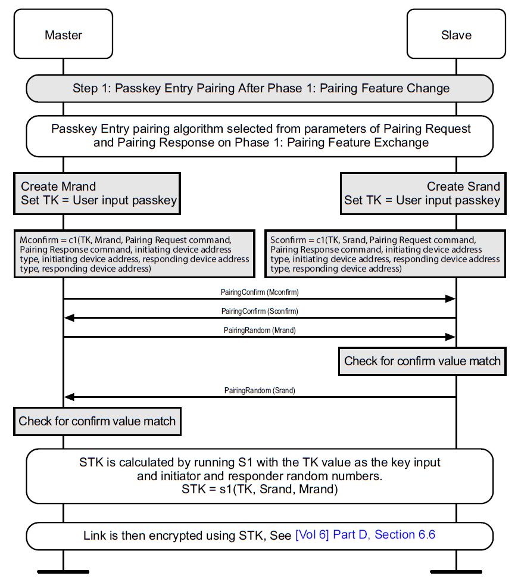
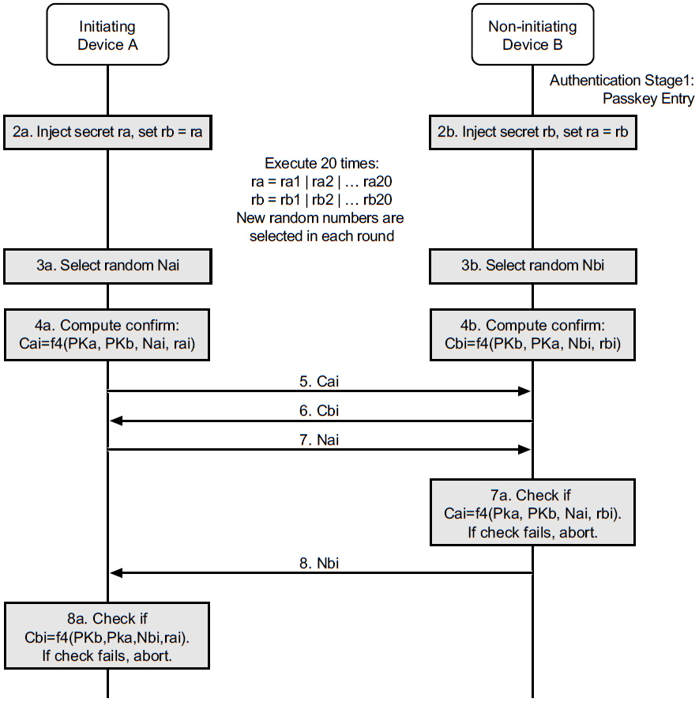
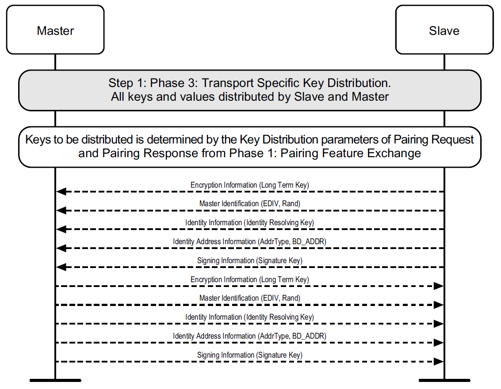

# Bluetooth Core Analyse Pair Bond

了解蓝牙配对流程到底那里来的，谁规定的，在哪里看

## 参考文档

* [0154_CC2541_SimpleBLEPeripheral.md](0154_CC2541_SimpleBLEPeripheral.md)
* [Core_v5.0.pdf](refers/Core_v5.0.pdf)
* [低功耗蓝牙配对绑定解读和实践](https://www.cnblogs.com/iini/p/12801242.html)

## 蓝牙协议栈关注章节

```
* [Core_v5.0.pdf](refers/Core_v5.0.pdf)
  * Vol 2: Core System Package [BR/EDR Controller volume]
    * Part F: Message Sequence Charts
  * Vol 3: Core System Package [Host volume]
    * Part H: Security Manager Spacification
      * 2 Security Manager
        * 蓝牙配对时，主要是这一章节的流程处理
      * Appendix C Message Sequence Charts
  * Vol 6: Core System Package [BR/EDR Controller volume]
    * Part D: Message Sequence Charts
```


## passkey用来做什么

### Legacy配对

这一步可以认为是配对，Master、Slave共同协商出一组临时key，用于后续传输分发key（绑定key）做准备工作；

```
* [Core_v5.0.pdf](refers/Core_v5.0.pdf)
  * Vol 3: Core System Package [Host volume]
    * Part H: Security Manager Spacification
      * 2 Security Manager
        * 2.3 Pairing Methods
          * 2.3.5 Pairing Algorithms
            * 2.3.5.3 LE Legacy Pairing - Passkey Entry
              * TK
            * 2.3.5.5 LE Legacy Pairing Phase 2
              * TK生成Pairing Confirm数据的原理
      * Appendix C Message Sequence Charts
        * C.2 Phase 2: Authenticating and Encrypting
          * C.2.1 LE Legacy Pairing
            * C.2.1.2 Legacy Phase 2: Shart Term Key Generation - Passkey Entry
```

For example, if the user entered passkey is '019655' then TK shall be `0x00000000000000000000000000004CC7`.
    


* `STK = s1(TK, Srand, Mrand)`
* 跟legacy paring不一样的地方，LE SC paring是通过Diffie-Hellman算法直接生成LTK，因此它不需要生成TK和STK。为了生成LTK，双方需要先交换公钥；
* 公钥交换后，设备A和B就开始独自计算各自的DHKey，按照D-H算法，他们俩算出的DHKey会是同一个。而LTK和MacKey就是通过这个DHKey加密一系列数据而得到的；

btmon输出的log可以查看：[0154_CC2541_SimpleBLEPeripheral#bluez](0154_CC2541_SimpleBLEPeripheral.md#bluez)

### LE配对

```
* [Core_v5.0.pdf](refers/Core_v5.0.pdf)
  * Vol 3: Core System Package [Host volume]
    * Part H: Security Manager Spacification
      * 2 Security Manager
        * 2.3 Pairing Methods
          * 2.3.5 Pairing Algorithms
            * 2.3.5.6 LE Secure Connections Pairing Phase 2
              * dhkey处理
              * LTK生成Pairing Confirm数据的原理
      * Appendix C Message Sequence Charts
        * C.2 Phase 2: Authenticating and Encrypting
          * C.2.2 LE Secure Connections
            * C.2.2.3C.2.2.3 Long Term Key Calculation
            * C.2.2.4 Authentication Stage 2 (DHKey checks)
```



* btmon输出的log可以查看：[0153_btmon_HCI_ACL.md](0153_btmon_HCI_ACL.md)
* 如上的log问题出在：`C.2.2.4 Authentication Stage 2 (DHKey checks)`

## 分发key

这一步可以认为是绑定，Master、Slave互相存储key；

```
* [Core_v5.0.pdf](refers/Core_v5.0.pdf)
  * Vol 3: Core System Package [Host volume]
    * Part H: Security Manager Spacification
      * 2 Security Manager
        * 2.4 Security in Bluetooth low energy
          * 2.4.2 Generation of Distributed Keys
            * 2.4.2.3 LE Legacy Pairing - Generation of LTK, EDIV and Rand
          * 2.4.3 Distribution of Keys
            * 2.4.3.1 LE Legacy Pairing Key Distribution
              * LTK, EDIV, and Rand
              * IRK
              * CSRK
              * 需要用到前面的`STK`加解密来进行三个数据分发
            * 2.4.3.2 LE Secure Connections Key Distribution
              * IRK
              * CSRK
              * 需要用到前面的`LTK`加解密来进行三个数据分发
      * Appendix C Message Sequence Charts
        * C.3 Phase 3: Transport Specific Key Distribution
```



btmon输出的log可以查看：[0154_CC2541_SimpleBLEPeripheral#bluez](0154_CC2541_SimpleBLEPeripheral.md#bluez)
