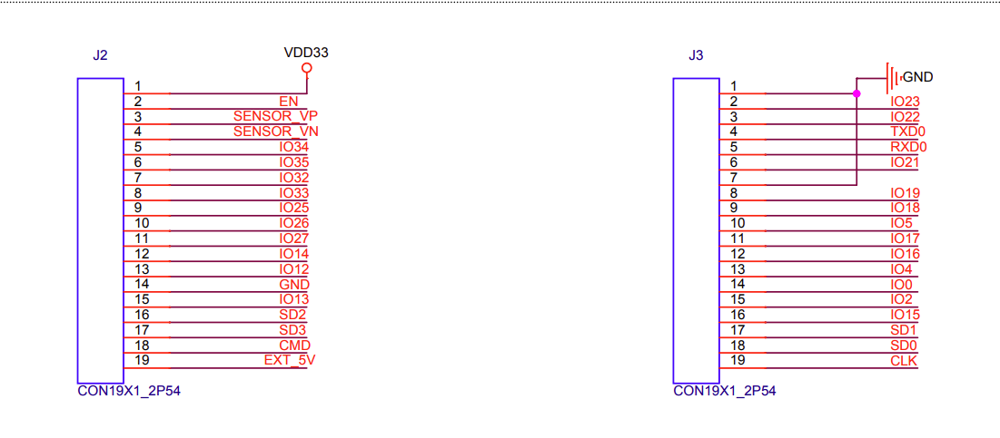

# ESP32-DevKitC

尝试用树莓派处理ESP32-DevKitC

## 参考文档

* [ESP32-DevKitC V4 入门指南](https://docs.espressif.com/projects/esp-idf/zh_CN/latest/esp32/hw-reference/esp32/get-started-devkitc.html)
* [快速入门](https://docs.espressif.com/projects/esp-idf/zh_CN/latest/esp32/get-started/index.html)
* [Linux 平台工具链的标准设置](https://docs.espressif.com/projects/esp-idf/zh_CN/latest/esp32/get-started/linux-setup.html)
* [esp32_devkitc_v4-sch.pdf](refers/esp32_devkitc_v4-sch.pdf)
* [esp32_technical_reference_manual_cn.pdf](refers/esp32_technical_reference_manual_cn.pdf)

## 原理图

* [esp32-wroom-32_datasheet_cn.pdf](refers/esp32-wroom-32_datasheet_cn.pdf)





* ESP32芯片有34个物理GPIO pad。每个pad都可用作一个通用IO，或连接一个内部的外设信号。
* 这34个物理GPIO pad的序列号为：0-19, 21-23, 25-27, 32-39。其中GPIO 34-39仅用作输入管脚，其他的既可以作为输入又可以作为输出管脚。


## 搭建开发环境

* 树莓派
* sudo apt-get install git wget flex bison gperf python python-pip python-setuptools cmake ninja-build ccache libffi-dev libssl-dev dfu-util
* 已经有python3，不用装，没有就装一下：
  * sudo apt-get install python3 python3-pip python3-setuptools
  * *不需要设置*：sudo update-alternatives --install /usr/bin/python python /usr/bin/python3 10
* 获取 ESP-IDF
  * mkdir -p ~/esp
  * cd ~/esp
  * git clone --recursive https://github.com/espressif/esp-idf.git
    * 大清早六点钟的时候下载超级快
  * cd esp-idf && pwd cd 
    ```
    /home/pi/esp/esp-idf
    ```
  * ls
    ```
    add_path.sh       docs         export.ps1    install.ps1  make              sdkconfig.rename
    CMakeLists.txt    examples     export.sh     install.sh   README_CN.md      SUPPORT_POLICY_CN.md
    components        export.bat   install.bat   Kconfig      README.md         SUPPORT_POLICY.md
    CONTRIBUTING.rst  export.fish  install.fish  LICENSE      requirements.txt  tools
    ```
  * ./install.sh
    * pip安装软件timeout修改参考：[0159_pip_source_modify.md](0159_pip_source_modify.md)
* 尝试编译
  * cd ~/esp
  * . ~/esp/esp-idf/export.sh
  * cp esp-idf/examples/get-started/hello_world . -r
  * cd hello_world
  * idf.py set-target esp32
  * idf.py menuconfig
  * idf.py build
* 烧录及查看log
  * 插入usb线，发现设备
    * /dev/ttyUSB0
  * idf.py -p /dev/ttyUSB0 flash (这里的flash只是写入，不会自动重启，当使用后面的moniter程序的时候，相当会重启，可以看到完整的log)
    ```
    Executing action: flash
    Running ninja in directory /home/pi/esp/hello_world/build
    Executing "ninja flash"...
    [1/4] Performing build step for 'bootloader'
    ninja: no work to do.
    [1/2] cd /home/pi/esp/esp-idf/components/esptool_p...sp/esp-idf/components/esptool_py/run_esptool.cmake
    esptool.py --chip esp32 -p /dev/ttyUSB0 -b 460800 --before=default_reset --after=hard_reset write_flash --flash_mode dio --flash_freq 40m --flash_size 2MB 0x8000 partition_table/partition-table.bin 0x1000 bootloader/bootloader.bin 0x10000 hello-world.bin
    esptool.py v3.0-dev
    Serial port /dev/ttyUSB0
    Connecting.....
    Chip is ESP32-D0WD-V3 (revision 3)
    Features: WiFi, BT, Dual Core, 240MHz, VRef calibration in efuse, Coding Scheme None
    Crystal is 40MHz
    MAC: a8:03:2a:eb:ec:48
    Uploading stub...
    Running stub...
    Stub running...
    Changing baud rate to 460800
    Changed.
    Configuring flash size...
    Compressed 3072 bytes to 103...
    Writing at 0x00008000... (100 %)
    Wrote 3072 bytes (103 compressed) at 0x00008000 in 0.0 seconds (effective 3903.0 kbit/s)...
    Hash of data verified.
    Compressed 24992 bytes to 15392...
    Writing at 0x00001000... (100 %)
    Wrote 24992 bytes (15392 compressed) at 0x00001000 in 0.4 seconds (effective 553.5 kbit/s)...
    Hash of data verified.
    Compressed 155744 bytes to 82321...
    Writing at 0x00010000... (16 %)
    Writing at 0x00014000... (33 %)
    Writing at 0x00018000... (50 %)
    Writing at 0x0001c000... (66 %)
    Writing at 0x00020000... (83 %)
    Writing at 0x00024000... (100 %)
    Wrote 155744 bytes (82321 compressed) at 0x00010000 in 2.2 seconds (effective 576.6 kbit/s)...
    Hash of data verified.
    
    Leaving...
    Hard resetting via RTS pin...
    Done
    ```
  * idf.py -p /dev/ttyUSB0 monitor (使用快捷键 Ctrl+]，退出 IDF 监视器)
    ```
    Executing action: monitor
    Running idf_monitor in directory /home/pi/esp/hello_world
    Executing "/home/pi/.espressif/python_env/idf4.3_py3.7_env/bin/python /home/pi/esp/esp-idf/tools/idf_monitor.py -p /dev/ttyUSB0 -b 115200 --toolchain-prefix xtensa-esp32-elf- /home/pi/esp/hello_world/build$
    hello-world.elf -m '/home/pi/.espressif/python_env/idf4.3_py3.7_env/bin/python' '/home/pi/esp/esp-idf/tools/idf.py' '-p' '/dev/ttyUSB0'"...
    --- idf_monitor on /dev/ttyUSB0 115200 ---
    --- Quit: Ctrl+] | Menu: Ctrl+T | Help: Ctrl+T followed by Ctrl+H ---
    ets Jul 29 2019 12:21:46
    
    rst:0x1 (POWERON_RESET),boot:0x13 (SPI_FAST_FLASH_BOOT)
    configsip: 0, SPIWP:0xee
    clk_drv:0x00,q_drv:0x00,d_drv:0x00,cs0_drv:0x00,hd_drv:0x00,wp_drv:0x00
    mode:DIO, clock div:2
    load:0x3fff0030,len:4
    load:0x3fff0034,len:6908
    load:0x40078000,len:14328
    load:0x40080400,len:3660
    0x40080400: _init at ??:?
    
    entry 0x40080678
    I (29) boot: ESP-IDF v4.3-dev-1561-g357a27760 2nd stage bootloader
    I (29) boot: compile time 07:23:46
    I (29) boot: chip revision: 3
    I (34) boot_comm: chip revision: 3, min. bootloader chip revision: 0
    I (41) boot.esp32: SPI Speed      : 40MHz
    I (45) boot.esp32: SPI Mode       : DIO
    I (50) boot.esp32: SPI Flash Size : 2MB
    I (54) boot: Enabling RNG early entropy source...
    I (60) boot: Partition Table:
    I (63) boot: ## Label            Usage          Type ST Offset   Length
    I (71) boot:  0 nvs              WiFi data        01 02 00009000 00006000
    I (78) boot:  1 phy_init         RF data          01 01 0000f000 00001000
    I (86) boot:  2 factory          factory app      00 00 00010000 00100000
    I (93) boot: End of partition table
    I (97) boot_comm: chip revision: 3, min. application chip revision: 0
    I (104) esp_image: segment 0: paddr=0x00010020 vaddr=0x3f400020 size=0x05dc8 ( 24008) map
    I (123) esp_image: segment 1: paddr=0x00015df0 vaddr=0x3ffb0000 size=0x02790 ( 10128) load
    I (127) esp_image: segment 2: paddr=0x00018588 vaddr=0x40080000 size=0x00404 (  1028) load
    0x40080000: _WindowOverflow4 at /home/pi/esp/esp-idf/components/freertos/xtensa/xtensa_vectors.S:1730
    
    I (132) esp_image: segment 3: paddr=0x00018994 vaddr=0x40080404 size=0x07684 ( 30340) load
    I (154) esp_image: segment 4: paddr=0x00020020 vaddr=0x400d0020 size=0x13954 ( 80212) map
    0x400d0020: _stext at ??:?
    
    I (184) esp_image: segment 5: paddr=0x0003397c vaddr=0x40087a88 size=0x026c0 (  9920) load
    0x40087a88: mwdt_ll_set_flashboot_en at /home/pi/esp/esp-idf/components/hal/esp32/include/hal/mwdt_ll.h:193
     (inlined by) wdt_hal_set_flashboot_en at /home/pi/esp/esp-idf/components/hal/wdt_hal_iram.c:188
    
    I (195) boot: Loaded app from partition at offset 0x10000
    I (195) boot: Disabling RNG early entropy source...
    I (207) cpu_start: Pro cpu up.
    I (207) cpu_start: Starting app cpu, entry point is 0x40080edc
    0x40080edc: call_start_cpu1 at /home/pi/esp/esp-idf/components/esp_system/port/cpu_start.c:124
    
    I (0) cpu_start: App cpu up.
    I (221) cpu_start: Pro cpu start user code
    I (222) cpu_start: cpu freq: 160000000
    I (222) cpu_start: Application information:
    I (226) cpu_start: Project name:     hello-world
    I (231) cpu_start: App version:      1
    I (236) cpu_start: Compile time:     Nov  1 2020 07:22:22
    I (242) cpu_start: ELF file SHA256:  aecfd7d3b8bf0bc0...
    I (248) cpu_start: ESP-IDF:          v4.3-dev-1561-g357a27760
    I (254) heap_init: Initializing. RAM available for dynamic allocation:
    I (262) heap_init: At 3FFAE6E0 len 00001920 (6 KiB): DRAM
    I (268) heap_init: At 3FFB2FB8 len 0002D048 (180 KiB): DRAM
    I (274) heap_init: At 3FFE0440 len 00003AE0 (14 KiB): D/IRAM
    I (280) heap_init: At 3FFE4350 len 0001BCB0 (111 KiB): D/IRAM
    I (287) heap_init: At 4008A148 len 00015EB8 (87 KiB): IRAM
    I (294) spi_flash: detected chip: generic
    I (297) spi_flash: flash io: dio
    W (301) spi_flash: Detected size(4096k) larger than the size in the binary image header(2048k). Using the size in the binary image header.
    I (315) cpu_start: Starting scheduler on PRO CPU.
    I (0) cpu_start: Starting scheduler on APP CPU.
    Hello world!
    This is esp32 chip with 2 CPU core(s), WiFi/BT/BLE, silicon revision 3, 2MB external flash
    Minimum free heap size: 285880 bytes
    Restarting in 10 seconds...
    Restarting in 9 seconds...
    Restarting in 8 seconds...
    Restarting in 7 seconds...
    Restarting in 6 seconds...
    Restarting in 5 seconds...
    Restarting in 4 seconds...
    Restarting in 3 seconds...
    Restarting in 2 seconds...
    Restarting in 1 seconds...
    Restarting in 0 seconds...
    Restarting now.
    ```

# bluedroid

* 参考文档
  * [蓝牙 API](https://docs.espressif.com/projects/esp-idf/zh_CN/latest/esp32/api-reference/bluetooth/index.html)
  * [esp32_bluetooth_architecture_cn.pdf](refers/esp32_bluetooth_architecture_cn.pdf)
* 协议栈
  * cd ~/esp/esp-idf/components/bt
  * tree -L 2
    ```
    .
    ├── CMakeLists.txt
    ├── common
    │   ├── btc
    │   ├── include
    │   └── osi
    ├── component.mk
    ├── controller                          // 蓝牙控制器代码，一般不分析
    │   ├── bt.c
    │   └── lib
    ├── esp_ble_mesh
    │   ├── api
    │   ├── btc
    │   ├── Kconfig.in
    │   ├── mesh_common
    │   ├── mesh_core
    │   ├── mesh_models
    │   └── README.md
    ├── host                                // 蓝牙host代码，对应Android host部分代码，也就是我们常说的蓝牙协议栈
    │   ├── bluedroid                       // Bluedroid is a stack provided by Broadcom and is now opensource in android. 目标就是分析这个
    │   └── nimble                          // Apache NimBLE is an open-source Bluetooth 5.1 stack (both Host & Controller).
    ├── include
    │   └── esp_bt.h
    ├── Kconfig
    ├── sdkconfig.rename
    └── test
        ├── CMakeLists.txt
        ├── component.mk
        ├── test_bt_common.c
        └── test_smp.c
  
    17 directories, 12 files
    ```
    * cd ~/esp/esp-idf/components/bt/host/bluedroid
    * ls 
    ```
    api  bta  btc  common  device  external  hci  Kconfig.in  main  stack
    ```
* 协议栈log
  * idf.py menuconfig
    * (Top) -> Component config -> Bluetooth -> Bluedroid Options -> BT DEBUG LOG LEVEL
      * 默认都是2，看情况添加，对于做数据分析的人来说，全部改成6可能会比较好，log太多可能是个问题 :)
* cd ~/esp && . ~/esp/esp-idf/export.sh
* cp esp-idf/examples/bluetooth/bluedroid/ble/ble_spp_server . -r
* cd ble_spp_server
* idf.py build
* idf.py -p /dev/ttyUSB0 flash
* 测试操作
  * idf.py -p /dev/ttyUSB0 monitor (使用快捷键 Ctrl+]，退出 IDF 监视器)
    * 使用ble client软件可以扫描到`ESP_SPP_SERVER`设备，链接，并设定相关参数
    * 可以作为spp server端的input数据，将数据发送到ble client
    * 将ble client发送的数据显示在界面
    ```
    ets Jul 29 2019 12:21:46
  
    rst:0x1 (POWERON_RESET),boot:0x13 (SPI_FAST_FLASH_BOOT)
    configsip: 0, SPIWP:0xee
    clk_drv:0x00,q_drv:0x00,d_drv:0x00,cs0_drv:0x00,hd_drv:0x00,wp_drv:0x00
    mode:DIO, clock div:2
    load:0x3fff0030,len:4
    load:0x3fff0034,len:6908
    load:0x40078000,len:14328
    load:0x40080400,len:3660
    0x40080400: _init at ??:?
  
    entry 0x40080678
    I (29) boot: ESP-IDF v4.3-dev-1561-g357a27760 2nd stage bootloader
    I (29) boot: compile time 09:32:44
    I (29) boot: chip revision: 3
    I (34) boot_comm: chip revision: 3, min. bootloader chip revision: 0
    I (41) boot.esp32: SPI Speed      : 40MHz
    I (45) boot.esp32: SPI Mode       : DIO
    I (50) boot.esp32: SPI Flash Size : 2MB
    I (54) boot: Enabling RNG early entropy source...
    I (60) boot: Partition Table:
    I (63) boot: ## Label            Usage          Type ST Offset   Length
    I (71) boot:  0 nvs              WiFi data        01 02 00009000 00006000
    I (78) boot:  1 phy_init         RF data          01 01 0000f000 00001000
    I (86) boot:  2 factory          factory app      00 00 00010000 00100000
    I (93) boot: End of partition table
    I (97) boot_comm: chip revision: 3, min. application chip revision: 0
    I (104) esp_image: segment 0: paddr=0x00010020 vaddr=0x3f400020 size=0x1debc (122556) map
    I (160) esp_image: segment 1: paddr=0x0002dee4 vaddr=0x3ffbdb60 size=0x02134 (  8500) load
    I (164) esp_image: segment 2: paddr=0x00030020 vaddr=0x400d0020 size=0x7aea0 (503456) map
    0x400d0020: _stext at ??:?
  
    I (358) esp_image: segment 3: paddr=0x000aaec8 vaddr=0x3ffbfc94 size=0x01a74 (  6772) load
    I (362) esp_image: segment 4: paddr=0x000ac944 vaddr=0x40080000 size=0x00404 (  1028) load
    0x40080000: _WindowOverflow4 at /home/pi/esp/esp-idf/components/freertos/xtensa/xtensa_vectors.S:1730
  
    I (366) esp_image: segment 5: paddr=0x000acd50 vaddr=0x40080404 size=0x15f7c ( 89980) load
    I (426) boot: Loaded app from partition at offset 0x10000
    I (426) boot: Disabling RNG early entropy source...
    I (437) cpu_start: Pro cpu up.
    I (437) cpu_start: Starting app cpu, entry point is 0x400811a4
    0x400811a4: call_start_cpu1 at /home/pi/esp/esp-idf/components/esp_system/port/cpu_start.c:124
  
    I (0) cpu_start: App cpu up.
    I (452) cpu_start: Pro cpu start user code
    I (452) cpu_start: cpu freq: 160000000
    I (452) cpu_start: Application information:
    I (456) cpu_start: Project name:     ble_spp_server_demo
    I (462) cpu_start: App version:      1
    I (467) cpu_start: Compile time:     Nov  1 2020 09:30:54
    I (473) cpu_start: ELF file SHA256:  95cb8cafa597eb58...
    I (479) cpu_start: ESP-IDF:          v4.3-dev-1561-g357a27760
    I (485) heap_init: Initializing. RAM available for dynamic allocation:
    I (492) heap_init: At 3FFAFF10 len 000000F0 (0 KiB): DRAM
    I (498) heap_init: At 3FFB6388 len 00001C78 (7 KiB): DRAM
    I (505) heap_init: At 3FFB9A20 len 00004108 (16 KiB): DRAM
    I (511) heap_init: At 3FFC5DC8 len 0001A238 (104 KiB): DRAM
    I (517) heap_init: At 3FFE0440 len 00003AE0 (14 KiB): D/IRAM
    I (523) heap_init: At 3FFE4350 len 0001BCB0 (111 KiB): D/IRAM
    I (530) heap_init: At 40096380 len 00009C80 (39 KiB): IRAM
    I (537) spi_flash: detected chip: generic
    I (541) spi_flash: flash io: dio
    W (544) spi_flash: Detected size(4096k) larger than the size in the binary image header(2048k). Using the size in the binary image header.
    I (559) cpu_start: Starting scheduler on PRO CPU.
    I (0) cpu_start: Starting scheduler on APP CPU.
    I (605) BTDM_INIT: BT controller compile version [b73c48e]
    I (605) system_api: Base MAC address is not set
    I (605) system_api: read default base MAC address from EFUSE
    I (705) phy: phy_version: 4500, 0cd6843, Sep 17 2020, 15:37:07, 0, 0
    I (945) GATTS_SPP_DEMO: app_main init bluetooth
    I (1055) GATTS_SPP_DEMO: EVT 0, gatts if 3
    I (1055) GATTS_SPP_DEMO: event = 0
    I (1055) GATTS_SPP_DEMO: gatts_profile_event_handler 494
    I (1065) GATTS_SPP_DEMO: gatts_profile_event_handler 497
    I (1065) GATTS_SPP_DEMO: gatts_profile_event_handler 500
    I (1075) uart: queue free spaces: 10
    I (1085) GATTS_SPP_DEMO: EVT 22, gatts if 3
    I (1085) GATTS_SPP_DEMO: event = 16
    I (1085) GATTS_SPP_DEMO: The number handle =b
    E (1095) GATTS_SPP_DEMO: GAP_EVT, event 4
    I (1095) GATTS_SPP_DEMO: EVT 12, gatts ifI (9405) GATTS_SPP_DEMO: EVT 14, gatts if 3
    I (9405) GATTS_SPP_DEMO: event = e
    I (9525) GATTS_SPP_DEMO: EVT 4, gatts if 3
    I (9525) GATTS_SPP_DEMO: event = 4
    I (21525) GATTS_SPP_DEMO: EVT 2, gatts if 3
    I (21525) GATTS_SPP_DEMO: event = 2
    I (21525) GATTS_SPP_DEMO: ESP_GATTS_WRITE_EVT : handle = 5
    I (29895) GATTS_SPP_DEMO: EVT 2, gatts if 3
    I (29895) GATTS_SPP_DEMO: event = 2
    I (29895) GATTS_SPP_DEMO: ESP_GATTS_WRITE_EVT : handle = 7
    I (29895) GATTS_SPP_DEMO: 0123456
    I (35725) GATTS_SPP_DEMO: EVT 5, gatts if 3
    I (35735) GATTS_SPP_DEMO: event = 5
    I (36425) GATTS_SPP_DEMO: EVT 5, gatts if 3
    I (36425) GATTS_SPP_DEMO: event = 5
    I (37195) GATTS_SPP_DEMO: EVT 5, gatts if 3
    I (37195) GATTS_SPP_DEMO: event = 5
    ```

## Wifi

* cp esp-idf/examples/wifi/getting_started/station . -r
* idf.py menuconfig
  * Example Configuration
    * Wifi SSID
    * Wifi Password
  * /home/pi/esp/station/sdkconfig
* idf.py build
* idf.py -p /dev/ttyUSB0 flash
* idf.py -p /dev/ttyUSB0 monitor (使用快捷键 Ctrl+]，退出 IDF 监视器)
  ```
  pi@raspberrypi:~/esp/station $ idf.py -p /dev/ttyUSB0 monitor
  Executing action: monitor
  Running idf_monitor in directory /home/pi/esp/station
  Executing "/home/pi/.espressif/python_env/idf4.3_py3.7_env/bin/python /home/pi/esp/esp-idf/tools/idf_monitor.py -p /dev/ttyUSB0 -b 115200 --toolchain-prefix xtensa-esp32-elf- /home/pi/esp/station/build/wifi
  _station.elf -m '/home/pi/.espressif/python_env/idf4.3_py3.7_env/bin/python' '/home/pi/esp/esp-idf/tools/idf.py' '-p' '/dev/ttyUSB0'"...
  --- idf_monitor on /dev/ttyUSB0 115200 ---
  --- Quit: Ctrl+] | Menu: Ctrl+T | Help: Ctrl+T followed by Ctrl+H ---
  ets Jul 29 2019 12:21:46
  
  rst:0x1 (POWERON_RESET),boot:0x13 (SPI_FAST_FLASH_BOOT)
  configsip: 0, SPIWP:0xee
  clk_drv:0x00,q_drv:0x00,d_drv:0x00,cs0_drv:0x00,hd_drv:0x00,wp_drv:0x00
  mode:DIO, clock div:2
  load:0x3fff0030,len:4
  load:0x3fff0034,len:6908
  load:0x40078000,len:14328
  load:0x40080400,len:3660
  0x40080400: _init at ??:?
  
  entry 0x40080678
  I (29) boot: ESP-IDF v4.3-dev-1561-g357a27760 2nd stage bootloader
  I (29) boot: compile time 11:49:30
  I (29) boot: chip revision: 3
  I (34) boot_comm: chip revision: 3, min. bootloader chip revision: 0
  I (41) boot.esp32: SPI Speed      : 40MHz
  I (45) boot.esp32: SPI Mode       : DIO
  I (50) boot.esp32: SPI Flash Size : 2MB
  I (54) boot: Enabling RNG early entropy source...
  I (60) boot: Partition Table:
  I (63) boot: ## Label            Usage          Type ST Offset   Length
  I (71) boot:  0 nvs              WiFi data        01 02 00009000 00006000
  I (78) boot:  1 phy_init         RF data          01 01 0000f000 00001000
  I (86) boot:  2 factory          factory app      00 00 00010000 00100000
  I (93) boot: End of partition table
  I (97) boot_comm: chip revision: 3, min. application chip revision: 0
  I (104) esp_image: segment 0: paddr=0x00010020 vaddr=0x3f400020 size=0x15de0 ( 89568) map
  I (148) esp_image: segment 1: paddr=0x00025e08 vaddr=0x3ffb0000 size=0x03ec8 ( 16072) load
  I (155) esp_image: segment 2: paddr=0x00029cd8 vaddr=0x40080000 size=0x00404 (  1028) load
  0x40080000: _WindowOverflow4 at /home/pi/esp/esp-idf/components/freertos/xtensa/xtensa_vectors.S:1730
  
  I (155) esp_image: segment 3: paddr=0x0002a0e4 vaddr=0x40080404 size=0x05f34 ( 24372) load
  I (174) esp_image: segment 4: paddr=0x00030020 vaddr=0x400d0020 size=0x718dc (465116) map
  0x400d0020: _stext at ??:?
  
  I (351) esp_image: segment 5: paddr=0x000a1904 vaddr=0x40086338 size=0x0e5d8 ( 58840) load
  0x40086338: tx_pwctrl_cal at /home/cff/gittree/chip7.1_phy/chip_7.1/board_code/app_test/pp/phy/phy_chip_v7_cal.c:2534
  
  I (389) boot: Loaded app from partition at offset 0x10000
  I (389) boot: Disabling RNG early entropy source...
  I (400) cpu_start: Pro cpu up.
  I (400) cpu_start: Starting app cpu, entry point is 0x40081148
  0x40081148: call_start_cpu1 at /home/pi/esp/esp-idf/components/esp_system/port/cpu_start.c:124
  
  I (0) cpu_start: App cpu up.
  I (415) cpu_start: Pro cpu start user code
  I (415) cpu_start: cpu freq: 160000000
  I (415) cpu_start: Application information:
  I (419) cpu_start: Project name:     wifi_station
  I (425) cpu_start: App version:      1
  I (429) cpu_start: Compile time:     Nov  1 2020 11:47:37
  I (435) cpu_start: ELF file SHA256:  bcddf94b95a18223...
  I (441) cpu_start: ESP-IDF:          v4.3-dev-1561-g357a27760
  I (448) heap_init: Initializing. RAM available for dynamic allocation:
  I (455) heap_init: At 3FFAE6E0 len 00001920 (6 KiB): DRAM
  I (461) heap_init: At 3FFB7BC0 len 00028440 (161 KiB): DRAM
  I (467) heap_init: At 3FFE0440 len 00003AE0 (14 KiB): D/IRAM
  I (473) heap_init: At 3FFE4350 len 0001BCB0 (111 KiB): D/IRAM
  I (480) heap_init: At 40094910 len 0000B6F0 (45 KiB): IRAM
  I (487) spi_flash: detected chip: generic
  I (491) spi_flash: flash io: dio
  W (495) spi_flash: Detected size(4096k) larger than the size in the binary image header(2048k). Using the size in the binary image header.
  I (509) cpu_start: Starting scheduler on PRO CPU.
  I (0) cpu_start: Starting scheduler on APP CPU.
  I (595) wifi station: ESP_WIFI_MODE_STA
  I (605) wifi:wifi driver task: 3ffc24a8, prio:23, stack:6656, core=0
  I (605) system_api: Base MAC address is not set
  I (605) system_api: read default base MAC address from EFUSE
  I (625) wifi:wifi firmware version: a94a000
  I (625) wifi:wifi certification version: v7.0
  I (625) wifi:config NVS flash: enabled
  I (625) wifi:config nano formating: disabled
  I (635) wifi:Init data frame dynamic rx buffer num: 32
  I (635) wifi:Init management frame dynamic rx buffer num: 32
  I (645) wifi:Init management short buffer num: 32
  I (645) wifi:Init dynamic tx buffer num: 32
  I (655) wifi:Init static rx buffer size: 1600
  I (655) wifi:Init static rx buffer num: 10
  I (655) wifi:Init dynamic rx buffer num: 32
  I (665) wifi_init: rx ba win: 6
  I (665) wifi_init: tcpip mbox: 32
  I (665) wifi_init: udp mbox: 6
  I (675) wifi_init: tcp mbox: 6
  I (675) wifi_init: tcp tx win: 5744
  I (685) wifi_init: tcp rx win: 5744
  I (685) wifi_init: tcp mss: 1440
  I (685) wifi_init: WiFi IRAM OP enabled
  I (695) wifi_init: WiFi RX IRAM OP enabled
  I (795) phy: phy_version: 4500, 0cd6843, Sep 17 2020, 15:37:07, 0, 0
  I (795) wifi:mode : sta (a8:03:2a:eb:ec:48)
  I (795) wifi:enable tsf
  I (795) wifi station: wifi_init_sta finished.
  I (925) wifi:new:<1,0>, old:<1,0>, ap:<255,255>, sta:<1,0>, prof:1
  I (925) wifi:state: init -> auth (b0)
  I (935) wifi:state: auth -> assoc (0)
  I (945) wifi:state: assoc -> run (10)
  I (945) wifi:state: run -> init (3a0)
  I (945) wifi:new:<1,0>, old:<1,0>, ap:<255,255>, sta:<1,0>, prof:1
  I (945) wifi:new:<1,0>, old:<1,0>, ap:<255,255>, sta:<1,0>, prof:1
  I (945) wifi station: retry to connect to the AP
  I (955) wifi station: connect to the AP fail
  I (2995) wifi station: retry to connect to the AP
  I (3005) wifi station: connect to the AP fail
  I (3115) wifi:new:<1,0>, old:<1,0>, ap:<255,255>, sta:<1,0>, prof:1
  I (3125) wifi:state: init -> auth (b0)
  I (3125) wifi:state: auth -> assoc (0)
  I (3135) wifi:state: assoc -> run (10)
  I (3145) wifi:connected with zengjf, aid = 77, channel 1, BW20, bssid = 04:d3:b5:e5:a3:08
  I (3145) wifi:security: WPA2-PSK, phy: bgn, rssi: -26
  I (3155) wifi:pm start, type: 1
  
  I (3185) wifi:AP's beacon interval = 102400 us, DTIM period = 1
  I (4095) esp_netif_handlers: sta ip: 192.168.3.15, mask: 255.255.255.0, gw: 192.168.3.1
  I (4095) wifi station: got ip:192.168.3.15
  I (4095) wifi station: connected to ap SSID:zengjf password:<your password>
  ```
