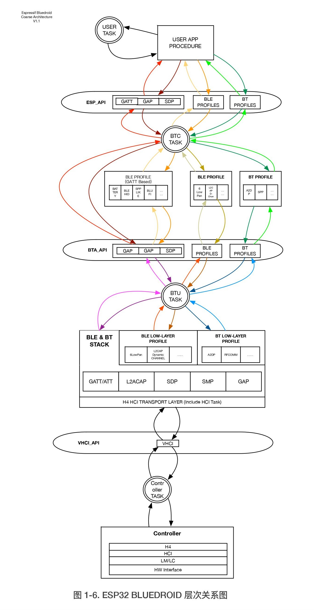
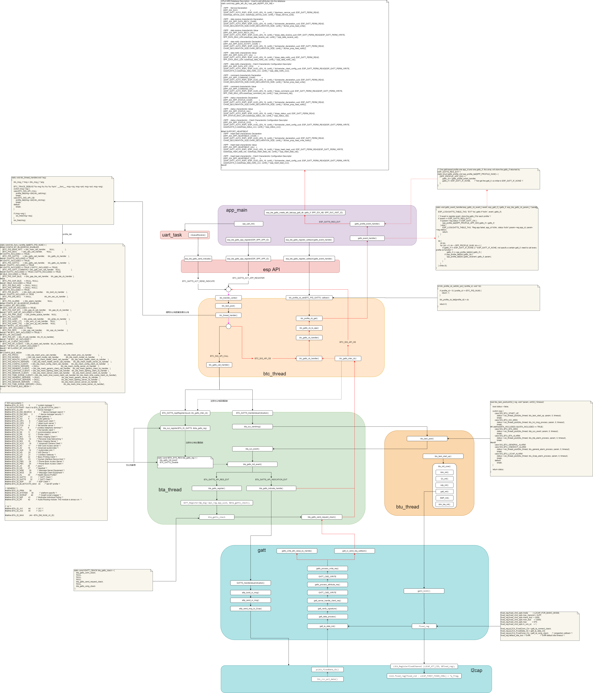

# ESP32-DevKitC BlueDroid(Fluoride)

理解BlueDroid(Fluoride)蓝牙协议栈，为了理解Android蓝牙协议栈

Android also used BlueZ, until it switched to its own BlueDroid stack, created by Broadcom, in late 2012 BlueDroid has been since been renamed Fluoride.

## 参考文档

* [esp32_bluetooth_architecture_cn.pdf](refers/esp32_bluetooth_architecture_cn.pdf)
* [0158_ESP32-DevKitC.md](0158_ESP32-DevKitC.md)
* [0158_ESP32-DevKitC bluedroid](0158_ESP32-DevKitC.md#bluedroid)
* [0159_pip_source_modify.md](0159_pip_source_modify.md)
* [0150_BlueZ.md](0150_BlueZ.md)
* [0153_btmon_HCI_ACL.md](0153_btmon_HCI_ACL.md)
* [0154_CC2541_SimpleBLEPeripheral.md](0154_CC2541_SimpleBLEPeripheral.md)

## 示例拷贝编译

* cd ~/esp && . ~/esp/esp-idf/export.sh
* 编译server软件
  * cp esp-idf/examples/bluetooth/bluedroid/ble/ble_spp_server . -r
  * cp esp-idf/examples/bluetooth/bluedroid/ble/gatt_security_server . -r
* cd ble_spp_server
* idf.py build
* idf.py -p /dev/ttyUSB0 flash
* idf.py -p /dev/ttyUSB0 monitor (使用快捷键 Ctrl+]，退出 IDF 监视器)
  * 使用ble client软件可以扫描到`ESP_SPP_SERVER`设备，链接，并设定相关参数
  * 可以作为spp server端的input数据，将数据发送到ble client
  * 将ble client发送的数据显示在该界面
* 自动编译烧录监视，`auto.sh`便于调试，省得输入那么多命令
  ```bash
  #!/bin/bash
  
  if [ -z "`idf.py --version | grep 'command not found'`" ]; then
          echo "~/esp/esp-idf/export.sh"
          . ~/esp/esp-idf/export.sh
  fi
  
  # [    3.717759] usb 1-1.1: cp210x converter now attached to ttyUSB0
  USBDevice=`dmesg | grep 'cp210x' | grep 'ttyUSB*'`
  
  if [ ! -z "$USBDevice" ]; then
          deviceName=${USBDevice##* }
          idf.py build
          idf.py -p /dev/$deviceName flash
          idf.py -p /dev/$deviceName monitor
  fi
  ```

## 协议栈log

* idf.py menuconfig
  * (Top) -> Component config -> Bluetooth -> Bluedroid Options -> BT DEBUG LOG LEVEL
    * 默认都是2，看情况添加，对于做数据分析的人来说，全部改成6可能会比较好，log太多可能是个问题 :)
    * 作为协议分析，那就全部改成6，也就是输出所有的log信息

## ctags

* cd ~/esp/esp-idf/components
* ctags -Rn
* vim ~/.vimrc
  * set tags+=/home/pi/esp/esp-idf/components/tags
* 将当前项目的tags也加入`~/.vimrc`中，便于分析代码，最好在main目录下执行，否者容易加入build目录

## ble_spp_server_demo添加回显

添加回显主要是为了便于协议栈分析，数据在哪里开始，那里结束，整个回环是如何处理的，视需求添加。

```diff
diff --git a/main/ble_spp_server_demo.c b/main/ble_spp_server_demo.c
index ab74b89..d4ea319 100644
--- a/main/ble_spp_server_demo.c
+++ b/main/ble_spp_server_demo.c
@@ -71,6 +71,8 @@ static esp_bd_addr_t spp_remote_bda = {0x0,};

 static uint16_t spp_handle_table[SPP_IDX_NB];

+unsigned char received_count = 0;
+
 static esp_ble_adv_params_t spp_adv_params = {
     .adv_int_min        = 0x20,
     .adv_int_max        = 0x40,
@@ -340,8 +342,10 @@ void uart_task(void *pvParameters)
                         ESP_LOGE(GATTS_TABLE_TAG, "%s malloc.1 failed\n", __func__);
                         break;
                     }
-                    memset(temp,0x0,event.size);
+                    memset(temp,0x0,event.size + 1);
                     uart_read_bytes(UART_NUM_0,temp,event.size,portMAX_DELAY);
+                    temp[event.size] = '\n';
+                    uart_write_bytes(UART_NUM_0,temp,event.size + 1);
                     if(event.size <= (spp_mtu_size - 3)){
                         esp_ble_gatts_send_indicate(spp_gatts_if, spp_conn_id, spp_handle_table[SPP_IDX_SPP_DATA_NTY_VAL],event.size, temp, false);
                     }else if(event.size > (spp_mtu_size - 3)){
@@ -544,7 +548,9 @@ static void gatts_profile_event_handler(esp_gatts_cb_event_t event, esp_gatt_if_
 #ifdef SPP_DEBUG_MODE
                     esp_log_buffer_char(GATTS_TABLE_TAG,(char *)(p_data->write.value),p_data->write.len);
 #else
+                    sprintf((char *)(p_data->write.value) + p_data->write.len, "-%03d", (++received_count) % 1000);
                     uart_write_bytes(UART_NUM_0, (char *)(p_data->write.value), p_data->write.len);
+                    esp_ble_gatts_send_indicate(spp_gatts_if, spp_conn_id, spp_handle_table[SPP_IDX_SPP_DATA_NTY_VAL], p_data->write.len + 4, (uint8_t *)(p_data->write.value), false);
 #endif
                 }else{
                     //TODO:
```

# bluedroid协议栈

* cd ~/esp/esp-idf/components/bt
* tree -L 2
  ```
  .
  ├── CMakeLists.txt
  ├── common
  │   ├── btc
  │   ├── include
  │   └── osi
  ├── component.mk
  ├── controller                          // 蓝牙控制器代码，一般不分析
  │   ├── bt.c
  │   └── lib
  ├── esp_ble_mesh
  │   ├── api
  │   ├── btc
  │   ├── Kconfig.in
  │   ├── mesh_common
  │   ├── mesh_core
  │   ├── mesh_models
  │   └── README.md
  ├── host                                // 蓝牙host代码，对应Android host部分代码，也就是我们常说的蓝牙协议栈
  │   ├── bluedroid                       // Bluedroid is a stack provided by Broadcom and is now opensource in android. 目标就是分析这个
  │   └── nimble                          // Apache NimBLE is an open-source Bluetooth 5.1 stack (both Host & Controller).
  ├── include
  │   └── esp_bt.h
  ├── Kconfig
  ├── sdkconfig.rename
  └── test
      ├── CMakeLists.txt
      ├── component.mk
      ├── test_bt_common.c
      └── test_smp.c

  17 directories, 12 files
  ```
  * cd ~/esp/esp-idf/components/bt/host/bluedroid
  * ls 
    ```
    api  bta  btc  common  device  external  hci  Kconfig.in  main  stack
    ```
    * api: 相当于是btif



## 术语

* BTIF: Bluetooth Interface(Android接口)
* BTA: Blueetooth application layer(应用层profiles)
  * A2DP: Advanced Audio Distribution Profile
  * AVRCP: Audio/Video Remote Control Profile
  * GAVDP: General Audio/Video Distribution Profile
  * PAN: Personal Area Networking
  * HFP: Hands-Free Profile
  * HSP: Headset Profile
  * CTP: Cordless Telephony Profile
  * VDP: Video Distribution Profile
  * FTP: File Transfer Profile
  * RFCOMM: Radio Frequency Communications
  * TCS: Telephony Control Protocol
  * WAP: Wireless Application Protocol
  * SDP: Service Discovery Protocol
  * TCP/IP: Transmission Control Protocol/Internet Protocol
  * GATT/ATT
* BTE: Bluetooth Embedded
  * HCI: host controller interface
  * BTU: Bluetooth Upper Layer(BTU 层主要负责蓝⽛牙主机底层协议栈的处理理，包括 L2CAP、SMP、GAP 以及部分规范等，并向上提供以"bta"为前缀的接⼝口)
    * BTM: Bluetooth Manager 
    * SDP: service discovery protocol
    * L2CAP: logical link control and adaptation protocol
* conn_id: Connection id
  * 一个server可能被多个client连接，使用这个连接id来做区分
* 处理流程：APP --> esp api --> btc --> bta -- btu --> gatts --> l2cap --> hci

## BlueZ工具

* sudo btmgmt
  * power off
  * bredr off
  * power on
* sudo bluetoothctl
  * show
  * scan on
  * scan off
  * devices
  * pair A8:03:2A:EB:EC:4A
* sudo btmon -w btsnoop_outfile
  * btmgmt -r btsnoop_outfile > BT_HCI.txt
  * wireshark
* sudo gatttool -b A8:03:2A:EB:EC:4A -I
  * connect
  * primary
  * characteristics
  * char-write-req 0x002a 0x30

## GATT Service

GATT串口服务信息如下：

```CPP
///Full HRS Database Description - Used to add attributes into the database
static const esp_gatts_attr_db_t spp_gatt_db[SPP_IDX_NB] =
{
    //SPP -  Service Declaration
    [SPP_IDX_SVC]                       =
    {{ESP_GATT_AUTO_RSP}, {ESP_UUID_LEN_16, (uint8_t *)&primary_service_uuid, ESP_GATT_PERM_READ,
    sizeof(spp_service_uuid), sizeof(spp_service_uuid), (uint8_t *)&spp_service_uuid}},

    //SPP -  data receive characteristic Declaration
    [SPP_IDX_SPP_DATA_RECV_CHAR]            =
    {{ESP_GATT_AUTO_RSP}, {ESP_UUID_LEN_16, (uint8_t *)&character_declaration_uuid, ESP_GATT_PERM_READ,
    CHAR_DECLARATION_SIZE,CHAR_DECLARATION_SIZE, (uint8_t *)&char_prop_read_write}},

    //SPP -  data receive characteristic Value
    [SPP_IDX_SPP_DATA_RECV_VAL]                 =
    {{ESP_GATT_AUTO_RSP}, {ESP_UUID_LEN_16, (uint8_t *)&spp_data_receive_uuid, ESP_GATT_PERM_READ|ESP_GATT_PERM_WRITE,
    SPP_DATA_MAX_LEN,sizeof(spp_data_receive_val), (uint8_t *)spp_data_receive_val}},

    //SPP -  data notify characteristic Declaration
    [SPP_IDX_SPP_DATA_NOTIFY_CHAR]  =
    {{ESP_GATT_AUTO_RSP}, {ESP_UUID_LEN_16, (uint8_t *)&character_declaration_uuid, ESP_GATT_PERM_READ,
    CHAR_DECLARATION_SIZE,CHAR_DECLARATION_SIZE, (uint8_t *)&char_prop_read_notify}},

    //SPP -  data notify characteristic Value
    [SPP_IDX_SPP_DATA_NTY_VAL]   =
    {{ESP_GATT_AUTO_RSP}, {ESP_UUID_LEN_16, (uint8_t *)&spp_data_notify_uuid, ESP_GATT_PERM_READ,
    SPP_DATA_MAX_LEN, sizeof(spp_data_notify_val), (uint8_t *)spp_data_notify_val}},

    //SPP -  data notify characteristic - Client Characteristic Configuration Descriptor
    [SPP_IDX_SPP_DATA_NTF_CFG]         =
    {{ESP_GATT_AUTO_RSP}, {ESP_UUID_LEN_16, (uint8_t *)&character_client_config_uuid, ESP_GATT_PERM_READ|ESP_GATT_PERM_WRITE,
    sizeof(uint16_t),sizeof(spp_data_notify_ccc), (uint8_t *)spp_data_notify_ccc}},

    //SPP -  command characteristic Declaration
    [SPP_IDX_SPP_COMMAND_CHAR]            =
    {{ESP_GATT_AUTO_RSP}, {ESP_UUID_LEN_16, (uint8_t *)&character_declaration_uuid, ESP_GATT_PERM_READ,
    CHAR_DECLARATION_SIZE,CHAR_DECLARATION_SIZE, (uint8_t *)&char_prop_read_write}},

    //SPP -  command characteristic Value
    [SPP_IDX_SPP_COMMAND_VAL]                 =
    {{ESP_GATT_AUTO_RSP}, {ESP_UUID_LEN_16, (uint8_t *)&spp_command_uuid, ESP_GATT_PERM_READ|ESP_GATT_PERM_WRITE,
    SPP_CMD_MAX_LEN,sizeof(spp_command_val), (uint8_t *)spp_command_val}},

    //SPP -  status characteristic Declaration
    [SPP_IDX_SPP_STATUS_CHAR]            =
    {{ESP_GATT_AUTO_RSP}, {ESP_UUID_LEN_16, (uint8_t *)&character_declaration_uuid, ESP_GATT_PERM_READ,
    CHAR_DECLARATION_SIZE,CHAR_DECLARATION_SIZE, (uint8_t *)&char_prop_read_notify}},

    //SPP -  status characteristic Value
    [SPP_IDX_SPP_STATUS_VAL]                 =
    {{ESP_GATT_AUTO_RSP}, {ESP_UUID_LEN_16, (uint8_t *)&spp_status_uuid, ESP_GATT_PERM_READ,
    SPP_STATUS_MAX_LEN,sizeof(spp_status_val), (uint8_t *)spp_status_val}},

    //SPP -  status characteristic - Client Characteristic Configuration Descriptor
    [SPP_IDX_SPP_STATUS_CFG]         =
    {{ESP_GATT_AUTO_RSP}, {ESP_UUID_LEN_16, (uint8_t *)&character_client_config_uuid, ESP_GATT_PERM_READ|ESP_GATT_PERM_WRITE,
    sizeof(uint16_t),sizeof(spp_status_ccc), (uint8_t *)spp_status_ccc}},

#ifdef SUPPORT_HEARTBEAT
    //SPP -  Heart beat characteristic Declaration
    [SPP_IDX_SPP_HEARTBEAT_CHAR]  =
    {{ESP_GATT_AUTO_RSP}, {ESP_UUID_LEN_16, (uint8_t *)&character_declaration_uuid, ESP_GATT_PERM_READ,
    CHAR_DECLARATION_SIZE,CHAR_DECLARATION_SIZE, (uint8_t *)&char_prop_read_write_notify}},

    //SPP -  Heart beat characteristic Value
    [SPP_IDX_SPP_HEARTBEAT_VAL]   =
    {{ESP_GATT_AUTO_RSP}, {ESP_UUID_LEN_16, (uint8_t *)&spp_heart_beat_uuid, ESP_GATT_PERM_READ|ESP_GATT_PERM_WRITE,
    sizeof(spp_heart_beat_val), sizeof(spp_heart_beat_val), (uint8_t *)spp_heart_beat_val}},

    //SPP -  Heart beat characteristic - Client Characteristic Configuration Descriptor
    [SPP_IDX_SPP_HEARTBEAT_CFG]         =
    {{ESP_GATT_AUTO_RSP}, {ESP_UUID_LEN_16, (uint8_t *)&character_client_config_uuid, ESP_GATT_PERM_READ|ESP_GATT_PERM_WRITE,
    sizeof(uint16_t),sizeof(spp_data_notify_ccc), (uint8_t *)spp_heart_beat_ccc}},
#endif
};
```

以上每个特征索引如下：

```CPP
enum{
    SPP_IDX_SVC,

    SPP_IDX_SPP_DATA_RECV_CHAR,
    SPP_IDX_SPP_DATA_RECV_VAL,

    SPP_IDX_SPP_DATA_NOTIFY_CHAR,
    SPP_IDX_SPP_DATA_NTY_VAL,
    SPP_IDX_SPP_DATA_NTF_CFG,

    SPP_IDX_SPP_COMMAND_CHAR,
    SPP_IDX_SPP_COMMAND_VAL,

    SPP_IDX_SPP_STATUS_CHAR,
    SPP_IDX_SPP_STATUS_VAL,
    SPP_IDX_SPP_STATUS_CFG,

#ifdef SUPPORT_HEARTBEAT
    SPP_IDX_SPP_HEARTBEAT_CHAR,
    SPP_IDX_SPP_HEARTBEAT_VAL,
    SPP_IDX_SPP_HEARTBEAT_CFG,
#endif

    SPP_IDX_NB,
};
```

查看gatt信息：`sudo gatttool -b A8:03:2A:EB:EC:4A -I`

```
[A8:03:2A:EB:EC:4A][LE]> connect
Attempting to connect to A8:03:2A:EB:EC:4A
Connection successful
[A8:03:2A:EB:EC:4A][LE]> primary
attr handle: 0x0001, end grp handle: 0x0005 uuid: 00001801-0000-1000-8000-00805f9b34fb
attr handle: 0x0014, end grp handle: 0x001c uuid: 00001800-0000-1000-8000-00805f9b34fb
attr handle: 0x0028, end grp handle: 0xffff uuid: 0000abf0-0000-1000-8000-00805f9b34fb
[A8:03:2A:EB:EC:4A][LE]> characteristics
handle: 0x0002, char properties: 0x20, char value handle: 0x0003, uuid: 00002a05-0000-1000-8000-00805f9b34fb
handle: 0x0015, char properties: 0x02, char value handle: 0x0016, uuid: 00002a00-0000-1000-8000-00805f9b34fb
handle: 0x0017, char properties: 0x02, char value handle: 0x0018, uuid: 00002a01-0000-1000-8000-00805f9b34fb
handle: 0x0019, char properties: 0x02, char value handle: 0x001a, uuid: 00002aa6-0000-1000-8000-00805f9b34fb
handle: 0x0029, char properties: 0x06, char value handle: 0x002a, uuid: 0000abf1-0000-1000-8000-00805f9b34fb
handle: 0x002b, char properties: 0x12, char value handle: 0x002c, uuid: 0000abf2-0000-1000-8000-00805f9b34fb
handle: 0x002e, char properties: 0x06, char value handle: 0x002f, uuid: 0000abf3-0000-1000-8000-00805f9b34fb
handle: 0x0030, char properties: 0x12, char value handle: 0x0031, uuid: 0000abf4-0000-1000-8000-00805f9b34fb
```

`handle`是自动分配的，主要是关注`uuid`

## ESP32发送字符

默认开启发送`notify`，目前是为了分析系统的数据传输架构，所以其他的先可以不用关心，关心的是数据是如何被调用传输的

```diff
diff --git a/main/ble_spp_server_demo.c b/main/ble_spp_server_demo.c
index 082e512..23f895b 100644
--- a/main/ble_spp_server_demo.c
+++ b/main/ble_spp_server_demo.c
@@ -65,7 +65,7 @@ static bool enable_heart_ntf = false;
 static uint8_t heartbeat_count_num = 0;
 #endif

-static bool enable_data_ntf = false;
+static bool enable_data_ntf = true;
 static bool is_connected = false;
 static esp_bd_addr_t spp_remote_bda = {0x0,};

@@ -528,7 +528,7 @@ static void gatts_profile_event_handler(esp_gatts_cb_event_t event, esp_gatt_if_
                     if((p_data->write.len == 2)&&(p_data->write.value[0] == 0x01)&&(p_data->write.value[1] == 0x00)){
                         enable_data_ntf = true;
                     }else if((p_data->write.len == 2)&&(p_data->write.value[0] == 0x00)&&(p_data->write.value[1] == 0x00)){
-                        enable_data_ntf = false;
+                        enable_data_ntf = true;
                     }
                 }
 #ifdef SUPPORT_HEARTBEAT
@@ -594,7 +594,7 @@ static void gatts_profile_event_handler(esp_gatts_cb_event_t event, esp_gatt_if_
                break;
        case ESP_GATTS_DISCONNECT_EVT:
            is_connected = false;
-           enable_data_ntf = false;
+            enable_data_ntf = true;
 #ifdef SUPPORT_HEARTBEAT
            enable_heart_ntf = false;
            heartbeat_count_num = 0;
```

在`idf.py -p /dev/ttyUSB0 monitor`终端输入`a`字符，输出log如下：

```
a
D (2499457) BT_BTC: btc_transfer_context msg 0 2 10 0x3ffd2658                                    // 开始发送数据
D (2499457) BT_BTC: btc_thread_handler msg 0 2 10 0x3ffbc448
D (2499457) BT_APPL: BTA got event 0x2004
I (2499467) BT_GATT: GATT_GetConnectionInfor conn_id=3
I (2499467) BT_GATT: GATTS_HandleValueNotification
I (2499477) BT_L2CAP: L2CA_SendFixedChnlData()  CID: 0x0004  BDA: 787206778b26
D (2499487) BT_L2CAP: l2c_link_check_send_pkts
D (2499487) BT_L2CAP: partial_segment_being_sent=0,link_state=4,power_mode=0
D (2499497) BT_L2CAP: l2c_link_send_to_lower
D (2499497) BT_L2CAP: TotalWin=9,Hndl=0x0,Quota=10,Unack=1,RRQuota=0,RRUnack=0
D (2499507) BT_BTC: btc_transfer_context msg 1 2 5 0x3ffcd078                                     // 发送完成，收到response，confirm
D (2499517) BT_BTC: btc_thread_handler msg 1 2 5 0x3ffbc8e4
I (2499517) GATTS_SPP_DEMO: EVT 5, gatts if 3
I (2499527) GATTS_SPP_DEMO: event = 5
D (2499547) BT_HCI: Receive packet event_code=0x13
D (2499557) BT_L2CAP: l2c_link_check_send_pkts
D (2499557) BT_L2CAP: partial_segment_being_sent=0,link_state=4,power_mode=0
D (2499557) BT_L2CAP: TotalWin=10,LinkUnack(0x0)=0,RRCheck=0,RRUnack=0
```

`sudo gatttool -b A8:03:2A:EB:EC:4A -I`输出信息如下：

```
[A8:03:2A:EB:EC:4A][LE]> connect
Attempting to connect to A8:03:2A:EB:EC:4A
Connection successful
Notification handle = 0x002c value: 61
```

`sudo btmon`监听的hci log信息如下：

```
Bluetooth monitor ver 5.50
= Note: Linux version 4.19.122-v7l (armv7l)                                                               0.564077
= Note: Bluetooth subsystem version 2.22                                                                  0.564085
= New Index: DC:A6:32:B2:F8:FF (Primary,UART,hci0)                                                 [hci0] 0.564089
= Open Index: DC:A6:32:B2:F8:FF                                                                    [hci0] 0.564091
= Index Info: DC:A6:32:B2:F8:FF (Cypress Semiconductor Corporation)                                [hci0] 0.564094
@ MGMT Open: btmgmt (privileged) version 1.14                                                    {0x0002} 0.564098
@ MGMT Open: bluetoothd (privileged) version 1.14                                                {0x0001} 0.564100
@ MGMT Open: btmon (privileged) version 1.14                                                     {0x0003} 0.564356
> ACL Data RX: Handle 64 flags 0x02 dlen 8                                                      #1 [hci0] 5.488677
      ATT: Handle Value Notification (0x1b) len 3
        Handle: 0x002c
          Data: 61
```


函数调用流程如下

* gatts_if: GATT server access interface
  * 可以认为是第几个服务，即服务索引，用于确认调用哪个服务的回调函数；
* conn_id: Connection id
  * 一个server可能被多个client连接，使用这个连接id来做区分
* 实际代码运行流程，有些是开始注册的回调函数，但那也是按流程处理的：APP --> esp api --> btc --> bta -- btu --> gatts --> l2cap --> hci

```
* main/ble_spp_server_demo.c
  * void app_main(void)
    * esp_ble_gatts_register_callback(gatts_event_handler);
      * gatts_event_handler
        * static void gatts_event_handler(esp_gatts_cb_event_t event, esp_gatt_if_t gatts_if, esp_ble_gatts_cb_param_t *param)
          * gatts_if == spp_profile_tab[idx].gatts_if
            * spp_profile_tab[idx].gatts_cb(event, gatts_if, param);
              * static struct gatts_profile_inst spp_profile_tab[SPP_PROFILE_NUM]
                * .gatts_cb = gatts_profile_event_handler,
                  * static void gatts_profile_event_handler(esp_gatts_cb_event_t event, esp_gatt_if_t gatts_if, esp_ble_gatts_cb_param_t *param)
                    * ESP_GATTS_CONF_EVT                = 5,       /*!< When receive confirm, the event comes */
                      * 最终发现这里没有做任何处理，也就是不需要处理
      * esp_err_t esp_ble_gatts_register_callback(esp_gatts_cb_t callback)
        * return (btc_profile_cb_set(BTC_PID_GATTS, callback) == 0 ? ESP_OK : ESP_FAIL);
          * btc_profile_cb_tab[profile_id] = cb;
    * spp_task_init();
      * spp_uart_init();
        * xTaskCreate(uart_task, "uTask", 2048, (void*)UART_NUM_0, 8, NULL);
          * void uart_task(void *pvParameters)
            * xQueueReceive(spp_uart_queue, (void * )&event, (portTickType)portMAX_DELAY)
              * case UART_DATA:
                * uart_read_bytes(UART_NUM_0,temp,event.size,portMAX_DELAY);
                * esp_ble_gatts_send_indicate(spp_gatts_if, spp_conn_id, spp_handle_table[SPP_IDX_SPP_DATA_NTY_VAL],event.size, temp, false);
                  * btc_transfer_context(&msg, &arg, sizeof(btc_ble_gatts_args_t), 280                                  btc_gatts_arg_deep_copy)
                    * &msg
                      * msg.sig = BTC_SIG_API_CALL;
                      * msg.pid = BTC_PID_GATTS;
                      * msg.act = BTC_GATTS_ACT_SEND_INDICATE;
                    * &arg
                      * arg.send_ind.conn_id = BTC_GATT_CREATE_CONN_ID(gatts_if, conn_id);
                      * arg.send_ind.attr_handle = attr_handle;
                      * arg.send_ind.need_confirm = need_confirm;
                      * arg.send_ind.value_len = value_len;
                      * arg.send_ind.value = value;
                    * bt_status_t btc_transfer_context(btc_msg_t *msg, void *arg, int arg_len, btc_arg_deep_copy_t copy_func)
                      * btc_task_post(&lmsg, OSI_THREAD_MAX_TIMEOUT);
                        * osi_thread_post(btc_thread, btc_thread_handler, lmsg, 0, timeout)
                          * static void btc_thread_handler(void *arg)
                            * switch (msg->sig)
                              * case BTC_SIG_API_CALL:
                                * profile_tab[msg->pid].btc_call(msg);
                                  * static const btc_func_t profile_tab[BTC_PID_NUM]
                                    * [BTC_PID_GATTS]       = {btc_gatts_call_handler,      btc_gatts_cb_handler    },
                                      * btc_gatts_call_handler
                                        * void btc_gatts_call_handler(btc_msg_t *msg)
                                          * switch (msg->act)
                                            * case BTC_GATTS_ACT_APP_REGISTER:
                                              * BTA_GATTS_AppRegister(&uuid, btc_gatts_inter_cb);
                                                * btc_gatts_inter_cb
                                                  * static void btc_gatts_inter_cb(tBTA_GATTS_EVT event, tBTA_GATTS *p_data)
                                                    * msg.sig = BTC_SIG_API_CB;
                                                    * msg.pid = BTC_PID_GATTS;
                                                    * msg.act = event;                // BTA_GATTS_CONF_EVT
                                                    * status = btc_transfer_context(&msg, p_data, sizeof(tBTA_GATTS), btc_gatts_cb_param_copy_req); 
                                                      * 第二次的系统调用btc_transfer_context是从这里调用的
                                                * void BTA_GATTS_AppRegister(const tBT_UUID * p_app_uuid, tBTA_GATTS_CBACK *p_cback)
                                                  * bta_sys_register(BTA_ID_GATTS, &bta_gatts_reg);
                                                    * #define BTA_ID_GATTS        32           /* GATT Client */
                                                    * &bta_gatts_reg
                                                      * static const tBTA_SYS_REG bta_gatts_reg  = { bta_gatts_hdl_event, BTA_GATTS_Disable };
                                                        * BOOLEAN bta_gatts_hdl_event(BT_HDR *p_msg)
                                                          * tBTA_GATTS_CB *p_cb = &bta_gatts_cb;
                                                          * switch (p_msg->event)
                                                            * case BTA_GATTS_API_INDICATION_EVT:
                                                              * bta_gatts_indicate_handle(p_cb, (tBTA_GATTS_DATA *) p_msg);
                                                                * p_srvc_cb = bta_gatts_find_srvc_cb_by_attr_id (p_cb, p_msg->api_indicate.attr_id);
                                                                * GATT_GetConnectionInfor(p_msg->api_indicate.hdr.layer_specific, &gatt_if, remote_bda, &transport)
                                                                * l2ble_update_att_acl_pkt_num(L2CA_DECREASE_BTU_NUM, NULL);
                                                                * status = GATTS_HandleValueNotification (p_msg->api_indicate.hdr.layer_specific, p_msg->api_indicate.attr_id, p_msg->api_indicate.len, p_msg->api_indicate.value);
                                                                  * cmd_sent = attp_send_sr_msg (p_tcb, p_buf);
                                                                    * cmd_sent = attp_send_msg_to_l2cap (p_tcb, p_msg);
                                                                      * l2cap_ret = L2CA_SendFixedChnlData (L2CAP_ATT_CID, p_tcb->peer_bda, p_toL2CAP); 
                                                                * (*p_rcb->p_cback)(BTA_GATTS_CONF_EVT, &cb_data);
                                                                  * static void btc_gatts_inter_cb(tBTA_GATTS_EVT event, tBTA_GATTS *p_data)
                                                                    * 调用前面注册的回调函数，发送第二次的btc_transfer_context
                                                    * p_buf->p_cback      = p_cback;
                                                      * btc_gatts_inter_cb
                                            * case BTC_GATTS_ACT_SEND_INDICATE:
                                              * BTA_GATTS_HandleValueIndication(arg->send_ind.conn_id, arg->send_ind.attr_handle, arg->send_ind.value_len, arg->send_ind.value, arg->send_ind.need_confirm);
                                                * p_buf->hdr.event = BTA_GATTS_API_INDICATION_EVT;
                                                  * typedef UINT16 tBTA_GATTS_INT_EVT;
                                                    * BTA_GATTS_API_REG_EVT  = BTA_SYS_EVT_START(BTA_ID_GATTS),
                                                      * #define BTA_ID_GATTS        32           /* GATT Client */
                                                    * BTA_GATTS_API_INDICATION_EVT
                                                * p_buf->hdr.layer_specific = conn_id;
                                                * p_buf->attr_id = attr_id;
                                                * p_buf->need_confirm = need_confirm;
                                                * bta_sys_sendmsg(p_buf);
                                                  * btu_task_post(SIG_BTU_BTA_MSG, p_msg, OSI_THREAD_MAX_TIMEOUT)
                                                    * switch (sig)
                                                      * case SIG_BTU_BTA_MSG:
                                                        * status = osi_thread_post(btu_thread, bta_sys_event, param, 0, timeout);   // 接下来处理事件
                                                          * void bta_sys_event(void * param) 
                                                            * BT_HDR *p_msg = (BT_HDR *)param;                                      // BT_HDR正好在结构体的第一个变量位置，可以直接转换
                                                            * id = (UINT8) (p_msg->event >> 8);                                     // 0x20 --> #define BTA_ID_GATTS        32           /* GATT Client */
                                                            * freebuf = (*bta_sys_cb.reg[id]->evt_hdlr)(p_msg);
                                                              * BOOLEAN bta_gatts_hdl_event(BT_HDR *p_msg)
                                                                * 由上面的gatts服务进行处理
                              * case BTC_SIG_API_CB:
                                * profile_tab[msg->pid].btc_cb(msg);
                                  * static const btc_func_t profile_tab[BTC_PID_NUM]
                                    * [BTC_PID_GATTS]       = {btc_gatts_call_handler,      btc_gatts_cb_handler    },
                                      * btc_gatts_cb_handler
                                        * void btc_gatts_cb_handler(btc_msg_t *msg)
                                          * switch (msg->act)
                                            * case BTA_GATTS_CONF_EVT:
                                              * btc_gatts_cb_to_app(ESP_GATTS_CONF_EVT, gatts_if, &param);
                                                * esp_gatts_cb_t btc_gatts_cb = (esp_gatts_cb_t)btc_profile_cb_get(BTC_PID_GATTS);
                                                  * btc_gatts_cb(event, gatts_if, param);
                                                    * static void gatts_event_handler(esp_gatts_cb_event_t event, esp_gatt_if_t gatts_if, esp_ble_gatts_cb_param_t *param)
                                                      * 回调前面注册的处理函数
```



## 工作线程分析

BLUEDROID（ESP-IDF 默认蓝⽛主机）共包含 4 个任务：分别运⾏ BTC、BTU、HCI UPWARD，及 HCI DOWNWARD。自己分析发现只有3个线程。

```
* esp_bluedroid_init()
  * ret = btc_init();
    * btc_thread = osi_thread_create(BTC_TASK_NAME, BTC_TASK_STACK_SIZE, BTC_TASK_PRIO, BTC_TASK_PINNED_TO_CORE, 2);
    * btc_gap_callback_init();
    * btc_adv_list_init();
  * msg.sig = BTC_SIG_API_CALL;
  * msg.pid = BTC_PID_MAIN_INIT;
  * msg.act = BTC_MAIN_ACT_INIT;
  * btc_transfer_context(&msg, NULL, 0, NULL) != BT_STATUS_SUCCESS
    * btc_task_post(&lmsg, OSI_THREAD_MAX_TIMEOUT);
      * osi_thread_post(btc_thread, btc_thread_handler, lmsg, 0, timeout)
        * case BTC_SIG_API_CALL:
          * profile_tab[msg->pid].btc_call(msg);
            * static const btc_func_t profile_tab[BTC_PID_NUM]
              * [BTC_PID_MAIN_INIT]   = {btc_main_call_handler,       NULL                    },
                * void btc_main_call_handler(btc_msg_t *msg)
                  * case BTC_MAIN_ACT_INIT:
                    * btc_init_bluetooth();
                      * bte_main_boot_entry(btc_init_callback);
                        * hci = hci_layer_get_interface();
                          * hal = hci_hal_h4_get_interface();
                            * return &interface;
                              * static const hci_hal_t interface 
                                * hal_open
                                * hal_close
                                * transmit_data
                          * packet_fragmenter = packet_fragmenter_get_interface();
                            * return &interface;
                              * static const packet_fragmenter_t interface
                                * init
                                * cleanup
                                * fragment_get_current_packet
                                * fragment_and_dispatch
                                * reassemble_and_dispatch
                        * bte_main_enable();
                          * hci_start_up()
                            * hci_host_thread = osi_thread_create(HCI_HOST_TASK_NAME, HCI_HOST_TASK_STACK_SIZE, HCI_HOST_TASK_PRIO, HCI_HOST_TASK_PINNED_TO_CORE, 2);
                              * xTaskCreatePinnedToCore(osi_thread_run, name, stack_size, &start_arg, priority, &thread->thread_handle, core)
                                * prvInitialiseNewTask( pvTaskCode, pcName, ( uint32_t ) usStackDepth, pvParameters, uxPriority, pvCreatedTask, pxNewTCB, NULL, xCoreID );
                            * hal->open(&hal_callbacks, hci_host_thread);
                          * BTU_StartUp();
                            * btu_thread = osi_thread_create(BTU_TASK_NAME, BTU_TASK_STACK_SIZE, BTU_TASK_PRIO, BTU_TASK_PINNED_TO_CORE, 1);
                            * btu_task_post(SIG_BTU_START_UP, NULL, OSI_THREAD_MAX_TIMEOUT)
                              * case SIG_BTU_START_UP
                                * status = osi_thread_post(btu_thread, btu_task_start_up, param, 0, timeout);
                                  * btu_init_core();
                                    * btm_init();
                                    * l2c_init();
                                    * sdp_init();
                                    * gatt_init();
                                    * SMP_Init();
                                    * btm_ble_init();
```

## ESP32接收字符

`sudo gatttool -b A8:03:2A:EB:EC:4A -I`发送数据：

```
[A8:03:2A:EB:EC:4A][LE]> connect
Attempting to connect to A8:03:2A:EB:EC:4A
Connection successful
[A8:03:2A:EB:EC:4A][LE]> char-write-req 0x002a 0x30
Characteristic value was written successfully
Notification handle = 0x002c value: 00 30 2d 30 30 33
```

`sudo btmon`监听的hci log信息如下：

```
< ACL Data TX: Handle 64 flags 0x00 dlen 9                                                  #95 [hci0] 2538.220807
      ATT: Write Request (0x12) len 4
        Handle: 0x002a
          Data: 0030
> ACL Data RX: Handle 64 flags 0x02 dlen 5                                                  #96 [hci0] 2538.415568
      ATT: Write Response (0x13) len 0
> HCI Event: Number of Completed Packets (0x13) plen 5                                      #97 [hci0] 2538.486529
        Num handles: 1
        Handle: 64
        Count: 1
```

在`idf.py -p /dev/ttyUSB0 monitor`终端输入`a`字符，输出log如下：

```
D (27777) BT_HCI: HCI Enqueue Comamnd opcode=0xc35                                                                // 收到数据
D (27777) BT_HCI: reassemble_and_dispatch
D (27777) BT_L2CAP: L2CAP - rcv_cid CID: 0x0004
D (27777) BT_GATT: gatt_get_ch_state: ch_state=4
D (27777) BT_GATT: gatts_write_attr_perm_check op_code=0x12 handle=0x002a offset=0 len=2 sec_flag=0x0 key_size=0
D (27787) BT_GATT: gatts_write_attr_perm_check p_attr->permission =0x0011 min_key_size==0x0000
I (27797) BT_GATT: GATT_GetConnectionInfor conn_id=3
D (27807) BT_APPL: bta_gatts_send_request_cback conn_id=3 trans_id=2 req_type=2
D (27817) BT_BTC: btc_transfer_context msg 1 2 2 0x3ffccd00                                                       // 向底层发送response，confirm
I (27817) BT_L2CAP: L2CA_SendFixedChnlData()  CID: 0x0004  BDA: dca632b2f8ff
D (27827) BT_L2CAP: l2c_link_check_send_pkts
D (27827) BT_L2CAP: partial_segment_being_sent=0,link_state=4,power_mode=0
D (27837) BT_L2CAP: l2c_link_send_to_lower
D (27847) BT_L2CAP: TotalWin=9,Hndl=0x0,Quota=10,Unack=1,RRQuota=0,RRUnack=0
D (27847) BT_GATT: gatt_dequeue_sr_cmd
D (27857) BT_BTC: btc_thread_handler msg 1 2 2 0x3ffbc070                                                         // 回调上层接口，将数据交给上层
I (27857) GATTS_SPP_DEMO: EVT 2, gatts if 3
I (27867) GATTS_SPP_DEMO: event = 2
I (27867) GATTS_SPP_DEMO: ESP_GATTS_WRITE_EVT : handle = 2
0D (27917) BT_HCI: Receive packet event_code=0x13
D (27917) BT_L2CAP: l2c_link_check_send_pkts
D (27917) BT_L2CAP: partial_segment_being_sent=0,link_state=4,power_mode=0
D (27927) BT_L2CAP: TotalWin=10,LinkUnack(0x0)=0,RRCheck=0,RRUnack=0
```
