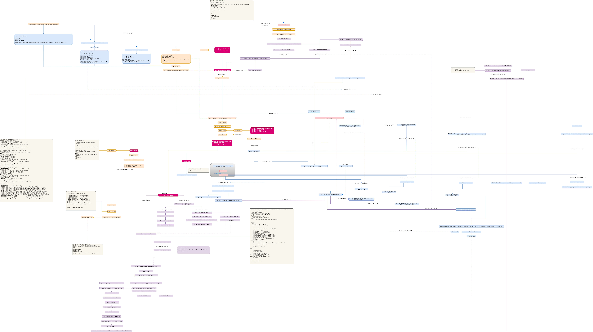

# ESP32 BlueDroid(Fluoride) BREDR SPP Server

理解BlueDroid(Fluoride)蓝牙协议栈，分析BREDR SPP Server工作原理


* [一、参考文档](#一参考文档)
* [二、示例拷贝编译](#二示例拷贝编译)
* [三、显示数据](#三显示数据)
* [四、协议栈log](#四协议栈log)
* [五、echo](#五echo)
* [六、分析处理流程](#六分析处理流程)
* [七、服务通道号](#七服务通道号)
* [八、连接流程参考](#八连接流程参考)

## 一、参考文档

* [esp32_bluetooth_architecture_cn.pdf](refers/esp32_bluetooth_architecture_cn.pdf)
* [0158_ESP32-DevKitC.md](0158_ESP32-DevKitC.md)
* [0158_ESP32-DevKitC bluedroid](0158_ESP32-DevKitC.md#bluedroid)
* [0159_pip_source_modify.md](0159_pip_source_modify.md)
* [0150_BlueZ.md](0150_BlueZ.md)
* [0153_btmon_HCI_ACL.md](0153_btmon_HCI_ACL.md)
* [0154_CC2541_SimpleBLEPeripheral.md](0154_CC2541_SimpleBLEPeripheral.md)
* [0160_ESP32_BLE_SPP_Server.md](0160_ESP32_BLE_SPP_Server.md)

## 二、示例拷贝编译

* cd ~/esp && . ~/esp/esp-idf/export.sh
* 编译server软件
  * cp esp-idf/examples/bluetooth/bluedroid/classic_bt/bt_spp_acceptor . -r
* cd bt_spp_acceptor
* 自动编译烧录监视，`auto.sh`便于调试，省得输入那么多命令
  ```bash
  #!/bin/bash
  
  if [ -z "`idf.py --version | grep 'command not found'`" ]; then
          echo "~/esp/esp-idf/export.sh"
          . ~/esp/esp-idf/export.sh
  fi
  
  # [    3.717759] usb 1-1.1: cp210x converter now attached to ttyUSB0
  USBDevice=`dmesg | grep 'cp210x' | grep 'ttyUSB*'`
  
  if [ ! -z "$USBDevice" ]; then
          deviceName=${USBDevice##* }
          idf.py build
          idf.py -p /dev/$deviceName flash
          idf.py -p /dev/$deviceName monitor
  fi
  ```

## 三、显示数据

```diff
diff --git a/main/example_spp_acceptor_demo.c b/main/example_spp_acceptor_demo.c
index 4abe7d5..da6a130 100644
--- a/main/example_spp_acceptor_demo.c
+++ b/main/example_spp_acceptor_demo.c
@@ -29,7 +29,7 @@
 #define EXAMPLE_DEVICE_NAME "ESP_SPP_ACCEPTOR"
 #define SPP_SHOW_DATA 0
 #define SPP_SHOW_SPEED 1
-#define SPP_SHOW_MODE SPP_SHOW_SPEED    /*Choose show mode: show data or speed*/
+#define SPP_SHOW_MODE SPP_SHOW_DATA    /*Choose show mode: show data or speed*/

 static const esp_spp_mode_t esp_spp_mode = ESP_SPP_MODE_CB;

```

## 四、协议栈log

* idf.py menuconfig
  * (Top) -> Component config -> Bluetooth -> Bluedroid Options -> BT DEBUG LOG LEVEL
    * 默认都是2，看情况添加，对于做数据分析的人来说，全部改成6可能会比较好，log太多可能是个问题 :)
    * 作为协议分析，那就全部改成6，也就是输出所有的log信息

## 五、echo

```diff
diff --git a/main/example_spp_acceptor_demo.c b/main/example_spp_acceptor_demo.c
index 4abe7d5..a90d504 100644
--- a/main/example_spp_acceptor_demo.c
+++ b/main/example_spp_acceptor_demo.c
@@ -29,7 +29,7 @@
 #define EXAMPLE_DEVICE_NAME "ESP_SPP_ACCEPTOR"
 #define SPP_SHOW_DATA 0
 #define SPP_SHOW_SPEED 1
-#define SPP_SHOW_MODE SPP_SHOW_SPEED    /*Choose show mode: show data or speed*/
+#define SPP_SHOW_MODE SPP_SHOW_DATA    /*Choose show mode: show data or speed*/

 static const esp_spp_mode_t esp_spp_mode = ESP_SPP_MODE_CB;

@@ -80,6 +80,7 @@ static void esp_spp_cb(esp_spp_cb_event_t event, esp_spp_cb_param_t *param)
         ESP_LOGI(SPP_TAG, "ESP_SPP_DATA_IND_EVT len=%d handle=%d",
                  param->data_ind.len, param->data_ind.handle);
         esp_log_buffer_hex("",param->data_ind.data,param->data_ind.len);
+               esp_spp_write(param->write.handle, param->data_ind.len, param->data_ind.data);
 #else
         gettimeofday(&time_new, NULL);
         data_num += param->data_ind.len;
```

## 六、分析处理流程

```
D (76848) BT_HCI: Receive packet event_code=0x14
D (76848) BT_BTM: btm_handle_to_acl_index: 128
D (76848) BT_BTM: btm_pm_proc_mode_change switched from SNIFF to ACTIVE.
D (76848) BT_HCI: HCI Enqueue Comamnd opcode=0xc35
D (76858) BT_HCI: reassemble_and_dispatch
D (76868) BT_BTM: btm mode change to active; check l2c_link for outgoing packets
D (76868) BT_L2CAP: l2c_link_check_send_pkts
D (76878) BT_L2CAP: partial_segment_being_sent=0,link_state=4,power_mode=0
D (76888) BT_L2CAP: RR scan pri=2, lcid=0x0040, q_cout=0
D (76888) BT_BTM: btm_cont_rswitch
D (76898) BT_L2CAP: L2CAP - rcv_cid CID: 0x0040
D (76898) BT_L2CAP: L2CAP - st: OPEN evt: 20
D (76898) BT_RFCOMM: PORT_DataInd with data length 7, p_mcb:0x3ffc3e54,p_port:0x3ffc39d8,dlci:2
D (76908) BT_APPL: bta_jv_port_data_co_cback, p_cb:0x3ffc3480, p_pcb:0x3ffc3534, len:65535, type:1
I (76918) BT_APPL: bta_jv_pm_state_change(p_cb: 0x3ffc3618, handle: 0x81, busy/idle_state: 1, app_id: 255, conn_state: 7)
D (76928) BT_APPL: bta_dm_pm_cback: st(7), id(26), app(255)
D (76938) BT_APPL: bta_dm_pm_stop_timer:
D (76938) BT_APPL: bta_dm_pm_set_mode: srvcsid: 26, state: 7, j: 4
I (76948) BT_BTM: BTM_SetPowerMode: pm_id 0 BDA: f8118423 mode:0x0
D (76958) BT_BTM: BTM_SetPowerMode: mode:0x0 interval 0 max:0, min:0
D (76958) BT_BTC: btc_transfer_context msg 1 15 30 0x3ffcfc20
I (76968) BT_APPL: bta_jv_pm_state_change(p_cb: 0x3ffc3618, handle: 0x81, busy/idle_state: 2, app_id: 255, conn_state: 6)
D (76978) BT_APPL: bta_dm_pm_cback: st(6), id(26), app(255)
D (76988) BT_APPL: bta_dm_pm_stop_timer:
D (76988) BT_APPL: bta_dm_pm_set_mode: srvcsid: 26, state: 6, j: 4
D (76998) BT_APPL: bta_dm_pm_set_mode dm_pm_timer:0, 7197
D (76998) BT_APPL: bta_dm_pm_set_mode dm_pm_timer:1, 7197
D (77008) BT_APPL: bta_dm_pm_set_mode dm_pm_timer:2, 7197
D (77008) BT_APPL: bta_dm_pm_set_mode dm_pm_timer:3, 7197
D (77018) BT_APPL: bta_dm_pm_set_mode dm_pm_timer:4, 7197
D (77018) BT_APPL: bta_dm_pm_set_mode dm_pm_timer:5, 7197
D (77028) BT_APPL: bta_dm_pm_set_mode dm_pm_timer:6, 7197
D (77038) BT_APPL: BTA got event 0x10e
D (77038) BT_APPL: bta_dm_sm_execute event:0xe
D (77038) BT_APPL: bta_dm_pm_btm_status status: 0
D (77048) BT_APPL: bta_dm_pm_stop_timer:
D (77048) BT_APPL: bta_dm_pm_set_mode: srvcsid: 26, state: 6, j: 4
D (77058) BT_APPL: bta_dm_pm_set_mode dm_pm_timer:0, 7197
D (77058) BT_APPL: bta_dm_pm_set_mode dm_pm_timer:1, 7197
D (77068) BT_APPL: bta_dm_pm_set_mode dm_pm_timer:2, 7197
D (77068) BT_APPL: bta_dm_pm_set_mode dm_pm_timer:3, 7197
D (77078) BT_APPL: bta_dm_pm_set_mode dm_pm_timer:4, 7197
D (77088) BT_APPL: bta_dm_pm_set_mode dm_pm_timer:5, 7197
D (77088) BT_APPL: bta_dm_pm_set_mode dm_pm_timer:6, 7197
D (77098) BT_BTC: btc_transfer_context msg 1 8 31 0x3ffcfc90
D (77098) BT_BTC: btc_thread_handler msg 1 15 30 0x3ffbd148
I (77108) SPP_ACCEPTOR_DEMO: ESP_SPP_DATA_IND_EVT len=7 handle=129
I (77118) : 30 31 32 33 34 35 36
D (77118) BT_BTC: btc_thread_handler msg 1 8 31 0x3ffd011c
D (77128) BT_BTC: btc_dm_upstreams_cback  ev: 31
D (77128) BT_BTC: BTA_DM_PM_MODE_CHG_EVT mode:0
I (77128) SPP_ACCEPTOR_DEMO: ESP_BT_GAP_MODE_CHG_EVT mode:0
D (81638) BT_HCI: Receive packet event_code=0x14
D (81638) BT_BTM: btm_handle_to_acl_index: 128
D (81638) BT_BTM: btm_pm_proc_mode_change switched from ACTIVE to SNIFF.
D (81638) BT_BTM: btm mode change to active; check l2c_link for outgoing packets
D (81648) BT_L2CAP: l2c_link_check_send_pkts
D (81658) BT_L2CAP: partial_segment_being_sent=0,link_state=4,power_mode=0
D (81658) BT_L2CAP: RR scan pri=2, lcid=0x0040, q_cout=0
D (81668) BT_BTM: btm_cont_rswitch
D (81668) BT_APPL: BTA got event 0x10e
D (81678) BT_APPL: bta_dm_sm_execute event:0xe
D (81678) BT_APPL: bta_dm_pm_btm_status status: 2
D (81678) BT_APPL: bta_dm_pm_stop_timer:
D (81688) BT_BTC: btc_transfer_context msg 1 8 31 0x3ffcfc90
D (81698) BT_BTC: btc_thread_handler msg 1 8 31 0x3ffd011c
D (81698) BT_BTC: btc_dm_upstreams_cback  ev: 31
D (81708) BT_BTC: BTA_DM_PM_MODE_CHG_EVT mode:2
I (81708) SPP_ACCEPTOR_DEMO: ESP_BT_GAP_MODE_CHG_EVT mode:2
D (82798) BT_HCI: Receive packet event_code=0x2e
```

* 术语：
  * ccb: Channel Control Block
  * lcb: Link Control Block
  * rcb: Registration Control Block, Every application (e.g. RFCOMM, SDP, 231 ** TCS etc) that registers with L2CAP is assigned one of these
  * mcb: RFCOMM multiplexer Control Block
  * dlci：Data Link Connection Identifier
  * lcid: local channel id



## 七、服务通道号

* SCN: Server Channel Number
  * BTA_JvGetChannelId()
    * 通过BTM_AllocateSCN()获取
* 系统启动SCN分配：
  ```
  I (2079) BT_APPL: BTA_JvGetChannelId
  D (2079) BT_APPL: BTA got event 0x1a02
  D (2089) BT_BTM: BTM_AllocateSCN
  I (2099) BT_APPL: BTA_JvCreateRecordByUser
  D (2109) BT_APPL: BTA got event 0x1a05
  D (2109) BT_APPL: add_spp_sdp: scn 1, service_name SPP_SERVER
  D (2119) BT_SDP: SDP_CreateRecord ok, num_records:1
  D (2119) BT_APPL: create_base_record: scn: 1, name: SPP_SERVER, with_obex: 0
  D (2129) BT_APPL: create_base_record: successfully created base service record, handle: 0x00010000, scn: 1, name: SPP_SERVER, with_obex: 0
  D (2139) BT_APPL: add_spp_sdp: service registered successfully, service_name: SPP_SERVER, handle 0x00010000)
  I (2149) BT_APPL: BTA_JvRfcommStartServer
  D (2159) BT_APPL: BTA got event 0x1a09
  ```
* 参考：
  * [作为客户端生成虚拟串口](0150_BlueZ.md#作为客户端生成虚拟串口)
* sdptool records A8:03:2A:EB:EC:4A
  ```
  Service Name: SPP_SERVER
  Service RecHandle: 0x10000
  Service Class ID List:
    "Serial Port" (0x1101)
  Protocol Descriptor List:
    "L2CAP" (0x0100)
    "RFCOMM" (0x0003)
      Channel: 1
  Profile Descriptor List:
    "Serial Port" (0x1101)
      Version: 0x0102
  
  ```
* 需要理解L2CAP的CID的Channel和RFCOMM的Channel不是一个概念，可以认为是二级Port；
  * L2CAP的CID是一级Channel，实际名字叫lcid(local channel id);
  * RFCOMM在L2CAP的CID的基础上又做了一层Channel的概念，实际名字叫dlci(Data Link Connection Identifier);

## 八、连接流程参考

* [Core_v5.0.pdf](refers/Core_v5.0.pdf)
  * Vol2: Core System Package [BR/EDR Controller volume]
    * Part F: Message Sequence Charts
      * ACL Connection Estatblishment and Detachment
