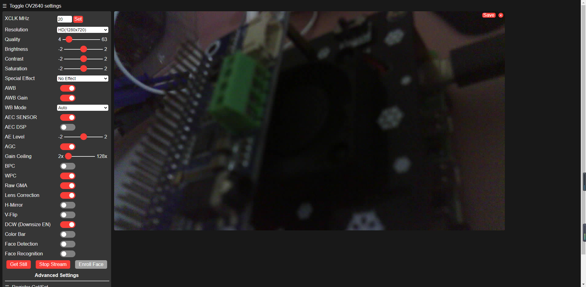

# esp-who

搭建esp-who环境，测试web camera

## 参考文档

* [0158_ESP32-DevKitC.md](0158_ESP32-DevKitC.md)
* [ESP-EYE 入门指南](https://github.com/espressif/esp-who/blob/master/docs/zh_CN/get-started/ESP-EYE_Getting_Started_Guide.md)
* [使用 multipart/x-mixed-replace 实现](https://segmentfault.com/a/1190000018563132)

## 测试web camera

* 树莓派
* sudo apt-get install git wget flex bison gperf python python-pip python-setuptools cmake ninja-build ccache libffi-dev libssl-dev dfu-util
* 已经有python3，不用装，没有就装一下：
  * sudo apt-get install python3 python3-pip python3-setuptools
* sudo update-alternatives --install /usr/bin/python python /usr/bin/python3 10
* git clone --recursive https://github.com/espressif/esp-who.git 
* cd esp-who
* cd esp-idf && ./install.sh && cd -
* . ./esp-idf/export.sh
* cd examples/single_chip/camera_web_server
* idf.py menuconfig
  ```
   /home/pi/esp-who/examples/single_chip/camera_web_server/sdkconfig - Espressif I
  o→ Camera Web Server → WiFi Settings ──────────────────────────────────────────
    ┌───────────────────────────── WiFi Settings ─────────────────────────────┐
    │  Arrow keys navigate the menu.  <Enter> selects submenus ---> (or empty │
    │  submenus ----).  Highlighted letters are hotkeys.  Pressing <Y>        │
    │  includes, <N> excludes, <M> modularizes features.  Press <Esc><Esc> to │
    │  exit, <?> for Help, </> for Search.  Legend: [*] built-in  [ ]         │
    │ ┌─────────────────────────────────────────────────────────────────────┐ │
    │ │    (zengjf) Camera Host Name                                        │ │
    │ │    (zengjf) WiFi STA SSID                                           │ │
    │ │    (xxxxxxxxx) WiFi STA Password                                    │ │
    │ │    (ESP32-Camera) WiFi AP SSID                                      │ │
    │ │    ()  WiFi AP Password                                             │ │
    │ │    (1) Maximal STA connections                                      │ │
    │ │    ()  WiFi AP Channel                                              │ │
    │ │    (192.168.4.1) WiFi AP IP Address                                 │ │
    │ │    (5) Maximum retry                                                │ │
    │ │                                                                     │ │
    │ └─────────────────────────────────────────────────────────────────────┘ │
    ├─────────────────────────────────────────────────────────────────────────┤
    │        <Select>    < Exit >    < Help >    < Save >    < Load >         │
    └─────────────────────────────────────────────────────────────────────────┘
  ```
* cat auto.sh
  ```bash
  #!/bin/bash
  
  # if [ -z "`idf.py --version | grep 'command not found'`" ]; then
  #         echo "~/esp/esp-idf/export.sh"
  #         . ~/esp/esp-idf/export.sh
  # fi
  
  # [    3.717759] usb 1-1.1: cp210x converter now attached to ttyUSB0
  USBDevice=`dmesg | grep 'cp210x' | grep 'ttyUSB*'`
  
  if [ ! -z "$USBDevice" ]; then
          deviceName=${USBDevice##* }
          idf.py build
          idf.py -p /dev/$deviceName flash
          idf.py -p /dev/$deviceName monitor
  fi
  ```
* log输出
  ```
  I (1857) wifi:wifi driver task: 3ffc6634, prio:23, stack:3584, core=0
  I (1857) system_api: Base MAC address is not set, read default base MAC address from BLK0 of EFUSE
  I (1857) system_api: Base MAC address is not set, read default base MAC address from BLK0 of EFUSE
  I (1877) wifi:wifi firmware version: 101cee8
  I (1877) wifi:config NVS flash: enabled
  I (1877) wifi:config nano formating: disabled
  I (1877) wifi:Init dynamic tx buffer num: 32
  I (1887) wifi:Init data frame dynamic rx buffer num: 32
  I (1887) wifi:Init management frame dynamic rx buffer num: 32
  I (1897) wifi:Init management short buffer num: 32
  I (1897) wifi:Init static tx buffer num: 16
  I (1907) wifi:Init static rx buffer size: 1600
  I (1907) wifi:Init static rx buffer num: 10
  I (1907) wifi:Init dynamic rx buffer num: 32
  I (1917) camera wifi: wifi_init_softap finished.SSID:ESP32-Camera password:
  I (1927) camera wifi: wifi_init_sta finished.
  I (1927) camera wifi: connect to ap SSID:zengjf password:xxxxxxxxx
  W (1937) phy_init: failed to load RF calibration data (0xffffffff), falling back to full calibration
  I (2097) phy: phy_version: 4180, cb3948e, Sep 12 2019, 16:39:13, 0, 2
  I (2157) wifi:mode : sta (ac:67:b2:6f:aa:44) + softAP (ac:67:b2:6f:aa:45)
  I (2157) wifi:Total power save buffer number: 8
  I (2157) wifi:Init max length of beacon: 752/752
  I (2157) wifi:Init max length of beacon: 752/752
  I (2167) wifi:Set ps type: 0
  
  I (2167) gpio: GPIO[13]| InputEn: 1| OutputEn: 0| OpenDrain: 0| Pullup: 1| Pulldown: 0| Intr:0
  I (2177) gpio: GPIO[14]| InputEn: 1| OutputEn: 0| OpenDrain: 0| Pullup: 1| Pulldown: 0| Intr:0
  I (2187) gpio: GPIO[5]| InputEn: 1| OutputEn: 0| OpenDrain: 0| Pullup: 1| Pulldown: 0| Intr:0
  I (2197) gpio: GPIO[13]| InputEn: 1| OutputEn: 0| OpenDrain: 0| Pullup: 1| Pulldown: 0| Intr:0
  I (2207) gpio: GPIO[14]| InputEn: 1| OutputEn: 0| OpenDrain: 0| Pullup: 1| Pulldown: 0| Intr:0
  I (2217) gpio: GPIO[25]| InputEn: 1| OutputEn: 0| OpenDrain: 0| Pullup: 1| Pulldown: 0| Intr:0
  I (2227) gpio: GPIO[27]| InputEn: 1| OutputEn: 0| OpenDrain: 0| Pullup: 1| Pulldown: 0| Intr:0
  I (2227) gpio: GPIO[34]| InputEn: 1| OutputEn: 0| OpenDrain: 0| Pullup: 1| Pulldown: 0| Intr:0
  I (2237) gpio: GPIO[35]| InputEn: 1| OutputEn: 0| OpenDrain: 0| Pullup: 1| Pulldown: 0| Intr:0
  I (2247) gpio: GPIO[36]| InputEn: 1| OutputEn: 0| OpenDrain: 0| Pullup: 1| Pulldown: 0| Intr:0
  I (2257) gpio: GPIO[37]| InputEn: 1| OutputEn: 0| OpenDrain: 0| Pullup: 1| Pulldown: 0| Intr:0
  I (2267) gpio: GPIO[38]| InputEn: 1| OutputEn: 0| OpenDrain: 0| Pullup: 1| Pulldown: 0| Intr:0
  I (2277) gpio: GPIO[39]| InputEn: 1| OutputEn: 0| OpenDrain: 0| Pullup: 1| Pulldown: 0| Intr:0
  I (2287) sccb: pin_sda 18 pin_scl 23
  
  I (2407) camera: Detected OV2640 camera
  I (2407) camera: Allocating 2 frame buffers (750 KB total)
  I (2407) camera: Allocating 375 KB frame buffer in PSRAM
  I (2507) camera: Allocating 375 KB frame buffer in PSRAM
  I (2927) camera_httpd: Starting web server on port: '80'
  I (2927) camera_httpd: Starting stream server on port: '81'
  I (3797) wifi:ap channel adjust o:1,1 n:11,2
  I (3797) wifi:new:<11,0>, old:<1,1>, ap:<11,2>, sta:<11,0>, prof:1
  I (4577) wifi:state: init -> auth (b0)
  I (4587) wifi:state: auth -> assoc (0)
  I (4587) wifi:state: assoc -> run (10)
  I (4607) wifi:connected with zengjf, aid = 75, channel 11, BW20, bssid = 04:d3:b5:e5:a3:08
  I (4607) wifi:security type: 3, phy: bgn, rssi: -26
  I (4647) wifi:pm start, type: 0
  
  I (4687) wifi:AP's beacon interval = 102400 us, DTIM period = 1
  I (5347) tcpip_adapter: sta ip: 192.168.3.22, mask: 255.255.255.0, gw: 192.168.3.1
  I (5347) camera wifi: got ip:192.168.3.22
  ```
* http://192.168.3.22/
  * 

## IP Camera分析

* \
* 参考文档
  * [使用 multipart/x-mixed-replace 实现](https://segmentfault.com/a/1190000018563132)
  * [利用flask将opencv实时视频流输出到浏览器](https://www.cnblogs.com/arkenstone/p/7159615.html)
* [mjpg-streamer](https://github.com/jacksonliam/mjpg-streamer)
  * [处理发送给浏览器的数据处理核心](https://github.com/jacksonliam/mjpg-streamer/blob/master/mjpg-streamer-experimental/plugins/output_http/httpd.c#L458)
* sudo apt-get install libjpeg-dev
* git clone https://github.com/jacksonliam/mjpg-streamer
  * 如果前面没有安装`libjped-dev`，编译报错没有头文件，需要先删除`_build`目录，否者会出现段错误
    * https://github.com/jacksonliam/mjpg-streamer/issues/218
  * make
  * help
    * ./mjpg_streamer -i "input_uvc.so --help"
    * ./mjpg_streamer -o "./output_http.so -h"
  * 使用方法参考：start.sh
    * ./mjpg_streamer -i "./input_uvc.so" -o "./output_http.so -w ./www -p 8008 -l 192.168.137.2"
      ```
      MJPG Streamer Version: git rev: 85f89a8c321e799fabb1693c5d133f3fb48ee748
       i: Using V4L2 device.: /dev/video0
       i: Desired Resolution: 640 x 480
       i: Frames Per Second.: -1
       i: Format............: JPEG
       i: TV-Norm...........: DEFAULT
       i: Could not obtain the requested pixelformat: MJPG , driver gave us: YUYV
          ... will try to handle this by checking against supported formats.
          ... Falling back to YUV mode (consider using -yuv option). Note that this requires much more CPU power
      UVCIOC_CTRL_ADD - Error at Pan (relative): Inappropriate ioctl for device (25)
      UVCIOC_CTRL_ADD - Error at Tilt (relative): Inappropriate ioctl for device (25)
      UVCIOC_CTRL_ADD - Error at Pan Reset: Inappropriate ioctl for device (25)
      UVCIOC_CTRL_ADD - Error at Tilt Reset: Inappropriate ioctl for device (25)
      UVCIOC_CTRL_ADD - Error at Pan/tilt Reset: Inappropriate ioctl for device (25)
      UVCIOC_CTRL_ADD - Error at Focus (absolute): Inappropriate ioctl for device (25)
      UVCIOC_CTRL_MAP - Error at Pan (relative): Inappropriate ioctl for device (25)
      UVCIOC_CTRL_MAP - Error at Tilt (relative): Inappropriate ioctl for device (25)
      UVCIOC_CTRL_MAP - Error at Pan Reset: Inappropriate ioctl for device (25)
      UVCIOC_CTRL_MAP - Error at Tilt Reset: Inappropriate ioctl for device (25)
      UVCIOC_CTRL_MAP - Error at Pan/tilt Reset: Inappropriate ioctl for device (25)
      UVCIOC_CTRL_MAP - Error at Focus (absolute): Inappropriate ioctl for device (25)
      UVCIOC_CTRL_MAP - Error at LED1 Mode: Inappropriate ioctl for device (25)
      UVCIOC_CTRL_MAP - Error at LED1 Frequency: Inappropriate ioctl for device (25)
      UVCIOC_CTRL_MAP - Error at Disable video processing: Inappropriate ioctl for device (25)
      UVCIOC_CTRL_MAP - Error at Raw bits per pixel: Inappropriate ioctl for device (25)
       o: www-folder-path......: ./www/
       o: HTTP TCP port........: 8008
       o: HTTP Listen Address..: 192.168.137.2
       o: username:password....: disabled
       o: commands.............: enabled
      ```
* http://192.168.137.2:8008/
  * http://192.168.137.2:8008/stream.html
    * \
* /var/www/html/index.html
  ```html
  <!DOCTYPE html>
  <html>
    <head>
      <title>IP Camera</title>
    </head>
  
    <body>
      <div>
        
      </div>
    </body>
  </html>
  ```