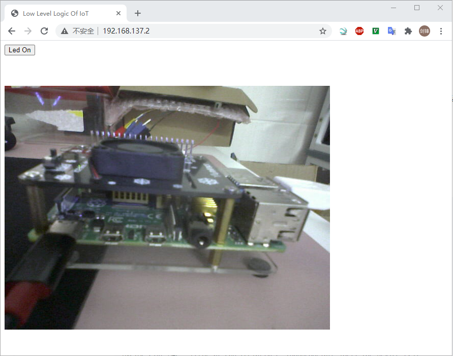

# Led Button

Led&Button板控制

## 参考文档

* https://github.com/ZengjfOS/RaspberryPi/tree/gpioIrq

## 硬件设计

https://oshwhub.com/zengjf/USB2TTLBoard_copy_copy_copy_copy

## 命令行测试功能

* sudo su
* 查看gpio分布情况
  * cat /sys/kernel/debug/gpio
* cd /sys/class/gpio
* led
  * echo 10 > export
  * cd gpio10
  * echo out > direction
  * echo 1 > value
  * echo 0 > value
* button
  * mkdir gpioirq
  * cd gpioirq
  * git init
  * git pull https://github.com/ZengjfOS/RaspberryPi gpioIrq:master
  * sudo ./gpioIrq 9 both

## 配置

* 参考文档
  * https://www.raspberrypi.org/documentation/remote-access/web-server/apache.md
* sudo apt-get install apache2 apache2-utils
* pip3 install websockets
* sudo service apache2 restart
* sudo apt install php libapache2-mod-php -y
* php log
  * /etc/php/7.3/apache2/php.ini
    ```ini
    ; Log errors to specified file. PHP's default behavior is to leave this value
    ; empty.
    ; http://php.net/error-log
    ; Example:
    error_log = /var/www/html/php_errors.log
    ; Log errors to syslog (Event Log on Windows).
    ;error_log = syslog
    ```
* 用户及用户组权限修改，防止没有权限
  * vim /etc/apache2/envvars
    ```shell
    # Since there is no sane way to get the parsed apache2 config in scripts, some
    # settings are defined via environment variables and then used in apache2ctl,
    # /etc/init.d/apache2, /etc/logrotate.d/apache2, etc.
    export APACHE_RUN_USER=pi
    export APACHE_RUN_GROUP=pi
    ```
* chmod 777 /var/www/html
  * 默认pi用户无法在该目录创建文件导致无法看到错误信息log和后面我们自己创建的文件，所以添加权限，毕竟不是做产品，而是做尝试；
* sudo service apache2 restart

## 网页处理

* 网页路径：/var/www/html
* led控制预操作：
  * cd /sys/class/gpio
    * echo 10 > export
    * cd gpio10
    * echo out > direction
* button控制预操作：
  * cd /sys/class/gpio
    * echo 9 > export
    * cd gpio9
    * echo both > edge
* https://github.com/ZengjfOS/RaspberryPi/tree/LowLevelLogicOfIoT
  * sudo su
  * ./config.sh
  * python3 ws.py

## IP Camera

* [0163_esp-who.md](0163_esp-who.md)
* 添加摄像头： 
  ```html
  <div style="margin-top: 60px;">
    
  </div>
  ```
* 显示界面如下：  
  


