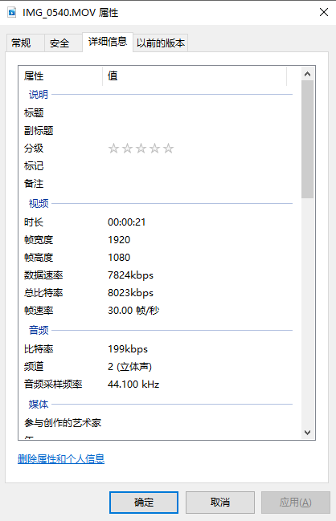

# Windows SMB 4 iPhone

将iPhone中的视频和照片共享出来

## 参考文档

* [iPhone使用smb查看Windows共享文件夹](https://blog.csdn.net/XYCDMJ/article/details/106958870)

## 无密码访问

[控制面板] -> [网络和 Internet] -> [网络和共享中心] -> [高级共享设置] -> [密码保护的共享] -> [无密码保护的共享]

## 设置文件夹

[文件夹] -> [右击] -> [属性] -> [共享] -> [共享(S)] -> 选择 [Everyone] -> 添加 -> 权限级别 -> 读写 -> [共享]

## iPhone访问

[Files app] -> 右上角... -> [Connect to Server] -> [Server] -> smb://192.168.3.9 -> [Guest]

## iPhone HD视频参数

1080P

