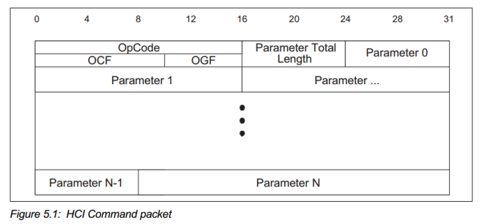

# BT HCI Command

理解蓝牙HCI命令格式，看懂QBQ认证HCI测试命令

## 参考文档

* [Core_v5.0.pdf](refers/Core_v5.0.pdf)
  * Vol 2: Core System Package [BR/EDR Controller volume]
    * Part E: Host Controller Interface Functional Specification
      * 5 HCI Data Formats
      * 7 HCI Commands Commands
        * 7.6 Testing Commands
        * 7.8 LE Controller Commands
          * 7.8.29 LE Transmitter Test Command
            * 知道为什么UART数据传输第2、3个字节`0x1E, 0x20`
  * Vol 4: Host Controller Interface [Transport Layer]
    * Part A: UART Transport Layer
      * 2 Protocol
        * 知道为什么UART数据传输第1个字节是`0x01`
  * Vol 6: Core System Package [Low Energy Controller volume]
    * Part F: Direct Test Mode
      * 4 LE Test Packets Format
* [传统蓝牙HCI Command（蓝牙HCI命令）详细介绍](https://blog.csdn.net/XiaoXiaoPengBo/article/details/107642672)
* [Bluetooth LE Testing Over UART](https://waynebayever.wordpress.com/2014/12/17/bluetooth-le-testing-over-uart/)

## HCI Command Packet



* OpCode:每个命令被分配一个2字节的操作码（opration code），用来唯一地识别不同类型的命令,操作码(opration code)参数分为两个字段，称为操作码组字段(Opcode Group Field, OGF)和操作码命令字段(Opcode Command Field, OCF)。其中OGF占用高6bit字节，OCF占用低10bit字节。
  * 一共有以下几组OGF：  
    ```
    说明                              | OGF  |详细描述
    ----------------------------------|------|---
    Link Control commands             | 0x01 | 链路控制OGF，也就是控制蓝牙芯片跟remote沟通的命令
    Link Policy commands              | 0x02 | 链路策略OGF，也就是写一些Policy，比如转换角色等
    HCI Control and Baseband commands | 0x03 | 控制本地芯片跟基带的OGF。比如reset本地芯片等。
    Informational Parameters commands | 0x04 | 读取信息的OGF，比如读取本地芯片的LMP版本呢，支持的command,蓝牙地址等
    status parameters commands        | 0x05 | 状态参数OGF，比如读取RSSI等。
    Testing commands                  | 0x06 | 测试命令的OGF，比如让芯片进入测试模式（DUT，device under test）
    LE Controller commands            | 0x08 | BLE的command
    vendor-specific debug commands    | 0x3F | 此部分是vendor定义的，也就是芯片厂商为了扩展core文档的HCI command定义
    ```
  * OCF众多，在每个OGF下都有一堆的OCF定义
* Parameter Total Length：后续参数的长度；
* Parameter: 每个command的para不同；

## LE Transmitter Test

https://waynebayever.wordpress.com/2014/12/17/bluetooth-le-testing-over-uart/

The LE Transmitter Test Command has 3 parameters – the transmit channel.  See Volume 2 Part E Section 7.8.29.  Here is the command:

```
0x01, 0x1E, 0x20, 0x03, <channel>, <data length>, <packet type>
```

* 0x01 – HCI over UART Command byte
* 0x1E 0x20 – OpCode.  In this case the OGF is 0x08 (001000b) and the OCF is 0x1E (0000011110b) which makes 00100000 00011110b or 0x201E.
* 0x03 – there 3 parameters
* \<channel\> – the formula is N = (F – 2402) / 2, the range is 0x00 to 0x27 (39)
* \<data length\> – 0x00 to 0xFF (0 to 255 bytes)
* \<packet type\> – see the following table:

The Controller sends an Event back to the Host to acknowledge the Command.  The format for this Event is

```
0x04, 0x0E, <Commands Available>, 0x01, 0x1E, 0x20, <status>
```

* 0x04 – the single byte that precedes all Events in HCI over UART
* 0x0E – Command Complete Event Code
* \<Commands Available\> – how many commands the Controller is able to receive
* 0x01 0x1E 0x20 – these are the HCI over UART byte and the Opcode that are being sent back to the Host
* \<status\> – 0x00 if the command was successful, any other value indicates an error.  See Volume 2 Part D of the Core Spec for a list of error codes.
