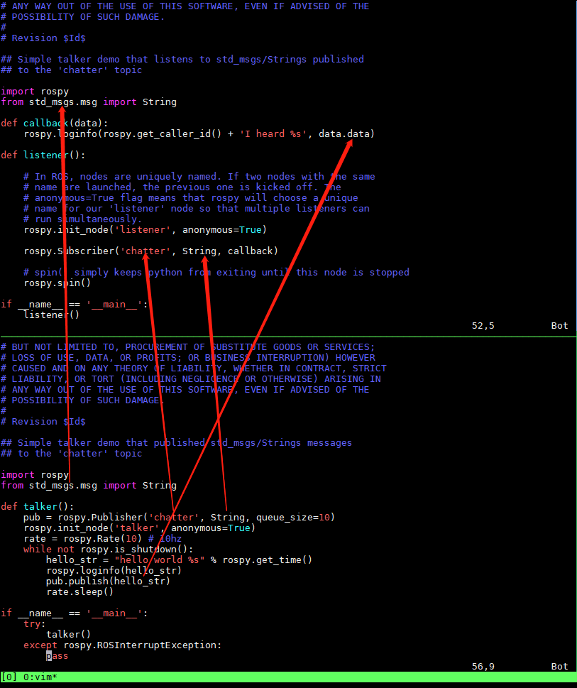
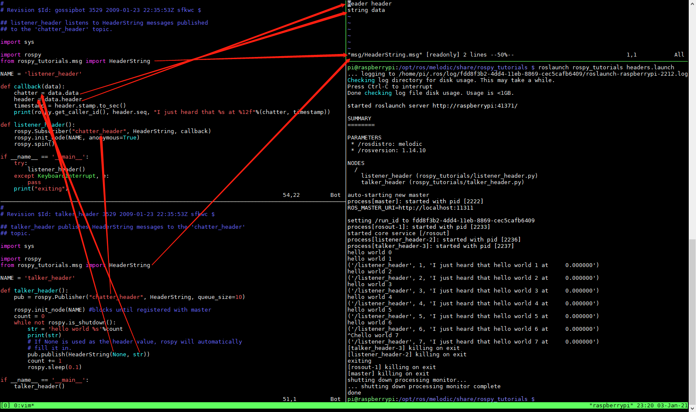
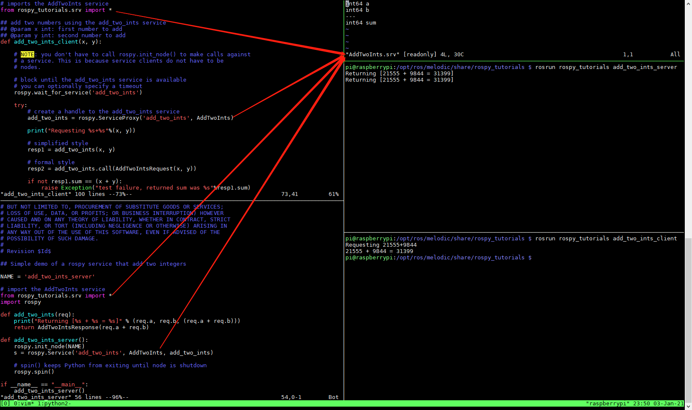
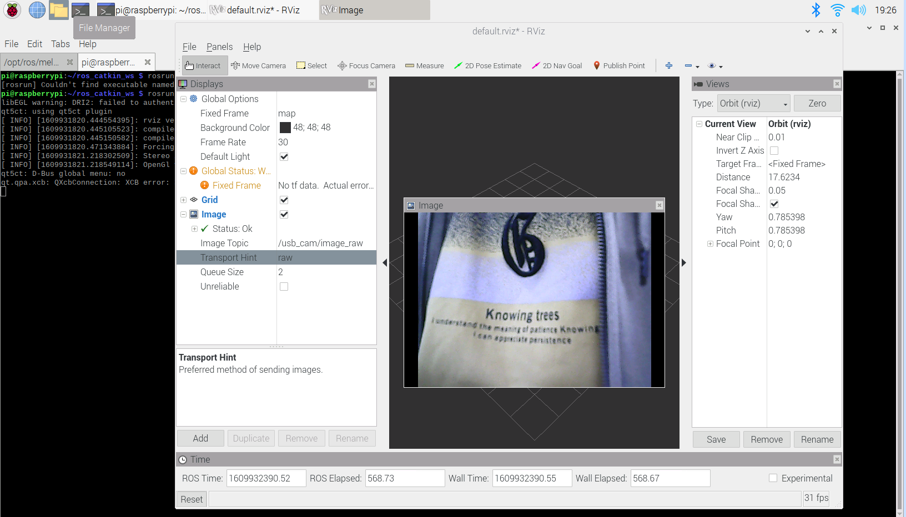

# ROS usb_cam

尝试一下ROS USB Camear获取图像

## 参考文档

* [0042_ROS.md](0042_ROS.md)

## CMakeLists

* [catkin/CMakeLists.txt](http://wiki.ros.org/catkin/CMakeLists.txt)
* ~/ros_catkin_ws/src/ros_tutorials/rospy_tutorials/CMakeLists.txt

## message

### String

roslaunch -v rospy_tutorials talker_listener.launch

### HeaderString

用Android序列化和反序列化理解就可以了

* roslaunch rospy_tutorials headers.launch

## service

用Android Binder通信架构去理解ROS srv架构是非常合适的，可以认为ROS srv是基于TCP的Android Binder（基于共享内存）实现，当然Android可能借鉴于ROS的种处理架构；

* roscore
* rosrun rospy_tutorials add_two_ints_server
* rosrun rospy_tutorials add_two_ints_client

## 添加usb camera发行包

* cd ~/ros_catkin_ws
* rosinstall_generator usb_cam image_view --rosdistro melodic --deps --wet-only --tar > melodic-usb_cam.rosinstall
  * image_view在树莓派上无法使用，因为gtk库问题；
* wstool merge -t src melodic-usb_cam.rosinstall 
* wstool update -t src
* rosdep install --from-paths src --ignore-src --rosdistro melodic -y -r --os=debian:buster
* sudo ./src/catkin/bin/catkin_make_isolated --install -DCMAKE_BUILD_TYPE=Release --install-space /opt/ros/melodic
  * 这里最大的问题就是会重新全部编译，要等好久，那也是没办法的事
* roslaunch usb_cam usb_cam-test.launch
  * image_view在树莓派上无法使用，因为gtk库问题；
* rosrun rviz rviz
  * [Displays] -> [Add] -> [By display type] -> [Image] -> [Image Topic] -> /usb_cam/image_raw  
    
* ~/ros_catkin_ws/src/usb_cam
