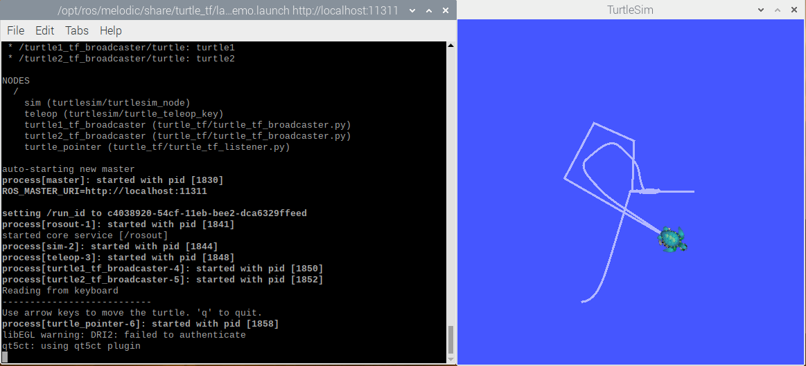
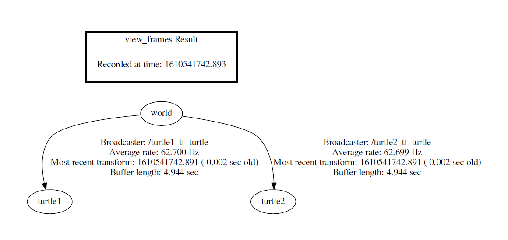
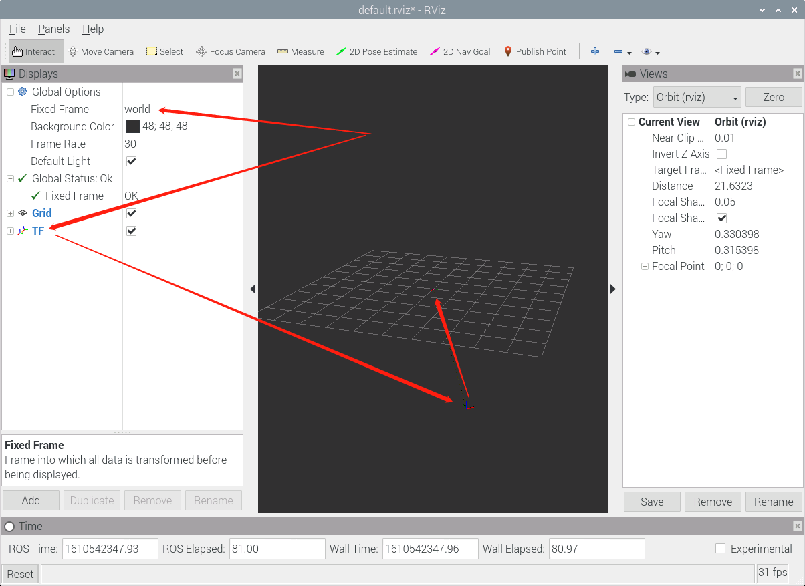
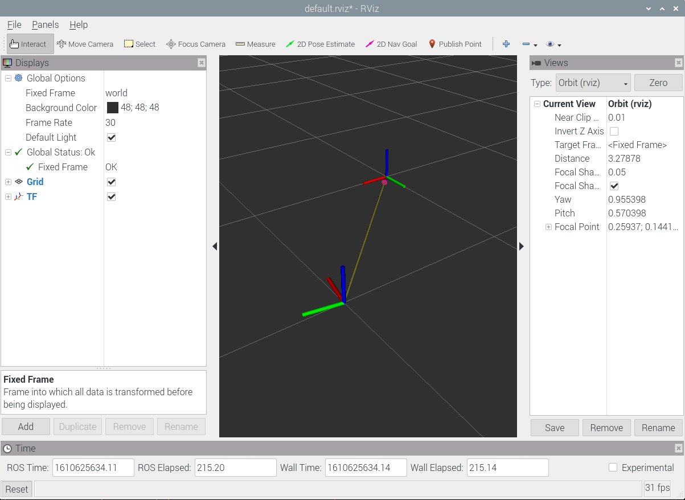

# ROS tf turtle

学习坐标变换实际运用方法

## 参考文档

* [18.tf坐标系广播与监听的编程实现](https://www.bilibili.com/video/BV1zt411G7Vn?p=19)
* [tf Tutorials Introduction to tf](http://wiki.ros.org/tf/Tutorials/Introduction%20to%20tf)
* [0042_ROS.md](0042_ROS.md)
* [0183_ROS_usb_cam.md](0183_ROS_usb_cam.md)

## 尝试运行

* 查看是否支持：
  * cd ~/ros_catkin_ws
  * find * -iname turtle_tf_demo.launch
    ```
    src/geometry_tutorials/turtle_tf/launch/turtle_tf_demo.launch
    ```
* roslaunch turtle_tf turtle_tf_demo.launch  
  

## 源代码

* ~/ros_catkin_ws/src/geometry_tutorials/turtle_tf
* https://github.com/ros/geometry_tutorials/tree/kinetic-devel/turtle_tf
  * python: https://github.com/ros/geometry_tutorials/tree/kinetic-devel/turtle_tf/nodes

## 弧度四元数

* RPY
  * R: roll，翻滚角
  * P: pitch，俯仰角
  * Y: yaw，偏航角
* 弧度制转化到四元数：
  ```python
  from tf_conversions.transformations import quaternion_from_euler
    
  if __name__ == '__main__':
  
    # RPY to convert: 90deg, 0, -90deg
    q = quaternion_from_euler(1.5707, 0, -1.5707)
  
    print "The quaternion representation is %s %s %s %s." % (q[0], q[1], q[2], q[3])
  ```
* 弧度旋转：
  ```python
  from tf.transformations import *
  
  q_orig = quaternion_from_euler(0, 0, 0)
  q_rot = quaternion_from_euler(pi, 0, 0)
  q_new = quaternion_multiply(q_rot, q_orig)
  print q_new
  ```

## geometry_tutorials

* ~/ros_catkin_ws/src/geometry_tutorials/turtle_tf/nodes/turtle_tf_broadcaster.py
  ```python
  import rospy
  
  import tf
  import turtlesim.msg
  
  
  def handle_turtle_pose(msg, turtlename):
      br = tf.TransformBroadcaster()
      # 发送坐标信息给坐标系，相当于关联了world和turtle1的关系
      br.sendTransform((msg.x, msg.y, 0),
                       tf.transformations.quaternion_from_euler(0, 0, msg.theta),
                       rospy.Time.now(),
                       turtlename,
                       "world")
  
  if __name__ == '__main__':
      rospy.init_node('tf_turtle')
      turtlename = rospy.get_param('~turtle')
      # 订阅turtle1的位置信息
      rospy.Subscriber('/%s/pose' % turtlename,
                       turtlesim.msg.Pose,
                       handle_turtle_pose,
                       turtlename)
      rospy.spin()
  ```
* ~/ros_catkin_ws/src/geometry_tutorials/turtle_tf/nodes/turtle_tf_listener.py
  ```python
  import rospy
  
  import math
  import tf
  import geometry_msgs.msg
  import turtlesim.srv
  
  if __name__ == '__main__':
      rospy.init_node('tf_turtle')
  
      listener = tf.TransformListener()
  
      # 创建turtle2
      rospy.wait_for_service('spawn')
      spawner = rospy.ServiceProxy('spawn', turtlesim.srv.Spawn)
      spawner(4, 2, 0, 'turtle2')
  
      # turtle2由这里控制
      turtle_vel = rospy.Publisher('turtle2/cmd_vel', geometry_msgs.msg.Twist, queue_size=1)
  
      rate = rospy.Rate(10.0)
      while not rospy.is_shutdown():
          try:
              # 获取turtle1和turtle2的坐标关系，后续计算只用到了x, y做计算
              # Returns: position as a translation (x, y, z) and orientation as a quaternion (x, y, z, w)
              (trans, rot) = listener.lookupTransform('/turtle2', '/turtle1', rospy.Time())
          except (tf.LookupException, tf.ConnectivityException, tf.ExtrapolationException):
              continue
  
          # 根据x, y计算计算角度
          angular = 4 * math.atan2(trans[1], trans[0])
          # 计算距离
          linear = 0.5 * math.sqrt(trans[0] ** 2 + trans[1] ** 2)
          msg = geometry_msgs.msg.Twist()
          # 设置线速度和角速度
          msg.linear.x = linear
          msg.angular.z = angular
          # 发布消息给turtle2
          turtle_vel.publish(msg)
  
          rate.sleep()
  ```
* ~/ros_catkin_ws/src/geometry_tutorials/turtle_tf/launch/turtle_tf_demo.launch
  ```xml
  <launch>
  
    <!-- Turtlesim Node-->
    <!-- turtle1 turtle2显示 -->
    <node pkg="turtlesim" type="turtlesim_node" name="sim"/>
  
    <!-- 用于控制turtle1 -->
    <node pkg="turtlesim" type="turtle_teleop_key" name="teleop" output="screen"/>
    <!-- Axes -->
    <param name="scale_linear" value="2" type="double"/>
    <param name="scale_angular" value="2" type="double"/>
  
    <!-- 监听turtle1坐标信息，将坐标发送给tf -->
    <node name="turtle1_tf_broadcaster" pkg="turtle_tf" type="turtle_tf_broadcaster.py" respawn="false" output="screen" >
      <param name="turtle" type="string" value="turtle1" />
    </node>
    <!-- 监听turtle2坐标信息，将坐标发送给tf -->
    <node name="turtle2_tf_broadcaster" pkg="turtle_tf" type="turtle_tf_broadcaster.py" respawn="false" output="screen" >
      <param name="turtle" type="string" value="turtle2" />
    </node>
    <!-- 产生turtle2，监听tf信息，获取turtle1 turtle2坐标，控制turtle2 -->
    <node name="turtle_pointer" pkg="turtle_tf" type="turtle_tf_listener.py" respawn="false" output="screen" >
    </node>
  
  </launch>
  ```

## tf_echo

* ~/ros_catkin_ws/src/geometry/tf/src/tf_echo.cpp
* https://github.com/davheld/tf/blob/master/src/tf_echo.cpp

```C
// ...省略

int main(int argc, char ** argv)
{
  //Initialize ROS
  ros::init(argc, argv, "tf_echo", ros::init_options::AnonymousName);

  if (argc != 3)
  {
    printf("Usage: tf_echo source_frame target_frame\n\n");
    printf("This will echo the transform from the coordinate frame of the source_frame\n");
    printf("to the coordinate frame of the target_frame. \n");
    printf("Note: This is the transform to get data from target_frame into the source_frame.\n");
    return -1;
  }

  ros::NodeHandle nh;
  //Instantiate a local listener
  echoListener echoListener;


  std::string source_frameid = std::string(argv[1]);
  std::string target_frameid = std::string(argv[2]);

  // Wait for up to one second for the first transforms to become avaiable. 
  echoListener.tf.waitForTransform(source_frameid, target_frameid, ros::Time(), ros::Duration(1.0));

  //Nothing needs to be done except wait for a quit
  //The callbacks withing the listener class
  //will take care of everything
  while(nh.ok())
    {
      try
      {
        tf::StampedTransform echo_transform;
        // 获取数据
        echoListener.tf.lookupTransform(source_frameid, target_frameid, ros::Time(), echo_transform);
        std::cout.precision(3);
        std::cout.setf(std::ios::fixed,std::ios::floatfield);
        std::cout << "At time " << echo_transform.stamp_.toSec() << std::endl;
        double yaw, pitch, roll;
        // 获取坐标系角度
        echo_transform.getBasis().getRPY(roll, pitch, yaw);
        // 获取四元素
        tf::Quaternion q = echo_transform.getRotation();
        // 获取x, y, z差值
        tf::Vector3 v = echo_transform.getOrigin();
        std::cout << "- Translation: [" << v.getX() << ", " << v.getY() << ", " << v.getZ() << "]" << std::endl;
        std::cout << "- Rotation: in Quaternion [" << q.getX() << ", " << q.getY() << ", " 
                  << q.getZ() << ", " << q.getW() << "]" << std::endl
                  << "            in RPY [" <<  roll << ", " << pitch << ", " << yaw << "]" << std::endl;

        //print transform
      }
      catch(tf::TransformException& ex)
      {
        std::cout << "Failure at "<< ros::Time::now() << std::endl;
        std::cout << "Exception thrown:" << ex.what()<< std::endl;
        std::cout << "The current list of frames is:" <<std::endl;
        std::cout << echoListener.tf.allFramesAsString()<<std::endl;
        
      }
      sleep(1);
    }

  return 0;
};
```

## turtle_tf修改

* 创建自己package：
  * cd ~/zengjf/ros/src
  * catkin_create_pkg zengjf std_msgs rospy roscpp
  * cd ~/zengjf/ros
  * catkin_make
  * . devel/setup.sh
  * cp ~/ros_catkin_ws/src/geometry_tutorials/turtle_tf/nodes src/zengjf/ -r
  * cp ~/ros_catkin_ws/src/geometry_tutorials/turtle_tf/launch/ src/zengjf/ -r
  * 修改启动及相关脚本
* https://github.com/ZengjfOS/RaspberryPi/tree/turtle_tf
  * roslaunch zengjf turtle_tf_demo.launch
    * ~/ros_catkin_ws/src/ros_tutorials/turtlesim
  * rosrun zengjf turtle_tf_broadcaster.py turtle1
  * rosrun zengjf turtle_tf_broadcaster.py turtle2
  * rosrun zengjf turtle_tf_listener.py
  * rosrun tf view_frames
    
  * rosrun rviz rviz
    

## 查看自己广播的坐标系

* rosrun zengjf zengjf_tf_broadcaster.py
* rosrun rviz rviz
  * [Global Options] -> [Fixed frame] -> world
  * 添加TF
  
* https://github.com/ZengjfOS/RaspberryPi/blob/turtle_tf/src/zengjf/nodes/zengjf_tf_broadcaster.py
